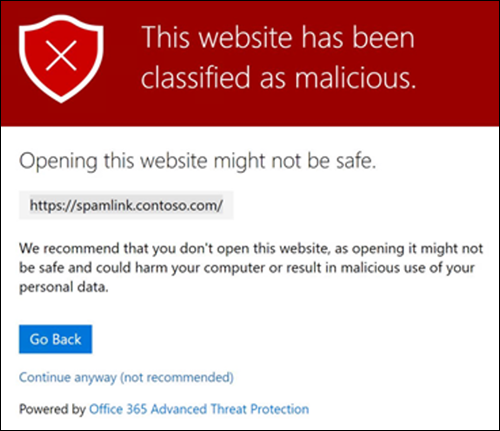
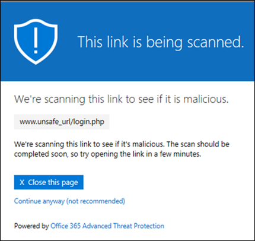
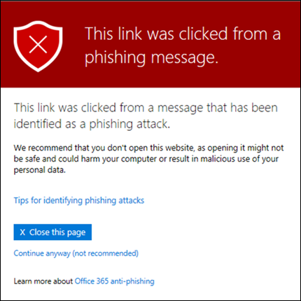
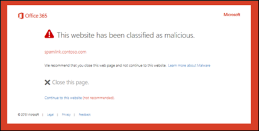

# Safe Koppelingen in Microsoft Defender voor Office 365Safe Links in Microsoft Defender for Office 365

[!INCLUDE [Microsoft 365 Defender rebranding](../includes/microsoft-defender-for-office.md)]

**Van toepassing op****Applies to**
- [Abonnement 1 en abonnement 2 voor Microsoft Defender voor Office 365Microsoft Defender for Office 365 plan 1 and plan 2](defender-for-office-365.md)
- [Microsoft 365 DefenderMicrosoft 365 Defender](../defender/microsoft-365-defender.md)

> [!IMPORTANT]
> Dit artikel is bedoeld voor zakelijke klanten die [Microsoft Defender voor Office 365](defender-for-office-365.md) hebben.This article is intended for business customers who have [Microsoft Defender for Office 365](defender-for-office-365.md). Zie Geavanceerde [Outlook.com-beveiliging](https://support.microsoft.com/office/882d2243-eab9-4545-a58a-b36fee4a46e2)als u Outlook.com, Microsoft 365 Family of Microsoft 365 Personal gebruikt en u op zoek bent naar informatie over Safelinks in Outlook.If you're using Outlook.com, Microsoft 365 Family, or Microsoft 365 Personal, and you're looking for information about Safelinks in Outlook, see [Advanced Outlook.com security](https://support.microsoft.com/office/882d2243-eab9-4545-a58a-b36fee4a46e2).

Safe Koppelingen is een functie in [Defender voor Office 365](defender-for-office-365.md) met URL's voor het scannen en herschrijven van binnenkomende e-mailberichten in de e-mailstroom en tijd-of-clickverificatie van URL's en koppelingen in e-mailberichten en andere locaties.Safe Links is a feature in [Defender for Office 365](defender-for-office-365.md) that provides URL scanning and rewriting of inbound email messages in mail flow, and time-of-click verification of URLs and links in email messages and other locations. Safe Het scannen van koppelingen vindt plaats naast de reguliere bescherming tegen spam en [anti-malware](anti-spam-and-anti-malware-protection.md) in binnenkomende e-mailberichten in Exchange Online Protection (EOP).Safe Links scanning occurs in addition to the regular [anti-spam and anti-malware protection](anti-spam-and-anti-malware-protection.md) in inbound email messages in Exchange Online Protection (EOP). Safe Met koppelingen scannen kunt u uw organisatie beschermen tegen schadelijke koppelingen die worden gebruikt bij phishing en andere aanvallen.Safe Links scanning can help protect your organization from malicious links that are used in phishing and other attacks.

Safe Koppelingenbeveiliging is beschikbaar op de volgende locaties:Safe Links protection is available in the following locations:

- **E-mailberichten:** Safe koppelingenbeveiliging voor koppelingen in e-mailberichten wordt bepaald door Safe Koppelingenbeleid.**Email messages**: Safe Links protection for links in email messages is controlled by Safe Links policies. Er is geen standaardbeleid Safe Koppelingen, dus om de beveiliging van Safe Koppelingen in e-mailberichten te krijgen, moet u een of meer Safe **Koppelingenbeleid maken.**There is no default Safe Links policy, **so to get the protection of Safe Links in email messages, you need to create one or more Safe Links policies**. Zie Beleidsregels voor [koppelingen instellen Safe Microsoft Defender voor](set-up-safe-links-policies.md)Office 365.For instructions, see [Set up Safe Links policies in Microsoft Defender for Office 365](set-up-safe-links-policies.md).

  Zie de sectie Safe Koppelingen voor e-mailberichten verder in dit artikel voor meer [informatie](#safe-links-settings-for-email-messages) over Safe koppelingenbeveiliging voor e-mailberichten.For more information about Safe Links protection for email messages, see the [Safe Links settings for email messages](#safe-links-settings-for-email-messages) section later in this article.
  
  > [!NOTE]
  > Safe Koppelingen werken niet in openbare mappen met e-mail.Safe Links does not work on mail-enabled public folders.

- **Microsoft Teams** (momenteel in TAP Preview): Safe Koppelingenbeveiliging voor koppelingen in Teams-gesprekken, groepschats of vanuit kanalen wordt ook bepaald door Safe Koppelingenbeleid.**Microsoft Teams** (currently in TAP Preview): Safe Links protection for links in Teams conversations, group chats, or from channels is also controlled by Safe Links policies. Er is geen standaardbeleid Safe Koppelingen, dus als u de beveiliging van Safe Koppelingen in Teams wilt krijgen, moet u een of meer Safe **Koppelingenbeleid maken.**There is no default Safe Links policy, **so to get the protection of Safe Links in Teams, you need to create one or more Safe Links policies**.

  Zie de instellingen Safe Koppelingen voor Microsoft Teams in dit  artikel voor meer informatie over Safe koppelingenbeveiliging in Teams pagina.For more information about Safe Links protection in Teams, see the [Safe Links settings for Microsoft Teams](#safe-links-settings-for-microsoft-teams) section later in this article.

- **Office 365 apps:** Safe koppelingenbeveiliging voor Office 365 apps is beschikbaar in ondersteunde bureaublad-, mobiele en web-apps.**Office 365 apps**: Safe Links protection for Office 365 apps is available in supported desktop, mobile, and web apps. U **configureert** Safe koppelingenbeveiliging voor Office 365 apps in de algemene instelling die buiten **het** beleid Safe Koppelingen.You **configure** Safe Links protection for Office 365 apps in the global setting that are **outside** of Safe Links policies. Zie Algemene instellingen configureren voor Safe [koppelingen in Microsoft Defender voor Office 365.](configure-global-settings-for-safe-links.md)For instructions, see [Configure global settings for Safe Links settings in Microsoft Defender for Office 365](configure-global-settings-for-safe-links.md).

  Safe Koppelingenbescherming voor Office 365-apps wordt toegepast op alle gebruikers in de organisatie die een licentie hebben voor Defender voor Office 365, ongeacht of de gebruikers zijn opgenomen in het beleid voor actieve Safe Koppelingen of niet.Safe Links protection for Office 365 apps is applied to all users in the organization who are licensed for Defender for Office 365, regardless of whether the users are included in active Safe Links policies or not.

  Zie de Safe koppelingen voor Office 365 apps verder in dit artikel voor meer informatie over Safe koppelingenbeveiliging in Office 365 [apps.](#safe-links-settings-for-office-365-apps)For more information about Safe Links protection in Office 365 apps, see the [Safe Links settings for Office 365 apps](#safe-links-settings-for-office-365-apps) section later in this article.

Dit artikel bevat gedetailleerde beschrijvingen van de volgende typen Safe Koppelingen:This article includes detailed descriptions of the following types of Safe Links settings:

- **Instellingen in Safe Koppelingenbeleid:** Deze instellingen zijn alleen van toepassing op de gebruikers die zijn opgenomen in het specifieke beleid en de instellingen kunnen verschillen tussen beleidsregels.**Settings in Safe Links policies**: These settings apply only to the users who are included in the specific policies, and the settings might be different between policies. Deze instellingen omvatten:These settings include:

  - [Safe Koppelingeninstellingen voor e-mailberichtenSafe Links settings for email messages](#safe-links-settings-for-email-messages)
  - [Safe Koppelingeninstellingen voor Microsoft TeamsSafe Links settings for Microsoft Teams](#safe-links-settings-for-microsoft-teams)
  - [Lijsten met 'De volgende URL's niet opnieuw schrijven' in Safe koppelingenbeleid"Do not rewrite the following URLs" lists in Safe Links policies](#do-not-rewrite-the-following-urls-lists-in-safe-links-policies)

- **Algemene Safe Koppelingen:** deze instellingen zijn globaal geconfigureerd, niet in Safe Koppelingenbeleid.**Global Safe Links settings**: These settings are configured globally, not in Safe Links policies. De instellingen zijn echter alleen van toepassing op gebruikers die zijn opgenomen in het actieve Safe Koppelingenbeleid.But, the settings apply only to users who are included in active Safe Links policies. Deze instellingen omvatten:These settings include:

  - [Safe Koppelingeninstellingen voor Office 365 appsSafe Links settings for Office 365 apps](#safe-links-settings-for-office-365-apps)
  - ['De volgende URL's blokkeren' voor Safe koppelingen"Block the following URLs" list for Safe Links](#block-the-following-urls-list-for-safe-links)

In de volgende tabel worden scenario's beschreven voor Safe Koppelingen in Microsoft 365- en Office 365-organisaties met Defender voor Office 365 (met andere woorden: het ontbreken van licenties is nooit een probleem in de voorbeelden).The following table describes scenarios for Safe Links in Microsoft 365 and Office 365 organizations that include Defender for Office 365 (in other words, lack of licensing is never an issue in the examples).

 

****

|ScenarioScenario|ResultaatResult|
|---|---|
|Jean is lid van de marketingafdeling.Jean is a member of the marketing department. Safe Koppelingenbeveiliging voor Office 365-apps is ingeschakeld in de algemene instellingen voor Safe Koppelingen en er bestaat een Safe-koppelingenbeleid dat van toepassing is op leden van de marketingafdeling.Safe Links protection for Office 365 apps is turned on in the global settings for Safe Links, and a Safe Links policy that applies to members of the marketing department exists. Jean opent een PowerPoint in een e-mailbericht en klikt vervolgens op een URL in de presentatie.Jean opens a PowerPoint presentation in an email message, and then clicks a URL in the presentation.|Jean wordt beveiligd door Safe koppelingen.Jean is protected by Safe Links. 
 Jean is opgenomen in een Safe koppelingenbeleid en Safe koppelingenbeveiliging voor Office 365 apps is ingeschakeld.Jean is included in a Safe Links policy, and Safe Links protection for Office 365 apps is turned on. 
 Zie de sectie Safe Koppelingen voor Office 365 apps verder in dit artikel voor meer informatie over de vereisten voor Safe koppelingenbeveiliging in Office 365 [apps.](#safe-links-settings-for-office-365-apps)For more information about the requirements for Safe Links protection in Office 365 apps, see the [Safe Links settings for Office 365 apps](#safe-links-settings-for-office-365-apps) section later in this article.|
|Chris's Microsoft 365 E5 organisatie heeft geen Safe koppelingen geconfigureerd.Chris's Microsoft 365 E5 organization has no Safe Links policies configured. Chris ontvangt een e-mail van een externe afzender met een URL naar een schadelijke website waar hij uiteindelijk op klikt.Chris receives an email from an external sender that contains a URL to a malicious website that he ultimately clicks.|Chris is niet beveiligd door Safe koppelingen.Chris is not protected by Safe Links. 
 Een beheerder moet ten minste één Safe koppelingenbeleid maken voor iedereen om de Safe koppelingen te krijgen in binnenkomende e-mailberichten.An admin must create at least one Safe Links policy for anyone to get Safe Links protection in inbound email messages. Chris moet worden opgenomen in de voorwaarden van het beleid om de Safe koppelingen te krijgen.Chris must be included in the conditions of policy to get Safe Links protection.|
|In de organisatie van Pat hebben geen beheerders een Safe Koppelingen gemaakt, maar Safe koppelingenbeveiliging voor Office 365 apps is ingeschakeld.In Pat's organization, no admins have created any Safe Links policies, but Safe Links protection for Office 365 apps is turned on. Pat opent een Word-document en klikt op een URL in het bestand.Pat opens a Word document and clicks a URL in the file.|Pat is niet beveiligd door Safe koppelingen.Pat is not protected by Safe Links. 
 Hoewel Safe koppelingenbeveiliging voor Office 365-apps globaal is ingeschakeld, is Pat niet opgenomen in een actief Safe-koppelingenbeleid, dus de beveiliging kan niet worden toegepast.Although Safe Links protection for Office 365 apps is turned on globally, Pat is not included in any active Safe Links policies, so the protection can't be applied.|
|In de organisatie van Lee is geconfigureerd in de lijst De volgende URL's blokkeren in de algemene instellingen voor `https://tailspintoys.com` Safe Koppelingen. In Lee's organization, `https://tailspintoys.com` is configured in the **Block the following URLs** list in the global settings for Safe Links. Er Safe beleid voor koppelingen met Lee al bestaan.A Safe Links policy that includes Lee already exists. Lee ontvangt een e-mailbericht met de `https://tailspintoys.com/aboutus/trythispage` URL.Lee receives an email message that contains the URL `https://tailspintoys.com/aboutus/trythispage`. Lee klikt op de URL.Lee clicks the URL.|De URL wordt mogelijk automatisch geblokkeerd voor Lee. dit hangt af van de URL-vermelding in de lijst en de e-mailclient die Lee heeft gebruikt.The URL might be automatically blocked for Lee; it depends on the URL entry in the list and the email client Lee used. Zie de lijst ['De](#block-the-following-urls-list-for-safe-links) volgende URL's blokkeren' voor Safe sectie Koppelingen verderop in dit artikel voor meer informatie.For more information, see the ["Block the following URLs" list for Safe Links](#block-the-following-urls-list-for-safe-links) section later in this article.|
|Jamie en Julia werken beide voor contoso.com.Jamie and Julia both work for contoso.com. Lange tijd geleden hebben beheerders het Safe koppelingen ingesteld die van toepassing zijn op zowel Jamie als Julia.A long time ago, admins configured Safe Links policies that apply to both of Jamie and Julia. Jamie stuurt een e-mail naar Julia, niet wetende dat de e-mail een schadelijke URL bevat.Jamie sends an email to Julia, not knowing that the email contains a malicious URL.|Julia wordt beveiligd door Safe koppelingen **als** het Safe koppelingenbeleid dat op haar van toepassing is, is geconfigureerd voor berichten tussen interne geadresseerden.Julia is protected by Safe Links **if** the Safe Links policy that applies to her is configured to apply to messages between internal recipients. Zie de sectie Koppelingen [Safe voor](#safe-links-settings-for-email-messages) e-mailberichten verder in dit artikel voor meer informatie.For more information, see the [Safe Links settings for email messages](#safe-links-settings-for-email-messages) section later in this article.|
|

## Safe Koppelingeninstellingen voor e-mailberichtenSafe Links settings for email messages

Safe Koppelingen scant inkomende e-mail op bekende schadelijke hyperlinks.Safe Links scans incoming email for known malicious hyperlinks. Gescande URL's worden herschreven met het standaard-URL-voorvoegsel van Microsoft: `https://nam01.safelinks.protection.outlook.com` .Scanned URLs are rewritten using the Microsoft standard URL prefix: `https://nam01.safelinks.protection.outlook.com`. Nadat de koppeling is herschreven, wordt deze geanalyseerd op potentieel schadelijke inhoud.After the link is rewritten, it's analyzed for potentially malicious content.

Nadat Safe een URL opnieuw hebt geschreven, blijft de URL herschreven, zelfs als het bericht handmatig wordt doorgestuurd of beantwoord (zowel naar interne als externe geadresseerden). After Safe Links rewrites a URL, the URL remains rewritten even if the message is *manually* forwarded or replied to (both to internal and external recipients). Aanvullende koppelingen die worden toegevoegd aan het doorgestuurde of beantwoorde bericht, worden niet opnieuw geschreven.Additional links that are added to the forwarded or replied to message are not rewritten. In het geval  van automatisch doorsturen door Postvak IN-regels of SMTP-doorsturen, wordt de URL  echter niet opnieuw geschreven in het bericht dat is bedoeld voor de uiteindelijke geadresseerde, tenzij deze geadresseerde ook is beveiligd door Safe Koppelingen of de URL al in een eerdere communicatie is herschreven.However, in the case of *automatic* forwarding by Inbox rules or SMTP forwarding, the URL will not be rewritten in the message that's intended for the final recipient *unless* that recipient is also protected by Safe Links or the URL had already been rewritten in a previous communication. 

De instellingen in Safe koppelingen die van toepassing zijn op e-mailberichten, worden in de volgende lijst beschreven:The settings in Safe Links policies that apply to email messages are described in the following list:

- **Selecteer de actie voor onbekende potentieel schadelijke URL's in berichten:** Hiermee kunt u koppelingen in- Safe in e-mailberichten in- of uitschakelen.**Select the action for unknown potentially malicious URLs in messages**: Enables or disables Safe Links scanning in email messages. De aanbevolen waarde is **Aan**.The recommended value is **On**. Als u deze instelling in te stellen, worden de volgende acties als resultaat genomen.Turning on this setting results in the following actions.

  - Safe Het scannen van koppelingen is ingeschakeld in Outlook (C2R) op Windows.Safe Links scanning is enabled in Outlook (C2R) on Windows.
  - URL's worden herschreven en gebruikers worden omgeleid via Safe koppelingenbeveiliging wanneer ze op URL's in berichten klikken.URLs are rewritten and users are routed through Safe Links protection when they click URLs in messages.
  - Wanneer erop wordt geklikt, worden URL's gecontroleerd op een lijst met bekende kwaadaardige URL's en de lijst 'De volgende [URL's blokkeren'.](#block-the-following-urls-list-for-safe-links)When clicked, URLs are checked against a list of known malicious URLs and the ["Block the following URLs" list](#block-the-following-urls-list-for-safe-links).
  - URL's die geen geldige reputatie hebben, worden asynchroon op de achtergrond tot ontploffing gebracht.URLs that don't have a valid reputation are detonated asynchronously in the background.

- **Realtime URL-scan toepassen** op verdachte koppelingen en koppelingen die naar bestanden wijzen: Hiermee kunt u in realtime koppelingen scannen, inclusief koppelingen in e-mailberichten die naar downloadbare inhoud wijzen.**Apply real-time URL scanning for suspicious links and links that point to files**: Enables real-time scanning of links, including links in email messages that point to downloadable content. De aanbevolen waarde is ingeschakeld.The recommended value is enabled.
  - **Wacht totdat URL-scannen is voltooid voordat u het bericht bezorgt:****Wait for URL scanning to complete before delivering the message**:
    - Ingeschakeld: Berichten die URL's bevatten, worden opgeslagen totdat het scannen is voltooid.Enabled: Messages that contain URLs are held until scanning is finished. Berichten worden alleen bezorgd nadat is bevestigd dat de URL's veilig zijn.Messages are delivered only after the URLs are confirmed to be safe. Dit is de aanbevolen waarde.This is the recommended value.
    - Uitgeschakeld: Als URL-scannen niet kan worden voltooid, bezorgt u het bericht toch.Disabled: If URL scanning can't complete, deliver the message anyway.

- **Safe** Koppelingen toepassen op e-mailberichten die binnen de organisatie worden verzonden: Hiermee kunt u Safe Koppelingen scannen op berichten die tussen interne afzenders en interne geadresseerden binnen dezelfde organisatie Exchange Online worden verzonden.**Apply Safe Links to email messages sent within the organization**: Enables or disables Safe Links scanning on messages sent between internal senders and internal recipients within the same Exchange Online organization. De aanbevolen waarde is ingeschakeld.The recommended value is enabled.

- **Gebruikersklikken niet bijhouden:** Hiermee kunt u het opslaan van koppelingen in- of uitschakelen Safe klikken op gegevens voor URL's die in e-mailberichten zijn geklikt.**Do not track user clicks**: Enables or disables storing Safe Links click data for URLs clicked in email messages. De aanbevolen waarde is om deze instelling niet geselecteerd te laten (om klikken van gebruikers bij te houden).The recommend value is to leave this setting unselected (to track user clicks).

  URL-klik op bijhouden voor koppelingen in e-mailberichten die tussen interne afzenders en interne geadresseerden worden verzonden, wordt momenteel niet ondersteund.URL click tracking for links in email messages sent between internal senders and internal recipients is currently not supported.

- **Gebruikers mogen niet doorklikken** naar de oorspronkelijke URL: Hiermee  kunnen gebruikers niet door de waarschuwingspagina naar de oorspronkelijke URL klikken.**Do not allow users to click through to original URL**: Allows or blocks users from clicking through the [warning page](#warning-pages-from-safe-links) to the original URL. De aanbevolen waarde is ingeschakeld.The recommend value is enabled.

- **De huisstijl van de organisatie weergeven op meldings-** en waarschuwingspagina's: deze optie toont de huisstijl van uw organisatie op waarschuwingspagina's.**Display the organization branding on notification and warning pages**: This option shows your organization's branding on warning pages. Met huisstijl kunnen gebruikers legitieme waarschuwingen identificeren, omdat standaardwaarschuwingspagina's van Microsoft vaak worden gebruikt door aanvallers.Branding helps users identify legitimate warnings, because default Microsoft warning pages are often used by attackers. Zie Het thema Microsoft 365 uw organisatie aanpassen voor meer informatie over [aangepaste huisstijl.](../../admin/setup/customize-your-organization-theme.md)For more information about customized branding, see [Customize the Microsoft 365 theme for your organization](../../admin/setup/customize-your-organization-theme.md).

- **De volgende URL's niet opnieuw schrijven:** URL's blijven zoals ze zijn.**Do not rewrite the following URLs**: Leaves URLs as they are. Er wordt een aangepaste lijst met veilige URL's bijhoudt die niet hoeven te worden gescand.Keeps a custom list of safe URLs that don't need scanning. De lijst is uniek voor elk Safe koppelingenbeleid.The list is unique for each Safe Links policy. Zie de sectie  'De volgende URL's niet herschrijven' in de sectie Beleidsregels voor [Safe Koppelingen](#do-not-rewrite-the-following-urls-lists-in-safe-links-policies) verder in dit artikel voor meer informatie over de lijst Niet opnieuw schrijven van de volgende URL's.For more information about the **Do not rewrite the following URLs** list, see the ["Do not rewrite the following URLs" lists in Safe Links policies](#do-not-rewrite-the-following-urls-lists-in-safe-links-policies) section later in this article.

  Zie voor meer informatie over de aanbevolen waarden voor standaard- en strikte beleidsinstellingen voor Safe koppelingenbeleid Safe [Beleidsinstellingen voor koppelingen](recommended-settings-for-eop-and-office365.md#safe-links-policy-settings).For more information about the recommended values for Standard and Strict policy settings for Safe Links policies, see [Safe Links policy settings](recommended-settings-for-eop-and-office365.md#safe-links-policy-settings).

- **Filters voor geadresseerden:** u moet de voorwaarden en uitzonderingen voor de geadresseerde opgeven die bepalen op wie het beleid van toepassing is.**Recipient filters**: You need to specify the recipient conditions and exceptions that determine who the policy applies to. U kunt deze eigenschappen gebruiken voor voorwaarden en uitzonderingen:You can use these properties for conditions and exceptions:
  - **De geadresseerde is****The recipient is**
  - **Het domein van de geadresseerde is****The recipient domain is**
  - **De geadresseerde is lid van****The recipient is a member of**

  U kunt een voorwaarde of uitzondering maar één keer gebruiken, maar de voorwaarde of uitzondering kan meerdere waarden bevatten.You can only use a condition or exception once, but the condition or exception can contain multiple values. Meerdere waarden van dezelfde voorwaarde of uitzondering: gebruik OF-logica (bijvoorbeeld: _\<recipient1\>_ of _\<recipient2\>_).Multiple values of the same condition or exception use OR logic (for example, _\<recipient1\>_ or _\<recipient2\>_). Verschillende voorwaarden of uitzonderingen: gebruik EN-logica (bijvoorbeeld: _\<recipient1\>_ en _\<member of group 1\>_).Different conditions or exceptions use AND logic (for example, _\<recipient1\>_ and _\<member of group 1\>_).

- **Prioriteit:** Als u meerdere beleidsregels maakt, kunt u de volgorde opgeven waarin ze worden toegepast.**Priority**: If you create multiple policies, you can specify the order that they're applied. Twee beleidsregels kunnen niet dezelfde prioriteit hebben en de verwerking van het beleid stopt nadat het eerste beleid is toegepast.No two policies can have the same priority, and policy processing stops after the first policy is applied.

  Voor meer informatie over de prioriteitvolgorde en het evalueren en toepassen van een beleid, raadpleegt u [volgorde en prioriteit van e-mailbeveiliging](how-policies-and-protections-are-combined.md).For more information about the order of precedence and how multiple policies are evaluated and applied, see [Order and precedence of email protection](how-policies-and-protections-are-combined.md).
  
### Hoe Safe koppelingen werkt in e-mailberichtenHow Safe Links works in email messages

Op hoog niveau werkt de beveiliging van Safe koppelingen op URL's in e-mailberichten als volgende:At a high level, here's how Safe Links protection works on URLs in email messages:

1. Alle e-mail gaat via EOP, waar internetprotocol- en envelopfilters, malwarebeveiliging op basis van handtekeningen, antispam en anti-malwarefilters worden gebruikt voordat het bericht wordt bezorgd in het postvak van de geadresseerde.All email goes through EOP, where internet protocol (IP) and envelope filters, signature-based malware protection, anti-spam and anti-malware filters before the message is delivered to the recipient's mailbox.

2. De gebruiker opent het bericht in zijn postvak en klikt op een URL in het bericht.The user opens the message in their mailbox and clicks on a URL in the message.

3. Safe Koppelingen controleren onmiddellijk de URL voordat u de website opent:Safe Links immediately checks the URL before opening the website:

   - Als de URL is opgenomen in de lijst **De volgende URL's** blokkeren, wordt een [geblokkeerde URL-waarschuwing](#blocked-url-warning) geopend.If the URL is included in the **Block the following URLs** list, a [blocked URL warning](#blocked-url-warning) opens.

   - Als de URL naar een website wijst die schadelijk is, wordt er een waarschuwingspagina voor schadelijke [websites](#malicious-website-warning) (of een andere waarschuwingspagina) geopend.If the URL points to a website that has been determined to be malicious, a [malicious website warning](#malicious-website-warning) page (or a different warning page) opens.

   - Als de URL naar een downloadbaar bestand wijst en het scannen van **url's in realtime** toepassen op verdachte koppelingen en koppelingen naar de instelling voor bestanden is ingeschakeld in het beleid dat van toepassing is op de gebruiker, wordt het downloadbare bestand ingeschakeld.If the URL points to a downloadable file, and the **Apply real-time URL scanning for suspicious links and links that point to files** setting is enabled in the policy that applies to the user, the downloadable file is checked.

   - Als de URL veilig is, wordt de website geopend.If the URL is determined to be safe, the website opens.

## Safe Koppelingeninstellingen voor Microsoft TeamsSafe Links settings for Microsoft Teams

> [!IMPORTANT]
> Vanaf maart 2020 is deze functie beschikbaar in Preview en is alleen beschikbaar voor leden van het Microsoft Teams Technology Adoption Program (TAP).As of March 2020, this feature is in Preview and is available only to members of the Microsoft Teams Technology Adoption Program (TAP). Voor meer informatie over de releaseplanning raadpleegt u [de Microsoft 365 roadmap](https://www.microsoft.com/microsoft-365/roadmap?rtc=1&filters=&searchterms=Safe%2CLinks%2CProtection%2Cfor%2CMicrosoft%2CTeams).For information about the release schedule, check out the [Microsoft 365 roadmap](https://www.microsoft.com/microsoft-365/roadmap?rtc=1&filters=&searchterms=Safe%2CLinks%2CProtection%2Cfor%2CMicrosoft%2CTeams).

U schakelt de beveiliging van Safe koppelingen in of uit voor Microsoft Teams in Safe koppelingenbeleid.You enable or disable Safe Links protection for Microsoft Teams in Safe Links policies. In het bijzonder gebruikt u de actie Selecteren voor onbekende of potentieel schadelijke **URL's binnen Microsoft Teams** instelling.Specifically, you use the **Select the action for unknown or potentially malicious URLs within Microsoft Teams** setting. De aanbevolen waarde is **Aan**.The recommended value is **On**.

De volgende instellingen in Safe Koppelingenbeleid dat van toepassing is op koppelingen in e-mailberichten, zijn ook van toepassing op koppelingen in Teams:The following settings in Safe Links policies that apply to links in email messages also apply to links in Teams:

- **Realtime URL-scan toepassen op verdachte koppelingen en koppelingen die naar bestanden wijzen****Apply real-time URL scanning for suspicious links and links that point to files**
- **Gebruikersklikken niet bijhouden****Do not track user clicks**
- **Gebruikers niet toestaan door te klikken naar de oorspronkelijke URL****Do not allow users to click through to original URL**

Deze instellingen worden eerder uitgelegd in [Safe Instellingen voor koppelingen voor e-mailberichten.](#safe-links-settings-for-email-messages)These settings are explained previously in [Safe Links settings for email messages](#safe-links-settings-for-email-messages).

Nadat u Safe Koppelingenbeveiliging voor Microsoft Teams hebt ingeschakeld, worden URL's in Teams gecontroleerd op een lijst met bekende schadelijke koppelingen wanneer de beveiligde gebruiker op de koppeling klikt (time-of-click protection).After you turn on Safe Links protection for Microsoft Teams, URLs in Teams are checked against a list of known malicious links when the protected user clicks the link (time-of-click protection). URL's worden niet herschreven.URLs are not rewritten. Als een koppeling schadelijk blijkt te zijn, hebben gebruikers de volgende ervaringen:If a link is found to be malicious, users will have the following experiences:

- Als op de koppeling is geklikt in een Teams gesprek, groepschat of via kanalen, wordt de waarschuwingspagina zoals weergegeven in de onderstaande schermafbeelding weergegeven in de standaardwebbrowser.If the link was clicked in a Teams conversation, group chat, or from channels, the warning page as shown in the screenshot below will appear in the default web browser.
- Als op de koppeling is geklikt vanaf een vastgemaakt tabblad, wordt de waarschuwingspagina weergegeven in de Teams interface op dat tabblad. De optie om de koppeling in een webbrowser te openen, is uitgeschakeld om beveiligingsredenen.If the link was clicked from a pinned tab, the warning page will appear in the Teams interface within that tab. The option to open the link in a web browser is disabled for security reasons.
- Afhankelijk van de manier waarop gebruikers niet mogen doorklikken naar de oorspronkelijke **URL-instelling** in het beleid, kan de gebruiker wel of niet doorklikken naar de oorspronkelijke URL ( Toch doorgaan **(niet aanbevolen)** in de schermafbeelding).Depending on how the **Do not allow users to click through to original URL** setting in the policy is configured, the user will or will not be allowed to click through to the original URL (**Continue anyway (not recommended)** in the screenshot). U wordt aangeraden de instelling Gebruikers **niet** toestaan door te klikken naar de oorspronkelijke URL-instelling, zodat gebruikers niet door kunnen klikken naar de oorspronkelijke URL.We recommend that you enable the **Do not allow users to click through to original URL** setting so users can't click through to the original URL.

Als de gebruiker die de koppeling heeft verzonden, niet is opgenomen in een Safe-koppelingsbeleid waarin Teams-beveiliging is ingeschakeld, kan de gebruiker doorklikken naar de oorspronkelijke URL op zijn of haar computer of apparaat.If the user who sent the link isn't included in a Safe Links policy where Teams protection is enabled, the user is free to click through to the original URL on their computer or device.

Als u op **de knop Teruggaan op** de waarschuwingspagina klikt, wordt de gebruiker terug naar de oorspronkelijke context of URL-locatie.Clicking the **Go Back** button on the warning page will return the user to their original context or URL location. Als u echter nogmaals op de oorspronkelijke koppeling klikt, Safe koppelingen de URL opnieuw scannen, zodat de waarschuwingspagina opnieuw wordt weergegeven.However, clicking on the original link again will cause Safe Links to rescan the URL, so the warning page will reappear.

### Hoe Safe koppelingen werken in TeamsHow Safe Links works in Teams

Op een hoog niveau werkt Safe koppelingen voor URL's in Microsoft Teams:At a high level, here's how Safe Links protection works for URLs in Microsoft Teams:

1. Een gebruiker start de Teams app.A user starts the Teams app.

2. Microsoft 365 controleert of de organisatie van de gebruiker Microsoft Defender voor Office 365 bevat en dat de gebruiker is opgenomen in een actief Safe-koppelingenbeleid waarin beveiliging voor Microsoft Teams is ingeschakeld.Microsoft 365 verifies that the user's organization includes Microsoft Defender for Office 365, and that the user is included in an active Safe Links policy where protection for Microsoft Teams is enabled.

3. URL's worden gevalideerd op het moment van klikken voor de gebruiker in chats, groepschats, kanalen en tabbladen.URLs are validated at the time of click for the user in chats, group chats, channels, and tabs.

## Safe Koppelingeninstellingen voor Office 365 appsSafe Links settings for Office 365 apps

Safe Koppelingenbeveiliging voor Office 365 apps controleert koppelingen in Office-documenten, niet koppelingen in e-mailberichten (maar het kan koppelingen controleren in bijgevoegde Office documenten in e-mailberichten nadat het document is geopend).Safe Links protection for Office 365 apps checks links in Office documents, not links in email messages (but it can check links in attached Office documents in email messages after the document is opened).

Safe Koppelingenbeveiliging voor Office 365 apps heeft de volgende clientvereisten:Safe Links protection for Office 365 apps has the following client requirements:

- Microsoft 365-apps of Microsoft 365 Business Premium.Microsoft 365 Apps or Microsoft 365 Business Premium.
  - Huidige versies van Word, Excel en PowerPoint op Windows, Mac of in een webbrowser.Current versions of Word, Excel, and PowerPoint on Windows, Mac, or in a web browser.
  - Office apps op iOS- of Android-apparaten.Office apps on iOS or Android devices.
  - Visio op Windows.Visio on Windows.
  - OneNote in een webbrowser.OneNote in a web browser.

- Office 365 apps zijn geconfigureerd voor moderne verificatie.Office 365 apps are configured to use modern authentication. Zie Hoe moderne verificatie werkt Office [2013, Office 2016 en Office 2019 client-apps](../../enterprise/modern-auth-for-office-2013-and-2016.md)voor meer informatie.For more information, see [How modern authentication works for Office 2013, Office 2016, and Office 2019 client apps](../../enterprise/modern-auth-for-office-2013-and-2016.md).

- Gebruikers zijn aangemeld met hun werk- of schoolaccounts.Users are signed in using their work or school accounts. Zie Aanmelden bij [Office.](https://support.microsoft.com/office/b9582171-fd1f-4284-9846-bdd72bb28426)For more information, see [Sign in to Office](https://support.microsoft.com/office/b9582171-fd1f-4284-9846-bdd72bb28426).

U configureert Safe koppelingenbeveiliging voor Office 365 apps in de algemene instellingen voor Safe koppelingen, niet in Safe koppelingenbeleid.You configure Safe Links protection for Office 365 apps in the global settings for Safe Links, not in Safe Links policies. De beveiliging wordt toegepast op alle gebruikers in de organisatie die een licentie hebben voor Defender voor Office 365, ongeacht of de gebruikers zijn opgenomen in het beleid voor actieve Safe Koppelingen of niet.The protection is applied to all users in the organization who are licensed for Defender for Office 365, regardless of whether the users are included in active Safe Links policies or not.

De volgende Safe koppelingen zijn beschikbaar voor Office 365 apps:The following Safe Links settings are available for Office 365 apps:

- **Office 365 toepassingen:** Hiermee schakelt u het scannen Safe koppelingen in ondersteunde Office 365 uit.**Office 365 applications**: Enables or disables Safe Links scanning in supported Office 365 apps. De standaardwaarde en aanbevolen waarde is **Aan**.The default and recommended value is **On**.

- Niet bijhouden wanneer gebruikers op Safe Koppelingen **klikken:** Het opslaan van Safe Koppelingen wordt in- of uitgeschakeld op gegevens voor URL's waarop in de bureaubladversies word, Excel, PowerPoint en Visio.**Do not track when users click Safe Links**: Enables or disables storing Safe Links click data for URLs clicked in the desktop versions Word, Excel, PowerPoint, and Visio. De aanbevolen waarde is **Uit,** wat betekent dat gebruikersklikken worden bijgespoord.The recommended value is **Off**, which means user clicks are tracked.

- **Laat gebruikers niet** door veilige koppelingen naar de oorspronkelijke URL klikken: hiermee kunnen gebruikers niet door de waarschuwingspagina klikken naar de oorspronkelijke URL in de bureaubladversies word, Excel, PowerPoint en Visio. **Do not let users click through safe links to original URL**: Allows or blocks users from clicking through the [warning page](#warning-pages-from-safe-links) to the original URL in in the desktop versions Word, Excel, PowerPoint, and Visio. De standaardwaarde en aanbevolen waarde is **Aan**.The default and recommended value is **On**.

Als u de instellingen voor Safe koppelingen voor Office 365 apps wilt configureren, gaat u naar Beveiliging Safe koppelingen configureren [voor Office 365 apps.](configure-global-settings-for-safe-links.md#configure-safe-links-protection-for-office-365-apps-in-the-security--compliance-center)To configure the Safe Links settings for Office 365 apps, see [Configure Safe Links protection for Office 365 apps](configure-global-settings-for-safe-links.md#configure-safe-links-protection-for-office-365-apps-in-the-security--compliance-center).

Zie Algemene instellingen voor Safe koppelingen voor meer informatie over de aanbevolen waarden [voor standaard- en strikte beleidsinstellingen.](recommended-settings-for-eop-and-office365.md#global-settings-for-safe-links)For more information about the recommended values for Standard and Strict policy settings, see [Global settings for Safe Links](recommended-settings-for-eop-and-office365.md#global-settings-for-safe-links).

### Hoe Safe koppelingen werken in Office 365 appsHow Safe Links works in Office 365 apps

Op hoog niveau werkt Safe koppelingenbeveiliging voor URL's in Office 365 apps.At a high level, here's how Safe Links protection works for URLs in Office 365 apps. De ondersteunde Office 365 apps worden beschreven in de vorige sectie.The supported Office 365 apps are described in the previous section.

1. Een gebruiker meldt zich aan met zijn of haar werk- of schoolaccount in een organisatie met Microsoft 365-apps of Microsoft 365 Business Premium.A user signs in using their work or school account in an organization that includes Microsoft 365 Apps or Microsoft 365 Business Premium.

2. De gebruiker wordt geopend en klikt op een koppeling Office document in een ondersteunde Office-app.The user opens and clicks on a link an Office document in a supported Office app.

3. Safe Koppelingen controleren onmiddellijk de URL voordat u de doelwebsite opent:Safe Links immediately checks the URL before opening the target website:

   - Als de URL is opgenomen in de lijst die het  scannen van koppelingen Safe (de lijst De volgende URL's blokkeren) wordt een geblokkeerde [URL-waarschuwingspagina](#blocked-url-warning) geopend.If the URL is included in the list that skips Safe Links scanning (the **Block the following URLs** list) a [blocked URL warning](#blocked-url-warning) page opens.

   - Als de URL naar een website wijst die schadelijk is, wordt er een waarschuwingspagina voor schadelijke [websites](#malicious-website-warning) (of een andere waarschuwingspagina) geopend.If the URL points to a website that has been determined to be malicious, a [malicious website warning](#malicious-website-warning) page (or a different warning page) opens.

   - Als de URL naar een downloadbaar bestand wijst en het beleid voor Safe-koppelingen dat van toepassing is op de gebruiker is geconfigureerd voor het scannen van koppelingen naar downloadbare inhoud ( Realtime **URL-scan** toepassen op verdachte koppelingen en koppelingen die naar bestanden wijzen), wordt het downloadbare bestand ingeschakeld.If the URL points to a downloadable file, and the Safe Links policy that applies to the user is configured to scan links to downloadable content (**Apply real-time URL scanning for suspicious links and links that point to files**), the downloadable file is checked.

   - Als de URL als veilig wordt beschouwd, wordt de gebruiker naar de website overgebracht.If the URL is considered safe, the user is taken to the website.

   - Als Safe koppelingen scannen niet kan worden voltooid, wordt Safe koppelingenbeveiliging niet triggert.If Safe Links scanning is unable to complete, Safe Links protection does not trigger. In Office desktopcl clients wordt de gebruiker gewaarschuwd voordat hij of zij naar de doelwebsite gaat.In Office desktop clients, the user will be warned before they proceed to the destination website.

> [!NOTE]
> Het kan enkele seconden duren aan het begin van elke sessie om te controleren of de gebruiker koppelingen Safe voor Office ingeschakeld.It may take several seconds at the beginning of each session to verify that the user has Safe Links for Office enabled.

## 'De volgende URL's blokkeren' voor Safe koppelingen"Block the following URLs" list for Safe Links

In **de lijst De volgende URL's** blokkeren worden de koppelingen definieerd die altijd worden geblokkeerd door Safe Koppelingen scannen op de volgende locaties:The **Block the following URLs** list defines the links that are always blocked by Safe Links scanning in the following locations:

- E-mailberichten.Email messages.
- Documenten in Office 365 apps in Windows mac.Documents in Office 365 apps in Windows and Mac.
- Documenten in Office voor iOS en Android.Documents in Office for iOS and Android.

Wanneer een gebruiker in een actief Safe koppelingenbeleid op een geblokkeerde koppeling in een ondersteunde app klikt, worden deze naar de waarschuwingspagina voor geblokkeerde [URL's](#blocked-url-warning) geplaatst.When a user in an active Safe Links policy clicks a blocked link in a supported app, they're taken to the [Blocked URL warning](#blocked-url-warning) page.

U configureert de lijst met URL's in de algemene instellingen voor Safe koppelingen.You configure the list of URLs in the global settings for Safe Links. Zie De lijst ['De volgende URL's blokkeren' configureren](configure-global-settings-for-safe-links.md#configure-the-block-the-following-urls-list-in-the-security--compliance-center)voor instructies.For instructions, see [Configure the "Block the following URLs" list](configure-global-settings-for-safe-links.md#configure-the-block-the-following-urls-list-in-the-security--compliance-center).

**Opmerkingen**:**Notes**:

- Zie De lijst tenant [toestaan/blokkeren](tenant-allow-block-list.md)beheren voor een werkelijk universele lijst met URL's die overal worden geblokkeerd.For a truly universal list of URLs that are blocked everywhere, see [Manage the Tenant Allow/Block List](tenant-allow-block-list.md).
- Limieten voor **de lijst Met de volgende URL's** blokkeren:Limits for the **Block the following URLs** list:
  - Het maximum aantal vermeldingen is 500.The maximum number of entries is 500.
  - De maximale lengte van een item is 128 tekens.The maximum length of an entry is 128 characters.
  - Alle vermeldingen mogen niet meer dan 10.000 tekens bevatten.All of the entries can't exceed 10,000 characters.
- Voeg geen slash () toe aan het `/` einde van de URL.Don't include a forward slash (`/`) at the end of the URL. Gebruik bijvoorbeeld `https://www.contoso.com` , niet `https://www.contoso.com/` .For example, use `https://www.contoso.com`, not `https://www.contoso.com/`.
- Een domein-alleen-URL (bijvoorbeeld `contoso.com` of ) blokkeert elke URL die het domein `tailspintoys.com` bevat.A domain only-URL (for example `contoso.com` or `tailspintoys.com`) will block any URL that contains the domain.
- U kunt een subdomein blokkeren zonder het volledige domein te blokkeren.You can block a subdomain without blocking the full domain. Blokkeert bijvoorbeeld een URL die het subdomein bevat, maar geen URL's die het volledige domein `toys.contoso.com*` `contoso.com` bevatten.For example, `toys.contoso.com*` blocks any URL that contains the subdomain, but it doesn't block URLs that contain the full domain `contoso.com`.
- U kunt maximaal drie jokertekens `*` () per URL-vermelding opnemen.You can include up to three wildcards (`*`) per URL entry.

### Syntaxis van invoer voor de lijst 'De volgende URL's blokkeren'Entry syntax for the "Block the following URLs" list

Voorbeelden van de waarden die u kunt invoeren en de resultaten daarvan worden in de volgende tabel beschreven:Examples of the values that you can enter and their results are described in the following table:

 

****

|WaardeValue|ResultaatResult|
|---|---|
|`contoso.com` 
 ofor 
 `*contoso.com*`|Blokkeert het domein, subdomeinen en paden.Blocks the domain, subdomains, and paths. Bijvoorbeeld, `https://www.contoso.com` en `https://sub.contoso.com` worden `https://contoso.com/abc` geblokkeerd.For example, `https://www.contoso.com`, `https://sub.contoso.com`, and `https://contoso.com/abc` are blocked.|
|`https://contoso.com/a`|Blokken, `https://contoso.com/a` maar geen extra subpaden zoals `https://contoso.com/a/b` .Blocks `https://contoso.com/a` but not additional subpaths like `https://contoso.com/a/b`.|
|`https://contoso.com/a*`|Blokken `https://contoso.com/a` en extra subpaden zoals `https://contoso.com/a/b` .Blocks `https://contoso.com/a` and additional subpaths like `https://contoso.com/a/b`.|
|`https://toys.contoso.com*`|Hiermee blokkeert u een subdomein `toys` (in dit voorbeeld), maar kunt u klikken op andere domein-URL's (zoals `https://contoso.com` of `https://home.contoso.com` ).Blocks a subdomain (`toys` in this example) but allow clicks to other domain URLs (like `https://contoso.com` or `https://home.contoso.com`).|
|

## Lijsten met 'De volgende URL's niet opnieuw schrijven' in Safe koppelingenbeleid"Do not rewrite the following URLs" lists in Safe Links policies

> [!NOTE]
> Als uw organisatie gebruik Safe koppelingenbeleid, zijn de volgende **URL'slijsten** niet opnieuw schrijven de enige ondersteunde methode voor phishingtests van derden.If your organization use Safe Links policies, the **Do not rewrite the following URLs** lists are the only supported method for third party phishing tests.

Elk Safe koppelingenbeleid bevat de volgende **URL's** die u kunt gebruiken om URL's op te geven die niet worden herschreven door het scannen Safe koppelingen.Each Safe Links policy contains a **Do not rewrite the following URLs** list that you can use to specify URLs that are not rewritten by Safe Links scanning. Met andere woorden, met de lijst kunnen gebruikers die zijn opgenomen in het beleid, toegang krijgen tot de opgegeven URL's die anders zouden worden geblokkeerd door Safe Koppelingen.In other words, the list allows users who are included in the policy to access the specified URLs that would otherwise be blocked by Safe Links. U kunt verschillende lijsten configureren in verschillende Safe koppelingenbeleid.You can configure different lists in different Safe Links policies. De beleidsverwerking stopt nadat het eerste beleid (waarschijnlijk de hoogste prioriteit) is toegepast op de gebruiker.Policy processing stops after the first (likely, the highest priority) policy is applied to the user. De volgende  URL'slijst niet opnieuw schrijven, wordt dus toegepast op een gebruiker die is opgenomen in meerdere actieve Safe Koppelingenbeleid.So, only one **Do not rewrite the following URLs** list is applied to a user who is included in multiple active Safe Links policies.

Zie Beleidsregels voor koppelingen maken Safe Koppelingen maken of  Beleidsregels wijzigen Safe koppelingen als u items wilt toevoegen aan de lijst in nieuwe of bestaande Safe [koppelingenbeleid.](set-up-safe-links-policies.md#use-the-security--compliance-center-to-modify-safe-links-policies)To add entries to the list in new or existing Safe Links policies, see [Create Safe Links policies](set-up-safe-links-policies.md#use-the-security--compliance-center-to-create-safe-links-policies) or [Modify Safe Links policies](set-up-safe-links-policies.md#use-the-security--compliance-center-to-modify-safe-links-policies).

**Opmerkingen**:**Notes**:

- De volgende clients herkennen de lijst Niet opnieuw schrijven van de volgende **URL's** in Safe Koppelingenbeleid.The following clients don't recognize the **Do not rewrite the following URLs** lists in Safe Links policies. Gebruikers die zijn opgenomen in de politie kunnen worden geblokkeerd voor toegang tot de URL's op basis van de resultaten van Safe Koppelingen scannen in deze clients:Users included in the polices can be blocked from accessing the URLs based on the results of Safe Links scanning in these clients:
  - Microsoft TeamsMicrosoft Teams
  - Office web-appsOffice web apps

  Zie De lijst tenant toestaan/blokkeren beheren voor een werkelijk universele lijst met URL's die overal [zijn toegestaan.](tenant-allow-block-list.md)For a truly universal list of URLs that are allowed everywhere, see [Manage the Tenant Allow/Block List](tenant-allow-block-list.md).

- U kunt veelgebruikte interne URL's toevoegen aan de lijst om de gebruikerservaring te verbeteren.Consider adding commonly used internal URLs to the list to improve the user experience. Als u bijvoorbeeld on-premises services hebt, zoals Skype voor Bedrijven of SharePoint, kunt u deze URL's toevoegen om ze uit te sluiten van scannen.For example, if you have on-premises services, such as Skype for Business or SharePoint, you can add those URLs to exclude them from scanning.
- Als u de volgende **URL's** in uw Safe-koppelingenbeleid niet opnieuw hebt geschreven, controleert u de lijsten en voegt u indien nodig jokertekens toe.If you already have **Do not rewrite the following URLs** entries in your Safe Links policies, be sure to review the lists and add wildcards as required. Uw lijst heeft bijvoorbeeld een vermelding zoals `https://contoso.com/a` en u besluit later subpathen zoals `https://contoso.com/a/b` .For example, your list has an entry like `https://contoso.com/a` and you later decide to include subpaths like `https://contoso.com/a/b`. In plaats van een nieuw item toe te voegen, voegt u een jokerteken toe aan de bestaande vermelding, zodat deze wordt `https://contoso.com/a/*` .Instead of adding a new entry, add a wildcard to the existing entry so it becomes `https://contoso.com/a/*`.
- U kunt maximaal drie jokertekens `*` () per URL-vermelding opnemen.You can include up to three wildcards (`*`) per URL entry. Jokertekens bevatten expliciet voorvoegsels of subdomeinen.Wildcards explicitly include prefixes or subdomains. De vermelding is bijvoorbeeld niet hetzelfde als , omdat personen subdomeinen en paden in het `contoso.com` `*.contoso.com/*` opgegeven domein kunnen `*.contoso.com/*` bezoeken.For example, the entry `contoso.com` is not the same as `*.contoso.com/*`, because `*.contoso.com/*` allows people to visit subdomains and paths in the specified domain.
- Als voor een URL automatische omleiding voor HTTP naar HTTPS wordt gebruikt (bijvoorbeeld 302 omleiding voor naar) en u probeert zowel HTTP- als HTTPS-vermeldingen in te voeren voor dezelfde URL in de lijst, ziet u mogelijk dat het tweede URL-item de eerste `http://www.contoso.com` `https://www.contoso.com` URL-vermelding vervangt.If a URL uses automatic redirection for HTTP to HTTPS (for example, 302 redirection for `http://www.contoso.com` to `https://www.contoso.com`), and you try to enter both HTTP and HTTPS entries for the same URL to the list, you might notice that the second URL entry replaces the first URL entry. Dit gedrag treedt niet op als de HTTP- en HTTPS-versies van de URL volledig van elkaar zijn gescheiden.This behavior does not occur if the HTTP and HTTPS versions of the URL are completely separate.

### Syntaxis van invoer voor de lijst 'De volgende URL's niet opnieuw schrijven'Entry syntax for the "Do not rewrite the following URLs" list

Voorbeelden van de waarden die u kunt invoeren en de resultaten daarvan worden in de volgende tabel beschreven:Examples of the values that you can enter and their results are described in the following table:

 

****

|WaardeValue|ResultaatResult|
|---|---|
|`contoso.com`|Hiermee kunt u toegang `https://contoso.com` krijgen tot subdomeinen of paden, maar niet tot subdomeinen.Allows access to `https://contoso.com` but not subdomains or paths.|
|`*.contoso.com/*`|Hiermee kunt u toegang krijgen tot een domein, subdomeinen en paden (bijvoorbeeld `https://www.contoso.com` , `https://www.contoso.com` of `https://maps.contoso.com` `https://www.contoso.com/a` ).Allows access to a domain, subdomains, and paths (for example, `https://www.contoso.com`, `https://www.contoso.com`, `https://maps.contoso.com`, or `https://www.contoso.com/a`). 
 Dit item is inherent beter dan , omdat er geen mogelijk `*contoso.com*` frauduleuze sites, zoals `https://www.falsecontoso.com` of `https://www.false.contoso.completelyfalse.com`This entry is inherently better than `*contoso.com*`, because it doesn't allow potentially fraudulent sites, like `https://www.falsecontoso.com` or `https://www.false.contoso.completelyfalse.com`|
|`https://contoso.com/a`|Hiermee kunt u `https://contoso.com/a` toegang krijgen tot , maar geen subpaden zoals `https://contoso.com/a/b`Allows access to `https://contoso.com/a`, but not subpaths like `https://contoso.com/a/b`|
|`https://contoso.com/a/*`|Hiermee kunt u `https://contoso.com/a` toegang krijgen tot en subpathen zoals `https://contoso.com/a/b`Allows access to `https://contoso.com/a` and subpaths like `https://contoso.com/a/b`|
|

## Waarschuwingspagina's van Safe KoppelingenWarning pages from Safe Links

Deze sectie bevat voorbeelden van de verschillende waarschuwingspagina's die worden geactiveerd door Safe Koppelingenbeveiliging wanneer u op een URL klikt.This section contains examples of the various warning pages that are triggered by Safe Links protection when you click a URL.

Houd er rekening mee dat verschillende waarschuwingspagina's zijn bijgewerkt.Note that several warning pages have been updated. Als u de bijgewerkte pagina's nog niet ziet, zult u dit binnenkort doen.If you're not already seeing the updated pages, you will soon. De bijgewerkte pagina's bevatten een nieuw kleurenschema, meer details en de mogelijkheid om door te gaan naar een site, ondanks de opgegeven waarschuwing en aanbevelingen.The updated pages include a new color scheme, more detail, and the ability to proceed to a site despite the given warning and recommendations.

### Melding scannen in voortgangScan in progress notification

De geklikte URL wordt gescand door Safe Koppelingen.The clicked URL is being scanned by Safe Links. Mogelijk moet u even wachten voordat u de koppeling opnieuw probeert.You might need to wait a few moments before trying the link again.

De oorspronkelijke meldingspagina ziet er als volgende uit:The original notification page looked like this:

### Waarschuwing voor verdacht berichtSuspicious message warning

De geklikte URL stond in een e-mailbericht dat lijkt op andere verdachte berichten.The clicked URL was in an email message that's similar to other suspicious messages. U wordt aangeraden het e-mailbericht te controleren voordat u naar de site gaat.We recommend that you double-check the email message before proceeding to the site.

### Waarschuwing voor phishingpogingenPhishing attempt warning

De geklikte URL stond in een e-mailbericht dat is geïdentificeerd als een phishing-aanval.The clicked URL was in an email message that has been identified as a phishing attack. Hierdoor worden alle URL's in het e-mailbericht geblokkeerd.As a result, all URLs in the email message are blocked. U wordt aangeraden niet naar de site te gaan.We recommend that you do not proceed to the site.

### Waarschuwing voor schadelijke websiteMalicious website warning

De geklikte URL wijst naar een site die is geïdentificeerd als schadelijk.The clicked URL points to a site that has been identified as malicious. U wordt aangeraden niet naar de site te gaan.We recommend that you do not proceed to the site.

De oorspronkelijke waarschuwingspagina ziet er als volgende uit:The original warning page looked like this:

### Waarschuwing voor geblokkeerde URLBlocked URL warning

De geklikte URL is handmatig geblokkeerd door een beheerder in uw organisatie (de lijst De volgende **URL's** blokkeren in de algemene instellingen voor Safe Koppelingen).The clicked URL has been manually blocked by an admin in your organization (the **Block the following URLs** list in the global settings for Safe Links). De koppeling is niet gescand door Safe koppelingen omdat deze handmatig is geblokkeerd.The link was not scanned by Safe Links because it was manually blocked.

Er zijn verschillende redenen waarom een beheerder handmatig specifieke URL's blokkeert.There are several reasons why an admin would manually block specific URLs. Als u denkt dat de site niet moet worden geblokkeerd, neem dan contact op met uw beheerder.If you think the site should not be blocked, contact your admin.

De oorspronkelijke waarschuwingspagina ziet er als volgende uit:The original warning page looked like this:

### FoutwaarschuwingError warning

Er is een fout opgetreden en de URL kan niet worden geopend.Some kind of error has occurred, and the URL can't be opened.

De oorspronkelijke waarschuwingspagina ziet er als volgende uit:The original warning page looked like this:

