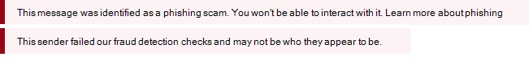

# Veiligheidstips in e-mailberichten

Exchange Online Protection (EOP) en Microsoft 365 beschermen u met spam, phishing en malwarepreventie. Vandaag de dag zijn sommige van deze aanvallen zo goed gemaakt dat ze er legitiem uitzien. Het verzenden van berichten naar de map Ongewenste e-mail is niet altijd voldoende. Wanneer u uw e-mail nu in Outlook of de webversie van Outlook controleert, controleert EOP automatisch de afzender en voegt een veiligheidstip toe aan de bovenkant van de e-mail.

De veiligheidstip, een bericht met kleurcodes, waarschuwt u voor mogelijk schadelijke berichten. De meeste berichten in je inbox hebben geen veiligheidstip. Je ziet ze alleen als EOP en Microsoft 365 informatie hebben die je nodig hebt om spam-, phishing- en malware-aanvallen te voorkomen. Als er veiligheidstips in uw postvak IN verschijnen, u de volgende voorbeelden gebruiken om meer te weten te komen over elk type veiligheidstip.

- Verdachte e-mail (rode veiligheidstip).

    

    Een rode veiligheidstip in een e-mail betekent dat het bericht dat u hebt ontvangen iets verdachts bevat, zoals een phishing-scam. We raden je aan dit soort e-mailberichten uit je postvak IN te verwijderen zonder het te openen.

- Spam (gele veiligheidstip).

    

    Een gele veiligheidstip in een e-mail betekent dat het bericht is gemarkeerd als spam. Als u de afzender van het bericht niet herkent en vertrouwt, downloadt u geen bijlagen of afbeeldingen en klikt u niet op koppelingen in het bericht. In de webversie van Outlook u op **Het is geen spam** in de gele balk van een ongewenste e-mailitem klikken om het bericht naar uw postvak in te verplaatsen. Als de gele veiligheidstip wordt weergegeven op een bericht dat in uw postvak IN is bezorgd, is deze er waarschijnlijk omdat u het verplaatsen van spam naar uw map Ongewenste e-mail hebt uitgeschakeld.

- Veilige post (groene veiligheidstip).

    

    Naast onveilige berichten, zullen we u ook vertellen over geldige berichten van afzenders die we vertrouwen met een groene veiligheidstip. Een groene veiligheidstip in een e-mail betekent dat we de afzender van het bericht hebben gecontroleerd en hebben gecontroleerd of het veilig is. Microsoft onderhoudt deze lijst met vertrouwde afzenders, waaronder financiële organisaties en anderen die vaak worden vervalst of nagebootst.

- Ongefilterde e-mail (grijze veiligheidstip).

    

    We vertellen je ook wanneer we een e-mail hebben gecontroleerd omdat deze afkomstig is van een afzender die je vertrouwt op je lijst met veilige afzenders of als er een e-mailstroomregel bestaat om het filteren te omzeilen.

    De grijze veiligheidstip wordt ook weergegeven wanneer externe afbeeldingen worden geblokkeerd, dat wil zeggen dat het bericht in uw postvak IN staat en geen spam lijkt te zijn, maar externe afbeeldingen bevat die u niet hebt gedownload.

## Werken met veiligheidstips

Veiligheidstips zijn altijd ingeschakeld voor de webversie van Outlook, ook al ontvangt niet elk bericht er een. Beheerders kunnen veiligheidstips uitschakelen voor andere e-mailclients, zoals Outlook. Zie [Antispambeleid configureren in Office 365](configure-your-spam-filter-policies.md) voor meer informatie.

Als u het niet eens bent met de manier waarop EOP een bericht heeft gecategoriseerd (dat wil zeggen, het bericht is geen spam of het had moeten worden gemarkeerd als spam), u de berichten voor analyse naar Microsoft verzenden om uw ervaring beter te maken. Zie Berichten [en bestanden rapporteren aan Microsoft voor](report-junk-email-messages-to-microsoft.md)instructies. U ook op de koppeling Feedback in de veiligheidstip klikken om rechtstreeks opmerkingen bij Microsoft in te dienen om ons te helpen verbeteren.
