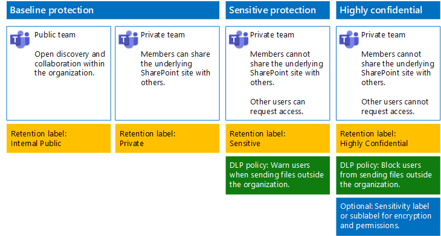

# Bestanden beveiligen in Microsoft TeamsSecure files in Microsoft Teams

Dit artikel bevat aanbevelingen voor het configureren van teams in Microsoft Teams en de onderliggende SharePoint-sites voor bestandsbeveiliging waardoor beveiliging en gemak van samenwerking hand in hand gaan.This article provides recommendations for configuring teams in Microsoft Teams and their underlying SharePoint sites for file protection that balances security with ease of collaboration. In dit artikel worden vier verschillende configuraties gedefinieerd, te beginnen met een openbare site in uw organisatie met het meest liberale beleid voor het delen van bestanden.This article defines four different configurations, starting with a public site within your organization with the most open sharing policies. Elke extra configuratie vertegenwoordigt een zinvolle stap in de bescherming, maar de mogelijkheid om bestanden die in Teams zijn opgeslagen, te openen en eraan samen te werken, is beperkt tot de desbetreffende groep teamleden.Each additional configuration represents a meaningful step up in protection, but the ability to access and collaborate on files stored within Teams is reduced to the relevant set of team members. Gebruik deze aanbevelingen als uitgangspunt en pas de configuraties aan om aan de behoeften van uw organisatie te kunnen voldoen.Use these recommendations as a starting point and adjust the configurations to meet the needs of your organization.

De configuraties in dit artikel zijn in overeenstemming met de aanbevelingen van Microsoft voor de drie beveiligingslagen voor gegevens, identiteiten en apparaten:The configurations in this article align with Microsoft's recommendations for three tiers of protection for data, identities, and devices:

- BasisbeschermingBaseline protection

- Bescherming van gevoelige gegevensSensitive protection

- Bescherming van zeer vertrouwelijke gegevensHighly confidential protection

Zie de volgende bronnen voor meer informatie over deze lagen en functionaliteiten voor elke laag.For more information about these tiers and capabilities recommended for each tier, see the following resources.

- [Identity and Device Protection for Office 365](https://docs.microsoft.com/office365/enterprise/microsoft-cloud-it-architecture-resources#identity-and-device-protection-for-office-365) (Bescherming van identiteiten en apparaten in Office 365)[Identity and Device Protection for Office 365](https://docs.microsoft.com/office365/enterprise/microsoft-cloud-it-architecture-resources#identity-and-device-protection-for-office-365)

- [File Protection Solutions in Office 365](https://docs.microsoft.com/office365/enterprise/microsoft-cloud-it-architecture-resources#file-protection-solutions-in-office-365) (Oplossingen voor bestandsbeveiliging in Office 365)[File Protection Solutions in Office 365](https://docs.microsoft.com/office365/enterprise/microsoft-cloud-it-architecture-resources#file-protection-solutions-in-office-365)

## Overzicht van functionaliteitenCapability overview

Aanbevelingen voor beveiligde teams zijn afhankelijk van een groot aantal Microsoft 365-functionaliteiten.Recommendations for secured teams draw on a variety of Microsoft 365 capabilities. In de volgende afbeelding ziet u de aanbevolen configuraties.The following illustration shows the recommended configurations.

Zoals afgebeeld:As illustrated:

- Basisbescherming omvat een openbaar team en een privéteam.Baseline protection includes a public team and private team. Openbare teams kunnen door iedereen in de organisatie worden gedetecteerd en geopend.Public teams can be discovered and accessed by anybody in the organization. Privéteams kunnen alleen door leden van het team worden gedetecteerd en geopend.Private teams can only be discovered and accessed by members of the team. Met beide configuraties kunt u de onderliggende SharePoint-sites delen waarop bestanden van buiten het team zijn opgeslagen.Both of these configurations allow for sharing of the underlying SharePoint site on which files are stored outside the team group.

- Teams voor bescherming van gevoelige en zeer vertrouwelijke gegevens zijn privéteams waarvoor het delen en het aanvragen van toegang tot de onderliggende site beperkt zijn.Teams for sensitive and highly confidential protection are private teams in which sharing and the requesting of access for the underlying site is limited.

- [Retentielabels](../../compliance/labels.md) bieden een mogelijkheid om bestanden in de onderliggende SharePoint-sites te classificeren.[Retention labels](../../compliance/labels.md) provide a way to classify files within the underlying SharePoint sites. Elke onderliggende SharePoint-site is geconfigureerd voor het automatisch labelen van bestanden in documentbibliotheken met een standaardretentielabel.Each of the underlying SharePoint sites are configured to automatically label files in document libraries with a default retention label. De labels in dit voorbeeld zijn Intern openbaar, Privé, Gevoelig en Zeer vertrouwelijk, in overeenstemming met de vier teamconfiguraties.Corresponding to the four team configurations, the labels in this example are Internal Public, Private, Sensitive, and Highly Confidential. Gebruikers kunnen de labels voor afzonderlijke bestanden wijzigen, maar met deze configuratie krijgen alle bestanden een standaardlabel.Users can change the labels on the individual files, but this configuration ensures all files receive a default label.

- Beleid voor [preventie van gegevensverlies](../../compliance/data-loss-prevention-policies.md) (DLP) wordt geconfigureerd voor de retentielabels Gevoelig en Zeer vertrouwelijk om gebruikers te waarschuwen als ze deze typen bestanden buiten de organisatie willen verzenden, of om dit te voorkomen.[Data loss prevention](../../compliance/data-loss-prevention-policies.md) (DLP) policies are configured for the Sensitive and Highly Confidential retention labels to either warn or prevent users when they attempt to send these types of files outside the organization.

- Indien nodig kunt u [gevoeligheidslabels](../../compliance/sensitivity-labels.md) gebruiken om zeer vertrouwelijke bestanden met versleuteling en machtigingen te beveiligen.If needed for your scenario, you can use [sensitivity labels](../../compliance/sensitivity-labels.md) to protect highly confidential files with encryption and permissions. Voor klanten van Azure Information Protection: u kunt uw Azure Information Protection-labels in het Microsoft 365-compliancecentrum gebruiken. Uw labels worden vervolgens gesynchroniseerd met Azure Portal indien u voor aanvullende of geavanceerde configuratie kiest.For Azure Information Protection customers, you can use your Azure Information Protection labels in the Microsoft 365 compliance center, and your labels will be synced with the Azure portal in case you choose to perform additional or advanced configuration. Azure Information Protection- en gevoeligheidslabels zijn volledig met elkaar compatibel.Azure Information Protection labels and sensitivity labels are fully compatible with each other. Dit betekent dat als u bijvoorbeeld inhoud hebt die is gelabeld door Azure Information Protection, u deze inhoud niet opnieuw hoeft te classificeren of labelen.This means, for example, if you have content labeled by Azure Information Protection, you won't need to reclassify or relabel your content. Niet alle klanten hebben dit beveiligingsniveau nodig.Not all customers need this level of protection.

## Instellingen voor de hele organisatie voor SharePoint en OneDriveOrganization-wide settings for SharePoint and OneDrive

SharePoint en OneDrive bevatten instellingen die van invloed zijn op alle sites en gebruikers in de organisatie.SharePoint and OneDrive include organization-wide settings that affect all sites and users. Sommige van deze instellingen kunnen ook worden aangepast op siteniveau zodat ze meer beperkend zijn (maar niet minder).Some of these settings can also be adjusted at the site level to be more restrictive (but not less). In deze sectie worden instellingen voor de gehele tenant besproken die van invloed zijn op beveiliging en samenwerking.This section discusses tenant-wide settings that affect security and collaboration.

### DelenSharing

Voor deze oplossing raden we u de volgende instellingen voor de hele organisatie aan:For this solution, we recommend the following organization-wide settings:

- Het standaardbeleid voor delen blijven gebruiken voor het delen van alle accounttypen, inclusief anoniem delen.Keep the default sharing policy that allows all sharing with all account types, including anonymous sharing.

- Anonieme koppelingen instellen om ze te laten verlopen, indien gewenst.Set anonymous links to expire, if desired.

- Het standaardkoppelingstype voor delen wijzigen naar Intern.Change the default link type for sharing to Internal. Hiermee voorkomt u dat gegevens per ongeluk buiten uw organisatie terechtkomen.This helps prevent accidental data leakage outside your organization.

Hoewel het tegenintuïtief lijkt om extern delen toe te staan, biedt deze benadering meer controle over het delen van bestanden ten opzichte van het verzenden van bestanden via e-mail.While it might seem counterintuitive to allow external sharing, this approach provides more control over file sharing compared to sending files in email. SharePoint en Outlook werken samen om veilige samenwerking aan bestanden mogelijk te maken.SharePoint and Outlook work together to provide secure collaboration on files.

- Standaard wordt in Outlook een koppeling naar een bestand gedeeld in plaats dat het bestand per e-mail wordt verzonden.By default, Outlook shares a link to a file instead of sending the file in email.

- Met SharePoint en OneDrive kunt u eenvoudig koppelingen naar bestanden delen met medewerkers die zich binnen of buiten uw organisatie bevinden.SharePoint and OneDrive make it easy to share links to files with contributors who are both inside and outside your organization

Bovendien kunt u het extern delen van bestanden beheren.You also have controls to help govern external sharing. U kunt bijvoorbeeld:For example, you can:

- Een anonieme gastkoppeling uitschakelen.Disable an anonymous guest link.

- De toegang intrekken die gebruikers tot een site hebben.Revoke user access to a site.

- Kijken wie er toegang heeft tot een bepaalde site of een bepaald document.See who has access to a specific site or document.

- Instellen dat koppelingen voor anoniem delen moeten verlopen (tenant-instelling).Set anonymous sharing links to expire (tenant setting).

- Beperken wie kan delen buiten uw organisatie (tenant-instelling).Limit who can share outside your organization (tenant setting).

### Extern delen gebruiken in combinatie met preventie van gegevensverlies (DLP)Use external sharing together with data loss prevention (DLP)

Als u extern delen niet toestaat, kunnen gebruikers die dat willen, alternatieve hulpmiddelen en methoden vinden.If you don't allow external sharing, users with a business need will find alternate tools and methods. Microsoft raadt aan extern delen te combineren met DLP-beleid om gevoelige en zeer vertrouwelijke bestanden te beveiligen.Microsoft recommends you combine external sharing with DLP policies to protect sensitive and highly confidential files.

### Instellingen voor apparaattoegangDevice access settings

Met instellingen voor apparaattoegang voor SharePoint en OneDrive kunt u bepalen of toegang beperkt wordt tot alleen browsers (bestanden kunnen dan niet worden gedownload) of dat de hele toegang wordt geblokkeerd.Device access settings for SharePoint and OneDrive let you determine whether access is limited to browser only (files can't be downloaded) or if access is blocked. Zie [Control access from unmanaged devices (Toegangsbeheer op niet-beheerde apparaten)](https://docs.microsoft.com/sharepoint/control-access-from-unmanaged-devices) voor meer informatie.For more information, see [Control access from unmanaged devices](https://docs.microsoft.com/sharepoint/control-access-from-unmanaged-devices).

Zie [Beleidsaanbevelingen voor het beveiligen van SharePoint-sites en -bestanden](https://docs.microsoft.com/microsoft-365/enterprise/sharepoint-file-access-policies) als u instellingen voor apparaattoegang wilt gebruiken met aanbevolen beleid voor voorwaardelijke toegang in Azure Active Directory.To use device access settings with recommended conditional access policies in Azure Active Directory, see [Policy recommendations for securing SharePoint sites and files](https://docs.microsoft.com/microsoft-365/enterprise/sharepoint-file-access-policies).

Ga naar deze instellingen om te bepalen of u de standaardinstellingen voor OneDrive-sites wilt wijzigen.Visit these settings to decide if you want to change the default settings for OneDrive sites. Op dit moment worden de instellingen voor delen en apparaattoegang gedupliceerd vanuit het SharePoint-beheercentrum. Ze zijn van toepassing op beide omgevingen.Currently, the sharing and device access settings are duplicated from the SharePoint admin center and apply to both environments.

## Configuratie van Team- en SharePoint-sitesTeam and SharePoint site configuration

In de volgende tabel vindt u een overzicht van de configuratie voor alle teams en hun onderliggende SharePoint-site, zoals eerder is beschreven in dit artikel.The following table summarizes the configuration for each of the teams and their underlying SharePoint site described earlier in this article. Gebruik deze configuraties als uitgangspunt en pas de sitetypen en -configuraties aan de behoeften van uw organisatie aan.Use these configurations as starting point recommendations and adjust the site types and configurations to meet the needs of your organization. Niet elke organisatie heeft elk type team nodig.Not every organization needs every type of team. Voor slechts een klein aantal organisaties zijn teams met zeer vertrouwelijke bescherming vereist.Only a small number of organizations require teams with highly confidential protection.

||||||
|:-----|:-----|:-----|:-----|:-----|
||**Basisbescherming 1****Baseline protection #1**|**Basisbescherming 2****Baseline protection #2**|**Bescherming van gevoelige gegevens****Sensitive protection**|**Zeer vertrouwelijk****Highly confidential**|
|BeschrijvingDescription|Openbaar team met vrije detectie en samenwerking binnen de organisatie.Public team with open discovery and collaboration within the organization.|Privéteam waarbij delen van de onderliggende SharePoint-site is toegestaan buiten de groep.Private team with sharing of the underlying SharePoint site allowed outside the group.|Privéteam, maar delen van de onderliggende SharePoint-site is alleen toegestaan voor leden van de site.Private team, but sharing of the underlying SharePoint site is only allowed to members of the site. DLP waarschuwt gebruikers bij het verzenden van bestanden buiten de organisatie.DLP warns users when attempting to send files outside the organization.|Privéteam met gevoeligheidslabels voor bestandsversleuteling en machtigingen die met het bestand worden verzonden.Private team with sensitivity labels for file encryption and permissions that travel with the file. DLP voorkomt dat gebruikers bestanden buiten het bedrijf verzenden.DLP prevents users from sending files outside the organization.|
|Privé- of openbare team sitePrivate or public team site|OpenbaarPublic|PrivéPrivate|PrivéPrivate|PrivéPrivate|
|Wie heeft er toegang?Who has access?|Iedereen in de organisatie, waaronder B2B-gebruikers.Everybody in the organization, including B2B users.|Alleen leden van de site.Members of the site only. Anderen kunnen toegang aanvragen.Others can request access.|Alleen leden van het team.Members of the team only. Anderen kunnen toegang tot de onderliggende site aanvragen, hetgeen wordt goedgekeurd door een teameigenaar.Others can request access to the underlying site, which is approved by a team owner.|Alleen leden.Members only. Anderen kunnen geen toegang aanvragen tot de onderliggende site.Others cannot request access to the underlying site.|
|Besturingselementen voor delen op siteniveauSite-level sharing controls|Delen met iedereen toegestaan.Sharing allowed with anybody. Standaardinstellingen.Default settings.|Delen met iedereen toegestaan.Sharing allowed with anybody. Standaardinstellingen.Default settings.|Leden kunnen toegang tot de site niet delen.Members cannot share access to the site.   Niet-leden kunnen toegang tot de site aanvragen, maar deze aanvragen moeten door een groepseigenaar van het team worden behandeld.Non-members can request access to the site, but these requests need to be addressed by a group owner for the team.|Leden kunnen toegang tot de site niet delen.Members cannot share access to the site.   Niet-leden kunnen geen toegang tot de site of de inhoud ervan aanvragen.Non-members cannot request access to the site or its contents.|
|Besturingselementen voor toegang op siteniveauSite-level device access controls|Geen extra besturingselementen.No additional controls.|Geen extra besturingselementen.No additional controls.|Voorkomt dat gebruikers bestanden downloaden naar niet-compatibele apparaten of apparaten die geen deel uitmaken van een domein.Prevents users from downloading files to non-compliant or non-domain joined devices. Hiermee is alleen toegang met de browser toegestaan vanaf alle overige apparaten.This allows browser-only access from all other devices.|Blokkeert het downloaden van bestanden naar niet-compatibele apparaten of apparaten die geen deel uitmaken van een domein.Block downloading of files to non-compliant or non-domain joined devices.|
|RetentielabelsRetention labels|Intern openbaarInternal Public|PrivéPrivate|GevoeligSensitive|Zeer vertrouwelijkHighly Confidential|
|DLP-beleidDLP policies|||Waarschuwt gebruikers bij het verzenden buiten de organisatie van bestanden die het label Gevoelig dragen.Warn users when sending files that are labeled as Sensitive outside the organization.   Voor het blokkeren van extern delen van gevoelige gegevenstypen (bijvoorbeeld creditkaartnummers of andere persoonlijke gegevens), kunt u aanvullend DLP-beleid voor deze gegevenstypen configureren (waaronder aangepaste gegevenstypen die u configureert).To block external sharing of sensitive data types, such as credit card numbers or other personal data, you can configure additional DLP policies for these data types (including custom data types you configure).|Voorkomt dat gebruikers bestanden met het label Zeer vertrouwelijk buiten de organisatie verzenden.Block users from sending files that are labeled as highly confidential outside organization. Staat gebruikers toe dit te overschrijven door hiervoor een rechtvaardiging te geven, zoals met wie ze het bestand willen delen.Allow users to override this by providing justification, including who they are sharing the file with.|
|GevoeligheidslabelsSensitivity labels||||Gebruik gevoeligheidslabels om bestanden te versleutelen en er machtigingen voor te verlenen.Use sensitivity labels to encrypt and grant permissions to files. Deze bescherming wordt met de bestanden mee verzonden voor het geval lekkage van de onderliggende SharePoint-site optreedt.This protection travels with the files in case they are leaked from the underlying SharePoint site.|

Zie [Teams implementeren voor drie beschermingslagen voor bestanden](deploy-teams-three-tiers.md) voor de stappen voor het implementeren van vier verschillende typen teams in deze oplossing.For the steps to deploy the four different types of teams in this solution, see [Deploy teams for three tiers of protection for files](deploy-teams-three-tiers.md).

## RetentielabelsRetention labels

Het gebruik van retentielabels wordt aangeraden voor omgevingen met gevoelige gegevens.Using retention labels is recommended for environments with sensitive data. Ga na het configureren en publiceren van retentielabels als volgt te werk:After you configure and publish retention labels:

- U kunt een standaardlabel toepassen op een documentbibliotheek in de onderliggende SharePoint-site voor een team, zodat alle documenten in de sectie **Bestanden** van het team het standaardlabel krijgen.You can apply a default label to a document library in the underlying SharePoint site for a team, so that all documents in the **Files** section of the team get the default label.

- U kunt automatisch labels op inhoud toepassen als deze aan bepaalde voorwaarden voldoet.You can apply labels to content automatically if it matches specific conditions.

- U kunt DLP-beleid toepassen dat op retentielabels is gebaseerd.You can apply DLP policies that are based on retention labels.

- Personen in uw organisatie kunnen een label handmatig toepassen op inhoud in de webversie van Outlook, Outlook 2010 en hoger, OneDrive, SharePoint en Microsoft 365-groepen.People in your organization can apply a label manually to content in Outlook on the web, Outlook 2010 and later, OneDrive, SharePoint, and Microsoft 365 groups. Gebruikers weten vaak het beste met welk type inhoud ze bezig zijn, zodat ze deze kunnen classificeren en het juiste DLP-beleid erop kunnen toepassen.Users often know best what type of content they're working with, so they can classify it and have the appropriate DLP policy applied.

Zoals u ziet, bevat deze oplossing de volgende retentielabels:As illustrated, this solution includes creating the following retention labels:

- Zeer vertrouwelijkHighly Confidential

- GevoeligSensitive

- PrivéPrivate

- Intern openbaarInternal Public

Deze labels worden toegewezen aan de aanbevolen sites in de illustraties en grafieken die eerder in dit artikel zijn behandeld.These labels are mapped to the recommended sites in the illustrations and charts earlier in this article. In deze oplossing wordt aanbevolen om DLP-beleid in te stellen om lekken van bestanden met de labels Gevoelig of Zeer vertrouwelijk te voorkomen.This solution recommends configuring DLP policies to help prevent the leakage of files labeled as Sensitive and Highly Confidential.

Zie [Bestanden in teams beveiligen met retentielabels en DLP](deploy-teams-retention-DLP.md) voor de stappen om retentielabels en DLP-beleid in deze oplossing te configureren.For the steps to configure retention labels and DLP policies in this solution, see [Protect files in teams with retention labels and DLP](deploy-teams-retention-DLP.md).

## GevoeligheidslabelsSensitivity labels

Indien gerechtvaardigd voor uw beveiligingsscenario, kunt u gevoeligheidslabels gebruiken om bescherming toe te passen op de bestanden, ongeacht hun locatie.If warranted for your security scenario, you can use sensitivity labels to apply protections that follow the files wherever they go. Gevoeligheidslabels in het Microsoft 365-compliancecentrum en Azure Information Protection-labels zijn dezelfde.Sensitivity labels in the Microsoft 365 compliance center and Azure Information Protection labels are the same. Voor deze oplossing wordt u aangeraden een gevoeligheidslabel of -sublabel te gebruiken voor het versleutelen en toewijzen van machtigingen aan bestanden die moeten worden beschermd met het hoogste beveiligingsniveau.For this solution, we recommend you use a sensitivity label or sublabel to encrypt and grant permissions to files that need to be protected with the highest level of security.

Zie [Overzicht van gevoeligheidslabels](../../compliance/sensitivity-labels.md) voor meer informatie.For more information, see [Overview of sensitivity labels](../../compliance/sensitivity-labels.md).

Zie [Bestanden in teams beveiligen met gevoeligheidslabels](deploy-teams-sensitivity-labels.md) voor de stappen voor het configureren van gevoeligheidlabels in deze oplossing.For the steps to configure sensitivity labels in this solution, see [Protect files in teams with sensitivity labels](deploy-teams-sensitivity-labels.md).

## Zie ookSee also

[Cloud adoption and hybrid solutions](https://docs.microsoft.com/office365/enterprise/cloud-adoption-and-hybrid-solutions) (Overstappen op de cloud en hybride oplossingen)[Cloud adoption and hybrid solutions](https://docs.microsoft.com/office365/enterprise/cloud-adoption-and-hybrid-solutions)
