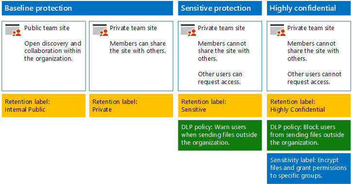

# Sites en bestanden van SharePoint Online beveiligenSecure SharePoint Online sites and files

Dit artikel bevat aanbevelingen voor het configureren van teamsites in SharePoint Online en voor bestandsbeveiliging waarbij beveiliging en gemak van samenwerking hand in hand gaan.This article provides recommendations for configuring SharePoint Online team sites and file protection that balances security with ease of collaboration. In dit artikel worden vier verschillende configuraties gedefinieerd, te beginnen met een openbare site in uw organisatie met het meest liberale beleid voor het delen van bestanden.This article defines four different configurations, starting with a public site within your organization with the most open sharing policies. Elke extra configuratie vertegenwoordigt een zinvolle stap in de bescherming, maar de mogelijkheid om bronnen te openen en eraan samen te werken, is beperkt tot de desbetreffende groep gebruikers.Each additional configuration represents a meaningful step up in protection, but the ability to access and collaborate on resources is reduced to the relevant set of users. Gebruik deze aanbevelingen als uitgangspunt en pas de configuraties aan om aan de behoeften van uw organisatie te kunnen voldoen.Use these recommendations as a starting point and adjust the configurations to meet the needs of your organization.

De configuraties in dit artikel zijn in overeenstemming met de aanbevelingen van Microsoft voor de drie beveiligingslagen voor gegevens, identiteiten en apparaten:The configurations in this article align with Microsoft's recommendations for three tiers of protection for data, identities, and devices:

- BasisbeschermingBaseline protection

- Bescherming van gevoelige gegevensSensitive protection

- Bescherming van zeer vertrouwelijke gegevensHighly confidential protection

Zie de volgende bronnen voor meer informatie over deze lagen en functionaliteiten voor elke laag.For more information about these tiers and capabilities recommended for each tier, see the following resources.

- [Identity and Device Protection for Office 365](https://docs.microsoft.com/office365/enterprise/microsoft-cloud-it-architecture-resources#identity-and-device-protection-for-office-365) (Bescherming van identiteiten en apparaten in Office 365)[Identity and Device Protection for Office 365](https://docs.microsoft.com/office365/enterprise/microsoft-cloud-it-architecture-resources#identity-and-device-protection-for-office-365)

- [File Protection Solutions in Office 365](https://docs.microsoft.com/office365/enterprise/microsoft-cloud-it-architecture-resources#file-protection-solutions-in-office-365) (Oplossingen voor bestandsbeveiliging in Office 365)[File Protection Solutions in Office 365](https://docs.microsoft.com/office365/enterprise/microsoft-cloud-it-architecture-resources#file-protection-solutions-in-office-365)

## Overzicht van functionaliteitenCapability overview

Aanbevelingen voor teamsites in SharePoint Online zijn gebaseerd op een groot aantal Microsoft 365-functionaliteiten.Recommendations for SharePoint Online team sites draw on a variety of Microsoft 365 capabilities. In de volgende afbeelding ziet u de aanbevolen configuraties voor vier teamsites in SharePoint Online.The following illustration shows the recommended configurations for four SharePoint Online team sites.

Zoals afgebeeld:As illustrated:

- Basisbescherming bevat twee opties voor teamsites in SharePoint Online: een openbare site en een privésite.Baseline protection includes two options for SharePoint Online team sites — a public site and private site. Openbare sites kunnen door iedereen in de organisatie worden gevonden en geopend.Public sites can be discovered and accessed by anybody in the organization. Privésites kunnen alleen door leden van de site worden gevonden en geopend.Private sites can only be discovered and accessed by members of the site. In beide siteconfiguraties is het delen buiten de groep toegestaan.Both of these site configurations allow for sharing outside the group.

- Sites voor gevoelige en zeer vertrouwelijke bescherming zijn privésites waarvan de toegang is beperkt tot alleen de leden van specifieke groepen.Sites for sensitive and highly confidential protection are private sites with access limited only to members of specific groups.

- [Retentielabels](../../compliance/labels.md) bieden een mogelijkheid om bestanden in de sites te classificeren.[Retention labels](../../compliance/labels.md) provide a way to classify files within the sites. Elke teamsite in SharePoint Online is geconfigureerd voor het automatisch labelen van bestanden in documentbibliotheken met een standaardretentielabel voor die site.Each of the SharePoint Online team sites are configured to automatically label files in document libraries with a default retention label for the site. De labels in dit voorbeeld zijn Intern openbaar, Privé, Gevoelig en Zeer vertrouwelijk, in overeenstemming met de vier siteconfiguraties.Corresponding to the four site configurations, the labels in this example are Internal Public, Private, Sensitive, and Highly Confidential. Gebruikers kunnen de labels wijzigen, maar met deze configuratie krijgen alle bestanden een standaardlabel.Users can change the labels, but this configuration ensures all files receive a default label.

- Beleid voor [preventie van gegevensverlies](../../compliance/data-loss-prevention-policies.md) (DLP) wordt geconfigureerd voor de retentielabels Gevoelig en Zeer vertrouwelijk om gebruikers te waarschuwen als ze deze typen bestanden buiten de organisatie willen verzenden, of om dit te voorkomen.[Data loss prevention](../../compliance/data-loss-prevention-policies.md) (DLP) policies are configured for the Sensitive and Highly Confidential retention labels to either warn or prevent users when they attempt to send these types of files outside the organization.

- Indien nodig kunt u [gevoeligheidslabels](../../compliance/sensitivity-labels.md) gebruiken om zeer vertrouwelijke bestanden met versleuteling en machtigingen te beveiligen.If needed for your scenario, you can use [sensitivity labels](../../compliance/sensitivity-labels.md) to protect highly confidential files with encryption and permissions. Voor klanten van Azure Information Protection: u kunt uw Azure Information Protection-labels in het Microsoft 365-compliancecentrum gebruiken. Uw labels worden vervolgens gesynchroniseerd met Azure Portal indien u voor aanvullende of geavanceerde configuratie kiest.For Azure Information Protection customers, you can use your Azure Information Protection labels in the Microsoft 365 compliance center, and your labels will be synced with the Azure portal in case you choose to perform additional or advanced configuration. Azure Information Protection-labels en Office 365-gevoeligheidslabels zijn volledig met elkaar compatibel.Azure Information Protection labels and Office 365 sensitivity labels are fully compatible with each other. Dit betekent dat als u bijvoorbeeld inhoud hebt die is gelabeld door Azure Information Protection, u deze inhoud niet opnieuw hoeft te classificeren of labelen.This means, for example, if you have content labeled by Azure Information Protection, you won't need to reclassify or relabel your content. Niet alle klanten hebben dit beveiligingsniveau nodig.Not all customers need this level of protection.

## Tenantbrede instellingen voor SharePoint Online en OneDrive voor BedrijvenTenant-wide settings for SharePoint Online and OneDrive for Business

SharePoint Online en OneDrive voor Bedrijven bevatten tenantbrede instellingen die van invloed zijn op alle sites en gebruikers.SharePoint Online and OneDrive for Business include tenant-wide settings that affect all sites and users. Sommige van deze instellingen kunnen ook worden aangepast op siteniveau zodat ze meer beperkend zijn (maar niet minder).Some of these settings can also be adjusted at the site level to be more restrictive (but not less). In deze sectie worden instellingen voor de gehele tenant besproken die van invloed zijn op beveiliging en samenwerking.This section discusses tenant-wide settings that affect security and collaboration.

### DelenSharing

Voor deze oplossing raden we u de volgende tenantbrede instellingen aan:For this solution, we recommend the following tenant-wide settings:

- Het standaardbeleid voor delen blijven gebruiken voor het delen van alle accounttypen, inclusief anoniem delen.Keep the default sharing policy that allows all sharing with all account types, including anonymous sharing.

- Anonieme koppelingen instellen om ze te laten verlopen, indien gewenst.Set anonymous links to expire, if desired.

- Het standaardkoppelingstype voor delen wijzigen naar Intern.Change the default link type for sharing to Internal. Hiermee voorkomt u dat gegevens per ongeluk buiten uw organisatie terechtkomen.This helps prevent accidental data leakage outside your organization.

Hoewel het tegenintuïtief lijkt om extern delen toe te staan, biedt deze benadering meer controle over het delen van bestanden ten opzichte van het verzenden van bestanden via e-mail.While it might seem counterintuitive to allow external sharing, this approach provides more control over file sharing compared to sending files in email. SharePoint Online en Outlook werken samen om veilige samenwerking aan bestanden mogelijk te maken.SharePoint Online and Outlook work together to provide secure collaboration on files.

- Standaard wordt in Outlook een koppeling naar een bestand gedeeld in plaats dat het bestand per e-mail wordt verzonden.By default, Outlook shares a link to a file instead of sending the file in email.

- Met SharePoint Online en OneDrive voor Bedrijven kunt u eenvoudig koppelingen naar bestanden delen met medewerkers die zich binnen of buiten uw organisatie bevinden.SharePoint Online and OneDrive for Business make it easy to share links to files with contributors who are both inside and outside your organization

Bovendien kunt u het extern delen van bestanden beheren.You also have controls to help govern external sharing. U kunt bijvoorbeeld:For example, you can:

- Een anonieme gastkoppeling uitschakelen.Disable an anonymous guest link.

- De toegang intrekken die gebruikers tot een site hebben.Revoke user access to a site.

- Kijken wie er toegang heeft tot een bepaalde site of een bepaald document.See who has access to a specific site or document.

- Instellen dat koppelingen voor anoniem delen moeten verlopen (tenant-instelling).Set anonymous sharing links to expire (tenant setting).

- Beperken wie kan delen buiten uw organisatie (tenant-instelling).Limit who can share outside your organization (tenant setting).

### Extern delen gebruiken in combinatie met preventie van gegevensverlies (DLP)Use external sharing together with data loss prevention (DLP)

Als u extern delen niet toestaat, kunnen gebruikers die dat willen, alternatieve hulpmiddelen en methoden vinden.If you don't allow external sharing, users with a business need will find alternate tools and methods. Microsoft raadt aan extern delen te combineren met DLP-beleid om gevoelige en zeer vertrouwelijke bestanden te beveiligen.Microsoft recommends you combine external sharing with DLP policies to protect sensitive and highly confidential files.

### Instellingen voor apparaattoegangDevice access settings

Met instellingen voor apparaattoegang voor SharePoint Online en OneDrive voor Bedrijven kunt u bepalen of toegang beperkt wordt tot alleen browsers (bestanden kunnen dan niet worden gedownload) of dat de hele toegang wordt geblokkeerd.Device access settings for SharePoint Online and OneDrive for Business let you determine whether access is limited to browser only (files can't be downloaded) or if access is blocked. Zie [Control access from unmanaged devices (Toegangsbeheer op niet-beheerde apparaten)](https://docs.microsoft.com/sharepoint/control-access-from-unmanaged-devices) voor meer informatie.For more information, see [Control access from unmanaged devices](https://docs.microsoft.com/sharepoint/control-access-from-unmanaged-devices).

Zie [Beleidsaanbevelingen voor het beveiligen van SharePoint-sites en -bestanden](https://docs.microsoft.com/microsoft-365/enterprise/sharepoint-file-access-policies) als u instellingen voor apparaattoegang wilt gebruiken met aanbevolen beleid voor voorwaardelijke toegang in Azure Active Directory.To use device access settings with recommended conditional access policies in Azure Active Directory, see [Policy recommendations for securing SharePoint sites and files](https://docs.microsoft.com/microsoft-365/enterprise/sharepoint-file-access-policies).

### OneDrive voor BedrijvenOneDrive for Business

Ga naar deze instellingen om te bepalen of u de standaardinstellingen voor OneDrive voor Bedrijven-sites wilt wijzigen.Visit these settings to decide if you want to change the default settings for OneDrive for Business sites. Op dit moment worden de instellingen voor delen en apparaattoegang gedupliceerd vanuit het SharePoint Online Beheercentrum. Deze zijn van toepassing op beide omgevingen.Currently, the sharing and device access settings are duplicated from the SharePoint Online admin center and apply to both environments.

## Configuratie van een SharePoint-teamsiteSharePoint team site configuration

In de volgende tabel vindt u een overzicht van de configuratie voor alle teams, zoals eerder beschreven in dit artikel.The following table summarizes the configuration for each of the team sites described earlier in this article. Gebruik deze configuraties als uitgangspunt en pas de sitetypen en -configuraties aan de behoeften van uw organisatie aan.Use these configurations as starting point recommendations and adjust the site types and configurations to meet the needs of your organization. Niet elke organisatie heeft elk type site nodig.Not every organization needs every type of site. Voor slechts een klein aantal organisaties is zeer vertrouwelijke bescherming vereist.Only a small number of organizations require highly confidential protection.

||||||
|:-----|:-----|:-----|:-----|:-----|
||**Basisbescherming 1****Baseline protection #1**|**Basisbescherming 2****Baseline protection #2**|**Bescherming van gevoelige gegevens****Sensitive protection**|**Zeer vertrouwelijk****Highly confidential**|
|BeschrijvingDescription|Vrije detectie en samenwerking binnen de organisatie.Open discovery and collaboration within the organization.|Privésite en groep met delen buiten de groep zijn toegestaan.Private site and group with sharing allowed outside the group.|Privésite met delen is alleen toegestaan voor leden van de site.Private site with sharing allowed only to members of the site. DLP waarschuwt gebruikers bij het verzenden van bestanden buiten de organisatie.DLP warns users when attempting to send files outside the organization.|Privésite en het versleutelen van bestanden en machtigingen met gevoeligheidslabels.Private site and file encryption and permissions with sensitivity labels. DLP voorkomt dat gebruikers bestanden buiten het bedrijf verzenden.DLP prevents users from sending files outside the organization.|
|Privé- of openbare team sitePrivate or public team site|OpenbaarPublic|PrivéPrivate|PrivéPrivate|PrivéPrivate|
|Wie heeft er toegang?Who has access?|Iedereen in de organisatie, waaronder B2B- en gastgebruikers.Everybody in the organization, including B2B users and guest users.|Alleen leden van de site.Members of the site only. Anderen kunnen toegang aanvragen.Others can request access.|Alleen leden van de site.Members of the site only. Anderen kunnen toegang aanvragen.Others can request access.|Alleen leden.Members only. Anderen kunnen geen toegang aanvragen.Others cannot request access.|
|Besturingselementen voor delen op siteniveauSite-level sharing controls|Delen met iedereen toegestaan.Sharing allowed with anybody. Standaardinstellingen.Default settings.|Delen met iedereen toegestaan.Sharing allowed with anybody. Standaardinstellingen.Default settings.|Leden kunnen toegang tot de site niet delen.Members cannot share access to the site.   Niet-leden kunnen toegang tot de site aanvragen, maar deze aanvragen moeten door een sitebeheerder worden behandeld.Non-members can request access to the site, but these requests need to be addressed by a site administrator.|Leden kunnen toegang tot de site niet delen.Members cannot share access to the site.   Niet-leden kunnen geen toegang tot de site of de inhoud aanvragen.Non-members cannot request access to the site or contents.|
|Besturingselementen voor toegang op siteniveauSite-level device access controls|Geen extra besturingselementen.No additional controls.|Geen extra besturingselementen.No additional controls.|Voorkomt dat gebruikers bestanden downloaden naar niet-compatibele apparaten of apparaten die geen deel uitmaken van een domein.Prevents users from downloading files to non-compliant or non-domain joined devices. Hiermee is alleen toegang met de browser toegestaan vanaf alle overige apparaten.This allows browser-only access from all other devices.|Blokkeert het downloaden van bestanden naar niet-compatibele apparaten of apparaten die geen deel uitmaken van een domein.Block downloading of files to non-compliant or non-domain joined devices.|
|RetentielabelsRetention labels|Intern openbaarInternal Public|PrivéPrivate|GevoeligSensitive|Zeer vertrouwelijkHighly Confidential|
|DLP-beleidDLP policies|||Waarschuwt gebruikers bij het verzenden buiten de organisatie van bestanden die het label Gevoelig dragen.Warn users when sending files that are labeled as Sensitive outside the organization.   Voor het blokkeren van extern delen van gevoelige gegevenstypen (bijvoorbeeld creditkaartnummers of andere persoonlijke gegevens), kunt u aanvullend DLP-beleid voor deze gegevenstypen configureren (waaronder aangepaste gegevenstypen die u configureert).To block external sharing of sensitive data types, such as credit card numbers or other personal data, you can configure additional DLP policies for these data types (including custom data types you configure).|Voorkomt dat gebruikers bestanden met het label Zeer vertrouwelijk buiten de organisatie verzenden.Block users from sending files that are labeled as highly confidential outside organization. Staat gebruikers toe dit te overschrijven door hiervoor een rechtvaardiging te geven, zoals met wie ze het bestand willen delen.Allow users to override this by providing justification, including who they are sharing the file with.|
|GevoeligheidslabelsSensitivity labels||||Gebruik gevoeligheidslabels om bestanden automatisch te versleutelen en machtigingen voor de bestanden te verlenen.Use sensitivity labels to automatically encrypt and grant permissions to files. Deze bescherming wordt met de bestanden mee verzonden in het geval van een lek.This protection travels with the files in case they are leaked.   Office 365 kan bestanden die zijn versleuteld met gevoeligheidslabels niet lezen.Office 365 cannot read files encrypted with sensitivity labels. Daarnaast kan het DLP-beleid alleen worden gebruikt met de metagegevens (met inbegrip van labels), maar niet met de inhoud van deze bestanden (zoals creditcardnummers in bestanden).Additionally, DLP policies can only work with the metadata (including labels) but not the contents of these files (such as credit card numbers within files).|

Zie [Sites in SharePoint Online implementeren voor drie beschermingslagen voor bestanden](../../compliance/deploy-sharepoint-online-sites-for-three-tiers-of-protection.md) voor de stappen voor het implementeren van vier verschillende typen teamsites in SharePoint Online in deze oplossing.For the steps to deploy the four different types of SharePoint Online team sites in this solution, see [Deploy SharePoint Online sites for three tiers of protection](../../compliance/deploy-sharepoint-online-sites-for-three-tiers-of-protection.md).

## Office 365-retentielabelsOffice 365 retention labels

Het gebruik van retentielabels wordt aangeraden voor omgevingen met gevoelige of zeer vertrouwelijke gegevens.Using retention labels is recommended for environments with sensitive and highly confidential data. Ga na het configureren en publiceren van retentielabels als volgt te werk:After you configure and publish retention labels:

- U kunt een standaardlabel toepassen op een documentbibliotheek in een teamsite in SharePoint Online, zodat alle documenten in die bibliotheek het standaardlabel krijgen.You can apply a default label to a document library in a SharePoint Online team site, so that all documents in that library get the default label.

- U kunt automatisch labels op inhoud toepassen als deze aan bepaalde voorwaarden voldoet.You can apply labels to content automatically if it matches specific conditions.

- U kunt DLP-beleid toepassen dat op retentielabels is gebaseerd.You can apply DLP policies that are based on retention labels.

- Personen in uw organisatie kunnen een label handmatig toepassen op inhoud in de webversie van Outlook, Outlook 2010 en hoger, OneDrive voor Bedrijven, SharePoint Online en Office 365-groepen.People in your organization can apply a label manually to content in Outlook on the web, Outlook 2010 and later, OneDrive for Business, SharePoint Online, and Office 365 groups. Gebruikers weten vaak het beste met welk type inhoud ze bezig zijn, zodat ze deze kunnen classificeren en het juiste DLP-beleid erop kunnen toepassen.Users often know best what type of content they're working with, so they can classify it and have the appropriate DLP policy applied.

Zoals u ziet, bevat deze oplossing de volgende retentielabels:As illustrated, this solution includes creating the following retention labels:

- Zeer vertrouwelijkHighly Confidential

- GevoeligSensitive

- PrivéPrivate

- Intern openbaarInternal Public

Deze labels worden toegewezen aan de aanbevolen sites in de illustraties en grafieken die eerder in dit artikel zijn behandeld.These labels are mapped to the recommended sites in the illustrations and charts earlier in this article. In deze oplossing wordt aanbevolen om DLP-beleid in te stellen om het lekken van bestanden met de labels Gevoelig of Zeer vertrouwelijk te voorkomen.This solution recommends configuring DLP policies to help prevent the leakage of files labeled as Sensitive and Highly Confidential.

Zie [Bestanden van SharePoint Online beveiligen met retentielabels en DLP](../../compliance/protect-sharepoint-online-files-with-office-365-labels-and-dlp.md) voor de stappen om retentielabels en DLP-beleid in deze oplossing te configureren.For the steps to configure retention labels and DLP policies in this solution, see [Protect SharePoint Online files with retention labels and DLP](../../compliance/protect-sharepoint-online-files-with-office-365-labels-and-dlp.md).

## GevoeligheidslabelsSensitivity labels

Indien gerechtvaardigd voor uw beveiligingsscenario, kunt u gevoeligheidslabels gebruiken om bescherming toe te passen op de bestanden, ongeacht hun locatie.If warranted for your security scenario, you can use sensitivity labels to apply protections that follow the files wherever they go. Gevoeligheidslabels in het Microsoft 365-compliancecentrum en Azure Information Protection-labels zijn dezelfde.Sensitivity labels in the Microsoft 365 compliance center and Azure Information Protection labels are the same. Voor deze oplossing wordt u aangeraden een gevoeligheidslabel of een sublabel van de Zeer vertrouwelijke gevoeligheidslabel te gebruiken voor het versleutelen en verlenen van machtigingen aan bestanden die moeten worden beschermd met het hoogste beveiligingsniveau.For this solution, we recommend you use a sensitivity label or a sub-label of the Highly Confidential sensitivity label to encrypt and grant permissions to files that need to be protected with the highest level of security.

Als uw organisatie geen [gevoeligheidslabels voor Office-bestanden in SharePoint en OneDrive (openbare preview) heeft ingeschakeld](/microsoft-365/compliance/sensitivity-labels-sharepoint-onedrive-files): Houd er rekening mee dat de service de inhoud van de bestanden niet kan verwerken als het versleutelen met gevoeligheidslabels wordt toegepast op bestanden die zijn opgeslagen in Office 365.If your organization hasn't [enabled sensitivity labels for Office files in SharePoint and OneDrive (public preview)](/microsoft-365/compliance/sensitivity-labels-sharepoint-onedrive-files): Be aware that when sensitivity label encryption is applied to files stored in Office 365, the service cannot process the contents of these files. Cocreatie, eDiscovery, zoeken, Delve en andere samenwerkingsfuncties werken niet.Co-authoring, eDiscovery, search, Delve, and other collaborative features do not work. Het DLP-beleid kan alleen worden gebruikt met de metagegevens (met inbegrip van retentielabels), maar niet met de inhoud van deze bestanden (zoals creditcardnummers in bestanden).DLP policies can only work with the metadata (including retention labels) but not the contents of these files (such as credit card numbers within files).

Zie [Overzicht van gevoeligheidslabels](../../compliance/sensitivity-labels.md) voor meer informatie.For more information, see [Overview of sensitivity labels](../../compliance/sensitivity-labels.md).

### Machtigingen voor externe gebruikers toevoegenAdding permissions for external users

Er zijn twee manieren waarop u externe gebruikers toegang kunt verlenen tot bestanden die zijn beveiligd met een gevoeligheidslabel.There are two ways you can grant external users access to files protected with a sensitivity label. In beide gevallen moeten externe gebruikers een Microsoft Azure AD-account hebben.In both these cases, external users must have an Azure AD account. Als externe gebruikers geen lid zijn van een organisatie die gebruikmaakt van Microsoft Azure AD, kunnen ze een Microsoft Azure AD-account als individu verkrijgen via deze registratiepagina: [https://aka.ms/aip-signup](https://aka.ms/aip-signup).If external users aren't members of an organization that uses Azure AD, they can obtain an Azure AD account as an individual by using this sign-up page: [https://aka.ms/aip-signup](https://aka.ms/aip-signup).

- Externe gebruikers toevoegen aan een Microsoft Azure AD-groep die wordt gebruikt om de beveiliging voor een label te configurerenAdd external users to an Azure AD group that is used to configure protection for a label

  U moet het account eerst toevoegen als B2B-gebruiker in uw directory.You'll need to first add the account as a B2B user in your directory. [Groepslidmaatschappen opslaan in de cache van Azure Rights Management](https://docs.microsoft.com/information-protection/plan-design/prepare) kan enkele uren in beslag nemen.It can take a couple of hours for [group membership caching by Azure Rights Management](https://docs.microsoft.com/information-protection/plan-design/prepare). Met deze methode worden machtigingen verleend voor alle bestaande bestanden die zijn beveiligd met het label (zelfs bestanden die zijn beveiligd voordat een gebruiker werd toegevoegd aan de Microsoft Azure AD-groep).With this method, permissions are granted to all existing files protected with the label (even files protected before a user is added to the Azure AD group).

- Externe gebruikers rechtstreeks toevoegen aan de labelbeveiligingAdd external users directly to the label protection

  U kunt alle gebruikers van een organisatie (bijvoorbeeld Fabrikam.com), een Microsoft Azure AD-groep (zoals een groep Financiën binnen een organisatie) of een afzonderlijke gebruiker toevoegen.You can add all users from an organization (e.g. Fabrikam.com), an Azure AD group (such as a finance group within an organization), or an individual user. U kunt bijvoorbeeld een extern team met toezichthouders toevoegen aan de beveiliging voor een label.For example, you can add an external team of regulators to the protection for a label. Met deze methode worden machtigingen alleen verleend voor bestanden die zijn beveiligd met het label nadat de externe entiteit is toegevoegd aan de beveiliging.With this method, permissions are granted only to files protected with the label after the external entity is added to the protection.

### Een gevoeligheidslabel implementeren en gebruikenDeploying and using a sensitivity label

Zie [Bestanden van SharePoint Online beveiligen met een gevoeligheidslabel](../../compliance/protect-sharepoint-online-files-with-sensitivity-label.md) voor de stappen voor het configureren van een gevoeligheidslabel in deze oplossing.For the steps to configure a sensitivity label in this solution, see [Protect SharePoint Online files with a sensitivity label](../../compliance/protect-sharepoint-online-files-with-sensitivity-label.md).

## Volgende stapNext step

Bouw dit uit tot een haalbaarheidstest met [Beveiligde SharePoint Online-sites in een ontwikkel-/testomgeving](secure-sharepoint-online-sites-in-a-dev-test-environment.md).Build this out as a proof-of-concept with [Secure SharePoint Online sites in a dev/test environment](secure-sharepoint-online-sites-in-a-dev-test-environment.md).

## Zie ookSee Also

[Microsoft Security Guidance for Political Campaigns, Nonprofits, and Other Agile Organizations](microsoft-security-guidance-for-political-campaigns-nonprofits-and-other-agile-o.md) (Beveiligingsrichtlijnen van Microsoft voor politieke campagnes, non-profitorganisaties en andere agile organisaties)[Microsoft Security Guidance for Political Campaigns, Nonprofits, and Other Agile Organizations](microsoft-security-guidance-for-political-campaigns-nonprofits-and-other-agile-o.md)

[Cloud adoption and hybrid solutions](https://docs.microsoft.com/office365/enterprise/cloud-adoption-and-hybrid-solutions) (Overstappen op de cloud en hybride oplossingen)[Cloud adoption and hybrid solutions](https://docs.microsoft.com/office365/enterprise/cloud-adoption-and-hybrid-solutions)
