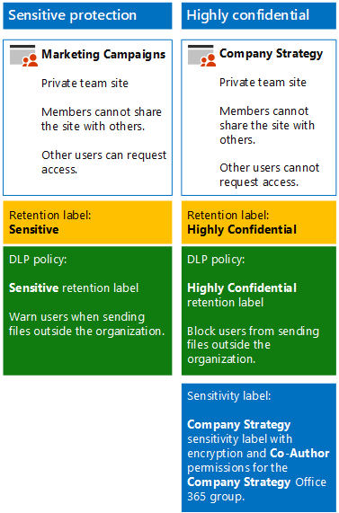

# <a name="secure-sharepoint-online-sites-in-a-devtest-environment"></a><span data-ttu-id="31f54-103">Beveiligde SharePoint Online-sites in een ontwikkel-/testomgeving</span><span class="sxs-lookup"><span data-stu-id="31f54-103">Secure SharePoint Online sites in a dev/test environment</span></span>

<span data-ttu-id="31f54-104">In dit artikel vindt u stapsgewijze instructies voor het maken van een ontwikkel-/testomgeving met gevoelige en zeer vertrouwelijke SharePoint-sites met de oplossing [Beveiligde SharePoint Online-sites en bestanden](secure-sharepoint-online-sites-and-files.md).</span><span class="sxs-lookup"><span data-stu-id="31f54-104">This article provides step-by-step instructions to create a dev/test environment that includes the sensitive and highly confidential SharePoint sites for the [Secure SharePoint Online sites and files](secure-sharepoint-online-sites-and-files.md) solution.</span></span>



<span data-ttu-id="31f54-106">Gebruik deze ontwikkel-/testomgeving om instellingen te testen en te verfijnen voor uw specifieke behoeften voordat u dit soort teamsites in de productie implementeert.</span><span class="sxs-lookup"><span data-stu-id="31f54-106">Use this dev/test environment to experiment and fine-tune settings for your specific needs before deploying these types of team sites in production.</span></span>

## <a name="phase-1-build-out-your-microsoft-365-enterprise-test-environment"></a><span data-ttu-id="31f54-107">Fase 1: uw Microsoft 365 Enterprise-testomgeving uitbouwen</span><span class="sxs-lookup"><span data-stu-id="31f54-107">Phase 1: Build out your Microsoft 365 Enterprise test environment</span></span>

<span data-ttu-id="31f54-108">Als u enkel gevoelige en zeer vertrouwelijke teamsites op een eenvoudige manier wilt testen met de minimale vereisten, volgt u de instructies in [Lichtgewicht basisconfiguratie](https://docs.microsoft.com/microsoft-365/enterprise/lightweight-base-configuration-microsoft-365-enterprise).</span><span class="sxs-lookup"><span data-stu-id="31f54-108">If you just want to test sensitive and highly confidential team sites in a lightweight way with the minimum requirements, follow the instructions in [Lightweight base configuration](https://docs.microsoft.com/microsoft-365/enterprise/lightweight-base-configuration-microsoft-365-enterprise).</span></span>

<span data-ttu-id="31f54-109">Als u gevoelige en zeer vertrouwelijke teamsites in een gesimuleerde onderneming wilt testen, volgt u de instructies in [Wachtwoord-hash-synchronisatie](https://docs.microsoft.com/microsoft-365/enterprise/password-hash-sync-m365-ent-test-environment).</span><span class="sxs-lookup"><span data-stu-id="31f54-109">If you want to test sensitive and highly confidential team sites in a simulated enterprise, follow the instructions in [Password hash synchronization](https://docs.microsoft.com/microsoft-365/enterprise/password-hash-sync-m365-ent-test-environment).</span></span>

> [!NOTE]
> <span data-ttu-id="31f54-110">Voor het testen van gevoelige en zeer vertrouwelijke teamsites hebt u geen testomgeving van een gesimuleerde onderneming nodig. Deze omgeving bevat een gesimuleerd intranet dat verbonden is met internet en een adreslijstsynchronisatie van een AD DS-forest (Active Directory Domain Services).</span><span class="sxs-lookup"><span data-stu-id="31f54-110">Testing sensitive and highly confidential team sites does not require the simulated enterprise test environment, which includes a simulated intranet connected to the Internet and directory synchronization for an Active Directory Domain Services (AD DS) forest.</span></span> <span data-ttu-id="31f54-111">Dit wordt hier als optie gegeven, zodat u gevoelige en zeer vertrouwelijke teamsites kunt testen en er mee kunt experimenteren in een omgeving die een standaardorganisatie voorstelt.</span><span class="sxs-lookup"><span data-stu-id="31f54-111">It is provided here as an option so that you can test sensitive and highly confidential team sites and experiment with it in an environment that represents a typical organization.</span></span>

## <a name="phase-2-create-and-configure-your-azure-active-directory-ad-groups-and-users"></a><span data-ttu-id="31f54-112">Fase 2: uw Microsoft Azure AD-groepen (Active Directory) en -gebruikers maken en configureren</span><span class="sxs-lookup"><span data-stu-id="31f54-112">Phase 2: Create and configure your Azure Active Directory (AD) groups and users</span></span>

<span data-ttu-id="31f54-113">In deze fase maakt en configureert u de Microsoft Azure AD-groepen en -gebruikers voor uw fictieve organisatie.</span><span class="sxs-lookup"><span data-stu-id="31f54-113">In this phase, you create and configure the Azure AD groups and users for your fictional organization.</span></span>

<span data-ttu-id="31f54-114">Maak eerst twee groepen voor een standaardorganisatie met de Microsoft Azure Portal.</span><span class="sxs-lookup"><span data-stu-id="31f54-114">First, create two groups for a typical organization with the Azure portal.</span></span>

1. <span data-ttu-id="31f54-115">Open een afzonderlijk tabblad in uw browser en ga naar de Microsoft Azure Portal op [https://portal.azure.com](https://portal.azure.com).</span><span class="sxs-lookup"><span data-stu-id="31f54-115">Create a separate tab in your browser, and then go to the Azure portal at [https://portal.azure.com](https://portal.azure.com).</span></span> <span data-ttu-id="31f54-116">Indien nodig meldt u zich aan met de inloggegevens van het algemene beheerdersaccount van uw proefabonnement of uw betaald abonnement op Microsoft 365 E5.</span><span class="sxs-lookup"><span data-stu-id="31f54-116">If needed, sign in with the credentials of the global administrator account for your Microsoft 365 E5 trial or paid subscription.</span></span>

2. <span data-ttu-id="31f54-117">Klik in de Microsoft Azure-portal op **Microsoft Azure Active Directory > Groepen**.</span><span class="sxs-lookup"><span data-stu-id="31f54-117">In the Azure portal, click **Azure Active Directory > Groups**.</span></span>

3. <span data-ttu-id="31f54-118">Klik in de blade **Groepen: Alle groepen** op **+ Nieuwe groep**.</span><span class="sxs-lookup"><span data-stu-id="31f54-118">On the **Groups - All groups** blade, click **+ New group**.</span></span>

4. <span data-ttu-id="31f54-119">In de blade **Groep**:</span><span class="sxs-lookup"><span data-stu-id="31f54-119">On the **Group** blade:</span></span>

   - <span data-ttu-id="31f54-120">Selecteer **Beveiliging** bij **Groepstype**.</span><span class="sxs-lookup"><span data-stu-id="31f54-120">Select **Security** in **Group type**.</span></span>

   - <span data-ttu-id="31f54-121">Typ **C-Suite** bij **Naam**.</span><span class="sxs-lookup"><span data-stu-id="31f54-121">Type **C-Suite** in **Name**.</span></span>

   - <span data-ttu-id="31f54-122">Selecteer **Toegewezen** bij **Lidmaatschapstype**.</span><span class="sxs-lookup"><span data-stu-id="31f54-122">Select **Assigned** in **Membership type**.</span></span>

5. <span data-ttu-id="31f54-123">Klik op **Maken** en sluit vervolgens de blade**Groep**.</span><span class="sxs-lookup"><span data-stu-id="31f54-123">Click **Create**, and then close the **Group** blade.</span></span>

6. <span data-ttu-id="31f54-124">Herhaal stappen 3-5 voor een nieuwe groep met de naam **Marketingpersoneel**.</span><span class="sxs-lookup"><span data-stu-id="31f54-124">Repeat steps 3-5 for a new group named **Marketing staff**.</span></span>

<span data-ttu-id="31f54-125">Vervolgens configureert u automatische licentieverlening, zodat de leden van uw groepen automatisch licenties krijgen toegewezen voor uw Microsoft 365- en EMS-abonnementen.</span><span class="sxs-lookup"><span data-stu-id="31f54-125">Next, you configure automatic licensing so that members of your groups are automatically assigned licenses for your Microsoft 365 and EMS subscriptions.</span></span>

1. <span data-ttu-id="31f54-126">Klik in de Microsoft Azure-portal op **licenties voor Azure Active Directory > alle producten**.</span><span class="sxs-lookup"><span data-stu-id="31f54-126">In the Azure portal, click **Azure Active Directory > Licenses > All products**.</span></span>

2. <span data-ttu-id="31f54-127">Selecteer in de lijst **Microsoft 365 Enterprise E5** en klik vervolgens op **Toewijzen**.</span><span class="sxs-lookup"><span data-stu-id="31f54-127">In the list, select **Microsoft 365 Enterprise E5**, and then click **Assign**.</span></span>

3. <span data-ttu-id="31f54-128">Klik in de blade **Licentie toewijzen** op \*\* Gebruikers en groepen\*\*.</span><span class="sxs-lookup"><span data-stu-id="31f54-128">In the **Assign license** blade, click **Users and groups**.</span></span>

4. <span data-ttu-id="31f54-129">In de lijst met groepen selecteert u het volgende:</span><span class="sxs-lookup"><span data-stu-id="31f54-129">In the list of groups, select the following:</span></span>

   - <span data-ttu-id="31f54-130">C-Suite</span><span class="sxs-lookup"><span data-stu-id="31f54-130">C-Suite</span></span>

   - <span data-ttu-id="31f54-131">Marketingpersoneel</span><span class="sxs-lookup"><span data-stu-id="31f54-131">Marketing staff</span></span>

5. <span data-ttu-id="31f54-132">Klik op **Selecteren** en klik vervolgens op **Toewijzen**.</span><span class="sxs-lookup"><span data-stu-id="31f54-132">Click **Select**, and then click **Assign**.</span></span>

6. <span data-ttu-id="31f54-133">Sluit het tabblad Azure Portal in uw browser.</span><span class="sxs-lookup"><span data-stu-id="31f54-133">Close the Azure portal tab in your browser.</span></span>

<span data-ttu-id="31f54-134">Vervolgens maakt u [Verbinding met de Windows PowerShell voor Graph-module van Microsoft Azure Active Directory](https://docs.microsoft.com/office365/enterprise/powershell/connect-to-office-365-powershell#connect-with-the-azure-active-directory-powershell-for-graph-module).</span><span class="sxs-lookup"><span data-stu-id="31f54-134">Next, you [Connect with the Azure Active Directory PowerShell for Graph module ](https://docs.microsoft.com/office365/enterprise/powershell/connect-to-office-365-powershell#connect-with-the-azure-active-directory-powershell-for-graph-module).</span></span>

<span data-ttu-id="31f54-135">Vul de naam van uw organisatie, uw locatie en een gemeenschappelijk wachtwoord in en voer vervolgens deze opdrachten uit in de opdrachtprompt van Windows PowerShell of de Integrated Scripting Environment (ISE) om gebruikersaccounts te maken en toe te voegen aan hun groepen:</span><span class="sxs-lookup"><span data-stu-id="31f54-135">Fill in your organization name, your location, and a common password, and then run these commands from the PowerShell command prompt or Integrated Script Environment (ISE) to create user accounts and add them to their groups:</span></span>

```powershell
$orgName="<organization name, such as contoso for the contoso.onmicrosoft.com trial subscription domain name>"
$location="<the ISO ALPHA2 country code, such as US for the United States>"
$commonPassword="<common password for all the new accounts>"

$PasswordProfile=New-Object -TypeName Microsoft.Open.AzureAD.Model.PasswordProfile
$PasswordProfile.Password=$commonPassword

$groupName="C-Suite"
$userNames=@("CEO","CFO","CIO")
$groupID=(Get-AzureADGroup | Where { $_.DisplayName -eq $groupName }).ObjectID
ForEach ($element in $userNames){
New-AzureADUser -DisplayName $element -PasswordProfile $PasswordProfile -UserPrincipalName ($element + "@" + $orgName + ".onmicrosoft.com") -AccountEnabled $true -MailNickName $element -UsageLocation $location
Add-AzureADGroupMember -RefObjectId (Get-AzureADUser | Where { $_.DisplayName -eq $element }).ObjectID -ObjectId $groupID
}
$groupName="Marketing staff"
$userNames=@("Marketing1", "Marketing2")
$groupID=(Get-AzureADGroup | Where { $_.DisplayName -eq $groupName }).ObjectID
ForEach ($element in $userNames){
New-AzureADUser -DisplayName $element -PasswordProfile $PasswordProfile -UserPrincipalName ($element + "@" + $orgName + ".onmicrosoft.com") -AccountEnabled $true -MailNickName $element -UsageLocation $location
Add-AzureADGroupMember -RefObjectId (Get-AzureADUser | Where { $_.DisplayName -eq $element }).ObjectID -ObjectId $groupID
}
```

> [!NOTE]
> <span data-ttu-id="31f54-136">U gebruikt hier een gemeenschappelijk wachtwoord voor automatisering en configuratiegemak in een ontwikkel-/testomgeving.</span><span class="sxs-lookup"><span data-stu-id="31f54-136">The use of a common password here is for automation and ease of configuration for a dev/test environment.</span></span> <span data-ttu-id="31f54-137">Uiteraard wordt dit sterk afgeraden voor productieabonnementen.</span><span class="sxs-lookup"><span data-stu-id="31f54-137">Obviously, this is highly discouraged for production subscriptions.</span></span>

<span data-ttu-id="31f54-138">Volg deze stappen om te controleren of de licentieverlening op groepsbasis correct werkt.</span><span class="sxs-lookup"><span data-stu-id="31f54-138">Use these steps to verify that group-based licensing is working correctly.</span></span>

1. <span data-ttu-id="31f54-139">Klik in het tabblad **Microsoft Office voor Thuisgebruik** van uw browser op de tegel **Beheerder**.</span><span class="sxs-lookup"><span data-stu-id="31f54-139">From the **Microsoft Office Home** tab of your browser, click the **Admin** tile.</span></span>

2. <span data-ttu-id="31f54-140">Klik in het nieuwe tabblad **Microsoft 365-beheercentrum** van uw browser op **Gebruikers**.</span><span class="sxs-lookup"><span data-stu-id="31f54-140">From the new **Microsoft 365 admin center** tab of your browser, click **Users**.</span></span>

3. <span data-ttu-id="31f54-141">Klik in de lijst met gebruikers op **CEO**.</span><span class="sxs-lookup"><span data-stu-id="31f54-141">In the list of users, click **CEO**.</span></span>

4. <span data-ttu-id="31f54-142">In het deelvenster met de eigenschappen van het gebruikersaccount van de **CEO** controleert u dat dit account de licentie **Microsoft 365 Enterprise E5** heeft toegewezen gekregen (bij **Productlicenties**).</span><span class="sxs-lookup"><span data-stu-id="31f54-142">In the pane that lists the properties of the **CEO** user account, verify that it has been assigned the **Microsoft 365 Enterprise E5** license (in **Product licenses**).</span></span>

## <a name="phase-3-create-retention-labels"></a><span data-ttu-id="31f54-143">Fase 3: retentielabels maken</span><span class="sxs-lookup"><span data-stu-id="31f54-143">Phase 3: Create retention labels</span></span>

<span data-ttu-id="31f54-144">In deze fase maakt u de retentielabels voor documenten in uw SharePoint-teamsites.</span><span class="sxs-lookup"><span data-stu-id="31f54-144">In this phase, you create the retention labels for documents in your SharePoint team sites.</span></span>

1. <span data-ttu-id="31f54-145">Meld u aan bij het [Microsoft 365-compliancecentrum](https://compliance.microsoft.com) met uw algemeen beheerdersaccount.</span><span class="sxs-lookup"><span data-stu-id="31f54-145">Sign in to the [Microsoft 365 compliance portal](https://compliance.microsoft.com) with your global admin account.</span></span>

2. <span data-ttu-id="31f54-146">Klik op het tabblad **Start: Microsoft 365-compliancecentrum** van uw browser op **Classificaties > Labels**.</span><span class="sxs-lookup"><span data-stu-id="31f54-146">From the **Home - Microsoft 365 compliance** tab of your browser, click **Classifications > Labels**.</span></span>

3. <span data-ttu-id="31f54-147">Klik op **Retentielabels > Een label maken**.</span><span class="sxs-lookup"><span data-stu-id="31f54-147">Click **Retention labels > Create a label**.</span></span>

4. <span data-ttu-id="31f54-148">Typ in het deelvenster **Uw label een naam geven** **Vertrouwelijk** in **Uw label een naam geven** en klik vervolgens op **Volgende**.</span><span class="sxs-lookup"><span data-stu-id="31f54-148">On the **Name your label** pane, type **Sensitive** in **Name your label**, and then click **Next**.</span></span>

5. <span data-ttu-id="31f54-149">Klik in het deelvenster **Bestandsplandescriptors** op **Volgende**.</span><span class="sxs-lookup"><span data-stu-id="31f54-149">On the **File plan descriptors** pane, click **Next**.</span></span>

6. <span data-ttu-id="31f54-150">Indien nodig kunt u in het deelvenster **Labelinstellingen** de **Retentie** instellen op **Aan** en vervolgens klikt u op **Volgende**.</span><span class="sxs-lookup"><span data-stu-id="31f54-150">On the **Label settings** pane, if needed, set **Retention** to **On**, and then click **Next**.</span></span>

7. <span data-ttu-id="31f54-151">Klik in het deelvenster **Uw instellingen controleren** op **Label maken**.</span><span class="sxs-lookup"><span data-stu-id="31f54-151">On the **Review your settings** pane, click **Create the label**.</span></span>

8. <span data-ttu-id="31f54-152">Herhaal stappen 3-7 voor een extra retentielabel met de naam **Zeer vertrouwelijk**.</span><span class="sxs-lookup"><span data-stu-id="31f54-152">Repeat steps 3-7 for an additional retention label named **Highly Confidential**.</span></span>

9. <span data-ttu-id="31f54-153">Klik in het deelvenster **Start > Labels** op **Labels publiceren**.</span><span class="sxs-lookup"><span data-stu-id="31f54-153">From the **Home > Labels** pane, click **Publish labels**.</span></span>

10. <span data-ttu-id="31f54-154">Klik in het deelvenster **Labels kiezen om te publiceren** op de optie **Labels kiezen om te publiceren**.</span><span class="sxs-lookup"><span data-stu-id="31f54-154">On the **Choose labels to publish** pane, click **Choose labels to publish**.</span></span>

11. <span data-ttu-id="31f54-155">Klik op het deelvenster **Labels kiezen** op **Toevoegen** en selecteer alle vier de labels.</span><span class="sxs-lookup"><span data-stu-id="31f54-155">On the **Choose labels** pane, click **Add** and select all four labels.</span></span>

12. <span data-ttu-id="31f54-156">Klik op **Gereed**.</span><span class="sxs-lookup"><span data-stu-id="31f54-156">Click **Done**.</span></span>

13. <span data-ttu-id="31f54-157">Klik in het deelvenster **Labels kiezen om te publiceren** op **Volgende**.</span><span class="sxs-lookup"><span data-stu-id="31f54-157">On the **Choose labels to publish** pane, click **Next**.</span></span>

14. <span data-ttu-id="31f54-158">Klik in het deelvenster **Locaties kiezen** op **Volgende**.</span><span class="sxs-lookup"><span data-stu-id="31f54-158">On the **Choose locations** pane, click **Next**.</span></span>

15. <span data-ttu-id="31f54-159">Typ in het deelvenster **Uw beleid een naam geven** **Voorbeeldorganisatie** in **Naam** en klik vervolgens op **Volgende**.</span><span class="sxs-lookup"><span data-stu-id="31f54-159">On the **Name your policy** pane, type **Example organization** in **Name**, and then click **Next**.</span></span>

16. <span data-ttu-id="31f54-160">Klik in het deelvenster **Uw instellingen controleren** op **Labels publiceren** en klik vervolgens op **Sluiten**.</span><span class="sxs-lookup"><span data-stu-id="31f54-160">On the **Review your settings** pane, click **Publish labels**, and then click **Close**.</span></span>

## <a name="phase-4-create-your-team-sites"></a><span data-ttu-id="31f54-161">Fase 4: uw teamsites maken</span><span class="sxs-lookup"><span data-stu-id="31f54-161">Phase 4: Create your team sites</span></span>

<span data-ttu-id="31f54-162">In deze fase maakt en configureert u gevoelige en zeer vertrouwelijke teamsites voor uw voorbeeldorganisatie.</span><span class="sxs-lookup"><span data-stu-id="31f54-162">In this phase, you create and configure sensitive and highly confidential team sites for your example organization.</span></span>

### <a name="sensitive-team-site-for-marketing-campaigns"></a><span data-ttu-id="31f54-163">Gevoelige teamsite voor marketingcampagnes</span><span class="sxs-lookup"><span data-stu-id="31f54-163">Sensitive team site for marketing campaigns</span></span>

<span data-ttu-id="31f54-164">Maak eerst een gevoelige teamsite met voor leden van de marketinggroep waarin zij kunnen samenwerken aan lopende marketingcampagnes.</span><span class="sxs-lookup"><span data-stu-id="31f54-164">First, create a sensitive-level team site for members of the marketing group to collaborate on ongoing marketing campaigns.</span></span>

1. <span data-ttu-id="31f54-165">[Maak een nieuwe privéteamsite](https://support.office.com/article/ef10c1e7-15f3-42a3-98aa-b5972711777d) met de naam **Marketingcampagnes**.</span><span class="sxs-lookup"><span data-stu-id="31f54-165">[Create a new private team site](https://support.office.com/article/ef10c1e7-15f3-42a3-98aa-b5972711777d) with the name **Marketing Campaigns**.</span></span>

2. <span data-ttu-id="31f54-166">Klik op de werkbalk van de SharePoint-teamsite op het pictogram Instellingen en vervolgens op **Sitemachtigingen**.</span><span class="sxs-lookup"><span data-stu-id="31f54-166">In the tool bar of the SharePoint team site, click the settings icon, and then click **Site permissions**.</span></span>

3. <span data-ttu-id="31f54-167">Klik in het deelvenster **Site-machtigingen**, onder **Instellingen voor delen** op **Instellingen voor delen wijzigen**.</span><span class="sxs-lookup"><span data-stu-id="31f54-167">In the **Site permissions** pane, under **Sharing Settings**, click **Change sharing settings**.</span></span>

4. <span data-ttu-id="31f54-168">Kies onder **Machtigingen voor delen** de optie **Alleen site-eigenaren kunnen bestanden, mappen en de site delen** en klik vervolgens op **Opslaan**.</span><span class="sxs-lookup"><span data-stu-id="31f54-168">Under **Sharing permissions**, choose **Only site owners can share files, folders, and the site**, and then click **Save**.</span></span>

<span data-ttu-id="31f54-169">Configureer vervolgens de documentenmap van de SharePoint-teamsite Marketingcampagnes voor het retentielabel Gevoelig.</span><span class="sxs-lookup"><span data-stu-id="31f54-169">Next, configure the documents folder of the Marketing Campaigns SharePoint team site for the Sensitive retention label.</span></span>

1. <span data-ttu-id="31f54-170">Klik op het tabblad **Start: Marketingcampagnes** van uw browser op **Documenten**.</span><span class="sxs-lookup"><span data-stu-id="31f54-170">In the **Marketing Campaigns-Home** tab of your browser, click **Documents**.</span></span>

2. <span data-ttu-id="31f54-171">Klik op het pictogram Instellingen en vervolgens op **Bibliotheekinstellingen**.</span><span class="sxs-lookup"><span data-stu-id="31f54-171">Click the settings icon, and then click **Library settings**.</span></span>

3. <span data-ttu-id="31f54-172">Klik onder **Machtigingen en beheer** op **Label op items in deze bibliotheek toepassen**.</span><span class="sxs-lookup"><span data-stu-id="31f54-172">Under **Permissions and Management**, click **Apply label to items in this library**.</span></span>

4. <span data-ttu-id="31f54-173">Selecteer in **Instellingen: Label toepassen** de optie **Gevoelig**en klik vervolgens op **Opslaan**.</span><span class="sxs-lookup"><span data-stu-id="31f54-173">In **Settings-Apply Label**, select **Sensitive**, and then click **Save**.</span></span>

<span data-ttu-id="31f54-174">Configureer vervolgens een beleid voor de preventie van gegevensverlies (DLP) waardoor gebruikers worden gewaarschuwd wanneer ze een document met het label Gevoelig buiten de organisatie delen, waaronder documenten op de site Marketingcampagnes.</span><span class="sxs-lookup"><span data-stu-id="31f54-174">Next, configure a data loss prevention (DLP) policy that notifies users when they share a document with the Sensitive label, which includes documents in the Marketing Campaigns site, outside the organization.</span></span>

1. <span data-ttu-id="31f54-175">Meld u aan bij het [Microsoft 365-compliancecentrum](https://compliance.microsoft.com/) met uw algemeen beheerdersaccount.</span><span class="sxs-lookup"><span data-stu-id="31f54-175">Sign in to the [Microsoft 365 compliance portal](https://compliance.microsoft.com/) with your global admin account.</span></span>

2. <span data-ttu-id="31f54-176">Klik op het nieuwe tabblad **Microsoft 365-compliance** in uw browser op **Beleid > Preventie van gegevensverlies**.</span><span class="sxs-lookup"><span data-stu-id="31f54-176">On the new **Microsoft 365 compliance** tab in your browser, click **Policies > Data loss prevention**.</span></span>

3. <span data-ttu-id="31f54-177">Klik in het deelvenster **Start > Preventie van gegevensverlies** op **Een beleid maken**.</span><span class="sxs-lookup"><span data-stu-id="31f54-177">In the **Home > Data loss prevention** pane, click **Create a policy**.</span></span>

4. <span data-ttu-id="31f54-178">Klik in het deelvenster **Met een sjabloon beginnen of een aangepast beleid maken** op **Aangepast**en klik vervolgens op **Volgende**.</span><span class="sxs-lookup"><span data-stu-id="31f54-178">In the **Start with a template or create a custom policy** pane, click **Custom**, and then click **Next**.</span></span>

5. <span data-ttu-id="31f54-179">Typ in het deelvenster **Uw beleid een naam geven** **Label Gevoelig voor SharePoint-sites** in **Naam**en klik vervolgens op **Volgende**.</span><span class="sxs-lookup"><span data-stu-id="31f54-179">In the **Name your policy** pane, type **Sensitive label SharePoint sites** in **Name**, and then click **Next**.</span></span>

6. <span data-ttu-id="31f54-180">Klik in het deelvenster **Locaties kiezen** op **Laat mij specifieke locaties kiezen** en klik vervolgens op **Volgende**.</span><span class="sxs-lookup"><span data-stu-id="31f54-180">In the **Choose locations** pane, click **Let me choose specific locations**, and then click **Next**.</span></span>

7. <span data-ttu-id="31f54-181">Schakel in de lijst met locaties de locaties **Exchange-e-mail**, **OneDrive-accounts** en **chat- en kanaalberichten in Teams** uit en klik vervolgens op **Volgende**.</span><span class="sxs-lookup"><span data-stu-id="31f54-181">In the list of locations, disable the **Exchange email**, **OneDrive accounts**, and **Teams chat and channel messages** locations, and then click **Next**.</span></span>

8. <span data-ttu-id="31f54-182">Klik in het deelvenster **Het type inhoud aanpassen dat u wilt beveiligen** op **Bewerken**.</span><span class="sxs-lookup"><span data-stu-id="31f54-182">In the **Customize the type of content you want to protect** pane, click **Edit**.</span></span>

9. <span data-ttu-id="31f54-183">Klik in het deelvenster **Kies de typen inhoud die u wilt beveiligen** op **Toevoegen** in de vervolgkeuzelijst en klik vervolgens op **Retentielabels**.</span><span class="sxs-lookup"><span data-stu-id="31f54-183">In the **Choose the types of content to protect** pane, click **Add** in the drop-down box, and then click **Retention labels**.</span></span>

10. <span data-ttu-id="31f54-184">Klik in het deelvenster **Retentielabels** op **Toevoegen**, selecteer het label **Gevoelig**, klik op **Toevoegen**en klik vervolgens op **Gereed**.</span><span class="sxs-lookup"><span data-stu-id="31f54-184">In the **Retention labels** pane, click **Add**, select the **Sensitive** label, click **Add**, and then click **Done**.</span></span>

11. <span data-ttu-id="31f54-185">Klik in het deelvenster **Kies de typen inhoud die u wilt beveiligen** op **Opslaan**.</span><span class="sxs-lookup"><span data-stu-id="31f54-185">In the **Choose the types of content to protect** pane, click **Save**.</span></span>

12. <span data-ttu-id="31f54-186">Klik in het deelvenster **Het type inhoud aanpassen dat u wilt beveiligen** op **Volgende**.</span><span class="sxs-lookup"><span data-stu-id="31f54-186">In the **Customize the type of content you want to protect** pane, click **Next**.</span></span>

13. <span data-ttu-id="31f54-187">Klik in het deelvenster **Wat wilt u doen als we gevoelige informatie herkennen?** op **De tip en de e-mail aanpassen**.</span><span class="sxs-lookup"><span data-stu-id="31f54-187">In the **What do you want to do if we detect sensitive info?** pane, click **Customize the tip and email**.</span></span>

14. <span data-ttu-id="31f54-188">Klik in het deelvenster **Beleidstips en e-mailmeldingen aanpassen** op **tekst voor beleidstip aanpassen**.</span><span class="sxs-lookup"><span data-stu-id="31f54-188">In the **Customize policy tips and email notifications** pane, click **Customize the policy tip text**.</span></span>

15. <span data-ttu-id="31f54-189">Typ of plak in het tekstvak de volgende tekst:</span><span class="sxs-lookup"><span data-stu-id="31f54-189">In the text box, type or paste in the following:</span></span>

    <span data-ttu-id="31f54-190">Als u wilt delen met een gebruiker buiten de organisatie downloadt en opent u het bestand.</span><span class="sxs-lookup"><span data-stu-id="31f54-190">To share with a user outside the organization, download the file and then open it.</span></span> <span data-ttu-id="31f54-191">Klik op Bestand, vervolgens op Document beveiligen en daarna op Versleutelen met wachtwoord en geef tot slot een sterk wachtwoord op.</span><span class="sxs-lookup"><span data-stu-id="31f54-191">Click File, then Protect Document, and then Encrypt with Password, and then specify a strong password.</span></span> <span data-ttu-id="31f54-192">Stuur het wachtwoord in een afzonderlijk e-mailbericht of via een ander communicatiemiddel.</span><span class="sxs-lookup"><span data-stu-id="31f54-192">Send the password in a separate email or other means of communication.</span></span>

16. <span data-ttu-id="31f54-193">Klik op **OK**.</span><span class="sxs-lookup"><span data-stu-id="31f54-193">Click **OK**.</span></span>

17. <span data-ttu-id="31f54-194">Klik in het deelvenster **Wat wilt u doen als we gevoelige informatie herkennen?** op **Volgende**.</span><span class="sxs-lookup"><span data-stu-id="31f54-194">In the **What do you want to do if we detect sensitive info?** pane, click **Next**.</span></span>

18. <span data-ttu-id="31f54-195">Klik in het deelvenster **Wilt u het beleid inschakelen of eerst testen?** op **Ja, schakel het meteen in** en klik vervolgens op **Volgende**.</span><span class="sxs-lookup"><span data-stu-id="31f54-195">In the **Do you want to turn on the policy or test things out first?** pane, click **Yes, turn it on right away**, and then click **Next**.</span></span>

19. <span data-ttu-id="31f54-196">Klik in het deelvenster **Uw instellingen controleren** op **Maken** en klik vervolgens op **Sluiten**.</span><span class="sxs-lookup"><span data-stu-id="31f54-196">In the **Review your settings** pane, click **Create**, and then click **Close**.</span></span>

### <a name="company-strategy-team-site"></a><span data-ttu-id="31f54-197">Teamsite Bedrijfsstrategie</span><span class="sxs-lookup"><span data-stu-id="31f54-197">Company strategy team site</span></span>

<span data-ttu-id="31f54-198">Maak eerst u een zeer vertrouwelijk teamsite voor het senior leiderschapsteam zodat zij kunnen samenwerken aan de bedrijfsstrategie.</span><span class="sxs-lookup"><span data-stu-id="31f54-198">First, create a highly confidential-level team site for the senior leadership team to collaborate on company strategy.</span></span>

1. <span data-ttu-id="31f54-199">[Maak een nieuwe privéteamsite](https://support.office.com/article/ef10c1e7-15f3-42a3-98aa-b5972711777d) met de naam **Bedrijfsstrategie**.</span><span class="sxs-lookup"><span data-stu-id="31f54-199">[Create a new private team site](https://support.office.com/article/ef10c1e7-15f3-42a3-98aa-b5972711777d) with the name **Company Strategy**.</span></span>
2. <span data-ttu-id="31f54-200">Klik op de werkbalk van de SharePoint-teamsite op het pictogram Instellingen en vervolgens op **Sitemachtigingen**.</span><span class="sxs-lookup"><span data-stu-id="31f54-200">In the tool bar of the SharePoint team site, click the settings icon, and then click **Site permissions**.</span></span>

3. <span data-ttu-id="31f54-201">Klik in het deelvenster **Site-machtigingen**, onder **Instellingen voor delen** op **Instellingen voor delen wijzigen**.</span><span class="sxs-lookup"><span data-stu-id="31f54-201">In the **Site permissions** pane, under **Sharing Settings**, click **Change sharing settings**.</span></span>

4. <span data-ttu-id="31f54-202">Kies onder **Machtigingen voor delen**, **Alleen site-eigenaren kunnen bestanden, mappen en de site delen**.</span><span class="sxs-lookup"><span data-stu-id="31f54-202">Under **Sharing permissions**, choose **Only site owners can share files, folders, and the site**.</span></span>

5. <span data-ttu-id="31f54-203">Schakel **Toegangsaanvragen toestaan** uit en klik op **Opslaan**.</span><span class="sxs-lookup"><span data-stu-id="31f54-203">Turn off **Allow access requests**, and then click **Save**.</span></span>

<span data-ttu-id="31f54-204">Configureer vervolgens de documentenmap van de SharePoint-teamsite Bedrijfsstrategie voor het label Zeer vertrouwelijk.</span><span class="sxs-lookup"><span data-stu-id="31f54-204">Next, configure the documents folder of the Company Strategy SharePoint team site for the Highly Confidential label.</span></span>

1. <span data-ttu-id="31f54-205">Klik op het tabblad **Start: Bedrijfsstrategie** van uw browser op **Documenten**.</span><span class="sxs-lookup"><span data-stu-id="31f54-205">In the **Company Strategy-Home** tab of your browser, click **Documents**.</span></span>

2. <span data-ttu-id="31f54-206">Klik op het pictogram Instellingen en vervolgens op **Bibliotheekinstellingen**.</span><span class="sxs-lookup"><span data-stu-id="31f54-206">Click the settings icon, and then click **Library settings**.</span></span>

3. <span data-ttu-id="31f54-207">Klik onder **Machtigingen en beheer** op **Label op items in deze bibliotheek toepassen**.</span><span class="sxs-lookup"><span data-stu-id="31f54-207">Under **Permissions and Management**, click **Apply label to items in this library**.</span></span>

4. <span data-ttu-id="31f54-208">Selecteer in **Instellingen: label toepassen** de optie **Zeer vertrouwelijk**en klik vervolgens op **Opslaan**.</span><span class="sxs-lookup"><span data-stu-id="31f54-208">In **Settings-Apply Label**, select **Highly Confidential**, and then click **Save**.</span></span>

<span data-ttu-id="31f54-209">Configureer vervolgens een DLP-beleid waarbij gebruikers worden geblokkeerd wanneer ze een document met het label Zeer vertrouwelijk buiten de organisatie delen, waaronder documenten van de Bedrijfsstrategiesite.</span><span class="sxs-lookup"><span data-stu-id="31f54-209">Next, configure a DLP policy that blocks users when they share a document with the Highly Confidential label, which includes documents in the Company Strategy site, outside the organization.</span></span>

1. <span data-ttu-id="31f54-210">Meld u aan bij het [Microsoft 365-compliancecentrum](https://compliance.microsoft.com/) met uw algemeen beheerdersaccount.</span><span class="sxs-lookup"><span data-stu-id="31f54-210">Sign in to the [Microsoft 365 compliance portal](https://compliance.microsoft.com/) with your global admin.</span></span>

2. <span data-ttu-id="31f54-211">Klik op het nieuwe tabblad **Microsoft 365-compliance** in uw browser op **Beleid > Preventie van gegevensverlies**.</span><span class="sxs-lookup"><span data-stu-id="31f54-211">On the new **Microsoft 365 compliance** tab in your browser, click **Policies > Data loss prevention**.</span></span>

3. <span data-ttu-id="31f54-212">Klik in het deelvenster **Start > Preventie van gegevensverlies** op **Een beleid maken**.</span><span class="sxs-lookup"><span data-stu-id="31f54-212">In the **Home > Data loss prevention** pane, click **Create a policy**.</span></span>

4. <span data-ttu-id="31f54-213">Klik in het deelvenster **Met een sjabloon beginnen of een aangepast beleid maken** op **Aangepast**en klik vervolgens op **Volgende**.</span><span class="sxs-lookup"><span data-stu-id="31f54-213">In the **Start with a template or create a custom policy** pane, click **Custom**, and then click **Next**.</span></span>

5. <span data-ttu-id="31f54-214">Typ in het deelvenster **Uw beleid een naam geven** **Label Zeer vertrouwelijk voor SharePoint-sites** in **Naam**en klik vervolgens op **Volgende**.</span><span class="sxs-lookup"><span data-stu-id="31f54-214">In the **Name your policy** pane, type **Highly Confidential label SharePoint sites** in **Name**, and then click **Next**.</span></span>

6. <span data-ttu-id="31f54-215">Klik in het deelvenster **Locaties kiezen** op **Laat mij specifieke locaties kiezen** en klik vervolgens op **Volgende**.</span><span class="sxs-lookup"><span data-stu-id="31f54-215">In the **Choose locations** pane, click **Let me choose specific locations**, and then click **Next**.</span></span>

7. <span data-ttu-id="31f54-216">Schakel in de lijst met locaties de locaties **Exchange-e-mail**, **OneDrive-accounts** en **chat- en kanaalberichten in Teams** uit en klik vervolgens op **Volgende**.</span><span class="sxs-lookup"><span data-stu-id="31f54-216">In the list of locations, disable the **Exchange email**, **OneDrive accounts**, and **Teams chat and channel messages** locations, and then click **Next**.</span></span>

8. <span data-ttu-id="31f54-217">Klik in het deelvenster **Het type inhoud aanpassen dat u wilt beveiligen** op **Bewerken**.</span><span class="sxs-lookup"><span data-stu-id="31f54-217">In the **Customize the type of content you want to protect** pane, click **Edit**.</span></span>

9. <span data-ttu-id="31f54-218">Klik in het deelvenster **Kies de typen inhoud die u wilt beveiligen** op **Toevoegen** in de vervolgkeuzelijst en klik vervolgens op **Retentielabels**.</span><span class="sxs-lookup"><span data-stu-id="31f54-218">In the **Choose the types of content to protect** pane, click **Add** in the drop-down box, and then click **Retention labels**.</span></span>

10. <span data-ttu-id="31f54-219">Klik in het deelvenster **Retentielabels** op **Toevoegen**, selecteer het label **Zeer Vertrouwelijk**, klik op **Toevoegen**en klik vervolgens op **Gereed**.</span><span class="sxs-lookup"><span data-stu-id="31f54-219">In the **Retention labels** pane, click **Add**, select the **Highly Confidential** label, click **Add**, and then click **Done**.</span></span>

11. <span data-ttu-id="31f54-220">Klik in het deelvenster **Kies de typen inhoud die u wilt beveiligen** op **Opslaan**.</span><span class="sxs-lookup"><span data-stu-id="31f54-220">In the **Choose the types of content to protect** pane, click **Save**.</span></span>

12. <span data-ttu-id="31f54-221">Klik in het deelvenster **Het type inhoud aanpassen dat u wilt beveiligen** op **Volgende**.</span><span class="sxs-lookup"><span data-stu-id="31f54-221">In the **Customize the type of content you want to protect** pane, click **Next**.</span></span>

13. <span data-ttu-id="31f54-222">Klik in het deelvenster **Wat wilt u doen als we gevoelige informatie herkennen?** op **De tip en de e-mail aanpassen**.</span><span class="sxs-lookup"><span data-stu-id="31f54-222">In the **What do you want to do if we detect sensitive info?** pane, click **Customize the tip and email**.</span></span>

14. <span data-ttu-id="31f54-223">Klik in het deelvenster **Beleidstips en e-mailmeldingen aanpassen** op **tekst voor beleidstip aanpassen**.</span><span class="sxs-lookup"><span data-stu-id="31f54-223">In the **Customize policy tips and email notifications** pane, click **Customize the policy tip text**.</span></span>

15. <span data-ttu-id="31f54-224">Typ of plak in het tekstvak de volgende tekst:</span><span class="sxs-lookup"><span data-stu-id="31f54-224">In the text box, type or paste in the following:</span></span>

    <span data-ttu-id="31f54-225">Als u wilt delen met een gebruiker buiten de organisatie downloadt en opent u het bestand.</span><span class="sxs-lookup"><span data-stu-id="31f54-225">To share with a user outside the organization, download the file and then open it.</span></span> <span data-ttu-id="31f54-226">Klik op Bestand, vervolgens op Document beveiligen en daarna op Versleutelen met wachtwoord en geef tot slot een sterk wachtwoord op.</span><span class="sxs-lookup"><span data-stu-id="31f54-226">Click File, then Protect Document, and then Encrypt with Password, and then specify a strong password.</span></span> <span data-ttu-id="31f54-227">Stuur het wachtwoord in een afzonderlijk e-mailbericht of via een ander communicatiemiddel.</span><span class="sxs-lookup"><span data-stu-id="31f54-227">Send the password in a separate email or other means of communication.</span></span>

16. <span data-ttu-id="31f54-228">Klik op **OK**.</span><span class="sxs-lookup"><span data-stu-id="31f54-228">Click **OK**.</span></span>

17. <span data-ttu-id="31f54-229">Klik in het deelvenster **Wilt u het beleid inschakelen of eerst testen?** op **Ja, schakel het meteen in** en klik vervolgens op **Volgende**.</span><span class="sxs-lookup"><span data-stu-id="31f54-229">In the **Do you want to turn on the policy or test things out first?** pane, click **Yes, turn it on right away**, and then click **Next**.</span></span>

18. <span data-ttu-id="31f54-230">Klik in het deelvenster **Wilt u het beleid inschakelen of eerst testen?** op **Ja, schakel het meteen in** en klik vervolgens op **Volgende**.</span><span class="sxs-lookup"><span data-stu-id="31f54-230">In the **Do you want to turn on the policy or test things out first?** pane, click **Yes, turn it on right away**, and then click **Next**.</span></span>

19. <span data-ttu-id="31f54-231">Klik in het deelvenster **Uw instellingen controleren** op **Maken** en klik vervolgens op **Sluiten**.</span><span class="sxs-lookup"><span data-stu-id="31f54-231">In the **Review your settings** pane, click **Create**, and then click **Close**.</span></span>

<span data-ttu-id="31f54-232">Gebruik [deze instructies](https://docs.microsoft.com/microsoft-365/compliance/encryption-sensitivity-labels) om een gevoeligheidslabel met de volgende instellingen te configureren:</span><span class="sxs-lookup"><span data-stu-id="31f54-232">Use [these instructions](https://docs.microsoft.com/microsoft-365/compliance/encryption-sensitivity-labels) to configure a sensitivity label with the following settings:</span></span>

- <span data-ttu-id="31f54-233">De naam van het label is Bedrijfsstrategie</span><span class="sxs-lookup"><span data-stu-id="31f54-233">The name of the label is Company Strategy</span></span>

- <span data-ttu-id="31f54-234">Versleuteling is ingeschakeld.</span><span class="sxs-lookup"><span data-stu-id="31f54-234">Encryption is enabled</span></span>

- <span data-ttu-id="31f54-235">De groep Bedrijfsstrategie heeft cocreatie-machtigingen</span><span class="sxs-lookup"><span data-stu-id="31f54-235">The Company Strategy group has Co-Author permissions</span></span>

<span data-ttu-id="31f54-236">Publiceer na het maken het nieuwe label.</span><span class="sxs-lookup"><span data-stu-id="31f54-236">After creating, publish the new label.</span></span> <span data-ttu-id="31f54-237">Als u zich aanmeldt als lid van de groep Bedrijfsstrategie ziet u het nieuwe label in de optie Gevoeligheid op de werkbalk Start van Word, Excel en PowerPoint.</span><span class="sxs-lookup"><span data-stu-id="31f54-237">If you sign in as a member of the Company Strategy group, you will see the new label in the Sensitivity option in the Home toolbar of Word, Excel, and PowerPoint.</span></span> <span data-ttu-id="31f54-238">Selecteer het label Bedrijfsstrategie bij de optie Gevoeligheid om het label aan een bestand toe te wijzen.</span><span class="sxs-lookup"><span data-stu-id="31f54-238">Select the Company Strategy label from the Sensitivity option to assign the label to a file.</span></span>

<span data-ttu-id="31f54-239">Bestanden in het documentgedeelte van de SharePoint-site Bedrijfsstrategie krijgen het bewaarlabel Zeer vertrouwelijk toegewezen en zijn onderworpen aan het geconfigureerde DLP-beleid.</span><span class="sxs-lookup"><span data-stu-id="31f54-239">Files in the documents section of the Company Strategy SharePoint team site are assigned the Highly confidential retention label and are subject to the configured DLP policy.</span></span> <span data-ttu-id="31f54-240">Aan bestanden kan ook het gevoeligheidslabel Bedrijfsstrategie worden toegewezen.</span><span class="sxs-lookup"><span data-stu-id="31f54-240">Files can also have the Company Strategy sensitivity label assigned.</span></span>

<span data-ttu-id="31f54-241">Hier vindt u de uiteindelijke configuratie voor de teamsites Marketingcampagnes en Bedrijfsstrategie.</span><span class="sxs-lookup"><span data-stu-id="31f54-241">Here is the resulting configuration for the Marketing Campaigns and Company Strategy team sites.</span></span>


## <a name="next-step"></a><span data-ttu-id="31f54-243">Volgende stap</span><span class="sxs-lookup"><span data-stu-id="31f54-243">Next step</span></span>

<span data-ttu-id="31f54-244">Wanneer u klaar bent voor productie-implementatie van beveiligde SharePoint Online-sites, raadpleegt u [Beveiligde SharePoint Online-sites en bestanden](secure-sharepoint-online-sites-and-files.md) voor meer informatie en koppelingen naar artikelen met stapsgewijze implementatie.</span><span class="sxs-lookup"><span data-stu-id="31f54-244">When you are ready for production deployment of secure SharePoint Online sites, see [Secure SharePoint Online sites and files](secure-sharepoint-online-sites-and-files.md) for detailed information and links to step-by-step deployment articles.</span></span>

## <a name="see-also"></a><span data-ttu-id="31f54-245">Zie ook</span><span class="sxs-lookup"><span data-stu-id="31f54-245">See Also</span></span>

<span data-ttu-id="31f54-246">[Cloud adoption and hybrid solutions](https://docs.microsoft.com/office365/enterprise/cloud-adoption-and-hybrid-solutions) (Overstappen op de cloud en hybride oplossingen)</span><span class="sxs-lookup"><span data-stu-id="31f54-246">[Cloud adoption and hybrid solutions](https://docs.microsoft.com/office365/enterprise/cloud-adoption-and-hybrid-solutions)</span></span>

<span data-ttu-id="31f54-247">[Microsoft Security Guidance for Political Campaigns, Nonprofits, and Other Agile Organizations](microsoft-security-guidance-for-political-campaigns-nonprofits-and-other-agile-o.md) (Beveiligingsrichtlijnen van Microsoft voor politieke campagnes, non-profitorganisaties en andere agile organisaties)</span><span class="sxs-lookup"><span data-stu-id="31f54-247">[Microsoft Security Guidance for Political Campaigns, Nonprofits, and Other Agile Organizations](microsoft-security-guidance-for-political-campaigns-nonprofits-and-other-agile-o.md)</span></span>
