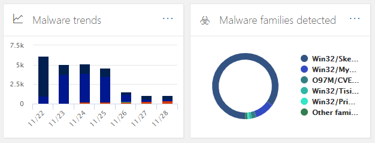

# Beveiligingsdashboard

## Basisfuncties en hoe u Beveiligingsdashboard opent

Met [het Security & Compliance Center](../../compliance/go-to-the-securitycompliance-center.md) kan uw organisatie gegevensbescherming en -naleving beheren. Ervan uitgaande dat u over de benodigde machtigingen beschikt, u met het beveiligingsdashboard uw status van bedreigingsbeveiliging bekijken en beveiligingswaarschuwingen bekijken en ernaar handelen.

Bekijk de video om een overzicht te krijgen en lees dit artikel voor meer informatie.

> [!VIDEO https://www.microsoft.com/videoplayer/embed/RE1VV3o]

Afhankelijk van wat het abonnement van uw organisatie bevat, bevat het beveiligingsdashboard verschillende widgets, zoals overzicht van bedreigingsbeheer, bedreigingsbeveiligingsstatus, wereldwijde wekelijkse bedreigingsdetecties, malware en meer, zoals beschreven in de volgende secties.

Als u het beveiligingsdashboard wilt bekijken, gaat u in het [Security & Compliance Center](../../compliance/go-to-the-securitycompliance-center.md)naar Dashboard Voor **bedreigingsbeheer** \> **Dashboard**.

> [!NOTE]
> U moet een globale beheerder, een beveiligingsbeheerder of een beveiligingslezer zijn om het beveiligingsdashboard weer te geven. Voor sommige widgets zijn extra machtigingen vereist om te bekijken. Zie [Machtigingen in het Security & Compliance Center](permissions-in-the-security-and-compliance-center.md)voor meer informatie.

## Samenvatting bedreigingsbeheer

De widget Overzicht van bedreigingsbeheer vertelt u in één oogopslag hoe uw organisatie de afgelopen zeven (7) dagen is beschermd tegen bedreigingen.

De informatie die u in het overzicht van bedreigingsbeheer ziet, is afhankelijk van wat u abonnement bevat. In de volgende tabel wordt beschreven welke informatie is opgenomen voor Office 365 E3 en Office 365 E5.

|Office 365 E3|Office 365 E5|
|---|---|
|Malwareberichten geblokkeerd Phishingberichten geblokkeerd Berichten gerapporteerd door gebruikers    |Malwareberichten geblokkeerd Phishingberichten geblokkeerd Berichten gerapporteerd door gebruikers Zero-day malware geblokkeerd Geavanceerde phishingberichten gedetecteerd Schadelijke URL's geblokkeerd|

Als u het overzichtsobject Bedreigingsbeheer wilt bekijken of openen, moet u machtigingen hebben om rapporten over geavanceerde bedreigingsbescherming weer te geven. Zie [Welke machtigingen nodig zijn om de ATP-rapporten weer te geven voor](view-reports-for-atp.md#what-permissions-are-needed-to-view-the-atp-reports) meer informatie?

## Status bedreigingsbescherming

De Threat Protection Status widget toont effectiviteit van bedreigingsbescherming met een trending en gedetailleerd beeld van phish en malware.

De gegevens zijn afhankelijk van de vraag of uw Microsoft 365-abonnement [Exchange Online Protection](exchange-online-protection-overview.md) (EOP) bevat met of zonder [ATP (Advanced Threat Protection) van Office 365.](office-365-atp.md)

|Als uw abonnement...|U ziet deze details|
|---|---|
|EOP, maar niet Office 365 ATP|Schadelijke e-mail die is gedetecteerd en geblokkeerd door EOP.   Zie [Threat Protection Status report (EOP)](view-email-security-reports.md#threat-protection-status-report).|
|Office 365 ATP|Schadelijke inhoud en schadelijke e-mail gedetecteerd en geblokkeerd door EOP en Office 365 ATP  Geaggregeerde telling van unieke e-mailberichten met schadelijke inhoud geblokkeerd door de anti-malware engine, [nul uur auto zuivering](zero-hour-auto-purge.md), en ATP functies (waaronder [Safe Links,](atp-safe-links.md) [Safe Attachments](atp-safe-attachments.md), en [ATP anti-phishing](set-up-anti-phishing-policies.md#exclusive-settings-in-atp-anti-phishing-policies)).  Zie [Atp (Threat Protection Status report)](view-reports-for-atp.md#threat-protection-status-report).|

Als u de widget Bedreigingsbeveiligingsstatus wilt bekijken of openen, moet u machtigingen hebben om rapporten over geavanceerde bedreigingsbescherming weer te geven. Zie [Welke machtigingen nodig zijn om de ATP-rapporten weer te geven voor](view-reports-for-atp.md#what-permissions-are-needed-to-view-the-atp-reports) meer informatie?

## Wereldwijde wekelijkse bedreigingsdetecties

De global weekly threat detections widget laat zien hoeveel bedreigingen zijn gedetecteerd in e-mailberichten in de afgelopen zeven (7) dagen.

De statistieken worden berekend zoals beschreven in de volgende tabel:

|Metrische|Hoe het wordt berekend|
|---|---|
|Gescande berichten|Aantal gescande e-mailberichten vermenigvuldigd met het aantal geadresseerden|
|Bedreigingen gestopt|Aantal e-mailberichten dat is geïdentificeerd als malware, vermenigvuldigd met het aantal ontvangers|
|Geblokkeerd door [ATP](office-365-atp.md)|Aantal e-mailberichten dat door ATP wordt geblokkeerd, vermenigvuldigd met het aantal geadresseerden|
|Verwijderd na levering|Aantal berichten dat is verwijderd door automatische zuivering van [nul uur,](zero-hour-auto-purge.md) vermenigvuldigd met het aantal geadresseerden|

## Malware

Malware widgets tonen details over malware trends en malware familie types in de afgelopen zeven (7) dagen.

## Inzichten

Inzichten brengen niet alleen belangrijke kwesties aan het hoofd die u moet bekijken, maar bevatten ook aanbevelingen en acties om rekening mee te houden.

U ziet bijvoorbeeld dat phishing-e-mailberichten worden bezorgd omdat sommige gebruikers hun opties voor ongewenste e-mail hebben uitgeschakeld. Zie [Rapporten en inzichten in het Security & Compliance Center](reports-and-insights-in-security-and-compliance.md)voor meer informatie over hoe inzichten werken.

## Dreigingsonderzoek en -reactie

Als het abonnement van uw organisatie [Office 365 Advanced Threat Protection Plan 2](office-365-ti.md)bevat, heeft uw beveiligingsdashboard een sectie met geavanceerde hulpprogramma's voor bedreigingsonderzoek en -respons. Deze tools omvatten [geautomatiseerde onderzoeks- en reactiemogelijkheden.](automated-investigation-response-office.md) Geautomatiseerd onderzoek en reactie kan nuttig zijn in scenario's zoals [het snel aanpakken van gecompromitteerde gebruikersaccounts.](address-compromised-users-quickly.md)

Zie [Aan de slag met Geautomatiseerd onderzoek en reactie (AIR) in Office 365](office-365-air.md)voor meer informatie.

## Trends

Aan de onderkant van het beveiligingsdashboard bevindt zich een sectie **Trends,** waarin e-mailstroomtrends voor uw organisatie worden samengevat. Rapporten bieden informatie over e-mail gecategoriseerd als spam, malware, phishing-pogingen en goede e-mail. Klik op een tegel om meer gedetailleerde informatie in het rapport weer te geven.

En als het abonnement van uw organisatie [Office 365 Advanced Threat Protection Plan 2](office-365-ti.md)bevat, beschikt u ook over een rapport Over recente waarschuwingen voor **bedreigingsbeheer** in deze sectie waarmee uw beveiligingsteam beveiligingswaarschuwingen met hoge prioriteit kan bekijken en actie kan ondernemen.

Als u de widget Verzonden en Ontvangen e-mail wilt bekijken of openen, moet u machtigingen hebben om rapporten over geavanceerde bedreigingsbescherming te bekijken. Zie [Welke machtigingen nodig zijn om de ATP-rapporten weer te geven voor](view-reports-for-atp.md#what-permissions-are-needed-to-view-the-atp-reports)meer informatie?

Als u de widget Waarschuwingen voor recent bedreigingsbeheer wilt weergeven of openen, moet u machtigingen hebben om waarschuwingen weer te geven. Zie [RBAC-machtigingen die nodig zijn voor het weergeven van waarschuwingen voor](../../compliance/alert-policies.md#rbac-permissions-required-to-view-alerts)meer informatie.

## Verwante onderwerpen

[E-mailbeveiligingsrapporten weergeven in het Security & Compliance Center](view-email-security-reports.md)

[Rapporten voor geavanceerde bedreigingsbeveiliging van Office 365 weergeven](view-reports-for-atp.md)

[Office 365 Advanced Threat Protection](office-365-atp.md)

[Onderzoek en reactiereactie van Office 365 Bedreiging](office-365-ti.md)
