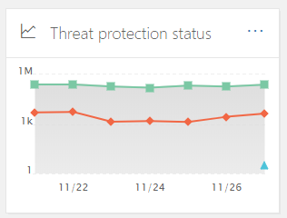

# Beveiligings dashboardSecurity Dashboard

[!INCLUDE [Microsoft 365 Defender rebranding](../includes/microsoft-defender-for-office.md)]

## Basisfuncties en beveiligings dashboard openenBasic functions and how to open Security Dashboard

Met de [beveiligings & nalevings centrum](../../compliance/go-to-the-securitycompliance-center.md) kan uw organisatiegegevens bescherming en compliance beheren.The [Security & Compliance Center](../../compliance/go-to-the-securitycompliance-center.md) enables your organization to manage data protection and compliance. Als u de benodigde machtigingen hebt, kunt u met het beveiligings dashboard de status van Bedreigingsbeveiliging controleren en ook de beveiligingswaarschuwingen weergeven en Toep treden.Assuming you have the necessary permissions, the Security Dashboard enables you to review your Threat Protection Status, as well as view and act on security alerts.

Bekijk de video om een overzicht te krijgen en lees dit artikel voor meer informatie.Watch the video to get an overview, and then read this article to learn more.

> [!VIDEO https://www.microsoft.com/videoplayer/embed/RE1VV3o]

Afhankelijk van wat het abonnement van uw organisatie is, bevat het beveiligings dashboard diverse widgets, zoals het overzicht van risicobeheer, de status van Bedreigingsbeveiliging, globale wekelijkse bedreigingen detectie, malware en meer, zoals beschreven in de volgende secties.Depending on what your organization's subscription includes, the Security Dashboard includes several widgets, such as Threat Management Summary, Threat Protection Status, Global Weekly Threat Detections, Malware, and more, as described in the following sections.

Als u het beveiligings dashboard wilt weergeven, gaat u naar het hulpmiddel voor het **beheer van bedreigingen** van [beveiligings &](../../compliance/go-to-the-securitycompliance-center.md) \> .To view the Security Dashboard, in the [Security & Compliance Center](../../compliance/go-to-the-securitycompliance-center.md), go to **Threat management** \> **Dashboard**.

> [!NOTE]
> U moet een globale beheerder, een beveiligingsbeheerder of een beveiligings lezer zijn om het beveiligings dashboard te kunnen bekijken.You must be a global administrator, a security administrator, or a security reader to view the Security Dashboard. Voor sommige objecten hebt u extra machtigingen nodig om weer te geven.Some widgets require additional permissions to view. Zie voor meer informatie [machtigingen in de beveiligings & nalevings centrum](permissions-in-the-security-and-compliance-center.md).To learn more, see [Permissions in the Security & Compliance Center](permissions-in-the-security-and-compliance-center.md).

## Overzicht van risicobeheerThreat Management Summary

De widget beknopte bedreigings beheer vertelt u in één oogopslag hoe uw organisatie is beveiligd tegen bedreigingen in de afgelopen zeven (7) dagen.The Threat Management Summary widget tells you at a glance how your organization was protected from threats over the past seven (7) days.

De informatie die u in het overzicht van risicobeheer ziet, is afhankelijk van het abonnement dat u hebt inbegrepen.The information you'll see in the Threat Management Summary depends on what you subscription includes. In de volgende tabel wordt beschreven welke informatie is opgenomen in Office 365 E3 en Office 365 E5.The following table describes what information is included for Office 365 E3 and Office 365 E5.

|Office 365 E3Office 365 E3|Office 365 E5Office 365 E5|
|---|---|
|Malware-berichten geblokkeerdMalware messages blocked Malafide berichten geblokkeerdPhishing messages blocked Berichten aangegeven door gebruikersMessages reported by users    |Malware-berichten geblokkeerdMalware messages blocked Malafide berichten geblokkeerdPhishing messages blocked Berichten aangegeven door gebruikersMessages reported by users Malware blokkeren op nul dagenZero-day malware blocked Geavanceerde phishingberichten gevondenAdvanced phishing messages detected Geblokkeerde schadelijke Url'sMalicious URLs blocked|

Als u de widget overzicht van risicobeheer wilt weergeven of gebruiken, moet u beschikken over machtigingen voor het weergeven van de rapporten van Defender for Office 365.To view or access the Threat Management Summary widget, you must have permissions to view Defender for Office 365 reports. Voor meer informatie raadpleegt [u de machtigingen voor het weergeven van de rapporten van de Defender for Office 365](view-reports-for-atp.md#what-permissions-are-needed-to-view-the-defender-for-office-365-reports).To learn more, see [What permissions are needed to view the Defender for Office 365 reports?](view-reports-for-atp.md#what-permissions-are-needed-to-view-the-defender-for-office-365-reports).

## Status van bedreigingsbeveiligingThreat Protection Status

De widget bedreigings bescherming toont de effectiviteit van bedreiging voor een overzicht van de effectiviteit en malware van de bedreiging.The Threat Protection Status widget shows threat protection effectiveness with a trending and detailed view of phish and malware.

Welke details er zijn, is afhankelijk van het feit of uw Microsoft 365-abonnement [Exchange Online Protection](exchange-online-protection-overview.md) (EOP) omvat met of zonder [Microsoft Defender voor Office 365](office-365-atp.md).The details depend on whether your Microsoft 365 subscription includes [Exchange Online Protection](exchange-online-protection-overview.md) (EOP) with or without [Microsoft Defender for Office 365](office-365-atp.md).

|Als uw abonnement dit omvat...If your subscription includes...|Deze gegevens worden weergegevenYou'll see these details|
|---|---|
|EOP, maar niet Microsoft Defender voor Office 365EOP but not Microsoft Defender for Office 365|Schadelijke e-mail die is gedetecteerd en geblokkeerd door EOP.Malicious email that was detected and blocked by EOP.
 Zie [status rapport Threat Protection (EOP)](view-email-security-reports.md#threat-protection-status-report).See [Threat Protection Status report (EOP)](view-email-security-reports.md#threat-protection-status-report).|
|Microsoft Defender voor Office 365Microsoft Defender for Office 365|Kwaadwillende inhoud en kwaadaardige e-mail detectie en geblokkeerd door EOP en Defender voor Office 365Malicious content and malicious email detected and blocked by EOP and Defender for Office 365 
 Het totaal aantal unieke e-mailberichten met schadelijke inhoud die wordt geblokkeerd door de anti malware-engine, [automatisch wissen van Zero uur](zero-hour-auto-purge.md)en de functies van de Defender voor Office 365 (inclusief [veilige koppelingen](atp-safe-links.md), [veilige bijlagen](atp-safe-attachments.md)en [anti-phishing in Defender voor Office 365](set-up-anti-phishing-policies.md#exclusive-settings-in-anti-phishing-policies-in-microsoft-defender-for-office-365)).Aggregated count of unique email messages with malicious content blocked by the anti-malware engine, [zero-hour auto purge](zero-hour-auto-purge.md), and Defender for Office 365 features (including [Safe Links](atp-safe-links.md), [Safe Attachments](atp-safe-attachments.md), and [Anti-phishing in Defender for Office 365](set-up-anti-phishing-policies.md#exclusive-settings-in-anti-phishing-policies-in-microsoft-defender-for-office-365)). 
 Zie [statusrapport bedreigingsbeveiliging](view-reports-for-atp.md#threat-protection-status-report).See [Threat protection status report](view-reports-for-atp.md#threat-protection-status-report).|

Als u de widget Bedreigingsbeveiliging wilt weergeven of gebruiken, moet u beschikken over machtigingen voor het weergeven van de rapporten van Defender for Office 365.To view or access the Threat Protection Status widget, you must have permissions to view Defender for Office 365 reports. Voor meer informatie raadpleegt [u welke machtigingen nodig zijn voor het weergeven van de rapporten van de Defender for Office 365?](view-reports-for-atp.md#what-permissions-are-needed-to-view-the-defender-for-office-365-reports)To learn more, see [What permissions are needed to view the Defender for Office 365 reports?](view-reports-for-atp.md#what-permissions-are-needed-to-view-the-defender-for-office-365-reports)

## Wereldwijde detectie van wekelijkse bedreigingGlobal Weekly Threat Detections

De widget wereldwijde detectie van wekelijkse bedreiging laat zien hoeveel bedreigingen zijn gedetecteerd in e-mailberichten in de afgelopen zeven (7) dagen.The Global Weekly Threat Detections widget shows how many threats were detected in email messages over the past seven (7) days.

De meetwaarden worden berekend zoals wordt beschreven in de volgende tabel:The metrics are calculated as described in the following table:

|GegevensMetric|De berekeningHow it's calculated|
|---|---|
|Gescande berichtenMessages scanned|Aantal gescande e-mailberichten vermenigvuldigd met het aantal geadresseerdenNumber of email messages scanned multiplied by the number of recipients|
|Bedreigingen beëindigdThreats stopped|Het aantal e-mailberichten dat wordt aangegeven met malware vermenigvuldigd met het aantal geadresseerdenNumber of email messages identified as containing malware multiplied by the number of recipients|
|Geblokkeerd door [Defender voor Office 365 ](office-365-atp.md)Blocked by [Defender for Office 365 ](office-365-atp.md)|Aantal e-mailberichten die zijn geblokkeerd door Defender voor Office 365, vermenigvuldigd met het aantal geadresseerdenNumber of email messages blocked by Defender for Office 365 multiplied by the number of recipients|
|Verwijderd na leveringRemoved after delivery|Aantal verwijderde berichten door een [0 uur automatisch wissen](zero-hour-auto-purge.md) vermenigvuldigd met het aantal geadresseerdenNumber of messages removed by [zero-hour auto purge](zero-hour-auto-purge.md) multiplied by the number of recipients|

## MalwareMalware

Widgets van malware toont details over trends van malware en familie van malware in de afgelopen zeven (7) dagen.Malware widgets show details about malware trends and malware family types over the past seven (7) days.

## InzichtenInsights

Voor inzichten die u niet alleen moet nakijken, bevatten ze ook aanbevelingen en acties waarmee u rekening moet houden.Insights not only surface key issues you should review, they also include recommendations and actions to consider.

U ziet bijvoorbeeld dat e-mailberichten van phishingberichten worden bezorgd omdat sommige gebruikers hun opties voor ongewenste e-mail hebben uitgeschakeld.For example, you might see that phishing email messages are being delivered because some users have disabled their junk mail options. Zie [rapporten en inzichten in het beveiligings & nalevings centrum](reports-and-insights-in-security-and-compliance.md)voor meer informatie over de werking van inzichten.To learn more about how insights work, see [Reports and insights in the Security & Compliance Center](reports-and-insights-in-security-and-compliance.md).

## Threat onderzoek en-antwoordThreat investigation and response

Als het abonnement van uw organisatie  [Microsoft Defender voor Office 365](office-365-ti.md), abonnement 2 bevat, bevat uw beveiligings Dashboard een sectie met geavanceerde functies voor onderzoek en antwoorden.If your organization's subscription includes  [Microsoft Defender for Office 365 Plan 2](office-365-ti.md), your Security Dashboard has a section that includes advanced threat investigation and response tools. Dit zijn [geautomatiseerde onderzoek-en antwoord mogelijkheden](automated-investigation-response-office.md).These tools include [automated investigation and response capabilities](automated-investigation-response-office.md). Geautomatiseerd onderzoek en reactie kunnen handig zijn in scenario's, zoals het doorlopen van [gebruikersaccounts met compromissen](address-compromised-users-quickly.md).Automated investigation and response can be helpful in scenarios such as [addressing compromised user accounts quickly](address-compromised-users-quickly.md).

Zie [aan de slag met geautomatiseerd onderzoek en antwoord (lucht) in Office 365](office-365-air.md)voor meer informatie.To learn more, see [Get started using Automated investigation and response (AIR) in Office 365](office-365-air.md).

## DuidelijkTrends

Onder in het beveiligings dashboard is een sectie **trends** , een overzicht van de trends van een e-mail stroom voor uw organisatie.Near the bottom of the Security Dashboard is a **Trends** section, which summarizes email flow trends for your organization. Rapporten bevatten informatie over e-mailberichten die zijn gecategoriseerd als spam, malware, phishing en goede e-mail.Reports provide information about email categorized as spam, malware, phishing attempts, and good email. Klik op een tegel om meer gedetailleerde informatie weer te geven in het rapport.Click a tile to view more detailed information in the report.

En als het abonnement van uw organisatie [Defender voor Office 365 abonnement 2](office-365-ti.md)bevat, hebt u ook een recent rapport met **meldingen over risicobeheer** in deze sectie waarmee uw beveiligingsteam een melding krijgt over het weergeven en uitvoeren van acties met een hoge prioriteit.And, if your organization's subscription includes [Defender for Office 365 Plan 2](office-365-ti.md), you will also have a **Recent threat management alerts** report in this section that enables your security team to view and take action on high-priority security alerts.

Als u de verzonden en ontvangen widget E-mail wilt weergeven of gebruiken, moet u beschikken over machtigingen voor het weergeven van de rapporten van Defender voor Office 365.To view or access the Sent and Received Email widget, you must have permissions to view Defender for Office 365 reports. Voor meer informatie raadpleegt [u de machtigingen voor het weergeven van de rapporten van de Defender for Office 365](view-reports-for-atp.md#what-permissions-are-needed-to-view-the-defender-for-office-365-reports).To learn more, see [What permissions are needed to view the Defender for Office 365 reports?](view-reports-for-atp.md#what-permissions-are-needed-to-view-the-defender-for-office-365-reports).

Als u de recente widget meldingen van bedreigings beheer wilt weergeven of gebruiken, moet u beschikken over machtigingen voor het weergeven van waarschuwingen.To view or access the Recent Threat Management Alerts widget, you must have permissions to view alerts. Zie voor meer informatie de [rechten voor het weergeven van waarschuwingen](../../compliance/alert-policies.md#rbac-permissions-required-to-view-alerts).To learn more, see [RBAC permissions required to view alerts](../../compliance/alert-policies.md#rbac-permissions-required-to-view-alerts).

## Verwante onderwerpenRelated topics

[Beveiligingsrapporten voor e-mail weergeven in het beveiligings & nalevings centrumView email security reports in the Security & Compliance Center](view-email-security-reports.md)

[Rapporten weergeven voor Microsoft Defender voor Office 365View reports for Microsoft Defender for Office 365](view-reports-for-atp.md)

[Defender voor Office 365Defender for Office 365](office-365-atp.md)

[Office 365 Threat onderzoek en-antwoordOffice 365 Threat investigation and response](office-365-ti.md)
