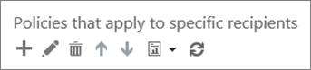

# Een aangepaste lijst met URL's niet opnieuw schrijven met Office 365 ATP Safe Links

> [!IMPORTANT]
> Dit artikel is bedoeld voor zakelijke klanten die [Office 365 Advanced Threat Protection](office-365-atp.md)hebben. Zie [Geavanceerde Outlook.com beveiliging](https://support.office.com/article/882d2243-eab9-4545-a58a-b36fee4a46e2)als u een thuisgebruiker bent die op zoek is naar informatie over veilige koppelingen in Outlook.

Met [Office 365 Advanced Threat Protection](office-365-atp.md) (ATP) kan uw organisatie een aangepaste [geblokkeerde URL's](set-up-a-custom-blocked-urls-list-wtih-atp.md)hebben, zodat wanneer mensen in e-mailberichten of bepaalde Office-documenten op webadressen (URL's) klikken, ze niet naar die URL's kunnen gaan. Uw organisatie kan ook aangepaste lijsten 'niet herschrijven' hebben voor specifieke groepen in uw organisatie. Met een lijst 'niet herschrijven' kunnen sommige mensen URL's bezoeken die anders worden geblokkeerd door [ATP Safe Links in Office 365.](atp-safe-links.md)

In dit artikel wordt beschreven hoe u een lijst met URL's opgeeft die zijn uitgesloten van het scannen van ATP Safe Links en een paar belangrijke punten om in gedachten te houden.

## Een lijst 'niet herschrijven' instellen

ATP Safe Links-beveiliging maakt gebruik van verschillende lijsten, waaronder de geblokkeerde URL'slijst van uw organisatie en de lijsten 'niet herschrijven' voor uitzonderingen. Als u over de benodigde machtigingen beschikt, u uw aangepaste lijsten 'niet herschrijven'. Dit doe je wanneer u beleid voor veilige koppelingen toevoegt of bewerkt dat van toepassing is op specifieke ontvangers in uw organisatie.

Als u het ATP-beleid wilt bewerken (of definiëren), moet u een geschikte rol toegewezen krijgen. De volgende tabel bevat enkele voorbeelden. Zie [Machtigingen in het Office 365 Security & Compliance Center](permissions-in-the-security-and-compliance-center.md)voor meer informatie.

|Rol  |Waar/hoe toegewezen  |
|---------|---------|
|Globale beheerder van Office 365 |De persoon die zich aanmeldt om Office 365 te kopen, is standaard een globale beheerder. (Zie [Informatie over office 365-beheerdersrollen](https://docs.microsoft.com/office365/admin/add-users/about-admin-roles) voor meer informatie.)         |
|Beveiligingsbeheerder |Azure Active Directory-beheercentrum ([https://aad.portal.azure.com](https://aad.portal.azure.com))|
|Exchange Online Organisatiebeheer |Exchange-beheercentrum[https://outlook.office365.com/ecp](https://outlook.office365.com/ecp)( )  of    PowerShell-cmdlets (Zie [Exchange Online PowerShell](https://docs.microsoft.com/powershell/exchange/exchange-online/exchange-online-powershell)) |

> [!TIP]
> Zie Machtigingen in het Office [365 Security & Compliance Center](permissions-in-the-security-and-compliance-center.md)voor meer informatie over rollen en machtigingen.

### Een aangepaste url'slijst 'URL's niet herschrijven' weergeven of bewerken

1. Ga [https://protection.office.com](https://protection.office.com) naar en meld je aan met je werk- of schoolaccount.

2. In de linkernavigatie, onder Beleid **voor bedreigingsbeheer** \> **Policy** \> **veilige koppelingen**.

3. Kies in de sectie **Beleid dat van toepassing is op specifieke geadresseerden** de optie **Nieuw** (de knop Nieuw lijkt op een plusteken ( **+**)) om een nieuw beleid te maken. (U ook een bestaand beleid bewerken.) 

4. Geef een naam en beschrijving op voor uw beleid.

5. Selecteer in de sectie **Niet opnieuw schrijven van de volgende URL's** het vak Een geldige URL **invoeren** en typ vervolgens een URL en kies het plusteken (+).

6. Kies in de sectie **Toegepast op** de optie De ontvanger is **lid van**en kies vervolgens de groep(en) die u in uw beleid wilt opnemen. Kies **Toevoegen**en kies **OK**.

7. Wanneer u klaar bent met het toevoegen van URL's, kiest u in de rechterbenedenhoek van het scherm **Opslaan**.

> [!NOTE]
> Controleer de aangepaste lijst met geblokkeerde URL's van uw organisatie. Zie [Een aangepaste geblokkeerde URL'slijst instellen met BEHULP VAN ATP Safe Links](set-up-a-custom-blocked-urls-list-wtih-atp.md).

## Belangrijke punten om in gedachten te houden

- URL's die u opgeeft in de lijst 'Niet herschrijven' zijn uitgesloten van het scannen van ATP Safe Links voor de ontvangers die u opgeeft.

- Als u al een lijst met URL's in uw lijst 'Niet herschrijven' hebt, moet u die lijst bekijken en waar nodig wildcards toevoegen. Als uw bestaande lijst bijvoorbeeld een `https://contoso.com/a` item heeft, zoals `https://contoso.com/a/b` en u subpaden wilt opnemen zoals in `https://contoso.com/a/*`uw beleid, voegt u een wildcard toe aan uw vermelding, zodat deze eruit ziet als .

- Wanneer u een lijst met 'niet herschrijven' opgeeft voor een ATP-beleid voor\*veilige koppelingen, u maximaal drie wildcardsterretjes opnemen ( ). Wildcards\*( ) worden gebruikt om expliciet voorvoegsels of subdomeinen op te nemen. De `contoso.com` vermelding is niet `*.contoso.com/*`hetzelfde als , omdat `*.contoso.com/*` mensen subdomeinen en paden in het opgegeven domein kunnen bezoeken.

In de volgende tabel worden voorbeelden weergegeven van wat u invoeren en welk effect deze vermeldingen hebben.

|**Voorbeelditem**|**Wat het doet**|
|:-----|:-----|
|`contoso.com`|Hiermee kunnen ontvangers een `https://contoso.com` site bezoeken, zoals, maar niet subdomeinen of paden.|
|`*.contoso.com/*`|Hiermee kunnen ontvangers een domein, subdomeinen en `https://www.contoso.com` `https://www.contoso.com`paden `https://maps.contoso.com`bezoeken, zoals , of `https://www.contoso.com/a`.    Dit item is inherent `*contoso.com*`beter dan , omdat het geen `https://www.falsecontoso.com` potentieel frauduleuze sites bevat, zoals of`https://www.false.contoso.completelyfalse.com`|
|`https://contoso.com/a`|Hiermee kunnen specifieke ontvangers `https://contoso.com/a`een site bezoeken, zoals , maar geen subpaden zoals`https://contoso.com/a/b`|
|`https://contoso.com/a/*`|Hiermee kunnen specifieke ontvangers `https://contoso.com/a` een site zoals en subpaden zoals`https://contoso.com/a/b`|
