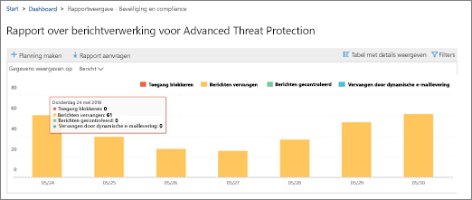

# Een aangepast rapport instellen en &amp; downloaden in het Security Compliance CenterSet up and download a custom report in the Security &amp; Compliance Center

In het [Security &amp; Compliance Center](https://protection.office.com)zijn verschillende rapporten en [inzichten](reports-and-insights-in-security-and-compliance.md) beschikbaar om het beveiligingsteam van uw organisatie te helpen bedreigingen voor uw organisatie te beperken en aan te pakken.In the [Security &amp; Compliance Center](https://protection.office.com), several [reports and insights](reports-and-insights-in-security-and-compliance.md) are available to help your organization's security team mitigate and address threats to your organization. Als u lid bent van het beveiligingsteam van uw organisatie, u een rapport configureren met aangepaste datumbereiken en filters en vervolgens uw aangepaste rapport downloaden.If you're a member of your organization's security team, you can configure a report with custom date ranges and filters, and then download your custom report. 
  
## Een aangepast rapport downloadenDownload a custom report

> [!IMPORTANT]
> Zorg ervoor dat u over de benodigde [machtigingen beschikt voor het Security &amp; Compliance Center.](permissions-in-the-security-and-compliance-center.md)Make sure that you have the necessary [permissions for the Security &amp; Compliance Center](permissions-in-the-security-and-compliance-center.md). Over het algemeen hebben globale beheerders, beveiligingsbeheerders en &amp; beveiligingslezers toegang tot rapporten in het Security Compliance Center.In general, global administrators, security administrators, and security readers can access reports in the Security &amp; Compliance Center. 
  
1. Ga in het [Security &amp; Compliance Center](https://protection.office.com)naar **Reports** \> **Dashboard**.In the [Security &amp; Compliance Center](https://protection.office.com), go to **Reports** \> **Dashboard**.
    
2. Kies een rapport.Choose a report. (Voor dit voorbeeld gebruiken we het rapport Berichtdpositie.)(For this example, we'll use the Message Disposition Report.) 
  
3. Kies Rapport **aanvragen**in de linkerbovenhoek van het rapport .In the upper left corner of the report, choose **Request report**.
    
4. Geef **in** het dialoogvenster Rapport aanvraag een naam, begindatum en einddatum voor het rapport op.In the **Request report** dialog box, specify a name, start date, and end date for the report. Kies vervolgens **Volgende**.Then choose **Next**. 
  
5. Geef alle filters op die u voor het rapport wilt gebruiken.Specify any filters you want to use for the report. (U bijvoorbeeld een IP-adres van de client opgeven voor het rapport berichtdispositie.) Kies vervolgens **Volgende**.(For example, you might specify a client IP address for the Message Disposition Report.) Then choose **Next**.
    
6. Geef e-mailontvangers op voor het rapport en kies **Opslaan**.Specify email recipients for the report, and then choose **Save**.
    
## Verwante onderwerpenRelated topics

[Rapporten en inzichten &amp; in het Security Compliance CenterReports and insights in the Security &amp; Compliance Center](reports-and-insights-in-security-and-compliance.md)
  
[Een planning maken voor een &amp; rapport in het Security Compliance CenterCreate a schedule for a report in the Security &amp; Compliance Center](create-a-schedule-for-a-report.md)
  
[Schema's beheren voor &amp; rapporten in het Security Compliance CenterManage schedules for reports in the Security &amp; Compliance Center](manage-schedules-for-multiple-reports.md)
  
[Bestaande rapporten downloaden &amp; in het Security Compliance CenterDownload existing reports in the Security &amp; Compliance Center](download-existing-reports.md)
  

