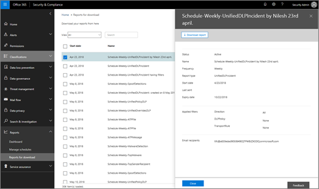

# Een aangepast rapport instellen en &amp; downloaden in het Security Compliance Center

In het [Security &amp; Compliance Center](https://protection.office.com)zijn verschillende rapporten en [inzichten](reports-and-insights-in-security-and-compliance.md) beschikbaar om het beveiligingsteam van uw organisatie te helpen bedreigingen voor uw organisatie te beperken en aan te pakken. Als u lid bent van het beveiligingsteam van uw organisatie, u een rapport configureren met aangepaste datumbereiken en filters en vervolgens uw aangepaste rapport downloaden. 
  
## Een aangepast rapport downloaden

> [!IMPORTANT]
> Zorg ervoor dat u over de [benodigde machtigingen &amp; beschikt voor het Office 365 Security Compliance Center](permissions-in-the-security-and-compliance-center.md). Over het algemeen hebben wereldwijde office 365-beheerders, beveiligingsbeheerders &amp; en beveiligingslezers toegang tot rapporten in het Security Compliance Center. 
  
1. Ga in het [Security &amp; Compliance Center](https://protection.office.com)naar **Het Dashboard** **Rapporten** \> .
    
2. Kies een rapport. (In dit voorbeeld gebruiken we het rapport Berichtdispositie.) 
  
3. Kies in de linkerbovenhoek van het rapport **het rapport Aanvragen**.
    
4. Geef in het dialoogvenster **Rapport Aanvragen** een naam, begindatum en einddatum voor het rapport op. Kies vervolgens **Volgende**. 
  
5. Geef de filters op die u voor het rapport wilt gebruiken. (U bijvoorbeeld een IP-adres van de client opgeven voor het rapport Berichtdisdisdring.) Kies vervolgens **Volgende**.
    
6. Geef e-mailontvangers voor het rapport op en kies **Opslaan**.
    
## Verwante onderwerpen

[Rapporten en inzichten in het &amp; Office 365 Security Compliance Center](reports-and-insights-in-security-and-compliance.md)
  
[Een planning maken voor een &amp; rapport in het Security Compliance Center](create-a-schedule-for-a-report.md)
  
[Schema's voor rapporten &amp; beheren in het Security Compliance Center](manage-schedules-for-multiple-reports.md)
  
[Bestaande rapporten downloaden &amp; in het Security Compliance Center](download-existing-reports.md)
  

