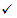

# Anti malafide beleid in Microsoft 365

[!INCLUDE [Microsoft 365 Defender rebranding](../includes/microsoft-defender-for-office.md)]

Beleidsregels voor het configureren van anti-phishing-instellingen zijn beschikbaar in Microsoft 365-organisaties met postvakken van Exchange Online, standalone Exchange Online Protection-organisaties (EOP) zonder Exchange Online-postvakken en Microsoft Defender voor Office 365-organisaties.

Anti phishingberichten in Microsoft Defender voor Office 365 zijn alleen beschikbaar in organisaties met een anti-of Office-365. Bijvoorbeeld:

- Microsoft 365 Enterprise E5, Microsoft 365 education A5, etc.
- [Microsoft 365 Enterprise](https://www.microsoft.com/microsoft-365/enterprise/home)
- [Microsoft 365 Business](https://www.microsoft.com/microsoft-365/business)
- [Microsoft Defender voor Office 365 als een invoegtoepassing](https://products.office.com/exchange/advance-threat-protection)

In de volgende tabel vindt u een beschrijving van de verschillen tussen anti-phishingfilter en anti-phishingfilter in Microsoft Defender voor Office 365.

****

|Functie|Anti phishingfilter in EOP|Anti malafide beleid in Microsoft Defender voor Office 365|
|---|:---:|:---:|
|Standaardbeleid automatisch gemaakt|||
|Aangepaste beleidsregels maken|||
|Beleidsinstellingen\*|||
|Imitatie-instellingen|||
|Spoof-instellingen|||
|Geavanceerde phishingberichten|||
|

\* In het standaardbeleid zijn de Beleidsnaam en-beschrijving alleen-lezen (de beschrijving is leeg) en kunt u niet opgeven wie het beleid van toepassing is op het standaardbeleid voor alle geadresseerden.

Zie de volgende artikelen voor meer informatie over het configureren van een anti phishing-beleid:

- [Anti-phishings beleid configureren in EOP](configure-anti-phishing-policies-eop.md)

- [Anti phishingfilter configureren in Microsoft Defender voor Office 365](configure-atp-anti-phishing-policies.md)

In de rest van dit artikel worden de instellingen beschreven die beschikbaar zijn in het anti-phishingfilter-beleid in EOP en Defender voor Office 365.

## Beleidsinstellingen

De volgende beleidsinstellingen zijn beschikbaar in anti-phishing-beleid in EOP en Microsoft Defender voor Office 365:

- **Naam**: u kunt de naam van het standaard anti-Phishingfilter niet wijzigen, maar u kunt wel een naam geven en aangepaste beleidsregels maken die u zelf maakt.

- Een **Beschrijving** van U kunt geen beschrijving toevoegen aan het standaard anti-phishingfilter, maar u kunt wel een beschrijving toevoegen en wijzigen voor aangepaste beleidsregels die u maakt.

- **Toegepast op**: identificeert interne geadresseerden waarop het anti-phishingfilter-beleid van toepassing is. Deze waarde is vereist in aangepaste beleidsregels en niet beschikbaar in het standaardbeleid (het standaardbeleid is van toepassing op alle geadresseerden).

  U kunt een voorwaarde of uitzondering maar één keer gebruiken, maar u kunt meerdere waarden opgeven voor de voorwaarde of uitzondering. Meerdere waarden van dezelfde voorwaarde of uitzondering: gebruik OF-logica (bijvoorbeeld: _\<recipient1\>_ of _\<recipient2\>_). Verschillende voorwaarden of uitzonderingen: gebruik EN-logica (bijvoorbeeld: _\<recipient1\>_ en _\<member of group 1\>_).

  - De **ontvanger is**: een of meer postvakken, e-mail gebruikers of contactpersonen in uw organisatie.
  - **De ontvanger is lid van**: een of meer groepen in uw organisatie.
  - **Het domein van de ontvanger is**: een of meer van de geconfigureerde domeinen in microsoft 365.

  - **Behalve wanneer**: uitzonderingen voor de regel. De instellingen en het gedrag zijn exact hetzelfde als de voorwaarden:

    - **Geadresseerde is**
    - **De ontvanger is lid van**
    - **Het domein van de ontvanger is**

  > [!NOTE]
  > De instelling **voor toepassen op** is vereist in een aangepast anti phishingfilter om te bepalen in welke **geadresseerden** <u>het beleid van toepassing is</u>. Een anti-phishingfilter in Microsoft Defender voor Office 365 heeft ook [imitatie-instellingen](#impersonation-settings-in-anti-phishing-policies-in-microsoft-defender-for-office-365) waarin u de e-mailadressen van afzonderlijke e-mailadressen of e-mailadressen van de afzender kunt opgeven die de bescherming van <u>imitatie ontvangen</u> zoals verderop in dit onderwerp wordt beschreven.

## Spoof-instellingen

Spoofing is wanneer het van-adres in een e-mailbericht (het adres van de afzender dat wordt weergegeven in e-mail cliënten) niet overeenkomen met het domein van de e-mail bron. Zie voor meer informatie over spoofing [bescherming tegen spoofing in Microsoft 365](anti-spoofing-protection.md).

De volgende spoof-instellingen zijn beschikbaar in anti-phishing-beleid in EOP en Microsoft Defender voor Office 365:

- **Anti-spoofing beveiliging**: schakelt anti-spoofing beveiliging in of uit. U wordt aangeraden om de optie ingeschakeld te laten. U gebruikt het **beleid voor spoof Intelligence** om specifieke vervalste interne en externe afzenders toe te staan of te blokkeren. Zie [spoof-intelligentie configureren in Microsoft 365](learn-about-spoof-intelligence.md) voor meer informatie.

  > [!NOTE]
  >
  > - De bescherming tegen spoofing is standaard ingeschakeld in het standaard anti-phishingfilter en in elk nieuw aangepast anti-phishing-beleid dat u maakt.
  >
  > - U hoeft geen anti-spoofing-beveiliging uit te schakelen als uw MX-record niet verwijst naar Microsoft 365. u kunt in plaats hiervan uitgebreid filteren op connectors. Zie voor meer informatie het artikel [uitgebreid filteren op connectors in Exchange Online](https://docs.microsoft.com/Exchange/mail-flow-best-practices/use-connectors-to-configure-mail-flow/enhanced-filtering-for-connectors).

  Voor berichten van geblokkeerde vervalste afzenders kunt u ook opgeven welke actie u wilt uitvoeren op de berichten:

  - **Bericht verplaatsen naar map Ongewenste e-mail**: dit is de standaardwaarde. Het bericht wordt bezorgd in het postvak en wordt verplaatst naar de map Ongewenste E-mail. Het bericht wordt verplaatst naar de map Ongewenste e-mail in Exchange Online als de regel voor ongewenste e-mail is ingeschakeld voor het postvak (deze optie is standaard ingeschakeld). Zie voor meer informatie [instellingen voor ongewenste E-mail configureren in Exchange Online-postvakken in Microsoft 365](configure-junk-email-settings-on-exo-mailboxes.md).

  - **Quarantine het bericht**: verzendt het bericht naar Quarantine in plaats van de bedoelde geadresseerden. Zie de volgende artikelen voor informatie over quarantaine:

    - [Quarantaine in Microsoft 365](quarantine-email-messages.md)
    - [Geplaatste berichten en bestanden beheren als beheerder in Microsoft 365](manage-quarantined-messages-and-files.md)
    - [Geplaatste berichten zoeken en vrijgeven als een gebruiker in Microsoft 365](find-and-release-quarantined-messages-as-a-user.md)

- **Niet-geverifieerde afzender**: Zie de informatie in het volgende gedeelte.

### Niet-geverifieerde afzender

Niet-geverifieerde afzender-identificatie maakt deel uit van de [spoof-instellingen](#spoof-settings) die beschikbaar zijn in het anti-PHISHINGFILTER van EOP en Microsoft Defender voor Office 365, zoals in de vorige sectie is beschreven.

Met de instelling niet- **geverifieerde afzender** schakelt u de identificatie van niet-geverifieerde afzender in Outlook in of uit. Precies

- U kunt een vraagteken (?) toevoegen aan de foto van de afzender als het bericht SPF-of DKIM-controles niet doorschakelt **en** het bericht geen DMARC of [samengestelde verificatie](email-validation-and-authentication.md#composite-authentication)passeert. Als u niet-geverifieerde afzender uitschakelt, wordt het vraagteken niet toegevoegd aan de foto van de afzender.

- Met de tag via (chris@contoso.com <u>via</u> Michelle@fabrikam.com) wordt de toevoeging van het domein in het van-adres (de afzender van het bericht dat wordt weergegeven in e-mail cliënten) anders dan het domein in de-handtekening of het **e-mail** adres. Zie [een overzicht van de standaarden voor e-mailberichten](how-office-365-validates-the-from-address.md#an-overview-of-email-message-standards)voor meer informatie over deze adressen.

  Niet-geverifieerde afzender-id wordt niet voorkomen dat de via-code kan worden toegevoegd als het domein in het van-adres afwijkt van het domein in de DKIM-handtekening of het e-MAIL adres.

U hebt de volgende opties om te voorkomen dat het vraagteken of via tag wordt toegevoegd aan berichten van specifieke afzenders:

- Laat de afzender spoofen in het beleid voor spoof Intelligence. Met deze actie wordt voorkomen dat de via-code in berichten van de afzender wordt weergegeven als de id van de niet-geverifieerde afzender is uitgeschakeld. Zie voor instructies voor instructies het artikel [spoof Intelligence configureren in Microsoft 365](learn-about-spoof-intelligence.md).

- [Configureer e-mail verificatie](email-validation-and-authentication.md#configure-email-authentication-for-domains-you-own) voor het domein van de afzender.
  
  - Voor het vraagteken in de foto van de afzender, SPF of DKIM zijn de belangrijkste punten.
  - Voor de via-tag bevestigt u het domein in de DKIM-handtekening of het e-mail adres dat overeenkomt met het **e-mail** adres of het subdomein van het domein in het van-adres.

Zie voor meer informatie [verdachte berichten identificeren in Outlook.com en de webversie van Outlook](https://support.microsoft.com/office/3d44102b-6ce3-4f7c-a359-b623bec82206)

## Exclusieve instellingen voor het anti-phishing beleid in Microsoft Defender voor Office 365

In dit gedeelte worden de beleidsinstellingen beschreven die alleen beschikbaar zijn in Microsoft Defender voor Office 365.

> [!NOTE]
> Het standaard anti-phishingfilter in Microsoft Defender voor Office 365 biedt [vervalsings beveiliging](set-up-anti-phishing-policies.md#spoof-settings) en Postvak intelligentie voor alle geadresseerden. De andere beschikbare functies voor [imitatie beveiliging](#impersonation-settings-in-anti-phishing-policies-in-microsoft-defender-for-office-365) en [Geavanceerde instellingen](set-up-anti-phishing-policies.md#advanced-phishing-thresholds-in-anti-phishing-policies-in-microsoft-defender-for-office-365) zijn echter niet geconfigureerd of ingeschakeld in het standaardbeleid. Als u alle beveiligingsfuncties wilt inschakelen, wijzigt u het standaard anti-phishingfilter of maakt u een extra anti-phishingfilter.

### Imitatie-instellingen in anti-phishing beleid in Microsoft Defender voor Office 365

Met imitatie wordt het e-mail domein van de afzender of het e-mail domein van de afzender in een bericht vergelijkbaar met een echte afzender of een domein:

- Een voorbeeld van imitatie van de domein contoso.com is ćóntoso.com.
- Een voorbeeld van imitatie van de User michelle@contoso.com is michele@contoso.com.

Mogelijk wordt een geïmiteerd domein ook als legitiem beschouwd (geregistreerd domein, geconfigureerde e-mail verificatie records, etc.), behalve dat de intentie van de geadresseerden de geadresseerden moet opzeggen.

De volgende imitatie-instellingen zijn alleen beschikbaar in anti-phishingfilter in Microsoft Defender voor Office 365:

- **Te beschermen gebruikers**: voorkomt dat de opgegeven interne of externe e-mailadressen worden geïmiteerd **als afzenders van berichten**. U ontvangt bijvoorbeeld een e-mailbericht van de adjunct-directeur van uw bedrijf waarin u wordt gevraagd om haar interne bedrijfsgegevens te verzenden. Wilt u doen? Veel mensen verzenden het antwoord zonder dat ze denken.

  U kunt beveiligde gebruikers gebruiken om interne en externe afzender e-mailadressen toe te voegen om tegen imitatie te beschermen. Deze lijst met **afzenders** die zijn beveiligd tegen gebruikers imitatie, wijken af van de lijst met **geadresseerden** waarop het beleid van toepassing is (alle geadresseerden voor het standaardbeleid; specifieke geadresseerden die zijn geconfigureerd in de instelling **voor toepassen op** in het onderdeel [beleidsinstellingen](#policy-settings) ).

  > [!NOTE]
  >
  > - In elk anti-phishingfilter kunt u maximaal 60 beveiligde gebruikers opgeven (e-mailadressen van afzender). U kunt niet dezelfde beveiligde gebruiker opgeven in meerdere beleidsregels.
  >
  > - Gebruikers imitatie bescherming werkt niet als de afzender en de geadresseerde eerder via e-mail zijn gecommuniceerd. Als de afzender en de ontvanger niet via e-mail zijn gecommuniceerd, wordt het bericht herkend als een imitatie poging.

  Standaard worden er geen e-mailadressen van de afzender geconfigureerd voor imitatie bescherming in **gebruikers**. Daarom zijn de e-mailadressen van de afzender standaard niet onder de bescherming van de imitatie, hetzij in het standaardbeleid of in aangepaste beleidsregels.

  Wanneer u interne of externe e-mailadressen toevoegt aan de **gebruikers die** de lijst beveiligen, zijn berichten van deze **afzenders** onderworpen aan controles van de bescherming van de imitatie. Het bericht wordt gecontroleerd op imitatie **als** het bericht wordt verzonden naar een **geadresseerde** waarop het beleid van toepassing is (alle geadresseerden voor het standaardbeleid; Dit **geldt voor** geadresseerden in een aangepast beleid. Als er in het e-mailadres van de afzender in het e-mailadres van de afzender gebruik wordt gemaakt van de persoon, worden de acties voor imitatie beveiliging op het bericht toegepast (wat u met het bericht wilt doen, of u de veiligheidstips, enzovoort) van geïmiteerde gebruikers wilt weergeven.

- **Te beschermen domeinen**: voorkomt dat de opgegeven domeinen worden geïmiteerd **in het domein van de afzender van het bericht**. Voorbeelden van alle domeinen die u eigenaar bent ([geaccepteerde domeinen](https://docs.microsoft.com/exchange/mail-flow-best-practices/manage-accepted-domains/manage-accepted-domains)) of specifieke domeinen (domeinen die u bezit of een partnerdomein). Deze lijst met het **domein** van de afzender die is beveiligd tegen imitatie, is niet hetzelfde als de lijst met **geadresseerden** waarop het beleid van toepassing is (alle geadresseerden voor het standaardbeleid; specifieke geadresseerden die zijn geconfigureerd met de instelling **toepassen op** in het onderdeel [beleidsinstellingen](#policy-settings) ).

  > [!NOTE]
  > Het maximale aantal beveiligde domeinen dat u in een anti-phishingfilter kunt definiëren, is 50.

  Standaard worden er geen verzender domeinen geconfigureerd voor de bescherming van imitatie in **domeinen**. Daarom worden niet-gegroepeerde domeinnamen bedoeld met de bescherming van de imitatie, hetzij in het standaardbeleid of aangepaste beleidsregels.

  Wanneer u domeinen toevoegt aan de **domeinen die u wilt beveiligen** , zijn berichten van **afzenders in die domeinen** onderhevig aan imitatie beschermings controles. Het bericht wordt gecontroleerd op imitatie **als** het bericht wordt verzonden naar een **geadresseerde** waarop het beleid van toepassing is (alle geadresseerden voor het standaardbeleid; Dit **geldt voor** geadresseerden in een aangepast beleid. Als er in het domein van de afzender een imitatie wordt gedetecteerd, worden de acties voor de bescherming van de bescherming van de domein op het bericht toegepast (wat u met het bericht moet doen, of u de veiligheidstips, enzovoort) van geïmiteerde gebruikers wilt weergeven.

- **Acties voor beveiligde gebruikers of domeinen**: Kies de actie die u wilt uitvoeren op inkomende berichten met de gewenste beschermings pogingen voor de beveiligde gebruikers en beveiligde domeinen in het beleid. U kunt verschillende acties opgeven voor imitatie van beveiligde gebruikers versus imitatie van beveiligde domeinen:

  - **Geen actie toepassen**

  - **Bericht omleiden naar andere e-mailadressen**: Hiermee wordt het bericht naar de opgegeven geadresseerden verzonden in plaats van de bedoelde geadresseerden.

  - **Bericht verplaatsen naar map Ongewenste** E-mail: het bericht wordt bezorgd in het postvak en verplaatst naar de map Ongewenste e-mail. Het bericht wordt verplaatst naar de map Ongewenste e-mail in Exchange Online als de regel voor ongewenste e-mail is ingeschakeld voor het postvak (deze optie is standaard ingeschakeld). Zie voor meer informatie [instellingen voor ongewenste E-mail configureren in Exchange Online-postvakken in Microsoft 365](configure-junk-email-settings-on-exo-mailboxes.md).

    - **Quarantine het bericht**: verzendt het bericht naar Quarantine in plaats van de bedoelde geadresseerden. Zie de volgende artikelen voor informatie over quarantaine:

    - [Quarantaine in Microsoft 365](quarantine-email-messages.md)
    - [Geplaatste berichten en bestanden beheren als beheerder in Microsoft 365](manage-quarantined-messages-and-files.md)
    - [Geplaatste berichten zoeken en vrijgeven als een gebruiker in Microsoft 365](find-and-release-quarantined-messages-as-a-user.md)

  - **Zorg dat u het bericht bezorgt en andere adressen aan de BCC-regel toevoegt**: Bezorg het bericht voor de geadresseerden en laat het bericht op de opgegeven geadresseerden staan.

  - **Het bericht verwijderen voordat het wordt bezorgd**: Hiermee wordt het volledige bericht, inclusief alle bijlagen, op de achtergrond verwijderd.

- **Veiligheidstips**: schakelt de volgende imitatie tips voor de bescherming van de persoon in of uit, die berichten weergeven die niet door de gebruiker worden gecontroleerd:

  - **Geïmiteerde gebruikers**: het van-adres bevat een beveiligde gebruiker.
  - **Geïmiteerde domeinen**: het van-adres bevat een beveiligd domein.
  - **Ongebruikelijk tekens**: het van-adres bevat ongebruikelijke tekensets (bijvoorbeeld wiskundige symbolen en tekst of een combinatie van hoofdletters en kleine letters) in een beveiligde afzender of domein.

  > [!NOTE]
  > Zelfs wanneer de veiligheidstips voor de imitatie zijn uitgeschakeld, kunt u een e-mail stroom regel (ook wel een transportregel genoemd) gebruiken om een berichtheader met de naam **X-MS-Exchange-EnableFirstContactSafetyTip** aan berichten toe te voegen. Specifieke veiligheidstips worden weergegeven met de mededeling dat geadresseerden geen e-mail ontvangen van de afzender of wanneer de geadresseerde voor het eerst een e-mail voor de eerste keer voor de afzender ontvangt.

- **Postvak intelligentie**: Hiermee wordt gecommuniceerd met de optie veelgebruikte contactpersonen (AI) in-of uitgeschakeld. Met deze instelling zorgt u ervoor dat de AI onderscheidt tussen legitieme en vervalste e-mail van deze contactpersonen. Postvak intelligentie is alleen beschikbaar voor postvakken van Exchange Online.

- **Op basis van de bescherming op basis** van de toegang tot de Cloud: schakelt uitgebreide imitatie resultaten in of uit op basis van de afzonderlijke toewijzingen van de afzonderlijke verzenders van elke gebruiker. Deze Intelligence zorgt ervoor dat Microsoft 365 de detectie van gebruikers imitatie aanpast en betere fout-positieven verduidelijkt. Wanneer gebruikers imitatie wordt gedetecteerd, kunt u opgeven welke actie u wilt uitvoeren op het bericht:

  - **Geen actie toepassen**
  - **Bericht omleiden naar andere e-mailadressen**
  - **Bericht verplaatsen naar map Ongewenste e-mail**
  - **Het bericht Quarantine**
  - **Het bericht bezorgen en andere adressen toevoegen aan de regel BCC**
  - **Het bericht verwijderen voordat het wordt bezorgd**

- **Vertrouwde afzenders en domeinen**: uitzonderingen op de instellingen voor imitatie bescherming. Berichten van de opgegeven domeinen van afzenders en afzender worden nooit als onbedoelde aanval geclassificeerd op basis van de beleidsregels voor imitatie. Met andere woorden: de actie voor beveiligde afzenders, beveiligde domeinen en e-mail beveiliging worden niet toegepast op de domeinen van de vertrouwde afzenders of van de afzender. De maximumlimiet voor deze lijsten is ongeveer 1000 vermeldingen.

### Geavanceerde phishingberichten in anti-phishing-beleid in Microsoft Defender voor Office 365

De volgende geavanceerde vergoedings drempels zijn alleen beschikbaar in het anti-phishingfilter in Microsoft Defender voor Office 365. Met deze drempelwaarden kunt u de gevoeligheid voor het toepassen van machine learning modellen op berichten voor het bepalen van een malafide verdict:

- **1-standaard**: dit is de standaardwaarde. De ernst van de actie die in het bericht wordt gegeven, is afhankelijk van het vertrouwensniveau dat het bericht phishing is (slecht, gemiddeld, hoog of zeer hoog vertrouwen). Berichten die door een zeer hoge mate van phishing worden geïdentificeerd, zijn bijvoorbeeld met de meest ernstige vertrouwens kracht, terwijl berichten die als phishing met een laag vertrouwen worden geïdentificeerd, minder nadelig worden toegepast.

- **2-agressief**: berichten die zijn geïdentificeerd als phishing, zijn een hoge mate van vertrouwen, worden behandeld alsof ze zijn geïdentificeerd met een zeer hoge mate van betrouwbaarheid.

- **3-meer agressief**: berichten die zijn geïdentificeerd als phishing met een gemiddelde of een hoge mate van vertrouwen, worden behandeld alsof ze een zeer hoge mate van vertrouwen hebben.

- **4-de meeste agressieve** berichten die worden geïdentificeerd als phishing met een slecht, gemiddeld of hoog vertrouwensniveau, worden behandeld alsof ze worden vastgesteld met een zeer hoge mate van betrouwbaarheid.

De kans op fout-positieven (goede berichten gemarkeerd als beschadigd) neemt toe naarmate u deze instelling groter maakt. Zie [anti phishing-beleid in Microsoft Defender for Office 365 Settings](recommended-settings-for-eop-and-office365-atp.md#anti-phishing-policy-settings-in-microsoft-defender-for-office-365)voor informatie over de aanbevolen instellingen.
