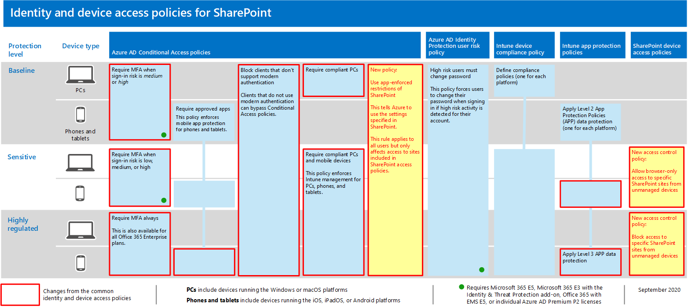
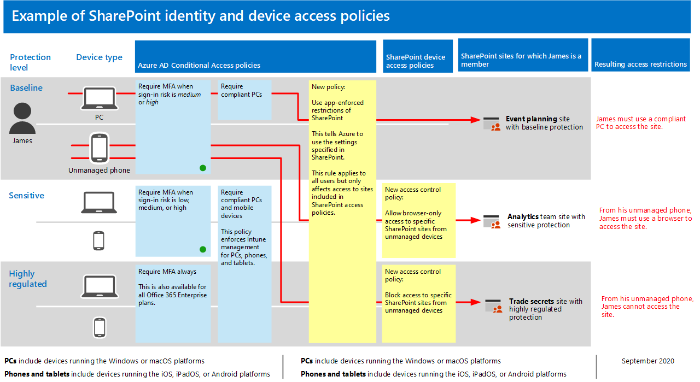

# Beleids aanbevelingen voor het beveiligen van SharePoint-sites en-bestanden

In dit artikel wordt uitgelegd hoe u de aanbevolen identiteit en het beleid voor het openen van een apparaat kunt implementeren om SharePoint en OneDrive voor bedrijven te beveiligen. Deze richtlijnen zijn van toepassing op de [veelgebruikte beleidsregels voor identiteit en toegang tot apparaten](identity-access-policies.md).

Deze aanbevelingen maken deel uit van drie verschillende niveaus van beveiliging en bescherming voor SharePoint-bestanden die kunnen worden toegepast op basis van de granulatie van uw behoeften: **basislijn**, **gevoelige**en **nadrukkelijk gereglementeerde**. U vindt meer informatie over deze beveiligingslagen en de aanbevolen besturingssystemen van de client, waarnaar wordt verwezen in [het overzicht](microsoft-365-policies-configurations.md).

Zorg er ook voor dat u de SharePoint-sites configureert met de juiste hoeveelheid bescherming, waaronder het instellen van de juiste machtigingen voor gevoelige en sterk gereguleerde inhoud.

## Veelgebruikte beleidsregels bijwerken voor het opnemen van SharePoint en OneDrive voor bedrijven

In het volgende diagram ziet u welke beleidsregels u moet bijwerken vanuit de veelgebruikte beleidsregels voor identiteiten-en toegangsbeleid om bestanden in SharePoint en OneDrive te beveiligen.

[Een grotere versie van deze afbeelding weergeven](https://github.com/MicrosoftDocs/microsoft-365-docs/raw/public/microsoft-365/media/microsoft-365-policies-configurations/identity-access-ruleset-sharepoint.png)

Als u bij het maken van een gemeenschappelijke beleidsregels SharePoint hebt opgenomen, hoeft u alleen maar het nieuwe beleid te maken. Voor regels voor voorwaardelijke toegang bevat SharePoint OneDrive.

Het nieuwe beleid implementeert beveiliging van apparaten voor gevoelige en sterk gereguleerde inhoud door specifieke toegangsvereisten toe te passen op de SharePoint-sites die u opgeeft.

De volgende tabel bevat een overzicht van de beleidsregels die u nodig hebt om een nieuw voor SharePoint te beoordelen en bij te werken of te maken. De koppeling common policies naar de gekoppelde configuratie-instructies in het artikel [common Identity en Apparaattoegang-beleid](identity-access-policies.md) .

|Beveiligingsniveau|Lijnen|Meer informatie|
|:---------------|:-------|:----------------|
|**Basislijn**|[MFA vereisen wanneer het aanmeld risico *normaal* of *hoog* is](identity-access-policies.md#require-mfa-based-on-sign-in-risk)|Neem SharePoint op in de toewijzing van Cloud-apps.|
|        |[Clients blokkeren die moderne verificatie niet ondersteunen](identity-access-policies.md#block-clients-that-dont-support-modern-authentication)|Neem SharePoint op in de toewijzing van Cloud-apps.|
|        |[Beleid voor APP-gegevensbeveiliging toepassen](identity-access-policies.md#apply-app-data-protection-policies)|Zorg ervoor dat alle aanbevolen apps zijn opgenomen in de lijst met apps. Zorg ervoor dat u het beleid voor elk platform (iOS, Android, Windows) bijwerkt.|
|        |[Eis conforme pc’s](identity-access-policies.md#require-compliant-pcs-but-not-compliant-phones-and-tablets)|Neem SharePoint op in lijst met Cloud-apps.|
|        |[Door apps afgedwongen beperkingen gebruiken in SharePoint](#use-app-enforced-restrictions-in-sharepoint)|Voeg dit nieuwe beleid toe. Hiermee wordt aangegeven dat Azure Active Directory (Azure AD) de instellingen gebruikt die in SharePoint zijn opgegeven. Dit beleid is van toepassing op alle gebruikers, maar heeft alleen invloed op de toegang tot sites die deel uitmaken van een SharePoint-toegangsbeleid.|
|**Gevoelig**|[MFA vereisen wanneer het aanmeld risico *slecht*, *gemiddeld* of *hoog* is](identity-access-policies.md#require-mfa-based-on-sign-in-risk)|Neem SharePoint op in de opdrachten van Cloud-apps.|
|         |[Compatibele Pc's *en* mobiele apparaten vereisen](identity-access-policies.md#require-compliant-pcs-and-mobile-devices)|Neem SharePoint op in de lijst met Cloud-apps.|
||[Toegangsbeheerbeleid van SharePoint](#sharepoint-access-control-policies): alleen browser toegang verlenen tot bepaalde SharePoint-sites van niet-beheerde apparaten.|Hiermee voorkomt u dat bestanden kunnen worden bewerkt en gedownload. PowerShell gebruiken om sites op te geven.|
|**Sterk gereglementeerd**|[*Altijd* MFA vereisen](identity-access-policies.md#require-mfa-based-on-sign-in-risk)|Neem SharePoint op in de toewijzing van Cloud-apps.|
||[Toegangsbeheerbeleid van SharePoint](#use-app-enforced-restrictions-in-sharepoint): toegang tot bepaalde SharePoint-sites blokkeren van niet-beheerde apparaten.|PowerShell gebruiken om sites op te geven.|

## Door apps afgedwongen beperkingen gebruiken in SharePoint

Als u Access-besturingselementen implementeert in SharePoint, moet u dit beleid voor voorwaardelijke toegang in azure AD maken om Azure AD te laten afdwingen met het beleid dat u configureert in SharePoint. Dit beleid is van toepassing op alle gebruikers, maar heeft alleen invloed op de toegang tot de sites die u met PowerShell opgeeft wanneer u de Access-besturingselementen maakt in SharePoint.

Zie voor meer informatie over [het beheren van](https://docs.microsoft.com/sharepoint/control-access-from-unmanaged-devices)de toegang tot bepaalde SharePoint-siteverzamelingen of OneDrive-accounts ' toegang tot bepaalde SharePoint-siteverzamelingen of OneDrive-accounts blokkeren '.

## Toegangsbeheerbeleid van SharePoint

Microsoft raadt u aan inhoud op SharePoint-sites met gevoelige en sterk begereguleerde inhoud met besturingselementen voor apparaten te beschermen. U doet dit door een beleid te maken waarmee het beschermingsniveau en de sites worden ingesteld waarop de beveiliging moet worden toegepast.

- Gevoelige websites: toegang tot browsers toestaan. Hiermee voorkomt u dat gebruikers bestanden bewerken en downloaden.
- Uiterst gereguleerde sites: toegang blokkeren vanaf niet-beheerde apparaten.

Zie voor meer informatie over het beheren van toegang tot bepaalde SharePoint-siteverzamelingen of OneDrive-accounts de optie toegangs [beheer van niet-beheerde apparaten](https://docs.microsoft.com/sharepoint/control-access-from-unmanaged-devices).

## Hoe deze beleidsregels samenwerken

Het is van belang dat u begrijpt dat machtigingen van SharePoint-sites meestal gebaseerd zijn op de business behoeften voor toegang tot sites. Deze machtigingen worden beheerd door site-eigenaren en kunnen zeer dynamisch zijn. Met het beleid voor het openen van een toegangsbeleid voor SharePoint beschermt u de beveiliging van deze sites, ongeacht of gebruikers worden toegewezen aan een Azure AD-groep die is gekoppeld aan de basislijn, gevoelige beveiliging of een hoge gereguleerde bescherming.

In de volgende afbeelding ziet u een voorbeeld van hoe het toegangsbeleid van de SharePoint-apparaten toegang heeft tot sites voor een gebruiker.

[Een grotere versie van deze afbeelding weergeven](https://github.com/MicrosoftDocs/microsoft-365-docs/raw/public/microsoft-365/media/microsoft-365-policies-configurations/SharePoint-rules-scenario.png)

James heeft het beleid voor voorwaardelijke toegang van basislijn toegewezen, maar hij kan toegang krijgen tot SharePoint-sites met gevoelige of zeer gereguleerde bescherming.

- Als James een gevoelige of zeer gereglementeerde site opent die lid is van zijn PC, is de toegang van de persoon, mits deze compatibel is met de PC.
- Als James een gevoelige site opent die lid is van zijn niet-beheerde telefoon, die is toegestaan voor gebruikers met een basislijn, ontvangt hij of zij alleen browser toegang tot de gevoelige site vanwege het toegangsbeleid voor apparaten die voor deze site is geconfigureerd.
- Als James een zeer gereglementeerde site opent die hij lid is van zijn niet-beheerde telefoon, wordt hij geblokkeerd vanwege het voor deze site geconfigureerde toegangsbeleid. Hij kan alleen toegang krijgen tot deze site via zijn beheerde en compatibele PC.

## Volgende stap

Beleidsregels voor voorwaardelijke toegang configureren voor:

- [Microsoft Teams](teams-access-policies.md)
- [Exchange Online](secure-email-recommended-policies.md)

