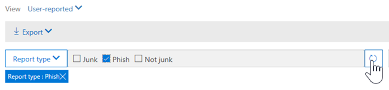

# Weergaven in Threat Explorer en realtime detectiesViews in Threat Explorer and real-time detections

[Threat Explorer](threat-explorer.md) (en het real-time detectierapport) is een krachtig, bijna realtime hulpmiddel om security operations-teams te helpen bij het onderzoeken en reageren op bedreigingen in het Security &amp; Compliance Center.[Threat Explorer](threat-explorer.md) (and the real-time detections report) is a powerful, near real-time tool to help Security Operations teams investigate and respond to threats in the Security &amp; Compliance Center. Explorer (en het realtime detectierapport) geeft informatie weer over vermoedelijke malware en phish in e-mail en bestanden in Office 365, evenals andere beveiligingsbedreigingen en -risico's voor uw organisatie.Explorer (and the real-time detections report) displays information about suspected malware and phish in email and files in Office 365, as well as other security threats and risks to your organization. 

- Als u AtP-abonnement [(Advanced Threat Protection) (Advanced Threat Protection)](office-365-atp.md) (ATP) hebt, hebt u Explorer.If you have [Office 365 Advanced Threat Protection](office-365-atp.md) (ATP) Plan 2, then you have Explorer.
- Als u Office 365 ATP-abonnement 1 hebt, hebt u realtime detecties.If you have Office 365 ATP Plan 1, then you have real-time detections.

Wanneer u Explorer voor het eerst opent (of het realtime detectierapport), toont de standaardweergave detecties van e-mailmalware van de afgelopen 7 dagen.When you first open Explorer (or the real-time detections report), the default view shows email malware detections for the past 7 days. Dit rapport kan ook ATP-detecties weergeven, zoals kwaadaardige URL's die zijn gedetecteerd door [veilige koppelingen](atp-safe-links.md)en schadelijke bestanden die zijn gedetecteerd door [veilige bijlagen.](atp-safe-attachments.md)This report can also show ATP detections, such as malicious URLs detected by [Safe Links](atp-safe-links.md), and malicious files detected by [Safe Attachments](atp-safe-attachments.md). Dit rapport kan worden gewijzigd om gegevens van de afgelopen 30 dagen weer te geven (met een betaald ATP P2-abonnement).This report can be modified to show data for the past 30 days (with an ATP P2 paid subscription). Proefabonnementen bevatten alleen gegevens van de afgelopen zeven dagen.Trial subscriptions will include data for the past seven days only.

|AbonnementSubscription  |UtilityUtility  |Dagen van gegevensDays of Data  |
|---------|---------|---------|
|ATP P1-proefversieATP P1 trial     | Realtime detectieReal-time detections        |   77      |
|ATP P1 betaaldATP P1 paid     |   Realtime detectieReal-time detections      |    3030     |
|ATP P1 betaald testen ATP P2 trialATP P1 paid testing ATP P2 trial     | BedreigingsverkennerThreat Explorer   |   77   |
|ATP P2-proefversieATP P2 trial     |  BedreigingsverkennerThreat Explorer       |     77    |
|ATP P2 betaaldATP P2 paid     |     BedreigingsverkennerThreat Explorer    |  3030       |

Gebruik het menu **Weergave** om te wijzigen welke informatie wordt weergegeven.Use the **View** menu to change what information is displayed. Met tooltips u bepalen welke weergave u wilt gebruiken.Tooltips help you determine which view to use.
  

Zodra u een weergave hebt geselecteerd, u filters toepassen en query's instellen om verdere analyses uit te voeren.Once you have selected a view, you can apply filters and set up queries to conduct further analysis. De volgende secties geven een kort overzicht van de verschillende weergaven die beschikbaar zijn in Explorer (of real-time detecties).The following sections provide a brief overview of the various views available in Explorer (or real-time detections).  

## E-mail > malwareEmail > Malware

Als u dit rapport wilt bekijken, kiest u **View**in Explorer (of realtime detecties)  >  **E-mailmalware**weergeven.  >  **Malware**To view this report, in Explorer (or real-time detections), choose **View** > **Email** > **Malware**. Deze weergave toont informatie over e-mailberichten die zijn geïdentificeerd als malware.This view shows information about email messages that were identified as containing malware.  

 

Klik **op Afzender** om uw lijst met weergaveopties te openen.Click **Sender** to open your list of viewing options. Gebruik deze lijst om gegevens van afzender, geadresseerden, afzenderdomein, onderwerp, detectietechnologie, beveiligingsstatus en meer weer te geven.Use this list to view data by sender, recipients, sender domain, subject, detection technology, protection status, and more. 

Als u bijvoorbeeld wilt zien welke acties zijn uitgevoerd op gedetecteerde e-mailberichten, kiest u **De status Beveiliging** in de lijst.For example, to see what actions were taken on detected email messages, choose **Protection status** in the list. Selecteer een optie en klik op de knop Vernieuwen om dat filter toe te passen op uw rapport.Select an option, and then click the Refresh button to apply that filter to your report.

Bekijk onder de grafiek meer details over specifieke berichten.Below the chart, view more details about specific messages. Wanneer u een item in de lijst selecteert, wordt een fly-out-deelvenster geopend, waar u meer informatie geven over het item dat u hebt geselecteerd.When you select an item in the list, a fly-out pane opens, where you can learn more about the item you selected. 

## E-mail > PhishEmail > Phish

Als u dit rapport wilt weergeven in Explorer (of realtimedetecties), kiest **u**  >  **E-mail**  >  **Phish**weergeven.To view this report, in Explorer (or real-time detections), choose **View** > **Email** > **Phish**. In deze weergave worden e-mailberichten weergegeven die zijn geïdentificeerd als phishingpogingen.This view shows email messages identified as phishing attempts.  

 

Klik **op Afzender** om uw lijst met weergaveopties te openen.Click **Sender** to open your list of viewing options. Gebruik deze lijst om gegevens weer te geven per afzender, geadresseerden, afzenderdomein, IP-adres voor afzenders, URL-domein, klik op vonnis en meer.Use this list to view data by sender, recipients, sender domain, sender IP, URL domain, click verdict, and more. 

Als u bijvoorbeeld wilt zien welke acties zijn ondernomen wanneer mensen op URL's hebben geklikt die zijn geïdentificeerd als phishingpogingen, kiest u **Klik op verdict** in de lijst, selecteert u een of meer opties en klikt u op de knop Vernieuwen.For example, to see what actions were taken when people clicked on URLs that were identified as phishing attempts, choose **Click verdict** in the list, select one or more options, and then click the Refresh button.

Bekijk onder de grafiek meer details over specifieke berichten, URL-klikken, URL's en e-mailoorsprong.Below the chart, view more details about specific messages, URL clicks, URLs, and email origin. 

Wanneer u een item in de lijst selecteert, zoals een URL die is gedetecteerd, wordt een fly-out-deelvenster geopend, waar u meer informatie krijgen over het item dat u hebt geselecteerd.When you select an item in the list, such as a URL that was detected, a fly-out pane opens, where you can learn more about the item you selected. 

## E->-inzendingenEmail > Submissions

Als u dit rapport wilt bekijken, kiest u **View**in Explorer (of realtimedetecties)  >  **E-mailinzendingen**  >  **weergeven**.To view this report, in Explorer (or real-time detections), choose **View** > **Email** > **Submissions**. Deze weergave toont e-mail die gebruikers hebben gerapporteerd als ongewenste, niet ongewenste e-mail of phishing.This view shows email that users have reported as junk, not junk, or phishing email. 

 

Klik **op Afzender** om uw lijst met weergaveopties te openen.Click **Sender** to open your list of viewing options. Gebruik deze lijst om informatie te bekijken per afzender, ontvangers, rapporttype (de vaststelling van de gebruiker dat de e-mail ongewenste e-mail was, niet ongewenste of phish), en meer.Use this list to view information by sender, recipients, report type (the user's determination that the email was junk, not junk, or phish), and more. 

Als u bijvoorbeeld informatie wilt weergeven over e-mailberichten die als phishingpogingen zijn gerapporteerd, klikt u op **Sender**  >  **type afzenderrapport,** selecteert u **Phish**en klikt u op de knop Vernieuwen.For example, to view information about email messages that were reported as phishing attempts, click **Sender** > **Report type**, select **Phish**, and then click the Refresh button.

Bekijk onder de grafiek meer details over specifieke e-mailberichten, zoals onderwerpregel, het IP-adres van de afzender, de gebruiker die het bericht als ongewenste, niet ongewenste of phish, en meer heeft gerapporteerd.Below the chart, view more details about specific email messages, such as subject line, the sender's IP address, the user that reported the message as junk, not junk, or phish, and more. 

Selecteer een item in de lijst om aanvullende details weer te geven.Select an item in the list to view additional details.

## E-> alle e-mailEmail > All email

Als u dit rapport wilt weergeven, kiest **u**in Explorer De optie  >  **E-mail**alle  >  **e-mail**weergeven .To view this report, in Explorer, choose **View** > **Email** > **All mail**. Deze weergave toont een all-up weergave van e-mailactiviteiten, inclusief e-mail die als kwaadaardig is geïdentificeerd als gevolg van phishing of malware, evenals alle niet-schadelijke e-mail (normale e-mail, spam en bulkmail).This views shows an all-up view of email activity, including email identified as malicious due to phishing or malware, as well all non-malicious mail (normal email, spam, and bulk mail). 

> [!NOTE]
> Als u een foutmelding krijgt die te veel gegevens leest **om weer te geven,** voegt u een filter toe en verkleint u indien nodig het datumbereik dat u bekijkt.If you get an error that reads **Too much data to display**, add a filter and, if necessary, narrow the date range you're viewing. 

Als u een filter wilt toepassen, kiest u **Afzender,** selecteert u een item in de lijst en klikt u op de knop Vernieuwen.To apply a filter, choose **Sender**, select an item in the list, and then click the Refresh button. In ons voorbeeld **gebruikten** we Detectietechnologie als filter (er zijn verschillende opties beschikbaar).In our example, we used **Detection technology** as a filter (there are several options available). Bekijk informatie per afzender, afzenderdomein, ontvangers, onderwerp, bestandsnaam van bijlagen, malwarefamilie, beveiligingsstatus (acties die zijn uitgevoerd door uw functies en beleid voor bedreigingsbescherming in Office 365), detectietechnologie (hoe de malware is gedetecteerd) en meer.View information by sender, sender's domain, recipients, subject, attachment filename, malware family, protection status (actions taken by your threat protection features and policies in Office 365), detection technology (how the malware was detected), and more. 

 

Bekijk onder de grafiek meer details over specifieke e-mailberichten, zoals onderwerpregel, ontvanger, afzender, status, enzovoort.Below the chart, view more details about specific email messages, such as subject line, recipient, sender, status, and so on. 

## Content > MalwareContent > Malware

Als u dit rapport wilt bekijken, kiest u **View**in Explorer (of realtime detecties) De optie  >  **Inhoudsmalware**  >  **weergeven.**To view this report, in Explorer (or real-time detections), choose **View** > **Content** > **Malware**. In deze weergave worden bestanden weergegeven die door Office 365 Advanced Threat Protection als kwaadaardig zijn geïdentificeerd [in SharePoint Online, OneDrive voor Bedrijven en Microsoft Teams.](atp-for-spo-odb-and-teams.md)This view shows files that were identified as malicious by [Office 365 Advanced Threat Protection in SharePoint Online, OneDrive for Business, and Microsoft Teams](atp-for-spo-odb-and-teams.md).

Bekijk informatie per malwarefamilie, detectietechnologie (hoe de malware is gedetecteerd) en werkbelasting (OneDrive, SharePoint of Teams).View information by malware family, detection technology (how the malware was detected), and workload (OneDrive, SharePoint, or Teams). 

  

Bekijk onder de grafiek meer details over specifieke bestanden, zoals bestandsnaam van bijlagen, werkbelasting, bestandsgrootte, die het bestand voor het laatst hebben gewijzigd en meer.Below the chart, view more details about specific files, such as attachment filename, workload, file size, who last modified the file, and more. 
  
## Klik-naar-filter mogelijkhedenClick-to-filter capabilities

Met Explorer (en realtime detecties) u met één klik een filter toepassen.With Explorer (and real-time detections), you can apply a filter in a click. Klik op een item in de legenda en dat item wordt een filter voor het rapport.Click an item in the legend, and that item becomes a filter for the report. Stel dat we kijken naar de malwareweergave in Explorer:For example, suppose we are looking at the Malware view in Explorer:
  

  
Als u op **ATP Detonation** in deze grafiek klikt, resulteert dit in een weergave als deze:Clicking **ATP Detonation** in this chart results in a view like this: 
  

  
In deze weergave kijken we nu naar gegevens voor bestanden die zijn ontploft door [Office 365 ATP Safe Attachments](atp-safe-attachments.md).In this view, we are now looking at data for files that were detonated by [Office 365 ATP Safe Attachments](atp-safe-attachments.md). Onder de grafiek kunnen we details zien over specifieke e-mailberichten met bijlagen die zijn gedetecteerd door ATP Safe Attachments.Below the chart, we can see details about specific email messages that had attachments that were detected by ATP Safe Attachments.
  

  
Als u een of meer items selecteert, wordt het menu **Acties** geactiveerd, waarin verschillende opties worden aangeboden waaruit u kiezen voor het geselecteerde item(s).Selecting one or more items activates the **Actions** menu, which offers several choices from which to choose for the selected item(s). 
  

  
De mogelijkheid om in een klik te filteren en naar specifieke details te navigeren, kan u veel tijd besparen bij het onderzoeken van bedreigingen.The ability to filter in a click and navigate to specific details can save you a lot of time in investigating threats.

## Query's en filtersQueries and filters

Explorer (evenals de real-time detecties rapport) heeft een aantal krachtige filters en query's mogelijkheden die u in staat stellen om te boren in details, zoals top gerichte gebruikers, top malware families, detectie technologie en nog veel meer.Explorer (as well as the real-time detections report) has several powerful filters and querying capabilities that enable you to drill into details, such as top targeted users, top malware families, detection technology and more. Elk type rapport biedt verschillende manieren om gegevens te bekijken en te verkennen.Each kind of report offers a variety of ways to view and explore data.

> [!IMPORTANT]
> Gebruik geen jokertekens, zoals een sterretje of een vraagteken, in de querybalk voor Explorer (of realtime detecties).Do not use wildcard characters, such as an asterisk or a question mark, in the query bar for Explorer (or real-time detections). Wanneer u in het **veld Onderwerp** zoekt naar e-mailberichten, voert Explorer (of realtime detecties) gedeeltelijke matching uit en levert resultaten op die vergelijkbaar zijn met een zoekopdracht met een wildcard.When you search on the **Subject field** for email messages, Explorer (or real-time detections) will perform partial matching and yield results similar to a wildcard search.
