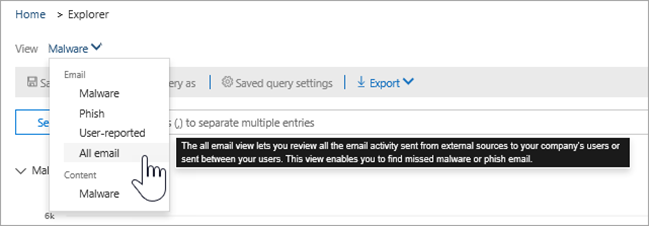
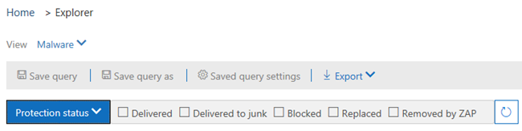

# Weergaven in Threat Explorer en realtime detecties

[Threat Explorer](threat-explorer.md) (en het realtime detectierapport) is een krachtige, bijna realtime tool waarmee beveiligingsteams bedreigingen &amp; in het Security Compliance Center kunnen onderzoeken en erop kunnen reageren. Explorer (en het realtime detectierapport) geeft informatie weer over vermoedelijke malware en phish in e-mail en bestanden in Office 365, evenals andere beveiligingsbedreigingen en risico's voor uw organisatie. 

- Als u [Office 365 Advanced Threat Protection](office-365-atp.md) (ATP) Plan 2 hebt, hebt u Explorer.
- Als u Office 365 ATP-abonnement 1 hebt, hebt u realtime detecties.

Wanneer u Explorer voor het eerst opent (of het realtime detectierapport), worden in de standaardweergave detecties van e-mailmalware van de afgelopen 7 dagen weergegeven. Dit rapport kan ook ATP-detecties weergeven, zoals kwaadaardige URL's gedetecteerd door [veilige koppelingen](atp-safe-links.md)en schadelijke bestanden gedetecteerd door [veilige bijlagen.](atp-safe-attachments.md) Dit rapport kan worden gewijzigd om gegevens weer te geven van de afgelopen 30 dagen (tenzij u een proefabonnement gebruikt). Proefabonnementen bevatten alleen gegevens van de afgelopen zeven dagen.

Gebruik het menu **Weergave** om te wijzigen welke informatie wordt weergegeven. Met tooltips u bepalen welke weergave u wilt gebruiken.
  

Nadat u een weergave hebt geselecteerd, u filters toepassen en query's instellen om verdere analyses uit te voeren. De volgende secties geven een kort overzicht van de verschillende weergaven die beschikbaar zijn in Explorer (of real-time detecties).  

## E-mail > Malware

Als u dit rapport in Explorer (of realtime detecties) wilt bekijken, kiest u**E-mailmalware** >  **weergeven** > .**Malware** In deze weergave vindt u informatie over e-mailberichten waarvan is vastgesteld dat ze malware bevatten.  

 

Klik **op Afzender** om uw lijst met weergaveopties te openen. Gebruik deze lijst om gegevens te bekijken per afzender, ontvangers, afzenderdomein, onderwerp, detectietechnologie, beveiligingsstatus en meer. 

Als u bijvoorbeeld wilt zien welke acties zijn uitgevoerd op gedetecteerde e-mailberichten, kiest u **De status Beveiliging** in de lijst. Selecteer een optie en klik op de knop Vernieuwen om dat filter op uw rapport toe te passen.

Bekijk hieronder meer details over specifieke berichten. Wanneer u een item in de lijst selecteert, wordt een uitschakelvenster geopend, waar u meer te weten komen over het geselecteerde item. 

## E-mail > Phish

Als u dit rapport wilt bekijken in Explorer (of realtime detecties), kiest u > **Phish** **weergeven** > **Email**. In deze weergave worden e-mailberichten weergegeven die zijn geïdentificeerd als phishingpogingen.  

 

Klik **op Afzender** om uw lijst met weergaveopties te openen. Gebruik deze lijst om gegevens te bekijken op afzender, ontvangers, afzenderdomein, ip-afzender, URL-domein, klikvonnis en meer. 

Als u bijvoorbeeld wilt zien welke acties zijn ondernomen toen mensen op URL's klikten die als phishingpogingen zijn geïdentificeerd, kiest u **Klikop in** de lijst, selecteert u een of meer opties en klikt u op de knop Vernieuwen.

Bekijk onder de grafiek meer details over specifieke berichten, URL-klikken, URL's en e-mailoorsprong. 

Wanneer u een item in de lijst selecteert, zoals een GEDETECTEERDe URL, wordt een uitvliegvenster geopend, waar u meer te weten komen over het geselecteerde item. 

## E-mail > Inzendingen

Als u dit rapport wilt bekijken in Explorer (of realtime detecties), kiest u > **E-mailinzendingen** > **Submissions** **weergeven**. Deze weergave toont e-mail die gebruikers hebben gerapporteerd als ongewenste e-mail, niet als ongewenste e-mail of phishing. 

 

Klik **op Afzender** om uw lijst met weergaveopties te openen. Gebruik deze lijst om informatie te bekijken per afzender, ontvangers, rapporttype (de bepaling van de gebruiker dat de e-mail ongewenste e-mail was, geen ongewenste e-mail of phish) en meer. 

Als u bijvoorbeeld informatie wilt weergeven over e-mailberichten die als phishingpogingen zijn gerapporteerd, klikt u op**Type Afzenderrapport,** **Sender** > selecteert u **Phish**en klikt u op Vernieuwen.

Bekijk onder de grafiek meer details over specifieke e-mailberichten, zoals onderwerpregel, het IP-adres van de afzender, de gebruiker die het bericht als ongewenste e-mail heeft gerapporteerd, geen ongewenste e-mail of phish, en meer. 

Selecteer een item in de lijst om aanvullende details weer te geven.

## E-mail > Alle e-mail

Als u dit rapport wilt weergeven, kiest u in Explorer > **Alle e-mail** >  **weergeven**.**All mail** Deze weergaven tonen een all-up weergave van e-mailactiviteit, inclusief e-mail die als kwaadaardig is geïdentificeerd als gevolg van phishing of malware, evenals alle niet-schadelijke e-mail (normale e-mail, spam en bulkmail). 

> [!NOTE]
> Als u een fout krijgt die te veel gegevens leest **om weer te geven,** voegt u een filter toe en verkleint u, indien nodig, het datumbereik dat u bekijkt. 

Als u een filter wilt toepassen, kiest u **Afzender,** selecteert u een item in de lijst en klikt u op de knop Vernieuwen. In ons voorbeeld gebruikten we **detectietechnologie** als filter (er zijn verschillende opties beschikbaar). Bekijk informatie per afzender, domein van afzender, ontvangers, onderwerp, bestandsnaam van bijlagen, malwarefamilie, beveiligingsstatus (acties die worden uitgevoerd door uw functies en beleid voor bedreigingsbescherming in Office 365), detectietechnologie (hoe de malware werd gedetecteerd) en Meer. 

 

Bekijk onder de grafiek meer details over specifieke e-mailberichten, zoals onderwerpregel, ontvanger, afzender, status, enzovoort. 

## Inhoud > malware

Als u dit rapport in Explorer (of realtime detecties) wilt bekijken, kiest u**Inhoudsmalware** >  **weergeven.** > **Malware** In deze weergave worden bestanden weergegeven die als kwaadaardig zijn geïdentificeerd door [Office 365 Advanced Threat Protection in SharePoint Online, OneDrive voor Bedrijven en Microsoft Teams.](atp-for-spo-odb-and-teams.md)

Bekijk informatie per malwarefamilie, detectietechnologie (hoe de malware werd gedetecteerd) en werkbelasting (OneDrive, SharePoint of Teams). 

  

Bekijk onder de grafiek meer details over specifieke bestanden, zoals de bestandsnaam van bijlagen, werkbelasting, bestandsgrootte, wie het bestand het laatst heeft gewijzigd en meer. 
  
## Klik-op-filter mogelijkheden

Met Explorer (en real-time detecties) u met een klik een filter toepassen. Klik op een item in de legenda en dat item wordt een filter voor het rapport. Stel dat we de malwareweergave in Explorer bekijken:
  

  
Als u op **ATP-detonatie** klikt in deze grafiek, wordt deze weergegeven: 
  

  
In deze weergave bekijken we nu gegevens voor bestanden die zijn ontploft door [veilige bijlagen bij Office 365 ATP.](atp-safe-attachments.md) Onder de grafiek zien we details over specifieke e-mailberichten met bijlagen die werden gedetecteerd door ATP Safe Attachments.
  

  
Als u een of meer items selecteert, wordt het menu **Acties** geactiveerd, waarin verschillende opties worden weergegeven om voor het geselecteerde item(s) te kiezen. 
  

  
De mogelijkheid om te filteren in een klik en navigeren naar specifieke details kan bespaart u veel tijd in het onderzoeken van bedreigingen.

## Query's en filters

Explorer (evenals het realtime detectierapport) heeft verschillende krachtige filters en querymogelijkheden waarmee u inzoomen op details, zoals topgerichte gebruikers, topmalwarefamilies, detectietechnologie en meer. Elk soort rapport biedt een verscheidenheid aan manieren om gegevens te bekijken en te verkennen.

> [!IMPORTANT]
> Gebruik geen jokertekens, zoals een sterretje of een vraagteken, in de querybalk voor Explorer (of realtime detecties). Wanneer u in het **veld Onderwerp** zoekt naar e-mailberichten, voert Explorer (of realtime detecties) gedeeltelijke matching uit en levert het resultaten op die vergelijkbaar zijn met een wildcardzoekopdracht.
