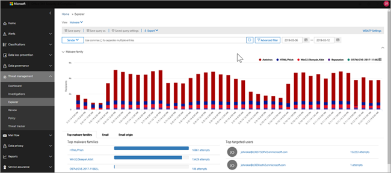

# Weergaven in Threat Explorer en realtime detecties

[!INCLUDE [Microsoft 365 Defender rebranding](../includes/microsoft-defender-for-office.md)]

**Van toepassing op**
- [Abonnement 1 en abonnement 2 voor Microsoft Defender voor Office 365](defender-for-office-365.md)
- [Microsoft 365 Defender](../defender/microsoft-365-defender.md)

[Threat Explorer](threat-explorer.md) (en het realtimedetectierapport) is een krachtig, bijna realtime hulpprogramma waarmee beveiligingsteams bedreigingen kunnen onderzoeken en beantwoorden in het Beveiligings- & Compliancecentrum. Explorer (en het realtimedetectierapport) geeft informatie weer over verdachte malware en phish in e-mail en bestanden in Office 365, evenals andere beveiligingsrisico's en risico's voor uw organisatie.

- Als u [Microsoft Defender hebt voor Office 365](defender-for-office-365.md) abonnement 2, hebt u Explorer.
- Als u Microsoft Defender hebt voor Office 365 abonnement 1, hebt u realtime detecties.

Wanneer u Explorer (of het realtimedetectierapport) voor het eerst opent, worden in de standaardweergave detecties van e-mail malware voor de afgelopen 7 dagen weergegeven. Dit rapport kan ook Microsoft Defender voor Office 365-detecties, zoals kwaadaardige URL's die zijn gedetecteerd door [Safe Koppelingen,](safe-links.md)en schadelijke bestanden die zijn gedetecteerd door [Safe Bijlagen.](safe-attachments.md) Dit rapport kan worden gewijzigd om gegevens van de afgelopen 30 dagen weer te geven (met een Microsoft Defender voor Office 365 P2-abonnement). Proefabonnementen bevatten alleen gegevens over de afgelopen zeven dagen.

****

|Abonnement|Hulpprogramma|Dagen van gegevens|
|---|---|---|
|Proefversie van Microsoft Defender Office 365 P1|Detecties in realtime|7|
|Microsoft Defender voor Office 365 P1 betaald|Detecties in realtime|30|
|Microsoft Defender for Office 365 P1 paid testing Defender for Office 365 P2 trial|Bedreigingsverkenner|7|
|Proefversie van Microsoft Defender Office 365 P2|Bedreigingsverkenner|7|
|Microsoft Defender voor Office 365 P2 betaald|Bedreigingsverkenner|30|
|

> [!NOTE]
> Binnenkort wordt de bewaar- en zoeklimiet voor proeften tenants uitgebreid van 7 naar 30 dagen voor het bewaren en zoeken van gegevens in Explorer (en realtimedetecties). Deze wijziging wordt bijgehouden als onderdeel van routekaartitem 70544 en is momenteel in een uitrolfase.

Gebruik **het** menu Beeld om te wijzigen welke gegevens worden weergegeven. Met knopinfo kunt u bepalen welke weergave u wilt gebruiken.

Nadat u een weergave hebt geselecteerd, kunt u filters toepassen en query's instellen om verdere analyse uit te voeren. In de volgende secties ziet u een kort overzicht van de verschillende weergaven die beschikbaar zijn in Explorer (of realtime detecties).

## E-mail > Malware

Als u dit rapport wilt bekijken, kiest u in Explorer (of realtime detecties) **de optie E-mail malware** \>  \> **weergeven.** In deze weergave ziet u informatie over e-mailberichten die zijn geïdentificeerd als malware.

Klik **op Afzender** om uw lijst met weergaveopties te openen. Gebruik deze lijst om gegevens weer te geven op afzender, geadresseerden, afzenderdomein, onderwerp, detectietechnologie, beveiligingsstatus en meer.

Als u bijvoorbeeld wilt zien welke acties zijn ondernomen voor gedetecteerde e-mailberichten, kiest u **Beveiligingsstatus** in de lijst. Selecteer een optie en klik vervolgens op de knop Vernieuwen om dat filter toe te passen op uw rapport.

Bekijk onder de grafiek meer informatie over specifieke berichten. Wanneer u een item in de lijst selecteert, wordt er een fly-outvenster geopend, waar u meer informatie kunt vinden over het item dat u hebt geselecteerd.

## E-mail > Phish

Als u dit rapport wilt bekijken, kiest u in Explorer (of realtime detecties) **de** optie \> **E-mail** \> **phish weergeven.** In deze weergave ziet u e-mailberichten die zijn geïdentificeerd als phishingpogingen.

Klik **op Afzender** om uw lijst met weergaveopties te openen. Gebruik deze lijst om gegevens te bekijken op afzender, geadresseerden, afzenderdomein, AFZENDER-IP, URL-domein, klik op vonnis en meer.

Als u bijvoorbeeld wilt zien welke acties zijn ondernomen wanneer personen op URL's klikten die zijn geïdentificeerd als phishingpogingen, kiest u Op vonnis **klikken** in de lijst, selecteert u een of meer opties en klikt u vervolgens op de knop Vernieuwen.

Bekijk onder de grafiek meer informatie over specifieke berichten, URL-klikken, URL's en e-mail origin.

Wanneer u een item in de lijst selecteert, zoals een URL die is gedetecteerd, wordt een uitvliegend deelvenster geopend, waar u meer informatie kunt vinden over het item dat u hebt geselecteerd.

## E-> Inzendingen

Als u dit rapport wilt bekijken, kiest u in Explorer (of realtime detecties) **de** optie \>  \> **E-mailverzending weergeven.** In deze weergave ziet u e-mail die gebruikers hebben gerapporteerd als ongewenste e-mail, geen ongewenste e-mail of phishing-e-mail.

Klik **op Afzender** om uw lijst met weergaveopties te openen. Gebruik deze lijst om gegevens weer te geven op afzender, geadresseerden, rapporttype (de gebruiker heeft vastgesteld dat de e-mail ongewenste e-mail was, geen ongewenste e-mail of phish) en meer.

Als u bijvoorbeeld informatie wilt weergeven over e-mailberichten die zijn gerapporteerd als phishingpogingen, klikt u op **Afzenderrapporttype,** selecteert u Phish en klikt u \> vervolgens op de knop Vernieuwen. 

Bekijk onder de grafiek meer informatie over specifieke e-mailberichten, zoals onderwerpregel, HET IP-adres van de afzender, de gebruiker die het bericht heeft gerapporteerd als ongewenste e-mail, geen ongewenste e-mail of phish, en meer.

Selecteer een item in de lijst om extra details weer te geven.

## E-> Alle e-mail

Als u dit rapport wilt bekijken, kiest u in Verkenner **De optie** \> **E-mail** \> **weergeven alle e-mail.** In deze weergaven ziet u een overzicht van e-mailactiviteit, inclusief e-mail die als schadelijk is geïdentificeerd vanwege phishing of malware, evenals alle niet-schadelijke e-mail (normale e-mail, spam en bulkmail).

> [!NOTE]
> Als u een foutmelding krijgt met te veel gegevens om weer te **geven,** voegt u een filter toe en beperkt u zo nodig het datumbereik dat u bekijkt.

Als u een filter wilt toepassen, kiest u **Afzender,** selecteert u een item in de lijst en klikt u vervolgens op de knop Vernieuwen. In ons voorbeeld hebben we **detectietechnologie gebruikt** als filter (er zijn verschillende opties beschikbaar). Gegevens weergeven per afzender, het domein van de afzender, geadresseerden, onderwerp, bestandsnaam van bijlage, malwarefamilie, beveiligingsstatus (acties die zijn ondernomen door de functies en beleidsregels voor bedreigingsbeveiliging in Office 365), detectietechnologie (hoe de malware is gedetecteerd) en meer.

Bekijk onder de grafiek meer informatie over specifieke e-mailberichten, zoals onderwerpregel, geadresseerde, afzender, status, en dergelijke.

## Inhoud > Malware

Als u dit rapport wilt bekijken, kiest u in Explorer (of realtime detecties) de optie  \> **Inhoudsmalware** \> **weergeven.** In deze weergave ziet u bestanden die door Microsoft Defender zijn geïdentificeerd als schadelijk voor Office 365 [in SharePoint Online, OneDrive voor Bedrijven en Microsoft Teams.](mdo-for-spo-odb-and-teams.md)

Informatie weergeven via malwarefamilie, detectietechnologie (hoe de malware is gedetecteerd) en werkbelasting (OneDrive, SharePoint of Teams).

Bekijk onder de grafiek meer informatie over specifieke bestanden, zoals bestandsnaam van bijlagen, werkbelasting, bestandsgrootte, wie het bestand het laatst heeft gewijzigd en meer.

## Klik-en-filtermogelijkheden

Met Explorer (en realtimedetecties) kunt u met één klik een filter toepassen. Klik op een item in de legenda en dat item wordt een filter voor het rapport. Stel dat we kijken naar de weergave Malware in Explorer:

Als u in **deze grafiek op ATP-detonatie** klikt, ziet u de volgende weergave:

In deze weergave bekijken we nu gegevens voor bestanden die zijn ontploft door Safe [Bijlagen.](safe-attachments.md) Onder de grafiek ziet u details over specifieke e-mailberichten met bijlagen die zijn gedetecteerd door Safe Bijlagen.

Als u een of meer items selecteert, wordt het **menu** Acties geactiveerd, waarin verschillende opties worden weergegeven waaruit u kunt kiezen voor het geselecteerde item(en).

De mogelijkheid om in een klik te filteren en naar specifieke details te navigeren, kan u veel tijd besparen bij het onderzoeken van bedreigingen.

## Query's en filters

Explorer (evenals het realtimedetectierapport) beschikt over verschillende krachtige filters en query's waarmee u kunt inzoomen op details, zoals de meest gerichte gebruikers, de beste malwarefamilies, detectietechnologie en meer. Elk type rapport biedt verschillende manieren om gegevens weer te geven en te verkennen.

> [!IMPORTANT]
> Gebruik geen jokertekens, zoals een sterretje of een vraagteken, in de querybalk voor Explorer (of realtime detecties). Wanneer u in het veld **Onderwerp** zoekt naar e-mailberichten, worden in Verkenner (of realtimedetecties) gedeeltelijke overeenkomsten en resultaten weergegeven die lijken op een jokertekenzoekactie.
