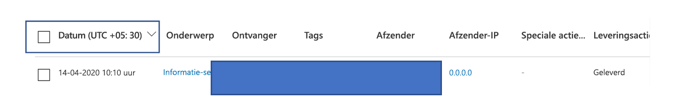
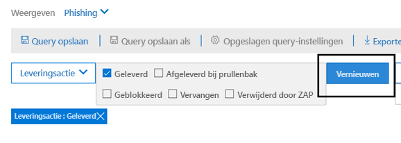
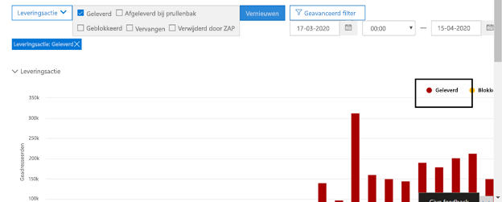
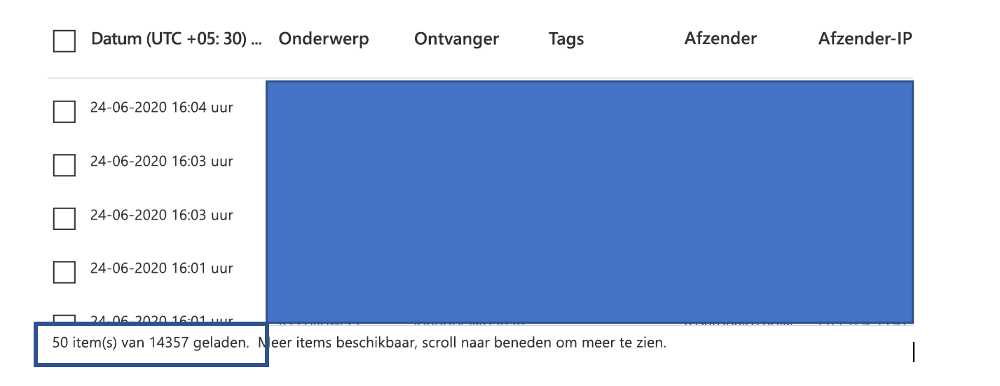

# Threat Explorer en real-time detectiesThreat Explorer and real-time detections

Als uw organisatie [Office 365 Advanced Threat Protection](office-365-atp.md) (Office 365 ATP) heeft en u de [benodigde machtigingen](#required-licenses-and-permissions)hebt, hebt u **Explorer-** of **realtime detecties** (voorheen *realtime rapporten* - zie wat er [nieuw is!).](#new-features-in-threat-explorer-and-real-time-detections)If your organization has [Office 365 Advanced Threat Protection](office-365-atp.md) (Office 365 ATP), and you have the [necessary permissions](#required-licenses-and-permissions), you have either **Explorer** or **real-time detections** (formerly *real-time reports* — [see what's new](#new-features-in-threat-explorer-and-real-time-detections)!). Ga in het Security & Compliance Center naar **Bedreigingsbeheer**en kies **vervolgens Explorer-** _of_ **Real-time detecties**.In the Security & Compliance Center, go to **Threat management**, and then choose **Explorer** _or_ **Real-time detections**.

| Met ATP Plan 2 ziet u:With ATP Plan 2, you see: | Met ATP Plan 1 ziet u:With ATP Plan 1, you see: |
|---|---|
|||
|

Met Explorer (of real-time detecties) beschikt u over een krachtig rapport waarmee uw Security Operations-team bedreigingen effectief en efficiënt kan onderzoeken en erop kan reageren.With Explorer (or real-time detections), you have a powerful report that enables your Security Operations team to investigate and respond to threats effectively and efficiently. Het rapport lijkt op de volgende afbeelding:The report resembles the following image:

Met dit rapport u:With this report, you can:

- [Zie malware gedetecteerd door Microsoft 365 beveiligingsfunctiesSee malware detected by Microsoft 365 security features](#see-malware-detected-in-email-by-technology)
- [Gegevens over phishing-URL's weergeven en op vonnis klikkenView data about phishing URLs and click verdict](#view-data-about-phishing-urls-and-click-verdict)
- [Een geautomatiseerd onderzoek- en reactieproces](#start-automated-investigation-and-response) starten vanuit een weergave in Explorer (alleen ATP-abonnement)[Start an automated investigation and response process from a view in Explorer](#start-automated-investigation-and-response) (ATP Plan 2 only)
- ... [Onderzoek kwaadaardige e-mail, en meer!](#more-ways-to-use-explorer-or-real-time-detections)... [Investigate malicious email, and more](#more-ways-to-use-explorer-or-real-time-detections)!

## Ervaring verbeteringen aan Threat Explorer en Real-Time DetectiesExperience Improvements to Threat Explorer and Real-Time Detections

Als onderdeel van het verbeteren van het jachtproces hebben we een paar updates doorgevoerd voor Threat Explorer en Real-Time Detections.As part of improving the hunting process, we have made a few updates to Threat Explorer and Real-Time Detections. Dit zijn 'ervaring' verbeteringen, met de focus op het maken van de jacht ervaring meer consistent.These are ‘experience’ improvements, with the focus on making the hunting experience more consistent. Deze wijzigingen worden hieronder beschreven:These changes are outlined below: 

- [Verbeteringen in de tijdzoneTimezone improvements](#timezone-improvements)
- [Bijwerken in het vernieuwingsprocesUpdate in the Refresh process](#update-in-the-refresh-process)
- [Grafiekzoom om aan filters toe te voegenChart drilldown to add to filters](#chart-drilldown-to-add-to-filters)
- [In productinformatie-updatesIn product information updates](#in-product-information-updates)

### Verbeteringen in de tijdzoneTimezone improvements 

We tonen de tijdzone voor de e-mailrecords binnen de Portal, evenals voor geëxporteerde gegevens.We will show the timezone for the email records within the Portal, as well as for Exported data. De tijdzone is zichtbaar voor ervaringen zoals E-mailraster, Gegevens flyout, e-mailtijdlijn en vergelijkbare e-mails, zodat de tijdzone voor de resultatenset duidelijk is voor de gebruiker.The timezone will be visible across experiences like Email Grid, Details Flyout, Email Timeline, and Similar Emails, so that the timezone for the result set is clear to the user. 

### Bijwerken in het vernieuwingsprocesUpdate in the Refresh process 

We hebben feedback gehoord rond verwarring met automatische vernieuwing (bijvoorbeeld voor datum, zodra u de datum wijzigt, de pagina zou vernieuwen) en handmatig vernieuwen (voor andere filters).We have heard feedback around confusion with automatic refresh (e.g. for date, as soon as you change the date, the page would refresh) and manual refresh (for other filters). Op dezelfde manier leidt het verwijderen van filters tot automatische vernieuwing, dit veroorzaakt situaties waarin het wijzigen van de verschillende filters terwijl u de query wijzigt, inconsistente zoekervaringen kan veroorzaken.Similarly, removing filters leads to automatic refresh, this causes situations where changing the different filters while modifying the query can cause inconsistent search experiences. Om dit op te lossen, gaan we over op een handmatig filtermechanisme.To solve this, we are moving to a manual filtering mechanism.
Vanuit het oogpunt van de ervaring kan de gebruiker het verschillende bereik van filters toepassen en verwijderen (uit de filterset en datum) en op de vernieuwingsknop drukken om de resultaten te filteren zodra deze zijn uitgevoerd met het definiëren van de query.From an experience standpoint, the user can apply and remove the different range of filters (from the filter set, and date), and press the refresh button to filter the results once they are done with defining the query. De refresh-knop is ook bijgewerkt om het duidelijk op het scherm te roepen.The refresh button has also been updated to call it out clearly on the screen. We hebben ook bijgewerkt tooltips en in-product documentatie rond deze verandering.We have also updated tooltips and in-product documentation around this change. 

### Grafiekzoom om aan filters toe te voegenChart drilldown to add to filters

U nu op de waarden van de grafieklegenda klikken om die waarde als filter toe te voegen.You will now be able to click on the chart legend values to add that value as a filter. Houd er rekening mee dat u nog steeds op de vernieuwingsknop moet klikken om de resultaten te filteren als onderdeel van de hierboven beschreven wijziging.Note that you will still have to click on the refresh button to filter the results as part of the change described above.

### In productinformatie-updatesIn product information updates 

U ziet ook aanvullende details in het product.You should also see additional details within the product. Bijvoorbeeld het totale aantal zoekresultaten binnen het raster (zie hieronder), evenals verbeteringen rond labels, foutmeldingen en knopinfo, om meer informatie te geven over filters, zoekervaring en resultaatset.For example, the total number of search results within grid (see below), as well as improvements around labels, error messages and tooltips, to give more information around filters, search experience, and result set. 

## Nieuwe functies in real-time detectiesNew features in real-time detections

## Nieuwe functies in Threat Explorer en real-time detectiesNew features in Threat Explorer and real-time detections

Drie nieuwe functies toegevoegd aan Threat Explorer en real-time detecties:Three new features added into Threat Explorer and real-time detections:

- [Voorbeeld van e-mailkoptekst en e-mailtekst downloadenPreview email header and download email body](#preview-email-header-and-download-email-body)
- [Tijdlijn per e-mailEmail timeline](#email-timeline)
- [URL-klikgegevens exporterenExport URL click data](#export-url-click-data)

Deze nieuwe functies worden hieronder beschreven.These new features are outlined below.

### Voorbeeld van e-mailkoptekst en e-mailtekst downloadenPreview email header and download email body

De mogelijkheid om een voorbeeld van een e-mailkoptekst te bekijken en de e-mailbody te downloaden, zijn nieuwe functies die beschikbaar zijn in Threat Explorer.The ability to preview an email header and download the email body are new features available in Threat Explorer. Beheerders kunnen gedownloade kopteksten/e-mailberichten analyseren op bedreigingen.Admins will be able to analyze downloaded headers/email messages for threats. Omdat het downloaden van e-mailberichten de blootstelling van informatie in gevaar kan brengen, wordt dit proces beheerd door roles-based access control (RBAC).Because downloading email messages can risk the exposure of information, this process is controlled by roles-based access control (RBAC). Een nieuwe rol, *Preview,* moet worden toegevoegd aan een andere rolgroep (zoals Beveiligingsbewerkingen of Beveiligingsbeheerder) om de mogelijkheid te bieden om e-mails te downloaden en kopteksten te bekijken in de weergave alle e-mailberichten.A new role, *Preview*, must be added to another role group (such as Security Operations or Security Administrator) to grant the ability to download mails and preview headers in all-email messages view.

Maar Explorer (en real-time detecties) voegt ook nieuwe velden toe die zijn ontworpen om u een vollediger beeld te geven van waar uw e-mailberichten landen.But Explorer (and real-time detections) also adds fresh new fields designed to give you a more complete picture of where your email messages land. Een deel van het doel van deze verandering is om de jacht gemakkelijker te maken voor Security Ops mensen, maar het netto resultaat is het kennen van de locatie van probleem e-mailberichten in een oogopslag.Part of the goal of this change is to make hunting easier for Security Ops people, but the net result is knowing the location of problem email messages at a glance.

Hoe wordt dit gedaan?How is this done? De leveringsstatus is nu onderverdeeld in twee kolommen:Delivery Status is now broken out into two columns:

- **Leveringsactie** - Wat is de status van deze e-mail?**Delivery Action** - What is the status of this email?
- **Leveringslocatie** - Waar is deze e-mail als gevolg hiervan doorgestuurd?**Delivery Location** - Where was this email routed as a result?

Leveringsactie is de actie die wordt ondernomen op een e-mail vanwege bestaand beleid of detecties.Delivery Action is the action taken on an email due to existing policies or detections. Dit zijn de mogelijke acties die een e-mail kan ondernemen:Here are the possible actions an email can take:

|GeleverdDelivered  |JunkedJunked  |GeblokkeerdBlocked  |VervangenReplaced  |
|---------|---------|---------|---------|
|E-mail is geleverd aan Postvak IN of map van een gebruiker en de gebruiker kan er direct toegang toe krijgen.Email was delivered to Inbox or folder of a user and the user can directly access it.    | E-mail is verzonden naar de map Ongewenste e-mail of verwijderde map van de gebruiker en de gebruiker heeft toegang tot e-mails in die mappen.Email was sent to either user’s Junk folder or Deleted folder, and the user has access to emails in those folders.       | E-mails die in quarantaine zijn geplaatst, die zijn mislukt of zijn verwijderd.Any emails that are quarantined, that  failed, or were dropped. Dit is volledig ontoegankelijk voor de gebruiker!This is completely inaccessible by the user!     | Elke e-mail waarin schadelijke bijlagen worden vervangen door .txt-bestanden waarin de bijlage staat, was schadelijk.Any email where malicious attachments are replaced by .txt files that state the attachment was malicious.     |
    

| GeleverdDelivered | JunkedJunked | GeblokkeerdBlocked | VervangenReplaced |
|---|---|---|---|
|E-mail is geleverd aan de inbox van de gebruiker of een andere map en de gebruiker heeft er rechtstreeks toegang toe.Email was delivered to the user's inbox or another folder, and the user can directly access it.| E-mail is verzonden naar de map Ongewenste e-mail of de map Verwijderde gebruiker en de gebruiker heeft toegang tot e-mailberichten in die mappen.Email was sent to either user's Junk folder or Deleted folder, and the user has access to email messages in those folders.| E-mailberichten die in quarantaine zijn geplaatst, die zijn mislukt of zijn verwijderd en die niet toegankelijk zijn voor de gebruiker.Any email messages that are quarantined, that failed, or were dropped, and are not accessible by the user.| Alle e-mailberichten waar kwaadaardige bijlagen werden vervangen door .txt-bestanden waarin de bijlagen staan, waren schadelijk.Any email messages where malicious attachments were replaced by .txt files that state the attachments were malicious.|
|

En hier is wat de gebruiker kan zien, en wat ze niet kunnen:And here is what the user can see, and what they can't:

| Toegankelijk voor eindgebruikersAccessible to end users | Ontoegankelijk voor eindgebruikersInaccessible to end users |
|---|---|
|GeleverdDelivered|GeblokkeerdBlocked|
|JunkedJunked|VervangenReplaced|

De leveringslocatie toont de resultaten van beleid en detecties die na levering worden uitgevoerd.Delivery location shows the results of policies and detections that run post-delivery. Het is gekoppeld aan een leveringsactie.It's linked to a Delivery Action. Dit veld is toegevoegd om inzicht te geven in de actie die is ondernomen wanneer een probleemmail wordt gevonden.This field was added to give insight into the action taken when a problem mail is found. Hier zijn de mogelijke waarden van de levering locatie:Here are the possible values of delivery location:

- **Postvak IN of map**: De e-mail staat in de postvak IN of in een map (volgens uw e-mailregels).**Inbox or folder**: The email is in inbox or a folder (according to your email rules).
- **On-prem of extern**: De mailbox bestaat niet in de cloud, maar is on-premises.**On-prem or external**: The mailbox doesn't exist on cloud but is on-premises.
- **Ongewenste map:** de e-mail bevindt zich in de map Ongewenste e-mail van een gebruiker.**Junk folder**: The email is in the Junk folder of a user.
- **Map Verwijderde items**: de e-mail in de map Verwijderde items van een gebruiker.**Deleted items folder**: The email in the Deleted items folder of a user.
- **Quarantaine**: de e-mail in quarantaine en bevindt zich niet in het postvak van een gebruiker.**Quarantine**: The email in quarantine, and is not in a user's mailbox.
- **Mislukt:** de e-mail kan het postvak niet bereiken.**Failed**: The email failed to reach the mailbox.
- **Verwijderd**: De e-mail gaat ergens verloren in de e-mailstroom.**Dropped**: The email gets lost somewhere in the mail flow.

### Tijdlijn per e-mailEmail timeline

De **tijdlijn van e-mail** is een andere nieuwe Explorer-functie die gericht is op het verbeteren van de jachtervaring voor beheerders.The **Email Timeline** is another new Explorer feature aimed at making the hunting experience better for admins. Het vermindert op randomisatie omdat er minder tijd besteed aan het controleren van verschillende locaties om te proberen de gebeurtenis te begrijpen.It cuts down on randomization because there is less time spent checking different locations to try to understand the event. Wanneer meerdere gebeurtenissen plaatsvinden op of in de buurt van hetzelfde tijdstip in een e-mail, worden deze gebeurtenissen weergegeven in een tijdlijnweergave.When multiple events happen at, or close to, the same time on an email, those events will show up in a timeline view. In feite worden sommige gebeurtenissen die plaatsvinden na de levering aan uw e-mail vastgelegd in de kolom 'Speciale actie'.In fact, some events that happen post-delivery to your mail will be captured in the 'Special action' column. Het combineren van de informatie uit de tijdlijn van die e-mail met de speciale actie die wordt ondernomen op de post nabezorging geeft beheerders inzicht in hoe hun beleid werkt, waar de e-mail uiteindelijk werd gerouteerd en, in sommige gevallen, wat de uiteindelijke beoordeling was.Combining the information from the timeline of that mail with the special action taken on the mail post-delivery will give admins insight into how their policies work, where the mail was finally routed, and, in some cases, what the final assessment was.

Zie [Schadelijke e-mail die is geleverd in Office 365 voor](investigate-malicious-email-that-was-delivered.md)meer discussie over het onderzoeken van schadelijke e-mailberichten.For more discussion about investigating malicious email messages, see [Investigate and remediate malicious email that was delivered in Office 365](investigate-malicious-email-that-was-delivered.md).

### URL-klikgegevens exporterenExport URL click data

U nu ook rapporten voor URL-klikken exporteren naar Microsoft Excel om zowel hun netwerkbericht-id als hun Klik-uitspraak weer te geven, waardoor de taak om te begrijpen waar uw URL-klikverkeer vandaan komt, gemakkelijker is geworden.Also, you will now be able to export reports for URL clicks to Microsoft Excel in order to view both their Network Message ID, and their Click Verdict, making the task of understanding where your URL click traffic originated easier. Dit is hoe het werkt.Here's how it works. Klik vanaf bedreigingsbeheer bij de quick-launch van Office 365 door deze keten:Starting in Threat Management on the Office 365 quick-launch, click through this chain:

**Explorer** \> **Bekijk Phish** \> **Klikken** \> **Top-URL's of topklikken met URL's** \> **Klik op een record om URL-flyout te openen****Explorer** \> **View Phish** \> **Clicks** \> **Top URLs or URL Top Clicks** \> **Click on any record to open URL flyout**

Wanneer u op een URL in de lijst klikt, ziet u een nieuwe knop Exporteren in het deelvenster Fly-out.When you click on a URL in the list, you'll see a new Export button on the fly-out panel. Gebruik deze knop om gegevens naar een Excel-spreadsheet te verplaatsen voor eenvoudigere rapportage.Use this button to move data to an Excel spreadsheet for easier reporting.

U als volgt op dezelfde locatie komen in het rapport real-time detecties:You can get to the same location in the real-time detections report as follows:

**Explorer** \> **Real-time detecties** \> **Bekijk Phish** \> **URL's** \> **Top-URL's of topklikken** \> **Klik op een record om URL-flyout te openen** \> **Navigeer naar het tabblad Klikken.****Explorer** \> **Real-time Detections** \> **View Phish** \> **URLs** \> **Top URLs or Top Clicks** \> **Click on any record to open URL flyout** \> **Navigate to the Clicks Tab.**

> [!TIP]
> Network Message ID brengt de klik terug naar specifieke e-mails wanneer u zoekt via Explorer of bijbehorende hulpprogramma's van derden via Network Message ID.Network Message ID maps the click back to specific mails when you search through Explorer or associated 3rd party tools via Network Message ID. Als u zoekt via de netwerkbericht-id, krijgen beheerders de specifieke e-mail die is gekoppeld aan een klikresultaat.Searching through the Network Message ID will give admins the specific email associated with a click result. Bij export zorgt de correlerende identificatie van Network Message ID voor een snellere en krachtigere analyse.On export having, the correlating identification of Network Message ID makes for quicker and more powerful analysis.

## Zie malware gedetecteerd in e-mail door technologieSee malware detected in email by technology

Stel dat u malware wilt zien die in e-mail wordt gedetecteerd, door Microsoft 365-technologie.Suppose you want to see malware detected in email, by Microsoft 365 technology. Gebruik hiervoor de [weergave E-mail > malware](threat-explorer-views.md#email--malware) van Explorer (of realtime detecties).To do this, use the [Email > Malware](threat-explorer-views.md#email--malware) view of Explorer (or real-time detections).

1. Kies in het Security & Compliance Center [https://protection.office.com](https://protection.office.com) ( ) de optie Threat **management**  >  **Explorer** (of **Real-time detecties).**In the Security & Compliance Center ([https://protection.office.com](https://protection.office.com)), choose **Threat management** > **Explorer** (or **Real-time detections**). (In dit voorbeeld wordt Explorer gebruikt.)(This example uses Explorer.)

2. Kies in het menu **Weergave** de optie **Malware e-mailen.**  >  **Malware**In the **View** menu, choose **Email** > **Malware**.

   

3. Klik **op Afzender**en kies **vervolgens**  >  **Basisdetectietechnologie**.Click **Sender**, and then choose **Basic** > **Detection technology**.

   Uw detectietechnologieën zijn nu beschikbaar als filters voor het rapport.Your detection technologies are now available as filters for the report.

   

4. Selecteer een optie en klik op de knop **Vernieuwen** om dat filter toe te passen.Select an option, and then click the **Refresh** button to apply that filter.

   

Het rapport wordt vernieuwd om de resultaten te tonen die malware in e-mail heeft gedetecteerd, met behulp van de technologieoptie die u hebt geselecteerd.The report refreshes to show the results malware detected in email, using the technology option you selected. Vanaf hier u verdere analyse uitvoeren.From here, you can conduct further analysis.

## Gegevens over phishing-URL's weergeven en op vonnis klikkenView data about phishing URLs and click verdict

Stel dat u phishingpogingen via URL's in e-mail wilt zien, inclusief een lijst met URL's die zijn toegestaan, geblokkeerd en overschreven.Suppose that you want to see phishing attempts through URLs in email, including a list of URLs that were allowed, blocked, and overridden. Voor het identificeren van URL's waarop is geklikt, moeten [ATP Safe-koppelingen](atp-safe-links.md) worden geconfigureerd.Identifying URLs that were clicked requires [ATP Safe links](atp-safe-links.md) to be configured. Zorg ervoor dat u [atp-beleid](set-up-atp-safe-links-policies.md) voor veilige koppelingen hebt ingesteld voor tijd-van-klikbeveiliging en het registreren van klikvonnissen door ATP Safe Links.Make sure that you have set up [ATP Safe Links policies](set-up-atp-safe-links-policies.md) for time-of-click protection and logging of click verdicts by ATP Safe Links.

Als u phish-URL's in berichten en klikken op URL's in phish-berichten wilt bekijken, gebruikt u de [weergave E-> Phish](threat-explorer-views.md#email--phish) van Explorer (of realtime detecties).To review phish URLs in messages and clicks on URLs in phish messages, use the [Email > Phish](threat-explorer-views.md#email--phish) view of Explorer (or real-time detections).

1. Kies in het Security & Compliance Center [https://protection.office.com](https://protection.office.com) ( ) de optie Threat **management**  >  **Explorer** (of **Real-time detecties).**In the Security & Compliance Center ([https://protection.office.com](https://protection.office.com)), choose **Threat management** > **Explorer** (or **Real-time detections**). (In dit voorbeeld wordt Explorer gebruikt.)(This example uses Explorer.)

2. Kies **in het** menu Weergave **e-mail**  >  **Phish**.In the **View** menu, choose **Email** > **Phish**.

   

3. Klik op **Afzender**en kies **URL's**  >  **Klik op verdict**.Click **Sender**, and then choose **URLs** > **Click verdict**.

4. Selecteer een of meer opties, zoals **Geblokkeerd** en **Overschreven blokkeren,** en klik op de knop **Vernieuwen** die zich op dezelfde regel bevindt als de opties om dat filter toe te passen.Select one or more options, such as **Blocked** and **Block overridden**, and then click the **Refresh** button that is on the same line as the options to apply that filter. (Vernieuw uw browservenster niet.)(Don't refresh your browser window.)

   

    Het rapport wordt vernieuwd om twee verschillende URL-tabellen weer te geven op het tabblad URL onder het rapport:The report refreshes to show two different URL tables on the URL tab under the report:

   - **De belangrijkste URL's** zijn de URL's in de berichten die u hebt gefilterd en de actie voor e-mailbezorging telt voor elke URL.**Top URLs** are the URLs contained in the messages you have filtered down to, and the email delivery action counts for each URL. In de phish e-mailweergave bevat deze lijst meestal legitieme URL's.In the phish email view, this list typically will contain legitimate URLs. Aanvallers nemen een mix van goede en slechte URL's in hun berichten om te proberen om ze geleverd, maar ze zullen de kwaadaardige links interessanter voor de gebruiker om te klikken.Attackers include a mix of good and bad URLs in their messages to try to get them delivered, but they will make the malicious links more interesting for the user to click. De tabel met URL's wordt gesorteerd op het totale aantal e-mail (maar houd er rekening mee dat deze kolom is verborgen om de weergave te vereenvoudigen).The table of URLs is sorted by total email count (but note that this column is hidden to simplify the view).

   - **De belangrijkste klikken** zijn de ingepakte URL's voor veilige koppelingen waarop is geklikt, gesorteerd op totale kliktelling (deze kolom wordt ook niet weergegeven om de weergave te vereenvoudigen).**Top clicks** are the Safe Links wrapped URLs that were clicked, sorted by total click count (this column is also not shown to simplify the view). Totaal aantal tellingen per kolom geeft het aantal klikken op veilige koppelingen aan voor elke geklikte URL.Total counts by column indicate the Safe Links click verdict count for each clicked URL. In de phish e-mailweergave zijn dit vaker verdachte of kwaadaardige URL's, maar kunnen URL's zijn die geen bedreigingen zijn, maar in phish-berichten.In the phish email view, these are more often suspicious or malicious URLs, but could include URLs that are not threats but are in phish messages. URL-klikken op onverpakte koppelingen worden hier niet weergegeven.URL clicks on unwrapped links will not show up here.

   De twee URL-tabellen tonen de belangrijkste URL's in phishing-e-mailberichten op basis van leveringsactie en locatie, en ze tonen URL-klikken die zijn geblokkeerd (of bezocht ondanks een waarschuwing), zodat u begrijpen welke potentiële slechte links door gebruikers zijn ontvangen en waarmee gebruikers zijn gebruikt.The two URL tables show top URLs in phishing email messages by delivery action and location, and they show URL clicks that were blocked (or visited despite a warning) so that you can understand what potential bad links were received by users and interacted with by users. Vanaf hier u verdere analyse uitvoeren.From here, you can conduct further analysis. Onder de grafiek ziet u bijvoorbeeld de belangrijkste URL's in e-mailberichten die zijn geblokkeerd in de omgeving van uw organisatie.For example, below the chart, you can see the top URLs in email messages that were blocked in your organization's environment.

   

   Selecteer een URL om meer gedetailleerde informatie weer te geven.Select a URL to view more detailed information.
   
   > [!NOTE]
   > In het dialoogvenster URL-flyout wordt het filteren op e-mailberichten verwijderd om u de volledige weergave van de blootstelling van de URL in uw omgeving weer te geven.In the URL flyout dialog, the filtering on email messages is removed to show you the full view of the URL's exposure in your environment. Hiermee u e-mailberichten in Explorer filteren op berichten waar u zich zorgen over maakt, specifieke URL's vinden die potentiële bedreigingen zijn en vervolgens uw begrip van de URL-belichting in uw omgeving (via het dialoogvenster URL-details) uitbreiden zonder URL-filters toe te voegen aan de Explorer-weergave zelf.This lets you filter down email messages in Explorer to ones you are concerned about, find specific URLs that are potential threats, then expand your understanding of the URL exposure in your environment (via the URL details dialog) without having to add URL filters to the Explorer view itself.

## E-mailberichten bekijken die door gebruikers zijn gerapporteerdReview email messages reported by users

Stel dat u e-mailberichten wilt zien die gebruikers in uw organisatie hebben gerapporteerd als ongewenste e-mail, geen ongewenste e-mail of phishing met behulp van de [invoegtoepassing Rapportbericht voor Outlook en Outlook in de web.](enable-the-report-message-add-in.md)Suppose that you want to see email messages that users in your organization have reported as Junk, Not Junk, or Phishing by using the [Report Message add-in for Outlook and Outlook on the web](enable-the-report-message-add-in.md). Gebruik hiervoor de weergave [E-mail > Inzendingen](threat-explorer-views.md#email--submissions) van Explorer (of realtime detecties).To do this, use the [Email > Submissions](threat-explorer-views.md#email--submissions) view of Explorer (or real-time detections).

1. Kies in het Security & Compliance Center [https://protection.office.com](https://protection.office.com) ( ) de optie Threat **management**  >  **Explorer** (of **Real-time detecties).**In the Security & Compliance Center ([https://protection.office.com](https://protection.office.com)), choose **Threat management** > **Explorer** (or **Real-time detections**). (In dit voorbeeld wordt Explorer gebruikt.)(This example uses Explorer.)

2. Kies **in het** menu Weergave de optie **E-mailinzendingen**  >  **Submissions**.In the **View** menu, choose **Email** > **Submissions**.

   

3. Klik op **Afzender**en kies **vervolgens**  >  **Basisrapporttype**.Click **Sender**, and then choose **Basic** > **Report type**.

4. Selecteer een optie, zoals **Phish,** en klik op de knop **Vernieuwen.**Select an option, such as **Phish**, and then click the **Refresh** button.

   

Het rapport wordt vernieuwd om gegevens weer te geven over e-mailberichten die mensen in uw organisatie hebben gerapporteerd als een phishingpoging.The report refreshes to show data about email messages that people in your organization have reported as a phishing attempt. U deze informatie gebruiken om verdere analyse uit te voeren en indien nodig uw [ATP-anti-phishingbeleid](configure-atp-anti-phishing-policies.md)aan te passen.You can use this information to conduct further analysis, and if necessary, adjust your [ATP anti-phishing policies](configure-atp-anti-phishing-policies.md).

## Automatisch onderzoek en reactie startenStart automated investigation and response

> [!NOTE]
> Geautomatiseerde onderzoeks- en reactiemogelijkheden zijn beschikbaar in **Office 365 ATP Plan 2** en **Office 365 E5**.Automated investigation and response capabilities are available in **Office 365 ATP Plan 2** and **Office 365 E5**.

(NIEUW!) [Geautomatiseerd onderzoek en respons](automated-investigation-response-office.md) kan uw beveiligingsteam veel tijd en moeite besparen bij het onderzoeken en beperken van cyberaanvallen.(NEW!) [Automated investigation and response](automated-investigation-response-office.md) can save your security operations team much time and effort in investigating and mitigating cyberattacks. Naast het configureren van waarschuwingen die een beveiligingsspeelboek kunnen activeren, u een geautomatiseerd onderzoek- en reactieproces starten vanuit een weergave in Explorer.In addition to configuring alerts that can trigger a security playbook, you can start an automated investigation and response process from a view in Explorer.

Zie [Voorbeeld: Een beveiligingsbeheerder activeert een onderzoek vanuit Explorer](automated-investigation-response-office.md#example-a-security-administrator-triggers-an-investigation-from-threat-explorer)voor meer informatie hierover.For details on this, see [Example: A security administrator triggers an investigation from Explorer](automated-investigation-response-office.md#example-a-security-administrator-triggers-an-investigation-from-threat-explorer).

## Meer manieren om Explorer (of realtime detecties) te gebruikenMore ways to use Explorer (or real-time detections)

Naast de scenario's die in dit artikel worden beschreven, hebt u nog veel meer rapportageopties beschikbaar met Explorer (of realtime detecties).In addition to the scenarios outlined in this article, you have many more reporting options available with Explorer (or real-time detections).

- [Kwaadaardige e-mail zoeken en onderzoeken die is bezorgdFind and investigate malicious email that was delivered](investigate-malicious-email-that-was-delivered.md)
- [Schadelijke bestanden weergeven die zijn gedetecteerd in SharePoint Online, OneDrive en Microsoft TeamsView malicious files detected in SharePoint Online, OneDrive, and Microsoft Teams](malicious-files-detected-in-spo-odb-or-teams.md)
- [Krijg een overzicht van de weergaven in Threat Explorer (en realtime detecties)Get an overview of the views in Threat Explorer (and real-time detections)](threat-explorer-views.md)
- [Geautomatiseerd onderzoek en reactie in Microsoft Threat ProtectionAutomated investigation and response in Microsoft Threat Protection](https://docs.microsoft.com/microsoft-365/security/mtp/mtp-autoir)

## Vereiste licenties en machtigingenRequired licenses and permissions

U moet [office 365 ATP](office-365-atp.md) hebben om Explorer- of realtime detecties te krijgen.You must have [Office 365 ATP](office-365-atp.md) to get Explorer or real-time detections.

- Explorer is opgenomen in Office 365 ATP-abonnement 2.Explorer is included in Office 365 ATP Plan 2.
- Het rapport realtime detecties is opgenomen in Office 365 ATP Plan 1.The real-time detections report is included in Office 365 ATP Plan 1.
- Ben van plan licenties toe te wijzen voor alle gebruikers die moeten worden beschermd door Office 365 ATP.Plan to assign licenses for all users who should be protected by Office 365 ATP. (Explorer- of realtimedetecties tonen detectiegegevens voor gelicentieerde gebruikers.)(Explorer or real-time detections shows detection data for licensed users.)

Als u Explorer- of realtimedetecties wilt weergeven en gebruiken, moet u over de juiste machtigingen beschikken, zoals die welke zijn verleend aan een beveiligingsbeheerder of beveiligingslezer.To view and use Explorer or real-time detections, you must have appropriate permissions, such as those granted to a security administrator or security reader.

- Voor het Security &amp; Compliance Center moet u een van de volgende rollen toegewezen hebben:For the Security &amp; Compliance Center, you must have one of the following roles assigned:

  - OrganisatiebeheerOrganization Management
  - Beveiligingsbeheerder (dit kan worden toegewezen in het Azure Active Directory-beheercentrum ( [https://aad.portal.azure.com](https://aad.portal.azure.com) ))Security Administrator (this can be assigned in the Azure Active Directory admin center ([https://aad.portal.azure.com](https://aad.portal.azure.com)))
  - BeveiligingslezerSecurity Reader

- Voor Exchange Online moet u een van de volgende rollen hebben toegewezen in het Exchange-beheercentrum ( [https://outlook.office365.com/ecp](https://outlook.office365.com/ecp) ) of met PowerShell-cmdlets (Zie [Exchange Online PowerShell):](https://docs.microsoft.com/powershell/exchange/exchange-online-powershell)For Exchange Online, you must have one of the following roles assigned in either the Exchange admin center ([https://outlook.office365.com/ecp](https://outlook.office365.com/ecp)) or with PowerShell cmdlets (See [Exchange Online PowerShell](https://docs.microsoft.com/powershell/exchange/exchange-online-powershell)):

  - OrganisatiebeheerOrganization Management
  - Alleen-weergeven organisatiebeheerView-only Organization Management
  - Rol alleen weergeven ontvangersView-Only Recipients role
  - Compliance ManagementCompliance Management

Zie de volgende bronnen voor meer informatie over rollen en machtigingen:To learn more about roles and permissions, see the following resources:

- [Machtigingen in het Security &amp; Compliance CenterPermissions in the Security &amp; Compliance Center](permissions-in-the-security-and-compliance-center.md)
- [Functiemachtigingen in Exchange OnlineFeature permissions in Exchange Online](https://docs.microsoft.com/exchange/permissions-exo/feature-permissions)

## Enkele verschillen tussen Threat Explorer en real-time detectiesSome differences between Threat Explorer and real-time detections

- Het **realtime detectierapport** is beschikbaar in Office 365 ATP Plan 1, terwijl **Threat Explorer** beschikbaar is in Office 365 ATP Plan 2.The **real-time detections** report is available in Office 365 ATP Plan 1, whereas **Threat Explorer** is available in Office 365 ATP Plan 2.
- Met **het real-time detectierapport** u detecties in realtime bekijken.The **real-time detections** report allows you to view detections in real-time. **Threat Explorer** doet dit ook, maar stelt u ook in staat om extra details voor een bepaalde aanval te bekijken.**Threat Explorer** does this as well, but also allows you to view additional details for a given attack.
- Een **e-mailweergave alle** is beschikbaar in **Threat Explorer** (en staat niet in het rapport **realtime detecties).**An **All email** view is available in **Threat Explorer** (and is not in the **real-time detections** report).
- Meer filtermogelijkheden en beschikbare acties zijn opgenomen in **Threat Explorer**.More filtering capabilities and available actions are included in **Threat Explorer**.

Zie [Office 365 ATP-servicebeschrijving: Beschikbaarheid van functies voor ATP-abonnementen (Advanced Threat Protection).](https://docs.microsoft.com/office365/servicedescriptions/office-365-advanced-threat-protection-service-description#feature-availability-across-advanced-threat-protection-atp-plans)For more details, see [Office 365 ATP Service Description: Feature availability across Advanced Threat Protection (ATP) plans](https://docs.microsoft.com/office365/servicedescriptions/office-365-advanced-threat-protection-service-description#feature-availability-across-advanced-threat-protection-atp-plans).

