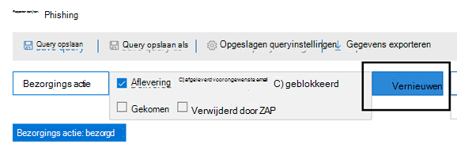

# Bedreigings Verkenner en real-time ontdekkenThreat Explorer and real-time detections

[!INCLUDE [Microsoft 365 Defender rebranding](../includes/microsoft-defender-for-office.md)]

Als uw organisatie [office 365 Advanced Threat Protection](office-365-atp.md) (Office 365 ATP) heeft en u de [benodigde machtigingen](#required-licenses-and-permissions)hebt, hebt u de keuze uit de **Verkenner** of de **realtime** (voorheen *realtime-rapporten* ), [Zie wat is er nieuw](#new-features-in-threat-explorer-and-real-time-detections)!.If your organization has [Office 365 Advanced Threat Protection](office-365-atp.md) (Office 365 ATP), and you have the [necessary permissions](#required-licenses-and-permissions), you have either **Explorer** or **real-time detections** (formerly *real-time reports* — [see what's new](#new-features-in-threat-explorer-and-real-time-detections)!). Ga in het beveiligings & nalevings centrum naar **Threat Management**en kies vervolgens **Verkenner** _of_ **realtime-detecties**.In the Security & Compliance Center, go to **Threat management**, and then choose **Explorer** _or_ **Real-time detections**.

|Met ATP abonnement 2 ziet u het volgende:With ATP Plan 2, you see:|Met ATP abonnement 1 ziet u het volgende:With ATP Plan 1, you see:|
|---|---|
|||
|

Met de Verkenner (of realtime detectie) hebt u een krachtig rapport waarmee uw beveiligingsactiviteiten team op hun eigen en efficiënte manier kunnen onderzoeken en beantwoorden.With Explorer (or real-time detections), you have a powerful report that enables your Security Operations team to investigate and respond to threats effectively and efficiently. Het rapport is vergelijkbaar met de volgende afbeelding:The report resembles the following image:

Met dit rapport kunt u:With this report, you can:

- [Zie malware die door Microsoft 365 beveiligingsfuncties is gedetecteerd.See malware detected by Microsoft 365 security features](#see-malware-detected-in-email-by-technology)
- [Bekijk gegevens over phishingberichten en klik op VerdictView data about phishing URLs and click verdict](#view-data-about-phishing-urls-and-click-verdict)
- [Een automatisch onderzoek en antwoord proces starten vanuit een weergave in Verkenner (alleen voor het](#start-automated-investigation-and-response) ATP-abonnement 2)[Start an automated investigation and response process from a view in Explorer](#start-automated-investigation-and-response) (ATP Plan 2 only)
- ... [Onderzoek kwaadaardige e-mail en nog veel meer](#more-ways-to-use-explorer-or-real-time-detections).... [Investigate malicious email, and more](#more-ways-to-use-explorer-or-real-time-detections)!

## Verbeteringen in de ervaring voor de jacht-ervaring (binnenkort)Improvements to Threat Hunting Experience (upcoming)

### Update van bedreigings informatie voor e-mailberichtenUpdated Threat Information for Emails

We hebben ons gefocust over verbeteringen in platform en gegevenskwaliteit om de nauwkeurigheid en consistentie van de gegevens te verbeteren.We have focused on platform and data quality improvements to increase data accuracy and consistency for email records. Deze set updates omvat consolidatie van voorlopige informatie en informatie over de levering (de voorbeeld actie die voor een e-mailbericht wordt uitgevoerd als onderdeel van ZAP-proces) in één record, samen met toegevoegde verouderings locaties, zoals spam Verdict.These set of updates includes consolidation of pre-delivery and post-delivery information (example action executed on an email as part of ZAP process) into a single record  along with added richness like Spam verdict, Entity level threats (e.g. which URL was malicious) and latest delivery locations. 

Na deze updates ziet u één vermelding voor elk bericht, ongeacht de diverse gebeurtenissen na de levering die op het bericht plaatsvonden.After these updates, you'll see a single entry for each message, regardless of the different post-delivery events that have taken place on the message. U kunt ook ZAP, handmatig herstel (dat wil zeggen beheerdersactie), dynamische levering, etc.Actions can include ZAP, Manual Remediation (which means admin action), Dynamic Delivery etc. 

Naast malware en phishing is het ook mogelijk om spam verdict te zien die zijn gekoppeld aan een e-mailbericht.In addition to showing malware and phish threats, you'll now be able to see spam verdict associated with an email. In het e-mailbericht ziet u alle bedreigingen van de e-mail, samen met de bijbehorende detectie technologieën.Within the email, you will be able to see all the threats associated with the email along with the corresponding detection technologies. U kunt elk e-mailbericht 0, 1 of meerdere bedreigingen hebben.Each email can have 0, 1, or multiple threats. In het gedeelte Details van de E-mail flyout ziet u de huidige bedreigingen.You'll see the current Threats in the Details section of the Email flyout. Daarnaast zou voor meerdere bedreigingen (bijvoorbeeld een e-mailbericht met malware en phishing) de Threat-Detection-toewijzing geven, wat betekent dat de detectie tech leidde tot het identificeren van de bedreiging.Additionally, for multiple threats (e.g., an email having both Malware and Phish), Detection tech field would give the Threat-Detection mapping, meaning which detection tech led to the identification of the Threat.

De set detectie technologieën is bijgewerkt met nieuwe detectiemethoden, en de spam detectie technologieën, en aross alle verschillende e-mail weergaven (malware, phishing, alle E-mail), u hebt dezelfde, consistente sets detectie technologieën om de resultaten te filteren.The set of detection technologies has been updated to include new detection methods, as well as spam detection technologies, and aross all the different email views (Malware, Phish, All Email), you'll have the same, consistent set of Detection technologies to filter the results. 

**Opmerking**: verdict-analyse kan niet noodzakelijkerwijs aan entiteiten zijn gebonden.**Note**: Verdict analysis might not necessarily be tied to entities. Voorbeeld: een e-mailbericht kan als phishing of spam worden geclassificeerd, maar er zijn geen Url's die een phishing-of spam Verdict.As an example, an email might be classified as Phish or Spam, but there are no URLs which have any Phish/Spam verdict stamped on them. Dit komt doordat de filters ook inhoud en andere details van een e-mailbericht evalueren voordat ze een verdict toewijzen.This is because our filters also evaluate content and other details for an email, before assigning a verdict. 
 
#### Bedreigingen in Url'sThreats in URLs

In de vervolgmenu e-mail-> tabblad Details ziet u nu een specifieke bedreiging voor de URL (de bedreiging voor een URL kan malware, phishing, spam of geen) worden weergegeven.Within email flyout-> Details tab, you would now be able to see the specific threat for a URL (Threat for a URL can be Malware, Phish, Spam or None)

### Bijgewerkte tijdlijnweergave (binnenkort)Updated Timeline View (upcoming)

Naast het identificeren van alle activiteiten met betrekking tot bezorging en na levering, biedt de tijdlijnweergave ook informatie over de bedreiging die op dat moment is geïdentificeerd voor een subset van deze gebeurtenissen.In addition to identifying all delivery and post-delivery events, timeline view also gives information about the Threat identified at that point of time for a subset of these events. Ook krijgt u meer informatie over extra acties (bijvoorbeeld ZAP, handmatig herstel), samen met het resultaat van die actie.It also gives you more information about Additional Actions (e.g. ZAP, Manual Remediation) along with the Result of that action. De tijdlijnweergave bevat informatie over de oorspronkelijke bezorgings periode en daaropvolgende gebeurtenissen na de bezorging van een e-mailbericht.Timeline view contains information about the Original delivery and subsequently any post-delivery events performed on an email.

-   Bron: dit kan de beheerder/het systeem/de gebruiker zijn op basis van de bron van de gebeurtenis.Source: This can be Admin/System/user based on what was the source of the event.
-   Gebeurtenis: Dit geldt ook voor gebeurtenissen op het hoogste niveau zoals originele levering, handmatig herbemiddeling, ZAP, inzendingen en dynamische bezorging.Event: This includes top level events like Original Delivery, Manual Remediation, ZAP, Submissions, and Dynamic Delivery .
-   Actie: Dit geldt voor de specifieke actie die is uitgevoerd als onderdeel van ZAP-of beheerdersactie (zoals een tijdelijke verwijdering).Action: This covers the specific action that was taken either as part of ZAP or Admin Action (e.g., Soft Delete).
-   Threats: behandelt de bedreigingen (malware, phishing en spam) die op dat moment identificeren.Threats: Covers the threats (Malware, Phish, Spam) identified at that point of time.
-   Resultaat/informatie: Hier vindt u meer informatie over het resultaat van de actie, ongeacht of de actie is uitgevoerd als onderdeel van ZAP/admin.Result/Details: Covers more information about the Result of the Action, whether it was performed as part of ZAP/Admin Action.

### Oorspronkelijke en meest recente bezorgingslocatieOriginal and Latest Delivery location

De bezorgingslocatie bevindt zich nu in het raster en de e-mail flyout van de e-mail.Today, we surface delivery Location within email grid and email flyout. Doorgaan wordt de naam van het veld bezorgingslocatie gewijzigd in oorspronkelijke bezorgingslocatie.Going forward, the Delivery Location field will be renamed to Original Delivery Location. Daarnaast wordt ook een ander veld met de naam meest recente bezorgingslocatie geïntroduceerd.Additionally, we're also introducing another field called Latest delivery location. 

Op de oorspronkelijke bezorgingslocatie vindt u meer informatie over de locatie van een e-mailbericht dat u aanvankelijk ontvangt.The original delivery location would give more information about where an email was delivered initially. De meest recente bezorgingslocatie bevat locaties waar een e-mailbericht mogelijk is gelost na systeemacties zoals ZAP-of beheeracties, zoals **verplaatsen naar verwijderde items**.The latest delivery location would include location where an email may have landed after system actions like ZAP or admin actions like **Move to Deleted Items**. Nieuwste bezorgingslocatie is bedoeld om beheerders op de hoogte te stellen van de laatste locatie van de publicatie na de bezorging van het bericht of van systeem/beheer-acties.Latest delivery location is intended to inform admins of the message's last known location post-delivery or any system/admin actions. Op basis van ontwerpen bevat dit geen activiteiten met betrekking tot de eindgebruikers van de e-mail.By design, it doesn't include any end user related actions on the email. Bijvoorbeeld: als een gebruiker een bericht verwijdert of het bericht verplaatst naar archief-of PST-bestand, wordt het bericht ' bezorgingslocatie ' niet bijgewerkt.For example: if a user deletes a message or moves the message to archive/pst, the message "delivery" location will not be updated. Als een systeemactie de locatie echter heeft bijgewerkt (bijvoorbeeld ZAP resulteerde in een e-mailbericht dat overstapt naar Quarantine), ziet u de nieuwste bezorgingslocatie in quarantaine.However, if a system action updated the location (e.g., ZAP resulting in an email moving to Quarantine), you would see the Latest delivery location as Quarantine. 

**Opmerking**: in de volgende gevallen wordt de bezorgingslocatie en de bezorgings actie weergegeven:**Note**: There are few cases where Delivery Location and Delivery Action may show 'Unknown' as the value:

- U ziet mogelijk de bezorgingslocatie als afgeleverd, en de bezorgingslocatie is onbekend.You might see Delivery location as Delivered, and Delivery Location as Unknown. Dit gebeurt als het bericht is bezorgd, maar een regel voor Postvak in het bericht heeft verplaatst naar een standaardmap (concept, archief, etc.) in plaats van het postvak in of de map Ongewenste E-mail.This happens when the message was delivered, but an Inbox rule moved the message to a default folder (Draft, Archive, etc.) instead of the Inbox or Junk Email folders. 

- De meest recente bezorgingslocatie kan niet worden herkend als een beheerder/systeemactie (bijvoorbeeld, ZAP, admin actie) wordt geprobeerd, maar het bericht niet is gevonden.Latest Delivery Location can be unknown if an admin/system action (e.g., ZAP, Admin Action) is attempted, but the message isn't found. Meestal gebeurt de actie wanneer de gebruiker het bericht heeft verplaatst of verwijderd.Typically, the action happens after the user has moved or deleted the Message. In dergelijke gevallen controleert u de kolom resultaat/Details in de tijdlijnweergave.In such cases, verify the Result/Details Column in timeline view. Zoek het bericht: bericht is verplaatst of verwijderd door de gebruiker.Look for the message: Message moved or deleted by the user.

### Aanvullende actiesAdditional Actions 

Aanvullende acties bestaan uit de acties die zijn toegepast op de bezorging van het e-mailbericht, en kunnen ZAP, handmatige herstelbewerkingen (actie die worden uitgevoerd door een admi; n voorbeeld van een onverwachte verwijdering), dynamische bezorging en opnieuw verwerkte (een e-mailbericht met een terugwerkend e-mailbericht).Additional Actions consist of the actions that were applied post the delivery of the Email, and can include ZAP, Manual Remediation (action taken by an Admi;n e.g., Soft Delete), Dynamic Delivery, and Reprocessed (an email was retroactively detected as good). 

> [!NOTE]
>
> - Als onderdeel van deze wijziging wordt de verwijderde naam van de ZAP-waarde die op dat moment is geoppereerd in het bezorgings filter weggegooid.As part of this change, the Removed by ZAP value currently surfaced in the Delivery Action filter is going away. U kunt ook zoeken naar alle e-mailberichten met de ZAP-poging via de aanvullende acties.You'll have a way to search for all email with the ZAP attempt through the Additional Actions.
>
> -Er worden nieuwe velden en waarden voor detectie technologieën en extra acties (met name voor ZAP-scenario's) weergegeven.-There will be new fields and values for Detection technologies and Additional actions (especially for ZAP scenarios). Evalueer uw bestaande opgeslagen Query's en bijgehouden query's om ervoor te zorgen dat ze werken met de nieuwe waarden.Evaluate your existing Saved Queries and Tracked queries to make sure they work with the new values. 

### Systeem overschrijvingenSystem overrides 

Systeem overschrijvingen zijn een methode voor het aanstellen van uitzonderingen op de beoogde bezorgingslocatie van een bericht door de bezorgingslocatie van het systeem te vervangen (op basis van de bedreigingen en andere detecties die worden aangegeven door de filter stapel).System overrides are a method of making exceptions to the intended delivery location of a message by overriding the delivery location provided by system (based on the threats and other detections identified by our filtering stack). Door systeem overschrijvingen kan worden ingesteld via Tenant of gebruikersbeleid om het bericht op te geven dat door het beleid wordt voorgesteld.System overrides can be set through tenant or user policy to deliver the message as suggested by the policy. Overschrijvingen zijn handig voor het identificeren van een onbedoelde aflevering van schadelijke berichten vanwege bezorgings hiaten (bijvoorbeeld een zeer algemeen beleid voor het veilig afzenderset dat door een gebruiker is ingesteld).Overrides are useful in identifying any unintentional delivery of malicious messages due to configurations gaps (for example, a very broad Safe Sender policy set by a user). Deze opheffings waarden kunnen zijn:These override values can be:

- Toegestaan door gebruikersbeleid: dit is wanneer een gebruiker domeinen of afzenders toestaat door beleidsregels op Postvak niveau te maken.Allowed by user policy: This is when a user allows domains or senders by creating policies at the mailbox level.
- Geblokkeerd door gebruikersbeleid: dit is wanneer een gebruiker domeinen of afzenders blokkeert door beleidsregels op het postvak niveau te maken.Blocked by user policy: This is when a user blocks domains or senders by creating policies at the mailbox level.
- Toegestaan door het beleid van de organisatie: dit doet zich voor als de beveiligings teams van de organisatie beleidsregels voor de organisatie of Exchange-e-mail stroom regels (ook wel transport regels genoemd) hebben voor het toestaan van afzenders en domeinen voor gebruikers in hun organisatie.Allowed by org policy: This is when the organization's security teams set policies or Exchange mail flow rules (also known as transport rules) to allow senders and domains for users in their organization. Dit kan bestaan voor een set gebruikers of de hele organisatie.This can be for a set of users or the entire organization.
- Toegestaan door het beleid voor de organisatie: Dit houdt in dat de beveiligings teams van de organisatie beleidsregels of e-mail stroom regels instellen voor het blokkeren van afzenders, domeinen, berichten talen of bron-IPs voor gebruikers in hun organisatie.Blocked by org policy: This is when the organization's security teams set policies or mail flow rules to block senders, domains, message languages, or source IPs for users in their organization. Dit kan ook voor een reeks gebruikers of de hele organisatie.This can also be for a set of users or the entire organization.
- Bestandsextensie wordt geblokkeerd door het organisatiebeleid: dit doet zich voor als een bestandsextensie wordt geblokkeerd door de beveiligings teams van een organisatie via de beleidsinstellingen voor anti-malware.File extension blocked by org policy: This is when a file type extension is blocked by the security teams of an organization through the anti-malware policy settings. Deze waarden worden nu weergegeven in e-mail gegevens om onderzoek te doen.These values will now be displayed in email details to help with investigations. Secops teams kunnen ook filteren op geblokkeerde bestandsextensies met behulp van de functies voor uitgebreid filteren.Secops teams can also filter on blocked file extensions using the rich filtering capability.

### Verbeteringen rond URL'S en klikkenImprovements around URL and Clicks Experience

De gefocuste functies op URL en URL klikken op gegevens zijn:The set of improvements focussed towards URL and URL clicks data include:

-   Het weergeven van de volledige geklikt URL (waaronder query parameters die deel uitmaken van de URL) binnen de Click-sectie in URL-flyout.Showing full Clicked URL (including any query Parameters which are part of URL) within the Clicks Section in URL Flyout. Op dit moment wordt het URL-domein en pad weergegeven op de titelbalk.Currently we show the URL domain and path in title bar. We verlengen deze informatie om de volledige URL weer te geven.We're extending that information to show the full URL.
-   Oplossingen voor URL-filters (URL versus URL Domain versus URL Domain en Path): er zijn updates voor het zoeken naar berichten die een URL bevatten/Klik op Verdict.Fixes across URL filters (URL vs URL domain vs URL Domain and path): We've made updates around searching for messages that contain a URL/Click verdict. Daarom hebben we ondersteuning ingeschakeld voor protocol agnostic-zoekopdrachten (dat wil zeggen dat u rechtstreeks kunt zoeken naar een URL zonder http).As part of that, we've enabled support for protocol agnostic searches (meaning, you can directly search for a URL without http). Standaard wordt via URL'S gezocht naar http, tenzij expliciet is opgegeven.By default, the URL search maps to http, unless explicitly specified. Bijvoorbeeld:For example:

  a.a.    Zoek met en zonder het `http://` voorvoegsel in de URL-, het URL-domein en de url's-domein en-pad filtervelden.Search with and without the `http://` prefix in "URL", "URL Domain", and "URL Domain and Path" filter fields. Dit gedrag is consistent en moet hetzelfde resultaat weergeven.This behavior is consistent, and should show the same result.
  b.b.    Zoek het `https://` voorvoegsel in URL.Search for the `https://` prefix in "URL". Wanneer u dit niet doet, `http://` wordt uitgegaan van het voorvoegsel.When not present, the `http://` prefix is assumed.
  c.c.     `/` aan het begin en einde van de velden URL-pad, URL-domein en pad, wordt genegeerd.`/` in beginning and end of the "URL path", "URL Domain", "URL domain and path" fields is ignored. `/` aan het einde van het veld URL wordt genegeerd.`/` at the end of the "URL" field is ignored. 

### Betrouwbaarheidsniveau voor phishingPhish Confidence Level

Met betrouwbaarheid van phishing kunt u de mate van betrouwbaarheid identificeren, waarbij een e-mailbericht als phishing werd gecategoriseerd.Phish confidence level helps to identify the degree of confidence, with which an email was categorized as Phish. De twee mogelijke waarden zijn hoog en normaal.The two possible values are High and Normal. In de eerste fase is dit filter alleen beschikbaar in de weergave phishing van de Threat Explorer.In the initial stages, this filter will be available only in the Phish view of Threat Explorer.

### ZAP-URL-signaalZAP URL Signal 

Wordt meestal gebruikt voor ZAP-phishing-scenario's waarbij een e-mailbericht als phishing is aangemerkt en na levering is verwijderd.Typically used for ZAP Phish Alert scenarios where an was email identified as Phish and removed after delivery. Dit wordt gebruikt om de waarschuwing te verbinden met de overeenkomstige resultaten in Explorer.This is used to connect the alert with the corresponding results in Explorer. Het is een van de IOCs voor de waarschuwing.It is one of the IOCs for the alert. 

## Ervaar verbeteringen in de bedreigings Verkenner en Real-Time detectieExperience Improvements to Threat Explorer and Real-Time Detections

Als onderdeel van de verbetering van de jacht, hebben we enkele updates gemaakt voor de bedreigings Verkenner en Real-Time detectie.As part of improving the hunting process, we have made a few updates to Threat Explorer and Real-Time Detections. Dit zijn de verbeteringen van de ervaring, met de focus op de beleving van de jacht consistent.These are ‘experience’ improvements, with the focus on making the hunting experience more consistent. Hieronder ziet u een overzicht van deze wijzigingen:These changes are outlined below:

- [Tijdzone verbeteringenTimezone improvements](#timezone-improvements)
- [Bijwerken in het vernieuwingsprocesUpdate in the Refresh process](#update-in-the-refresh-process)
- [DrillDown voor de grafiek om toe te voegen aan filtersChart drilldown to add to filters](#chart-drilldown-to-add-to-filters)
- [Updates voor productgegevensIn product information updates](#in-product-information-updates)

### Tijdzone verbeteringenTimezone improvements

U ziet de tijdzone voor de e-mail records binnen de portal en voor de geëxporteerde gegevens.You will see the timezone for the email records within the Portal, as well as for Exported data. De tijdzone is zichtbaar in functies zoals E-mail raster, Details flyout, e-mail tijdlijn en soortgelijke E-mail, zodat de tijdzone voor de resultatenset duidelijk is voor de gebruiker.The timezone will be visible across experiences like Email Grid, Details Flyout, Email Timeline, and Similar Emails, so that the timezone for the result set is clear to the user.

### Bijwerken in het vernieuwingsprocesUpdate in the Refresh process

We hebben uw feedback om verwarring met automatisch vernieuwen (bijvoorbeeld voor datum nadat u de datum hebt gewijzigd nadat u de pagina hebt gewijzigd) en handmatig vernieuwen (voor andere filters).We have heard feedback around confusion with automatic refresh (e.g. for date, as soon as you change the date, the page would refresh) and manual refresh (for other filters). Evenzo verwijdert filters potentiële klanten naar automatisch vernieuwen, dan wordt er een situatie waarbij het wijzigen van de verschillende filters tijdens het wijzigen van de query inconsistentie van de zoekfuncties kan veroorzaken.Similarly, removing filters leads to automatic refresh, this causes situations where changing the different filters while modifying the query can cause inconsistent search experiences. Om dit op te lossen, gaan we overstappen op een handmatig filtermechanisme.To solve this, we are moving to a manual filtering mechanism.

Vanuit het oogpunt van de ervaring kan de gebruiker een verschillend bereik van filters (uit de filtersset en datum) toepassen en verwijderen en vervolgens op de knop Vernieuwen klikken om de resultaten te filteren nadat deze zijn uitgevoerd met het definiëren van de query.From an experience standpoint, the user can apply and remove the different range of filters (from the filter set, and date), and press the refresh button to filter the results once they are done with defining the query. De knop Vernieuwen is ook bijgewerkt, zodat deze duidelijk op het scherm wordt weergegeven.The refresh button has also been updated to call it out clearly on the screen. We hebben ook Scherminfo en documentatie ter informatie bijgewerkt.We have also updated tooltips and in-product documentation around this change.

### DrillDown voor de grafiek om toe te voegen aan filtersChart drilldown to add to filters

U kunt nu op de waarden van de grafieklegenda klikken om deze waarde als een filter toe te voegen.You will now be able to click on the chart legend values to add that value as a filter. Houd er rekening mee dat u altijd op de knop Vernieuwen hoeft te klikken om de resultaten te filteren als onderdeel van de hierboven beschreven wijziging.Note that you will still have to click on the refresh button to filter the results as part of the change described above.

### Updates voor productgegevensIn product information updates

U moet ook aanvullende informatie binnen het product zien.You should also see additional details within the product. Bijvoorbeeld het totale aantal zoekresultaten in het raster (zie hieronder), en verbeteringen rond labels, foutberichten en Scherminfo, voor meer informatie over filters, zoekervaring en resultatensets.For example, the total number of search results within grid (see below), as well as improvements around labels, error messages and tooltips, to give more information around filters, search experience, and result set.

## Uitgebreide mogelijkheden in de bedreigings VerkennerExtended capabilities in Threat Explorer

### Belangrijkste gerichte gebruikersTop targeted users

De lijst met de belangrijkste gebruikers wordt nu weergegeven in de malware-weergave voor e-mailberichten (binnen de sectie belangrijkste Malware-families).Today we expose the list of the top targeted users in the Malware View for Emails (within the Top Malware Families section). Deze weergave wordt ook binnen phishing en alle e-mail weergaven uitgebreid, waar u de vijf beste bedoelende gebruikers kunt zien, samen met het aantal pogingen voor elke gebruiker voor de bijbehorende weergave (bijvoorbeeld voor de phishing-weergave).We will be extending this view within Phish and All Email views as well, where you will be able to see the top five targeted users along with the number of attempts for each user for the corresponding view (for example, for Phish view you will be able to see the number of Phish attempts).
U kunt de lijst met gerichte gebruikers ook exporteren naar een limiet van 3000, samen met het aantal pogingen tot offline analyse voor elke e-mail weergave.You will also be able to export the list of targeted users up to a limit of 3000 along with the number of attempts for offline analysis for each email view. U kunt ook Nee selecteren.In addition to that, selecting No. met pogingen (met uitzonde maal 13 pogingen) opent u een gefilterde weergave in de bedreigings Verkenner, zodat u meer details kunt bekijken voor e-mailberichten en bedreigingen voor die gebruiker.of attempts (for example, 13 attempts below) would open a filtered view in Threat Explorer, so that you can look at more details across emails and threats for that user.

### Exchange-transportregelsExchange transport rules
Als onderdeel van gegevens verrijking dient u ook alle verschillende transportregels te zien die zijn toegepast op een bericht.As part of data enrichment, you should also be able to see all the different transport rules which were applied to a message. Deze informatie wordt weergegeven in de weergave voor het weergeven van de E-mail (als u dit wilt bekijken, selecteert u kolom opties in het raster en voegt u een Exchange-Transport regel toe via de kolom opties in het raster) en de flyout Details in het e-mailbericht.This information will be present within the Email grid view (to view this, select Column options in the grid and add Exchange Transport Rule from the Column options in the grid) as well as Details flyout in the email.
U kunt zowel de GUID als de naam van de transportregels zien die op het bericht zijn toegepast.You would be able to see both the GUID as well as the name of the transport rules which were applied to the message. U kunt ook zoeken naar de berichten met behulp van de naam van de transportregel.Additionally, you would be able to search for the messages using the name of the transport rule. Dit is een ' contain '-zoekopdracht, wat betekent dat u kunt zoeken met gedeeltelijke zoekopdrachten.This would be a ‘Contains’ search which means you will be able to search using partial searches as well.

#### Belangrijke opmerking:Important Note:
De ETR toe zoeken en de beschikbaarheid van namen is afhankelijk van de specifieke rol die aan u is toegewezen.ETR search and name availability would depend on the specific role that has been assigned to you. U moet beschikken over een van de volgende rollen/machtigingen om de namen en zoekopdrachten van ETR toe te kunnen bekijken.You will need to have one of the following roles/permissions in order to view the ETR names and search.  Als u niet beschikt over de volgende rollen die aan u zijn toegewezen, kunt u niet de namen van de transportregels zien en de naam van de berichten zoeken met behulp van de namen van de ETR toe.If you do not have any of the following roles assigned to you, you will not be able to see the names of the transport rules, and search for the messages using the ETR names. U kunt echter het ETR toe-label en de GUID-informatie in de e-mail gegevens zien.However, you will be able to see the ETR label and GUID information within the Email Details. Uw andere ervaring rond het weergeven van records in e-mail rasters, e-mail flyout, filters en exporteren worden niet beïnvloed.Your other experiences around viewing records in Email Grids, Email flyouts, Filters, and Export are not impacted.

- Alleen EXO-preventie van gegevensverlies: allesEXO Only - Data Loss Prevention: All
- Alleen EXO: O365SupportViewConfig: allEXO Only - O365SupportViewConfig: All
- AAD of EXO-beveiligingsbeheerder: alleAAD or EXO - Security Admin: All
- AAD of EXO-beveiligings lezer: allesAAD or EXO - Security Reader: All
- Alleen EXO-transport regels: alleEXO Only - Transport Rules: All
- EXO only-View-Only configuratie: alleEXO Only - View-Only Configuration: All

In het raster, het detail menu van de e-mail en de geëxporteerde CSV-gegevens, worden de Etr's weergegeven met een naam/GUID zoals hieronder weergegeven.Within the email grid, Details flyout, and Exported CSV, the ETRs are presented with a Name/GUID as shown below.

### Binnenkomende connectorsInbound connectors

Connectors zijn een verzameling instructies waarmee u de manier kunt wijzigen waarop uw e-mailberichten overlopen van en naar uw Microsoft 365-of Office 365-organisatie, en de mogelijkheid om beveiligingsbeperkingen of besturingselementen toe te passen.Connectors are a collection of instructions that customize the way your email flows to and from your Microsoft 365 or Office 365 organization, with the ability to apply any security restriction or controls. U kunt in de Threat Explorer nu de verbindingslijnen weergeven die zijn gerelateerd aan een e-mailbericht en zoeken naar e-mailberichten met de namen van de verbindingslijnen.Within Threat Explorer, you will now have the ability to view the connectors which are related to an email as well as search for emails using the connector names.
De zoekfunctie van connectors is ' bevat ', wat betekent dat u ook gepaarde trefwoord zoekopdrachten werkt.The search for connectors is ‘Contains’ in nature which means partial keyword searches should work as well.
In de hoofdweergave voor details, de vervolgkeuze info en de geëxporteerde CSV-indeling, worden de connectors weergegeven in de indeling naam/GUID, zoals hieronder wordt weergegeven:Within the Main grid view, the Details flyout, and the Exported CSV, the connectors are shown in the Name/GUID format as shown below:

## Nieuwe functies in de bedreigings Verkenner en de real-time detectieNew features in Threat Explorer and real-time detections

Drie nieuwe functies toegevoegd aan de bedreigings Verkenner en de real-time detecties:Three new features added into Threat Explorer and real-time detections:

- [Voorbeeld van e-mailkop tekstPreview email header and download email body](#preview-email-header-and-download-email-body)
- [E-mail tijdlijnEmail timeline](#email-timeline)
- [URL exporteren Klik op gegevensExport URL click data](#export-url-click-data)

Hieronder ziet u een overzicht van de nieuwe functies.These new features are outlined below.

### Voorbeeld van e-mailkop tekstPreview email header and download email body

De mogelijkheid om een voorbeeld van een e-mailbericht te bekijken en de tekst van het bericht te downloaden zijn nieuwe functies die beschikbaar zijn in de Threat ExplorerThe ability to preview an email header and download the email body are new features available in Threat Explorer. Beheerders kunnen gedownloade berichtkoppen/e-mailberichten analyseren voor bedreigingen.Admins will be able to analyze downloaded headers/email messages for threats. Aangezien het downloaden van e-mailberichten de blootstelling van gegevens kan betekenen, wordt dit proces bepaald door toegangsbeheer op basis van rollen.Because downloading email messages can risk the exposure of information, this process is controlled by roles-based access control (RBAC). Een nieuwe rol, *Preview*, moet worden toegevoegd aan een andere rolgroep (zoals beveiligingsactiviteiten of beveiligingsbeheerder) om de mogelijkheid om e-mailberichten te downloaden en voorbeelden van kopteksten weer te geven in de weergave alle e-mailberichten.A new role, *Preview*, must be added to another role group (such as Security Operations or Security Administrator) to grant the ability to download mails and preview headers in all-email messages view.

Maar in de Verkenner (en realtime-detectie) worden ook nieuwe velden toegevoegd waarmee u een beter beeld kunt krijgen van de locatie van uw e-mailberichten.But Explorer (and real-time detections) also adds fresh new fields designed to give you a more complete picture of where your email messages land. Onderdeel van het doel van deze wijziging is om de jacht eenvoudiger te maken voor mensen met een hoeveelheid werk, maar het resultaat van de e-mail is in één oogopslag de locatie van de problematische e-mailberichten.Part of the goal of this change is to make hunting easier for Security Ops people, but the net result is knowing the location of problem email messages at a glance.

Hoe is dit gebeurd?How is this done? De bezorgings status is nu uitgebroken in twee kolommen:Delivery Status is now broken out into two columns:

- **Bezorgings actie** : wat is de status van dit e-mailbericht?**Delivery Action** - What is the status of this email?
- **Bezorgingslocatie** : waar werd dit e-mailbericht rondgestuurd als resultaat?**Delivery Location** - Where was this email routed as a result?

De bezorgings actie is de actie die op een e-mail is uitgevoerd vanwege bestaande beleidsregels of detecties.Delivery Action is the action taken on an email due to existing policies or detections. Dit zijn de mogelijke acties waarmee een e-mail kan worden verzonden:Here are the possible actions an email can take:

|AfleveringDelivered|OngewenstJunked|BlokkeertBlocked|GekomenReplaced|
|---|---|---|---|
|E-mail is bezorgd in het postvak in of de map van een gebruiker en de gebruiker kan deze rechtstreeks openen.Email was delivered to Inbox or folder of a user and the user can directly access it.|E-mail verzonden naar de map Ongewenste E-mail van de gebruiker of de map die is verwijderd, en de gebruiker heeft toegang tot e-mailberichten in die mappen.Email was sent to either user’s Junk folder or Deleted folder, and the user has access to emails in those folders.|Alle e-mailberichten die zijn gequarantined, dat niet is gelukt of zijn verwijderd.Any emails that are quarantined, that  failed, or were dropped. Dit is helemaal niet toegankelijk voor de gebruiker.This is completely inaccessible by the user!|Alle e-mailberichten waarin schadelijke bijlagen worden vervangen door txt-bestanden die aangeven dat de bijlage schadelijk is.Any email where malicious attachments are replaced by .txt files that state the attachment was malicious.|

|AfleveringDelivered|OngewenstJunked|BlokkeertBlocked|GekomenReplaced|
|---|---|---|---|
|E-mail is bezorgd in het postvak in van de gebruiker of een andere map, en de gebruiker kan deze rechtstreeks openen.Email was delivered to the user's inbox or another folder, and the user can directly access it.|E-mail is verzonden naar de map Ongewenste E-mail van de gebruiker of de map die is verwijderd, en de gebruiker heeft toegang tot e-mailberichten in die mappen.Email was sent to either user's Junk folder or Deleted folder, and the user has access to email messages in those folders.|Alle e-mailberichten die zijn overgezet, die niet kunnen worden verwijderd en die niet toegankelijk zijn voor de gebruiker.Any email messages that are quarantined, that failed, or were dropped, and are not accessible by the user.|Alle e-mailberichten waarin schadelijke bijlagen zijn vervangen door txt-bestanden, waarbij de bijlage is beschadigd.Any email messages where malicious attachments were replaced by .txt files that state the attachments were malicious.|
|

En wat ze niet kan zien en wat ze niet kan doen:And here is what the user can see, and what they can't:

|Toegankelijk voor eindgebruikersAccessible to end users|Niet toegankelijk voor eindgebruikersInaccessible to end users|
|---|---|
|AfleveringDelivered|BlokkeertBlocked|
|OngewenstJunked|GekomenReplaced|

Locatie van levering toont de resultaten van beleidsregels en detecties die na levering worden uitgevoerd.Delivery location shows the results of policies and detections that run post-delivery. Het is gekoppeld aan een bezorgings actie.It's linked to a Delivery Action. Dit veld is toegevoegd om inzicht te krijgen in de actie die optreedt wanneer er een probleem met de e-mail is gevonden.This field was added to give insight into the action taken when a problem mail is found. Dit zijn de mogelijke waarden van de lever locatie:Here are the possible values of delivery location:

- **Postvak in of map**: het e-mailbericht bevindt zich in het postvak in of een map (volgens uw e-mail regels).**Inbox or folder**: The email is in inbox or a folder (according to your email rules).
- **On-premises of extern**: het postvak bestaat niet in de Cloud, maar is on-premises.**On-prem or external**: The mailbox doesn't exist on cloud but is on-premises.
- **Map Ongewenste e-mail**: de e-mail bevindt zich in de map Ongewenste e-mail van een gebruiker.**Junk folder**: The email is in the Junk folder of a user.
- **Map Verwijderde items**: het e-mailbericht in de map Verwijderde items van een gebruiker.**Deleted items folder**: The email in the Deleted items folder of a user.
- **Quarantine**: het e-mailbericht in quarantaine, dat zich niet in het postvak van een gebruiker bevindt.**Quarantine**: The email in quarantine, and is not in a user's mailbox.
- **Mislukt**: het e-mailadres is niet bereikbaar voor het postvak.**Failed**: The email failed to reach the mailbox.
- **Neergezet**: de e-mail wordt ergens in de e-mail stroom verwijderd.**Dropped**: The email gets lost somewhere in the mail flow.

### E-mail tijdlijnEmail timeline

De **e-mail tijdlijn** is een andere nieuwe Explorer-functie, die bedoeld is voor een betere beleving van de jacht van de beheerder.The **Email Timeline** is another new Explorer feature aimed at making the hunting experience better for admins. Dit houdt in dat u een willekeurige functie uitvoert omdat er minder tijd is besteed aan het controleren van verschillende locaties om de gebeurtenis te leren kennen.It cuts down on randomization because there is less time spent checking different locations to try to understand the event. Wanneer meerdere gebeurtenissen plaatsvinden aan of sluiten op een e-mail, worden deze gebeurtenissen weergegeven in een tijdlijnweergave.When multiple events happen at, or close to, the same time on an email, those events will show up in a timeline view. In werkelijkheid worden bepaalde gebeurtenissen die plaatsvinden na levering van uw e-mail, vastgelegd in de kolom ' speciale actie '.In fact, some events that happen post-delivery to your mail will be captured in the 'Special action' column. Als u de gegevens van de tijdlijn van dat e-mailbericht combineert met de speciale actie die u hebt uitgevoerd voor de bezorging van e-mail, geven beheerders beheerders inzicht in hoe hun beleidsregels werken, waarbij de e-mail uiteindelijk is gerouteerd, en in sommige gevallen, wat de laatste beoordeling was.Combining the information from the timeline of that mail with the special action taken on the mail post-delivery will give admins insight into how their policies work, where the mail was finally routed, and, in some cases, what the final assessment was.

Zie voor meer informatie over het onderzoeken van kwaadaardige e-mailberichten een [kwaadaardige e-mailbericht dat is bezorgd in Office 365](investigate-malicious-email-that-was-delivered.md).For more discussion about investigating malicious email messages, see [Investigate and remediate malicious email that was delivered in Office 365](investigate-malicious-email-that-was-delivered.md).

### URL exporteren Klik op gegevensExport URL click data

Daarnaast is het ook mogelijk om rapporten voor URL-klikken te exporteren naar Microsoft Excel, zodat u de netwerkbericht-ID kunt bekijken, en ze klikken op Verdict, zodat u kunt zien waar de URL op het verkeer verloopt.Also, you will now be able to export reports for URL clicks to Microsoft Excel in order to view both their Network Message ID, and their Click Verdict, making the task of understanding where your URL click traffic originated easier. Dit werkt als volgt:Here's how it works. Vanaf de werkbalk Snel starten van Office 365 kunt u op de volgende keten klikken:Starting in Threat Management on the Office 365 quick-launch, click through this chain:

**Verkenner** \> **Phishing** \> weergeven **Klikken op** \> **Belangrijkste url's of URL-klikken** \> **Klik op een record om de URL-flyout te openen****Explorer** \> **View Phish** \> **Clicks** \> **Top URLs or URL Top Clicks** \> **Click on any record to open URL flyout**

Wanneer u op een URL in de lijst klikt, ziet u in het deelvenster uitvullen een nieuwe knop exporteren.When you click on a URL in the list, you'll see a new Export button on the fly-out panel. Gebruik deze knop om gegevens te verplaatsen naar een Excel-spreadsheet, zodat u deze eenvoudiger kunt rapporteren.Use this button to move data to an Excel spreadsheet for easier reporting.

U kunt in het rapport realtime detecties de volgende keer naar dezelfde locatie gaan:You can get to the same location in the real-time detections report as follows:

**Verkenner** \> **Detectie** \> van realtime **Phishing** \> weergeven **Url's** \> **Belangrijkste url's of bovenste klikken** \> **Klik op een record om de URL-flyout** \> te openen **Ga naar het tabblad klikken.****Explorer** \> **Real-time Detections** \> **View Phish** \> **URLs** \> **Top URLs or Top Clicks** \> **Click on any record to open URL flyout** \> **Navigate to the Clicks Tab.**

> [!TIP]
> Netwerkbericht-ID Hiermee wijst u de Klik op terug naar specifieke e-mailberichten wanneer u in Verkenner of aan hulpmiddelen van een andere leverancier zoekt via netwerkbericht-ID.Network Message ID maps the click back to specific mails when you search through Explorer or associated 3rd party tools via Network Message ID. Door de netwerkbericht-ID te zoeken, leveren beheerders de specifieke e-mail die is gekoppeld aan een klik resultaat.Searching through the Network Message ID will give admins the specific email associated with a click result. Bij export met de correlatie-id van de netwerkbericht-ID is een snellere en krachtige analyse.On export having, the correlating identification of Network Message ID makes for quicker and more powerful analysis.

## Malware van de malware van een e-mail weergevenSee malware detected in email by technology

U wilt malware van de malware in een e-mail weergeven, door Microsoft 365-technologie.Suppose you want to see malware detected in email, by Microsoft 365 technology. Als u dit wilt doen, gebruikt u de [e-mail >](threat-explorer-views.md#email--malware) weergave voor malware van Explorer (of realtime gedetecteerde).To do this, use the [Email > Malware](threat-explorer-views.md#email--malware) view of Explorer (or real-time detections).

1. Kies in het beveiligings & conformiteitscentrum ( [https://protection.office.com](https://protection.office.com) ) de optie **Threat Management**  >  **Explorer** (of **realtime-detectie**).In the Security & Compliance Center ([https://protection.office.com](https://protection.office.com)), choose **Threat management** > **Explorer** (or **Real-time detections**). (In dit voorbeeld wordt Explorer gebruikt.)(This example uses Explorer.)

2. Kies in het menu **weergave** de optie **e-mail**  >  **malware**.In the **View** menu, choose **Email** > **Malware**.

   

3. Klik op **afzender**en kies vervolgens **Basic**  >  **Detection Technology**.Click **Sender**, and then choose **Basic** > **Detection technology**.

   Uw detectie technologieën zijn nu beschikbaar als filters voor het rapport.Your detection technologies are now available as filters for the report.

   

4. Selecteer een optie en klik vervolgens op de knop **vernieuwen** om het filter toe te passen.Select an option, and then click the **Refresh** button to apply that filter.

   

Het rapport wordt vernieuwd om de resultaten van malware in een e-mail te tonen met behulp van de technologie optie die u hebt geselecteerd.The report refreshes to show the results malware detected in email, using the technology option you selected. U kunt hier verdere analyses uitvoeren.From here, you can conduct further analysis.

## Bekijk gegevens over phishingberichten en klik op VerdictView data about phishing URLs and click verdict

Stel dat u phishingberichten via Url's wilt weergeven in een e-mail, waaronder een lijst met Url's die zijn toegestaan, geblokkeerd en genegeerd.Suppose that you want to see phishing attempts through URLs in email, including a list of URLs that were allowed, blocked, and overridden. Voor het identificeren van Url's waarop geklikt, moeten [veilige koppelingen](atp-safe-links.md) zijn geconfigureerd.Identifying URLs that were clicked requires [Safe Links](atp-safe-links.md) to be configured. Zorg ervoor dat u [beleidsregels voor veilige koppelingen](set-up-atp-safe-links-policies.md) hebt ingesteld voor beveiliging van de tijd van klikken en logboekregistratie van Verdicts via veilige koppelingen.Make sure that you have set up [Safe Links policies](set-up-atp-safe-links-policies.md) for time-of-click protection and logging of click verdicts by Safe Links.

Als u de Url's van de phishing in berichten en op Url's in phishingberichten wilt bekijken, gebruikt u de [e-mail > phishing-](threat-explorer-views.md#email--phish) weergave van Explorer (of realtime-detecties).To review phish URLs in messages and clicks on URLs in phish messages, use the [Email > Phish](threat-explorer-views.md#email--phish) view of Explorer (or real-time detections).

1. Kies in het beveiligings & conformiteitscentrum ( [https://protection.office.com](https://protection.office.com) ) de optie **Threat Management**  >  **Explorer** (of **realtime-detectie**).In the Security & Compliance Center ([https://protection.office.com](https://protection.office.com)), choose **Threat management** > **Explorer** (or **Real-time detections**). (In dit voorbeeld wordt Explorer gebruikt.)(This example uses Explorer.)

2. Kies in het menu **weergave** de optie **e-mail**  >  **phishing**.In the **View** menu, choose **Email** > **Phish**.

   

3. Klik op **afzender**en kies vervolgens **url's**  >  **op Verdict**.Click **Sender**, and then choose **URLs** > **Click verdict**.

4. Selecteer een of meer opties, zoals **geblokkeerde** en **geblokkeerde overschreven**, en klik vervolgens op de knop **vernieuwen** die zich op dezelfde regel bevindt als de opties om dat filter toe te passen.Select one or more options, such as **Blocked** and **Block overridden**, and then click the **Refresh** button that is on the same line as the options to apply that filter. (Vernieuw het browservenster niet.)(Don't refresh your browser window.)

   

    Het rapport wordt vernieuwd om twee verschillende URL-tabellen weer te geven op het tabblad URL onder het rapport:The report refreshes to show two different URL tables on the URL tab under the report:

   - **Url's** voor de bovenkant zijn de url's in de berichten waarop u hebt gefilterd en de actie voor de bezorging van de e-mail telt voor elke URL.**Top URLs** are the URLs contained in the messages you have filtered down to, and the email delivery action counts for each URL. In de weergave phishing-e-mail bevat deze lijst meestal geldige Url's.In the phish email view, this list typically will contain legitimate URLs. Hackers bestaan uit een combinatie van goede en onjuiste Url's in hun berichten om te proberen ze te ontvangen, maar ze maken de kwaadwillende koppelingen interessanter voor de gebruiker.Attackers include a mix of good and bad URLs in their messages to try to get them delivered, but they will make the malicious links more interesting for the user to click. De tabel met Url's wordt gesorteerd op totaal aantal e-mailberichten (maar deze kolom is verborgen om de weergave te vereenvoudigen).The table of URLs is sorted by total email count (but note that this column is hidden to simplify the view).

   - Met de rechter **muisknop zijn de** gewrappte url's voor de beveiligde koppelingen waarop u hebt geklikt, gesorteerd op totale aantal klikken (deze kolom wordt ook niet weergegeven om de weergave te vereenvoudigen).**Top clicks** are the Safe Links wrapped URLs that were clicked, sorted by total click count (this column is also not shown to simplify the view). Het totaal aantal per kolom geeft de veilige koppelingen aan voor elke geklikt URL.Total counts by column indicate the Safe Links click verdict count for each clicked URL. In de weergave phishing-e-mail zijn deze vaak verdachte of schadelijke Url's, maar mogelijk ook Url's die geen bedreiging zijn maar wel in phishingberichten.In the phish email view, these are more often suspicious or malicious URLs, but could include URLs that are not threats but are in phish messages. URL-klikken op niet-vastgemaakte koppelingen worden hier niet weergegeven.URL clicks on unwrapped links will not show up here.

   De twee URL-tabellen bevatten Url's voor e-mailberichten op de bezorgings actie en de locatie van de geadresseerde, en de getoonde URL-geblokte (of een waarschuwing ondanks een waarschuwing), zodat u kunt zien welke onjuiste koppelingen zijn ontvangen door gebruikers en door gebruikers te gebruiken.The two URL tables show top URLs in phishing email messages by delivery action and location, and they show URL clicks that were blocked (or visited despite a warning) so that you can understand what potential bad links were received by users and interacted with by users. U kunt hier verdere analyses uitvoeren.From here, you can conduct further analysis. Onder de grafiek ziet u bijvoorbeeld de belangrijkste Url's in e-mailberichten die zijn geblokkeerd in de omgeving van uw organisatie.For example, below the chart, you can see the top URLs in email messages that were blocked in your organization's environment.

   

   Selecteer een URL om meer gedetailleerde informatie weer te geven.Select a URL to view more detailed information.

   > [!NOTE]
   > In het dialoogvenster URL-flyout worden de filters voor e-mailberichten verwijderd om de volledige weergave van de belichtings van de URL in uw omgeving te zien.In the URL flyout dialog, the filtering on email messages is removed to show you the full view of the URL's exposure in your environment. Hiermee kunt u e-mailberichten in Explorer filteren, zodat u specifieke Url's kunt zoeken die potentiële bedreigingen zijn en vervolgens uw inzicht krijgen in de URL-belichting in uw omgeving (via het dialoogvenster URL-details) zonder dat u URL-filters hoeft toe te voegen aan de Verkenner-weergave.This lets you filter down email messages in Explorer to ones you are concerned about, find specific URLs that are potential threats, then expand your understanding of the URL exposure in your environment (via the URL details dialog) without having to add URL filters to the Explorer view itself.

### Interpretatie van verschillende klikken op VerdictsInterpretation of different click verdicts

Binnen de E-mail-of URL-flyout, met de bovenste klikken en in onze filter ervaring, ziet u verschillende waarden als onderdeel van de jacht-ervaring.Within the Email or URL flyouts, Top Clicks as well as within our filtering experiences, you will see different click values as part of your hunting experience. Hieronder ziet u de mogelijke waarden van klik Verdicts en de interpretatie ervan:Below are the possible values of Click Verdicts and their interpretation:

- **Geen**: de verdict voor de URL is niet vastgelegd.**None**: We were unable to capture the verdict for the URL. De gebruiker heeft mogelijk geklikt door de URL.The user might have clicked through the URL.
- **Toegestaan**: de gebruiker heeft toegestaan om naar de URL te navigeren.**Allowed**: The user was allowed to navigate to the URL.
- **Geblokkeerd**: de gebruiker is geblokkeerd om naar de URL te navigeren.**Blocked**: The User was blocked from navigating to the URL.
- **In behandeling verdict**: de gebruiker heeft weergegeven met de pagina detonatie in behandeling.**Pending verdict**: The user was presented with the detonation pending page.
- **Geblokkeerde overschreven**: de gebruiker is geblokkeerd en navigeert niet naar de URL. de gebruiker overrode het blok echter om naar de URL te gaan.**Blocked overridden**: The user was blocked from navigating to the URL; however, the user overrode the block to navigate to the URL.
- **Verdict in behandeling**: de gebruiker heeft weergegeven met de detonatie pagina. de gebruiker overrode echter de pagina om naar de URL te navigeren.**Pending verdict bypassed**: The user was presented with the detonation page; however, the user overrode the page to navigate to the URL.
- **Fout**: de gebruiker heeft de foutpagina weergegeven.**Error**: The user was presented with the error page. Dit kan ook betekenen dat er een fout is opgetreden bij het vastleggen van de Verdict.This can also mean there was an error in capturing the verdict.
- **Fout**: er is een onbekende uitzondering opgetreden tijdens het vastleggen van de Verdict.**Failure**: There was unknown exception while capturing the verdict. De gebruiker heeft mogelijk geklikt door de URL.The user might have clicked through the URL.

## Door gebruikers verzonden e-mailberichten bekijkenReview email messages reported by users

Stel dat u e-mailberichten wilt zien die gebruikers in uw organisatie als ongewenste E-mail hebben gerapporteerd, geen ongewenste E-mail of phishing via de [invoegtoepassing bericht rapporteren voor Outlook en de webversie van Outlook](enable-the-report-message-add-in.md).Suppose that you want to see email messages that users in your organization have reported as Junk, Not Junk, or Phishing by using the [Report Message add-in for Outlook and Outlook on the web](enable-the-report-message-add-in.md). Als u dit wilt doen, gebruikt u de bewerkingsweergave voor [e-mail > ingediend](threat-explorer-views.md#email--submissions) van Explorer (of realtime-detecties).To do this, use the [Email > Submissions](threat-explorer-views.md#email--submissions) view of Explorer (or real-time detections).

1. Kies in het beveiligings & conformiteitscentrum ( [https://protection.office.com](https://protection.office.com) ) de optie **Threat Management**  >  **Explorer** (of **realtime-detectie**).In the Security & Compliance Center ([https://protection.office.com](https://protection.office.com)), choose **Threat management** > **Explorer** (or **Real-time detections**). (In dit voorbeeld wordt Explorer gebruikt.)(This example uses Explorer.)

2. Kies in het menu **weergave** de optie **e-mail**  >  **inzendingen**.In the **View** menu, choose **Email** > **Submissions**.

   

3. Klik op **afzender**en kies type **basis**  >  **rapport**.Click **Sender**, and then choose **Basic** > **Report type**.

4. Selecteer een optie, zoals **phishing**, en klik vervolgens op de knop **vernieuwen** .Select an option, such as **Phish**, and then click the **Refresh** button.

   

Het rapport wordt vernieuwd om gegevens weer te geven over e-mailberichten die gebruikers in uw organisatie hebben gerapporteerd als een phishing-poging.The report refreshes to show data about email messages that people in your organization have reported as a phishing attempt. U kunt deze gegevens gebruiken om verdere analyse uit te voeren, en zo nodig uw [ATP anti-phishingfilter-beleid](configure-atp-anti-phishing-policies.md)aanpassen.You can use this information to conduct further analysis, and if necessary, adjust your [ATP anti-phishing policies](configure-atp-anti-phishing-policies.md).

## Automatisch onderzoek en antwoord startenStart automated investigation and response

> [!NOTE]
> Automatisch onderzoek en antwoord mogelijkheden zijn beschikbaar in **office 365 ATP-abonnement 2** en **Office 365 E5**.Automated investigation and response capabilities are available in **Office 365 ATP Plan 2** and **Office 365 E5**.

(Nieuw!) Met [geautomatiseerd onderzoek en reactie](automated-investigation-response-office.md) kunnen uw beveiligingsactiviteiten team veel tijd in beslag houden en te zorgen voor een onderzoek en beperking van cyberattacks.(NEW!) [Automated investigation and response](automated-investigation-response-office.md) can save your security operations team much time and effort in investigating and mitigating cyberattacks. U kunt niet alleen waarschuwingen configureren die een beveiligings Playbook, maar u kunt wel een automatisch onderzoek en antwoord proces starten vanuit een weergave in Explorer.In addition to configuring alerts that can trigger a security playbook, you can start an automated investigation and response process from a view in Explorer.

Zie voor meer informatie [: een beveiligingsbeheerder activeert een onderzoek vanuit Explorer](automated-investigation-response-office.md#example-a-security-administrator-triggers-an-investigation-from-threat-explorer).For details on this, see [Example: A security administrator triggers an investigation from Explorer](automated-investigation-response-office.md#example-a-security-administrator-triggers-an-investigation-from-threat-explorer).

## Meer manieren om Explorer te gebruiken (of realtime-detecties)More ways to use Explorer (or real-time detections)

Naast de scenario's die in dit artikel worden beschreven, hebt u veel meer opties voor het rapporteren van de Verkenner (of realtime-detectie).In addition to the scenarios outlined in this article, you have many more reporting options available with Explorer (or real-time detections).

- [Schadelijke e-mailberichten zoeken en onderzoeken die zijn afgeleverdFind and investigate malicious email that was delivered](investigate-malicious-email-that-was-delivered.md)
- [Statusrapport bedreigingsbeveiligingThreat protection status report](view-email-security-reports.md#threat-protection-status-report)
- [Een overzicht van de weergaven in het bedreigings Verkenner-object (en realtime-detectie)Get an overview of the views in Threat Explorer (and real-time detections)](threat-explorer-views.md)
- [Geautomatiseerd onderzoek en antwoord in Microsoft Threat ProtectionAutomated investigation and response in Microsoft Threat Protection](https://docs.microsoft.com/microsoft-365/security/mtp/mtp-autoir)

## Vereiste licenties en machtigingenRequired licenses and permissions

U moet beschikken over de [ATP van Office 365](office-365-atp.md) om Explorer of realtime-detectie te krijgen.You must have [Office 365 ATP](office-365-atp.md) to get Explorer or real-time detections.

- Explorer is opgenomen in Office 365 ATP-abonnement 2.Explorer is included in Office 365 ATP Plan 2.
- Het rapport realtime detectie is opgenomen in Office 365 ATP (abonnement 1).The real-time detections report is included in Office 365 ATP Plan 1.
- Het toewijzen van licenties aan alle gebruikers die moet worden beveiligd door Office 365 ATP.Plan to assign licenses for all users who should be protected by Office 365 ATP. (Verkenner of realtime-detectie laat detectiegegevens zien voor gebruikers met een licentie.)(Explorer or real-time detections shows detection data for licensed users.)

Als u Verkenner of realtime-detectie wilt weergeven en gebruiken, moet u de juiste machtigingen hebben, zoals de machtigingen die zijn toegewezen aan een beveiligingsbeheerder of beveiligings lezer.To view and use Explorer or real-time detections, you must have appropriate permissions, such as those granted to a security administrator or security reader.

- Voor het beveiligings &amp; conformiteitscentrum moet een van de volgende rollen zijn toegewezen:For the Security &amp; Compliance Center, you must have one of the following roles assigned:

  - OrganisatiebeheerOrganization Management
  - Beveiligingsbeheerder (deze kan worden toegewezen in het Azure Active Directory-beheercentrum ( [https://aad.portal.azure.com](https://aad.portal.azure.com) ))Security Administrator (this can be assigned in the Azure Active Directory admin center ([https://aad.portal.azure.com](https://aad.portal.azure.com)))
  - Beveiligings lezerSecurity Reader

- Voor Exchange Online moet u beschikken over een van de volgende rollen die zijn toegewezen in het Exchange-Beheercentrum ( [https://outlook.office365.com/ecp](https://outlook.office365.com/ecp) ) of met PowerShell-cmdlets (Zie [Exchange Online PowerShell](https://docs.microsoft.com/powershell/exchange/exchange-online-powershell)):For Exchange Online, you must have one of the following roles assigned in either the Exchange admin center ([https://outlook.office365.com/ecp](https://outlook.office365.com/ecp)) or with PowerShell cmdlets (See [Exchange Online PowerShell](https://docs.microsoft.com/powershell/exchange/exchange-online-powershell)):

  - OrganisatiebeheerOrganization Management
  - Organisatiebeheer alleen weergevenView-only Organization Management
  - Rollen View-Only geadresseerdenView-Only Recipients role
  - Nalevings beheerCompliance Management

Zie de volgende bronnen voor meer informatie over rollen en machtigingen:To learn more about roles and permissions, see the following resources:

- [Machtigingen in het beveiligings &amp; ConformiteitscentrumPermissions in the Security &amp; Compliance Center](permissions-in-the-security-and-compliance-center.md)
- [Functiemachtigingen in Exchange OnlineFeature permissions in Exchange Online](https://docs.microsoft.com/exchange/permissions-exo/feature-permissions)

## Enkele verschillen tussen de bedreigings Verkenner en de real-time detectieSome differences between Threat Explorer and real-time detections

- Het rapport **realtime-detecties** is beschikbaar in Office 365 ATP, abonnement 1, terwijl de **bedreigings Verkenner** beschikbaar is in Office 365 ATP-abonnement 2.The **real-time detections** report is available in Office 365 ATP Plan 1, whereas **Threat Explorer** is available in Office 365 ATP Plan 2.
- Met het rapport **realtime detectie** kunt u detecties in realtime weergeven.The **real-time detections** report allows you to view detections in real-time. U kunt dit ook doen met **risico Verkenner** , maar u kunt ook aanvullende Details voor een bepaalde aanval weergeven.**Threat Explorer** does this as well, but also allows you to view additional details for a given attack.
- De weergave **alle e-mail** is beschikbaar in de **Threat Explorer** (en komt niet voor in het rapport **realtime detectie** ).An **All email** view is available in **Threat Explorer** (and is not in the **real-time detections** report).
- U vindt meer filterfuncties en de beschikbare acties in de **Threat Explorer**.More filtering capabilities and available actions are included in **Threat Explorer**.

Zie het artikel over de [beschikbaarheid van functies in Office 365 ATP-service beschrijving](https://docs.microsoft.com/office365/servicedescriptions/office-365-advanced-threat-protection-service-description#feature-availability-across-advanced-threat-protection-atp-plans)voor meer informatie.For more details, see [Office 365 ATP Service Description: Feature availability across Advanced Threat Protection (ATP) plans](https://docs.microsoft.com/office365/servicedescriptions/office-365-advanced-threat-protection-service-description#feature-availability-across-advanced-threat-protection-atp-plans).
