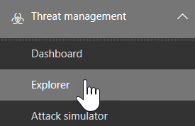
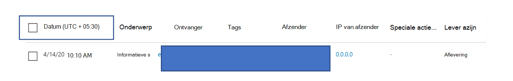

# Bedreigingsverkenner en realtime detecties

**Van toepassing op**
- [Abonnement 1 en abonnement 2 voor Microsoft Defender voor Office 365](office-365-atp.md)
- [Microsoft 365 Defender](../mtp/microsoft-threat-protection.md)

Als uw organisatie beschikt over Microsoft Defender voor [Office 365](office-365-atp.md)en u over de benodigde machtigingen [beschikt,](#required-licenses-and-permissions)beschikt u over **Explorer-** of **realtimedetecties** (voorheen *realtimerapporten)* om te zien wat er nieuw [is](#new-features-in-threat-explorer-and-real-time-detections)!). Ga in het & compliancecentrum naar Bedreigingsbeheer en kies **Verkenner**  of **Realtime detecties.**

|Met Microsoft Defender voor Office 365 Plan 2 ziet u:|Met Microsoft Defender voor Office 365 Abonnement 1 ziet u:|
|---|---|
|||
|

Met Explorer of realtime detecties kan het team van beveiligingsbewerkingen de bedreigingen efficiënt onderzoeken en beantwoorden. Het rapport lijkt op de volgende afbeelding:

Met dit rapport kunt u het volgende doen:

- [Malware bekijken die wordt gedetecteerd door beveiligingsfuncties van Microsoft 365](#see-malware-detected-in-email-by-technology)
- [Phishing-URL weergeven en op gegevens klikken](#view-phishing-url-and-click-verdict-data)
- [Een geautomatiseerd onderzoek en reactieproces starten vanuit een weergave in Verkenner](#start-automated-investigation-and-response) (alleen Defender voor Office 365-abonnement 2)
- [Schadelijke e-mail onderzoeken en meer](#more-ways-to-use-explorer-and-real-time-detections)

## Verbeteringen in Bedreigingsverkenner en realtime detecties

### Tags in Bedreigingsverkenner

> [!NOTE]
> De functie voor gebruikerstags is *beschikbaar* in voorbeeldweergave, is niet voor iedereen beschikbaar en kan worden gewijzigd. Bekijk de routekaart voor Microsoft 365 voor informatie over het releaseschema.

Met gebruikerslabels worden specifieke groepen gebruikers in Microsoft Defender voor Office 365 identificeert. Zie Gebruikerstags voor meer informatie over labels, waaronder licenties [en configuratie.](user-tags.md)

In Bedreigingsverkenner vindt u informatie over gebruikerstags in de volgende ervaringen.

#### E-mailrasterweergave

De **kolom Labels** in het e-mailraster bevat alle tags die zijn toegepast op de postvakken van de afzender of geadresseerde. Standaard worden systeemcodes zoals prioriteitsaccounts als eerste weergegeven.

> [!div class="mx-imgBorder"]
> 

#### Filteren

U kunt tags gebruiken als filter. Alleen op prioriteitsaccounts of specifieke scenario's met gebruikerstags zoeken. U kunt ook resultaten met bepaalde tags uitsluiten. Combineer deze functionaliteit met andere filters om het bereik van onderzoek te beperken.

> [!div class="mx-imgBorder"]
> 

#### Flyout met e-maildetails
Als u de afzonderlijke tags voor afzender en geadresseerde wilt weergeven, selecteert u het onderwerp om de flyout met berichtgegevens te openen. Op het **tabblad** Overzicht worden de tags voor afzender en geadresseerde afzonderlijk weergegeven, als deze aanwezig zijn voor een e-mailbericht.
De informatie over afzonderlijke tags voor afzender en geadresseerde geldt ook voor geëxporteerde CSV-gegevens, waar u deze details in twee aparte kolommen kunt zien.

> [!div class="mx-imgBorder"]
> 

Informatie over tags wordt ook weergegeven in de URL-klikken op de flyout. Als u de url wilt bekijken, gaat u naar de weergave Phish of Alle e-mail en gaat u vervolgens naar het **tabblad** **URL's of URL-klikken.** Selecteer een afzonderlijke URL-flyout voor meer informatie over klikken voor die URL, inclusief de tags die zijn gekoppeld aan die klik.

> [!div class="mx-imgBorder"]
> 

## Verbeteringen in de bedreigingszoeken -ervaring (binnenkort)

### Bijgewerkte bedreigingsgegevens voor e-mailberichten

We hebben ons gericht op verbeteringen in platform- en gegevenskwaliteit om de nauwkeurigheid en consistentie van gegevens voor e-mailrecords te vergroten. Verbeteringen omvatten de samenvoeging van gegevens vóór bezorging en na bezorging, zoals acties die worden uitgevoerd op een e-mailbericht als onderdeel van het ZAP-proces, in één record. Aanvullende details, zoals spamspaming, bedreigingen op entiteitsniveau (bijvoorbeeld welke URL schadelijk was) en de meest recente bezorgingslocaties worden ook opgenomen.

Na deze updates ziet u één item voor elk bericht, ongeacht de verschillende gebeurtenissen na bezorging die van invloed zijn op het bericht. Acties kunnen BESTAAN uit ZAP, handmatig herstel (wat betekent dat beheerdersacties hebben), dynamische bezorging, en meer.

Naast het weergeven van malware en phishing-bedreigingen, ziet u dat de spamspam aan een e-mailbericht is gekoppeld. Bekijk in de e-mail alle bedreigingen die aan het e-mailbericht zijn gekoppeld, samen met de bijbehorende detectietechnologieën. Een e-mailbericht kan nul, één of meerdere bedreigingen hebben. U ziet de huidige bedreigingen in de **sectie Details** van de e-mail flyout. Voor meerdere bedreigingen (zoals malware  en phishing) toont het technische veld Detectie de toewijzing van bedreigingsdetectie, wat de detectietechnologie is waarmee de bedreiging is geïdentificeerd.

De set detectietechnologieën bevat nu nieuwe detectiemethoden en technologieën voor spamdetectie. U kunt dezelfde set detectietechnologieën gebruiken om de resultaten te filteren in de verschillende e-mailweergaven (Malware, Phish, Alle e-mail).

> [!NOTE]
> Een analyse van een analyse van een analyse is mogelijk niet per se gekoppeld aan entiteiten. Een e-mail kan bijvoorbeeld worden geclassificeerd als phish of spam, maar er zijn geen URL's met een stempel met een phish-/spam-spamspam. Dit komt doordat met de filters ook inhoud en andere details voor een e-mailbericht worden geëvalueerd voordat u een evaluatie toewijst.

#### Bedreigingen in URL's

U kunt nu de specifieke bedreiging voor een  URL zien op het tabblad Details van de e-mail flyout. Het risico kan *malware,* *phish,* *spam* of *geen zijn.)*

> [!div class="mx-imgBorder"]
> 

### Bijgewerkte tijdlijnweergave (eerstvolgend)

> [!div class="mx-imgBorder"]
> 

In de tijdlijnweergave worden alle bezorgings- en bezorgingsgebeurtenissen geïdentificeerd. Deze bevat informatie over de bedreiging die op dat moment voor een subset van deze gebeurtenissen is geïdentificeerd. De tijdlijnweergave bevat ook informatie over eventuele aanvullende acties die zijn ondernomen (zoals ZAP of handmatige herstel), samen met het resultaat van die actie. Tijdlijnweergavegegevens zijn:

- **Bron:** Bron van de gebeurtenis. Dit kan beheerder/systeem/gebruiker zijn.
- **Gebeurtenis:** Omvat gebeurtenissen op het hoogste niveau, zoals oorspronkelijke bezorging, handmatig herstel, ZAP, inzendingen en dynamische bezorging.
- **Actie:** De specifieke actie die is ondernomen als onderdeel van ZAP of als beheerder (bijvoorbeeld soft delete).
- **Bedreigingen:** Bestrijkt de bedreigingen (malware, phish, spam) die op dat moment zijn geïdentificeerd.
- **Resultaat/details:** Meer informatie over het resultaat van de actie, bijvoorbeeld of de actie is uitgevoerd als onderdeel van ZAP/admin.

### Oorspronkelijke en meest recente bezorgingslocatie

Momenteel geven we de bezorgingslocatie weer in het e-mailraster en de flyout voor e-mail. De **naam van het** veld Bezorgingslocatie wordt gewijzigd in Oorspronkelijke **_bezorgingslocatie_*_. En we introduceren een ander veld, _*_Nieuwste bezorgingslocatie._**

**De oorspronkelijke bezorgingslocatie** geeft meer informatie over waar een e-mail in eerste instantie is bezorgd. **De meest recente** bezorgingslocatie geeft aan waar een e-mail wordt bezorgd na systeemacties zoals *ZAP* of beheeracties zoals *Verplaatsen naar verwijderde items.* De meest recente bezorgingslocatie is bedoeld om de laatst bekende locatie van het bericht na de bezorging aan beheerders te vertellen, of via eventuele systeem-/beheerdersacties. De e-mail bevat geen acties voor eindgebruikers. Als een gebruiker bijvoorbeeld een bericht heeft verwijderd of naar een archief of pst-bericht heeft verplaatst, wordt de bezorgingslocatie van het bericht niet bijgewerkt. Maar als de locatie door een systeemactie is bijgewerkt (bijvoorbeeld zap waardoor een e-mailbericht in quarantaine wordt **geplaatst),** wordt de meest recente bezorgingslocatie als 'quarantaine' gezien.

> [!div class="mx-imgBorder"]
> 

> [!NOTE]
> Er zijn een paar gevallen waarin **de bezorgingslocatie** **en** de bezorgingsactie als 'onbekend' kunnen worden gebruikt:
>
> - Mogelijk ziet  u de bezorgingslocatie als 'bezorgd' en 'onbekende' bezorgingslocatie als het bericht is bezorgd, maar met een regel voor het Postvak IN is het bericht verplaatst naar een standaardmap (zoals Concept of Archief) in plaats van naar de map Postvak IN of Ongewenste e-mail. 
>
> - **De meest recente** bezorgingslocatie kan onbekend zijn als een actie door een beheerder/systeem (zoals ZAP) is geprobeerd, maar het bericht niet is gevonden. Meestal gebeurt de actie nadat de gebruiker het bericht heeft verplaatst of verwijderd. In dergelijke gevallen controleert u de **kolom Resultaat/Details** in de tijdlijnweergave. Zoek de instructie 'Bericht is verplaatst of verwijderd door de gebruiker'.

> [!div class="mx-imgBorder"]
> 

### Aanvullende acties

*Er zijn extra* acties toegepast na bezorging van de e-mail. Dit kunnen *zap,* handmatig herstel *(actie* van een beheerder zoals soft *delete),* dynamische bezorging en *herprocessed* zijn (voor een e-mail die met terugwerkende kracht is gedetecteerd als goed).

> [!NOTE]
> - Als onderdeel van de wijzigingen die in behandeling zijn, zal de waarde "Removed by ZAP" (Verwijderd door ZAP) die momenteel in het filter Delivery Action wordt gebruikt, verdwijnen. U kunt zoeken naar alle e-mailberichten met de poging van ZAP via **Aanvullende acties.**
>
> - Er komen nieuwe velden en waarden voor **detectietechnologieën** en **aanvullende acties** (met name voor ZAP-scenario's). U moet uw bestaande opgeslagen query's en bij te houden query's evalueren om ervoor te zorgen dat deze met de nieuwe waarden werken.

> [!div class="mx-imgBorder"]

> 

### Systeem overschrijven

*Bij overschrijven kunt* u een uitzondering maken op de beoogde bezorgingslocatie van een bericht. U overschrijven de leveringslocatie die door het systeem wordt aangeboden op basis van de bedreigingen en andere detecties die door de filterstack worden geïdentificeerd. Systeem overschrijven kan worden ingesteld via tenant- of gebruikersbeleid om het bericht te bezorgen zoals voorgesteld door het beleid. Bij overschrijven kan onbedoelde bezorging van schadelijke berichten worden vastgesteld vanwege een hiaten in de configuratie, zoals een te ruim beleid voor veilige afzenders dat door een gebruiker is ingesteld. Deze waarden kunnen de volgende waarden overschrijven:

- Toegestaan door gebruikersbeleid: een gebruiker maakt beleid op postvakniveau zodat domeinen of afzenders worden toegestaan.
- Geblokkeerd door gebruikersbeleid: een gebruiker maakt beleid op het niveau van een e-mailvak om domeinen of afzenders te blokkeren.
- Toegestaan volgens organisatiebeleid: de beveiligingsteams van de organisatie stellen beleidsregels of Exchange-regels voor de e-mailstroom (ook wel transportregels genoemd) in om afzenders en domeinen toe te staan voor gebruikers in de organisatie. Dit kan voor een groep gebruikers of voor de hele organisatie zijn.
- Geblokkeerd op basis van organisatiebeleid: de beveiligingsteams van de organisatie stellen beleid of regels voor de e-mailstroom in om afzenders, domeinen, berichttalen of bron-EP's voor gebruikers in de organisatie te blokkeren. Dit kan worden toegepast op een groep gebruikers of de hele organisatie.
- Bestandsextensie geblokkeerd door organisatiebeleid: het beveiligingsteam van een organisatie blokkeert een bestandsnaamextensie via de antimalwarebeleidsinstellingen. Deze waarden worden nu weergegeven in e-maildetails om u te helpen bij onderzoeken. Secops-teams kunnen ook gebruikmaken van uitgebreide filtermogelijkheden om te filteren op geblokkeerde bestandsextensies.

> [!div class="mx-imgBorder"]
> 

### Verbeteringen voor de URL- en klikkenervaring

De verbeteringen zijn:

- De volledige geklikte URL (inclusief queryparameters die  deel uitmaken van de URL) in de sectie Klikken van de URL-flyout tonen. Het URL-domein en -pad worden op dit moment weergegeven in de titelbalk. We breiden deze informatie uit om de volledige URL weer te geven.

- Oplossingen voor URL-filters *(URL* versus *URL-domein* versus *URL-domein en* pad): De updates zijn van invloed op het zoeken naar berichten die een URL/klik bevatten. Er is ondersteuning ingeschakeld voor zoekopdrachten met een protocol-agnostic, zodat u naar een URL kunt zoeken zonder deze te `http` gebruiken. De zoekfunctie voor URL's wordt standaard aan http toebetaald, tenzij expliciet een andere waarde wordt opgegeven. Bijvoorbeeld:

   -  Zoek met en zonder het `http://` voorvoegsel in de **velden URL,** **URL-domein** en **URL-domein en padfilter.** De zoekopdrachten moeten dezelfde resultaten tonen.

   -  Zoek het `https://` voorvoegsel in **URL.** Als er geen waarde wordt opgegeven, wordt `http://` uitgegaan van het voorvoegsel.

   - `/`aan het begin en einde van het URL-pad, **url-domein,** **URL-domein en padvelden** wordt genegeerd. `/` aan het einde van het **veld URL** wordt genegeerd.

### Niveau van phish-betrouwbaarheid

Met het niveau van phish-betrouwbaarheid kunt u zien in welke mate een e-mailbericht als 'phish' is gecategoriseerd. De twee mogelijke waarden zijn *Hoog* en *Normaal.* In de beginfasen is dit filter alleen beschikbaar in de phish-weergave van Bedreigingsverkenner.

### ZAP URL-signaal

Het ZAP URL-signaal wordt meestal gebruikt voor ZAP Phish-waarschuwingsscenario's waarbij een e-mailbericht is geïdentificeerd als Phish en na bezorging is verwijderd. Dit signaal verbindt de waarschuwing met de bijbehorende resultaten in Verkenner. Dit is een van de IOCs voor de waarschuwing.

Om het zoekproces te verbeteren, hebben we Bedreigingsverkenner en Realtime detecties bijgewerkt om de zoekervaring consistenter te maken. De wijzigingen worden hier beschreven:

- [Tijdzoneverbeteringen](#timezone-improvements)
- [Bijwerken tijdens het vernieuwingsproces](#update-in-the-refresh-process)
- [Inzoomen op grafiek om filters toe te voegen](#chart-drilldown-to-add-to-filters)
- [In updates van productinformatie](#in-product-information-updates)

### Filteren op gebruikerslabels

U kunt nu sorteren en filteren op systeemcodes of aangepaste gebruikerstags om snel het bereik van bedreigingen te begrijpen. Zie Gebruikerstags [voor meer informatie.](user-tags.md)

> [!IMPORTANT]
> Filteren en sorteren op gebruikerslabels wordt momenteel weergegeven in de openbare preview-versie. Deze functionaliteit kan aanzienlijk worden gewijzigd voordat deze in de handel wordt gebracht. Microsoft biedt geen garanties, uitdrukkelijk of impliciet, met betrekking tot de informatie die erover wordt verstrekt.

### Tijdzoneverbeteringen

U ziet de tijdzone voor de e-mailrecords in de portal en voor geëxporteerde gegevens. Het is zichtbaar in ervaringen zoals E-mailraster, Flyout Details, E-mailtijdlijn en Soortgelijke e-mailberichten, zodat de tijdzone voor de resultatenset duidelijk is.

> [!div class="mx-imgBorder"]
> 

### Bijwerken tijdens het vernieuwingsproces

Sommige gebruikers hebben opmerkingen over verwarring veroorzaakt door automatische vernieuwing (bijvoorbeeld wanneer u de datum wijzigt, de pagina wordt vernieuwd) en handmatig vernieuwen (voor andere filters). Het verwijderen van filters leidt ook tot automatisch vernieuwen. Als u filters wijzigt terwijl u de query wijzigt, kan dit leiden tot inconsistente zoekervaringen. Om deze problemen op te lossen, verplaatsen we naar een mechanisme voor handmatig filteren.

Vanuit het oogpunt van de ervaring kan de gebruiker het verschillende bereik van filters toepassen en verwijderen (van de filterset en -datum) en de knop Vernieuwen selecteren om de resultaten te filteren nadat ze de query hebben gedefinieerd. De knop Vernieuwen wordt nu ook benadrukt op het scherm. We hebben ook de gerelateerde knopinfo en documentatie in het product bijgewerkt.

> [!div class="mx-imgBorder"]
> 

### Inzoomen op grafiek om filters toe te voegen

U kunt nu legendawaarden grafieken maken om ze als filters toe te voegen. Selecteer de **knop** Vernieuwen om de resultaten te filteren.

> [!div class="mx-imgBorder"]
> 

### Updates van in-productinformatie

Extra details zijn nu beschikbaar in het product, zoals het totale aantal zoekresultaten in het raster (zie hieronder). Labels, foutberichten en knopinfo zijn verbeterd, voor meer informatie over de filters, zoekervaring en resultatenset.

> [!div class="mx-imgBorder"]
> 

## Uitgebreide mogelijkheden in Bedreigingsverkenner

### Belangrijkste gerichte gebruikers

Vandaag wordt de lijst met de meest betrokken gebruikers weergegeven in de weergave Malware voor e-mailberichten, in de **sectie Top Malware Families.** Deze weergave wordt ook uitgebreid in de weergaven Phish en Alle e-mail. U kunt de vijf belangrijkste gerichte gebruikers zien, samen met het aantal pogingen voor elke gebruiker voor de bijbehorende weergave. In de weergave Phish ziet u bijvoorbeeld het aantal Phish-pogingen.

U kunt de lijst met gerichte gebruikers exporteren, tot een limiet van 3000, samen met het aantal pogingen voor offlineanalyse voor elke e-mailweergave. Bovendien wordt met het selecteren van het aantal pogingen (bijvoorbeeld 13 pogingen in de onderstaande afbeelding) een gefilterde weergave geopend in Bedreigingsverkenner, zodat u meer details kunt zien over e-mailberichten en bedreigingen voor die gebruiker.

> [!div class="mx-imgBorder"]
> 

### Exchange-transportregels

Als onderdeel van gegevensverrijking kunt u alle verschillende Exchange-transportregels (ETR) zien die zijn toegepast op een bericht. Deze informatie is beschikbaar in de weergave E-mailraster. Als u deze wilt weergeven, **selecteert u kolomopties** in het raster en voegt u **vervolgens Exchange-transportregel toe** vanuit de kolomopties. Het is ook zichtbaar op de **flyout Details** in de e-mail.

U kunt zowel de GUID als de naam zien van de transportregels die zijn toegepast op het bericht. U kunt de berichten zoeken op basis van de naam van de transportregel. Dit is een zoekopdracht 'Bevat', wat betekent dat u ook gedeeltelijke zoekopdrachten kunt doen.

#### Belangrijke opmerking:

De beschikbaarheid van ETR-zoekopdrachten en -namen is afhankelijk van de specifieke rol die aan u is toegewezen. U moet een van de volgende rollen/machtigingen hebben om de ETR-namen weer te geven en te zoeken. Als u geen van deze rollen hebt toegewezen, kunt u de namen van de transportregels niet zien of berichten zoeken met ETR-namen. U kunt echter wel de ETR-label- en GUID-gegevens in de e-maildetails zien. Andere ervaringen voor het weergeven van records in e-mailrasters, flyouts voor e-mail, filters en exporteren worden niet beïnvloed.

- EXO Only - Preventie van gegevensverlies: Alles
- EXO Only - O365SupportViewConfig: All
- Microsoft Azure Active Directory of EXO - Beveiligingsbeheerder: Alles
- AAD of EXO - Beveiligingslezer: Alles
- EXO Only - Transportregels: Alle
- EXO Only - View-Only Configuration: All

In het e-mailraster, de flyout Details en het geëxporteerde CSV-bestand krijgen de ETR's een naam/GUID te zien, zoals hieronder wordt weergegeven.

> [!div class="mx-imgBorder"]
> 

### Binnenkomende connectors

Connectors zijn een verzameling instructies die aanpassen hoe uw e-mail van en naar uw Microsoft 365- of Office 365-organisatie wordt verzonden. Hiermee kunt u eventuele beveiligingsbeperkingen of besturingselementen toepassen. In Bedreigingsverkenner kunt u nu de connectors bekijken die zijn gerelateerd aan een e-mailbericht en e-mailberichten zoeken met behulp van namen van connectors.

Het zoeken naar connectors is 'bevat' in de natuur, wat betekent dat zoekopdrachten met gedeeltelijke trefwoorden ook moeten werken. In de hoofdrasterweergave, de flyout Details en de geëxporteerde CSV worden de verbindingslijnen weergegeven in de indeling Naam/GUID, zoals hier wordt weergegeven:

> [!div class="mx-imgBorder"]
> 

## Nieuwe functies in Bedreigingsverkenner en realtime detecties

Er zijn drie nieuwe functies beschikbaar in Bedreigingsverkenner en realtime detecties:

- [Voorbeeld van e-mailkoptekst bekijken en hoofdtekst van e-mail downloaden](#preview-email-header-and-download-email-body)
- [Tijdlijn via e-mail](#email-timeline)
- [Klik op Gegevens voor het exporteren van URL](#export-url-click-data)

Deze nieuwe functies worden hieronder beschreven.

### Voorbeeld van e-mailkoptekst bekijken en hoofdtekst van e-mail downloaden

U kunt nu een voorbeeld van een e-mailkop bekijken en de hoofdtekst van de e-mail downloaden in Bedreigingsverkenner Beheerders kunnen gedownloade kopteksten/e-mailberichten voor bedreigingen analyseren. Omdat het downloaden van e-mailberichten de blootstelling van informatie kan risico's met zich mee brengen, wordt dit proces bepaald door toegangsbeheer op basis van rollen. Een nieuwe rol, *Preview,* moet worden toegevoegd aan een andere rollengroep (zoals Beveiligingsbewerkingen of Beveiligingsbeheerder) om de mogelijkheid te bieden e-mailberichten te downloaden in de weergave Alle e-mailberichten. Voor het weergeven van de e-mailkoptekst is echter geen extra rol vereist (anders dan is vereist voor het weergeven van berichten in Bedreigingsverkenner).

Explorer en realtime detecties krijgen ook nieuwe velden die een vollediger beeld geven van waar uw e-mailberichten terecht komen. Deze wijzigingen maken het zoeken naar beveiligings-ops eenvoudiger. Maar het belangrijkste resultaat is dat u in één oogopslag de locatie weet van probleem-e-mailberichten.

Hoe wordt dit gedaan? De bezorgingsstatus is nu onderverdeeld in twee kolommen:

- **Bezorgingsactie** : status van het e-mailbericht.
- **Bezorgingslocatie:** waar de e-mail is gerouteerd.

*Bezorgingsactie* is de actie die wordt ondernomen op een e-mail vanwege bestaand beleid of detecties. Dit zijn de mogelijke acties voor een e-mailbericht:

|Geleverd|Ongewenste e-mail|Geblokkeerd|Vervangen|
|---|---|---|---|
|E-mail is bezorgd in het Postvak IN of de map van een gebruiker, en de gebruiker kan deze openen.|E-mail is verzonden naar de map Ongewenste e-mail of Verwijderd van de gebruiker en de gebruiker kan deze openen.|E-mailberichten die in quarantaine zijn geplaatst, die zijn mislukt of die zijn geplaatst. Deze e-mailberichten zijn niet toegankelijk voor de gebruiker.|In e-mailberichten zijn schadelijke bijlagen vervangen door TXT-bestanden waarin staat dat de bijlage schadelijk is.|

Dit is wat de gebruiker wel en niet kan zien:

|Toegankelijk voor eindgebruikers|Niet toegankelijk voor eindgebruikers|
|---|---|
|Geleverd|Geblokkeerd|
|Ongewenste e-mail|Vervangen|

**Bezorgingslocatie** bevat de resultaten van beleidsregels en detecties die na de bezorging worden uitgevoerd. De actie is gekoppeld aan **_de bezorgingsactie._** Dit zijn de mogelijke waarden:

- *Postvak IN of map:* De e-mail staat in het Postvak IN of in een map (volgens uw e-mailregels).
- *On-premises of extern:* het postvak bestaat niet in de cloud, maar is on-premises.
- *Map Ongewenste* e-mail: de e-mail staat in de map Ongewenste e-mail van een gebruiker.
- *Map Verwijderde items:* De e-mail in de map Verwijderde items van een gebruiker.
- *Quarantaine:* Het e-mailbericht wordt in quarantaine geplaatst en niet in het postvak van een gebruiker.
- *Mislukt:* het e-mailbericht kan niet in het postvak worden bereikt.
- *Afgekapt:* de e-mail is ergens verloren gegaan in de e-mailstroom.

### Tijdlijn via e-mail

De **e-mailtijdlijn** is een nieuwe Verkenner-functie waarmee beheerders beter kunnen zoeken. Het knipt de tijd die is besteed aan het controleren van verschillende locaties om te proberen de gebeurtenis te begrijpen. Wanneer er meerdere gebeurtenissen plaatsvinden op of dicht bij hetzelfde tijdstip waarop een e-mailbericht binnenkomt, worden deze gebeurtenissen weergegeven in een tijdlijnweergave. Sommige gebeurtenissen die na de bezorging van uw e-mail plaatsvinden, worden vastgelegd in de **kolom** Speciale actie. Beheerders kunnen informatie uit de tijdlijn combineren met de speciale actie die is ondernomen voor de postbezorging van e-mail om inzicht te krijgen in hoe hun beleid werkt, waar het e-mailbericht uiteindelijk is doorgestuurd en, in sommige gevallen, wat de uiteindelijke evaluatie was.

Zie Onderzoeken en herstellen van schadelijke e-mail die is bezorgd [in Office 365](investigate-malicious-email-that-was-delivered.md)voor meer informatie.

### Klik op Gegevens voor het exporteren van URL

U kunt nu rapporten voor URL-klikken  exporteren naar Microsoft Excel om hun netwerkbericht-id weer te geven en op het bericht klikken **om** uit te leggen waar uw URL op het verkeer afkomstig is. Dit werkt als volgt: In Threat Management op de werkbalk Snel starten van Office 365 volgt u deze keten:

**Verkenner** \> **Phish weergeven** \> **Klikken** \> **Top-URL's** of **URL-topklikken** \> selecteer een record om de URL-flyout te openen.

Wanneer u een URL in de lijst selecteert, ziet u een nieuwe **knop Exporteren** in het fly-outvenster. Gebruik deze knop om gegevens te verplaatsen naar een Excel-spreadsheet, voor een eenvoudigere rapportage.

Volg dit pad om naar dezelfde locatie te gaan in het rapport Realtime detecties:

**Verkenner** \> **Realtime detecties** \> **Phish weergeven** \> **URL's** \> **Top-URL's** of **topklikken** \> Selecteer een record om de URL-flyout te openen en naar het tabblad Klikken \> **te** navigeren.

> [!TIP]
> Met de netwerkbericht-id wordt de klik teruggeklikt naar specifieke e-mailberichten wanneer u op de id zoekt via Explorer of de bijbehorende hulpprogramma's van derden. Dergelijke zoekopdrachten identificeren het e-mailbericht dat is gekoppeld aan een klikresultaat. Als u de correlatie-netwerkbericht-id hebt, is dit een snellere en krachtigere analyse.

> [!div class="mx-imgBorder"]
> 

## Malware zien die via technologie in e-mail is gedetecteerd

Stel dat u malware wilt aangetroffen in e-mail die is gesorteerd op Microsoft 365-technologie. Gebruik hiervoor de weergave E-> [Malware](threat-explorer-views.md#email--malware) in Verkenner (of realtime detecties).

1. Kies in het & Compliancecentrum ( ) de optie <https://protection.office.com> **Bedreigingsbeheerverkenner** \>  (of **realtime detecties).** (In dit voorbeeld wordt Explorer gebruikt.)

2. Kies **E-mailmalware** in **het** \> **menu Beeld.**

   > [!div class="mx-imgBorder"]
   > 

3. Klik **op Afzender** en kies **basisdetectietechnologie.** \> 

   Uw detectietechnologieën zijn nu beschikbaar als filters voor het rapport.

   > [!div class="mx-imgBorder"]
   > 

4. Kies een optie. Selecteer vervolgens de **knop Vernieuwen** om dat filter toe te passen.

   > [!div class="mx-imgBorder"]
   > 

Het rapport wordt vernieuwd met de resultaten die malware heeft gedetecteerd in e-mail, met behulp van de technologieoptie die u hebt geselecteerd. Van hier uit kunt u verdere analyse uitvoeren.

## Phishing-URL weergeven en op gegevens klikken

Stel dat u phishingpogingen via URL's in e-mailberichten wilt zien, inclusief een lijst met URL's die zijn toegestaan, geblokkeerd en overschrijven. Als u wilt weten op  welke URL's is geklikt, moeten veilige koppelingen zijn geconfigureerd. Zorg ervoor dat u [beleidsregels](set-up-atp-safe-links-policies.md) voor veilige koppelingen in te stellen voor de time-of-click-beveiliging en de logboekregistratie van klik-van-klik-s via veilige koppelingen.

Als u phish-URL's in berichten wilt bekijken en op URL's in [   >  **phish-berichten**](threat-explorer-views.md#email--phish) wilt klikken, gebruikt u de weergave E-mail phish van Explorer of realtime detecties.

1. Kies in het & Compliancecentrum ( ) de optie <https://protection.office.com> **Bedreigingsbeheerverkenner** \>  (of **realtime detecties).** (In dit voorbeeld wordt Explorer gebruikt.)

2. Kies **In** het menu Beeld de optie **E-mail** \> **phish.**

   > [!div class="mx-imgBorder"]
   > 

3. Klik **op Afzender** en kies **URL's Klik** op \> **geadresseerde.**

4. Selecteer een of meer opties, zoals Overschrijven geblokkeerd en  Geblokkeerd, en selecteer vervolgens de knop Vernieuwen op dezelfde regel als de opties om dat filter toe te passen.  (Vernieuw het browservenster niet.)

   > [!div class="mx-imgBorder"]
   > 

   Het rapport wordt vernieuwd en er worden twee verschillende URL-tabellen weergegeven op het tabblad URL onder het rapport:

   - **De belangrijkste URL's** zijn de URL's in de berichten die u hebt gefilterd en de actie voor e-mailbezorging telt voor elke URL. In de e-mailweergave Phish bevat deze lijst meestal legitieme URL's. Kwaadwillende gebruikers bevatten een combinatie van goede en slechte URL's in hun berichten om ze te bezorgen, maar ze maken de schadelijke koppelingen interessanter. De tabel met URL's wordt gesorteerd op totale aantal e-mailberichten, maar deze kolom is verborgen om de weergave te vereenvoudigen.

   - **De belangrijkste klikken** zijn de URL's met veilige koppelingen waarin is geklikt, gesorteerd op totale aantal klikken. Deze kolom wordt ook niet weergegeven, om de weergave te vereenvoudigen. Het totale aantal per kolom geeft aan dat het aantal klik op veilige koppelingen voor elke geklikte URL wordt geteld. In de e-mailweergave Phish zijn dit meestal verdachte of schadelijke URL's. Maar de weergave kan URL's bevatten die geen bedreigingen zijn, maar in phish-berichten staan. URL-klikken op niet-appe koppelingen worden hier niet weergegeven.

   In de twee URL-tabellen worden de belangrijkste URL's in phishing-e-mailberichten weergegeven op bezorgingsactie en -locatie. In de tabellen worden URL-klikken weergegeven die ondanks een waarschuwing zijn geblokkeerd of bezocht, zodat u kunt zien welke potentiële slechte koppelingen er aan gebruikers zijn gepresenteerd en of de gebruiker erop heeft geklikt. Van hier uit kunt u verdere analyse uitvoeren. Onder de grafiek ziet u bijvoorbeeld de bovenste URL's in e-mailberichten die in de omgeving van uw organisatie zijn geblokkeerd.

   > [!div class="mx-imgBorder"]
   > 

   Selecteer een URL om meer gedetailleerde informatie weer te geven.

   > [!NOTE]
   > In het dialoogvenster URL-flyout wordt het filteren op e-mailberichten verwijderd, om de volledige weergave van de blootstelling van de URL in uw omgeving weer te geven. Hiermee kunt u filteren op e-mailberichten die u bezorgd bent in Verkenner, specifieke URL's zoeken die mogelijke bedreigingen zijn en vervolgens meer inzicht krijgen in de blootstelling van URL's in uw omgeving (via het dialoogvenster URL-details) zonder dat u URL-filters aan de Verkenner-weergave zelf moet toevoegen.

### Interpretatie van klik-10-bekentingen

In de flyouts voor e-mailberichten of URL's, topklikken en onze filterervaringen ziet u verschillende waarden voor klikwaarden:

- **Geen:** Kan het bericht over de URL niet vastleggen. De gebruiker kan door de URL hebben geklikt.
- **Toegestaan:** De gebruiker mag naar de URL navigeren.
- **Geblokkeerd:** De gebruiker is geblokkeerd voor het navigeren naar de URL.
- **In behandeling:** De gebruiker heeft de pagina met een detonatie in behandeling weergegeven.
- **Geblokkeerde overschrijven:** De gebruiker is geblokkeerd voor het rechtstreeks navigeren naar de URL. Maar de gebruiker heeft het blok te veel in gebruik om naar de URL te navigeren.
- **Wachtende op een aanvraag omzeild:** De gebruiker krijgt de onttoningspagina te zien. Maar de gebruiker heeft het bericht niet meer nodig om toegang te krijgen tot de URL.
- **Fout:** De gebruiker krijgt de foutpagina te zien of er is een fout opgetreden bij het vastleggen van de fout.
- **Fout:** Er is een onbekende uitzondering opgetreden tijdens het vastleggen van de film. De gebruiker heeft mogelijk door de URL geklikt.

## E-mailberichten bekijken die door gebruikers zijn gerapporteerd

Stel dat u e-mailberichten wilt zien die gebruikers in uw organisatie hebben gerapporteerd als Ongewenste e-mail, Geen ongewenste [e-mail](enable-the-report-message-add-in.md) of *Phishing* via de invoegapp Bericht rapporteren of de [invoegapp Phishing melden.](enable-the-report-phish-add-in.md) Als u ze wilt zien, gebruikt u de weergave [   >  **E-mailinzending**](threat-explorer-views.md#email--submissions) van Explorer (of realtime detecties).

1. Kies in het & Compliancecentrum ( ) de optie <https://protection.office.com> **Bedreigingsbeheerverkenner** \>  (of **realtime detecties).** (In dit voorbeeld wordt Explorer gebruikt.)

2. Kies **E-mailinzending** in **het** menu \> **Beeld.**

   > [!div class="mx-imgBorder"]
   > 

3. Klik **op Afzender** en kies **Basisrapporttype.** \> 

4. Selecteer een optie, zoals **Phish,** en selecteer vervolgens de **knop** Vernieuwen.

   > [!div class="mx-imgBorder"]
   > 

Het rapport wordt vernieuwd om gegevens weer te geven over e-mailberichten die personen in uw organisatie als phishingpoging hebben gemeld. U kunt deze informatie gebruiken voor verdere analyse en indien nodig uw [anti-phishingbeleid aanpassen in Microsoft Defender voor Office 365.](configure-atp-anti-phishing-policies.md)

## Geautomatiseerd onderzoek en automatisch onderzoek starten

> [!NOTE]
> In Microsoft Defender voor *Office 365 Abonnement 2* en *Office 365 E5* zijn geautomatiseerde onderzoeks- en antwoordmogelijkheden beschikbaar.

[Geautomatiseerde onderzoeken en reactie kunnen](automated-investigation-response-office.md) uw teamtijd en inspanning voor beveiligingsactiviteiten besparen bij het onderzoeken en verminderen van cyberaanvallen. Naast het configureren van waarschuwingen die een beveiligings playbook kunnen activeren, kunt u een geautomatiseerd onderzoek en reactieproces starten vanuit een weergave in Verkenner. Zie voorbeeld voor meer [informatie: Een beveiligingsbeheerder activeert een onderzoek vanuit Verkenner.](automated-investigation-response-office.md#example-a-security-administrator-triggers-an-investigation-from-threat-explorer)

## Meer manieren om Explorer en realtime detecties te gebruiken

Naast de scenario's die in dit artikel worden beschreven, zijn er nog veel meer rapportageopties beschikbaar met Explorer (of realtime detecties). Zie de volgende artikelen:

- [Schadelijke e-mail zoeken en onderzoeken die is bezorgd](investigate-malicious-email-that-was-delivered.md)
- [Schadelijke bestanden weergeven die zijn gedetecteerd in SharePoint Online, OneDrive en Microsoft Teams](malicious-files-detected-in-spo-odb-or-teams.md)
- [Bekijk een overzicht van de weergaven in Bedreigingsverkenner (en realtime detecties)](threat-explorer-views.md)
- [Statusrapport bedreigingsbeveiliging](view-email-security-reports.md#threat-protection-status-report)
- [Automatisch onderzoek en antwoorden in Microsoft Threat Protection](../mtp/mtp-autoir.md)

## Vereiste licenties en machtigingen

U moet [Microsoft Defender voor Office 365 hebben om](office-365-atp.md) Explorer of realtime detecties te kunnen gebruiken.

- Explorer is inbegrepen in Defender voor Office 365 Abonnement 2.
- Het rapport Realtime detecties is opgenomen in Defender voor Office 365 Abonnement 1.
- Plan het toewijzen van licenties voor alle gebruikers die moeten worden beveiligd door Defender voor Office 365. Verkenner en realtime detecties tonen detectiegegevens voor gelicentieerde gebruikers.

Als u Verkenner of realtime detecties wilt weergeven en gebruiken, moet u over de juiste machtigingen vragen, zoals de machtigingen die zijn verleend aan een beveiligingsbeheerder of beveiligingslezer.

- Aan het & compliancecentrum voor beveiliging moet een van de volgende rollen zijn toegewezen:

  - Organisatiebeheer
  - Beveiligingsbeheerder (deze kan worden toegewezen in het Azure Active Directory-beheercentrum ( <https://aad.portal.azure.com> )
  - Beveiligingslezer

- Voor Exchange Online moet u een van de volgende rollen hebben toegewezen in het Exchange-beheercentrum () of <https://admin.protection.outlook.com/ecp/> [Exchange Online PowerShell:](https://docs.microsoft.com/powershell/exchange/exchange-online-powershell)

  - Organisatiebeheer
  - View-Only organisatiebeheer
  - View-Only geadresseerden
  - Compliancebeheer

Zie de volgende bronnen voor meer informatie over rollen en machtigingen:

- [Machtigingen in het Beveiligings- en compliancecentrum](permissions-in-the-security-and-compliance-center.md)
- [Functiemachtigingen in Exchange Online](https://docs.microsoft.com/exchange/permissions-exo/feature-permissions)

## Verschillen tussen Bedreigingsverkenner en realtime detecties

- Het *rapport Realtime detecties* is beschikbaar in Defender voor Office 365 Abonnement 1. *Bedreigingsverkenner* is beschikbaar in Defender voor Office 365 Abonnement 2.
- Met het rapport Realtime detecties kunt u detecties in realtime bekijken. Bedreigingsverkenner doet dit ook, maar biedt ook extra details voor een bepaalde aanval.
- De *weergave Alle* e-mail is beschikbaar in Bedreigingsverkenner, maar niet in het rapport Realtime detecties.
- Meer filtermogelijkheden en beschikbare acties zijn opgenomen in Bedreigingsverkenner. Zie de servicebeschrijving van Microsoft Defender voor Office 365 voor meer informatie: Beschikbaarheid van functies in Defender voor [Office 365-abonnementen.](https://docs.microsoft.com/office365/servicedescriptions/office-365-advanced-threat-protection-service-description#feature-availability-across-advanced-threat-protection-atp-plans)
