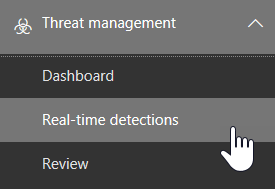

# Bedreigings Verkenner en real-time ontdekkenThreat Explorer and real-time detections

Als uw organisatie [office 365 Advanced Threat Protection](office-365-atp.md) (Office 365 ATP) heeft en u de [benodigde machtigingen](#required-licenses-and-permissions)hebt, hebt u de keuze uit de **Verkenner** of de **realtime** (voorheen *realtime-rapporten* ), [Zie wat is er nieuw](#new-features-in-threat-explorer-and-real-time-detections)!.If your organization has [Office 365 Advanced Threat Protection](office-365-atp.md) (Office 365 ATP), and you have the [necessary permissions](#required-licenses-and-permissions), you have either **Explorer** or **real-time detections** (formerly *real-time reports* — [see what's new](#new-features-in-threat-explorer-and-real-time-detections)!). Ga in het beveiligings & nalevings centrum naar **Threat Management**en kies vervolgens **Verkenner** _of_ **realtime-detecties**.In the Security & Compliance Center, go to **Threat management**, and then choose **Explorer** _or_ **Real-time detections**.

|Met ATP abonnement 2 ziet u het volgende:With ATP Plan 2, you see:|Met ATP abonnement 1 ziet u het volgende:With ATP Plan 1, you see:|
|---|---|
|||
|

Met de Verkenner (of realtime detectie) hebt u een krachtig rapport waarmee uw beveiligingsactiviteiten team op hun eigen en efficiënte manier kunnen onderzoeken en beantwoorden.With Explorer (or real-time detections), you have a powerful report that enables your Security Operations team to investigate and respond to threats effectively and efficiently. Het rapport is vergelijkbaar met de volgende afbeelding:The report resembles the following image:

Met dit rapport kunt u:With this report, you can:

- [Zie malware die door Microsoft 365 beveiligingsfuncties is gedetecteerd.See malware detected by Microsoft 365 security features](#see-malware-detected-in-email-by-technology)
- [Bekijk gegevens over phishingberichten en klik op VerdictView data about phishing URLs and click verdict](#view-data-about-phishing-urls-and-click-verdict)
- [Een automatisch onderzoek en antwoord proces starten vanuit een weergave in Verkenner (alleen voor het](#start-automated-investigation-and-response) ATP-abonnement 2)[Start an automated investigation and response process from a view in Explorer](#start-automated-investigation-and-response) (ATP Plan 2 only)
- ... [Onderzoek kwaadaardige e-mail en nog veel meer](#more-ways-to-use-explorer-or-real-time-detections).... [Investigate malicious email, and more](#more-ways-to-use-explorer-or-real-time-detections)!

## Ervaar verbeteringen in de weergave van de bedreiging en de real-time detectieExperience Improvements to Threat Explorer and Real-Time Detections

Als onderdeel van de verbetering van de jacht, hebben we enkele updates gemaakt voor de bedreigings Verkenner en de realtime detectie.As part of improving the hunting process, we have made a few updates to Threat Explorer and Real-Time Detections. Dit zijn de verbeteringen van de ervaring, met de focus op de beleving van de jacht consistent.These are ‘experience’ improvements, with the focus on making the hunting experience more consistent. Hieronder ziet u een overzicht van deze wijzigingen:These changes are outlined below:

- [Tijdzone verbeteringenTimezone improvements](#timezone-improvements)
- [Bijwerken in het vernieuwingsprocesUpdate in the Refresh process](#update-in-the-refresh-process)
- [DrillDown voor de grafiek om toe te voegen aan filtersChart drilldown to add to filters](#chart-drilldown-to-add-to-filters)
- [Updates voor productgegevensIn product information updates](#in-product-information-updates)

### Tijdzone verbeteringenTimezone improvements

We tonen de tijdzone voor de e-mail records binnen de portal en voor de geëxporteerde gegevens.We will show the timezone for the email records within the Portal, as well as for Exported data. De tijdzone is zichtbaar in functies zoals E-mail raster, Details flyout, e-mail tijdlijn en soortgelijke E-mail, zodat de tijdzone voor de resultatenset duidelijk is voor de gebruiker.The timezone will be visible across experiences like Email Grid, Details Flyout, Email Timeline, and Similar Emails, so that the timezone for the result set is clear to the user.

### Bijwerken in het vernieuwingsprocesUpdate in the Refresh process

We hebben uw feedback om verwarring met automatisch vernieuwen (bijvoorbeeld voor datum nadat u de datum hebt gewijzigd nadat u de pagina hebt gewijzigd) en handmatig vernieuwen (voor andere filters).We have heard feedback around confusion with automatic refresh (e.g. for date, as soon as you change the date, the page would refresh) and manual refresh (for other filters). Evenzo verwijdert filters potentiële klanten naar automatisch vernieuwen, dan wordt er een situatie waarbij het wijzigen van de verschillende filters tijdens het wijzigen van de query inconsistentie van de zoekfuncties kan veroorzaken.Similarly, removing filters leads to automatic refresh, this causes situations where changing the different filters while modifying the query can cause inconsistent search experiences. Om dit op te lossen, gaan we overstappen op een handmatig filtermechanisme.To solve this, we are moving to a manual filtering mechanism.
Vanuit het oogpunt van de ervaring kan de gebruiker een verschillend bereik van filters (uit de filtersset en datum) toepassen en verwijderen en vervolgens op de knop Vernieuwen klikken om de resultaten te filteren nadat deze zijn uitgevoerd met het definiëren van de query.From an experience standpoint, the user can apply and remove the different range of filters (from the filter set, and date), and press the refresh button to filter the results once they are done with defining the query. De knop Vernieuwen is ook bijgewerkt, zodat deze duidelijk op het scherm wordt weergegeven.The refresh button has also been updated to call it out clearly on the screen. We hebben ook Scherminfo en documentatie ter informatie bijgewerkt.We have also updated tooltips and in-product documentation around this change.

### DrillDown voor de grafiek om toe te voegen aan filtersChart drilldown to add to filters

U kunt nu op de waarden van de grafieklegenda klikken om deze waarde als een filter toe te voegen.You will now be able to click on the chart legend values to add that value as a filter. Houd er rekening mee dat u altijd op de knop Vernieuwen hoeft te klikken om de resultaten te filteren als onderdeel van de hierboven beschreven wijziging.Note that you will still have to click on the refresh button to filter the results as part of the change described above.

### Updates voor productgegevensIn product information updates

U moet ook aanvullende informatie binnen het product zien.You should also see additional details within the product. Bijvoorbeeld het totale aantal zoekresultaten in het raster (zie hieronder), en verbeteringen rond labels, foutberichten en Scherminfo, voor meer informatie over filters, zoekervaring en resultatensets.For example, the total number of search results within grid (see below), as well as improvements around labels, error messages and tooltips, to give more information around filters, search experience, and result set.

## Nieuwe functies in real-time ontdekkenNew features in real-time detections

## Nieuwe functies in de bedreigings Verkenner en de real-time detectieNew features in Threat Explorer and real-time detections

Drie nieuwe functies toegevoegd aan de bedreigings Verkenner en de real-time detecties:Three new features added into Threat Explorer and real-time detections:

- [Voorbeeld van e-mailkop tekstPreview email header and download email body](#preview-email-header-and-download-email-body)
- [E-mail tijdlijnEmail timeline](#email-timeline)
- [URL exporteren Klik op gegevensExport URL click data](#export-url-click-data)

Hieronder ziet u een overzicht van de nieuwe functies.These new features are outlined below.

### Voorbeeld van e-mailkop tekstPreview email header and download email body

De mogelijkheid om een voorbeeld van een e-mailbericht te bekijken en de tekst van het bericht te downloaden zijn nieuwe functies die beschikbaar zijn in de Threat ExplorerThe ability to preview an email header and download the email body are new features available in Threat Explorer. Beheerders kunnen gedownloade berichtkoppen/e-mailberichten analyseren voor bedreigingen.Admins will be able to analyze downloaded headers/email messages for threats. Aangezien het downloaden van e-mailberichten de blootstelling van gegevens kan betekenen, wordt dit proces bepaald door toegangsbeheer op basis van rollen.Because downloading email messages can risk the exposure of information, this process is controlled by roles-based access control (RBAC). Een nieuwe rol, *Preview*, moet worden toegevoegd aan een andere rolgroep (zoals beveiligingsactiviteiten of beveiligingsbeheerder) om de mogelijkheid om e-mailberichten te downloaden en voorbeelden van kopteksten weer te geven in de weergave alle e-mailberichten.A new role, *Preview*, must be added to another role group (such as Security Operations or Security Administrator) to grant the ability to download mails and preview headers in all-email messages view.

Maar in de Verkenner (en realtime-detectie) worden ook nieuwe velden toegevoegd waarmee u een beter beeld kunt krijgen van de locatie van uw e-mailberichten.But Explorer (and real-time detections) also adds fresh new fields designed to give you a more complete picture of where your email messages land. Onderdeel van het doel van deze wijziging is om de jacht eenvoudiger te maken voor mensen met een hoeveelheid werk, maar het resultaat van de e-mail is in één oogopslag de locatie van de problematische e-mailberichten.Part of the goal of this change is to make hunting easier for Security Ops people, but the net result is knowing the location of problem email messages at a glance.

Hoe is dit gebeurd?How is this done? De bezorgings status is nu uitgebroken in twee kolommen:Delivery Status is now broken out into two columns:

- **Bezorgings actie** : wat is de status van dit e-mailbericht?**Delivery Action** - What is the status of this email?
- **Bezorgingslocatie** : waar werd dit e-mailbericht rondgestuurd als resultaat?**Delivery Location** - Where was this email routed as a result?

De bezorgings actie is de actie die op een e-mail is uitgevoerd vanwege bestaande beleidsregels of detecties.Delivery Action is the action taken on an email due to existing policies or detections. Dit zijn de mogelijke acties waarmee een e-mail kan worden verzonden:Here are the possible actions an email can take:

|AfleveringDelivered|OngewenstJunked|BlokkeertBlocked|GekomenReplaced|
|---|---|---|---|
|E-mail is bezorgd in het postvak in of de map van een gebruiker en de gebruiker kan deze rechtstreeks openen.Email was delivered to Inbox or folder of a user and the user can directly access it.|E-mail verzonden naar de map Ongewenste E-mail van de gebruiker of de map die is verwijderd, en de gebruiker heeft toegang tot e-mailberichten in die mappen.Email was sent to either user’s Junk folder or Deleted folder, and the user has access to emails in those folders.|Alle e-mailberichten die zijn gequarantined, dat niet is gelukt of zijn verwijderd.Any emails that are quarantined, that  failed, or were dropped. Dit is helemaal niet toegankelijk voor de gebruiker.This is completely inaccessible by the user!|Alle e-mailberichten waarin schadelijke bijlagen worden vervangen door txt-bestanden die aangeven dat de bijlage schadelijk is.Any email where malicious attachments are replaced by .txt files that state the attachment was malicious.|

|AfleveringDelivered|OngewenstJunked|BlokkeertBlocked|GekomenReplaced|
|---|---|---|---|
|E-mail is bezorgd in het postvak in van de gebruiker of een andere map, en de gebruiker kan deze rechtstreeks openen.Email was delivered to the user's inbox or another folder, and the user can directly access it.|E-mail is verzonden naar de map Ongewenste E-mail van de gebruiker of de map die is verwijderd, en de gebruiker heeft toegang tot e-mailberichten in die mappen.Email was sent to either user's Junk folder or Deleted folder, and the user has access to email messages in those folders.|Alle e-mailberichten die zijn overgezet, die niet kunnen worden verwijderd en die niet toegankelijk zijn voor de gebruiker.Any email messages that are quarantined, that failed, or were dropped, and are not accessible by the user.|Alle e-mailberichten waarin schadelijke bijlagen zijn vervangen door txt-bestanden, waarbij de bijlage is beschadigd.Any email messages where malicious attachments were replaced by .txt files that state the attachments were malicious.|
|

En wat ze niet kan zien en wat ze niet kan doen:And here is what the user can see, and what they can't:

|Toegankelijk voor eindgebruikersAccessible to end users|Niet toegankelijk voor eindgebruikersInaccessible to end users|
|---|---|
|AfleveringDelivered|BlokkeertBlocked|
|OngewenstJunked|GekomenReplaced|

Locatie van levering toont de resultaten van beleidsregels en detecties die na levering worden uitgevoerd.Delivery location shows the results of policies and detections that run post-delivery. Het is gekoppeld aan een bezorgings actie.It's linked to a Delivery Action. Dit veld is toegevoegd om inzicht te krijgen in de actie die optreedt wanneer er een probleem met de e-mail is gevonden.This field was added to give insight into the action taken when a problem mail is found. Dit zijn de mogelijke waarden van de lever locatie:Here are the possible values of delivery location:

- **Postvak in of map**: het e-mailbericht bevindt zich in het postvak in of een map (volgens uw e-mail regels).**Inbox or folder**: The email is in inbox or a folder (according to your email rules).
- **On-premises of extern**: het postvak bestaat niet in de Cloud, maar is on-premises.**On-prem or external**: The mailbox doesn't exist on cloud but is on-premises.
- **Map Ongewenste e-mail**: de e-mail bevindt zich in de map Ongewenste e-mail van een gebruiker.**Junk folder**: The email is in the Junk folder of a user.
- **Map Verwijderde items**: het e-mailbericht in de map Verwijderde items van een gebruiker.**Deleted items folder**: The email in the Deleted items folder of a user.
- **Quarantine**: het e-mailbericht in quarantaine, dat zich niet in het postvak van een gebruiker bevindt.**Quarantine**: The email in quarantine, and is not in a user's mailbox.
- **Mislukt**: het e-mailadres is niet bereikbaar voor het postvak.**Failed**: The email failed to reach the mailbox.
- **Neergezet**: de e-mail wordt ergens in de e-mail stroom verwijderd.**Dropped**: The email gets lost somewhere in the mail flow.

### E-mail tijdlijnEmail timeline

De **e-mail tijdlijn** is een andere nieuwe Explorer-functie, die bedoeld is voor een betere beleving van de jacht van de beheerder.The **Email Timeline** is another new Explorer feature aimed at making the hunting experience better for admins. Dit houdt in dat u een willekeurige functie uitvoert omdat er minder tijd is besteed aan het controleren van verschillende locaties om de gebeurtenis te leren kennen.It cuts down on randomization because there is less time spent checking different locations to try to understand the event. Wanneer meerdere gebeurtenissen plaatsvinden aan of sluiten op een e-mail, worden deze gebeurtenissen weergegeven in een tijdlijnweergave.When multiple events happen at, or close to, the same time on an email, those events will show up in a timeline view. In werkelijkheid worden bepaalde gebeurtenissen die plaatsvinden na levering van uw e-mail, vastgelegd in de kolom ' speciale actie '.In fact, some events that happen post-delivery to your mail will be captured in the 'Special action' column. Als u de gegevens van de tijdlijn van dat e-mailbericht combineert met de speciale actie die u hebt uitgevoerd voor de bezorging van e-mail, geven beheerders beheerders inzicht in hoe hun beleidsregels werken, waarbij de e-mail uiteindelijk is gerouteerd, en in sommige gevallen, wat de laatste beoordeling was.Combining the information from the timeline of that mail with the special action taken on the mail post-delivery will give admins insight into how their policies work, where the mail was finally routed, and, in some cases, what the final assessment was.

Zie voor meer informatie over het onderzoeken van kwaadaardige e-mailberichten een [kwaadaardige e-mailbericht dat is bezorgd in Office 365](investigate-malicious-email-that-was-delivered.md).For more discussion about investigating malicious email messages, see [Investigate and remediate malicious email that was delivered in Office 365](investigate-malicious-email-that-was-delivered.md).

### URL exporteren Klik op gegevensExport URL click data

Daarnaast is het ook mogelijk om rapporten voor URL-klikken te exporteren naar Microsoft Excel, zodat u de netwerkbericht-ID kunt bekijken, en ze klikken op Verdict, zodat u kunt zien waar de URL op het verkeer verloopt.Also, you will now be able to export reports for URL clicks to Microsoft Excel in order to view both their Network Message ID, and their Click Verdict, making the task of understanding where your URL click traffic originated easier. Dit werkt als volgt:Here's how it works. Vanaf de werkbalk Snel starten van Office 365 kunt u op de volgende keten klikken:Starting in Threat Management on the Office 365 quick-launch, click through this chain:

**Verkenner** \> **Phishing** \> weergeven **Klikken op** \> **Belangrijkste url's of URL-klikken** \> **Klik op een record om de URL-flyout te openen****Explorer** \> **View Phish** \> **Clicks** \> **Top URLs or URL Top Clicks** \> **Click on any record to open URL flyout**

Wanneer u op een URL in de lijst klikt, ziet u in het deelvenster uitvullen een nieuwe knop exporteren.When you click on a URL in the list, you'll see a new Export button on the fly-out panel. Gebruik deze knop om gegevens te verplaatsen naar een Excel-spreadsheet, zodat u deze eenvoudiger kunt rapporteren.Use this button to move data to an Excel spreadsheet for easier reporting.

U kunt in het rapport realtime detecties de volgende keer naar dezelfde locatie gaan:You can get to the same location in the real-time detections report as follows:

**Verkenner** \> **Detectie** \> van realtime **Phishing** \> weergeven **Url's** \> **Belangrijkste url's of bovenste klikken** \> **Klik op een record om de URL-flyout** \> te openen **Ga naar het tabblad klikken.****Explorer** \> **Real-time Detections** \> **View Phish** \> **URLs** \> **Top URLs or Top Clicks** \> **Click on any record to open URL flyout** \> **Navigate to the Clicks Tab.**

> [!TIP]
> Netwerkbericht-ID Hiermee wijst u de Klik op terug naar specifieke e-mailberichten wanneer u in Verkenner of aan hulpmiddelen van een andere leverancier zoekt via netwerkbericht-ID.Network Message ID maps the click back to specific mails when you search through Explorer or associated 3rd party tools via Network Message ID. Door de netwerkbericht-ID te zoeken, leveren beheerders de specifieke e-mail die is gekoppeld aan een klik resultaat.Searching through the Network Message ID will give admins the specific email associated with a click result. Bij export met de correlatie-id van de netwerkbericht-ID is een snellere en krachtige analyse.On export having, the correlating identification of Network Message ID makes for quicker and more powerful analysis.

## Malware van de malware van een e-mail weergevenSee malware detected in email by technology

U wilt malware van de malware in een e-mail weergeven, door Microsoft 365-technologie.Suppose you want to see malware detected in email, by Microsoft 365 technology. Als u dit wilt doen, gebruikt u de [e-mail >](threat-explorer-views.md#email--malware) weergave voor malware van Explorer (of realtime gedetecteerde).To do this, use the [Email > Malware](threat-explorer-views.md#email--malware) view of Explorer (or real-time detections).

1. Kies in het beveiligings & conformiteitscentrum ( [https://protection.office.com](https://protection.office.com) ) de optie **Threat Management**  >  **Explorer** (of **realtime-detectie**).In the Security & Compliance Center ([https://protection.office.com](https://protection.office.com)), choose **Threat management** > **Explorer** (or **Real-time detections**). (In dit voorbeeld wordt Explorer gebruikt.)(This example uses Explorer.)

2. Kies in het menu **weergave** de optie **e-mail**  >  **malware**.In the **View** menu, choose **Email** > **Malware**.

   

3. Klik op **afzender**en kies vervolgens **Basic**  >  **Detection Technology**.Click **Sender**, and then choose **Basic** > **Detection technology**.

   Uw detectie technologieën zijn nu beschikbaar als filters voor het rapport.Your detection technologies are now available as filters for the report.

   

4. Selecteer een optie en klik vervolgens op de knop **vernieuwen** om het filter toe te passen.Select an option, and then click the **Refresh** button to apply that filter.

   

Het rapport wordt vernieuwd om de resultaten van malware in een e-mail te tonen met behulp van de technologie optie die u hebt geselecteerd.The report refreshes to show the results malware detected in email, using the technology option you selected. U kunt hier verdere analyses uitvoeren.From here, you can conduct further analysis.

## Bekijk gegevens over phishingberichten en klik op VerdictView data about phishing URLs and click verdict

Stel dat u phishingberichten via Url's wilt weergeven in een e-mail, waaronder een lijst met Url's die zijn toegestaan, geblokkeerd en genegeerd.Suppose that you want to see phishing attempts through URLs in email, including a list of URLs that were allowed, blocked, and overridden. Voor het identificeren van Url's waarop u hebt geklikt, moeten [veilige koppelingen](atp-safe-links.md) van minimaal zijn geconfigureerd.Identifying URLs that were clicked requires [ATP Safe links](atp-safe-links.md) to be configured. Zorg ervoor dat u [beleidsregels voor veilige verbindingen](set-up-atp-safe-links-policies.md) van 5000 hebt ingesteld voor de tijd van de bescherming en logboekregistratie van Verdicts met behulp van ATP.Make sure that you have set up [ATP Safe Links policies](set-up-atp-safe-links-policies.md) for time-of-click protection and logging of click verdicts by ATP Safe Links.

Als u de Url's van de phishing in berichten en op Url's in phishingberichten wilt bekijken, gebruikt u de [e-mail > phishing-](threat-explorer-views.md#email--phish) weergave van Explorer (of realtime-detecties).To review phish URLs in messages and clicks on URLs in phish messages, use the [Email > Phish](threat-explorer-views.md#email--phish) view of Explorer (or real-time detections).

1. Kies in het beveiligings & conformiteitscentrum ( [https://protection.office.com](https://protection.office.com) ) de optie **Threat Management**  >  **Explorer** (of **realtime-detectie**).In the Security & Compliance Center ([https://protection.office.com](https://protection.office.com)), choose **Threat management** > **Explorer** (or **Real-time detections**). (In dit voorbeeld wordt Explorer gebruikt.)(This example uses Explorer.)

2. Kies in het menu **weergave** de optie **e-mail**  >  **phishing**.In the **View** menu, choose **Email** > **Phish**.

   

3. Klik op **afzender**en kies vervolgens **url's**  >  **op Verdict**.Click **Sender**, and then choose **URLs** > **Click verdict**.

4. Selecteer een of meer opties, zoals **geblokkeerde** en **geblokkeerde overschreven**, en klik vervolgens op de knop **vernieuwen** die zich op dezelfde regel bevindt als de opties om dat filter toe te passen.Select one or more options, such as **Blocked** and **Block overridden**, and then click the **Refresh** button that is on the same line as the options to apply that filter. (Vernieuw het browservenster niet.)(Don't refresh your browser window.)

   

    Het rapport wordt vernieuwd om twee verschillende URL-tabellen weer te geven op het tabblad URL onder het rapport:The report refreshes to show two different URL tables on the URL tab under the report:

   - **Url's** voor de bovenkant zijn de url's in de berichten waarop u hebt gefilterd en de actie voor de bezorging van de e-mail telt voor elke URL.**Top URLs** are the URLs contained in the messages you have filtered down to, and the email delivery action counts for each URL. In de weergave phishing-e-mail bevat deze lijst meestal geldige Url's.In the phish email view, this list typically will contain legitimate URLs. Hackers bestaan uit een combinatie van goede en onjuiste Url's in hun berichten om te proberen ze te ontvangen, maar ze maken de kwaadwillende koppelingen interessanter voor de gebruiker.Attackers include a mix of good and bad URLs in their messages to try to get them delivered, but they will make the malicious links more interesting for the user to click. De tabel met Url's wordt gesorteerd op totaal aantal e-mailberichten (maar deze kolom is verborgen om de weergave te vereenvoudigen).The table of URLs is sorted by total email count (but note that this column is hidden to simplify the view).

   - Met de rechter **muisknop zijn de** gewrappte url's voor de beveiligde koppelingen waarop u hebt geklikt, gesorteerd op totale aantal klikken (deze kolom wordt ook niet weergegeven om de weergave te vereenvoudigen).**Top clicks** are the Safe Links wrapped URLs that were clicked, sorted by total click count (this column is also not shown to simplify the view). Het totaal aantal per kolom geeft de veilige koppelingen aan voor elke geklikt URL.Total counts by column indicate the Safe Links click verdict count for each clicked URL. In de weergave phishing-e-mail zijn deze vaak verdachte of schadelijke Url's, maar mogelijk ook Url's die geen bedreiging zijn maar wel in phishingberichten.In the phish email view, these are more often suspicious or malicious URLs, but could include URLs that are not threats but are in phish messages. URL-klikken op niet-vastgemaakte koppelingen worden hier niet weergegeven.URL clicks on unwrapped links will not show up here.

   De twee URL-tabellen bevatten Url's voor e-mailberichten op de bezorgings actie en de locatie van de geadresseerde, en de getoonde URL-geblokte (of een waarschuwing ondanks een waarschuwing), zodat u kunt zien welke onjuiste koppelingen zijn ontvangen door gebruikers en door gebruikers te gebruiken.The two URL tables show top URLs in phishing email messages by delivery action and location, and they show URL clicks that were blocked (or visited despite a warning) so that you can understand what potential bad links were received by users and interacted with by users. U kunt hier verdere analyses uitvoeren.From here, you can conduct further analysis. Onder de grafiek ziet u bijvoorbeeld de belangrijkste Url's in e-mailberichten die zijn geblokkeerd in de omgeving van uw organisatie.For example, below the chart, you can see the top URLs in email messages that were blocked in your organization's environment.

   

   Selecteer een URL om meer gedetailleerde informatie weer te geven.Select a URL to view more detailed information.

   > [!NOTE]
   > In het dialoogvenster URL-flyout worden de filters voor e-mailberichten verwijderd om de volledige weergave van de belichtings van de URL in uw omgeving te zien.In the URL flyout dialog, the filtering on email messages is removed to show you the full view of the URL's exposure in your environment. Hiermee kunt u e-mailberichten in Explorer filteren, zodat u specifieke Url's kunt zoeken die potentiële bedreigingen zijn en vervolgens uw inzicht krijgen in de URL-belichting in uw omgeving (via het dialoogvenster URL-details) zonder dat u URL-filters hoeft toe te voegen aan de Verkenner-weergave.This lets you filter down email messages in Explorer to ones you are concerned about, find specific URLs that are potential threats, then expand your understanding of the URL exposure in your environment (via the URL details dialog) without having to add URL filters to the Explorer view itself.

## Door gebruikers verzonden e-mailberichten bekijkenReview email messages reported by users

Stel dat u e-mailberichten wilt zien die gebruikers in uw organisatie als ongewenste E-mail hebben gerapporteerd, geen ongewenste E-mail of phishing via de [invoegtoepassing bericht rapporteren voor Outlook en de webversie van Outlook](enable-the-report-message-add-in.md).Suppose that you want to see email messages that users in your organization have reported as Junk, Not Junk, or Phishing by using the [Report Message add-in for Outlook and Outlook on the web](enable-the-report-message-add-in.md). Als u dit wilt doen, gebruikt u de bewerkingsweergave voor [e-mail > ingediend](threat-explorer-views.md#email--submissions) van Explorer (of realtime-detecties).To do this, use the [Email > Submissions](threat-explorer-views.md#email--submissions) view of Explorer (or real-time detections).

1. Kies in het beveiligings & conformiteitscentrum ( [https://protection.office.com](https://protection.office.com) ) de optie **Threat Management**  >  **Explorer** (of **realtime-detectie**).In the Security & Compliance Center ([https://protection.office.com](https://protection.office.com)), choose **Threat management** > **Explorer** (or **Real-time detections**). (In dit voorbeeld wordt Explorer gebruikt.)(This example uses Explorer.)

2. Kies in het menu **weergave** de optie **e-mail**  >  **inzendingen**.In the **View** menu, choose **Email** > **Submissions**.

   

3. Klik op **afzender**en kies type **basis**  >  **rapport**.Click **Sender**, and then choose **Basic** > **Report type**.

4. Selecteer een optie, zoals **phishing**, en klik vervolgens op de knop **vernieuwen** .Select an option, such as **Phish**, and then click the **Refresh** button.

   

Het rapport wordt vernieuwd om gegevens weer te geven over e-mailberichten die gebruikers in uw organisatie hebben gerapporteerd als een phishing-poging.The report refreshes to show data about email messages that people in your organization have reported as a phishing attempt. U kunt deze gegevens gebruiken om verdere analyse uit te voeren, en zo nodig uw [ATP anti-phishingfilter-beleid](configure-atp-anti-phishing-policies.md)aanpassen.You can use this information to conduct further analysis, and if necessary, adjust your [ATP anti-phishing policies](configure-atp-anti-phishing-policies.md).

## Automatisch onderzoek en antwoord startenStart automated investigation and response

> [!NOTE]
> Automatisch onderzoek en antwoord mogelijkheden zijn beschikbaar in **office 365 ATP-abonnement 2** en **Office 365 E5**.Automated investigation and response capabilities are available in **Office 365 ATP Plan 2** and **Office 365 E5**.

(Nieuw!) Met [geautomatiseerd onderzoek en reactie](automated-investigation-response-office.md) kunnen uw beveiligingsactiviteiten team veel tijd in beslag houden en te zorgen voor een onderzoek en beperking van cyberattacks.(NEW!) [Automated investigation and response](automated-investigation-response-office.md) can save your security operations team much time and effort in investigating and mitigating cyberattacks. U kunt niet alleen waarschuwingen configureren die een beveiligings Playbook, maar u kunt wel een automatisch onderzoek en antwoord proces starten vanuit een weergave in Explorer.In addition to configuring alerts that can trigger a security playbook, you can start an automated investigation and response process from a view in Explorer.

Zie voor meer informatie [: een beveiligingsbeheerder activeert een onderzoek vanuit Explorer](automated-investigation-response-office.md#example-a-security-administrator-triggers-an-investigation-from-threat-explorer).For details on this, see [Example: A security administrator triggers an investigation from Explorer](automated-investigation-response-office.md#example-a-security-administrator-triggers-an-investigation-from-threat-explorer).

## Meer manieren om Explorer te gebruiken (of realtime-detecties)More ways to use Explorer (or real-time detections)

Naast de scenario's die in dit artikel worden beschreven, hebt u veel meer opties voor het rapporteren van de Verkenner (of realtime-detectie).In addition to the scenarios outlined in this article, you have many more reporting options available with Explorer (or real-time detections).

- [Schadelijke e-mailberichten zoeken en onderzoeken die zijn afgeleverdFind and investigate malicious email that was delivered](investigate-malicious-email-that-was-delivered.md)
- [Schadelijke bestanden weergeven die zijn gevonden in SharePoint Online, OneDrive en Microsoft teamsView malicious files detected in SharePoint Online, OneDrive, and Microsoft Teams](malicious-files-detected-in-spo-odb-or-teams.md)
- [Een overzicht van de weergaven in het bedreigings Verkenner-object (en realtime-detectie)Get an overview of the views in Threat Explorer (and real-time detections)](threat-explorer-views.md)
- [Geautomatiseerd onderzoek en antwoord in Microsoft Threat ProtectionAutomated investigation and response in Microsoft Threat Protection](https://docs.microsoft.com/microsoft-365/security/mtp/mtp-autoir)

## Vereiste licenties en machtigingenRequired licenses and permissions

U moet beschikken over de [ATP van Office 365](office-365-atp.md) om Explorer of realtime-detectie te krijgen.You must have [Office 365 ATP](office-365-atp.md) to get Explorer or real-time detections.

- Explorer is opgenomen in Office 365 ATP-abonnement 2.Explorer is included in Office 365 ATP Plan 2.
- Het rapport realtime detectie is opgenomen in Office 365 ATP (abonnement 1).The real-time detections report is included in Office 365 ATP Plan 1.
- Het toewijzen van licenties aan alle gebruikers die moet worden beveiligd door Office 365 ATP.Plan to assign licenses for all users who should be protected by Office 365 ATP. (Verkenner of realtime-detectie laat detectiegegevens zien voor gebruikers met een licentie.)(Explorer or real-time detections shows detection data for licensed users.)

Als u Verkenner of realtime-detectie wilt weergeven en gebruiken, moet u de juiste machtigingen hebben, zoals de machtigingen die zijn toegewezen aan een beveiligingsbeheerder of beveiligings lezer.To view and use Explorer or real-time detections, you must have appropriate permissions, such as those granted to a security administrator or security reader.

- Voor het beveiligings &amp; conformiteitscentrum moet een van de volgende rollen zijn toegewezen:For the Security &amp; Compliance Center, you must have one of the following roles assigned:

  - OrganisatiebeheerOrganization Management
  - Beveiligingsbeheerder (deze kan worden toegewezen in het Azure Active Directory-beheercentrum ( [https://aad.portal.azure.com](https://aad.portal.azure.com) ))Security Administrator (this can be assigned in the Azure Active Directory admin center ([https://aad.portal.azure.com](https://aad.portal.azure.com)))
  - Beveiligings lezerSecurity Reader

- Voor Exchange Online moet u beschikken over een van de volgende rollen die zijn toegewezen in het Exchange-Beheercentrum ( [https://outlook.office365.com/ecp](https://outlook.office365.com/ecp) ) of met PowerShell-cmdlets (Zie [Exchange Online PowerShell](https://docs.microsoft.com/powershell/exchange/exchange-online-powershell)):For Exchange Online, you must have one of the following roles assigned in either the Exchange admin center ([https://outlook.office365.com/ecp](https://outlook.office365.com/ecp)) or with PowerShell cmdlets (See [Exchange Online PowerShell](https://docs.microsoft.com/powershell/exchange/exchange-online-powershell)):

  - OrganisatiebeheerOrganization Management
  - Organisatiebeheer alleen weergevenView-only Organization Management
  - Alleen-lezen functie geadresseerdenView-Only Recipients role
  - Nalevings beheerCompliance Management

Zie de volgende bronnen voor meer informatie over rollen en machtigingen:To learn more about roles and permissions, see the following resources:

- [Machtigingen in het beveiligings &amp; ConformiteitscentrumPermissions in the Security &amp; Compliance Center](permissions-in-the-security-and-compliance-center.md)
- [Functiemachtigingen in Exchange OnlineFeature permissions in Exchange Online](https://docs.microsoft.com/exchange/permissions-exo/feature-permissions)

## Enkele verschillen tussen de bedreigings Verkenner en de real-time detectieSome differences between Threat Explorer and real-time detections

- Het rapport **realtime-detecties** is beschikbaar in Office 365 ATP, abonnement 1, terwijl de **bedreigings Verkenner** beschikbaar is in Office 365 ATP-abonnement 2.The **real-time detections** report is available in Office 365 ATP Plan 1, whereas **Threat Explorer** is available in Office 365 ATP Plan 2.
- Met het rapport **realtime detectie** kunt u detecties in realtime weergeven.The **real-time detections** report allows you to view detections in real-time. U kunt dit ook doen met **risico Verkenner** , maar u kunt ook aanvullende Details voor een bepaalde aanval weergeven.**Threat Explorer** does this as well, but also allows you to view additional details for a given attack.
- De weergave **alle e-mail** is beschikbaar in de **Threat Explorer** (en komt niet voor in het rapport **realtime detectie** ).An **All email** view is available in **Threat Explorer** (and is not in the **real-time detections** report).
- U vindt meer filterfuncties en de beschikbare acties in de **Threat Explorer**.More filtering capabilities and available actions are included in **Threat Explorer**.

Zie het artikel over de [beschikbaarheid van functies in Office 365 ATP-service beschrijving](https://docs.microsoft.com/office365/servicedescriptions/office-365-advanced-threat-protection-service-description#feature-availability-across-advanced-threat-protection-atp-plans)voor meer informatie.For more details, see [Office 365 ATP Service Description: Feature availability across Advanced Threat Protection (ATP) plans](https://docs.microsoft.com/office365/servicedescriptions/office-365-advanced-threat-protection-service-description#feature-availability-across-advanced-threat-protection-atp-plans).

