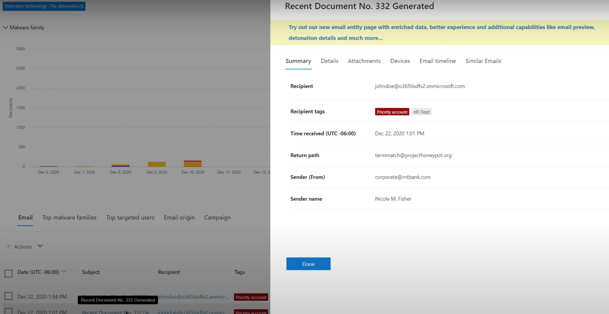

# Bedreigingsjacht in Threat Explorer voor Microsoft Defender voor Office 365Threat hunting in Threat Explorer for Microsoft Defender for Office 365

In dit artikel:In this article:

- [Threat Explorer-walk-throughThreat Explorer walk-through](#threat-explorer-walk-through)
- [E-mailonderzoekEmail investigation](#email-investigation)
- [E-mailsaneringEmail remediation](#email-remediation)
- [Verbeteringen in de bedreigingsjachtervaringImprovements to threat hunting experience](#improvements-to-threat-hunting-experience)

> [!NOTE]
> Dit maakt deel uit van een reeks van drie artikelen over **Threat Explorer (Explorer),** **e-mailbeveiliging** **en** explorer- en **realtimedetecties** (zoals verschillen tussen de hulpprogramma's en machtigingen die nodig zijn om ze te kunnen gebruiken).This is part of a **3-article series** on **Threat Explorer (Explorer)**, **email security**, and **Explorer and Real-time detections basics** (such as differences between the tools, and permissions needed to operate them). De andere twee artikelen in deze reeks zijn [E-mailbeveiliging met de](email-security-in-microsoft-defender.md) basisbeginselen Bedreigingsverkenner en [Threat Explorer en realtime detecties.](real-time-detections.md)The other two articles in this series are [Email security with Threat Explorer](email-security-in-microsoft-defender.md) and [Threat Explorer and Real-time detections basics](real-time-detections.md).

**Van toepassing op****Applies to**
- [Abonnement 1 en abonnement 2 voor Microsoft Defender voor Office 365Microsoft Defender for Office 365 plan 1 and plan 2](defender-for-office-365.md)
- [Microsoft 365 DefenderMicrosoft 365 Defender](../defender/microsoft-365-defender.md)

Als uw organisatie [Microsoft Defender](defender-for-office-365.md)heeft voor Office 365 en u beschikt over de [machtigingen,](#required-licenses-and-permissions)kunt u **Explorer** of **realtimedetecties** gebruiken om bedreigingen te detecteren en te corrigeren.If your organization has [Microsoft Defender for Office 365](defender-for-office-365.md), and you have the [permissions](#required-licenses-and-permissions), you can use **Explorer** or **Real-time detections** to detect and remediate threats. 

Ga in **Microsoft 365 Defender-portal** naar **E-mail & samenwerking** en kies **Verkenner.**In the **Microsoft 365 Defender portal**, go to **Email & collaboration**, and then choose **Explorer**.

 

****

|Met Microsoft Defender voor Office 365 Plan 2 ziet u:With Microsoft Defender for Office 365 Plan 2, you see:|Met Microsoft Defender voor Office 365 plan 1 ziet u:With Microsoft Defender for Office 365 Plan 1, you see:|
|---|---|
|||
|

Met deze hulpmiddelen kunt u het volgende doen:With these tools, you can:

- Malware zien die is gedetecteerd door Microsoft 365 beveiligingsfunctiesSee malware detected by Microsoft 365 security features
- Phishing-URL weergeven en op vonnisgegevens klikkenView phishing URL and click verdict data
- Een geautomatiseerd onderzoek- en antwoordproces starten vanuit een weergave in ExplorerStart an automated investigation and response process from a view in Explorer
- Schadelijke e-mail onderzoeken en meerInvestigate malicious email, and more

Zie E-mailbeveiliging [met Threat Explorer voor meer informatie.](email-security-in-microsoft-defender.md)For more information, see [Email security with Threat Explorer](email-security-in-microsoft-defender.md). 

## Threat Explorer-walk-throughThreat Explorer walk-through

In Microsoft Defender voor Office 365 zijn er twee abonnementen: Abonnement 1 en Abonnement 2.In Microsoft Defender for Office 365, there are two subscription plans—Plan 1 and Plan 2. Handmatig beheerde hulpprogramma's voor het zoeken naar bedreigingen bestaan in beide plannen, onder verschillende namen en met verschillende mogelijkheden.Manually operated Threat hunting tools exist in both plans, under different names and with different capabilities.

Defender voor Office 365 Plan 1 maakt gebruik van *realtime detecties,* een subset van het *zoekprogramma Threat Explorer* (ook wel Verkenner genoemd) in Plan 2. Defender for Office 365 Plan 1 uses *Real-time detections*, which is a subset of the *Threat Explorer* (also called *Explorer*) hunting tool in Plan 2. In deze reeks artikelen zijn de meeste voorbeelden gemaakt met de volledige Threat Explorer.In this series of articles, most of the examples were created using the full Threat Explorer. Beheerders moeten alle stappen in realtimedetecties testen om te zien waar ze van toepassing zijn.Admins should test any steps in Real-time detections to see where they apply.

Als u het hulpprogramma Explorer wilt openen, gaat u **naar Microsoft 365 Defender-portal**  >  **E-mail & Explorer voor**  >  **samenwerking.**To open the Explorer tool, go to **Microsoft 365 Defender portal** > **Email & collaboration** > **Explorer**. Standaard komt u op de pagina **Malware,**  maar gebruikt u de vervolgkeuzekeuzepagina Beeld om vertrouwd te raken met uw opties.By default, you’ll arrive on the **Malware** page, but use the **View** drop down to get familiar with your options. Als u op Phish jaagt of een bedreigingscampagne bekijkt, kiest u deze weergaven.If you’re hunting Phish, or digging into a threat campaign, choose those views.

> [!div class="mx-imgBorder"]
> 

Wanneer een persoon met beveiligingsbewerkingen (Sec Ops) de gegevens selecteert die hij of zij wil zien, of het bereik een smalle weergave is, zoals gebruikersinzendingen of een bredere weergave, zoals **Alle** e-mail, kunnen ze de knop **Afzender** gebruiken om verder te filteren.Once a security operations (Sec Ops) person selects the data they want to see, whether the scope is narrow view like user **Submissions**, or a wider view, like **All email**, they can use the **Sender** button to further filter. Selecteer Vernieuwen om uw filteracties te voltooien.Remember to select Refresh to complete your filtering actions.

> [!div class="mx-imgBorder"]
> 

U kunt de focus in Explorer of realtimedetectie in lagen verfijnen.Refining focus in Explorer or Real-time detection can be thought of in layers. De eerste is **Weergave.**The first is **View**. De tweede kan worden gedacht als een *gefilterde focus.*The second can be thought of as a *filtered focus*. U kunt bijvoorbeeld de stappen die u hebt genomen bij het vinden van een bedreiging, traceren door uw beslissingen op te nemen zoals deze: Als u het probleem wilt vinden in Explorer, heb ik de malwareweergave gekozen met de **filterfocus Geadresseerde.**For example, you can retrace the steps you took in finding a threat by recording your decisions like this: To find the issue in Explorer, **I chose the Malware View with a Recipient filter focus**. Dit maakt het gemakkelijker om uw stappen te volgen.This makes retracing your steps easier.

> [!TIP]
> Als Sec Ops Tags gebruikt **om** accounts te markeren die ze als hoog gewaardeerde doelen beschouwen, kunnen ze selecties maken, zoals *Phish-weergave* met de filterfocus Tags (inclusief een datumbereik indien gebruikt).If Sec Ops uses **Tags** to mark accounts they consider high valued targets, they can make selections like *Phish View with a Tags filter focus (include a date range if used)*. Op deze manier kunnen ze phishingpogingen zien die zijn gericht op hun hoge gebruikersdoelen gedurende een bepaalde periode (zoals datums waarop bepaalde phishingaanvallen veel voor hun branche plaatsvinden).This will show them any phishing attempts directed at their high value user targets during a time-range (like dates when certain phishing attacks are happening a lot for their industry). 

Verfijningen kunnen worden aangebracht op datumbereiken met behulp van de besturingselementen voor het datumbereik.Refinements can be made on date ranges by using the date range controls. Hier ziet u Verkenner in **de malwareweergave,** met de **filterfocus Detectietechnologie.**Here you can see Explorer in **Malware** view, with a **Detection Technology** filter focus. Maar het is de knop **Geavanceerd filter** waarmee Sec Ops-teams diep kunnen graven.But it’s the **Advanced filter** button that lets Sec Ops teams dig deep. 

> [!div class="mx-imgBorder"]
> 

Als u op het filter Geavanceerd **klikt,** wordt een deelvenster weergegeven waarmee sec ops-jagers zelf query's kunnen maken, zodat ze de informatie kunnen opnemen of uitsluiten die ze nodig hebben om te zien.Clicking the **Advanced filter** pops a panel that will let Sec Ops hunters build queries themselves, letting them include or exclude the information they need to see. Zowel de grafiek als de tabel op de pagina Explorer geven de resultaten weer.Both the chart and table on the Explorer page will reflect their results. 

> [!div class="mx-imgBorder"]
> 

Gebruik de **knop Kolomopties** om het soort informatie in de tabel op te halen dat het meest nuttig is:Use the **Column options** button to get the kind of information on the table that would be most helpful: 

> [!div class="mx-imgBorder"]
> 

> [!div class="mx-imgBorder"]
> 

Test in dezelfde mien de weergaveopties.In the same mien, make sure to test your display options. Verschillende doelgroepen reageren goed op verschillende presentaties met dezelfde gegevens.Different audiences will react well to different presentations of the same data. Voor sommige gebruikers kan de **e-mail origins-kaart** laten zien  dat een bedreiging breder of discreter is dan de weergaveoptie Campagne direct er naast.For some viewers, the **Email Origins** map can show that a threat is widespread or discreet more quickly than the **Campaign display** option right next to it. Sec Ops kan gebruik maken van deze beeldschermen om de beste punten te maken die de noodzaak onderstrepen van beveiliging en beveiliging, of voor latere vergelijking, om de effectiviteit van hun acties aan te tonen.Sec Ops can make use of these displays to best make points that underscore the need for security and protection, or for later comparison, to demonstrate the effectiveness of their actions. 

> [!div class="mx-imgBorder"]
> 

> [!div class="mx-imgBorder"]
> 

### E-mailonderzoekEmail investigation

Wanneer u een verdacht e-mailbericht ziet, klikt u op de naam om de flyout aan de rechterkant uit te vouwen.When you see a suspicious email, click the name to expand the flyout on the right. Hier is de banner waarmee Sec Ops de pagina [e-mailentiteit kan](mdo-email-entity-page.md) zien, beschikbaar.Here, the banner that lets Sec Ops see the [email entity page](mdo-email-entity-page.md) is available.

Op de pagina e-mailentiteit wordt inhoud verzameld die kan worden gevonden onder **Details**, **Bijlagen**, **Apparaten**, maar bevat meer geordende gegevens.The email entity page pulls together contents that can be found under **Details**, **Attachments**, **Devices**, but includes more organized data. Dit omvat zaken als DMARC-resultaten, het weergeven van tekst zonder tekst van de e-mailkop met een kopieeroptie, informatie over bijlagen die veilig zijn ontploft en bestanden die detonaties laten vallen (kunnen IP-adressen bevatten die zijn gecontacteerd en schermafbeeldingen van pagina's of bestanden).This includes things like DMARC results, plain text display of the email header with a copy option, verdict information on attachments that were securely detonated, and files those detonations dropped (can include IP addresses that were contacted and screenshots of pages or files). URL's en hun vonnissen worden ook vermeld met vergelijkbare details die zijn gerapporteerd.URLs and their verdicts are also listed with similar details reported. 

Wanneer u deze fase bereikt, is de pagina e-mailentiteit essentieel voor de laatste stap:*herstel.*When you reach this stage, the email entity page will be critical to the final step—*remediation*. 

> [!div class="mx-imgBorder"]
> 

> [!TIP]
> Klik hier voor meer informatie over de  pagina met uitgebreide e-mailentiteit (hieronder te zien op het tabblad Analyse), met inbegrip van de resultaten van ontstekte bijlagen, bevindingen voor opgenomen URL's en een veilig voorbeeld van e-mail. To learn more about the rich email entity page (seen below on the **Analysis** tab), including the results of detonated Attachments, findings for included URLs, and safe Email preview, click [here](mdo-email-entity-page.md).

> [!div class="mx-imgBorder"]
> 

### E-mailsaneringEmail remediation

Zodra een Sec Ops-persoon vaststelt dat een e-mail een bedreiging is, is de volgende Explorer- of Realtimedetectiestap bezig met het afhandelen van de bedreiging en het herstellen van de bedreiging.Once a Sec Ops person determines that an email is a threat, the next Explorer or Real-time detection step is dealing with the threat and remediating it. U kunt dit doen door terug te keren naar Threat Explorer, het selectievakje voor het probleem-e-mailbericht in te selecteren en de knop **Acties te** gebruiken.This can be done by returning to Threat Explorer, selecting the checkbox for the problem email, and using the **Actions** button.

> [!div class="mx-imgBorder"]
> 

Hier kan de analist acties ondernemen, zoals het rapporteren van de e-mail als Spam, Phishing of Malware, contact opnemen met geadresseerden of verdere onderzoeken die kunnen bestaan uit het activeren van playbooks voor Geautomatiseerd onderzoek en antwoord (of AIR) (als u abonnement 2 hebt).Here, the analyst can take actions like reporting the mail as Spam, Phishing, or Malware, contacting recipients, or further investigations that can include triggering Automated Investigation and Response (or AIR) playbooks (if you have Plan 2). Of de e-mail kan ook als schoon worden gerapporteerd.Or, the mail can also be reported as clean.

> [!div class="mx-imgBorder"]
> 

## Verbeteringen in de bedreigingsjachtervaringImprovements to threat hunting experience

### Waarschuwings-idAlert ID

Wanneer u vanuit een waarschuwing naar  Threat Explorer navigeert, wordt de weergave gefilterd op **waarschuwings-id.**When navigating from an alert into Threat Explorer, the **View** will be filtered by **Alert ID**. Dit geldt ook voor realtimedetectie.This also applies in Real-time detection. Berichten die relevant zijn voor de specifieke waarschuwing en een e-mailtotaal (aantal) worden weergegeven.Messages relevant to the specific alert, and an email total (a count) are shown. U kunt zien of een bericht deel uitmaakte van een waarschuwing en van dat bericht naar de bijbehorende waarschuwing navigeren.You will be able to see if a message was part of an alert, as well as navigate from that message to the related alert.

Ten slotte wordt de waarschuwings-id opgenomen in de URL, bijvoorbeeld: `https://https://security.microsoft.com/viewalerts`Finally, alert ID is included in the URL, for example: `https://https://security.microsoft.com/viewalerts`

> [!div class="mx-imgBorder"]
> 

> [!div class="mx-imgBorder"]
> 

### Gegevensretentie en zoeklimiet voor proeften tenants verlengen in Explorer (en realtime detecties)Extending Explorer (and Real-time detections) data retention and search limit for trial tenants 

Als onderdeel van deze wijziging kunnen analisten e-mailgegevens zoeken en filteren over 30 dagen (verhoogd van zeven dagen) in Threat Explorer en real-time detecties voor zowel Defender voor Office P1- als P2-proeften tenants.As part of this change, analysts will be able to search for, and filter email data across 30 days (increased from seven days) in Threat Explorer and Real-time detections for both Defender for Office P1 and P2 trial tenants. Dit heeft geen invloed op productieten tenants voor zowel P1- als P2 E5-klanten, waarbij de standaard bewaartermijn al 30 dagen is.This doesn’t impact any production tenants for both P1 and P2 E5 customers, where the retention default is already 30 days.

### Bijgewerkte exportlimietUpdated Export limit 

Het aantal E-mailrecords dat kan worden geëxporteerd vanuit Threat Explorer is nu 200.000 (was 9990).The number of Emails records that can be exported from Threat Explorer is now 200,000 (was 9990). De set kolommen die kunnen worden geëxporteerd, blijft ongewijzigd.The set of columns that can be exported is unchanged. 

### Tags in Threat ExplorerTags in Threat Explorer

> [!NOTE]
> De functie gebruikerslabels is beschikbaar in Preview en is mogelijk niet voor iedereen beschikbaar.The user tags feature is in Preview and may not be available to everyone. Previews kunnen ook worden gewijzigd.Also, Previews are subject to change. Voor informatie over de releaseplanning raadpleegt u de Microsoft 365 routekaart.For information about the release schedule, check out the Microsoft 365 roadmap.

Gebruikerslabels identificeren specifieke groepen gebruikers in Microsoft Defender voor Office 365.User tags identify specific groups of users in Microsoft Defender for Office 365. Zie Gebruikerslabels voor meer informatie over tags, waaronder licenties en [configuratie.](user-tags.md)For more information about tags, including licensing and configuration, see [User tags](user-tags.md).

In Threat Explorer ziet u informatie over gebruikerslabels in de volgende ervaringen.In Threat Explorer, you can see information about user tags in the following experiences.

#### E-mailrasterweergaveEmail grid view

Wanneer analisten de kolom **Tags** het e-mailraster bekijken, zien ze alle tags die zijn toegepast op postvakken van afzenders of geadresseerden.When analysts look at the **Tags** column the email grid, they are seeing all tags that have been applied to sender or recipient mailboxes. Systeemlabels zoals *prioriteitsaccounts* worden standaard eerst weergegeven.By default, system tags like *priority accounts* are shown first.

> [!div class="mx-imgBorder"]
> 

#### FilterenFiltering

Tags kunnen worden gebruikt als filters.Tags can be used as filters. Zoek alleen naar prioriteitsaccounts of gebruik op deze manier specifieke scenario's voor gebruikerslabels.Hunt among priority accounts only, or use specific user tags scenarios this way. U kunt ook resultaten met bepaalde tags uitsluiten.You can also exclude results that have certain tags. Combineer Tags met andere filters en datumbereiken om uw onderzoeksbereik te beperken.Combine Tags with other filters and date ranges to narrow your scope of investigation. 

> [!div class="mx-imgBorder"]
> 

#### Flyout voor e-maildetailsEmail detail flyout

Als u de afzonderlijke tags voor afzender en geadresseerde wilt weergeven, selecteert u een e-mailbericht om de flyout berichtdetails te openen.To view the individual tags for sender and recipient, select an email to open the message details flyout. Op het **tabblad** Overzicht worden de afzender- en geadresseerdelabels afzonderlijk weergegeven.On the **Summary** tab, the sender and recipient tags are shown separately. De informatie over afzonderlijke tags voor afzender en geadresseerde kan worden geëxporteerd als CSV-gegevens.The information about individual tags for sender and recipient can be exported as CSV data. 

> [!div class="mx-imgBorder"]
> 

Informatie over tags wordt ook weergegeven in de flyout klikken op URL's.Tags information is also shown in the URL clicks flyout. Ga naar het tabblad Phish of Alle e-mailweergave > **URL's** **of URL-klikken** om deze te bekijken. Selecteer een afzonderlijke URL-flyout voor meer informatie over klikken voor die URL, inclusief alle tags die aan die klik zijn gekoppeld.To see it, go to Phish or All Email view > **URLs** or **URL Clicks** tab. Select an individual URL flyout to see additional details about clicks for that URL, including any Tags associated with that click.

### Bijgewerkte tijdlijnweergaveUpdated Timeline View

> [!div class="mx-imgBorder"]
> 
>
Meer informatie vindt u in [deze video](https://www.youtube.com/watch?v=UoVzN0lYbfY&list=PL3ZTgFEc7LystRja2GnDeUFqk44k7-KXf&index=4).Learn more by watching [this video](https://www.youtube.com/watch?v=UoVzN0lYbfY&list=PL3ZTgFEc7LystRja2GnDeUFqk44k7-KXf&index=4).

## Uitgebreide mogelijkhedenExtended capabilities

### Best getargete gebruikersTop targeted users

Top Malware Families toont de **meest gerichte gebruikers** in de sectie Malware.Top Malware Families shows the **top targeted users** in the Malware section. Top targeted users will be extended through Phish and All Email views too.Top targeted users will be extended through Phish and All Email views too. Analisten kunnen de vijf meest gerichte gebruikers zien, samen met het aantal pogingen voor elke gebruiker in elke weergave.Analysts will be able to see the top-five targeted users, along with the number of attempts for each user in each view. 

Beveiligingsbewerkingen personen kunnen de lijst met doelgebruikers exporteren, tot een limiet van 3.000, samen met het aantal pogingen, voor offlineanalyse voor elke e-mailweergave.Security operations people be able to export the list of targeted users, up to a limit of 3,000, along with the number of attempts made, for offline analysis for each email view. Als u het aantal pogingen selecteert (bijvoorbeeld 13 pogingen in de onderstaande afbeelding), wordt er een gefilterde weergave geopend in Threat Explorer, zodat u meer informatie over e-mailberichten en bedreigingen voor die gebruiker kunt zien.Also, selecting the number of attempts (for example, 13 attempts in the image below) will open a filtered view in Threat Explorer, so you can see more details across emails, and threats for that user.  

> [!div class="mx-imgBorder"]
> 

### Exchange transportregelsExchange transport rules

Het beveiligingsteam kan in de weergave E-mailraster alle transportregels (Exchange E-mailstroomregels) zien die zijn toegepast op een bericht.The security operations team will be able to see all the Exchange transport rules (or Mail flow rules) applied to a message, in the Email grid view. Selecteer **Kolomopties** in het raster en voeg **Exchange transportregel toe** vanuit de kolomopties.Select **Column options** in the grid and then **Add Exchange Transport Rule** from the column options. De Exchange de optie transportregels is ook zichtbaar in de flyout **Details** in het e-mailbericht.The Exchange transport rules option is also visible on the **Details** flyout in the email. 

Namen en GUID's van de transportregels die op het bericht zijn toegepast, worden weergegeven.Names and GUIDs of the transport rules applied to the message appear. Analisten kunnen berichten zoeken met de naam van de transportregel.Analysts will be able to search for messages by using the name of the transport rule. Dit is een CONTAINS-zoekopdracht, wat betekent dat u ook gedeeltelijke zoekopdrachten kunt doen.This is a CONTAINS search, which means you can do partial searches as well. 

> [!IMPORTANT]
> Exchange zoek- en naambeschikbaarheid van transportregel is afhankelijk van de specifieke rol die aan u is toegewezen.Exchange transport rule search and name availability depend on the specific role assigned to you. U moet een van de volgende rollen of machtigingen hebben om de namen en zoekopdrachten van de transportregel weer te geven.You need to have one of the following roles or permissions to view the transport rule names and search. Zelfs zonder de onderstaande rollen of machtigingen kan een analist echter het label van de transportregel en de GUID-gegevens in de e-mailgegevens zien.However, even without the roles or permissions below, an analyst may see the transport rule label and GUID information in the Email Details. Andere ervaringen met het weergeven van records in e-mailrasters, e-mail flyouts, Filters en Export worden niet beïnvloed.Other record-viewing experiences in Email Grids, Email flyouts, Filters, and Export are not affected.
>
> - Exchange Online Alleen - Preventie van gegevensverlies: AllesExchange Online Only - Data Loss Prevention: All
> - Exchange Online Alleen - O365SupportViewConfig: AlleExchange Online Only - O365SupportViewConfig: All
> - Microsoft Azure Active Directory of Exchange Online - Beveiligingsbeheerder: AllesMicrosoft Azure Active Directory or Exchange Online - Security Admin: All
> - Azure Active Directory of Exchange Online - Beveiligingslezer: AllesAzure Active Directory or Exchange Online - Security Reader: All
> - Exchange Online Alleen - Transportregels: AllesExchange Online Only - Transport Rules: All
> - Exchange Online Alleen - View-Only Configuratie: AllesExchange Online Only - View-Only Configuration: All
>
> In het e-mailraster, de flyout Details en de geëxporteerde CSV worden de ETR's weergegeven met een Naam/GUID zoals hieronder wordt weergegeven.Within the email grid, Details flyout, and Exported CSV, the ETRs are presented with a Name/GUID as shown below.
>
> > [!div class="mx-imgBorder"]
> > 

### Binnenkomende verbindingslijnenInbound connectors

Connectors zijn een verzameling instructies die aanpassen hoe uw e-mail van en naar uw Microsoft 365 of Office 365 organisatie loopt.Connectors are a collection of instructions that customize how your email flows to and from your Microsoft 365 or Office 365 organization. Hiermee kunt u beveiligingsbeperkingen of besturingselementen toepassen.They enable you to apply any security restrictions or controls. In Threat Explorer kunt u de verbindingslijnen weergeven die zijn gerelateerd aan een e-mail en e-mailberichten zoeken met behulp van connectornamen.In Threat Explorer, you can view the connectors that are related to an email and search for emails using connector names. 

Het zoeken naar verbindingslijnen is een CONTAINS-query, wat betekent dat gedeeltelijke trefwoordzoekingen kunnen werken:The search for connectors is a CONTAINS query, which means partial keyword searches can work: 

> [!div class="mx-imgBorder"]
> 

## Vereiste licenties en machtigingenRequired licenses and permissions

U moet [Microsoft Defender hebben om Office 365](defender-for-office-365.md) explorer of realtime detecties te kunnen gebruiken.You must have [Microsoft Defender for Office 365](defender-for-office-365.md) to use Explorer or Real-time detections.

- Explorer is opgenomen in Defender voor Office 365 Plan 2.Explorer is included in Defender for Office 365 Plan 2.
- Het realtimedetectierapport is opgenomen in Defender voor Office 365 Plan 1.The Real-time detections report is included in Defender for Office 365 Plan 1.
- Plan om licenties toe te wijzen voor alle gebruikers die moeten worden beveiligd door Defender voor Office 365.Plan to assign licenses for all users who should be protected by Defender for Office 365. Explorer- en realtimedetecties tonen detectiegegevens voor gelicentieerde gebruikers.Explorer and Real-time detections show detection data for licensed users.

Als u Explorer- of realtimedetecties wilt bekijken en gebruiken, moet u het volgende hebben:To view and use Explorer or Real-time detections, you must have the following:

- Voor de Microsoft 365 Defender-portal:For the Microsoft 365 Defender portal:

  - OrganisatiebeheerOrganization Management
  - Beveiligingsbeheerder (dit kan worden toegewezen in het Azure Active Directory beheercentrum ( <https://aad.portal.azure.com> )Security Administrator (this can be assigned in the Azure Active Directory admin center (<https://aad.portal.azure.com>)
  - BeveiligingslezerSecurity Reader

- Voor Exchange Online:For Exchange Online:

  - OrganisatiebeheerOrganization Management
  - View-Only OrganisatiebeheerView-Only Organization Management
  - View-Only GeadresseerdenView-Only Recipients
  - CompliancebeheerCompliance Management

Zie de volgende bronnen voor meer informatie over rollen en machtigingen:To learn more about roles and permissions, see the following resources:

- [Machtigingen in de Microsoft 365 Defender-portalPermissions in the Microsoft 365 Defender portal](permissions-in-the-security-and-compliance-center.md)
- [Functiemachtigingen in Exchange OnlineFeature permissions in Exchange Online](/exchange/permissions-exo/feature-permissions)
- [Exchange Online PowerShellExchange Online PowerShell](/powershell/exchange/exchange-online-powershell)

## Meer informatieMore information

- [Schadelijke e-mail zoeken en onderzoeken die is bezorgdFind and investigate malicious email that was delivered](investigate-malicious-email-that-was-delivered.md) 
- [Schadelijke bestanden weergeven die zijn gedetecteerd in SharePoint Online, OneDrive en Microsoft TeamsView malicious files detected in SharePoint Online, OneDrive, and Microsoft Teams](mdo-for-spo-odb-and-teams.md) 
- [Een overzicht krijgen van de weergaven in Threat Explorer (en realtime detecties)Get an overview of the views in Threat Explorer (and Real-time detections)](threat-explorer-views.md) 
- [Statusrapport bedreigingsbeveiligingThreat protection status report](view-email-security-reports.md#threat-protection-status-report) 
- [Geautomatiseerd onderzoek en antwoord in Microsoft Threat ProtectionAutomated investigation and response in Microsoft Threat Protection](automated-investigation-response-office.md) 
- [E-mailberichten onderzoeken met de pagina E-mailentiteitInvestigate emails with the Email Entity Page](mdo-email-entity-page.md)