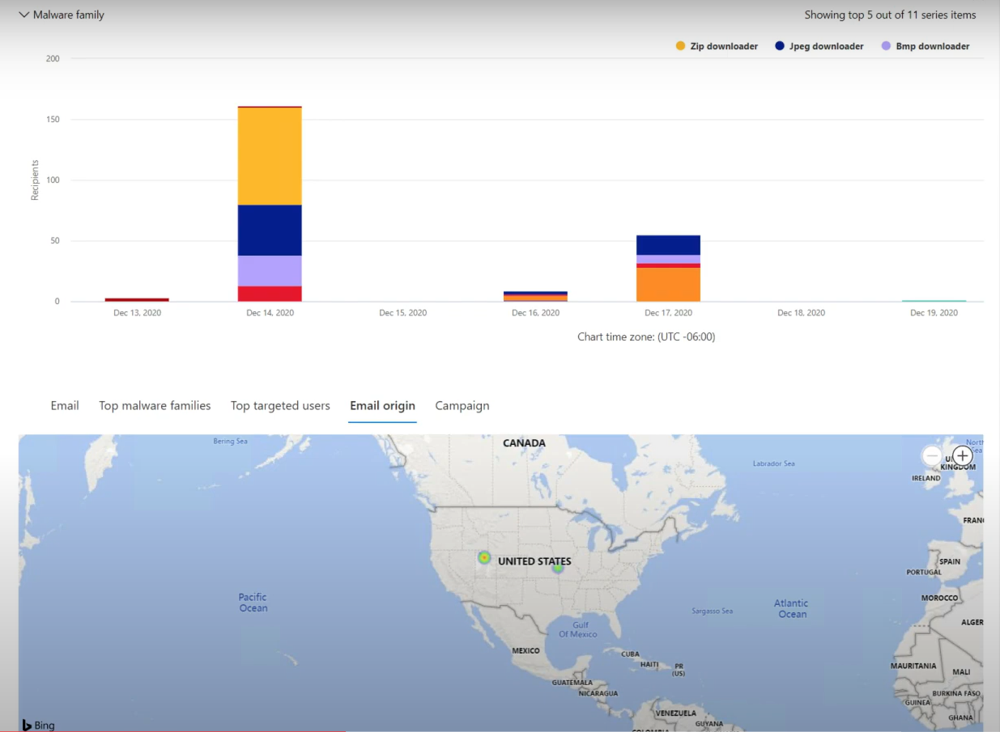

# Bedreigingsjacht in Threat Explorer voor Microsoft Defender voor Office 365

In dit artikel:

- [Threat Explorer-walk-through](#threat-explorer-walk-through)
- [E-mailonderzoek](#email-investigation)
- [E-mailsanering](#email-remediation)
- [Verbeteringen in de bedreigingsjachtervaring](#improvements-to-threat-hunting-experience)

> [!NOTE]
> Dit maakt deel uit van een reeks van drie artikelen over **Threat Explorer (Explorer),** **e-mailbeveiliging** **en** explorer- en **realtimedetecties** (zoals verschillen tussen de hulpprogramma's en machtigingen die nodig zijn om ze te kunnen gebruiken). De andere twee artikelen in deze reeks zijn [E-mailbeveiliging met de](email-security-in-microsoft-defender.md) basisbeginselen Bedreigingsverkenner en [Threat Explorer en realtime detecties.](real-time-detections.md)

**Van toepassing op**
- [Abonnement 1 en abonnement 2 voor Microsoft Defender voor Office 365](defender-for-office-365.md)
- [Microsoft 365 Defender](../defender/microsoft-365-defender.md)

Als uw organisatie [Microsoft Defender](defender-for-office-365.md)heeft voor Office 365 en u beschikt over de [machtigingen,](#required-licenses-and-permissions)kunt u **Explorer** of **realtimedetecties** gebruiken om bedreigingen te detecteren en te corrigeren. 

Ga in **Microsoft 365 Defender-portal** naar **E-mail & samenwerking** en kies **Verkenner.**

 

****

|Met Microsoft Defender voor Office 365 Plan 2 ziet u:|Met Microsoft Defender voor Office 365 plan 1 ziet u:|
|---|---|
|||
|

Met deze hulpmiddelen kunt u het volgende doen:

- Malware zien die is gedetecteerd door Microsoft 365 beveiligingsfuncties
- Phishing-URL weergeven en op vonnisgegevens klikken
- Een geautomatiseerd onderzoek- en antwoordproces starten vanuit een weergave in Explorer
- Schadelijke e-mail onderzoeken en meer

Zie E-mailbeveiliging [met Threat Explorer voor meer informatie.](email-security-in-microsoft-defender.md) 

## Threat Explorer-walk-through

In Microsoft Defender voor Office 365 zijn er twee abonnementen: Abonnement 1 en Abonnement 2. Handmatig beheerde hulpprogramma's voor het zoeken naar bedreigingen bestaan in beide plannen, onder verschillende namen en met verschillende mogelijkheden.

Defender voor Office 365 Plan 1 maakt gebruik van *realtime detecties,* een subset van het *zoekprogramma Threat Explorer* (ook wel Verkenner genoemd) in Plan 2.  In deze reeks artikelen zijn de meeste voorbeelden gemaakt met de volledige Threat Explorer. Beheerders moeten alle stappen in realtimedetecties testen om te zien waar ze van toepassing zijn.

Als u het hulpprogramma Explorer wilt openen, gaat u **naar Microsoft 365 Defender-portal**  >  **E-mail & Explorer voor**  >  **samenwerking.** Standaard komt u op de pagina **Malware,**  maar gebruikt u de vervolgkeuzekeuzepagina Beeld om vertrouwd te raken met uw opties. Als u op Phish jaagt of een bedreigingscampagne bekijkt, kiest u deze weergaven.

> [!div class="mx-imgBorder"]
> 

Wanneer een persoon met beveiligingsbewerkingen (Sec Ops) de gegevens selecteert die hij of zij wil zien, of het bereik een smalle weergave is, zoals gebruikersinzendingen of een bredere weergave, zoals **Alle** e-mail, kunnen ze de knop **Afzender** gebruiken om verder te filteren. Selecteer Vernieuwen om uw filteracties te voltooien.

> [!div class="mx-imgBorder"]
> 

U kunt de focus in Explorer of realtimedetectie in lagen verfijnen. De eerste is **Weergave.** De tweede kan worden gedacht als een *gefilterde focus.* U kunt bijvoorbeeld de stappen die u hebt genomen bij het vinden van een bedreiging, traceren door uw beslissingen op te nemen zoals deze: Als u het probleem wilt vinden in Explorer, heb ik de malwareweergave gekozen met de **filterfocus Geadresseerde.** Dit maakt het gemakkelijker om uw stappen te volgen.

> [!TIP]
> Als Sec Ops Tags gebruikt **om** accounts te markeren die ze als hoog gewaardeerde doelen beschouwen, kunnen ze selecties maken, zoals *Phish-weergave* met de filterfocus Tags (inclusief een datumbereik indien gebruikt). Op deze manier kunnen ze phishingpogingen zien die zijn gericht op hun hoge gebruikersdoelen gedurende een bepaalde periode (zoals datums waarop bepaalde phishingaanvallen veel voor hun branche plaatsvinden). 

Verfijningen kunnen worden aangebracht op datumbereiken met behulp van de besturingselementen voor het datumbereik. Hier ziet u Verkenner in **de malwareweergave,** met de **filterfocus Detectietechnologie.** Maar het is de knop **Geavanceerd filter** waarmee Sec Ops-teams diep kunnen graven. 

> [!div class="mx-imgBorder"]
> 

Als u op het filter Geavanceerd **klikt,** wordt een deelvenster weergegeven waarmee sec ops-jagers zelf query's kunnen maken, zodat ze de informatie kunnen opnemen of uitsluiten die ze nodig hebben om te zien. Zowel de grafiek als de tabel op de pagina Explorer geven de resultaten weer. 

> [!div class="mx-imgBorder"]
> 

Gebruik de **knop Kolomopties** om het soort informatie in de tabel op te halen dat het meest nuttig is: 

> [!div class="mx-imgBorder"]
> 

> [!div class="mx-imgBorder"]
> 

Test in dezelfde mien de weergaveopties. Verschillende doelgroepen reageren goed op verschillende presentaties met dezelfde gegevens. Voor sommige gebruikers kan de **e-mail origins-kaart** laten zien  dat een bedreiging breder of discreter is dan de weergaveoptie Campagne direct er naast. Sec Ops kan gebruik maken van deze beeldschermen om de beste punten te maken die de noodzaak onderstrepen van beveiliging en beveiliging, of voor latere vergelijking, om de effectiviteit van hun acties aan te tonen. 

> [!div class="mx-imgBorder"]
> 

> [!div class="mx-imgBorder"]
> 

### E-mailonderzoek

Wanneer u een verdacht e-mailbericht ziet, klikt u op de naam om de flyout aan de rechterkant uit te vouwen. Hier is de banner waarmee Sec Ops de pagina [e-mailentiteit kan](mdo-email-entity-page.md) zien, beschikbaar.

Op de pagina e-mailentiteit wordt inhoud verzameld die kan worden gevonden onder **Details**, **Bijlagen**, **Apparaten**, maar bevat meer geordende gegevens. Dit omvat zaken als DMARC-resultaten, het weergeven van tekst zonder tekst van de e-mailkop met een kopieeroptie, informatie over bijlagen die veilig zijn ontploft en bestanden die detonaties laten vallen (kunnen IP-adressen bevatten die zijn gecontacteerd en schermafbeeldingen van pagina's of bestanden). URL's en hun vonnissen worden ook vermeld met vergelijkbare details die zijn gerapporteerd. 

Wanneer u deze fase bereikt, is de pagina e-mailentiteit essentieel voor de laatste stap:*herstel.* 

> [!div class="mx-imgBorder"]
> 

> [!TIP]
> Klik hier voor meer informatie over de  pagina met uitgebreide e-mailentiteit (hieronder te zien op het tabblad Analyse), met inbegrip van de resultaten van ontstekte bijlagen, bevindingen voor opgenomen URL's en een veilig voorbeeld van e-mail. 

> [!div class="mx-imgBorder"]
> 

### E-mailsanering

Zodra een Sec Ops-persoon vaststelt dat een e-mail een bedreiging is, is de volgende Explorer- of Realtimedetectiestap bezig met het afhandelen van de bedreiging en het herstellen van de bedreiging. U kunt dit doen door terug te keren naar Threat Explorer, het selectievakje voor het probleem-e-mailbericht in te selecteren en de knop **Acties te** gebruiken.

> [!div class="mx-imgBorder"]
> 

Hier kan de analist acties ondernemen, zoals het rapporteren van de e-mail als Spam, Phishing of Malware, contact opnemen met geadresseerden of verdere onderzoeken die kunnen bestaan uit het activeren van playbooks voor Geautomatiseerd onderzoek en antwoord (of AIR) (als u abonnement 2 hebt). Of de e-mail kan ook als schoon worden gerapporteerd.

> [!div class="mx-imgBorder"]
> 

## Verbeteringen in de bedreigingsjachtervaring

### Waarschuwings-id

Wanneer u vanuit een waarschuwing naar  Threat Explorer navigeert, wordt de weergave gefilterd op **waarschuwings-id.** Dit geldt ook voor realtimedetectie. Berichten die relevant zijn voor de specifieke waarschuwing en een e-mailtotaal (aantal) worden weergegeven. U kunt zien of een bericht deel uitmaakte van een waarschuwing en van dat bericht naar de bijbehorende waarschuwing navigeren.

Ten slotte wordt de waarschuwings-id opgenomen in de URL, bijvoorbeeld: `https://https://security.microsoft.com/viewalerts`

> [!div class="mx-imgBorder"]
> 

> [!div class="mx-imgBorder"]
> 

### Gegevensretentie en zoeklimiet voor proeften tenants verlengen in Explorer (en realtime detecties) 

Als onderdeel van deze wijziging kunnen analisten e-mailgegevens zoeken en filteren over 30 dagen (verhoogd van zeven dagen) in Threat Explorer en real-time detecties voor zowel Defender voor Office P1- als P2-proeften tenants. Dit heeft geen invloed op productieten tenants voor zowel P1- als P2 E5-klanten, waarbij de standaard bewaartermijn al 30 dagen is.

### Bijgewerkte exportlimiet 

Het aantal E-mailrecords dat kan worden geëxporteerd vanuit Threat Explorer is nu 200.000 (was 9990). De set kolommen die kunnen worden geëxporteerd, blijft ongewijzigd. 

### Tags in Threat Explorer

> [!NOTE]
> De functie gebruikerslabels is beschikbaar in Preview en is mogelijk niet voor iedereen beschikbaar. Previews kunnen ook worden gewijzigd. Voor informatie over de releaseplanning raadpleegt u de Microsoft 365 routekaart.

Gebruikerslabels identificeren specifieke groepen gebruikers in Microsoft Defender voor Office 365. Zie Gebruikerslabels voor meer informatie over tags, waaronder licenties en [configuratie.](user-tags.md)

In Threat Explorer ziet u informatie over gebruikerslabels in de volgende ervaringen.

#### E-mailrasterweergave

Wanneer analisten de kolom **Tags** het e-mailraster bekijken, zien ze alle tags die zijn toegepast op postvakken van afzenders of geadresseerden. Systeemlabels zoals *prioriteitsaccounts* worden standaard eerst weergegeven.

> [!div class="mx-imgBorder"]
> 

#### Filteren

Tags kunnen worden gebruikt als filters. Zoek alleen naar prioriteitsaccounts of gebruik op deze manier specifieke scenario's voor gebruikerslabels. U kunt ook resultaten met bepaalde tags uitsluiten. Combineer Tags met andere filters en datumbereiken om uw onderzoeksbereik te beperken. 

> [!div class="mx-imgBorder"]
> 

#### Flyout voor e-maildetails

Als u de afzonderlijke tags voor afzender en geadresseerde wilt weergeven, selecteert u een e-mailbericht om de flyout berichtdetails te openen. Op het **tabblad** Overzicht worden de afzender- en geadresseerdelabels afzonderlijk weergegeven. De informatie over afzonderlijke tags voor afzender en geadresseerde kan worden geëxporteerd als CSV-gegevens. 

> [!div class="mx-imgBorder"]
> 

Informatie over tags wordt ook weergegeven in de flyout klikken op URL's. Ga naar het tabblad Phish of Alle e-mailweergave > **URL's** **of URL-klikken** om deze te bekijken. Selecteer een afzonderlijke URL-flyout voor meer informatie over klikken voor die URL, inclusief alle tags die aan die klik zijn gekoppeld.

### Bijgewerkte tijdlijnweergave

> [!div class="mx-imgBorder"]
> 
>
Meer informatie vindt u in [deze video](https://www.youtube.com/watch?v=UoVzN0lYbfY&list=PL3ZTgFEc7LystRja2GnDeUFqk44k7-KXf&index=4).

## Uitgebreide mogelijkheden

### Best getargete gebruikers

Top Malware Families toont de **meest gerichte gebruikers** in de sectie Malware. Top targeted users will be extended through Phish and All Email views too. Analisten kunnen de vijf meest gerichte gebruikers zien, samen met het aantal pogingen voor elke gebruiker in elke weergave. 

Beveiligingsbewerkingen personen kunnen de lijst met doelgebruikers exporteren, tot een limiet van 3.000, samen met het aantal pogingen, voor offlineanalyse voor elke e-mailweergave. Als u het aantal pogingen selecteert (bijvoorbeeld 13 pogingen in de onderstaande afbeelding), wordt er een gefilterde weergave geopend in Threat Explorer, zodat u meer informatie over e-mailberichten en bedreigingen voor die gebruiker kunt zien.  

> [!div class="mx-imgBorder"]
> 

### Exchange transportregels

Het beveiligingsteam kan in de weergave E-mailraster alle transportregels (Exchange E-mailstroomregels) zien die zijn toegepast op een bericht. Selecteer **Kolomopties** in het raster en voeg **Exchange transportregel toe** vanuit de kolomopties. De Exchange de optie transportregels is ook zichtbaar in de flyout **Details** in het e-mailbericht. 

Namen en GUID's van de transportregels die op het bericht zijn toegepast, worden weergegeven. Analisten kunnen berichten zoeken met de naam van de transportregel. Dit is een CONTAINS-zoekopdracht, wat betekent dat u ook gedeeltelijke zoekopdrachten kunt doen. 

> [!IMPORTANT]
> Exchange zoek- en naambeschikbaarheid van transportregel is afhankelijk van de specifieke rol die aan u is toegewezen. U moet een van de volgende rollen of machtigingen hebben om de namen en zoekopdrachten van de transportregel weer te geven. Zelfs zonder de onderstaande rollen of machtigingen kan een analist echter het label van de transportregel en de GUID-gegevens in de e-mailgegevens zien. Andere ervaringen met het weergeven van records in e-mailrasters, e-mail flyouts, Filters en Export worden niet beïnvloed.
>
> - Exchange Online Alleen - Preventie van gegevensverlies: Alles
> - Exchange Online Alleen - O365SupportViewConfig: Alle
> - Microsoft Azure Active Directory of Exchange Online - Beveiligingsbeheerder: Alles
> - Azure Active Directory of Exchange Online - Beveiligingslezer: Alles
> - Exchange Online Alleen - Transportregels: Alles
> - Exchange Online Alleen - View-Only Configuratie: Alles
>
> In het e-mailraster, de flyout Details en de geëxporteerde CSV worden de ETR's weergegeven met een Naam/GUID zoals hieronder wordt weergegeven.
>
> > [!div class="mx-imgBorder"]
> > 

### Binnenkomende verbindingslijnen

Connectors zijn een verzameling instructies die aanpassen hoe uw e-mail van en naar uw Microsoft 365 of Office 365 organisatie loopt. Hiermee kunt u beveiligingsbeperkingen of besturingselementen toepassen. In Threat Explorer kunt u de verbindingslijnen weergeven die zijn gerelateerd aan een e-mail en e-mailberichten zoeken met behulp van connectornamen. 

Het zoeken naar verbindingslijnen is een CONTAINS-query, wat betekent dat gedeeltelijke trefwoordzoekingen kunnen werken: 

> [!div class="mx-imgBorder"]
> 

## Vereiste licenties en machtigingen

U moet [Microsoft Defender hebben om Office 365](defender-for-office-365.md) explorer of realtime detecties te kunnen gebruiken.

- Explorer is opgenomen in Defender voor Office 365 Plan 2.
- Het realtimedetectierapport is opgenomen in Defender voor Office 365 Plan 1.
- Plan om licenties toe te wijzen voor alle gebruikers die moeten worden beveiligd door Defender voor Office 365. Explorer- en realtimedetecties tonen detectiegegevens voor gelicentieerde gebruikers.

Als u Explorer- of realtimedetecties wilt bekijken en gebruiken, moet u het volgende hebben:

- Voor de Microsoft 365 Defender-portal:

  - Organisatiebeheer
  - Beveiligingsbeheerder (dit kan worden toegewezen in het Azure Active Directory beheercentrum ( <https://aad.portal.azure.com> )
  - Beveiligingslezer

- Voor Exchange Online:

  - Organisatiebeheer
  - View-Only Organisatiebeheer
  - View-Only Geadresseerden
  - Compliancebeheer

Zie de volgende bronnen voor meer informatie over rollen en machtigingen:

- [Machtigingen in de Microsoft 365 Defender-portal](permissions-in-the-security-and-compliance-center.md)
- [Functiemachtigingen in Exchange Online](/exchange/permissions-exo/feature-permissions)
- [Exchange Online PowerShell](/powershell/exchange/exchange-online-powershell)

## Meer informatie

- [Schadelijke e-mail zoeken en onderzoeken die is bezorgd](investigate-malicious-email-that-was-delivered.md) 
- [Schadelijke bestanden weergeven die zijn gedetecteerd in SharePoint Online, OneDrive en Microsoft Teams](mdo-for-spo-odb-and-teams.md) 
- [Een overzicht krijgen van de weergaven in Threat Explorer (en realtime detecties)](threat-explorer-views.md) 
- [Statusrapport bedreigingsbeveiliging](view-email-security-reports.md#threat-protection-status-report) 
- [Geautomatiseerd onderzoek en antwoord in Microsoft Threat Protection](automated-investigation-response-office.md) 
- [E-mailberichten onderzoeken met de pagina E-mailentiteit](mdo-email-entity-page.md)