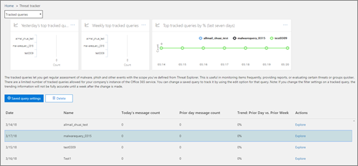

# Threat Trackers - Nieuw en opmerkelijk

Met de mogelijkheden voor [bedreigingsonderzoek en respons van Office 365](office-365-ti.md) kunnen het beveiligingsteam van uw organisatie het beveiligingsteam van uw organisatie ontdekken en actie ondernemen tegen cyberbeveiligingsbedreigingen. De mogelijkheden voor bedreigingsonderzoek en respons van Office 365 omvatten Threat Tracker-functies, waaronder opmerkelijke trackers. Lees dit artikel om een overzicht te krijgen van deze nieuwe functies en volgende stappen. 

> [!IMPORTANT]
> Office 365 Threat Intelligence is nu Office 365 Advanced Threat Protection Plan 2, samen met extra mogelijkheden voor bedreigingsbescherming. Zie [Office 365 Advanced Threat Protection-abonnementen en -prijzen](https://products.office.com/exchange/advance-threat-protection) en de beschrijving van de [Office 365 Advanced Threat Protection Service](https://docs.microsoft.com/office365/servicedescriptions/office-365-advanced-threat-protection-service-description)voor meer informatie.
  
## Wat zijn Threat Trackers?

Threat Trackers zijn informatieve widgets en weergaven die u voorzien van informatie over verschillende cyberbeveiligingsproblemen die van invloed kunnen zijn op uw bedrijf. U bijvoorbeeld informatie bekijken over trending malwarecampagnes met Behulp van Threat Trackers.
  

  
De meeste trackerpagina's bevatten trending nummers die periodiek worden bijgewerkt, widgets om u te helpen begrijpen welke problemen het grootst zijn of het meest zijn gegroeid, en een snelle link in de kolom **Acties** die u naar Explorer brengt, waar u meer gedetailleerde informatie bekijken. 
  

  
Trackers zijn slechts een paar van de vele geweldige functies die u krijgt met [Office 365 Advanced Threat Protection Plan 2.](office-365-ti.md) Threat Trackers omvatten [Noteworth trackers,](#noteworthy-trackers) [Trending trackers,](#trending-trackers) [Bijgehouden query's](#tracked-queries)en [opgeslagen query's](#saved-queries).
  
Als u uw Threat Trackers voor uw organisatie &amp; wilt[https://protection.office.com](https://protection.office.com)bekijken en gebruiken, gaat u naar het Security Compliance Center en kiest u **Threat management** \> **Threat tracker.**
  
> [!NOTE]
> Als u Threat Trackers wilt gebruiken, moet u een globale office-beheerder, beveiligingsbeheerder of beveiligingslezer zijn. Zie [machtigingen in het Office &amp; 365 Security Compliance Center](permissions-in-the-security-and-compliance-center.md). 
  
### Opmerkelijke trackers

Opmerkelijke trackers zijn waar u grote en kleinere bedreigingen en risico's vindt waarvan we denken dat u het moet weten. Opmerkelijke trackers helpen u te achterhalen of deze problemen bestaan in uw Office 365-omgeving, plus een koppeling naar artikelen (zoals deze) die u meer informatie geven over wat er gebeurt en hoe deze van invloed zijn op het gebruik van Office 365 door uw organisatie. Of het nu een grote nieuwe bedreiging (bijvoorbeeld Wannacry, Petya) of een bestaande bedreiging die een aantal nieuwe uitdagingen zou kunnen creëren (zoals onze andere inaugurele Opmerkelijke item - Nemucod), dit is waar je belangrijke nieuwe items die u en uw beveiligingsteam moet herzien en onderzoeken Periodiek.
  
Doorgaans worden opmerkelijke trackers gedurende slechts een paar weken geplaatst wanneer we nieuwe bedreigingen identificeren en denken dat u mogelijk de extra zichtbaarheid nodig hebt die deze functie biedt. Zodra het grootste risico voor een bedreiging is verstreken, verwijderen we dat opmerkelijke item. Op deze manier kunnen we de lijst fris en up-to-date houden met andere relevante nieuwe items.
  
### Trending trackers

Trending trackers (voorheen Campagnes genoemd) wijzen op nieuwe bedreigingen die in de afgelopen week in de e-mail van uw organisatie zijn ontvangen.
  

  
Trending trackers geven u een idee van nieuwe bedreigingen die u moet bekijken om ervoor te zorgen dat uw bredere bedrijfsomgeving is voorbereid tegen aanvallen.
  
### Bijgehouden query's

Bijgehouden query's maken gebruik van uw opgeslagen query's om de Office 365-activiteiten in uw organisatie periodiek te beoordelen. Dit geeft je event trending, met meer te komen in de komende maanden. Bijgehouden query's worden automatisch uitgevoerd, zodat u up-to-date informatie krijgt zonder dat u hoeft te onthouden om uw query's opnieuw uit te voeren.
  

  
### Opgeslagen query's

Opgeslagen query's worden ook gevonden in de sectie Trackers. U opgeslagen query's gebruiken om de algemene Explorer-zoekopdrachten op te slaan waaru u sneller en herhaaldelijk naar terug wilt gaan, zonder dat u de zoekopdracht telkens opnieuw hoeft te maken.
  

  
U altijd een opmerkelijke trackerquery of een van uw eigen Explorer-query's opslaan met de knop **Query opslaan** boven aan de Explorer-pagina. Alles wat daar is opgeslagen, wordt weergegeven in de lijst **Opgeslagen query's** op de trackerpagina. 
  
## Trackers en Explorer

Of u nu e-mail, inhoud of Office-activiteiten bekijkt (binnenkort beschikbaar, Explorer en Trackers werken samen om u te helpen beveiligingsrisico's en bedreigingen te onderzoeken en bij te houden. Alles bij elkaar bieden Trackers u informatie om uw Office 365-gebruikers te beschermen door nieuwe, opmerkelijke en vaak gezochte problemen te markeren - zodat uw bedrijf beter wordt beschermd wanneer het naar de cloud verhuist.
  
En vergeet niet dat u ons altijd feedback geven over deze of andere office 365-beveiligingsfuncties door op de knop **Feedback** in de rechterbenedenhoek van het [overzicht van het Office 365 &amp; Security Compliance Center](https://support.office.com/article/a5f2fd18-b029-4257-b5a8-ae83e7768c85)te klikken.
  

  
## Trackers en geavanceerde bedreigingsbeveiliging van Office 365

Met onze inaugurele opmerkelijke bedreiging, we wijzen op geavanceerde malware bedreigingen gedetecteerd door [Office 365 ATP Safe Attachments](atp-safe-attachments.md). Als u een Office 365 Enterprise E5-klant bent en u geen Gebruik maakt van [Office 365 Advanced Threat Protection](office-365-atp.md) (ATP), moet u dat wel zijn - het is inbegrepen in uw abonnement. ATP biedt waarde, zelfs als u andere beveiligingsprogramma's hebt die de e-mailstroom filteren met uw Office 365-services. Anti-spam en [office 365 ATP-functies](atp-safe-links.md) voor veilige koppelingen werken echter het beste wanneer uw belangrijkste e-mailbeveiligingsoplossing via Office 365 is. 
  

  
In de huidige wereld met bedreigingsraadsels betekent het uitvoeren van alleen traditionele anti-malwarescans dat u niet goed genoeg beschermd bent tegen aanvallen. De meest geavanceerde aanvallers van vandaag gebruiken algemeen beschikbare tools om nieuwe, versluierde of vertraagde aanvallen te maken die niet worden herkend door traditionele op handtekeningen gebaseerde anti-malwareengines. De ATP Safe Attachments-functie neemt e-mailbijlagen en laat ze ontploffen in een virtuele omgeving om te bepalen of ze veilig of kwaadaardig zijn. Dit detonatieproces opent elk bestand in een virtuele computeromgeving en houdt vervolgens in de gaten wat er gebeurt nadat het bestand is geopend. Of het nu gaat om een PDF en gecomprimeerd bestand of een Office-document, kwaadaardige code kan worden verborgen in een bestand, waardoor deze pas wordt geactiveerd zodra het slachtoffer het op zijn computer opent. Door het bestand in de e-mailstroom te laten afstaan en analyseren, vindt Office 365 ATP-mogelijkheden deze bedreigingen op basis van gedrag, bestandsreputatie en een aantal heuristische regels.
  
Het nieuwe opmerkelijke bedreigingsfilter markeert items die onlangs zijn gedetecteerd via ATP Safe Attachments. Deze detecties vertegenwoordigen items die nieuwe schadelijke bestanden zijn, die niet eerder door Office 365 zijn gevonden in uw e-mailstroom of e-mail van andere klanten. Let op de items in de Opmerkelijke Bedreigingtracker, zie wie er door hen het doelwit was en bekijk de ontploffingsgegevens op het tabblad Geavanceerde analyse (gevonden door op het onderwerp van de e-mail in Explorer te klikken). Let op: je vindt dit tabblad alleen op e-mails gedetecteerd door de ATP Safe Attachments-mogelijkheid - deze opmerkelijke tracker bevat dat filter, maar je dat filter ook gebruiken voor andere zoekopdrachten in Explorer.
  
## Volgende stappen

- Zie Hoe krijgen we de mogelijkheden voor [bedreigingsonderzoek en respons van Office 365,](office-365-ti.md)als uw organisatie deze mogelijkheden voor bedreigingsonderzoek en -respons van Office 365 nog niet heeft?
    
- Zorg ervoor dat uw beveiligingsteam de juiste rollen en machtigingen heeft toegewezen. U moet een globale beheerder van Office 365 zijn of de rol &amp; Beveiligingsbeheerder of Zoek en Zuivering hebben toegewezen in het Security Compliance Center. Zie [machtigingen in het Office &amp; 365 Security Compliance Center](permissions-in-the-security-and-compliance-center.md).
    
- Kijk of de nieuwe trackers worden weergegeven in uw Office 365-omgeving. Indien beschikbaar, vindt u uw Trackers [hier](https://protection.office.com/). Ga naar **Threat management** \> **Threat trackers**.
    
- Als u dit nog niet hebt gedaan, leest u meer over en configureert u [Office 365 Advanced Threat Protection](office-365-atp.md) voor uw organisatie, inclusief veilige office [365-atp-koppelingen](atp-safe-links.md) en [veilige office 365-beveiligingskoppelingen.](atp-safe-attachments.md)
  

