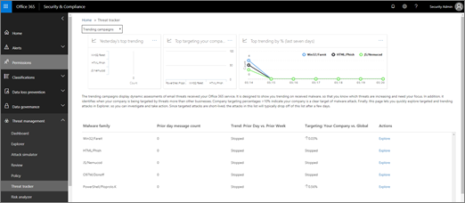

# Threat Trackers - Nieuw en OpmerkelijkThreat Trackers - New and Noteworthy

[!INCLUDE [Microsoft 365 Defender rebranding](../includes/microsoft-defender-for-office.md)]

**Van toepassing op****Applies to**
- [Abonnement 2 voor Microsoft Defender voor Office 365Microsoft Defender for Office 365 plan 2](office-365-atp.md)
- [Microsoft 365 DefenderMicrosoft 365 Defender](../mtp/microsoft-threat-protection.md)

[Office 365 Threat Investigation and Response](office-365-ti.md) capabilities enable your organization's security team to discover and action against cyberbeveiligingsdreigingen.[Office 365 Threat Investigation and Response](office-365-ti.md) capabilities enable your organization's security team to discover and take action against cybersecurity threats. Office 365 Threat Investigation en Response-mogelijkheden omvatten Threat Tracker-functies, waaronder Opmerkelijke trackers.Office 365 Threat Investigation and Response capabilities include Threat Tracker features, including Noteworthy trackers. Lees dit artikel voor een overzicht van deze nieuwe functies en de volgende stappen.Read this article to get an overview of these new features and next steps.

> [!IMPORTANT]
> Office 365 Threat Intelligence is nu Microsoft Defender voor Office 365 Plan 2, samen met extra mogelijkheden voor bedreigingsbeveiliging.Office 365 Threat Intelligence is now Microsoft Defender for Office 365 Plan 2, along with additional threat protection capabilities. Zie Microsoft Defender voor [Office 365-abonnementen](https://products.office.com/exchange/advance-threat-protection) en -prijzen en de servicebeschrijving van Microsoft Defender voor [Office 365 voor meer informatie.](/office365/servicedescriptions/office-365-advanced-threat-protection-service-description)To learn more, see [Microsoft Defender for Office 365 plans and pricing](https://products.office.com/exchange/advance-threat-protection) and the [Microsoft Defender for Office 365 Service Description](/office365/servicedescriptions/office-365-advanced-threat-protection-service-description).

## Wat zijn Threat Trackers?What are Threat Trackers?

Threat Trackers zijn informatieve widgets en weergaven die u informatie bieden over verschillende cyberbeveiligingsproblemen die van invloed kunnen zijn op uw bedrijf.Threat Trackers are informative widgets and views that provide you with intelligence on different cybersecurity issues that might impact your company. U kunt bijvoorbeeld informatie bekijken over trending malwarecampagnes met Threat Trackers.For example, you can view information about trending malware campaigns using Threat Trackers.

De meeste trackerpagina's bevatten trending numbers die regelmatig worden bijgewerkt, widgets om u te helpen  begrijpen welke problemen het grootst zijn of het meest zijn toegenomen, en een snelle koppeling in de kolom Acties die u naar Explorer brengt, waar u meer gedetailleerde informatie kunt bekijken.Most tracker pages include trending numbers that are updated periodically, widgets to help you understand which issues are the biggest or have grown the most, and a quick link in the **Actions** column that takes you to Explorer, where you can view more detailed information.

Trackers zijn slechts enkele van de vele geweldige functies die u krijgt met [Microsoft Defender voor Office 365 Plan 2.](office-365-ti.md)Trackers are just a few of the many great features you get with [Microsoft Defender for Office 365 Plan 2](office-365-ti.md). Bedreigingstrackers zijn [Noteworth-trackers,](#noteworthy-trackers) [Trending-trackers,](#trending-trackers)Bijgespoorde [query's](#tracked-queries)en [Opgeslagen query's.](#saved-queries)Threat Trackers include [Noteworth trackers](#noteworthy-trackers), [Trending trackers](#trending-trackers), [Tracked queries](#tracked-queries), and [Saved queries](#saved-queries).

Als u uw Threat Trackers voor uw organisatie wilt bekijken en gebruiken, gaat u naar het Beveiligings- & Compliance center ( ) en kiest u <https://protection.office.com> **Threat Management** \> **Threat Tracker**.To view and use your Threat Trackers for your organization, go to the Security & Compliance Center (<https://protection.office.com>) and choose **Threat management** \> **Threat tracker**.

> [!NOTE]
> Als u Threat Trackers wilt gebruiken, moet u een globale beheerder, beveiligingsbeheerder of beveiligingslezer zijn.To use Threat Trackers, you must be a global administrator, security administrator, or security reader. Zie [Machtigingen in het Beveiligings- & Compliancecentrum](permissions-in-the-security-and-compliance-center.md).See [Permissions in the Security & Compliance Center](permissions-in-the-security-and-compliance-center.md).

### Opmerkelijke trackersNoteworthy trackers

Opvallende trackers zijn de plaatsen waar u grote en kleinere bedreigingen en risico's vindt die u volgens ons moet weten.Noteworthy trackers are where you'll find big and smaller threats and risks that we think you should know about. Met opvallende trackers kunt u bepalen of deze problemen zich in uw Microsoft 365-omgeving kunnen vinden, plus een koppeling naar artikelen (zoals deze) die u meer informatie geven over wat er gebeurt en hoe deze van invloed zijn op het gebruik van Office 365 in uw organisatie.Noteworthy trackers help you find whether these issues exist in your Microsoft 365 environment, plus link to articles (like this one) that give you more details on what is happening, and how they'll impact your organization's use of Office 365. Of het nu gaat om een grote nieuwe bedreiging (bijvoorbeeld Wannacry, Petya) of een bestaande bedreiging die nieuwe uitdagingen kan creëren (zoals onze andere inaugurele Opmerkingswaarde - Nemucod), hier vindt u belangrijke nieuwe items die u en uw beveiligingsteam regelmatig moeten bekijken en onderzoeken.Whether it's a big new threat (e.g. Wannacry, Petya) or an existing threat that might create some new challenges (like our other inaugural Noteworthy item - Nemucod), this is where you'll find important new items you and your security team should review and examine periodically.

Meestal worden Noteworthy-trackers slechts een paar weken gepost wanneer we nieuwe bedreigingen identificeren en denken dat u mogelijk de extra zichtbaarheid nodig hebt die deze functie biedt.Typically Noteworthy trackers will be posted for just a couple of weeks when we identify new threats and think you might need the extra visibility that this feature provides. Zodra het grootste risico voor een bedreiging is verstreken, verwijderen we dat opmerkelijke item.Once the biggest risk for a threat has passed, we'll remove that Noteworthy item. Op deze manier kunnen we de lijst up-to-date houden met andere relevante nieuwe items.This way, we can keep the list fresh and up to date with other relevant new items.

### Trending trackersTrending trackers

Trending trackers (voorheen Campagnes genoemd) markeren nieuwe bedreigingen die de afgelopen week in de e-mail van uw organisatie zijn ontvangen.Trending trackers (formerly called Campaigns) highlight new threats received in your organization's email in the past week.

Trending trackers geven u een idee van nieuwe bedreigingen die u moet controleren om ervoor te zorgen dat uw bredere bedrijfsomgeving is voorbereid op aanvallen.Trending trackers give you an idea of new threats you should review to ensure your broader corporate environment is prepared against attacks.

### Bijgespoorde query'sTracked queries

Bijgespoorde query's maken gebruik van uw opgeslagen query's om de activiteiten van Microsoft 365 in uw organisatie regelmatig te beoordelen.Tracked queries leverage your saved queries to periodically assess Microsoft 365 activity in your organization. Dit geeft u trending van gebeurtenissen, met de komende maanden nog meer.This gives you event trending, with more to come in the coming months. Bijgespoorde query's worden automatisch uitgevoerd, zodat u up-to-date informatie krijgt zonder dat u moet onthouden dat u uw query's opnieuw moet uitvoeren.Tracked queries run automatically, giving you up-to-date information without having to remember to re-run your queries.

### Opgeslagen query'sSaved queries

Opgeslagen query's vindt u ook in de sectie Trackers.Saved queries are also found in the Trackers section. U kunt Opgeslagen query's gebruiken om de veelgebruikte Explorer-zoekopdrachten op te slaan die u sneller en herhaaldelijk wilt gebruiken, zonder dat u de zoekopdracht telkens opnieuw moet maken.You can use Saved queries to store the common Explorer searches that you want to get back to quicker and repeatedly, without having to re-create the search every time.

U kunt altijd een opmerkelijke trackerquery of een van uw eigen Verkenner-query's opslaan met de knop Query **opslaan** boven aan de explorerpagina.You can always save a Noteworthy tracker query or any of your own Explorer queries using the **Save query** button at the top of the Explorer page. Alles wat daar is opgeslagen, wordt weergegeven in de lijst **Opgeslagen query's** op de pagina Tracker.Anything saved there will show up in the **Saved queries** list on the Tracker page.

## Trackers en ExplorerTrackers and Explorer

Of u nu e-mail, inhoud of Office-activiteiten bekijkt (binnenkort beschikbaar), Verkenner en Trackers werken samen om u te helpen beveiligingsrisico's en bedreigingen te onderzoeken en bij te houden.Whether you're reviewing email, content, or Office activities (coming soon), Explorer and Trackers work together to help you investigate and track security risks and threats. Alles bij elkaar bieden trackers u informatie om uw gebruikers te beschermen door nieuwe, opvallende en veel gezochte problemen te markeren, zodat uw bedrijf beter wordt beveiligd wanneer het naar de cloud wordt verplaatst.All together, Trackers provide you with information to protect your users by highlighting new, notable, and frequently searched issues - ensuring your business is better protected as it moves to the cloud.

En vergeet niet dat u ons altijd feedback kunt geven over deze of andere beveiligingsfuncties van Microsoft 365 door te klikken op de **knop Feedback** in de rechterbenedenhoek van het overzicht van het [beveiligings- & compliancecentrum.](https://support.microsoft.com/office/a5f2fd18-b029-4257-b5a8-ae83e7768c85)And remember that you can always provide us feedback on this or other Microsoft 365 security features by clicking on the **Feedback** button in the lower right corner of the [Overview of the Security & Compliance Center](https://support.microsoft.com/office/a5f2fd18-b029-4257-b5a8-ae83e7768c85).

## Trackers en Microsoft Defender voor Office 365Trackers and Microsoft Defender for Office 365

Met onze inaugurele opmerkelijke bedreiging markeren we geavanceerde malwaredreigingen die zijn gedetecteerd door [veilige bijlagen.](atp-safe-attachments.md)With our inaugural Noteworthy threat, we're highlighting advanced malware threats detected by [Safe Attachments](atp-safe-attachments.md). Als u een Office 365 Enterprise E5-klant bent en u microsoft Defender voor [Office 365](office-365-atp.md)niet gebruikt, moet u dat wel doen. Het is opgenomen in uw abonnement.If you're an Office 365 Enterprise E5 customer and you're not using [Microsoft Defender for Office 365](office-365-atp.md), you should be - it's included in your subscription. Defender voor Office 365 biedt waarde, zelfs als u andere beveiligingsprogramma's hebt die e-mailstroom filteren met uw Office 365-services.Defender for Office 365 provides value even if you have other security tools filtering email flow with your Office 365 services. Antispam- en  veilige koppelingen werken echter het beste wanneer uw belangrijkste e-mailbeveiligingsoplossing is via Office 365.However, anti-spam and [Safe Links](atp-safe-links.md) features work best when your main email security solution is through Office 365.

In de huidige wereld met bedreigingen betekent het uitvoeren van alleen traditionele anti-malwarescans dat u niet goed genoeg bent beveiligd tegen aanvallen.In today's threat-riddled world, running only traditional anti-malware scans means you are not protected well enough against attacks. Modernere aanvallers gebruiken algemeen beschikbare hulpprogramma's om nieuwe, verduisteerde of vertraagde aanvallen te maken die niet worden herkend door traditionele anti-malwareprogramma's op basis van handtekeningen.Today's more sophisticated attackers use commonly available tools to create new, obfuscated, or delayed attacks that won't be recognized by traditional signature-based anti-malware engines. Met de functie Veilige bijlagen worden e-mailbijlagen in een virtuele omgeving tot ontploffing ge brengen om te bepalen of ze veilig of schadelijk zijn.The Safe Attachments feature takes email attachments and detonates them in a virtual environment to determine whether they're safe or malicious. Met dit detonatieproces wordt elk bestand geopend in een virtuele computeromgeving en wordt vervolgens gekijkt wat er gebeurt nadat het bestand is geopend.This detonation process opens each file in a virtual computer environment, then watches what happens after the file is opened. Of het nu gaat om een PDF-bestand, een gecomprimeerd bestand of een Office-document, schadelijke code kan worden verborgen in een bestand en kan alleen worden geactiveerd wanneer het slachtoffer het op de computer opent.Whether it's a PDF, and compressed file, or an Office document, malicious code can be hidden in a file, activating only once the victim opens it on their computer. Door het bestand in de e-mailstroom te detoneren en te analyseren, worden deze bedreigingen gevonden in De mogelijkheden van Defender voor Office 365 op basis van gedrag, bestandsreputatie en een aantal heuristische regels.By detonating and analyzing the file in the email flow, Defender for Office 365 capabilities finds these threats based on behaviors, file reputation, and a number of heuristic rules.

Het nieuwe bedreigingsfilter Noteworthy markeert items die onlangs zijn gedetecteerd via veilige bijlagen.The new Noteworthy threat filter highlights items that were recently detected through Safe Attachments. Deze detecties vertegenwoordigen items die nieuwe schadelijke bestanden zijn, die niet eerder door Microsoft 365 zijn gevonden in uw e-mailstroom of e-mail van andere klanten.These detections represent items that are new malicious files, not previously found by Microsoft 365 in either your email flow or other customers' email. Besteed aandacht aan de items in de Noteworthy Threat Tracker, bekijk wie het doel is en bekijk de detonatiedetails die worden weergegeven op het tabblad Geavanceerde analyse (gevonden door te klikken op het onderwerp van het e-mailbericht in Explorer).Pay attention to the items in the Noteworthy Threat Tracker, see who was targeted by them, and review the detonation details shown on the Advanced Analysis tab (found by clicking on the subject of the email in Explorer). Let op: dit tabblad vindt u alleen in e-mailberichten die zijn gedetecteerd door de functie Veilige bijlagen. Deze Noteworthy-tracker bevat dat filter, maar u kunt dat filter ook gebruiken voor andere zoekopdrachten in Explorer.Note you'll only find this tab on emails detected by the Safe Attachments capability - this Noteworthy tracker includes that filter, but you can also use that filter for other searches in Explorer.

## Volgende stappenNext steps

- Als uw organisatie deze mogelijkheden voor het onderzoeken en reageren van bedreigingen voor Office 365 nog niet heeft, bekijkt u Hoe krijgen we de mogelijkheden voor Het onderzoeken en reageren van bedreigingen van [Office 365?](office-365-ti.md).If your organization doesn't already have these Office 365 Threat Investigation and Response capabilities, see [How do we get Office 365 Threat Investigation and Response capabilities?](office-365-ti.md).

- Zorg ervoor dat uw beveiligingsteam de juiste rollen en machtigingen heeft toegewezen.Make sure that your security team has the correct roles and permissions assigned. U moet een globale beheerder zijn of de beveiligingsbeheerder of de rol Zoeken en zuiveren hebben toegewezen in het beveiligings- & compliancecentrum.You must be a global administrator, or have the Security Administrator or Search and Purge role assigned in the Security & Compliance Center. Zie [Machtigingen in het Beveiligings- & Compliancecentrum](permissions-in-the-security-and-compliance-center.md).See [Permissions in the Security & Compliance Center](permissions-in-the-security-and-compliance-center.md).

- Kijk of de nieuwe Trackers worden gebruikt in uw Microsoft 365-omgeving.Watch for the new Trackers to show up in your Microsoft 365 environment. Wanneer deze beschikbaar zijn, vindt u uw Trackers [hier.](https://protection.office.com/)When available, you'll find your Trackers [here](https://protection.office.com/). Ga naar **Threat Management** \> **Threat trackers**.Go to **Threat management** \> **Threat trackers**.

- Als u dit nog niet hebt gedaan, vindt u meer informatie over en configureert u Microsoft Defender voor [Office 365](office-365-atp.md) voor uw organisatie, inclusief Veilige [koppelingen](atp-safe-links.md) en [Veilige bijlagen.](atp-safe-attachments.md)If you haven't already done so, learn more about and configure [Microsoft Defender for Office 365](office-365-atp.md) for your organization, including [Safe links](atp-safe-links.md) and [Safe Attachments](atp-safe-attachments.md).