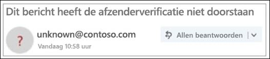

# Niet-geverifieerde afzender

> [!NOTE]
> Deze updates worden nu uitgerold en zijn mogelijk niet voor alle gebruikers beschikbaar. Deze functie wordt ondersteund voor Enterprise Outlook.com- en Enterprise Outlook Win32-desktopgebruikers. Het is momenteel niet beschikbaar voor gebruikers van Office 365 voor consumenten.

Om te voorkomen dat phishingberichten uw postvak bereiken, controleert Office 365 of de afzenders zijn wie ze zeggen dat ze zijn en markeert het verdachte berichten als ongewenste e-mail.

> [!IMPORTANT]
> Wanneer een bericht is gemarkeerd als een phishing-scam, geeft Outlook een waarschuwing boven aan de pagina weer, maar alle koppelingen in het bericht kunnen nog steeds worden geopend.

## Hoe kan ik een verdacht bericht in mijn postvak IN identificeren?

In Outlook worden indicatoren weergegeven wanneer de afzender van een bericht niet kan worden geïdentificeerd of hun identiteit verschilt van wat u ziet in het Van-adres.

## U ziet een '?' in de afzenderafbeelding

Wanneer Office 365 de identiteit van de afzender niet kan verifiëren met behulp van e-mailverificatietechnieken, wordt er een '?' weergegeven in de afzenderafbeelding.

Niet elk bericht dat niet te verifiëren is kwaadaardig. U moet echter voorzichtig zijn met de interactie met berichten die niet verifiëren als u de afzender niet herkent. Of, als u een afzender herkent die normaal gesproken geen '?' in de afzenderafbeelding heeft, maar u plotseling begint te zien, kan dat een teken zijn dat de afzender wordt vervalst.

## Hoe te beheren welke berichten de niet-geverifieerde afzenderbehandeling ontvangen 

Als u een Office 365-klant bent, u deze functie beheren via het Office 365 Security & Compliance Center.

- In het Security & Compliance Center kunnen globale of beveiligingsbeheerders de functie in- of uitschakelen, via anti-spoofing bescherming onder het Anti-Phish-beleid. Daarnaast u de **cmdlet Set-AntiPhishPolicy** gebruiken in Exchange Online PowerShell. Zie Bescherming [tegen phishing in Office 365](anti-phishing-protection.md) en [Set-AntiPhishPolicy](https://docs.microsoft.com/powershell/module/exchange/set-antiphishpolicy)voor meer informatie.

    

- Als een beheerder een fout-positief heeft geïdentificeerd en een afzender niet de niet-geverifieerde afzenderbehandeling mag ontvangen, kan een van de volgende acties worden ondernomen om de afzender toe te voegen aan de lijst spoofinformatie voor spoofinformatie:

  - Voeg het domeinpaar toe via de Spoof Intelligence Insight. Zie [Walkthrough: spoof intelligence insight](walkthrough-spoof-intelligence-insight.md)voor meer informatie.

  - Voeg het domeinpaar toe via de **cmdlet Set-PhishFilterPolicy** in Exchange Online PowerShell. Zie [Set-PhishFilterPolicy](https://docs.microsoft.com/powershell/module/exchange/set-phishfilterpolicy) en [Office 365 ATP anti-phishing- en antiphishingbeleid instellen](set-up-anti-phishing-policies.md)voor meer informatie.

Bovendien passen we de niet-geverifieerde afzenderbehandeling niet toe als het bericht via e-mailstroomregels (ook wel transportregels) of de veilige domeinlijst (antispambeleid) in het Postvak IN is bezorgd.

## Hoe de 'via' tag te beheren 

Als u een Office 365-klant bent, u deze functie beheren via het Office 365-beveiligingscentrum & Compliance, op dezelfde manier dat u de niet-geverifieerde afzenderbehandeling beheert. Als u de afzender toevoegt aan de lijst met spoofinformatie voor spoof, wordt de 'via'-behandeling niet toegepast.

## Veelgestelde vragen

### Welke criteria gebruikt Outlook.com en Outlook Win32-bureaublad om de eigenschappen '?' en de 'via'toe te voegen?

Voor de '?' in de afzenderafbeelding: Outlook.com vereist dat het bericht spf- of DKIM-verificatie doorstaat en een dmarc-pas of een samengestelde verificatiepas van Office 365 Spoof Intelligence ontvangt. Zie [SPF instellen in Office 365 voor](set-up-spf-in-office-365-to-help-prevent-spoofing.md) meer informatie om spoofing te voorkomen en [DKIM gebruiken om uitgaande e-mail die vanuit uw aangepaste domein in Office 365 wordt verzonden, te valideren.](use-dkim-to-validate-outbound-email.md)

Voor de via-tag: Als het domein in het Van-adres verschilt van het domein in de DKIM-handtekening of de SMTP-mail VAN, geeft Outlook.com het domein weer in een van deze twee velden (liever de DKIM-handtekening).

### Hoe verwijder ik de '?' zonder gebruik te maken van de Spoof Intelligence spoof lijst?

Voor de '?' in de afzenderafbeelding: Als afzender moet u uw bericht verifiëren met SPF of DKIM.

Voor de via-tag: Als afzender moet u ervoor zorgen dat het domein in de DKIM-handtekening of de SMTP-mail VAN hetzelfde is als, of een subdomein is van het domein in het Adres van.

### Laten Outlook.com en Outlook Win32-bureaublad dit zien voor elk bericht dat niet door verificatie wordt geslaagd?

Niet per se. Office 365 heeft mogelijk andere eigenschappen in het bericht om de afzender te verifiëren.

## Verwante onderwerpen

[Uw Outlook.com e-mailaccount beschermen](https://support.microsoft.com/en-us/office/help-protect-your-outlook-com-email-account-a4f20fc5-4307-4ece-8231-6d4d4bd8a9ba)

[Omgaan met phishing of spoofing in Outlook.com](https://support.office.com/article/0d882ea5-eedc-4bed-aebc-079ffa1105a3)

[Ongewenste e-mail en spam filteren in de webversie van Outlook](https://support.office.com/article/db786e79-54e2-40cc-904f-d89d57b7f41d)
