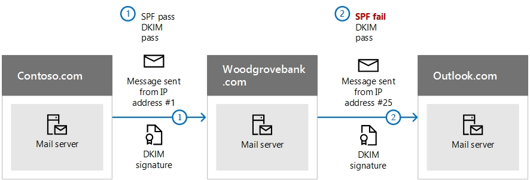

# <a name="use-dkim-to-validate-outbound-email-sent-from-your-custom-domain"></a><span data-ttu-id="5256b-103">DKIM gebruiken om uitgaande e-mail te valideren die wordt verzonden vanuit uw aangepaste domein</span><span class="sxs-lookup"><span data-stu-id="5256b-103">Use DKIM to validate outbound email sent from your custom domain</span></span>

[!INCLUDE [Microsoft 365 Defender rebranding](../includes/microsoft-defender-for-office.md)]

<span data-ttu-id="5256b-104">**Van toepassing op**</span><span class="sxs-lookup"><span data-stu-id="5256b-104">**Applies to**</span></span>
- [<span data-ttu-id="5256b-105">Exchange Online Protection</span><span class="sxs-lookup"><span data-stu-id="5256b-105">Exchange Online Protection</span></span>](exchange-online-protection-overview.md)
- [<span data-ttu-id="5256b-106">Abonnement 1 en abonnement 2 voor Microsoft Defender voor Office 365</span><span class="sxs-lookup"><span data-stu-id="5256b-106">Microsoft Defender for Office 365 plan 1 and plan 2</span></span>](office-365-atp.md)
- [<span data-ttu-id="5256b-107">Microsoft 365 Defender</span><span class="sxs-lookup"><span data-stu-id="5256b-107">Microsoft 365 Defender</span></span>](../mtp/microsoft-threat-protection.md)

 <span data-ttu-id="5256b-108">**Samenvatting:** In dit artikel wordt beschreven hoe u DKIM (DomainKeys Identified Mail) gebruikt in Microsoft 365 om ervoor te zorgen dat de ontvangende e-mailsystemen uitgaande berichten vertrouwen die worden verzonden vanuit uw aangepaste domein.</span><span class="sxs-lookup"><span data-stu-id="5256b-108">**Summary:** This article describes how you use DomainKeys Identified Mail (DKIM) with Microsoft 365 to ensure that destination email systems trust messages sent outbound from your custom domain.</span></span>

<span data-ttu-id="5256b-109">U dient DKIM te gebruiken naast SPF en DMARC om te voorkomen dat spoofing-oplichters berichten verzenden die er uitzien alsof deze afkomstig zijn van uw domein.</span><span class="sxs-lookup"><span data-stu-id="5256b-109">You should use DKIM in addition to SPF and DMARC to help prevent spoofers from sending messages that look like they are coming from your domain.</span></span> <span data-ttu-id="5256b-110">Met DKIM kunt u een digitale handtekening toevoegen aan uitgaande e-mailberichten in de berichtkop.</span><span class="sxs-lookup"><span data-stu-id="5256b-110">DKIM lets you add a digital signature to outbound email messages in the message header.</span></span> <span data-ttu-id="5256b-111">Het klinkt misschien ingewikkeld, maar dat is echt niet.</span><span class="sxs-lookup"><span data-stu-id="5256b-111">It may sound complicated, but it's really not.</span></span> <span data-ttu-id="5256b-112">Wanneer u DKIM configureert, geeft u uw domein toestemming om de domeinnaam aan een e-mailbericht te koppelen met behulp van cryptografische verificatie. Een soort handtekening van uw domein, dus.</span><span class="sxs-lookup"><span data-stu-id="5256b-112">When you configure DKIM, you authorize your domain to associate, or sign, its name to an email message by using cryptographic authentication.</span></span> <span data-ttu-id="5256b-113">E-mailsystemen die e-mail vanaf uw domein ontvangen, kunnen deze digitale handtekening gebruiken om te bepalen of de inkomende e-mail echt is.</span><span class="sxs-lookup"><span data-stu-id="5256b-113">Email systems that receive email from your domain can use this digital signature to help determine if incoming email that they receive is legitimate.</span></span>

<span data-ttu-id="5256b-114">Simpel gezegd gebruikt u een persoonlijke sleutel om de berichtkop in de uitgaande e-mail van uw domein te versleutelen.</span><span class="sxs-lookup"><span data-stu-id="5256b-114">Basically, you use a private key to encrypt the header in your domain's outgoing email.</span></span> <span data-ttu-id="5256b-115">U publiceert een openbare sleutel naar de DNS-records van uw domein die vervolgens door ontvangende servers wordt gebruikt om de handtekening te decoderen.</span><span class="sxs-lookup"><span data-stu-id="5256b-115">You publish a public key to your domain's DNS records that receiving servers can then use to decode the signature.</span></span> <span data-ttu-id="5256b-116">Ze gebruiken de openbare sleutel om te verifiëren dat de berichten werkelijk van u afkomstig zijn en niet afkomstig zijn van iemand die uw domein *spooft*.</span><span class="sxs-lookup"><span data-stu-id="5256b-116">They use the public key to verify that the messages are really coming from you and not coming from someone *spoofing* your domain.</span></span>

<span data-ttu-id="5256b-117">In Microsoft 365 wordt DKIM automatisch ingesteld voor de oorspronkelijke 'onmicrosoft.com'-domeinen.</span><span class="sxs-lookup"><span data-stu-id="5256b-117">Microsoft 365 automatically sets up DKIM for its initial 'onmicrosoft.com' domains.</span></span> <span data-ttu-id="5256b-118">Dat betekent dat u niets hoeft te doen om DKIM in te stellen voor enige oorspronkelijke domeinnaam (bijvoorbeeld litware.onmicrosoft.com).</span><span class="sxs-lookup"><span data-stu-id="5256b-118">That means you don't need to do anything to set up DKIM for any initial domain names (for example, litware.onmicrosoft.com).</span></span> <span data-ttu-id="5256b-119">Zie [Veelgestelde vragen over domeinen](../../admin/setup/domains-faq.yml#why-do-i-have-an--onmicrosoft-com--domain) voor meer informatie over domeinen.</span><span class="sxs-lookup"><span data-stu-id="5256b-119">For more information about domains, see [Domains FAQ](../../admin/setup/domains-faq.yml#why-do-i-have-an--onmicrosoft-com--domain).</span></span>

<span data-ttu-id="5256b-120">U kunt er ook voor kiezen om niets te doen met DKIM voor uw aangepaste domein.</span><span class="sxs-lookup"><span data-stu-id="5256b-120">You can choose to do nothing about DKIM for your custom domain too.</span></span> <span data-ttu-id="5256b-121">Als u geen DKIM voor uw aangepaste domein instelt, maakt Microsoft 365 een persoonlijk en openbare sleutelpaar en wordt DKIM-ondertekening ingeschakeld. Vervolgens wordt het standaardbeleid van Microsoft 365 voor uw aangepaste domein geconfigureerd.</span><span class="sxs-lookup"><span data-stu-id="5256b-121">If you don't set up DKIM for your custom domain, Microsoft 365 creates a private and public key pair, enables DKIM signing, and then configures the Microsoft 365 default policy for your custom domain.</span></span> <span data-ttu-id="5256b-122">Hoewel dit voldoende is voor de meeste klanten, moet u de DKIM voor uw aangepaste domein handmatig configureren in de volgende gevallen:</span><span class="sxs-lookup"><span data-stu-id="5256b-122">While this is sufficient coverage for most customers, you should manually configure DKIM for your custom domain in the following circumstances:</span></span>

- <span data-ttu-id="5256b-123">U hebt meer dan één aangepast domein in Microsoft 365</span><span class="sxs-lookup"><span data-stu-id="5256b-123">You have more than one custom domain in Microsoft 365</span></span>

- <span data-ttu-id="5256b-124">U wilt ook DMARC instellen (aanbevolen)</span><span class="sxs-lookup"><span data-stu-id="5256b-124">You're going to set up DMARC too (recommended)</span></span>

- <span data-ttu-id="5256b-125">U wilt controle over uw persoonlijke sleutel</span><span class="sxs-lookup"><span data-stu-id="5256b-125">You want control over your private key</span></span>

- <span data-ttu-id="5256b-126">U wilt de CNAME-records aanpassen</span><span class="sxs-lookup"><span data-stu-id="5256b-126">You want to customize your CNAME records</span></span>

- <span data-ttu-id="5256b-127">U wilt DKIM-sleutels instellen voor e-mail die afkomstig is van een extern domein, bijvoorbeeld als u bulkmails via een derde verzendt.</span><span class="sxs-lookup"><span data-stu-id="5256b-127">You want to set up DKIM keys for email originating out of a third-party domain, for example, if you use a third-party bulk mailer.</span></span>

<span data-ttu-id="5256b-128">In dit artikel:</span><span class="sxs-lookup"><span data-stu-id="5256b-128">In this article:</span></span>

- [<span data-ttu-id="5256b-129">Hoe DKIM beter werkt dan alleen SPF om schadelijke spoofing te voorkomen</span><span class="sxs-lookup"><span data-stu-id="5256b-129">How DKIM works better than SPF alone to prevent malicious spoofing</span></span>](use-dkim-to-validate-outbound-email.md#HowDKIMWorks)

- [<span data-ttu-id="5256b-130">Uw 1024-bits sleutels handmatig upgraden naar 2048-bits DKIM-versleutelingssleutels</span><span class="sxs-lookup"><span data-stu-id="5256b-130">Manually upgrade your 1024-bit keys to 2048-bit DKIM encryption keys</span></span>](use-dkim-to-validate-outbound-email.md#1024to2048DKIM)

- [<span data-ttu-id="5256b-131">Stappen die u moet uitvoeren om DKIM handmatig in te stellen</span><span class="sxs-lookup"><span data-stu-id="5256b-131">Steps you need to do to manually set up DKIM</span></span>](use-dkim-to-validate-outbound-email.md#SetUpDKIMO365)

- [<span data-ttu-id="5256b-132">DKIM configureren voor meer dan één aangepast domein</span><span class="sxs-lookup"><span data-stu-id="5256b-132">To configure DKIM for more than one custom domain</span></span>](use-dkim-to-validate-outbound-email.md#DKIMMultiDomain)

- [<span data-ttu-id="5256b-133">Het DKIM-handtekeningenbeleid uitschakelen voor een aangepast domein</span><span class="sxs-lookup"><span data-stu-id="5256b-133">Disabling the DKIM signing policy for a custom domain</span></span>](use-dkim-to-validate-outbound-email.md#DisableDKIMSigningPolicy)

- [<span data-ttu-id="5256b-134">Standaardgedrag voor DKIM en Microsoft 365</span><span class="sxs-lookup"><span data-stu-id="5256b-134">Default behavior for DKIM and Microsoft 365</span></span>](use-dkim-to-validate-outbound-email.md#DefaultDKIMbehavior)

- [<span data-ttu-id="5256b-135">DKIM instellen zodat een externe service namens uw aangepaste domein e-mails kan verzenden of spoofen</span><span class="sxs-lookup"><span data-stu-id="5256b-135">Set up DKIM so that a third-party service can send, or spoof, email on behalf of your custom domain</span></span>](use-dkim-to-validate-outbound-email.md#SetUp3rdPartyspoof)

- [<span data-ttu-id="5256b-136">Volgende stappen: nadat u DKIM hebt ingesteld voor Microsoft 365</span><span class="sxs-lookup"><span data-stu-id="5256b-136">Next steps: After you set up DKIM for Microsoft 365</span></span>](use-dkim-to-validate-outbound-email.md#DKIMNextSteps)

## <a name="how-dkim-works-better-than-spf-alone-to-prevent-malicious-spoofing"></a><span data-ttu-id="5256b-137">Hoe DKIM beter werkt dan alleen SPF om schadelijke spoofing te voorkomen</span><span class="sxs-lookup"><span data-stu-id="5256b-137">How DKIM works better than SPF alone to prevent malicious spoofing</span></span>
<span data-ttu-id="5256b-138"><a name="HowDKIMWorks"> </a></span><span class="sxs-lookup"><span data-stu-id="5256b-138"><a name="HowDKIMWorks"> </a></span></span>

<span data-ttu-id="5256b-139">Met SPF worden er gegevens aan een berichtenenvelop toegevoegd, maar met DKIM wordt een handtekening in de berichtkop daadwerkelijk versleuteld.</span><span class="sxs-lookup"><span data-stu-id="5256b-139">SPF adds information to a message envelope but DKIM actually encrypts a signature within the message header.</span></span> <span data-ttu-id="5256b-140">Wanneer u een bericht doorstuurt, kunnen gedeelten van die berichtenenvelop door de doorsturende server worden verwijderd.</span><span class="sxs-lookup"><span data-stu-id="5256b-140">When you forward a message, portions of that message's envelope can be stripped away by the forwarding server.</span></span> <span data-ttu-id="5256b-141">Aangezien de digitale handtekening bij het e-mailbericht blijft, omdat deze namelijk deel uitmaakt van de e-mailberichtkop, werkt DKIM zelfs als een bericht is doorgestuurd, zoals weergegeven in het volgende voorbeeld.</span><span class="sxs-lookup"><span data-stu-id="5256b-141">Since the digital signature stays with the email message because it's part of the email header, DKIM works even when a message has been forwarded as shown in the following example.</span></span>



<span data-ttu-id="5256b-143">Als u in dit voorbeeld slechts een TXT-record voor SPF had gepubliceerd voor uw domein kon de ontvangende e-mailserver uw e-mail als spam hebben gemarkeerd en een fout-positief resultaat hebben gegenereerd.</span><span class="sxs-lookup"><span data-stu-id="5256b-143">In this example, if you had only published an SPF TXT record for your domain, the recipient's mail server could have marked your email as spam and generated a false positive result.</span></span> <span data-ttu-id="5256b-144">Met het toevoegen van DKIM in dit scenario wordt het aantal fout-positieve spammeldingen beperkt.</span><span class="sxs-lookup"><span data-stu-id="5256b-144">The addition of DKIM in this scenario reduces false positive spam reporting.</span></span> <span data-ttu-id="5256b-145">Omdat DKIM gebruikmaakt van de cryptografie van een openbare sleutel om te verifiëren en niet alleen van IP-adressen, wordt DKIM als een veel sterkere verificatievorm dan SPF beschouwd.</span><span class="sxs-lookup"><span data-stu-id="5256b-145">Because DKIM relies on public key cryptography to authenticate and not just IP addresses, DKIM is considered a much stronger form of authentication than SPF.</span></span> <span data-ttu-id="5256b-146">Wij raden u aan om in uw implementatie SPF en DKIM te gebruiken, evenals DMARC.</span><span class="sxs-lookup"><span data-stu-id="5256b-146">We recommend using both SPF and DKIM, as well as DMARC in your deployment.</span></span>

<span data-ttu-id="5256b-147">Kortom: DKIM gebruikt een persoonlijke sleutel om een versleutelde handtekening in de berichtkoppen in te voegen.</span><span class="sxs-lookup"><span data-stu-id="5256b-147">The nitty gritty: DKIM uses a private key to insert an encrypted signature into the message headers.</span></span> <span data-ttu-id="5256b-148">Het ondertekenende of uitgaande domein wordt in de kop ingevoegd als de waarde van het veld **d=**.</span><span class="sxs-lookup"><span data-stu-id="5256b-148">The signing domain, or outbound domain, is inserted as the value of the **d=** field in the header.</span></span> <span data-ttu-id="5256b-149">Het verifiërende of ontvangende domein gebruikt vervolgens het veld **d=** om de openbare sleutel uit DNS te zoeken en het bericht te verifiëren.</span><span class="sxs-lookup"><span data-stu-id="5256b-149">The verifying domain, or recipient's domain, then use the **d=** field to look up the public key from DNS and authenticate the message.</span></span> <span data-ttu-id="5256b-150">Als het bericht is geverifieerd, is de DKIM-controle gelukt.</span><span class="sxs-lookup"><span data-stu-id="5256b-150">If the message is verified, the DKIM check passes.</span></span>

## <a name="manually-upgrade-your-1024-bit-keys-to-2048-bit-dkim-encryption-keys"></a><span data-ttu-id="5256b-151">Uw 1024-bits sleutels handmatig upgraden naar 2048-bits DKIM-versleutelingssleutels</span><span class="sxs-lookup"><span data-stu-id="5256b-151">Manually upgrade your 1024-bit keys to 2048-bit DKIM encryption keys</span></span>
<span data-ttu-id="5256b-152"><a name="1024to2048DKIM"> </a></span><span class="sxs-lookup"><span data-stu-id="5256b-152"><a name="1024to2048DKIM"> </a></span></span>

<span data-ttu-id="5256b-153">Aangezien zowel 1024- als 2048-bits voor DKIM-sleutels worden ondersteund, wordt in deze instructies uitgelegd hoe je de 1024-bits sleutel upgradet naar 2048-bits in [Exchange Online PowerShell](https://docs.microsoft.com/powershell/exchange/connect-to-exchange-online-powershell).</span><span class="sxs-lookup"><span data-stu-id="5256b-153">Since both 1024 and 2048 bitness are supported for DKIM keys, these directions will tell you how to upgrade your 1024-bit key to 2048 in [Exchange Online PowerShell](https://docs.microsoft.com/powershell/exchange/connect-to-exchange-online-powershell).</span></span> <span data-ttu-id="5256b-154">De onderstaande stappen zijn voor twee gebruikscases: kies de optie die het geschiktst is voor jouw configuratie.</span><span class="sxs-lookup"><span data-stu-id="5256b-154">The steps below are for two use-cases, please choose the one that best fits your configuration.</span></span>

- <span data-ttu-id="5256b-155">Wanneer je **DKIM al hebt geconfigureerd**, wijzig je de hoeveelheid bits als volgt:</span><span class="sxs-lookup"><span data-stu-id="5256b-155">When you **already have DKIM configured**, you rotate bitness by running the following command:</span></span>

  ```powershell
  Rotate-DkimSigningConfig -KeySize 2048 -Identity {Guid of the existing Signing Config}
  ```

  <span data-ttu-id="5256b-156">**of**</span><span class="sxs-lookup"><span data-stu-id="5256b-156">**or**</span></span>

- <span data-ttu-id="5256b-157">Voer voor een **nieuwe implementatie van DKIM** de volgende opdracht uit:</span><span class="sxs-lookup"><span data-stu-id="5256b-157">For a **new implementation of DKIM**, run the following command:</span></span>

  ```powershell
  New-DkimSigningConfig -DomainName <Domain for which config is to be created> -KeySize 2048 -Enabled $true
  ```

<span data-ttu-id="5256b-158">Blijf verbonden met Exchange Online PowerShell om de configuratie te *controleren* door de volgende opdracht uit te voeren:</span><span class="sxs-lookup"><span data-stu-id="5256b-158">Stay connected to Exchange Online PowerShell to *verify* the configuration by running the following command:</span></span>

```powershell
Get-DkimSigningConfig -Identity <Domain for which the configuration was set> | Format-List
```

> [!TIP]
> <span data-ttu-id="5256b-159">Deze nieuwe 2048-bits sleutel wordt gebruikt vanaf RotateOnDate en verzendt in de tussentijd e-mails met de 1024-bits sleutel.</span><span class="sxs-lookup"><span data-stu-id="5256b-159">This new 2048-bit key takes effect on the RotateOnDate, and will send emails with the 1024-bit key in the interim.</span></span> <span data-ttu-id="5256b-160">Na vier dagen kunt u opnieuw testen met de 2048-bits sleutel (dat wil zeggen, wanneer de wijziging wordt toegepast op de tweede kiezer).</span><span class="sxs-lookup"><span data-stu-id="5256b-160">After four days, you can test again with the 2048-bit key (that is, once the rotation takes effect to the second selector).</span></span>

<span data-ttu-id="5256b-161">Als u de tweede kiezer wilt wijzigen, kunt u kiezen uit a) de Microsoft 365-service de kiezer laten wijzigen en upgraden naar 2048-bits binnen de komende zes maanden of b) na 4 dagen en bevestigen dat 2048-bits wordt gebruikt, de tweede kiezer handmatig wijzigen met gebruik van de geschikte hierboven vermelde cmdlet.</span><span class="sxs-lookup"><span data-stu-id="5256b-161">If you want to rotate to the second selector, your options are a) let the Microsoft 365 service rotate the selector and upgrade to 2048-bitness within the next 6 months, or b) after 4 days and confirming that 2048-bitness is in use, manually rotate the second selector key by using the appropriate cmdlet listed above.</span></span>

<span data-ttu-id="5256b-162">Zie de volgende artikelen voor gedetailleerde syntaxis- en parameterinformatie: [Rotate-DkimSigningConfig](https://docs.microsoft.com/powershell/module/exchange/rotate-dkimsigningconfig), [New-DkimSigningConfig](https://docs.microsoft.com/powershell/module/exchange/new-dkimsigningconfig) en [Get-DkimSigningConfig](https://docs.microsoft.com/powershell/module/exchange/get-dkimsigningconfig).</span><span class="sxs-lookup"><span data-stu-id="5256b-162">For detailed syntax and parameter information, see the following articles: [Rotate-DkimSigningConfig](https://docs.microsoft.com/powershell/module/exchange/rotate-dkimsigningconfig), [New-DkimSigningConfig](https://docs.microsoft.com/powershell/module/exchange/new-dkimsigningconfig), and [Get-DkimSigningConfig](https://docs.microsoft.com/powershell/module/exchange/get-dkimsigningconfig).</span></span>

## <a name="steps-you-need-to-do-to-manually-set-up-dkim"></a><span data-ttu-id="5256b-163">Stappen die u moet uitvoeren om DKIM handmatig in te stellen</span><span class="sxs-lookup"><span data-stu-id="5256b-163">Steps you need to do to manually set up DKIM</span></span>
<span data-ttu-id="5256b-164"><a name="SetUpDKIMO365"> </a></span><span class="sxs-lookup"><span data-stu-id="5256b-164"><a name="SetUpDKIMO365"> </a></span></span>

<span data-ttu-id="5256b-165">Als u DKIM wilt configureren, voert u de volgende stappen uit:</span><span class="sxs-lookup"><span data-stu-id="5256b-165">To configure DKIM, you will complete these steps:</span></span>

- [<span data-ttu-id="5256b-166">Twee CNAME-records voor uw aangepaste domein in DNS publiceren</span><span class="sxs-lookup"><span data-stu-id="5256b-166">Publish two CNAME records for your custom domain in DNS</span></span>](use-dkim-to-validate-outbound-email.md#Publish2CNAME)

- [<span data-ttu-id="5256b-167">DKIM-ondertekening voor uw aangepaste domein inschakelen</span><span class="sxs-lookup"><span data-stu-id="5256b-167">Enable DKIM signing for your custom domain</span></span>](use-dkim-to-validate-outbound-email.md#EnableDKIMinO365)

### <a name="publish-two-cname-records-for-your-custom-domain-in-dns"></a><span data-ttu-id="5256b-168">Twee CNAME-records voor uw aangepaste domein in DNS publiceren</span><span class="sxs-lookup"><span data-stu-id="5256b-168">Publish two CNAME records for your custom domain in DNS</span></span>
<span data-ttu-id="5256b-169"><a name="Publish2CNAME"> </a></span><span class="sxs-lookup"><span data-stu-id="5256b-169"><a name="Publish2CNAME"> </a></span></span>

<span data-ttu-id="5256b-170">U moet twee CNAME-records publiceren voor elk domein waarvoor u een DKIM-handtekening wilt toevoegen in DNS.</span><span class="sxs-lookup"><span data-stu-id="5256b-170">For each domain for which you want to add a DKIM signature in DNS, you need to publish two CNAME records.</span></span>

> [!NOTE]
> <span data-ttu-id="5256b-171">Als je nog niet het hele artikel hebt gelezen, heb je deze tijdbesparende PowerShell-verbindingsinformatie misschien gemist: [Verbinding maken met Exchange Online PowerShell](https://docs.microsoft.com/powershell/exchange/connect-to-exchange-online-powershell).</span><span class="sxs-lookup"><span data-stu-id="5256b-171">If you haven't read the full article, you may have missed this time-saving PowerShell connection information: [Connect to Exchange Online PowerShell](https://docs.microsoft.com/powershell/exchange/connect-to-exchange-online-powershell).</span></span>

<span data-ttu-id="5256b-172">Voer de volgende opdrachten uit in Exchange Online PowerShell om de selectorrecords te maken:</span><span class="sxs-lookup"><span data-stu-id="5256b-172">Run the following commands in Exchange Online PowerShell to create the selector records:</span></span>

```powershell
New-DkimSigningConfig -DomainName <domain> -Enabled $false
Get-DkimSigningConfig -Identity <domain> | Format-List Selector1CNAME, Selector2CNAME
```

<span data-ttu-id="5256b-173">Als u behalve het oorspronkelijke domein in Microsoft 365 ook aangepaste domeinen hebt ingericht, moet u twee CNAME-records publiceren voor elk extra domein.</span><span class="sxs-lookup"><span data-stu-id="5256b-173">If you have provisioned custom domains in addition to the initial domain in Microsoft 365, you must publish two CNAME records for each additional domain.</span></span> <span data-ttu-id="5256b-174">Als u dus twee domeinen hebt, moet u twee extra CNAME-records publiceren, enzovoort.</span><span class="sxs-lookup"><span data-stu-id="5256b-174">So, if you have two domains, you must publish two additional CNAME records, and so on.</span></span>

<span data-ttu-id="5256b-175">Gebruik de volgende notatie voor de CNAME-records.</span><span class="sxs-lookup"><span data-stu-id="5256b-175">Use the following format for the CNAME records.</span></span>

> [!IMPORTANT]
> <span data-ttu-id="5256b-176">Als u een van onze GCC High-klanten bent, wordt _domainGuid_ anders berekend!</span><span class="sxs-lookup"><span data-stu-id="5256b-176">If you are one of our GCC High customers, we calculate _domainGuid_ differently!</span></span> <span data-ttu-id="5256b-177">In plaats van de MX-record voor uw _initialDomain_ te zoeken, kunt u de _domainGuid_ berekenen. In plaats daarvan berekenen wij dit rechtstreeks vanuit het aangepaste domein.</span><span class="sxs-lookup"><span data-stu-id="5256b-177">Instead of looking up the MX record for your _initialDomain_ to calculate _domainGuid_, instead we calculate it directly from the customized domain.</span></span> <span data-ttu-id="5256b-178">Als uw aangepaste domein bijvoorbeeld 'contoso.com' is, wordt de domainGuid 'contoso-com': alle punten worden vervangen door een streepje.</span><span class="sxs-lookup"><span data-stu-id="5256b-178">For example, if your customized domain is "contoso.com" your domainGuid becomes "contoso-com", any periods are replaced with a dash.</span></span> <span data-ttu-id="5256b-179">Ongeacht de MX-record waarnaar uw initialDomain wijst, gebruikt u altijd de bovenstaande methode om de domainGuid te berekenen die u wilt gebruiken in de CNAME-records.</span><span class="sxs-lookup"><span data-stu-id="5256b-179">So, regardless of what MX record your initialDomain points to, you'll always use the above method to calculate the domainGuid to use in your CNAME records.</span></span>

```console
Host name:            selector1._domainkey
Points to address or value:    selector1-<domainGUID>._domainkey.<initialDomain>
TTL:                3600

Host name:            selector2._domainkey
Points to address or value:    selector2-<domainGUID>._domainkey.<initialDomain>
TTL:                3600
```

<span data-ttu-id="5256b-180">Waarbij:</span><span class="sxs-lookup"><span data-stu-id="5256b-180">Where:</span></span>

- <span data-ttu-id="5256b-181">Voor Microsoft 365 de kiezers altijd 'kiezer1' of 'kiezer2' is.</span><span class="sxs-lookup"><span data-stu-id="5256b-181">For Microsoft 365, the selectors will always be "selector1" or "selector2".</span></span>

- <span data-ttu-id="5256b-182">_domainGUID_ is dezelfde als de _domainGUID_ in de aangepaste MX-record voor uw aangepaste domein dat vóór mail.protection.outlook.com wordt weergegeven.</span><span class="sxs-lookup"><span data-stu-id="5256b-182">_domainGUID_ is the same as the _domainGUID_ in the customized MX record for your custom domain that appears before mail.protection.outlook.com.</span></span> <span data-ttu-id="5256b-183">In de volgende MX-record voor het domein contoso.com, is de _domainGUID_ bijvoorbeeld contoso-com:</span><span class="sxs-lookup"><span data-stu-id="5256b-183">For example, in the following MX record for the domain contoso.com, the _domainGUID_ is contoso-com:</span></span>

  > <span data-ttu-id="5256b-184">contoso.com.</span><span class="sxs-lookup"><span data-stu-id="5256b-184">contoso.com.</span></span>  <span data-ttu-id="5256b-185">3600  IN  MX   5 contoso-com.mail.protection.outlook.com</span><span class="sxs-lookup"><span data-stu-id="5256b-185">3600  IN  MX   5 contoso-com.mail.protection.outlook.com</span></span>

- <span data-ttu-id="5256b-186">_initialDomain_ is het domein dat u hebt gebruikt toen u zich aanmeldde voor Microsoft 365.</span><span class="sxs-lookup"><span data-stu-id="5256b-186">_initialDomain_ is the domain that you used when you signed up for Microsoft 365.</span></span> <span data-ttu-id="5256b-187">Oorspronkelijke domeinen moeten altijd eindigen op onmicrosoft.com.</span><span class="sxs-lookup"><span data-stu-id="5256b-187">Initial domains always end in onmicrosoft.com.</span></span> <span data-ttu-id="5256b-188">Zie [Veelgestelde vragen over domeinen](../../admin/setup/domains-faq.yml#why-do-i-have-an--onmicrosoft-com--domain)voor meer informatie over het bepalen van uw oorspronkelijke domein.</span><span class="sxs-lookup"><span data-stu-id="5256b-188">For information about determining your initial domain, see [Domains FAQ](../../admin/setup/domains-faq.yml#why-do-i-have-an--onmicrosoft-com--domain).</span></span>

<span data-ttu-id="5256b-189">Als u bijvoorbeeld het oorspronkelijk domein cohovineyardandwinery.onmicrosoft.com hebt en twee aangepaste domeinen cohovineyard.com en cohowinery.com, moet u twee CNAME-records instellen voor elk extra domein: dus een totaal van vier CNAME-records.</span><span class="sxs-lookup"><span data-stu-id="5256b-189">For example, if you have an initial domain of cohovineyardandwinery.onmicrosoft.com, and two custom domains cohovineyard.com and cohowinery.com, you would need to set up two CNAME records for each additional domain, for a total of four CNAME records.</span></span>

```console
Host name:            selector1._domainkey
Points to address or value:    selector1-cohovineyard-com._domainkey.cohovineyardandwinery.onmicrosoft.com
TTL:                3600

Host name:            selector2._domainkey
Points to address or value:    selector2-cohovineyard-com._domainkey.cohovineyardandwinery.onmicrosoft.com
TTL:                3600

Host name:            selector1._domainkey
Points to address or value:    selector1-cohowinery-com._domainkey.cohovineyardandwinery.onmicrosoft.com
TTL:                3600

Host name:            selector2._domainkey
Points to address or value:    selector2-cohowinery-com._domainkey.cohovineyardandwinery.onmicrosoft.com
TTL:                3600
```

> [!NOTE]
> <span data-ttu-id="5256b-190">Het is belangrijk om de tweede record te maken, maar mogelijk is slechts één van de kiezers beschikbaar op het moment dat het bestand wordt gemaakt.</span><span class="sxs-lookup"><span data-stu-id="5256b-190">It's important to create the second record, but only one of the selectors may be available at the time of creation.</span></span> <span data-ttu-id="5256b-191">In wezen kan de tweede kiezer verwijzen naar een adres dat nog niet is gemaakt.</span><span class="sxs-lookup"><span data-stu-id="5256b-191">In essence, the second selector might point to an address that hasn't been created yet.</span></span> <span data-ttu-id="5256b-192">We raden u niettemin aan om de tweede CNAME-record te maken, omdat de sleutelrotatie dan probleemloos zal verlopen.</span><span class="sxs-lookup"><span data-stu-id="5256b-192">We still recommended that you create the second CNAME record, because your key rotation will be seamless.</span></span>


### <a name="enable-dkim-signing-for-your-custom-domain"></a><span data-ttu-id="5256b-193">DKIM-ondertekening voor uw aangepaste domein inschakelen</span><span class="sxs-lookup"><span data-stu-id="5256b-193">Enable DKIM signing for your custom domain</span></span>
<span data-ttu-id="5256b-194"><a name="EnableDKIMinO365"> </a></span><span class="sxs-lookup"><span data-stu-id="5256b-194"><a name="EnableDKIMinO365"> </a></span></span>

<span data-ttu-id="5256b-195">Als u de CNAME-records in DNS hebt gepubliceerd, kunt u DKIM-ondertekening inschakelen via Microsoft 365.</span><span class="sxs-lookup"><span data-stu-id="5256b-195">Once you have published the CNAME records in DNS, you are ready to enable DKIM signing through Microsoft 365.</span></span> <span data-ttu-id="5256b-196">U kunt dit doen via het Microsoft 365-beheercentrum of met behulp van Windows PowerShell.</span><span class="sxs-lookup"><span data-stu-id="5256b-196">You can do this either through the Microsoft 365 admin center or by using PowerShell.</span></span>

#### <a name="to-enable-dkim-signing-for-your-custom-domain-through-the-admin-center"></a><span data-ttu-id="5256b-197">DKIM-ondertekening voor uw aangepaste domein inschakelen via het Beheercentrum</span><span class="sxs-lookup"><span data-stu-id="5256b-197">To enable DKIM signing for your custom domain through the admin center</span></span>

1. <span data-ttu-id="5256b-198">[Meld u aan bij Microsoft 365](https://support.microsoft.com/office/e9eb7d51-5430-4929-91ab-6157c5a050b4) met uw werk- of schoolaccount.</span><span class="sxs-lookup"><span data-stu-id="5256b-198">[Sign in to Microsoft 365](https://support.microsoft.com/office/e9eb7d51-5430-4929-91ab-6157c5a050b4) with your work or school account.</span></span>

2. <span data-ttu-id="5256b-199">Selecteer het pictogram voor het startprogramma voor apps in de linkerbovenhoek en kies **Beheer**.</span><span class="sxs-lookup"><span data-stu-id="5256b-199">Select the app launcher icon in the upper-left and choose **Admin**.</span></span>

3. <span data-ttu-id="5256b-200">Vouw in het navigatievenster aan de linkerkant **Beheerder** uit en kies **Exchange**.</span><span class="sxs-lookup"><span data-stu-id="5256b-200">In the lower-left navigation, expand **Admin** and choose **Exchange**.</span></span>

4. <span data-ttu-id="5256b-201">Ga naar **Bescherming** \> **dkim**.</span><span class="sxs-lookup"><span data-stu-id="5256b-201">Go to **Protection** \> **dkim**.</span></span>

5. <span data-ttu-id="5256b-202">Selecteer het domein waarvoor u DKIM wilt inschakelen en kies vervolgens **Inschakelen** voor **Berichten voor dit domein ondertekenen met DKIM-handtekeningen**.</span><span class="sxs-lookup"><span data-stu-id="5256b-202">Select the domain for which you want to enable DKIM and then, for **Sign messages for this domain with DKIM signatures**, choose **Enable**.</span></span> <span data-ttu-id="5256b-203">Herhaal deze stap voor elk aangepast domein.</span><span class="sxs-lookup"><span data-stu-id="5256b-203">Repeat this step for each custom domain.</span></span>

#### <a name="to-enable-dkim-signing-for-your-custom-domain-by-using-powershell"></a><span data-ttu-id="5256b-204">DKIM-ondertekening voor uw aangepaste domein inschakelen met behulp van Windows PowerShell</span><span class="sxs-lookup"><span data-stu-id="5256b-204">To enable DKIM signing for your custom domain by using PowerShell</span></span>

> [!IMPORTANT]
>:::image type="content" source="../../media/DKIMNoKeysSavedForThisDomain.PNG" alt-text="De 'geen DKIM-sleutels opgeslagen voor dit domein'-fout.":::
> <span data-ttu-id="5256b-206">Als je DKIM voor de eerste keer configureert en de fout 'Geen DKIM-sleutels opgeslagen voor dit domein.' ziet</span><span class="sxs-lookup"><span data-stu-id="5256b-206">If you are configuring DKIM for the first time and see the error 'No DKIM keys saved for this domain.'</span></span> <span data-ttu-id="5256b-207">voltooi de opdracht in stap 2, zie hieronder (bijvoorbeeld, *Set-DkimSigningConfig -Identiteit contoso.com -Enabled $true*) voor de sleutel.</span><span class="sxs-lookup"><span data-stu-id="5256b-207">complete the command in step 2, below (for example, *Set-DkimSigningConfig -Identity contoso.com -Enabled $true*) to see the key.</span></span>

1. <span data-ttu-id="5256b-208">[Verbinding maken met Exchange Online PowerShell](https://docs.microsoft.com/powershell/exchange/connect-to-exchange-online-powershell).</span><span class="sxs-lookup"><span data-stu-id="5256b-208">[Connect to Exchange Online PowerShell](https://docs.microsoft.com/powershell/exchange/connect-to-exchange-online-powershell).</span></span>

2. <span data-ttu-id="5256b-209">Voer de volgende opdracht uit:</span><span class="sxs-lookup"><span data-stu-id="5256b-209">Run the following command:</span></span>

   ```powershell
   Set-DkimSigningConfig -Identity <domain> -Enabled $true
   ```

   <span data-ttu-id="5256b-210">Waarbij _domein_ de naam van het aangepaste domein is waarvoor u DKIM-ondertekening wilt inschakelen.</span><span class="sxs-lookup"><span data-stu-id="5256b-210">Where _domain_ is the name of the custom domain that you want to enable DKIM signing for.</span></span>

   <span data-ttu-id="5256b-211">Voor bijvoorbeeld het domein contoso.com:</span><span class="sxs-lookup"><span data-stu-id="5256b-211">For example, for the domain contoso.com:</span></span>

   ```powershell
   Set-DkimSigningConfig -Identity contoso.com -Enabled $true
   ```

#### <a name="to-confirm-dkim-signing-is-configured-properly-for-microsoft-365"></a><span data-ttu-id="5256b-212">Om te bevestigen dat DKIM-ondertekening correct is geconfigureerd voor Microsoft 365</span><span class="sxs-lookup"><span data-stu-id="5256b-212">To Confirm DKIM signing is configured properly for Microsoft 365</span></span>

<span data-ttu-id="5256b-213">Wacht een paar minuten voordat u deze stappen uitvoert om te bevestigen dat u de DKIM correct hebt geconfigureerd.</span><span class="sxs-lookup"><span data-stu-id="5256b-213">Wait a few minutes before you follow these steps to confirm that you have properly configured DKIM.</span></span> <span data-ttu-id="5256b-214">Dit zorgt ervoor dat de DKIM-informatie over het domein wordt verspreid in het hele netwerk.</span><span class="sxs-lookup"><span data-stu-id="5256b-214">This allows time for the DKIM information about the domain to be spread throughout the network.</span></span>

- <span data-ttu-id="5256b-215">Verzend een bericht vanuit een account in uw Microsoft 365-domein met ingeschakelde DKIM naar een ander e-mailaccount, zoals outlook.com of Hotmail.com.</span><span class="sxs-lookup"><span data-stu-id="5256b-215">Send a message from an account within your Microsoft 365 DKIM-enabled domain to another email account such as outlook.com or Hotmail.com.</span></span>

- <span data-ttu-id="5256b-216">Gebruik geen aol.com-account voor testdoeleinden.</span><span class="sxs-lookup"><span data-stu-id="5256b-216">Do not use an aol.com account for testing purposes.</span></span> <span data-ttu-id="5256b-217">AOL kan de DKIM-controle overslaan als de SPF-controle slaagt.</span><span class="sxs-lookup"><span data-stu-id="5256b-217">AOL may skip the DKIM check if the SPF check passes.</span></span> <span data-ttu-id="5256b-218">De test wordt hierdoor zinloos.</span><span class="sxs-lookup"><span data-stu-id="5256b-218">This will nullify your test.</span></span>

- <span data-ttu-id="5256b-219">Open het bericht en bekijk de berichtkop.</span><span class="sxs-lookup"><span data-stu-id="5256b-219">Open the message and look at the header.</span></span> <span data-ttu-id="5256b-220">De instructies voor het bekijken van berichtkop tekst kan variëren afhankelijk van uw e-mailclient.</span><span class="sxs-lookup"><span data-stu-id="5256b-220">Instructions for viewing the header for the message will vary depending on your messaging client.</span></span> <span data-ttu-id="5256b-221">Voor instructies over het bekijken van berichtkoppen in Outlook, raadpleegt u [Internetberichtkoppen bekijken in Outlook](https://support.microsoft.com/office/cd039382-dc6e-4264-ac74-c048563d212c).</span><span class="sxs-lookup"><span data-stu-id="5256b-221">For instructions on viewing message headers in Outlook, see [View internet message headers in Outlook](https://support.microsoft.com/office/cd039382-dc6e-4264-ac74-c048563d212c).</span></span>

  <span data-ttu-id="5256b-222">Het DKIM-ondertekend bericht bevat de host- en domeinnaam die u hebt gedefinieerd toen u de CNAME-gegevens publiceerde.</span><span class="sxs-lookup"><span data-stu-id="5256b-222">The DKIM-signed message will contain the host name and domain you defined when you published the CNAME entries.</span></span> <span data-ttu-id="5256b-223">Het bericht ziet er nu ongeveer zo uit:</span><span class="sxs-lookup"><span data-stu-id="5256b-223">The message will look something like this example:</span></span>

  ```console
    From: Example User <example@contoso.com>
    DKIM-Signature: v=1; a=rsa-sha256; q=dns/txt; c=relaxed/relaxed;
        s=selector1; d=contoso.com; t=1429912795;
        h=From:To:Message-ID:Subject:MIME-Version:Content-Type;
        bh=<body hash>;
        b=<signed field>;
  ```

- <span data-ttu-id="5256b-224">Zoek naar de berichtkop Authentication-Results.</span><span class="sxs-lookup"><span data-stu-id="5256b-224">Look for the Authentication-Results header.</span></span> <span data-ttu-id="5256b-225">Hoewel elke ontvangende service een iets andere notatie gebruikt om de binnenkomende e-mail te stempelen, moet het resultaat iets bevatten zoals **DKIM = Pass** of **DKIM = OK**.</span><span class="sxs-lookup"><span data-stu-id="5256b-225">While each receiving service uses a slightly different format to stamp the incoming mail, the result should include something like **DKIM=pass** or **DKIM=OK**.</span></span>

## <a name="to-configure-dkim-for-more-than-one-custom-domain"></a><span data-ttu-id="5256b-226">DKIM configureren voor meer dan één aangepast domein</span><span class="sxs-lookup"><span data-stu-id="5256b-226">To configure DKIM for more than one custom domain</span></span>
<span data-ttu-id="5256b-227"><a name="DKIMMultiDomain"> </a></span><span class="sxs-lookup"><span data-stu-id="5256b-227"><a name="DKIMMultiDomain"> </a></span></span>

<span data-ttu-id="5256b-228">Als u in de toekomst besluit om een ander aangepast domein toe te voegen en u wilt DKIM inschakelen voor het nieuwe domein, moet u de stappen in dit artikel voor elk domein voltooien.</span><span class="sxs-lookup"><span data-stu-id="5256b-228">If at some point in the future you decide to add another custom domain and you want to enable DKIM for the new domain, you must complete the steps in this article for each domain.</span></span> <span data-ttu-id="5256b-229">Voer met name alle stappen uit in [Wat u moet doen om DKIM handmatig in te stellen](use-dkim-to-validate-outbound-email.md#SetUpDKIMO365).</span><span class="sxs-lookup"><span data-stu-id="5256b-229">Specifically, complete all steps in [What you need to do to manually set up DKIM](use-dkim-to-validate-outbound-email.md#SetUpDKIMO365).</span></span>

## <a name="disabling-the-dkim-signing-policy-for-a-custom-domain"></a><span data-ttu-id="5256b-230">Het DKIM-handtekeningenbeleid uitschakelen voor een aangepast domein</span><span class="sxs-lookup"><span data-stu-id="5256b-230">Disabling the DKIM signing policy for a custom domain</span></span>
<span data-ttu-id="5256b-231"><a name="DisableDKIMSigningPolicy"> </a></span><span class="sxs-lookup"><span data-stu-id="5256b-231"><a name="DisableDKIMSigningPolicy"> </a></span></span>

<span data-ttu-id="5256b-232">Als u het handtekeningenbeleid uitschakelt, wordt DKIM niet volledig uitgeschakeld.</span><span class="sxs-lookup"><span data-stu-id="5256b-232">Disabling the signing policy does not completely disable DKIM.</span></span> <span data-ttu-id="5256b-233">Na een bepaalde tijd zal Microsoft 365 automatisch het standaardbeleid toepassen op uw domein.</span><span class="sxs-lookup"><span data-stu-id="5256b-233">After a period of time, Microsoft 365 will automatically apply the default policy for your domain.</span></span> <span data-ttu-id="5256b-234">Zie [Standaardgedrag voor DKIM en Microsoft 365](use-dkim-to-validate-outbound-email.md#DefaultDKIMbehavior) voor meer informatie.</span><span class="sxs-lookup"><span data-stu-id="5256b-234">For more information, see [Default behavior for DKIM and Microsoft 365](use-dkim-to-validate-outbound-email.md#DefaultDKIMbehavior).</span></span>

### <a name="to-disable-the-dkim-signing-policy-by-using-windows-powershell"></a><span data-ttu-id="5256b-235">Het DKIM-handtekeningenbeleid uitschakelen met behulp van Windows PowerShell</span><span class="sxs-lookup"><span data-stu-id="5256b-235">To disable the DKIM signing policy by using Windows PowerShell</span></span>

1. <span data-ttu-id="5256b-236">[Verbinding maken met Exchange Online PowerShell](https://docs.microsoft.com/powershell/exchange/connect-to-exchange-online-powershell).</span><span class="sxs-lookup"><span data-stu-id="5256b-236">[Connect to Exchange Online PowerShell](https://docs.microsoft.com/powershell/exchange/connect-to-exchange-online-powershell).</span></span>

2. <span data-ttu-id="5256b-237">Voer een van de volgende opdrachten uit voor elk domein waarvoor u DKIM-ondertekening wilt uitschakelen.</span><span class="sxs-lookup"><span data-stu-id="5256b-237">Run one of the following commands for each domain for which you want to disable DKIM signing.</span></span>

   ```powershell
   $p = Get-DkimSigningConfig -Identity <domain>
   $p[0] | Set-DkimSigningConfig -Enabled $false
   ```

   <span data-ttu-id="5256b-238">Bijvoorbeeld:</span><span class="sxs-lookup"><span data-stu-id="5256b-238">For example:</span></span>

   ```powershell
   $p = Get-DkimSigningConfig -Identity contoso.com
   $p[0] | Set-DkimSigningConfig -Enabled $false
   ```

   <span data-ttu-id="5256b-239">Of</span><span class="sxs-lookup"><span data-stu-id="5256b-239">Or</span></span>

   ```powershell
   Set-DkimSigningConfig -Identity $p[<number>].Identity -Enabled $false
   ```

   <span data-ttu-id="5256b-240">Hierbij is _nummer_ de index van het beleid.</span><span class="sxs-lookup"><span data-stu-id="5256b-240">Where _number_ is the index of the policy.</span></span> <span data-ttu-id="5256b-241">Bijvoorbeeld:</span><span class="sxs-lookup"><span data-stu-id="5256b-241">For example:</span></span>

   ```powershell
   Set-DkimSigningConfig -Identity $p[0].Identity -Enabled $false
   ```

## <a name="default-behavior-for-dkim-and-microsoft-365"></a><span data-ttu-id="5256b-242">Standaardgedrag voor DKIM en Microsoft 365</span><span class="sxs-lookup"><span data-stu-id="5256b-242">Default behavior for DKIM and Microsoft 365</span></span>
<span data-ttu-id="5256b-243"><a name="DefaultDKIMbehavior"> </a></span><span class="sxs-lookup"><span data-stu-id="5256b-243"><a name="DefaultDKIMbehavior"> </a></span></span>

<span data-ttu-id="5256b-244">Als u DKIM niet inschakelt, maakt Microsoft 365 automatisch een 1024-bits openbare sleutel voor uw standaarddomein en de bijbehorende persoonlijke sleutel die we intern opslaan in ons datacenter.</span><span class="sxs-lookup"><span data-stu-id="5256b-244">If you do not enable DKIM, Microsoft 365 automatically creates a 1024-bit DKIM public key for your default domain and the associated private key which we store internally in our datacenter.</span></span> <span data-ttu-id="5256b-245">In Microsoft 365 wordt een standaardconfiguratie voor handtekeningen gebruikt voor domeinen die geen beleid hebben.</span><span class="sxs-lookup"><span data-stu-id="5256b-245">By default, Microsoft 365 uses a default signing configuration for domains that do not have a policy in place.</span></span> <span data-ttu-id="5256b-246">Dit betekent dat als u DKIM niet zelf instelt, Microsoft 365 gebruikmaakt van het standaardbeleid en de bijbehorende sleutels die daarvoor worden gemaakt, zodat DKIM voor uw domein wordt ingeschakeld.</span><span class="sxs-lookup"><span data-stu-id="5256b-246">This means that if you do not set up DKIM yourself, Microsoft 365 will use its default policy and keys it creates to enable DKIM for your domain.</span></span>

<span data-ttu-id="5256b-247">Als u bovendien DKIM-ondertekening uitschakelt nadat u deze hebt ingeschakeld, wordt er in Microsoft 365 na een bepaalde periode automatisch het standaardbeleid toegepast op uw domein.</span><span class="sxs-lookup"><span data-stu-id="5256b-247">Also, if you disable DKIM signing after enabling it, after a period of time, Microsoft 365 will automatically apply the default policy for your domain.</span></span>

<span data-ttu-id="5256b-248">Stel dat in het volgende voorbeeld DKIM voor fabrikam.com is ingeschakeld door Microsoft 365 en niet door de beheerder van het domein.</span><span class="sxs-lookup"><span data-stu-id="5256b-248">In the following example, suppose that DKIM for fabrikam.com was enabled by Microsoft 365, not by the administrator of the domain.</span></span> <span data-ttu-id="5256b-249">Dit betekent dat de vereiste CNAME's niet aanwezig zijn in DNS.</span><span class="sxs-lookup"><span data-stu-id="5256b-249">This means that the required CNAMEs do not exist in DNS.</span></span> <span data-ttu-id="5256b-250">DKIM-handtekeningen voor e-mail van dit domein zullen er ongeveer zo uitzien:</span><span class="sxs-lookup"><span data-stu-id="5256b-250">DKIM signatures for email from this domain will look something like this:</span></span>

```console
From: Second Example <second.example@fabrikam.com>
DKIM-Signature: v=1; a=rsa-sha256; q=dns/txt; c=relaxed/relaxed;
    s=selector1-fabrikam-com; d=contoso.onmicrosoft.com; t=1429912795;
    h=From:To:Message-ID:Subject:MIME-Version:Content-Type;
    bh=<body hash>;
    b=<signed field>;
```

<span data-ttu-id="5256b-251">In dit voorbeeld bevatten de hostnaam en het domein de waarden waarnaar de CNAME zou wijzen als DKIM-ondertekening voor fabrikam.com door de domeinbeheerder was ingeschakeld.</span><span class="sxs-lookup"><span data-stu-id="5256b-251">In this example, the host name and domain contain the values to which the CNAME would point if DKIM-signing for fabrikam.com had been enabled by the domain administrator.</span></span> <span data-ttu-id="5256b-252">Uiteindelijk wordt elk bericht dat wordt verzonden vanuit Microsoft 365 DKIM-ondertekend.</span><span class="sxs-lookup"><span data-stu-id="5256b-252">Eventually, every single message sent from Microsoft 365 will be DKIM-signed.</span></span> <span data-ttu-id="5256b-253">Als u DKIM zelf inschakelt, is het domein hetzelfde als het domein in het Van:-adres, in dit geval fabrikam.com.</span><span class="sxs-lookup"><span data-stu-id="5256b-253">If you enable DKIM yourself, the domain will be the same as the domain in the From: address, in this case fabrikam.com.</span></span> <span data-ttu-id="5256b-254">Als u dit niet doet, wordt het niet afgestemd en wordt in plaats daarvan het oorspronkelijke domein van uw organisatie gebruikt.</span><span class="sxs-lookup"><span data-stu-id="5256b-254">If you don't, it will not align and instead will use your organization's initial domain.</span></span> <span data-ttu-id="5256b-255">Zie [Veelgestelde vragen over domeinen](../../admin/setup/domains-faq.yml#why-do-i-have-an--onmicrosoft-com--domain)voor meer informatie over het bepalen van uw oorspronkelijke domein.</span><span class="sxs-lookup"><span data-stu-id="5256b-255">For information about determining your initial domain, see [Domains FAQ](../../admin/setup/domains-faq.yml#why-do-i-have-an--onmicrosoft-com--domain).</span></span>

## <a name="set-up-dkim-so-that-a-third-party-service-can-send-or-spoof-email-on-behalf-of-your-custom-domain"></a><span data-ttu-id="5256b-256">DKIM instellen zodat een externe service namens uw aangepaste domein e-mails kan verzenden of spoofen</span><span class="sxs-lookup"><span data-stu-id="5256b-256">Set up DKIM so that a third-party service can send, or spoof, email on behalf of your custom domain</span></span>
<span data-ttu-id="5256b-257"><a name="SetUp3rdPartyspoof"> </a></span><span class="sxs-lookup"><span data-stu-id="5256b-257"><a name="SetUp3rdPartyspoof"> </a></span></span>

<span data-ttu-id="5256b-258">Bij sommige providers voor bulkmail, of providers van software-als-een-service, kunt u DKIM-sleutels instellen voor e-mail die afkomstig is van hun service.</span><span class="sxs-lookup"><span data-stu-id="5256b-258">Some bulk email service providers, or software-as-a-service providers, let you set up DKIM keys for email that originates from their service.</span></span> <span data-ttu-id="5256b-259">Hiervoor is coördinatie tussen uzelf en de derde partij nodig om de vereiste DNS-records in te stellen.</span><span class="sxs-lookup"><span data-stu-id="5256b-259">This requires coordination between yourself and the third-party in order to set up the necessary DNS records.</span></span> <span data-ttu-id="5256b-260">Sommige servers van derden kunnen eigen CNAME-records met verschillende Select-records hebben.</span><span class="sxs-lookup"><span data-stu-id="5256b-260">Some third-party servers can have their own CNAME records with different selectors.</span></span> <span data-ttu-id="5256b-261">Er zijn er geen twee organisaties die dit op precies dezelfde manier doen.</span><span class="sxs-lookup"><span data-stu-id="5256b-261">No two organizations do it exactly the same way.</span></span> <span data-ttu-id="5256b-262">In plaats daarvan hangt het proces volledig af van de organisatie.</span><span class="sxs-lookup"><span data-stu-id="5256b-262">Instead, the process depends entirely on the organization.</span></span>

<span data-ttu-id="5256b-263">Een voorbeeldbericht met een correct geconfigureerde DKIM voor contoso.com en bulkemailprovider.com kan er als volgt uitzien:</span><span class="sxs-lookup"><span data-stu-id="5256b-263">An example message showing a properly configured DKIM for contoso.com and bulkemailprovider.com might look like this:</span></span>

```console
Return-Path: <communication@bulkemailprovider.com>
 From: <sender@contoso.com>
 DKIM-Signature: s=s1024; d=contoso.com
 Subject: Here is a message from Bulk Email Provider's infrastructure, but with a DKIM signature authorized by contoso.com
```

<span data-ttu-id="5256b-264">In dit voorbeeld, om dit resultaat te bereiken, moet u het volgende doen:</span><span class="sxs-lookup"><span data-stu-id="5256b-264">In this example, in order to achieve this result:</span></span>

1. <span data-ttu-id="5256b-265">De Provider voor bulkmail heeft Contoso een openbare DKIM-sleutel gegeven.</span><span class="sxs-lookup"><span data-stu-id="5256b-265">Bulk Email Provider gave Contoso a public DKIM key.</span></span>

2. <span data-ttu-id="5256b-266">Contoso heeft de DKIM-sleutel gepubliceerd naar de bijbehorende DNS-record.</span><span class="sxs-lookup"><span data-stu-id="5256b-266">Contoso published the DKIM key to its DNS record.</span></span>

3. <span data-ttu-id="5256b-267">Bij het verzenden van e-mail ondertekent de provider voor bulkmail met de bijbehorende persoonlijke sleutel.</span><span class="sxs-lookup"><span data-stu-id="5256b-267">When sending email, Bulk Email Provider signs the key with the corresponding private key.</span></span> <span data-ttu-id="5256b-268">Hiermee heeft de provider voor bulkmail de DKIM-handtekening toegevoegd aan de berichtkop.</span><span class="sxs-lookup"><span data-stu-id="5256b-268">By doing so, Bulk Email Provider attached the DKIM signature to the message header.</span></span>

4. <span data-ttu-id="5256b-269">Bij de ontvangende e-mailsystemen wordt een DKIM-controle uitgevoerd door de waarde d =\<domain\> van de DKIM-handtekening te verifiëren ten opzichte van het domein in het Van:-adres (5322.From) van het bericht.</span><span class="sxs-lookup"><span data-stu-id="5256b-269">Receiving email systems perform a DKIM check by authenticating the DKIM-Signature d=\<domain\> value against the domain in the From: (5322.From) address of the message.</span></span> <span data-ttu-id="5256b-270">In dit voorbeeld komen de waarden overeen:</span><span class="sxs-lookup"><span data-stu-id="5256b-270">In this example, the values match:</span></span>

   > <span data-ttu-id="5256b-271">sender@**contoso.com**</span><span class="sxs-lookup"><span data-stu-id="5256b-271">sender@**contoso.com**</span></span>

   > <span data-ttu-id="5256b-272">d=**contoso.com**</span><span class="sxs-lookup"><span data-stu-id="5256b-272">d=**contoso.com**</span></span>

## <a name="identify-domains-that-do-not-send-email"></a><span data-ttu-id="5256b-273">Domeinen identificeren die geen e-mail verzenden</span><span class="sxs-lookup"><span data-stu-id="5256b-273">Identify domains that do not send email</span></span>

<span data-ttu-id="5256b-274">Organisaties moeten het duidelijk aangeven als een domein geen e-mail verzendt, door `v=DKIM1; p=` op te geven in de DKIM-record voor die domeinen.</span><span class="sxs-lookup"><span data-stu-id="5256b-274">Organizations should explicitly state if a domain does not send email by specifying `v=DKIM1; p=` in the DKIM record for those domains.</span></span> <span data-ttu-id="5256b-275">Dit geeft aan ontvangende e-mailservers aan dat er geen geldige openbare sleutels zijn voor het domein en e-mails die beweren van dat domein afkomstig te zijn, moeten worden geweigerd.</span><span class="sxs-lookup"><span data-stu-id="5256b-275">This advises receiving email servers that there are no valid public keys for the domain, and any email claiming to be from that domain should be rejected.</span></span> <span data-ttu-id="5256b-276">U moet dit voor elk domein en subdomein doen met een DKIM met jokerteken.</span><span class="sxs-lookup"><span data-stu-id="5256b-276">You should do this for each domain and subdomain using a wildcard DKIM.</span></span>

<span data-ttu-id="5256b-277">De DKIM-record zou er bijvoorbeeld als volgt uitzien:</span><span class="sxs-lookup"><span data-stu-id="5256b-277">For example, the DKIM record would look like this:</span></span>

```console
*._domainkey.SubDomainThatShouldntSendMail.contoso.com. TXT "v=DKIM1; p="
```

## <a name="next-steps-after-you-set-up-dkim-for-microsoft-365"></a><span data-ttu-id="5256b-278">Volgende stappen: nadat u DKIM hebt ingesteld voor Microsoft 365</span><span class="sxs-lookup"><span data-stu-id="5256b-278">Next steps: After you set up DKIM for Microsoft 365</span></span>
<span data-ttu-id="5256b-279"><a name="DKIMNextSteps"> </a></span><span class="sxs-lookup"><span data-stu-id="5256b-279"><a name="DKIMNextSteps"> </a></span></span>

<span data-ttu-id="5256b-280">Hoewel DKIM is bedoeld om spoofing te voorkomen, werkt DKIM beter met SPF en DMARC.</span><span class="sxs-lookup"><span data-stu-id="5256b-280">Although DKIM is designed to help prevent spoofing, DKIM works better with SPF and DMARC.</span></span> <span data-ttu-id="5256b-281">Als u DKIM hebt ingesteld, maar u hebt SPF nog niet ingesteld, moet u dat zeker doen.</span><span class="sxs-lookup"><span data-stu-id="5256b-281">Once you have set up DKIM, if you have not already set up SPF you should do so.</span></span> <span data-ttu-id="5256b-282">Zie voor een korte introductie van SPF en om het snel te configureren [SPF in Microsoft 365 instellen om spoofing te voorkomen](set-up-spf-in-office-365-to-help-prevent-spoofing.md).</span><span class="sxs-lookup"><span data-stu-id="5256b-282">For a quick introduction to SPF and to get it configured quickly, see [Set up SPF in Microsoft 365 to help prevent spoofing](set-up-spf-in-office-365-to-help-prevent-spoofing.md).</span></span> <span data-ttu-id="5256b-283">Voor een beter begrip van hoe Microsoft 365 gebruikmaakt van SPF of voor het oplossen van problemen of niet-standaardimplementaties zoals hybride implementaties, begint u met [Hoe Microsoft 365 gebruikmaakt van SPF (Sender Policy Framework) om spoofing te voorkomen](how-office-365-uses-spf-to-prevent-spoofing.md).</span><span class="sxs-lookup"><span data-stu-id="5256b-283">For a more in-depth understanding of how Microsoft 365 uses SPF, or for troubleshooting or non-standard deployments such as hybrid deployments, start with [How Microsoft 365 uses Sender Policy Framework (SPF) to prevent spoofing](how-office-365-uses-spf-to-prevent-spoofing.md).</span></span> <span data-ttu-id="5256b-284">Zie vervolgens [DMARC gebruiken om e-mail te valideren](use-dmarc-to-validate-email.md).</span><span class="sxs-lookup"><span data-stu-id="5256b-284">Next, see [Use DMARC to validate email](use-dmarc-to-validate-email.md).</span></span> <span data-ttu-id="5256b-285">[Antispamberichtkoppen](anti-spam-message-headers.md) bevatten de syntaxis en koptekstvelden die door Microsoft 365 worden gebruikt voor DKIM-controles.</span><span class="sxs-lookup"><span data-stu-id="5256b-285">[Anti-spam message headers](anti-spam-message-headers.md) includes the syntax and header fields used by Microsoft 365 for DKIM checks.</span></span>

## <a name="more-information"></a><span data-ttu-id="5256b-286">Meer informatie</span><span class="sxs-lookup"><span data-stu-id="5256b-286">More information</span></span>

<span data-ttu-id="5256b-287">Sleutelrotatie via PowerShell [Rotate-DkimSigningConfig](https://docs.microsoft.com/powershell/module/exchange/rotate-dkimsigningconfig)</span><span class="sxs-lookup"><span data-stu-id="5256b-287">Key rotation via PowerShell [Rotate-DkimSigningConfig](https://docs.microsoft.com/powershell/module/exchange/rotate-dkimsigningconfig)</span></span>
