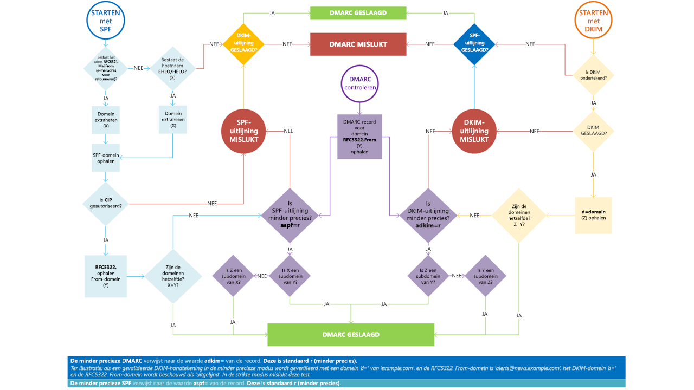

# <a name="use-dmarc-to-validate-email"></a>DMARC gebruiken om e-mail te valideren

[!INCLUDE [Microsoft 365 Defender rebranding](../includes/microsoft-defender-for-office.md)]


[DMARC](https://dmarc.org) (Domain-based Message Authentication, Reporting, and Conformance) werkt samen met SPF (Sender Policy Framework) en DKIM (DomainKeys Identified Mail) om afzenders van e-mail te verifiëren en ervoor te zorgen dat geadresseerde e-mailsystemen berichten vertrouwen die vanuit uw domein worden verzonden. De implementatie van DMARC met SPF en DKIM biedt extra bescherming tegen adresvervalsing en phishing-email. DMARC helpt ontvangende e-mailsystemen vast te stellen wat er moet gebeuren met berichten die zijn verzonden vanuit uw domein die niet door de SPF- en DKIM-controles komen.

> [!TIP]
> Ga naar de catalogus van [Microsoft Intelligent Security Association (MISA)](https://www.microsoft.com/misapartnercatalog) om externe leveranciers te bekijken die DMARC-rapportage bieden voor Microsoft 365.

## <a name="how-do-spf-and-dmarc-work-together-to-protect-email-in-microsoft-365"></a>Hoe werken SPF en DMARC samen om e-mail in Microsoft 365 te beschermen?

 Een e-mailbericht kan meerdere eigenaren, afzenders of adressen bevatten. Deze adressen worden gebruikt voor verschillende doeleinden. Neem bijvoorbeeld deze adressen:

- **'E-mail van'-adres**: identificeert de afzender en specificeert waarnaartoe kennisgevingen moeten worden verzonden als er zich problemen voordoen met de aflevering van het bericht, zoals kennisgeving dat het niet is bezorgd.  Dit verschijnt in het envelopgedeelte van een e-mailbericht en wordt gewoonlijk niet weergegeven door uw e-mailtoepassing. Dit wordt ook wel het 5321.MailFrom-adres of het omgekeerde-padadres genoemd.

- **'Van'-adres**: het adres dat wordt weergegeven als het Van-adres door uw e-mailtoepassing. Dit adres identificeert de auteur van de e-mail. Dat wil zeggen, het postvak van de persoon of het systeem dat verantwoordelijk is voor het schrijven van het bericht. Dit wordt ook wel een het 5322.From-adres genoemd.

SPF gebruikt een DNS TXT-record om een lijst weer te geven van gemachtigde IP-verzendadressen voor een bepaald domein. Normaalgesproken worden SPF-controles alleen uitgevoerd op het 5321.MailFrom-adres. Dit betekent dat het 5322.From-adres niet wordt geverifieerd wanneer u alleen SPF zelf gebruikt. Hierdoor is een scenario mogelijk dat een gebruiker een bericht ontvangt dat door een SPF-controle komt, maar een vervalst 5322.From-afzenderadres heeft. Bekijk bijvoorbeeld het volgende SMTP-transcript:

```console
S: Helo woodgrovebank.com
S: Mail from: phish@phishing.contoso.com
S: Rcpt to: astobes@tailspintoys.com
S: data
S: To: "Andrew Stobes" <astobes@tailspintoys.com>
S: From: "Woodgrove Bank Security" <security@woodgrovebank.com>
S: Subject: Woodgrove Bank - Action required
S:
S: Greetings User,
S:
S: We need to verify your banking details.
S: Please click the following link to verify that we have the right information for your account.
S:
S: https://short.url/woodgrovebank/updateaccount/12-121.aspx
S:
S: Thank you,
S: Woodgrove Bank
S: .
```

In dit transcript zijn de afzenderadressen als volgt:

- E-mail van-adres (5321.MailFrom): phish@phishing.contoso.com

- Van-adres (5322.From): security@woodgrovebank.com

Als u SPF hebt geconfigureerd, voert de ontvangende server een controle uit op het E-mail van-adres Phish@phishing.contoso.com. Als het bericht afkomstig is van een geldige bron voor het domein phishing.contoso.com, is de SPF-controle geslaagd. Aangezien de e-mailclient alleen het Van-adres weergeeft, ziet de gebruiker dat het bericht afkomstig is van security@woodgrovebank.com. Met alleen SPF, is de geldigheid van woodgrovebank.com nooit geverifieerd.

Wanneer u DMARC gebruikt, wordt er door de ontvangende server ook een controle uitgevoerd tegen het Van-adres. Als er in het bovenstaande voorbeeld een DMARC TXT-record voor woodgrovebank.com voorkomt, mislukt de controle op het Van-adres.

## <a name="what-is-a-dmarc-txt-record"></a>Wat is een DMARC TXT-record?

Net zoals DNS-records voor SPF, is het DMARC-record een DNS-tekstrecord (TXT) dat adresvervalsing en phishing helpt voorkomen. U publiceert DMARC TXT-records in DNS. DMARC TXT-records valideren de oorsprong van e-mailberichten door het IP-adres van de auteur van een e-mail met de zogenaamde eigenaar van het verzendende domein te verifiëren. Het DMARC TXT-record identificeert gemachtigde uitgaande e-mailservers. Doele-mailsystemen kunnen dan verifiëren dat de berichten die ze ontvangen afkomstig zijn van gemachtigde uitgaande e-mailservers.

Een DMARC TXT-record van Microsoft ziet er ongeveer als volgt uit:

```console
_dmarc.microsoft.com.   3600    IN      TXT     "v=DMARC1; p=none; pct=100; rua=mailto:d@rua.agari.com; ruf=mailto:d@ruf.agari.com; fo=1"
```

Microsoft zendt DMARC-rapporten naar [Agari](https://agari.com), een derde. Agari verzamelt en analyseert DMARC-rapporten. Ga naar de [MISA-catalogus](https://www.microsoft.com/misapartnercatalog) om meer externe leveranciers te bekijken die DMARC-rapportage bieden voor Microsoft 365.

## <a name="implement-dmarc-for-inbound-mail"></a>DMARC implementeren voor inkomende e-mail

U hoeft niets te doen om DMARC in te stellen voor e-mail die u ontvangt in Microsoft 365. Wij hebben overal al voor gezorgd. Zie [Hoe Microsoft 365 omgaat met inkomende e-mail waarvan de DMARC-controle mislukt](#how-microsoft-365-handles-inbound-email-that-fails-dmarc) als u wilt weten wat er gebeurt met e-mail die niet door onze DMARC-controle komt.

## <a name="implement-dmarc-for-outbound-mail-from-microsoft-365"></a>DMARC implementeren voor uitgaande e-mail vanuit Microsoft 365

Als u Microsoft 365 gebruikt, maar geen aangepast domein, dat wil zeggen dat u onmicrosoft.com gebruikt, hoeft u niets anders te doen om DMARC voor uw organisatie te configureren of te implementeren. SPF is al voor u ingesteld en Microsoft 365 genereert automatisch een DKIM-handtekening voor uw uitgaande e-mail. Zie [Standaardgedrag voor DKIM en Microsoft 365](use-dkim-to-validate-outbound-email.md#DefaultDKIMbehavior) voor meer informatie over deze handtekening.

 Als u een aangepast domein hebt of als u on-premises Exchange-servers gebruikt naast Microsoft 365, moet u handmatig DMARC implementeren voor uw uitgaande e-mail. Het implementeren van DMARC voor uw aangepaste domein bestaat uit de volgende stappen:

- [Stap 1: geldige bronnen van e-mail identificeren voor uw domein](#step-1-identify-valid-sources-of-mail-for-your-domain)

- [Stap 2: SPF instellen voor uw domein](#step-2-set-up-spf-for-your-domain)

- [Stap 3: DKIM instellen voor uw aangepaste domein](#step-3-set-up-dkim-for-your-custom-domain)

- [Stap 4: het DMARC TXT-record maken voor uw domein](#step-4-form-the-dmarc-txt-record-for-your-domain)

### <a name="step-1-identify-valid-sources-of-mail-for-your-domain"></a>Stap 1: geldige bronnen van e-mail identificeren voor uw domein

Als u SPF al hebt ingesteld, hebt u deze stap al doorlopen. Voor DMARC zijn er echter aanvullende aandachtspunten. Bij het identificeren van bronnen van e-mail voor uw domein, zijn er twee vragen die u moet beantwoorden:

- Welke IP-adressen verzenden e-mailberichten vanuit mijn domein?

- Komen de 5321.MailFrom- en 5322.From-domeinen overeen voor e-mail die namens u door derden wordt verzonden.

### <a name="step-2-set-up-spf-for-your-domain"></a>Stap 2: SPF instellen voor uw domein

Nu u een lijst hebt met alle geldige afzenders, kunt u de stappen volgen in [SPF instellen om adresvervalsing te helpen voorkomen](set-up-spf-in-office-365-to-help-prevent-spoofing.md).

Ervan uitgaande dat contoso.com bijvoorbeeld e-mail verzendt van Exchange Online, een on-premises Exchange-server met IP-adres 192.168.0.1 en een webtoepassing met IP-adres 192.168.100.100, dan ziet het SPF TXT-record er als volgt uit:

```console
contoso.com  IN  TXT  " v=spf1 ip4:192.168.0.1 ip4:192.168.100.100 include:spf.protection.outlook.com -all"
```

Het is een goed idee ervoor te zorgen dat uw SPF TXT-record rekening houdt met afzenders van derden.

### <a name="step-3-set-up-dkim-for-your-custom-domain"></a>Stap 3: DKIM instellen voor uw aangepaste domein

Als u SPF hebt ingesteld, moet u DKIM instellen. Met DKIM kunt u een digitale handtekening toevoegen aan e-mailberichten in de berichtkop. Als u DKIM niet instelt en in plaats daarvan Microsoft 365 toestaat de standaard-DKIM-configuratie van uw domein te gebruiken, kan de DMARC-controle mislukken. Dat komt, omdat de standaard-DKIM-configuratie uw initiële onmicrosoft.com-domein gebruikt als het 5322.From-adres, niet uw aangepaste domein. Dit zorgt ervoor dat de 5321.MailFrom- en 5322.From-adressen niet overeenkomen in alle e-mails die worden verzonden vanuit uw domein.

Als u derden hebt die namens u e-mail verzenden en in de e-mail die ze verzenden de 5321.MailFrom- en 5322.From-adressen niet overeenkomen, mislukt de DMARC-controle voor die e-mail. Om dit te voorkomen, moet u DKIM instellen voor uw domein met specifiek die derde. Hiermee kan Microsoft 365 e-mail van deze derde verifiëren. Hiermee kunnen echter ook anderen, zoals Yahoo, Gmail en Comcast aan hun verzonden e-mail verifiëren van de derde alsof die door u is verzonden. Dat is handig, omdat klanten vertrouwen kunnen opbouwen met uw domein, ongeacht waar hun postvak zich bevindt en tegelijkertijd zal Microsoft 365 een bericht niet markeren als spam vanwege adresvervalsing, omdat het slaagt voor de verificatiecontroles voor uw domein.

Zie [DKIM gebruiken voor het valideren van uitgaande e-mail die is verzonden vanuit uw aangepaste domein](use-dkim-to-validate-outbound-email.md) voor instructies over het instellen van DKIM voor uw domein, inclusief het instellen van DKIM voor derden zodat ze uw adres kunnen nabootsen.

### <a name="step-4-form-the-dmarc-txt-record-for-your-domain"></a>Stap 4: het DMARC TXT-record maken voor uw domein

Dit zijn de meestgebruikte opties voor Microsoft 365, hoewel er ook andere syntaxis-opties zijn die hier niet worden genoemd. Maak het DMARC TXT-record voor uw domein in de indeling:

```console
_dmarc.domain  TTL  IN  TXT  "v=DMARC1; p=policy; pct=100"
```

waarbij:

- *domein* is het domein dat u wilt beveiligen. Standaard beschermt het record e-mail van het domein en alle subdomeinen. Als u bijvoorbeeld \_dmarc.contoso.com opgeeft, beschermt DMARC e-mail van het domein en alle subdomeinen, zoals housewares.contoso.com of plumbing.contoso.com.

- *TTL* moet altijd het equivalent van één uur zijn. De eenheid die wordt gebruikt voor TTL is, afhankelijk van de registrar voor uw domein, uren (1 uur), minuten (60 minuten) of seconden (3600 seconden).

- *pct=100* geeft aan dat deze regel moet worden gebruikt voor 100 % van de e-mails.

- *beleid* geeft aan welk beleid moet worden gevolgd door de ontvangende server als de DMARC-controle mislukt. U kunt het beleid instellen op geen, quarantaine of weigeren.

Raak vertrouwd met [Aanbevolen procedures voor implementeren van DMARC in Microsoft 365](#best-practices-for-implementing-dmarc-in-microsoft-365) voor meer informatie over de opties die u kunt gebruiken.

Voorbeelden:

- Beleid ingesteld op geen

    ```console
    _dmarc.contoso.com 3600 IN  TXT  "v=DMARC1; p=none"
    ```

- Beleid ingesteld op quarantaine

    ```console
    _dmarc.contoso.com 3600 IN  TXT  "v=DMARC1; p=quarantine"
    ```

- Beleid ingesteld op weigeren

    ```console
    _dmarc.contoso.com  3600 IN  TXT  "v=DMARC1; p=reject"
    ```

Wanneer u het record hebt gemaakt, moet u het record bij uw domeinregistrar bijwerken. Zie [DNS-records voor Microsoft 365 maken wanneer u uw DNS-records beheert](https://docs.microsoft.com/microsoft-365/admin/get-help-with-domains/create-dns-records-at-any-dns-hosting-provider) voor instructies over het toevoegen van het DMARC TXT-record aan uw DNS-records voor Microsoft 365.

## <a name="best-practices-for-implementing-dmarc-in-microsoft-365"></a>Aanbevolen procedures voor implementatie van DMARC in Microsoft 365

U kunt DMARC geleidelijk implementeren zonder gevolgen voor de rest van uw e-mailstroom. Maak en implementeer een planning die de deze stappen volgt. Voer elk van deze stappen eerst uit met een subdomein, dan andere subdomeinen en ten slotte met het hoofddomein in uw organisatie voordat u doorgaat met de volgende stap.

1. De impact van de implementatie van DMARC bewaken

    Begin met een eenvoudig controlemodusrecord voor een subdomein of domein dat DMARC-ontvangers verzoekt u statistieken te sturen over berichten die zij zien als ze dat domein gebruiken. Een controlemodusrecord is een DMARC TXT-record waarvan het beleid is ingesteld op geen (p=geen). Veel bedrijven publiceren een DMARC TXT-record met p=geen, omdat ze niet zeker weten hoeveel e-mail er verloren kan gaan door het publiceren van een meer beperkend DMARC-beleid.

    U kunt dit zelfs doen voordat u SPF of DKIM hebt geïmplementeerd in uw berichteninfrastructuur. U kunt echter niet effectief berichten in quarantaine plaatsen of weigeren door DMARC te gebruiken, totdat u ook SPF en DKIM implementeert. Wanneer u SPF en DKIM introduceert, zullen de rapporten die door DMARC worden gegenereerd de aantallen en bronnen bieden van berichten die wel en niet door de controles komen.  U kunt eenvoudig zien hoeveel van uw legitieme verkeer wel of niet hierdoor wordt gedekt en eventuele problemen oplossen. U zult ook zien hoeveel frauduleuze berichten er worden verzonden en waarvandaan.

2. Verzoeken dat externe e-mailsystemen e-mail waarvan de DMARC-controle mislukt in quarantaine plaatsen 

    Als u gelooft dat alle of het meeste van uw legitieme verkeer wordt beschermd door SPF en DKIM en u de consequenties van de implementatie van DMARC begrijpt, kunt u quarantainebeleid implementeren. Quarantainebeleid is een DMARC TXT-record waarvan het beleid is ingesteld op quarantaine (p=quarantaine). Door dit te doen, vraagt u DMARC-ontvangers berichten van uw domein, waarvan de DMARC-controle is mislukt, in het lokale equivalent van een spammap te plaatsen in plaats van in de postvakken van uw klanten.

3. Verzoeken dat externe e-mailsystemen geen berichten accepteren waarvan de DMARC-controle is mislukt

    De laatste stap is het implementeren van weigeringsbeleid. Weigeringsbeleid is een DMARC TXT-record waarvan het beleid is ingesteld op weigeren (p=weigeren). Wanneer u dit doet, vraagt u DMARC-ontvangers geen berichten te accepteren waarvan de DMARC-controle is mislukt.
    
4. DMARC instellen voor subdomein

DMARC wordt geïmplementeerd door beleid te publiceren als TXT-record in DNS en is hiërarchisch (beleid dat is gepubliceerd voor contoso.com is bijvoorbeeld van toepassing op sub.domain.contoso.com, tenzij voor het subdomein expliciet ander beleid is bepaald). Dit is handig, want organisaties kunnen zo een kleiner aantal DMARC-records op hoog niveau afgeven voor een bredere dekking. Het is belangrijk expliciete DMARC-records voor subdomeinen te configureren wanneer u niet wilt dat de subdomeinen de DMARC-record van het hoogste niveau overnemen.

U kunt ook beleid met een jokerteken toevoegen voor DMARC wanneer subdomeinen geen e-mail mogen verzenden door de waarde `sp=reject` toe te voegen. Bijvoorbeeld:

```console
_dmarc.contoso.com. TXT "v=DMARC1; p=reject; sp=reject; ruf=mailto:authfail@contoso.com; rua=mailto:aggrep@contoso.com"
```

## <a name="how-microsoft-365-handles-outbound-email-that-fails-dmarc"></a>Hoe Microsoft 365 omgaat met uitgaande e-mail waarvan de DMARC-controle is mislukt

Als er door Microsoft 365 een bericht wordt verzonden waarvan de DMARC-controle mislukt en u hebt het beleid ingesteld op p=quarantaine of p=weigeren, wordt het bericht gerouteerd door de [Afleveringsgroep met hoog risico voor uitgaande berichten](high-risk-delivery-pool-for-outbound-messages.md). Het is niet mogelijk het beleid voor uitgaande e-mail te negeren.

Als u DMARC-weigeringsbeleid publiceert (p=weigeren), kan geen enkele andere klant in Microsoft 365 uw domein nabootsen, omdat berichten niet door de SPF- of DKIM-controles komen voor uw domein wanneer ze een uitgaand bericht verzenden via de service. Als u echter DMARC-weigeringsbeleid publiceert, maar niet al uw e-mail laat verifiëren door Microsoft 365, kunnen bepaalde berichten worden gemarkeerd als spam voor inkomende e-mail (zoals hierboven beschreven) of geweigerd als u geen SPF publiceert en dit wil doorgeven via de service. Dit is bijvoorbeeld het geval als u bepaalde IP-adressen voor servers en apps die e-mail zenden namens uw domein vergeet op te nemen wanneer u uw DMARC TXT-record maakt.

## <a name="how-microsoft-365-handles-inbound-email-that-fails-dmarc"></a>Hoe Microsoft 365 omgaat met inkomende e-mail waarvan de DMARC-controle is mislukt

Als het DMARC-beleid van de verzendende server `p=reject` is, markeert [Exchange Online Protection](exchange-online-protection-overview.md) (EOP) het bericht als spoof in plaats van het te weigeren. Met andere woorden, Microsoft 365 behandelt `p=reject` en `p=quarantine` voor inkomende e-mails op dezelfde manier. Beheerders kunnen binnen het [anti-phishing-beleid](set-up-anti-phishing-policies.md) de actie definiëren die moet worden uitgevoerd voor berichten die worden geclassificeerd als spoof.

Microsoft 365 is zo geconfigureerd, omdat van bepaalde legitieme e-mail de DMARC-controle mogelijk mislukt.  De DMARC-controle van een bericht kan bijvoorbeeld mislukken als het wordt verzonden naar een adressenlijst die vervolgens het bericht doorstuurt naar alle deelnemers aan die lijst. Als deze berichten door Microsoft 365 worden geweigerd, kunnen gebruikers legitieme e-mail kwijtraken zonder die te kunnen herstellen. In plaats hiervan zal de DMARC-controle van deze berichten nog steeds mislukken, maar worden ze gemarkeerd als spam en niet geweigerd. Indien gewenst, kunnen gebruikers deze berichten nog steeds in hun postvak krijgen via de volgende methoden:

- Gebruikers voegen veilige afzenders afzonderlijk toe in hun e-mailclient.

- Beheerders kunnen de [Spoof Intelligence](learn-about-spoof-intelligence.md) bijwerken om de adresvervalsing toe te staan.

- Beheerders maken een Exchange-e-mailstroom (ook wel transportregel genoemd) voor alle gebruikers die berichten van die bepaalde afzenders toestaan.

Zie [Lijsten met veilige afzenders maken](create-safe-sender-lists-in-office-365.md) voor meer informatie.

## <a name="how-microsoft-365-utilizes-authenticated-received-chain-arc"></a>Hoe Microsoft 365 ARC (Authenticated Received Chain) gebruikt

Alle in Microsoft 365 gehoste e-mail heeft nu het voordeel van ARC met verbeterde aflevering van berichten en uitgebreide bescherming tegen adresvervalsing. Met ARC worden de verificatieresultaten van e-mail behouden van alle deelnemende intermediairs, of haltes, wanneer een e-mail vanaf de oorspronkelijke server wordt gestuurd naar het postvak van de geadresseerde.  De wijzigingen die door intermediairs werden uitgevoerd in e-mailroutering, zoals doorstuurregels of automatische handtekeningen, konden voor ARC leiden tot DMARC-fouten wanneer de e-mail het postvak van de geadresseerde bereikte. Met ARC kan Microsoft 365 de echtheid van de afzender van een e-mail verifiëren dankzij het cryptografische behoud van de verificatieresultaten.

Microsoft 365 gebruikt momenteel ARC om verificatieresultaten te controleren wanneer Microsoft de ARC-sealer is, maar in de toekomst worden derde ARC-sealers ook ondersteund.

## <a name="troubleshooting-your-dmarc-implementation"></a>Problemen oplossen met uw DMARC-implementatie

Als u de MX-records van uw domein zo hebt geconfigureerd dat EOP niet het eerste item is, worden DMARC-fouten niet afgedwongen voor uw domein.

Als u een klant bent en het primaire MX-record van uw domein verwijst niet naar EOP, krijgt u niet de voordelen van DMARC. DMARC werkt bijvoorbeeld niet als uw MX-record verwijst naar uw on-premises mailserver en de e-mail dan routeert naar EOP via een connector. In dit scenario is het ontvangende domein een van uw geaccepteerde domeinen, maar is EOP niet de primaire MX. Stel bijvoorbeeld dat contoso.com het MX-record naar zichzelf laat verwijzen en EOP gebruikt als secundair MX-record, dan ziet het MX-record van contoso.com er als volgt uit:

```console
contoso.com     3600   IN  MX  0  mail.contoso.com
contoso.com     3600   IN  MX  10 contoso-com.mail.protection.outlook.com
```

Alle, of de meeste, e-mail zal eerst worden gerouteerd naar mail.contoso.com, omdat dat de primaire MX is en vervolgens wordt de e-mail gerouteerd naar EOP. In bepaalde gevallen vermeldt u mogelijk niet eens EOP als een MX-record en koppelt u gewoon connectors om uw e-mail te routeren. EOP hoeft niet de eerste vermelding te zijn om DMARC-validatie te kunnen uitvoeren. Het garandeert de validatie, omdat we niet zeker kunnen weten dat alle on-premises/niet-O365-servers DMARC-controles uitvoeren.  Het afdwingen van DMARC voor het domein (niet de server) van een klant is beschikbaar wanneer u het DMARC TXT-record instelt, maar de ontvangende server voert de handhaving daadwerkelijk uit.  Als u EOP instelt als ontvangende server, voert EOP de DMARC-handhaving uit.



## <a name="for-more-information"></a>Voor meer informatie

Meer informatie over DMARC? Deze informatiebronnen kunnen u hiermee helpen.

- [Antispamberichtkoppen](anti-spam-message-headers.md) bevatten onder meer de syntaxis en koptekstvelden die door Microsoft 365 worden gebruikt voor DMARC-controles.

- Maak gebruik van de [DMARC Trainingsserie](https://www.m3aawg.org/activities/training/dmarc-training-series) van M <sup>3</sup>AAWG (Messaging, Malware, Mobile Anti-Abuse Working Group).

- Gebruik de controlelijst op [dmarcian](https://space.dmarcian.com/deployment/).

- Ga rechtstreeks naar de bron op [DMARC.org](https://dmarc.org).

## <a name="see-also"></a>Zie ook

[Hoe Microsoft 365 SPF (Sender Policy Framework) gebruikt om adresvervalsing te voorkomen](how-office-365-uses-spf-to-prevent-spoofing.md)

[SPF in Microsoft 365 instellen om adresvervalsing te helpen voorkomen](set-up-spf-in-office-365-to-help-prevent-spoofing.md)

[DKIM gebruiken om uitgaande e-mail te valideren die wordt verzonden vanuit uw aangepaste domein in Microsoft 365](use-dkim-to-validate-outbound-email.md)
