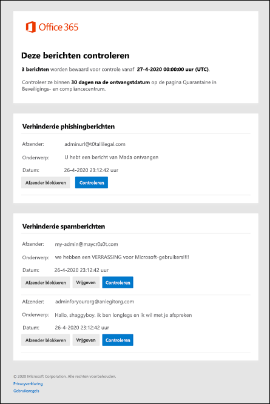

# Spammeldingen van gebruikers gebruiken om in quarantaine geplaatste berichten vrij te geven en te rapporterenUse user spam notifications to release and report quarantined messages

In Microsoft 365-organisaties met postvakken in Exchange Online- of zelfstandige Exchange Online Protection-organisaties (EOP) zonder Exchange Online-postvakken, bevat quarantaine potentieel gevaarlijke of ongewenste berichten.In Microsoft 365 organizations with mailboxes in Exchange Online or standalone Exchange Online Protection (EOP) organizations without Exchange Online mailboxes, quarantine holds potentially dangerous or unwanted messages. Zie [In quarantaine geplaatste berichten in EOP](quarantine-email-messages.md)voor meer informatie.For more information, see [Quarantined messages in EOP](quarantine-email-messages.md).

Standaard worden spammeldingen van eindgebruikers uitgeschakeld in het antispambeleid.By default, end-user spam notifications are disabled in anti-spam policies. Wanneer een beheerder [spammeldingen van eindgebruikers inschakelt,](configure-your-spam-filter-policies.md#configure-end-user-spam-notifications)ontvangen ontvangers periodieke meldingen over hun berichten die in quarantaine zijn geplaatst als spam, bulke-mail of (vanaf april 2020) phishing.When an admin [enables end-user spam notifications](configure-your-spam-filter-policies.md#configure-end-user-spam-notifications), recipients will receive periodic notifications about their messages that were quarantined as spam, bulk email, or (as of April 2020) phishing.

> [!NOTE]
> Berichten die in quarantaine zijn geplaatst als phishing, malware of door regels voor e-mailstromen (ook wel transportregels genoemd) zijn alleen beschikbaar voor beheerders.Messages that were quarantined as high confidence phishing, malware, or by mail flow rules (also known as transport rules) are only available to admins. Zie [In quarantaine geplaatste berichten en bestanden beheren als beheerder in EOP](manage-quarantined-messages-and-files.md)voor meer informatie.For more information, see [Manage quarantined messages and files as an admin in EOP](manage-quarantined-messages-and-files.md).

Een spammelding voor eindgebruikers bevat de volgende informatie voor elk in quarantaine geplaatst bericht:An end-user spam notification contains the following information for each quarantined message:

- **Afzender:** de verzendnaam en het e-mailadres van het in quarantaine geplaatste bericht.**Sender**: The send name and email address of the quarantined message.

- **Onderwerp:** De onderwerpregeltekst van het in quarantaine geplaatste bericht.**Subject**: The subject line text of the quarantined message.

- **Datum**: De datum en tijd (in UTC) dat het bericht in quarantaine is geplaatst.**Date**: The date and time (in UTC) that the message was quarantined.

- **Afzender blokkeren:** klik op deze koppeling om de afzender toe te voegen aan de lijst Geblokkeerde afzenders.**Block Sender**: Click this link to add the sender to your Blocked Senders list. Zie [Een e-mailafzender blokkeren in Outlook](https://support.office.com/article/b29fd867-cac9-40d8-aed1-659e06a706e4)voor meer informatie.For more information, see [Block a mail sender in Outlook](https://support.office.com/article/b29fd867-cac9-40d8-aed1-659e06a706e4).

- **Release:** Voor spam (niet phish) berichten, u het bericht hier vrijgeven zonder naar Quarantaine de Security & Compliance Center.**Release**: For spam (not phish) messages, you can release the message here without going to Quarantine the Security & Compliance Center.

- **Controle:** Klik op deze link om naar Quarantaine te gaan in het Security & Compliance Center, waar u uw in quarantaine geplaatste berichten vrijgeven, verwijderen of rapporteren.**Review**: Click this link to go to Quarantine in the Security & Compliance Center, where you can release, delete or report your quarantined messages. Zie [In quarantaine geplaatste berichten zoeken en vrijgeven als gebruiker in EOP](find-and-release-quarantined-messages-as-a-user.md)voor meer informatie.For more information, see [Find and release quarantined messages as a user in EOP](find-and-release-quarantined-messages-as-a-user.md).

