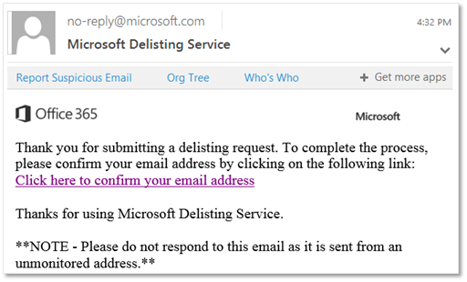

# De delist-portal gebruiken om uzelf uit de lijst met geblokkeerde afzenders te verwijderenUse the delist portal to remove yourself from the blocked senders list

Krijgt u een foutmelding wanneer u een e-mail probeert te sturen naar een ontvanger wiens e-mailadres in Microsoft 365 staat?Are you getting an error message when you try to send an email to a recipient whose email address is in Microsoft 365? Als u denkt dat u het foutbericht niet moet ontvangen, u de pagina verwijderen om uzelf uit de lijst met geblokkeerde afzenders te verwijderen.If you think you should not be receiving the error message, you can use the delist portal to remove yourself from the blocked senders list.

## Wat is de lijst met geblokkeerde afzenders?What is the blocked senders list?

Microsoft gebruikt de lijst met geblokkeerde afzenders om zijn klanten te beschermen tegen spam-, spoofing- en phishing-aanvallen.Microsoft uses the blocked senders list to protect its customers from spam, spoofing, and phishing attacks. Het IP-adres van uw e-mailserver, dat wil zeggen het adres dat uw e-mailserver gebruikt om zich op internet te identificeren, is om verschillende redenen getagd als een potentiële bedreiging voor Microsoft 365.Your mail server's IP address, that is, the address your mail server uses to identify itself on the Internet, was tagged as a potential threat to Microsoft 365 for one of a variety of reasons. Wanneer Microsoft 365 het IP-adres aan de lijst toevoegt, voorkomt dit alle verdere communicatie tussen het IP-adres en een van onze klanten via onze datacenters.When Microsoft 365 adds the IP address to the list, it prevents all further communication between the IP address and any of our customers through our datacenters.

U weet dat u aan de lijst bent toegevoegd wanneer u een antwoord op een e-mailbericht ontvangt met een fout die er ongeveer als volgt uitziet:You will know you have been added to the list when you receive a response to a mail message that includes an error that looks something like this:

> 550 5.7.606-649 Access geweigerd, verboden verzenden van IP [_IP-adres_]; Om verwijdering van deze lijst aan te vragen, u https://sender.office.com/ terecht op de aanwijzingen en de aanwijzingen volgen.550 5.7.606-649 Access denied, banned sending IP [_IP address_]; To request removal from this list please visit https://sender.office.com/ and follow the directions. Zie Rapporten [over niet-levering e-mailen in Exchange Online](https://docs.microsoft.com/Exchange/mail-flow-best-practices/non-delivery-reports-in-exchange-online/non-delivery-reports-in-exchange-online)voor meer informatie.For more information see [Email non-delivery reports in Exchange Online](https://docs.microsoft.com/Exchange/mail-flow-best-practices/non-delivery-reports-in-exchange-online/non-delivery-reports-in-exchange-online).

waarbij _IP-adres_ het IP-adres is van de computer waarop de e-mailserver wordt uitgevoerd.where  _IP address_ is the IP address of the computer on which the mail server runs.

### Delist-portal gebruiken om uzelf uit de lijst met geblokkeerde afzenders te verwijderenTo use delist portal to remove yourself from the blocked senders list

1. Ga in een webbrowser naar [https://sender.office.com](https://sender.office.com) .In a web browser, go to [https://sender.office.com](https://sender.office.com).

2. Volg de instructies op de pagina.Follow the instructions on the page. Zorg ervoor dat u het e-mailadres gebruikt waarop het foutbericht is verzonden en het IP-adres dat is opgegeven in het foutbericht.Ensure that you use the email address to which the error message was sent, and the IP address that is specified in the error message. U slechts één e-mailadres en één IP-adres per bezoek invoeren.You can only enter one email address and one IP address per visit.

3. Klik **op Verzenden**.Click **Submit**.

    De portal stuurt een e-mail naar het e-mailadres dat u aangeeft.The portal sends an email to the email address that you supply. De e-mail ziet er ongeveer als volgt uit: The email will look something like the following: 

4. Klik op de bevestigingslink in de e-mail die u door de schrappingsportal is verzonden.Click the confirmation link in the email sent to you by the delisting portal.

    Dit brengt je terug naar de schrappingsportaal.This brings you back to the delist portal.

5. Klik in de schrappingsportal op **IP schrappen**.In the delist portal, click **Delist IP**.

    Nadat het IP-adres uit de lijst met geblokkeerde afzenders is verwijderd, worden e-mailberichten van dat IP-adres bezorgd aan ontvangers die Microsoft 365 gebruiken.After the IP address is removed from the blocked senders list, email messages from that IP address will be delivered to recipients who use Microsoft 365. Zorg er dus voor dat je er zeker van bent dat e-mail die vanaf dat IP-adres wordt verzonden, niet beledigend of kwaadaardig is; anders kan het IP-adres opnieuw worden geblokkeerd.So, make sure you're confident that email sent from that IP address won't be abusive or malicious; otherwise, the IP address might be blocked again.

    > [!NOTE]
    > Het kan tot 24 uur duren of de resultaten kunnen sterk variëren voordat beperkingen worden verwijderd.It may take up to 24 hours or results can vary widely before restrictions are removed.

[Zie Veilige afzenderlijsten maken in EOP-](create-safe-sender-lists-in-office-365.md) en [Uitgaande spambeveiliging in EOP](outbound-spam-controls.md) om te voorkomen dat een IP-adres wordt geblokkeerd.See [Create safe sender lists in EOP](create-safe-sender-lists-in-office-365.md) and [Outbound spam protection in EOP](outbound-spam-controls.md) to prevent an IP from being blocked.
