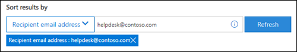

# <a name="view-and-release-quarantined-messages-from-shared-mailboxes"></a>In quarantaine geplaatste berichten van gedeelde postvakken weergeven en vrijgeven

> [!NOTE]
> De functies die in dit artikel worden beschreven, zijn momenteel in de Preview-versie beschikbaar, zijn niet voor iedereen beschikbaar en kunnen worden gewijzigd.

Gebruikers kunnen in quarantaine geplaatste berichten beheren als ze een van de geadresseerden zijn, zoals beschreven in berichten in quarantaine zoeken en als gebruiker [in EOP vrijgeven.](find-and-release-quarantined-messages-as-a-user.md) Maar hoe zit het met gedeelde postvakken waarvoor de gebruiker de machtiging Volledige toegang en Verzenden als of Verzenden namens heeft voor het postvak, zoals wordt beschreven in Gedeelde postvakken [in Exchange Online?](https://docs.microsoft.com/exchange/collaboration-exo/shared-mailboxes)

Voorheen was de mogelijkheid voor gebruikers om in quarantaine geplaatste berichten te beheren die naar een gedeeld postvak zijn verzonden, vereist dat beheerders automatisch toewijzen ingeschakeld laten voor het gedeelde postvak (dit is standaard ingeschakeld wanneer een beheerder een gebruiker toegang geeft tot een ander postvak). Afhankelijk van de grootte en het aantal postvakken dat de gebruiker kan gebruiken,  kan dit echter de prestaties beïnvloeden als Outlooks probeert alle postvakken te openen die de gebruiker toegang heeft. Daarom kiezen veel beheerders ervoor om automatisch toewijzen voor gedeelde postvakken [te verwijderen.](https://docs.microsoft.com/outlook/troubleshoot/profiles-and-accounts/remove-automapping-for-shared-mailbox)

AutoMapping is nu niet meer vereist voor gebruikers om in quarantaine geplaatste berichten te beheren die naar gedeelde postvakken zijn verzonden. Het werkt gewoon. Er zijn twee verschillende methoden om in quarantaine geplaatste berichten te openen die naar een gedeeld postvak zijn verzonden:

- Als de beheerder [spammeldingen](configure-your-spam-filter-policies.md) voor eindgebruikers heeft ingeschakeld in antispambeleid, kan elke gebruiker die toegang heeft  tot de spammeldingen voor eindgebruikers in het gedeelde postvak, op de knop Controleren in de melding klikken om in quarantaine te gaan in het beveiligings- &-compliancecentrum. Met deze methode kunnen gebruikers alleen in quarantaine geplaatste berichten beheren die naar het gedeelde postvak zijn verzonden. Gebruikers kunnen hun eigen quarantaineberichten niet beheren in deze context.

- De gebruiker kan [naar de quarantaine gaan in het & Compliancecentrum.](find-and-release-quarantined-messages-as-a-user.md) Standaard worden alleen berichten weergegeven die naar de gebruiker zijn verzonden. De gebruiker kan de resultaten van  sorteren **(de** knop Bericht-id standaard) echter wijzigen in  het e-mailadres geadresseerde, het e-mailadres van het gedeelde postvak invoeren en vervolgens op Vernieuwen klikken om de in quarantaine geplaatste berichten te zien die naar het gedeelde postvak zijn verzonden.

  

Ongeacht de methode kunnen gebruikers verwarring voorkomen door de kolom **Geadresseerde** voor berichten in quarantaine op te nemen. Het maximum aantal weer te geven kolommen is 7. De gebruiker moet dus op Kolommen wijzigen  **klikken,** een  bestaande kolom verwijderen (bijvoorbeeld Beleidstype), Geadresseerde selecteren en vervolgens op Opslaan of Opslaan als standaard **klikken.**

  

## <a name="things-to-keep-in-mind"></a>Dingen waar u rekening mee moet houden

- De eerste gebruiker die in quarantaine wordt geplaatst, bepaalt het samenslot van het bericht voor iedereen die het gedeelde postvak gebruikt. Als een gedeeld postvak bijvoorbeeld door tien gebruikers wordt gebruikt en een gebruiker besluit het quarantainebericht te verwijderen, wordt het bericht voor alle tien gebruikers verwijderd. Evenzo geldt dat als een gebruiker besluit het bericht vrij te geven, dit wordt vrijgegeven aan het gedeelde postvak en toegankelijk is voor alle andere gebruikers van het gedeelde postvak.

- Momenteel is de **knop Afzender blokkeren** niet beschikbaar in de flyout **Details** voor berichten in quarantaine die naar het gedeelde postvak zijn verzonden.

- Als u in quarantaine geplaatste berichten voor het gedeelde postvak in [Exchange Online PowerShell](https://docs.microsoft.com/powershell/exchange/connect-to-exchange-online-powershell)wilt beheren, moet de eindgebruiker de cmdlet [Get-QuarantineMessage](https://docs.microsoft.com/powershell/module/exchange/get-quarantinemessage) gebruiken met het e-mailadres van het gedeelde postvak voor de waarde van de parameter _RecipientAddress_ om de berichten te identificeren. Bijvoorbeeld:

  ```powershell
  Get-QuarantinedMessage -RecipientAddress officeparty@contoso.com
  ```

  Vervolgens kan de eindgebruiker een in quarantaine geplaatst bericht selecteren in de lijst om het weer te geven of actie te ondernemen.

  In dit voorbeeld worden alle in quarantaine geplaatste berichten weergegeven die naar het gedeelde postvak zijn verzonden en wordt vervolgens het eerste bericht in de lijst van quarantaine vrijgegeven (het eerste bericht in de lijst is 0, het tweede is 1, etc.).

  ```powershell
  $SharedMessages = Get-QuarantinedMessage -RecipientAddress officeparty@contoso.com | select -ExpandProperty Identity
  $SharedMessages
  Release-QuarantinedMessage -Identity $SharedMessages[0]
  ```

  Zie de volgende onderwerpen voor gedetailleerde syntaxis- en parameterinformatie:

  - [Get-QuarantineMessage](https://docs.microsoft.com/powershell/module/exchange/get-quarantinemessage)
  - [Get-QuarantineMessageHeader](https://docs.microsoft.com/powershell/module/exchange/get-quarantinemessageheader)
  - [Preview-QuarantineMessage](https://docs.microsoft.com/powershell/module/exchange/preview-quarantinemessage)
  - [Release-QuarantineMessage](https://docs.microsoft.com/powershell/module/exchange/release-quarantinemessage)
