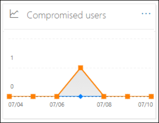
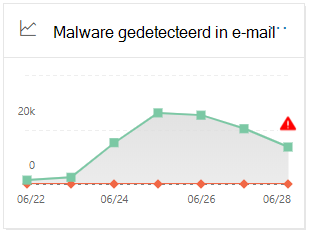
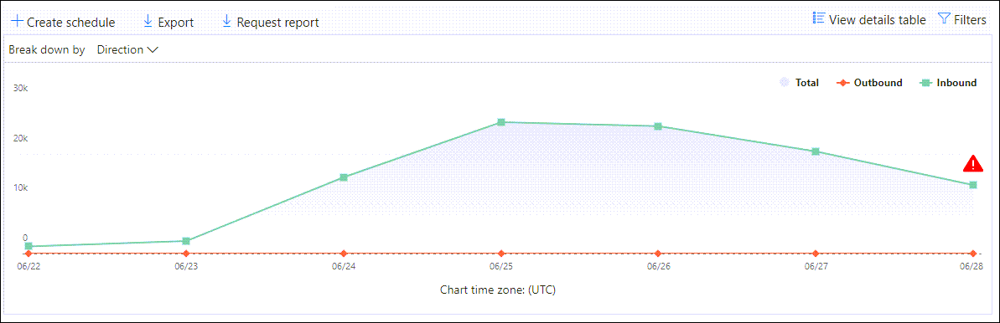
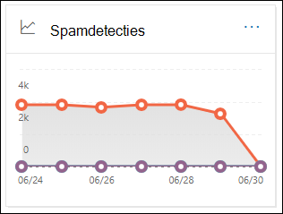
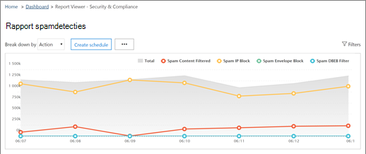
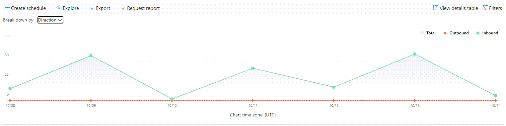
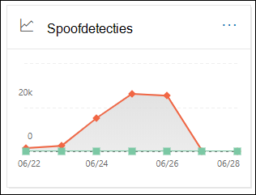
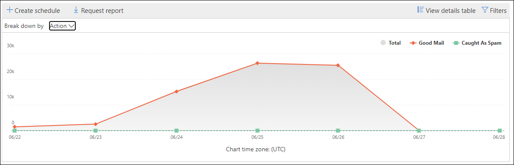
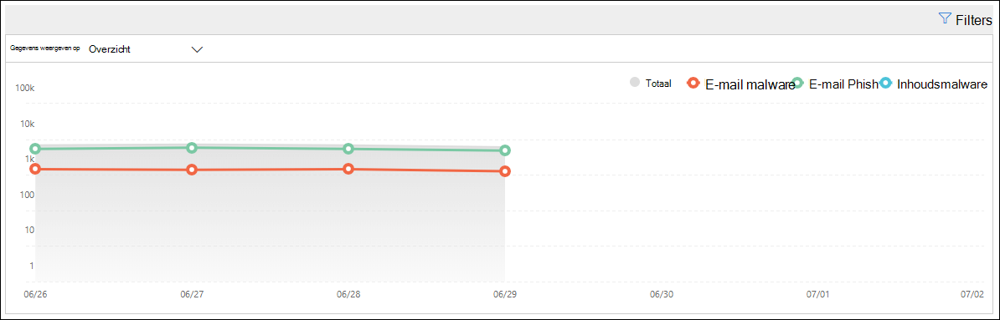

# E-mailbeveiligingsrapporten bekijken in het Beveiligings- en compliancecentrum

[!INCLUDE [Microsoft 365 Defender rebranding](../includes/microsoft-defender-for-office.md)]

Er zijn diverse rapporten beschikbaar in het [beveiligings & compliance Center](https://protection.office.com) , zodat u kunt zien hoe e-mail beveiligingsfuncties, zoals antispam, anti-malware en versleutelings functies in microsoft 365, uw organisatie beschermen. Als u de [benodigde machtigingen](#what-permissions-are-needed-to-view-these-reports)hebt, kunt u deze rapporten weergeven in het compliance-beveiligings & door **Reports** naar het \> **Dashboard** rapporten te gaan. Open om rechtstreeks naar het Dashboard rapporten te gaan <https://protection.office.com/insightdashboard> .

## Rapport met verkraakte gebruikers

> [!NOTE]
> Dit rapport is beschikbaar in Microsoft 365-organisaties met postvakken van Exchange Online. Deze functie is niet beschikbaar in zelfstandige Exchange Online Protection (EOP)-organisaties.

Het rapport verdachte **gebruikers** toont het aantal gebruikersaccounts dat is gemarkeerd als **verdacht** of **beperkt** in de afgelopen 7 dagen. Accounts in een van deze statussen zijn problematisch of zelfs aangetast. Met vaak gebruikte rapporten kunt u de lijst gebruiken om pieken en zelfs trends te gebruiken in verdachte of beperkte accounts. Zie [reageren op een gemanipuleerd e-mailaccount](responding-to-a-compromised-email-account.md)voor meer informatie over gebruikers die een aanval hebben.

De statistische weergave bevat gegevens voor de laatste 90 dagen en de detailweergave bevat gegevens voor de afgelopen 30 dagen.

Als u het rapport wilt weergeven, opent u het [beveiligings & compliance](https://protection.office.com), gaat u naar **Reports** \> **Dashboard** rapporten en selecteert u gebruikers die zijn **gemanipuleerd**. Open om rechtstreeks naar het rapport te gaan <https://protection.office.com/reportv2?id=CompromisedUsers> .

U kunt zowel de grafiek als de tabel met details filteren door op **filters** te klikken en een of meer van de volgende waarden te selecteren:

- **Begindatum** en **einddatum**

- **Verdacht** : het gebruikersaccount heeft verdachte e-mail verzonden en loopt tegen een beperkte beperking van het verzenden van e-mail.

- **Beperkt** : het gebruikersaccount mag geen e-mail verzenden vanwege zeer verdachte patronen.

Als u op **detail tabel weergeven** klikt, ziet u de volgende informatie:

- **Tijdstip van aanmaken**
- **Gebruikers-ID**
- **Actierij**

Als u terug wilt gaan naar de rapportweergave, klikt u op **rapport weergeven**.

## Versleutelings rapport

Het **versleutelings rapport** is beschikbaar in EOP (abonnementen met postvakken in Exchange Online of zelfstandige EOP zonder postvakken van Exchange Online). Het beveiligingsteam van uw organisatie kan informatie in dit rapport gebruiken om patronen te identificeren en beleid proactief toe te passen of te wijzigen voor gevoelige e-mailberichten. Bijvoorbeeld:

- Als u een groot aantal e-mailberichten met versleutelde gebruikers ziet, wilt u misschien een versleutelingsbeleid toevoegen om versleuteling te automatiseren voor bepaalde use cases. Zie voor meer informatie [e-mail stroom regels definiëren voor het versleutelen van e-mailberichten in Microsoft 365](../../compliance/define-mail-flow-rules-to-encrypt-email.md).

- Als u beschikt over een aantal beschikbare versleutelings sjablonen, maar niemand deze gebruikt, kunt u zien of gebruikersfunctie training nodig hebben.

Met de cumulatieve weergave kunnen filters voor de laatste 90 dagen worden gefilterd, maar in de weergave Details kunt u filteren gedurende 10 dagen.

Als u het rapport wilt weergeven, opent u het [beveiligings & compliance](https://protection.office.com), gaat u naar **rapporten** \> **Dashboard** en selecteert u **versleutelings rapport**. Open om rechtstreeks naar het rapport te gaan <https://protection.office.com/reportv2?id=EncryptionReport> .

Zie voor meer informatie over versleuteling [e-mail versleuteling in Microsoft 365](../../compliance/email-encryption.md).

### Rapportweergave voor het versleutelings rapport

U kunt de volgende filters in de grafiek gebruiken:

- **Gegevens weergeven op: bericht versleutelings rapport** en **opsplitsen met: versleutelingsmethode** : de volgende versleutelingsmethoden zijn beschikbaar:

  - **Versleuteling per gebruiker**
  - **Versleuteling op basis van beleid**

  Als u op **filters** klikt, kunt u de grafiek met de volgende filters wijzigen:

  - **Begindatum** en **einddatum**
  - Versleutelingsmethode.
  - Versleutelings sjabloon.

- **Gegevens weergeven op: bericht versleutelings rapport** en **opsplitsen met:** versleutelingsmethode: de volgende versleutelingsmethoden zijn beschikbaar:

  - **Niet doorschakelen**
  - **Alleen versleutelen**
  - **OME vorige**
  - **Gemaakte**

  Als u op **filters** klikt, kunt u de grafiek met de volgende filters wijzigen:

  - **Begindatum** en **einddatum**
  - Versleutelingsmethode
  - Versleutelings sjabloon

- **Gegevens weergeven op: domeinen van 5 belangrijkste geadresseerden** : in deze weergave wordt een cirkeldiagram met verzonden berichten geteld voor de domeinen van de vijf belangrijkste geadresseerden.

  Als u op **filters** klikt, kunt u een **begin** -en **einddatum** selecteren.

### De tabel weergave Details voor het versleutelings rapport

Als u op **detail tabel weergeven** klikt, is de informatie die wordt weergegeven, afhankelijk van de grafiek die u bekijkt:

- **Verbreken op: versleutelingsmethode** of **verbreken op: versleutelings sjabloon** : de volgende informatie wordt weergegeven:

  - **Datum**
  - **Adres afzender**
  - **Versleutelings sjabloon**
  - **Versleutelingsmethode**
  - **Adres van ontvanger**
  - **Onderwerp**

- **Gegevens weergeven op: domeinen van 5 belangrijkste geadresseerden** :

  - **Datum**
  - **Domein van de ontvanger**
  - **Aantal berichten**
  
Als u in een weergave met detail tabellen op **filters** klikt, kunt u de resultaten wijzigen met de volgende filters:

- **Begindatum** en **einddatum**
- Versleutelingsmethode
- Versleutelings sjabloon

Als u terug wilt gaan naar de rapportweergave, klikt u op **rapport weergeven**.

## Rapport over de status van de telestroom

Het rapport met de e-mail **stroom status** bevat informatie over de geblokkeerde berichten malware, spam, phishing en Edge. Zie voor meer informatie het rapport over de status van de [telestroom](view-mail-flow-reports.md#mailflow-status-report).

## Detectie van malware in een e-mail rapport

De **malware van malware in een e-mail** rapport bevat informatie over detectie van malware in inkomende en uitgaande e-mailberichten (malware gedetecteerd via Exchange Online Protection of EOP). Zie [bescherming tegen malware in EOP](anti-malware-protection.md)voor meer informatie over beveiliging van malware in EOP.

 Het filter voor de geaggregeerde weergave is gedurende 90 dagen toegestaan, terwijl het tabelfilter voor de details 10 dagen geldig is.

Als u het rapport wilt weergeven, opent u het [& nalevings centrum](https://protection.office.com), gaat u naar **rapporten** \> **Dashboard** en selecteert u **detectie van malware per e-mail**. Open om rechtstreeks naar het rapport te gaan <https://protection.office.com/reportv2?id=MalwareDetections> .

U kunt zowel de grafiek als de tabel met details filteren door te klikken op **filters** en de volgende opties te selecteren:

- **Begindatum** en **einddatum**
- **Bound**
- **Transfer**

Als u op **detail tabel weergeven** klikt, ziet u de volgende informatie:

- **Datum**
- **Adres afzender**
- **Adres van ontvanger**
- **Bericht-id** : beschikbaar in het veld **bericht-id-** header in de berichtkop en moet uniek zijn. Een Voorbeeldwaarde is `<08f1e0f6806a47b4ac103961109ae6ef@server.domain>` (Let op de punthaken).
- **Onderwerp**
- **Namen**
- **Naam van malware**

Als u terug wilt gaan naar de rapportweergave, klikt u op **rapport weergeven**.

## E-mail verzonden en ontvangen

De lijst **verzonden en ontvangen e-mail** bevat informatie over malware, spam, regels voor e-mail stroom (ook wel bekend als transportregels), en geavanceerde malware-detectie na voltooiing e-mail voert de service uit. Zie [e-mailbericht verzonden en ontvangen](view-mail-flow-reports.md#sent-and-received-email-report)voor meer informatie.

## Rapport detectie van spam

Het rapport **spam detectie** toont spam-e-mailberichten die zijn geblokkeerd door EOP. Berichten worden afzonderlijk geteld, niet per ontvanger. Als het e-mailbericht bijvoorbeeld is verzonden naar 100-geadresseerden in uw organisatie, wordt het als één bericht geteld.

De geaggregeerde weergave biedt de mogelijkheid 90 dagen te filteren, terwijl de tabel Details het filteren van tien dagen toestaat.

Als u het rapport wilt weergeven, opent u het [beveiligings & compliance](https://protection.office.com), gaat u naar **rapporten** \> **Dashboard** en selecteert u **spam detectie**. Open om rechtstreeks naar het rapport te gaan <https://protection.office.com/reportv2?id=SpamDetections> .

Zie [bescherming tegen spam in EOP](anti-spam-protection.md)voor meer informatie over beveiliging tegen ongewenste e-mail.

### Rapportweergave voor het rapport detectie van spam

De volgende grafieken zijn beschikbaar in de rapportweergave:

- **Verbreken op: actie** : de volgende gebeurtenistypen worden weergegeven:

  - **Spam met gefilterde inhoud**
  - **Spam-IP-blok**
  - **Spam blok voor spam**
  - **Spam DBEB filter** : op mappen gebaseerde rand blokkeren (DBEB)

  Wanneer u de muisaanwijzer op een dag (gegevenspunt) van de grafiek plaatst, kunt u zien hoeveel items zijn geblokkeerd voor de dag, en hoe die items zijn gecategoriseerd.

  

- **Onderbrekingspunt met: richting** : de volgende richtingen worden weergegeven:

  - **Bound**
  - **Transfer**

  

Als u op **filters** in een rapportweergave klikt, kunt u de resultaten wijzigen met de volgende filters:

- **Begindatum** en **einddatum**
- Richtings waarden
- Waarden voor gebeurtenistype

### De tabel weergave Details voor het rapport detectie van spam

Als u in een rapportweergave op **Details tabel weergeven** klikt, wordt de volgende informatie weergegeven:

- **Datum**
- **Adres afzender**
- **Adres van ontvanger**
- **Evenementtype**
- **Actierij**
- **Onderwerp**

Als u op **filters** in een gegevenstabel klikt, kunt u de resultaten wijzigen met de volgende filters:

- **Begindatum** en **einddatum**
- Richtings waarden
- Waarden voor gebeurtenistype

Als u terug wilt gaan naar de rapportweergave, klikt u op **rapport weergeven**.

## Rapport over spoof detectie

In het rapport met vergelijkings **detectie** wordt weergegeven hoeveel valse e-mailberichten zijn gedetecteerd, en welke hiervan als ' goed ' zijn beschouwd (vervalste e-mail die voor legitieme zakelijke redenen is uitgevoerd). Zie voor meer informatie over spoofing [beveiliging tegen spoofing in EOP](anti-spoofing-protection.md).

De geaggregeerde weergave van het rapport mag voor 90 dagen filteren, terwijl de detailweergave slechts tien dagen van filteren toestaat.

Als u het rapport wilt weergeven, opent u het [beveiligings & compliance](https://protection.office.com), gaat u naar **rapporten** \> **Dashboard** en selecteert u **detectie van spoofing**. Open om rechtstreeks naar het rapport te gaan <https://protection.office.com/reportv2?id=SpoofMailReport> .

Wanneer u de muisaanwijzer op een dag (gegevenspunt) van de grafiek plaatst, kunt u zien hoe vaak e-mailberichten worden verzonden.

U kunt zowel de grafiek als de tabel met details filteren door op **filters** te klikken en een of meer van de volgende waarden te selecteren:

- **Begindatum** en **einddatum**

- **Goede e-mail**

- **Afgevangen als spam**

Als u op **detail tabel weergeven** klikt, ziet u de volgende informatie:

- **Datum**
- **Vervalste afzender**
- **Ware afzender**
- **IP van afzender**
- **Actierij**
- **Aantal berichten**

Als u terug wilt gaan naar de rapportweergave, klikt u op **rapport weergeven**.

## Statusrapport bedreigingsbeveiliging

Het rapport **status beveiliging** van de bedreiging is beschikbaar in zowel EOP als Microsoft Defender voor Office 365. de rapporten bevatten echter verschillende gegevens. EOP-klanten kunnen bijvoorbeeld informatie over malware bekijken die zijn gevonden in een e-mail, maar niet informatie over [schadelijke bestanden die zijn gedetecteerd door ATP voor SharePoint, OneDrive of Microsoft teams](atp-for-spo-odb-and-teams.md).

Het rapport bevat het aantal e-mailberichten met schadelijke inhoud, zoals bestanden of websiteadressen (Url's), die zijn geblokkeerd door de anti-malware-engine, [automatisch wissen van Zero uur (ZAP)](zero-hour-auto-purge.md)en Defender voor Office 365-functies zoals [veilige koppelingen](atp-safe-links.md), [veilige bijlagen](atp-safe-attachments.md)en [anti-phishing](set-up-anti-phishing-policies.md). U kunt deze gegevens gebruiken om trends te identificeren of te bepalen of een organisatiebeleid moet worden aangepast. Het is belangrijk om te weten dat wanneer een bericht wordt verzonden naar vijf geadresseerden, de waarde wordt geteld als vijf verschillende berichten en niet één bericht.

Als u het rapport wilt weergeven, opent u het [beveiligings & compliance](https://protection.office.com), gaat u naar **Reports** \> **Dashboard** rapporten en selecteert u de **status bedreigingsbeveiliging**. Als u rechtstreeks naar het rapport wilt gaan, opent u een van de volgende Url's:

- Microsoft Defender voor Office 365: <https://protection.office.com/reportv2?id=TPSAggregateReportATP>
- EOP <https://protection.office.com/reportv2?id=TPSAggregateReport>

In de grafiek worden standaardgegevens weergegeven voor de afgelopen 7 dagen. Als u op **filters** klikt, kunt u een datumbereik voor 90 dag selecteren (de proefabonnementen kunnen worden beperkt tot 30 dagen). In de tabel weergave Details kunt u filteren gedurende 30 dagen.

### Rapportweergave voor het statusrapport van de Bedreigingsbeveiliging

De volgende weergaven zijn beschikbaar:

- **Gegevens weergeven op: overzicht** : de volgende detectie-informatie wordt weergegeven:

  - **Malware via e-mail verzenden**
  - **E-mail phishing**
  - **Inhoud van malware**

  

- **Gegevens weergeven op: inhoud \> Malware**1: de volgende informatie wordt weergegeven in Microsoft Defender for Office 365-organisaties:

  - **Anti malware-engine** : vangen van schadelijke bestanden in SharePoint Online, OneDrive en teams met anti malware.
  - **Bestands detonatie** : detonatie van schadelijke bestanden in SharePoint Online, OneDrive en teams door veilige bijlagen.

  

- **Gegevens weergeven op: bericht negeren** : de volgende informatie over de overschrijving wordt weergegeven:

  - **On-premises overslaan**
  - **IP toestaan**
  - **Regel voor e-mail stroom**
  - **Afzender toestaan**
  - **Domein toestaan**
  - **ZAP niet ingeschakeld**
  - **Map Ongewenste E-mail niet ingeschakeld**
  - **Gebruiker veilig verzenderd**
  - **Gebruikers veilig domein**

  

- **Onderbreek omlaag met: detectietechnologie** en **gegevens weergeven op \> : e-mailbericht** : de volgende informatie wordt weergegeven:

  - Met **ATP gegenereerde URL-reputatie**1: schadelijke URL-reputatie van de 365 voor Office 365-detonaties in andere gebruikers van de Defender voor Office.
  - **Geavanceerd phishing-filter** : malafide signalen op basis van machine learning.
  - **Anti-spoof-DMARC fout** : DMARC-Authenticatiefout bij berichten.
  - **Anti-spoof-intra organisatie** : de afzender probeert het domein van de ontvanger te vervalsen.
  - **Anti-spoof-extern domein** : afzender probeert een ander domein te vervalsen.
  - **Merken van merken** : imitatie van bekende merken op basis van afzenders.
  - **Domein** imitatie 1: imitatie van domeinen waarvan de klant eigenaar is of waarvan de naam is gedefinieerd.
  - **EOP URL-reputatie** : schadelijke URL-reputatie.
  - **Algemeen phishing-filter** : phishingberichten op basis van regels van analisten. 
  - **Gezien**
  - **PHISH ZAP**2: een uur automatisch wissen malafide berichten wissen.
  - **URL-detonatie**1
  - **Gebruikers** imitatie 1: imitatie van gebruikers die zijn gedefinieerd door de beheerder of door de Postvak intelligentie zijn geleerd.

  

- **Opsplitsen op: detectietechnologie** en **gegevens weergeven op: e-mail \> malware** : de volgende informatie wordt weergegeven:

  - **ATP-de reputatie van het bestand gegenereerd**1: alle kwaadaardige bestanden die zijn gegenereerd met ATP-detonatie.
  - **Anti malware engine**1: detectie van anti malware-engines.
  - **Anti malwarebeleid type blok** : Dit zijn e-mailberichten die zijn gefilterd door het type schadelijk bestand dat in het bericht wordt genoemd.
  - **Bestands detonatie**1: detonatie afvangen door veilige bijlagen.  
  - **Schadelijke bestands reputatie**
  - **Malware ZAP**2
  - **Gezien**

  

- **Onderbreek een regeltype in: beleid** en **gegevens weergeven \> op: e-mailen** en **gegevens weergeven op \>** : e-mail problemen weergeven:

  - **Anti malware**
  - **Veilige bijlage**1
  - **Anti-phishing**
  - **Anti spam**
  - **E-mail stroom regel** (ook wel een transportregel genoemd)
  - **Gezien**

  

- **Onderverdelen op: bezorgingsstatus** en **gegevens weergeven \> op: e-mailen van een e-mailbericht verzenden** of **gegevens bekijken op: e-mail \> malware** : de volgende informatie wordt getoond:

  - **Bezorging mislukt**
  - **Drop**
  - **Ter**
  - **Gehoste postvak: aangepaste map**
  - **Gehoste postvak: Verwijderde items**
  - **Gehoste postvak: Postvak in**
  - **Gehoste postvak: ongewenste E-mail**
  - **On-premises server: bezorgd**
  - **Quarantaine**

  

alleen 1 Defender voor Office 365

2 Zero-Hour auto LEEGMAAK (ZAP) is niet beschikbaar in standalone EOP (deze functie werkt alleen in Exchange Online-postvakken).

Als u op **filters** klikt, zijn de beschikbare filters afhankelijk van de grafiek die u bekijkt:

Voor **\> malware van inhoud** kunt u het rapport wijzigen op basis van de **begindatum** en **einddatum** , en de **detectie** waarde.

Voor het **opheffen van berichten** kunt u het rapport wijzigen met de volgende filters:

- **Begindatum** en **einddatum**
- **Reden negeren**
- **Tag** : filteren op label om gebruikers of groepen te retourneren waarop een specifieke tag is toegepast. Zie voor meer informatie over gebruikers tags [User Tags](user-tags.md).
- **Domein**

Voor alle andere weergaven kunt u het rapport wijzigen met de volgende filters:

- **Begindatum** en **einddatum**
- **Bronuitputtingsdetectie**
- **Beveiligd door** : **ATP** of **EOP**
- **Tag** : filteren op label om gebruikers of groepen te retourneren waarop een specifieke tag is toegepast. Zie voor meer informatie over gebruikers tags [User Tags](user-tags.md).
- **Domein**

### De tabel weergave Details voor het statusrapport Bedreigingsbeveiliging

Als u op **detail tabel weergeven** klikt, is de informatie die wordt weergegeven, afhankelijk van de grafiek die u bekijkt:

- **Gegevens weergeven op: inhoud \> Malware** :

  - **Datum**
  - **Locatie**
  - **Omgeleid door**
  - **Naam van malware**

Als u in deze weergave op **filters** klikt, kunt u het rapport wijzigen op basis van de **begindatum** en **einddatum** , en de **detectie** waarde.

- **Gegevens weergeven op: bericht negeren** :

  - **Datum**
  - **Onderwerp**
  - **Afzender**
  - **Allen**
  - **Gedetecteerd door**
  - **Reden negeren**
  - **Bron van compromissen**
  - **Tags**

Als u in deze weergave op **filters** klikt, kunt u het rapport wijzigen met de volgende filters:

- **Begindatum** en **einddatum**
- **Reden negeren**
- **Tag** : filteren op label om gebruikers of groepen te retourneren waarop een specifieke tag is toegepast. Zie voor meer informatie over gebruikers tags [User Tags](user-tags.md).
- **Domein**
- **Geadresseerden** (Houd er rekening mee dat deze eigenschap kan alleen worden gefilterd in de weergave Details

**Gegevens weergeven op: overzicht** : de knop **informatietabel weergeven** is beschikbaar.

- Alle overige grafieken:

  - **Datum**
  - **Onderwerp**
  - **Afzender**
  - **Allen**
  - **Gedetecteerd door**
  - **Leverings status**
  - **Bron van compromissen**
  - **Tags**

Als u op **filters** klikt, kunt u het rapport met de volgende filters wijzigen:

- **Begindatum** en **einddatum**
- **Bronuitputtingsdetectie**
- **Beveiligd door** : **Defender voor Office 365** of **EOP**
- **Tag** : filteren op label om gebruikers of groepen te retourneren waarop een specifieke tag is toegepast. Zie voor meer informatie over gebruikers tags [User Tags](user-tags.md).
- **Domein**
- **Geadresseerden** (Houd er rekening mee dat deze eigenschap kan alleen worden gefilterd in de weergave Details

## Belangrijkste rapport van malware

In het **meest voorkomende schadelijke** rapport worden de verschillende soorten malware weergegeven die zijn gedetecteerd door [beveiliging tegen malware in EOP](anti-malware-protection.md).

Als u het rapport wilt weergeven, opent u het [& nalevings centrum](https://protection.office.com), gaat u naar **rapporten** \> **Dashboard** en selecteert u **belangrijkste malware**. Open om rechtstreeks naar het rapport te gaan <https://protection.office.com/reportv2?id=TopMalware> .

Wanneer u de muisaanwijzer boven een wig in het cirkeldiagram houdt, ziet u de naam van een type malware en de hoeveelheid berichten die zijn gevonden met malware.

Als u op **detail tabel weergeven** klikt, ziet u de volgende informatie:

- **Belangrijkste malware**
- **Getal**

Als u op **filters** klikt in de rapportweergave of de weergave Details, kunt u een datumbereik opgeven met de **begindatum** en **einddatum**.

## Rapport over URL Threat Protection

Het **rapport URL Threat Protection** is beschikbaar in Microsoft Defender voor Office 365. Zie voor meer informatie het [rapport URL Threat Protection](view-reports-for-atp.md#url-threat-protection-report).

## Rapport door gebruiker gerapporteerde berichten

In het rapport door de gebruiker gerapporteerde **berichten** ziet u informatie over e-mailberichten die gebruikers als ongewenste e-mail, phishing of goede e-mail hebben gerapporteerd met behulp van de [invoegtoepassing berichten rapporteren](https://docs.microsoft.com/microsoft-365/security/office-365-security/enable-the-report-message-add-in).

Details zijn beschikbaar voor elk bericht, waaronder de bezorgings reden, een uitzondering voor spam beleid of een e-mail stroom regel die is geconfigureerd voor uw organisatie. Als u de details wilt bekijken, selecteert u een item in de lijst gebruikers rapporten en bekijkt u de gegevens op de tabbladen **overzicht** en **Details** .

Voer een van de volgende handelingen uit in het [nalevings centrum van beveiligings &](https://protection.office.com)om dit rapport te bekijken:

- Ga naar **Threat management** \> het door **Dashboard** \> **gebruiker gerapporteerde berichten van het** dashboard voor risicobeheer.

- Ga naar **bedreigings beheer** door door de \> **Review** \> **gebruiker gerapporteerde berichten**.

> [!IMPORTANT]
> Als u wilt dat het rapport door de gebruiker gerapporteerde berichten correct functioneert, **moet auditlogboeken zijn ingeschakeld** voor uw Office 365-omgeving. Dit gebeurt meestal door iemand die de rol audit logboeken heeft toegewezen in Exchange Online. Zie [Microsoft 365 audit log Search in-of uitschakelen](https://docs.microsoft.com/microsoft-365/compliance/turn-audit-log-search-on-or-off)voor meer informatie.

## Welke machtigingen zijn vereist voor het weergeven van deze rapporten?

Als u de rapporten wilt weergeven en gebruiken, moet u lid zijn van de opgegeven rollen groep in het beveiligings & nalevings centrum **en** in Exchange Online.

- In het nalevings centrum beveiligings & moet u lid zijn van een van de volgende rollen groepen:

  -Organisatiebeheer-beveiligingsbeheerder (u kunt dit ook doen in het [Azure Active Directory-beheercentrum](https://aad.portal.azure.com) -beveiligings lezer

  Zie [Machtigingen in het Beveiligings- & compliancecentrum](https://docs.microsoft.com/microsoft-365/security/office-365-security/permissions-in-the-security-and-compliance-center) voor meer informatie.

- In Exchange Online moet u lid zijn van een van de volgende groepen rollen:

  -Organisatiebeheer-alleen-bekijken Organisatiebeheer-alleen voor weergeven geadresseerden

Zie [machtigingen in Exchange Online](https://docs.microsoft.com/Exchange/permissions-exo/permissions-exo) en [rollen groepen beheren in Exchange Online](https://docs.microsoft.com/Exchange/permissions-exo/role-groups)voor meer informatie.

## Wat moet ik doen als de rapporten geen gegevens weergeven?

Als u geen gegevens ziet in uw rapporten, controleert u of uw beleidsregels correct zijn ingesteld. Voor meer informatie raadpleegt u [bescherming tegen bedreigingen](protect-against-threats.md).

## Verwante onderwerpen

[Antispam en bescherming tegen malware in EOP](anti-spam-and-anti-malware-protection.md)

[Slimme rapporten en inzichten in het nalevings centrum voor beveiligings &](reports-and-insights-in-security-and-compliance.md)

[De e-mail stroom rapporten weergeven in het beveiligings & nalevings centrum](view-mail-flow-reports.md)

[Rapporten weergeven voor Defender voor Office 365](view-reports-for-atp.md)
