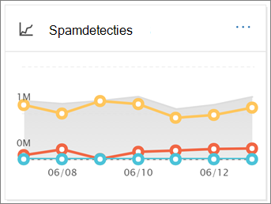

# E-mailbeveiligingsrapporten bekijken in het Beveiligings- en compliancecentrumView email security reports in the Security & Compliance Center

Er zijn verschillende rapporten beschikbaar in het [Security & Compliance Center](https://protection.office.com) om u te laten zien hoe e-mailbeveiligingsfuncties, zoals anti-spam, anti-malware en versleutelingsfuncties in Microsoft 365 uw organisatie beschermen.A variety of reports are available in the [Security & Compliance Center](https://protection.office.com) to help you see how email security features, such as anti-spam, anti-malware, and encryption features in Microsoft 365 are protecting your organization. Als u over de [benodigde machtigingen](#what-permissions-are-needed-to-view-these-reports)beschikt, u deze rapporten bekijken in het Security & Compliance Center door naar **Dashboard Rapporten** te gaan \> **Dashboard**.If you have the [necessary permissions](#what-permissions-are-needed-to-view-these-reports), you can view these reports in the Security & Compliance Center by going to **Reports** \> **Dashboard**. Als u rechtstreeks naar het dashboard van rapporten wilt gaan, opent <https://protection.office.com/insightdashboard> u .To go directly to the reports dashboard, open <https://protection.office.com/insightdashboard>.

## Gecompromitteerde gebruikers meldenCompromised users report

In het rapport **gecompromitteerde gebruikers** wordt het aantal gebruikersaccounts weergegeven dat in de afgelopen 7 dagen als **Verdacht** of **Beperkt is** gemarkeerd.The **Compromised users** report shows shows the number of user accounts that were marked as **Suspicious** or **Restricted** within the last 7 days. Rekeningen in een van deze staten zijn problematisch of zelfs gecompromitteerd.Accounts in either of these states are problematic or even compromised. Bij veelvuldig gebruik u het rapport gebruiken om pieken en zelfs trends in verdachte of beperkte accounts te herkennen.With frequent use, you can use the report to spot spikes, and even trends, in suspicious or restricted accounts. Zie [Reageren op een gecompromitteerd e-mailaccount](responding-to-a-compromised-email-account.md)voor meer informatie over gecompromitteerde gebruikers.For more information about compromised users, see [Responding to a compromised email account](responding-to-a-compromised-email-account.md).

De totaalweergave toont gegevens over de afgelopen 90 dagen en de detailweergave toont gegevens van de afgelopen 30 dagen.The aggregate view shows data for the last 90 days and the detail view shows data for the last 30 days.

Als u het rapport wilt bekijken, opent u het [Security & Compliance Center,](https://protection.office.com)gaat u naar **Reports** \> **Rapportendashboard** en selecteert u **Gecompromitteerde gebruikers**.To view the report, open the [Security & Compliance Center](https://protection.office.com), go to **Reports** \> **Dashboard** and select **Compromised users**. Open <https://protection.office.com/reportv2?id=CompromisedUsers> .To go directly to the report, open <https://protection.office.com/reportv2?id=CompromisedUsers>.

U zowel de grafiek als de detailtabel filteren door op **Filters** te klikken en een of meer van de volgende waarden te selecteren:You can filter both the chart and the details table by clicking **Filters** and selecting one or more of the following values:

- **Begindatum** en **einddatum****Start date** and **End date**

- **Verdacht**: Het gebruikersaccount heeft verdachte e-mail verzonden en loopt het risico geen e-mail te verzenden.**Suspicious**: The user account has sent suspicious email and is at risk of being restricted from sending email.

- **Beperkt**: Het gebruikersaccount is beperkt tot het verzenden van e-mail als gevolg van zeer verdachte patronen.**Restricted**: The user account has been restricted from sending email due to highly suspicious patterns.

Als u op **tabel Details weergeven**klikt, ziet u de volgende details:If you click **View details table**, you can see the following details:

- **Aanmaaktijd****Creation time**
- **Gebruikersnaam****User ID**
- **Actie****Action**

Als u terug wilt gaan naar de rapportweergave, klikt u op **Rapport weergeven**.To go back to the report view, click **View report**.

## VersleutelingsrapportEncryption report

Het **versleutelingsrapport** is beschikbaar in EOP (abonnementen met postvakken in Exchange Online of standalone EOP zonder Exchange Online-postvakken).The **Encryption report** is available in EOP (subscriptions with mailboxes in Exchange Online or standalone EOP without Exchange Online mailboxes). Het beveiligingsteam van uw organisatie kan informatie in dit rapport gebruiken om patronen te identificeren en proactief beleid voor gevoelige e-mailberichten toe te passen of aan te passen.Your organization's security team can use information in this report to identify patterns and proactively apply or adjust policies for sensitive email messages. Bijvoorbeeld:For example:

- Als u een groot aantal e-mailberichten ziet die door gebruikers zijn versleuteld, u een versleutelingsbeleid toevoegen om versleuteling voor bepaalde use cases te automatiseren.If you see a high number of email messages encrypted by users, you might want to add an encryption policy to automate encryption for certain use cases. Zie [Regels voor e-mailstroom definiëren om e-mailberichten te versleutelen in Microsoft 365 voor](../../compliance/define-mail-flow-rules-to-encrypt-email.md)meer informatie.For more information, see [Define mail flow rules to encrypt email messages in Microsoft 365](../../compliance/define-mail-flow-rules-to-encrypt-email.md).

- Als u een aantal versleutelingssjablonen beschikbaar hebt, maar niemand ze gebruikt, u onderzoeken of gebruikers functietraining nodig hebben.If you have a number of encryption templates available but no one is using them, you might explore whether users need feature training.

De geaggregeerde weergave maakt het mogelijk om de afgelopen 90 dagen te filteren, terwijl de detailweergave het mogelijk maakt om 10 dagen te filteren.The aggregate view allows filtering for the last 90 days, while the detail view allows filtering for 10 days.

Als u het rapport wilt bekijken, opent u het [Security & Compliance Center,](https://protection.office.com)gaat u naar **Reports** \> **Rapportendashboard** en selecteert u **Versleutelingsrapport**.To view the report, open the [Security & Compliance Center](https://protection.office.com), go to **Reports** \> **Dashboard** and select **Encryption report**. Open <https://protection.office.com/reportv2?id=EncryptionReport> .To go directly to the report, open <https://protection.office.com/reportv2?id=EncryptionReport>.

Zie [E-mailversleuteling in Microsoft 365](../../compliance/email-encryption.md)voor meer informatie over versleuteling.To learn more about encryption, see [Email encryption in Microsoft 365](../../compliance/email-encryption.md).

### Rapportweergave voor het versleutelingsrapportReport view for the Encryption report

U de volgende filters in de grafiek gebruiken:You can use the following filters on the chart:

- **Gegevens weergeven door: Message Encryption Report** and **Break down by: Encryption method:** The following encryption methods are available:**View data by: Message Encryption Report** and **Break down by: Encryption method**: The following encryption methods are available:

  - **Versleuteling door gebruiker****Encryption by user**
  - **Versleuteling op beleid****Encryption by policy**

  Als u op **Filters**klikt, u de grafiek wijzigen met de volgende filters:If you click **Filters**, you can modify the chart with the following filters:

  - **Begindatum** en **einddatum****Start date** and **End date**
  - Versleutelingsmethode.Encryption method.
  - Versleutelingssjabloon.Encryption template.

- **Gegevens weergeven door: Message Encryption Report** and **Break down by: Encryption template**: The following encryption methods are available:**View data by: Message Encryption Report** and **Break down by: Encryption template**: The following encryption methods are available:

  - **Niet doorsturen****Do not forward**
  - **Alleen versleutelen****Encrypt only**
  - **OME vorige****OME previous**
  - **Aangepaste****Custom**

  Als u op **Filters**klikt, u de grafiek wijzigen met de volgende filters:If you click **Filters**, you can modify the chart with the following filters:

  - **Begindatum** en **einddatum****Start date** and **End date**
  - VersleutelingsmethodeEncryption method
  - VersleutelingssjabloonEncryption template

- **Gegevens weergeven door: Top 5 geadresseerde domeinen**: in deze weergave ziet u een cirkeldiagram met verzonden berichttellingen voor de top 5 geadresseerde domeinen.**View data by: Top 5 recipient domains**: This view shows a pie chart with sent message counts for the top 5 recipient domains.

  Als u op **Filters**klikt, u een **begindatum** en **einddatum**selecteren.If you click **Filters**, you can select a **Start date** and **End date**.

### Tabelweergave details voor het rapport VersleutelingDetails table view for the Encryption report

Als u op **tabel Details weergeven**klikt, is de weergegeven informatie afhankelijk van de grafiek die u bekeet:If you click **View details table**, the information that's shown depends on the chart you were looking at:

- **Uitsplitsen door: Versleutelingsmethode** of **Opsplitsen door: Versleutelingssjabloon**: De volgende informatie wordt weergegeven:**Break down by: Encryption method** or **Break down by: Encryption template**: The following information is shown:

  - **Datum****Date**
  - **Adres afzender****Sender address**
  - **Versleutelingssjabloon****Encryption template**
  - **Versleutelingsmethode****Encryption method**
  - **Adres van de geadresseerde****Recipient address**
  - **Onderwerp****Subject**

- **Gegevens bekijken door: Top 5 geadresseerde domeinen:****View data by: Top 5 recipient domains**:

  - **Datum****Date**
  - **Geadresseerdendomein****Recipient domain**
  - **Aantal berichten****Message count**
  
Als u op **Filters** in een tabelweergave voor details klikt, u de resultaten wijzigen met de volgende filters:If you click **Filters** in a details table view, you can modify the results with the following filters:

- **Begindatum** en **einddatum****Start date** and **End date**
- VersleutelingsmethodeEncryption method
- VersleutelingssjabloonEncryption template

Als u terug wilt gaan naar de rapportweergave, klikt u op **Rapport weergeven**.To go back to the report view, click **View report**.

## Mailflow-statusrapportMailflow status report

Het **Mailflow-statusrapport** bevat informatie over malware, spam, phishing en geblokkeerde berichten.The **Mailflow status report** contains information about malware, spam, phishing and edge blocked messages. Zie [Het statusrapport van Mailflow](view-mail-flow-reports.md#mailflow-status-report)voor meer informatie .For more details, see [Mailflow status report](view-mail-flow-reports.md#mailflow-status-report).

## Detectie van malware in e-mailrapportMalware detection in email report

De **malware detecties in e-mail** rapport toont informatie over malware detecties in inkomende en uitgaande e-mailberichten (malware gedetecteerd door Exchange Online Protection of EOP).The **Malware detections in email** report shows information about malware detections in incoming and outgoing email messages (malware detected by Exchange Online Protection or EOP). Zie [Anti-malwarebescherming in EOP](anti-malware-protection.md)voor meer informatie over malwarebescherming in EOP.For more information about malware protection in EOP, see [Anti-malware protection in EOP](anti-malware-protection.md).

 Het filter voor de totale weergave biedt 90 dagen, terwijl het detailtabelfilter slechts 10 dagen toestaat.The aggregate view filter allows for 90 days, while the details table filter only allows for 10 days.

Als u het rapport wilt bekijken, opent u het [Security & Compliance Center,](https://protection.office.com)gaat u naar **Reports** \> **Rapportendashboard** en selecteert u **Malwaredetecties in e-mail**.To view the report, open the [Security & Compliance Center](https://protection.office.com), go to **Reports** \> **Dashboard** and select **Malware detections in email**. Open <https://protection.office.com/reportv2?id=MalwareDetections> .To go directly to the report, open <https://protection.office.com/reportv2?id=MalwareDetections>.

U zowel de grafiek als de detailtabel filteren door op **Filters** te klikken en het selecteren van:You can filter both the chart and the details table by clicking **Filters** and selecting:

- **Begindatum** en **einddatum****Start date** and **End date**
- **Inkomende****Inbound**
- **Uitgaande****Outbound**

Als u op **tabel Details weergeven**klikt, ziet u de volgende details:If you click **View details table**, you can see the following details:

- **Datum****Date**
- **Adres afzender****Sender address**
- **Adres van de geadresseerde****Recipient address**
- **Bericht-ID****Message ID**
- **Onderwerp****Subject**
- **Bestandsnaam****Filename**
- **Naam malware****Malware name**

Als u terug wilt gaan naar de rapportweergave, klikt u op **Rapport weergeven**.To go back to the report view, click **View report**.

## Verzonden en ontvangen e-mailrapportSent and received email report

Het **verzonden en ontvangen e-mailrapport** bevat informatie over malware, spam, regels voor e-mailstromen (ook wel transportregels genoemd) en geavanceerde malwaredetecties nadat e-mail de service is binnengekomen.The **Sent and received email** report contains information about malware, spam, mail flow rules (also known as transport rules), and advanced malware detections after email enters the service. Zie [Verzonden en ontvangen e-mailrapport](view-mail-flow-reports.md#sent-and-received-email-report)voor meer informatie.For more information, see [Sent and received email report](view-mail-flow-reports.md#sent-and-received-email-report).

## Rapport spamdetectiesSpam detections report

Het rapport **Spamdetecties** toont spam-e-mailberichten die door EOP zijn geblokkeerd.The **Spam detections** report shows spam email messages that were blocked by EOP. Berichten worden individueel geteld, niet per ontvanger.Messages are counted individually, not per recipient. Als bijvoorbeeld hetzelfde spambericht naar 100 ontvangers in uw organisatie is verzonden, telt dit als één bericht.For example, if the same spam message was sent to 100 recipients in your organization, it counts as one message.

De geaggregeerde weergave maakt het mogelijk om 90 dagen te filteren, terwijl de detailtabel het filteren van 10 dagen mogelijk maakt.The aggregate view allows for 90 days filtering, while the details table allows for 10 days filtering.

Als u het rapport wilt bekijken, opent u het [Security & Compliance Center,](https://protection.office.com)gaat u naar **Reports** \> **Rapportendashboard** en selecteert u **Spamdetecties**.To view the report, open the [Security & Compliance Center](https://protection.office.com), go to **Reports** \> **Dashboard** and select **Spam detections**. Open <https://protection.office.com/reportv2?id=SpamDetections> .To go directly to the report, open <https://protection.office.com/reportv2?id=SpamDetections>.

Zie [Anti-spambescherming in EOP](anti-spam-protection.md)voor meer informatie over antispambeveiliging.For more information about anti-spam protection, see [Anti-spam protection in EOP](anti-spam-protection.md).

### Rapportweergave voor het rapport SpamdetectiesReport view for the Spam detections report

De volgende grafieken zijn beschikbaar in de rapportweergave:The following charts are available in the report view:

- **Uitsplitsen op: Actie**: De volgende gebeurtenistypen worden weergegeven:**Break down by: Action**: The following event types are shown:

  - **Spam-inhoud gefilterd****Spam content filtered**
  - **Spam IP-blok****Spam IP block**
  - **Spam envelop blok****Spam envelope block**
  - **Spam DBEB filter**: Directory based edge blocking (DBEB) Spam DBEB filter : Directory based edge blocking (DBEB) Spam DBEB filter : Directory based edge blocking (DBEB) Spam DB**Spam DBEB filter**: Directory based edge blocking (DBEB)

  Wanneer u de muisaanwijzer gedurende een dag (gegevenspunt) in de grafiek houdt, u zien hoeveel items die dag zijn geblokkeerd en hoe deze items zijn gecategoriseerd.When you hover over a day (data point) in the chart, you can see how many items were blocked that day, as well as how those items are categorized.

  

- **Afsplitsen door:Richting**: De volgende richtingen worden weergegeven:**Break down by:Direction**: The following directions are shown:

  - **Inkomende****Inbound**
  - **Uitgaande****Outbound**

Als u op **Filters** in een rapportweergave klikt, u de resultaten wijzigen met de volgende filters:If you click **Filters** in a report view, you can modify the results with the following filters:

- **Begindatum** en **einddatum****Start date** and **End date**
- RichtingswaardenDirection values
- GebeurtenistypewaardenEvent type values

### Tabelweergave details voor het rapport SpamdetectiesDetails table view for the Spam detections report

Als u in een rapportweergave op **tabel Details weergeven** klikt, wordt de volgende informatie weergegeven:If you click **View details table** in any report view, the following information is shown:

- **Datum****Date**
- **Adres afzender****Sender address**
- **Adres van de geadresseerde****Recipient address**
- **Gebeurtenistype****Event type**
- **Actie****Action**
- **Onderwerp****Subject**

Als u op **Filters** in een tabel met details klikt, u de resultaten wijzigen met de volgende filters:If you click **Filters** in a details table, you can modify the results with the following filters:

- **Begindatum** en **einddatum****Start date** and **End date**
- RichtingswaardenDirection values
- GebeurtenistypewaardenEvent type values

Als u terug wilt gaan naar de rapportweergave, klikt u op **Rapport weergeven**.To go back to the report view, click **View report**.

## Rapport spoofdetectiesSpoof detections report

De **Spoof detecties** rapport laat zien hoeveel spoof e-mailberichten werden gedetecteerd, en van die, welke werden beschouwd als "goed" (spoof e-mail gedaan om legitieme zakelijke redenen).The **Spoof detections** report shows how many spoof mail messages were detected, and of those, which ones were considered "good" (spoof mail done for legitimate business reasons). Zie [Anti-spoofing-beveiliging in EOP](anti-spoofing-protection.md)voor meer informatie over spoofing.For more information about spoofing, see [Anti-spoofing protection in EOP](anti-spoofing-protection.md).

De totale weergave van het rapport maakt het mogelijk om 90 dagen te filteren, terwijl de detailweergave slechts tien dagen filtering mogelijk maakt.The aggregate view of the report allows for 90 days of filtering, while the detail view only allows for ten days of filtering.

Als u het rapport wilt bekijken, opent u het [Security & Compliance Center,](https://protection.office.com)gaat u naar **Reports** \> **Rapportendashboard** en selecteert u **Spoofdetecties**.To view the report, open the [Security & Compliance Center](https://protection.office.com), go to **Reports** \> **Dashboard** and select **Spoof detections**. Open <https://protection.office.com/reportv2?id=SpoofMailReport> .To go directly to the report, open <https://protection.office.com/reportv2?id=SpoofMailReport>.

Wanneer u de muisaanwijzer gedurende een dag (gegevenspunt) in de grafiek houdt, u zien hoeveel spoofberichten zijn verzonden.When you hover over a day (data point) in the chart, you can see how many spoof mail messages came through.

U zowel de grafiek als de detailtabel filteren door op **Filters** te klikken en een of meer van de volgende waarden te selecteren:You can filter both the chart and the details table by clicking **Filters** and selecting one or more of the following values:

- **Begindatum** en **einddatum****Start date** and **End date**

- **Goede e-mail****Good mail**

- **Gevangen als spam****Caught as spam**

Als u op **tabel Details weergeven**klikt, ziet u de volgende details:If you click **View details table**, you can see the following details:

- **Datum****Date**
- **Vervalste afzender****Spoofed sender**
- **Echte afzender****True sender**
- **IP-adres van afzender****Sender IP**
- **Actie****Action**
- **Aantal berichten****Message count**

Als u terug wilt gaan naar de rapportweergave, klikt u op **Rapport weergeven**.To go back to the report view, click **View report**.

## Statusrapport voor bedreigingsbeschermingThreat protection status report

Het statusrapport **voor bedreigingsbescherming** is beschikbaar in zowel EOP als Office 365 ATP; de rapporten bevatten echter verschillende gegevens.The **Threat protection status** report is available in both EOP and Office 365 ATP; however, the reports contain different data. EOP-klanten kunnen bijvoorbeeld informatie bekijken over malware die in e-mail is gedetecteerd, maar geen informatie over [schadelijke bestanden die zijn gedetecteerd in SharePoint Online, OneDrive of Microsoft Teams.](atp-for-spo-odb-and-teams.md)For example, EOP customers can view information about malware detected in email, but not information about [malicious files detected in SharePoint Online, OneDrive, or Microsoft Teams](atp-for-spo-odb-and-teams.md). Zie Rapporten voor Geavanceerde bedreigingsbeveiliging van [Office 365 weergeven voor](view-reports-for-atp.md)meer informatie over ATP-rapporten van Office 365 .For more information about Office 365 ATP reports, see [View reports for Office 365 Advanced Threat Protection](view-reports-for-atp.md).

Dit is een slim rapport met schadelijke e-mail die is gedetecteerd en geblokkeerd, en het stelt beveiligingsbeheerders in staat om trends te identificeren of te bepalen of het organisatiebeleid moet worden aangepast.This is a smart report that shows malicious email that was detected and blocked, and it enables security admins to identify trends or determine whether organization policies need adjustment.

Als u het rapport wilt bekijken, opent u het [Security & Compliance Center,](https://protection.office.com)gaat u naar **Reports** \> **Rapportendashboard** en selecteert u **de status van bedreigingsbeveiliging**.To view the report, open the [Security & Compliance Center](https://protection.office.com), go to **Reports** \> **Dashboard** and select **Threat protection status**. Open <https://protection.office.com/reportv2?id=ATPV2AggregateReport> .To go directly to the report, open <https://protection.office.com/reportv2?id=ATPV2AggregateReport>.

Standaard worden in de grafiek gegevens van de afgelopen 7 dagen weergegeven.By default, the chart shows data for the past 7 days. Als u op **Filters**klikt, u een datumbereik van 90 dagen selecteren (proefabonnementen kunnen worden beperkt tot 30 dagen).If you click **Filters**, you can select a 90 day date range (trial subscriptions might be limited to 30 days). Met de tabelweergave voor details u 30 dagen filteren.The details table view allows filtering for 30 days.

### Rapportweergave voor het statusrapport BedreigingsbeveiligingReport view for the Threat protection status report

De volgende weergaven zijn beschikbaar:The following views are available:

- **Gegevens bekijken door: Overzicht**: De volgende detectie-informatie wordt weergegeven:**View data by: Overview**: The following detection information is shown:

  - **E-mail malware****Email malware**
  - **E-mail phish****Email phish**
  - **Inhoudsmalware****Content malware**

- **Gegevens weergeven op: Inhoud \> Malware**: De volgende informatie wordt getoond:**View data by: Content \> Malware**: The following information is shown:

  - **Anti-malware motor****Anti-malware engine**
  - **Bestandsontploffing****File detonation**

- **Opsplitsen door: Detectietechnologie** en **Bekijk gegevens door: E-mail \> Phish**: De volgende informatie wordt getoond:**Break down by: Detection technology** and **View data by: Email \> Phish**: The following information is shown:

  - **Reputatie van door ATP gegenereerde URL**\***ATP-generated URL reputation**\*
  - **Geavanceerd phish-filter**\***Advanced phish filter**\*
  - **Anti-spoof: DMARC-storing****Anti-spoof: DMARC failure**
  - **Anti-spoof: Intra-org****Anti-spoof: Intra-org**
  - **Anti-spoof: extern domein****Anti-spoof: external domain**
  - **Merkimitatie**\***Brand impersonation**\*
  - **Domeinimitatie**\***Domain impersonation**\*
  - **EOP URL reputatie****EOP URL reputation**
  - **Algemeen phish filter****General phish filter**
  - **Anderen****Others**
  - **Phish ZAP**\*\***Phish ZAP**\*\*
  - **URL-ontploffing**\*\***URL detonation**\*\*
  - **Imitatie van gebruikers**\***User Impersonation**\*

- **Break down door: Detectie technologie** en **Bekijk gegevens door: E-mail \> Malware:** De volgende informatie wordt getoond:**Break down by: Detection technology** and **View data by: Email \> Malware**: The following information is shown:

  - **Atp-gegenereerde bestandsreputatie**\*\***ATP-generated file reputation**\*\*
  - **Anti-malware motor****Anti-malware engine**
  - **Blok van het bestandstype van antimalwarebeleid****Anti-malware policy file type block**
  - **Bestandsontploffing**\*\***File detonation**\*\*
  - **Kwaadaardige bestandsreputatie****Malicious file reputation**
  - \*\*Malware ZAP\*\*\*\*\*\*\*\*Malware ZAP\*\*\*\*\*\*
  - **Anderen****Others**

- **Opsplitsen op: Beleidstype** en **Gegevens weergeven door: E-mail \> Phish** of **Bekijk gegevens door: E-mail \> malware:** De volgende informatie wordt weergegeven:**Break down by: Policy type** and **View data by: Email \> Phish** or **View data by: Email \> Malware**: The following information is shown:

  - **Anti-malware**\*\***Anti-malware**\*\*
  - **Veilige bijlage**\*\***Safe Attachment**\*\*
  - **Anti-phish****Anti-phish**
  - **Anti-spam****Anti-spam**
  - **Mailstroomregel** (ook wel een transportregel genoemd)**Mail flow rule** (also known as a transport rule)
  - **Anderen****Others**

- **Opsplitsen door: Leveringsstatus** en **Gegevens weergeven door: E-mail \> Phish** of **Bekijk gegevens door: E-mail \> malware:** De volgende informatie wordt weergegeven:**Break down by: Delivery status** and **View data by: Email \> Phish** or **View data by: Email \> Malware**: The following information is shown:

  - **Levering is mislukt****Delivery failed**
  - **Gedaald****Dropped**
  - **Doorgestuurd****Forwarded**
  - **Gehost postvak: aangepaste map****Hosted mailbox: Custom folder**
  - **Gehost postvak: verwijderde items****Hosted mailbox: Deleted items**
  - **Gehost postvak: Postvak IN****Hosted mailbox: Inbox**
  - **Gehost postvak: ongewenste e-mail****Hosted mailbox: Junk**
  - **On-premises server: geleverd****On-premises server: Delivered**
  - **Quarantaine****Quarantine**

\*Alleen Office 365 ATP\* Office 365 ATP only

\*\*Zero-hour auto purge (ZAP) is niet beschikbaar in standalone EOP (het werkt alleen in Exchange Online mailboxen).\*\*Zero-hour auto purge (ZAP) isn't available in standalone EOP (it only works in Exchange Online mailboxes).

Als u op **Filters**klikt, u het rapport wijzigen met de volgende filters:If you click **Filters**, you can modify the report with the following filters:

- **Begindatum** en **einddatum****Start date** and **End date**
- DetectiewaardeDetection value
- **Beschermd door** (alleen Office 365 ATP): **ATP** of **EOP**.**Protected by** (Office 365 ATP only): **ATP** or **EOP**. Houd er rekening mee dat deze filterbare eigenschap niet beschikbaar is in **weergavegegevens door: \> ContentMalware**.Note that this filterable property isn't available in **View data by: Content \> Malware**.

### Tabelweergave details voor het statusrapport BedreigingsbeveiligingDetails table view for the Threat protection status report

Als u op **tabel Details weergeven**klikt, is de weergegeven informatie afhankelijk van de grafiek die u bekeet:If you click **View details table**, the information that's shown depends on the chart you were looking at:

- **Gegevens weergeven op: Inhoud \> Malware:****View data by: Content \> Malware**:

- **Datum****Date**
- **Locatie****Location**
- **Geregisseerd door****Directed by**
- **Naam malware****Malware name**

- **Gegevens bekijken door: Overzicht**: Er is geen tabelknop **voor weergavedetails** beschikbaar.**View data by: Overview**: No **View details table** button is available.

- Alle andere grafieken:All other charts:

  - **Datum****Date**
  - **Onderwerp****Subject**
  - **Afzender****Sender**
  - **Geadresseerden****Recipients**
  - **Geregisseerd door****Directed by**
  - **Leveringsstatus****Delivery status**
  - **Bron van compromissen****Source of compromise**

Als u op **Filters**klikt, u het rapport wijzigen met de volgende filters:If you click **Filters**, you can modify the report with the following filters:

- **Begindatum** en **einddatum****Start date** and **End date**
- DetectiewaardeDetection value
- **Beschermd door** (alleen Office 365 ATP): **ATP** of **EOP**.**Protected by** (Office 365 ATP only): **ATP** or **EOP**. Houd er rekening mee dat deze filterbare eigenschap niet beschikbaar is in **weergavegegevens door: \> ContentMalware**.Note that this filterable property isn't available in **View data by: Content \> Malware**.

## Top malware rapportTop malware report

De **Top Malware** rapport toont de verschillende soorten malware die werd gedetecteerd door [EOP](eop-features.md).The **Top Malware** report shows the various kinds of malware that was detected by [EOP](eop-features.md).

Als u het rapport wilt bekijken, opent u het [Security & Compliance Center,](https://protection.office.com)gaat u naar **Reports** \> **Rapportendashboard** en selecteert u **Topmalware**.To view the report, open the [Security & Compliance Center](https://protection.office.com), go to **Reports** \> **Dashboard** and select **Top malware**. Open <https://protection.office.com/reportv2?id=TopMalwaret> .To go directly to the report, open <https://protection.office.com/reportv2?id=TopMalwaret>.

Wanneer u boven een wig in het cirkeldiagram hangt, u de naam van een soort malware zien en hoeveel berichten zijn gedetecteerd als het hebben van die malware.When you hover over a wedge in the pie chart, you can see the name of a kind of malware and how many messages were detected as having that malware.

Klik (of tik) op het rapport om het te openen in een nieuw browservenster, waar u een gedetailleerdere weergave van het rapport krijgen.Click (or tap) the report to open it in a new browser window, where you can get a more detailed view of the report.

Onder de grafiek ziet u een lijst met gedetecteerde malware en hoeveel berichten zijn gedetecteerd als het hebben van die malware.Below the chart, you'll see a list of detected malware and how many messages were detected as having that malware. Houd er rekening mee dat de samengevoegde weergave slechts 90 dagen filtering toestaat.Note that the aggregate view only allows for 90 days filtering.

## URL-melding voor bedreigingsbeveiligingURL threat protection report

De widget voor dit rapport heeft de naam **URL-beveiligingsrapport** op het dashboard rapporten en is alleen beschikbaar in Office 365 Advanced Threat Protection (ATP).The widget for this report is named **URL protection report** on the reports dashboard, and is only available in Office 365 Advanced Threat Protection (ATP). Specifiek:Specifically:

- Een Microsoft 365 E5-abonnement.A Microsoft 365 E5 subscription.
- Een add-on voor geavanceerde bedreigingsbescherming (Plan 1 *of* Abonnement 2) voor een ander abonnement dat Exchange Online Protection (EOP) omvat.An Advanced Threat Protection add-on (Plan 1 *or* Plan 2) to any other subscription that includes Exchange Online Protection (EOP).

Als u rechtstreeks naar het **URL-waarschuwingsrapport voor bedreigingsbeveiliging** wilt gaan, opent <https://protection.office.com/reportv2?id=URLProtectionActionReport> u .To go directly to the **URL threat protection** report, open <https://protection.office.com/reportv2?id=URLProtectionActionReport>.

> [!NOTE]
> In dit rapport worden geen klikgegevens van gebruikers weergegeven waarbij het toegepaste beleid Voor veilige koppelingen de optie **Klikken van gebruikers niet bijhouden** is geselecteerd.This report will not have click data from users where the Safe Links policy applied has the **Do not track user clicks** option selected.

### Rapportweergave voor het URL-waarschuwingsrapport voor bedreigingReport view for the URL threat protection report

Het **URL-dreigingsbeveiligingsrapport** bevat twee geaggregeerde weergaven die eenmaal per vier uur worden vernieuwd en waarin gegevens van de afgelopen 90 dagen worden weergegeven:The **URL threat protection** report has two aggregated views that are refreshed once every four hours that shows data for the last 90 days:

- **URL-klikbeveiligingsactie:** geeft het aantal URL-klikken weer door gebruikers in de organisatie en de resultaten van de klik:**URL click protection action**: Shows the number of URL clicks by users in the organization and the results of the click:

  - **Geblokkeerd****Blocked**
  - **Geblokkeerd en doorgeklikt****Blocked and clicked through**
  - **Doorgeklikt tijdens de scan****Clicked through during scan**

  Een klik geeft aan dat de gebruiker via de blokpagina naar de kwaadaardige website heeft geklikt (beheerders kunnen doorklikken uitschakelen in het beleid voor veilige koppelingen).A click indicates that the user has clicked through the block page to the malicious website (admins can disable click through in Safe Links policies).

  Als u op **Filters**klikt, u het rapport wijzigen met de volgende filters:If you click **Filters**, you can modify the report with the following filters:

  - **Begindatum** en **einddatum****Start date** and **End date**
  - De beschikbare klikbeveiligingsacties, plus de waarde **Die u toestaat** om informatie te zien voor alle URL-klikken (niet alleen geblokkeerde klikken).The available click protection actions, plus  the value **Allowed** to see information for all URL clicks (not just blocked clicks).

- **URL-klik op toepassing**: geeft het aantal URL-klikken weer door toepassingen die Office 365 ATP Safe Links ondersteunen:**URL click by application**: Shows the number of URL clicks by applications that support Office 365 ATP Safe Links:

  - **E-mailclient****Email client**
  - **PowerPoint****PowerPoint**
  - **Word****Word**
  - **Excel****Excel**
  - **OneNote****OneNote**
  - **Visio****Visio**
  - **Teams****Teams**
  - **Overige****Other**

  Als u op **Filters**klikt, u het rapport wijzigen met de volgende filters:If you click **Filters**, you can modify the report with the following filters:

  - **Begindatum** en **einddatum****Start date** and **End date**
  - De beschikbare toepassingen.The available applications.

### Tabelweergave details voor het rapport dreigingsbeveiligingDetails table view for the threat protection report

Als u op **tabel Details weergeven**klikt, geeft het rapport een bijna realtime weergave van alle klikken die de afgelopen zeven dagen binnen de organisatie plaatsvinden met de volgende details:If you click **View details table**, the report provides a near-real-time view of all clicks that happen within the organization for the last 7 days with the following details:

- **Kliktijd****Click time**
- **Gebruiker****User**
- **Url****URL**
- **Actie****Action**
- **App****App**

Als u op **Filters** klikt in de tabelweergave details, u filteren op dezelfde criteria als in de rapportweergave, en ook op **domeinen** of **geadresseerden,** gescheiden door komma's.If you click **Filters** in the details table view, you can filter by the same criteria as in the report view, and also by **Domains** or **Recipients** separated by commas.

Als u terug wilt gaan naar de rapportweergave, klikt u op **Rapport weergeven**.To get back to the reports view, click **View report**.

## Rapport door door gebruikers gerapporteerde berichtenUser-reported messages report

In het rapport **Door gebruikers gerapporteerde berichten** wordt informatie weergegeven over e-mailberichten die gebruikers hebben gerapporteerd als ongewenste e-mail, phishing-pogingen of goede e-mail met behulp van de [invoegtoepassing Rapportbericht](https://docs.microsoft.com/microsoft-365/security/office-365-security/enable-the-report-message-add-in).The **User-reported messages** report shows information about email messages that users have reported as junk, phishing attempts, or good mail by using the [Report Message add-in](https://docs.microsoft.com/microsoft-365/security/office-365-security/enable-the-report-message-add-in).

Details zijn beschikbaar voor elk bericht, inclusief de reden van de levering, een dergelijke uitzondering van het spambeleid of de regel voor de e-mailstroom die is geconfigureerd voor uw organisatie.Details are available for each message, including the delivery reason, such a spam policy exception or mail flow rule configured for your organization. Als u details wilt weergeven, selecteert u een item in de lijst met gebruikersrapporten en bekijkt u de informatie op de tabbladen **Overzicht** en **Details.**To view details, select an item in the user-reports list, and then view the information on the **Summary** and **Details** tabs.

Als u dit rapport wilt bekijken, gaat u in het [Security & Compliance Center](https://protection.office.com)een van de volgende handelingen uit:To view this report, in the [Security & Compliance Center](https://protection.office.com), do one of the following:

- Ga **Threat management** naar \> **Dashboard** \> **Waarschuwingsbeheer**Dashboard Door gebruikers gerapporteerde berichten .Go to **Threat management** \> **Dashboard** \> **User-reported messages**.

- Ga naar **door gebruikers** \> gerapporteerde berichten voor **Review** \> **bedreigingsbeheercontrole.**Go to **Threat management** \> **Review** \> **User-reported messages**.

> [!IMPORTANT]
> Als u wilt dat het rapport Door de gebruiker gerapporteerde berichten correct werkt, **moet controleregistratie zijn ingeschakeld** voor uw Office 365-omgeving.In order for the User-reported messages report to work correctly, **audit logging must be turned on** for your Office 365 environment. Dit wordt meestal gedaan door iemand die de rol Controlelogboeken heeft toegewezen in Exchange Online.This is typically done by someone who has the Audit Logs role assigned in Exchange Online. Zie [Microsoft 365-controlelogboek zoeken in- of uitschakelen](https://docs.microsoft.com/microsoft-365/compliance/turn-audit-log-search-on-or-off)voor meer informatie.For more information, see [Turn Microsoft 365 audit log search on or off](https://docs.microsoft.com/microsoft-365/compliance/turn-audit-log-search-on-or-off).

## Welke machtigingen zijn nodig om deze rapporten weer te geven?What permissions are needed to view these reports?

Als u de rapporten wilt weergeven en gebruiken, moet u lid zijn van de opgegeven rolgroep in het Security & Compliance Center **en** in Exchange Online.To view and use the reports, you need to be a member of the specified role group in the Security & Compliance Center **and** in Exchange Online.

- In het Security & Compliance Center moet u lid zijn van een van de volgende rolgroepen:In the Security & Compliance Center, you need to be a member of one of the following role groups:

  -Organisatiebeheer -Beveiligingsbeheerder (u dit ook doen in het [Azure Active Directory-beheercentrum](https://aad.portal.azure.com) -Security Reader-Organization Management -Security Administrator (you can also do this in the [Azure Active Directory admin center](https://aad.portal.azure.com) -Security Reader

  Zie [Machtigingen in het Beveiligings- & compliancecentrum](https://docs.microsoft.com/microsoft-365/security/office-365-security/permissions-in-the-security-and-compliance-center) voor meer informatie.For more information, see [Permissions in the Security & Compliance Center](https://docs.microsoft.com/microsoft-365/security/office-365-security/permissions-in-the-security-and-compliance-center).

- In Exchange Online moet u lid zijn van een van de volgende rolgroepen:In Exchange Online, you need to be a member of one of the following role groups:

  -Organisatiebeheer -Alleen-weergave organisatiebeheer -Ontvangers alleen weergeven -Compliance Management-Organization Management -View-only Organization Management -View-Only Recipients -Compliance Management

Zie [Machtigingen in Exchange Online](https://docs.microsoft.com/Exchange/permissions-exo/permissions-exo) en [Rolgroepen beheren in Exchange Online](https://docs.microsoft.com/Exchange/permissions-exo/role-groups)voor meer informatie.For more information, see [Permissions in Exchange Online](https://docs.microsoft.com/Exchange/permissions-exo/permissions-exo) and [Manage role groups in Exchange Online](https://docs.microsoft.com/Exchange/permissions-exo/role-groups).

## Wat als de rapporten geen gegevens weergeven?What if the reports aren't showing data?

Als u geen gegevens in uw rapporten ziet, controleert u dubbel of uw beleid correct is ingesteld.If you are not seeing data in your reports, double-check that your policies are set up correctly. Zie [Beschermen tegen bedreigingen](protect-against-threats.md)voor meer informatie.To learn more, see [Protect against threats](protect-against-threats.md).

## Verwante onderwerpenRelated topics

[Bescherming tegen spam en malwarebestrijding in EOPAnti-spam and anti-malware protection in EOP](anti-spam-and-anti-malware-protection.md)

[Slimme rapporten en inzichten in het Security & Compliance CenterSmart reports and insights in the Security & Compliance Center](reports-and-insights-in-security-and-compliance.md)
