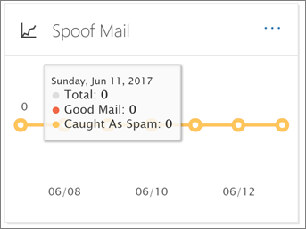

# E-mailbeveiligingsrapporten bekijken in het Beveiligings- en compliancecentrum

Er zijn verschillende rapporten beschikbaar in het [Security & Compliance Center](https://protection.office.com) om u te helpen zien hoe e-mailbeveiligingsfuncties, zoals antispam, anti-malware en versleutelingsfuncties in Microsoft 365, uw organisatie beschermen. Als u over de [benodigde machtigingen](#what-permissions-are-needed-to-view-these-reports)beschikt, u deze rapporten bekijken in het Security & Compliance Center door naar **het dashboard rapporten** \> **Dashboard**te gaan.

Uw e-mailbeveiligingsrapporten bevatten het volgende:

- [URL Threat Protection report](#url-threat-protection-report-new) **(NIEUW!**)
- [Rapport Gecompromitteerde gebruikers](#compromised-users-report)
- [Versleutelingsrapport](#encryption-report)
- [Statusrapport risicobeveiliging](#threat-protection-status-report)
- [Malware detecties rapport](#malware-detections-report)
- [Rapport Top malware](#top-malware-report)
- [Rapport Topafzenders en geadresseerden](#top-senders-and-recipients-report)
- [Rapport spoofdetecties](#spoof-detections-report)
- [Spam detecties rapport](#spam-detections-report)
- [Verzonden en ontvangen e-mailrapport](#sent-and-received-email-report)
- [Rapport met door de gebruiker gerapporteerde berichten](#user-reported-messages-report)

## URL Threat Protection report **(NIEUW!**)

Het URL Threat Protection-rapport is beschikbaar voor iedereen met:

- Een invoegtoepassing Exchange Online Protection *en* geavanceerde bedreigingsbeveiliging (abonnement 1 *of* plan 2)
- Een Microsoft 365 E5-abonnement

Dit is een 'click-centric' rapport dat twee geaggregeerde weergaven heeft.

1. De eerste weergave is door *URL klik-bescherming actie*, die is gericht op het weergeven van het aantal URL-klikken door gebruikers binnen de tenant, en het resultaat van de klik. Een klik hier geeft aan dat de gebruiker heeft geklikt via de blokpagina naar de kwaadaardige website (dit kan worden uitgeschakeld door de beheerder binnen een Safe Links beleid).

2. De tweede weergave is *URL-klik per toepassing,* waarbij het aantal URL's wordt weergegeven dat u vandaag in verschillende toepassingen klikt die veilige koppelingen ondersteunen, zoals in een e-mailclient of in Microsoft Word. Gegevens in beide geaggregeerde weergaven worden eens in de 4 uur vernieuwd.

De detailstabel van het URL Threat Protection-rapport biedt een bijna realtime weergave van alle klikken die binnen de tenant plaatsvinden, en bevat onderzoeksinformatie zoals *gebruikersnaam,* *URL,* de *netwerkbericht-id* (als de URL is aangeklikt vanuit een e-mail) en andere waardevolle informatie die nuttig is voor onderzoeken en analyses.

Standaard worden in het rapport alleen gegevens weergegeven over klikken van URL's die zijn geblokkeerd door Veilige koppelingen, maar het is ook mogelijk om informatie voor alle URL-klikken te bekijken door het selectievakje *Toegestane URL's* in de filters te selecteren.

In dit rapport worden geen gegevens van klikken van gebruikers waarop het toegepaste beleid Voor veilige koppelingen is toegepast, is de optie *Klikken van gebruikers niet bijgehouden.*

## Rapport Gecompromitteerde gebruikers

In dit rapport, dat beschikbaar is voor iedereen met Exchange Online Protection, wordt het aantal gebruikersaccounts weergegeven dat is gemarkeerd als verdachte of beperkte gebruikers, gegevens die bijzonder nuttig zijn omdat accounts een van de statussen invoeren die aangeven dat het gebruikersaccount problematisch kan zijn of zelfs gecompromitteerd. Bij veelvuldig gebruik kan het rapport Gecompromitteerde gebruiker pieken en zelfs trends herkennen in accounts die zijn gemarkeerd in verdachte of beperkte toestanden, waardoor er een probleem kan zijn met de beveiliging en het welzijn van uw tenant.

## Versleutelingsrapport

In **het versleutelingsrapport** worden informatie weergegeven over e-mailberichten die zijn versleuteld, via het beleid van uw organisatie of via besturingselementen voor eindgebruikers. Het beveiligingsteam van uw organisatie kan informatie in dit rapport gebruiken om patronen te identificeren en proactief beleid voor gevoelige e-mailberichten toe te passen of aan te passen.

Als u dit rapport wilt bekijken, gaat u in het & Compliance Center beveiliging naar **Dashboard** \> **het rapport Dashboardversleuteling** **rapporten** \> .

Wanneer het rapport voor het eerst wordt geopend, ziet u gegevens over versleutelingsmethoden die de afgelopen zeven (7) dagen in e-mailberichten zijn gebruikt. U het datumbereik en de details die in het rapport worden weergegeven wijzigen door te klikken op **Filters** in de rechterbovenhoek van het scherm.

U het menu **Opsplitsen per** menu ook gebruiken om gegevens te bekijken op versleutelingssjabloon (of methode).

En u het menu Gegevens per menu **weergeven** gebruiken om de weergave te wijzigen om het aantal versleutelde berichten te bekijken in de vijf belangrijkste adressendomeinen.

Met de flexibiliteit van het nieuwe versleutelingsrapport u trends bekijken en passende acties ondernemen. Als u bijvoorbeeld een groot aantal e-mailberichten ziet die door gebruikers zijn versleuteld, u een versleutelingsbeleid toevoegen om versleuteling voor bepaalde use cases te automatiseren. (Zie Regels voor [e-mailstroom definiëren om e-mailberichten in Microsoft 365 te versleutelen](../../compliance/define-mail-flow-rules-to-encrypt-email.md).) Als een ander voorbeeld, als u een aantal encryptiesjablonen beschikbaar hebt, maar niemand ze gebruikt, u onderzoeken of gebruikers training nodig hebben voor die functie.

Met dit rapport kan het beveiligings- en complianceteam van uw organisatie controleren hoe berichtversleuteling wordt gebruikt en of er verdere acties nodig zijn. Zie [E-mailversleuteling in Microsoft 365](../../compliance/email-encryption.md)voor meer informatie over versleuteling.

## Statusrapport risicobeveiliging

Het rapport **Status van bedreigingsbeveiliging** is een slim rapport met schadelijke e-mail die is gedetecteerd en geblokkeerd door Exchange Online Protection. Dit rapport is handig voor het bekijken van e-mail die is geïdentificeerd als malware of een phishing-poging in de loop van de tijd (tot 90 dagen) en stelt beveiligingsbeheerders in staat trends te identificeren of te bepalen of het beleid moet worden aangepast.

> [!NOTE]
> Een rapport over de status van bedreigingsbescherming is beschikbaar voor klanten die [Office 365 ATP](https://docs.microsoft.com/microsoft-365/security/office-365-security/office-365-atp) of [Exchange Online Protection](https://docs.microsoft.com/microsoft-365/security/office-365-security/what-is-eop) (EOP) hebben; De informatie die wordt weergegeven in het rapport Status bedreigingsstatus voor ATP-klanten zal echter waarschijnlijk andere gegevens bevatten dan wat EOP-klanten kunnen zien. EOP-klanten kunnen bijvoorbeeld informatie over malware die in e-mail is gedetecteerd, bekijken, maar geen informatie over [schadelijke bestanden die zijn gedetecteerd in SharePoint Online, OneDrive of Microsoft Teams,](https://docs.microsoft.com/microsoft-365/security/office-365-security/atp-for-spo-odb-and-teams)een ATP-specifieke mogelijkheid. ([Meer informatie over ATP-rapporten](https://docs.microsoft.com/microsoft-365/security/office-365-security/view-reports-for-atp).)

Als u dit rapport wilt bekijken, gaat u in het [Security & Compliance Center](https://protection.office.com)naar de status **bedreigingsbeveiliging** **van het** \> **dashboard** \> rapporten .

Wanneer u het rapport Status bedreigingsbeveiliging voor het eerst opent, worden in het rapport standaard gegevens van de afgelopen zeven dagen weergegeven. U echter op **Filters** klikken en het datumbereik wijzigen voor maximaal 90 dagen details. (Als u een proefabonnement gebruikt, bent u mogelijk beperkt tot 30 dagen aan gegevens.)

Dit rapport is handig voor het bekijken van de effectiviteit en impact van de [Exchange Online Protection-functies](https://docs.microsoft.com/microsoft-365/security/office-365-security/eop-features)van uw organisatie en voor trending op langere termijn.

U ook kiezen of u gegevens wilt bekijken voor e-mail die als kwaadaardig is geïdentificeerd, e-mail wordt geïdentificeerd als een phishing-poging of een e-mail die is geïdentificeerd als malware.

## Malware detecties rapport

Het rapport **Malware Detecties** laat zien hoeveel inkomende en uitgaande berichten zijn gedetecteerd als malware bevatten voor uw organisatie.

Ga naar \> **Meldingen** \> **dashboardmalwaredetecties**om dit rapport te bekijken in het [Security & Compliance Center.](https://protection.office.com) **Dashboard**

Net als bij andere rapporten, zoals het [rapport Status bedreigingsbeveiliging,](#threat-protection-status-report)worden in het rapport standaard gegevens van de afgelopen zeven dagen weergegeven. U echter **filters** kiezen om het datumbereik te wijzigen.

## Rapport Top malware

De **Top Malware** rapport toont de verschillende soorten malware die werd gedetecteerd door Exchange [Online](https://docs.microsoft.com/microsoft-365/security/office-365-security/eop-features).

Ga naar **Dashboard** \> **Top** \> **Malware**voor het bekijken van dit rapport in het Security & [Compliance Center.](https://protection.office.com)

Wanneer u boven een wig in het cirkeldiagram zweeft, u de naam van een soort malware zien en hoeveel berichten zijn gedetecteerd als het hebben van die malware.

Klik (of tik) op het rapport om het te openen in een nieuw browservenster, waar u een meer gedetailleerde weergave van het rapport krijgen.

Onder de grafiek ziet u een lijst met gedetecteerde malware en hoeveel berichten zijn gedetecteerd als het hebben van die malware.

## Rapport Topafzenders en geadresseerden

Het rapport **Top afzenders en geadresseerden** is een cirkeldiagram met uw belangrijkste e-mailafzenders.

Als u dit rapport wilt bekijken, gaat u in het [Security & Compliance Center](https://protection.office.com)naar **Rapporten** \> **Dashboard** \> **Top Afzenders en Geadresseerden**.

Wanneer u de boventoon over een wig in het cirkeldiagram zweeft, ziet u een aantal verzonden of ontvangen berichten.

Klik (of tik) op het rapport om het te openen in een nieuw browservenster, waar u een meer gedetailleerde weergave van het rapport krijgen.

Gebruik de lijst **Gegevens weergeven voor** om te kiezen of u gegevens wilt weergeven voor ontvangers van topafzenders, ontvangers, spamen en malwareontvangers. U ook zien wie malware heeft ontvangen die is gedetecteerd door [Exchange Online Protection.](https://docs.microsoft.com/microsoft-365/security/office-365-security/what-is-eop)

Onder de grafiek ziet u wie de belangrijkste afzenders of ontvangers van e-mail waren, samen met een aantal berichten die voor de opgegeven periode zijn verzonden of ontvangen.

## Rapport spoofdetecties

Het **rapport Spoofdetecties** laat zien hoeveel spoof-e-mailberichten zijn gedetecteerd en welke, welke als "goed" werden beschouwd (spoofmail die om legitieme zakelijke redenen is gedaan).

Als u dit rapport wilt bekijken, gaat u in het [Beveiligings& Compliance Center](https://protection.office.com)naar Dashboard **Dashboard** \> **Spoofmail** **rapporten** \> .

Wanneer u meer dan een dag in de grafiek zweeft, u zien hoeveel spoof-e-mailberichten zijn binnengekomen.

Klik (of tik) op het rapport om het te openen in een nieuw browservenster, waar u een meer gedetailleerde weergave van het rapport krijgen. Zie [Anti-spoofing bescherming in Microsoft 365](anti-spoofing-protection.md)voor meer informatie over antispoofbeveiliging.

## Spam detecties rapport

Het rapport **Spamdetecties** toont alle spam-inhoud die door Exchange Online is geblokkeerd. Berichten worden geteld per bericht en niet per ontvanger. Als er bijvoorbeeld een e-mailbericht is verzonden naar 100 ontvangers in uw organisatie, wordt het als één bericht geteld.

Ga naar **Meldingen** \> \> **dashboardspamdetecties**om dit rapport in het [Security & Compliance Center](https://protection.office.com)te bekijken. **Dashboard**

Wanneer u meer dan een dag in de grafiek zweeft, u zien hoeveel items die dag zijn geblokkeerd en hoe deze items zijn gecategoriseerd. U bijvoorbeeld zien hoeveel spamberichten zijn gefilterd en hoeveel items afkomstig zijn van een IP-adres (Blocked Internet Protocol).

Klik (of tik) op het rapport om het te openen in een nieuw browservenster, waar u een meer gedetailleerde weergave van het rapport krijgen.

Onder de grafiek ziet u een lijst met spamitems die zijn gedetecteerd. Selecteer een item om aanvullende informatie weer te geven, zoals of het spam-item binnen- of uitgaand was, de bericht-id en de ontvanger. Zie Antispambeveiliging van Office [365](https://docs.microsoft.com/microsoft-365/security/office-365-security/anti-spam-and-anti-malware-protection)voor meer informatie over antispambeveiliging.

## Verzonden en ontvangen e-mailrapport

Het **verzonden en ontvangen e-mailrapport** is een slim rapport met informatie over binnenkomende en uitgaande e-mail, inclusief spamdetecties, malware en e-mail die als 'goed' is geïdentificeerd.

Als u dit rapport wilt bekijken, gaat u in het [Beveiligingscentrum & Compliance](https://protection.office.com)naar **Rapporten** \> **Dashboard** \> **verzonden en ontvangen e-mail**.

Wanneer u meer dan een dag in de grafiek zweeft, u zien hoeveel berichten zijn binnengekomen en hoe deze berichten zijn gecategoriseerd. U bijvoorbeeld zien hoeveel berichten zijn gedetecteerd als malware en hoeveel er als spam zijn geïdentificeerd.

Klik (of tik) op het rapport om het te openen in een nieuw browservenster, waar u een meer gedetailleerde weergave van het rapport krijgen.

U de lijst **Opsplitsen per** lijst gebruiken om informatie per type of op richting te bekijken (inkomende en uitgaande).

Onder de grafiek ziet u een lijst met e-mailcategorieën, zoals **GoodMail**, **SpamContentFiltered,** enzovoort. Selecteer een categorie om aanvullende informatie weer te geven, zoals acties die zijn uitgevoerd voor malware en of e-mail binnenkomend of uitgaand was.

Zie Mail flow intelligence [in Microsoft 365](https://docs.microsoft.com/microsoft-365/security/office-365-security/mail-flow-intelligence-in-office-365)voor meer informatie over e-mailinformatie.

## Rapport met door de gebruiker gerapporteerde berichten

Het rapport **Met gebruikers gerapporteerde berichten** bevat informatie over e-mailberichten die gebruikers hebben gerapporteerd als ongewenste e-mail, phishingpogingen of goede e-mail met behulp van de [invoegtoepassing Bericht melden](https://docs.microsoft.com/microsoft-365/security/office-365-security/enable-the-report-message-add-in).

Details zijn beschikbaar voor elk bericht, inclusief de leveringsreden, zoals een uitzondering op het spambeleid of de regel voor e-mailstroom die is geconfigureerd voor uw organisatie. Als u details wilt weergeven, selecteert u een item in de lijst met gebruikersrapporten en bekijkt u de informatie op de tabbladen **Overzicht** en **Details.**

Ga als volgt te werk om dit rapport in het [Security & Compliance Center](https://protection.office.com)te bekijken:

- Ga naar Meldingen van gebruikers **van het** \> **Dashboard voor** \> **bedreigingen**.

- Ga naar Meldingen van gebruikers **controleren** \> naar **Bedreigingsbeheer** \> . **User-reported messages**

> [!IMPORTANT]
> Als het rapport Met meldingen van door de gebruiker gerapporteerde berichten correct kan werken, **moet controlelogboekregistratie zijn ingeschakeld** voor uw Office 365-omgeving. Dit wordt meestal gedaan door iemand die de rol Controlelogboeken heeft toegewezen in Exchange Online. Zie [Microsoft 365-controlelogboekzoeken in- of uitschakelen](https://docs.microsoft.com/microsoft-365/compliance/turn-audit-log-search-on-or-off)voor meer informatie.

## Welke machtigingen zijn nodig om deze rapporten te bekijken?

Als u de in dit artikel beschreven rapporten wilt bekijken en gebruiken, **moet u een geschikte rol hebben toegewezen voor zowel het Security & Compliance Center als het Exchange-beheercentrum.**

- Voor het Beveiligingscentrum & Compliance Center moet u een van de volgende rollen toegewezen hebben:

  -Organisatiebeheer - Beveiligingsbeheerder (dit kan worden toegewezen in[https://aad.portal.azure.com](https://aad.portal.azure.com)het Azure Active Directory-beheercentrum ( ) -Beveiligingslezer

- Voor Exchange Online moet u een van de volgende rollen[https://outlook.office365.com/ecp](https://outlook.office365.com/ecp)hebben toegewezen in het Exchange-beheercentrum ( ) of met PowerShell-cmdlets (Zie [Exchange Online PowerShell):](https://docs.microsoft.com/powershell/exchange/exchange-online/exchange-online-powershell?view=exchange-ps)

  -Organisatiebeheer -Alleen organisatiebeheer -Functie-weergave-alleen ontvangers -ComplianceManagement

Zie de volgende bronnen voor meer informatie:

- [Rapporten in het beveiligings- en compliancecentrum](https://docs.microsoft.com/microsoft-365/security/office-365-security/permissions-in-the-security-and-compliance-center)
 
- [Functiemachtigingen in Exchange Online](https://docs.microsoft.com/exchange/permissions-exo/feature-permissions)

## Wat gebeurt er als de rapporten geen gegevens weergeven?

Als u geen gegevens in uw rapporten ziet, controleert u of uw beleid correct is ingesteld. Zie [Beschermen tegen bedreigingen in Microsoft 365](https://docs.microsoft.com/microsoft-365/security/office-365-security/protect-against-threats)voor meer informatie.

## Verwante onderwerpen

[Microsoft 365 E-mail anti-spam bescherming](https://docs.microsoft.com/microsoft-365/security/office-365-security/anti-spam-and-anti-malware-protection)

[Rapporten en inzichten in het Security & Compliance Center](https://docs.microsoft.com/microsoft-365/security/office-365-security/reports-and-insights-in-security-and-compliance)

[Een planning maken voor een rapport in het Security & Compliance Center](https://docs.microsoft.com/microsoft-365/security/office-365-security/create-a-schedule-for-a-report)

[Een aangepast rapport instellen en downloaden in het Security & Compliance Center](https://docs.microsoft.com/microsoft-365/security/office-365-security/set-up-and-download-a-custom-report)