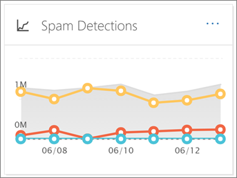

# E-mailbeveiligingsrapporten bekijken in het Beveiligings- en compliancecentrumView email security reports in the Security & Compliance Center

Er zijn verschillende rapporten beschikbaar in het [Security & Compliance Center](https://protection.office.com) om u te helpen zien hoe e-mailbeveiligingsfuncties, zoals antispam, anti-malware en versleutelingsfuncties in Office 365 uw organisatie beschermen.A variety of reports are available in the [Security & Compliance Center](https://protection.office.com) to help you see how email security features, such as anti-spam, anti-malware, and encryption features in Office 365 are protecting your organization. Als u over de [benodigde machtigingen](#what-permissions-are-needed-to-view-these-reports)beschikt, u deze rapporten bekijken in het Security & Compliance Center door naar **het dashboard rapporten** \> **Dashboard**te gaan.If you have the [necessary permissions](#what-permissions-are-needed-to-view-these-reports), you can view these reports in the Security & Compliance Center by going to **Reports** \> **Dashboard**.

Uw e-mailbeveiligingsrapporten bevatten het volgende:Your email security reports include the following:

- [URL Threat Protection report](#url-threat-protection-report-new) **(NIEUW!**)[URL Threat Protection report](#url-threat-protection-report-new) (**NEW!**)
- [Rapport Gecompromitteerde gebruikersCompromised Users report](#compromised-users-report)
- [VersleutelingsrapportEncryption report](#encryption-report)
- [Statusrapport risicobeveiligingThreat Protection Status report](#threat-protection-status-report)
- [Malware detecties rapportMalware Detections report](#malware-detections-report)
- [Rapport Top malwareTop Malware report](#top-malware-report)
- [Rapport Topafzenders en geadresseerdenTop Senders and Recipients report](#top-senders-and-recipients-report)
- [Rapport spoofdetectiesSpoof Detections report](#spoof-detections-report)
- [Spam detecties rapportSpam Detections report](#spam-detections-report)
- [Verzonden en ontvangen e-mailrapportSent and received email report](#sent-and-received-email-report)
- [Rapport met door de gebruiker gerapporteerde berichtenUser-reported messages report](#user-reported-messages-report)

## URL Threat Protection report **(NIEUW!**)URL Threat Protection report (**NEW!**)

Het URL Threat Protection-rapport is beschikbaar voor iedereen met:The URL Threat Protection report is available to anyone with:

- Een invoegtoepassing Exchange Online Protection *en* geavanceerde bedreigingsbeveiliging (abonnement 1 *of* plan 2)An Exchange Online Protection, *and* Advanced Threat Protection add-on (Plan 1 *or* Plan 2)
- Een Microsoft 365 E5-abonnementA Microsoft 365 E5 subscription

Dit is een 'click-centric' rapport dat twee geaggregeerde weergaven heeft.This is a 'click-centric' report that has two aggregated views.

1. De eerste weergave is door *URL klik-bescherming actie*, die is gericht op het weergeven van het aantal URL-klikken door gebruikers binnen de tenant, en het resultaat van de klik.The first view is by *URL click-protection action*, which is focused on showing the number of URL clicks by users within the tenant, and the result of the click. Een klik hier geeft aan dat de gebruiker heeft geklikt via de blokpagina naar de kwaadaardige website (dit kan worden uitgeschakeld door de beheerder binnen een Safe Links beleid).A click here indicates that the user has clicked through the block page to the malicious website (this can be disabled by the administrator within a Safe Links policy).

2. De tweede weergave is *URL-klik per toepassing,* waarbij het aantal URL's wordt weergegeven dat u vandaag in verschillende toepassingen klikt die veilige koppelingen ondersteunen, zoals in een e-mailclient of in Microsoft Word.The second view is *URL click by applications*, which shows the number of URLs click in different applications that support Safe Links today, such as in an email client or in Microsoft Word. Gegevens in beide geaggregeerde weergaven worden eens in de 4 uur vernieuwd.Data in both aggregated views are refreshed once every 4 hours.

De detailstabel van het URL Threat Protection-rapport biedt een bijna realtime weergave van alle klikken die binnen de tenant plaatsvinden, en bevat onderzoeksinformatie zoals *gebruikersnaam,* *URL,* de *netwerkbericht-id* (als de URL is aangeklikt vanuit een e-mail) en andere waardevolle informatie die nuttig is voor onderzoeken en analyses.The details table of the URL Threat Protection report provides a near-real-time view of all clicks that happen within the tenant, and it includes investigative information such as *username*, *URL*, the *network message ID* (if the URL was clicked from an email), and other valuable pieces of information useful for investigations and analyses.

Standaard worden in het rapport alleen gegevens weergegeven over klikken van URL's die zijn geblokkeerd door Veilige koppelingen, maar het is ook mogelijk om informatie voor alle URL-klikken te bekijken door het selectievakje *Toegestane URL's* in de filters te selecteren.By default, the report only shows data on clicks from URLs that were blocked by Safe Links, but it is also possible to see information for all URL clicks through selecting *Allowed URLs* checkbox in the filters.

In dit rapport worden geen gegevens van klikken van gebruikers waarop het toegepaste beleid Voor veilige koppelingen is toegepast, is de optie *Klikken van gebruikers niet bijgehouden.*This report will not have data of clicks from users where the Safe Links policy applied has the *Do not track user clicks* option selected.

## Rapport Gecompromitteerde gebruikersCompromised Users report

In dit rapport, dat beschikbaar is voor iedereen met Exchange Online Protection, wordt het aantal gebruikersaccounts weergegeven dat is gemarkeerd als verdachte of beperkte gebruikers, gegevens die bijzonder nuttig zijn omdat accounts een van de statussen invoeren die aangeven dat het gebruikersaccount problematisch kan zijn of zelfs gecompromitteerd.This report, available to anyone with Exchange Online Protection, shows the number of user accounts marked as Suspicious or Restricted users, data particularly useful as accounts enter either of the states that indicate the user account may be problematic, or even compromised. Bij veelvuldig gebruik kan het rapport Gecompromitteerde gebruiker pieken en zelfs trends herkennen in accounts die zijn gemarkeerd in verdachte of beperkte toestanden, waardoor er een probleem kan zijn met de beveiliging en het welzijn van uw tenant.With frequent use, the Compromised User report can spot spikes, and even trends, in accounts marked in suspicious or restricted states, giving evidence there could be an issue with security and the wellness of your tenant.

## VersleutelingsrapportEncryption report

In **het versleutelingsrapport** worden informatie weergegeven over e-mailberichten die zijn versleuteld, via het beleid van uw organisatie of via besturingselementen voor eindgebruikers.The **Encryption report** shows information about email messages that were encrypted, either through your organization's policies, or through end-user controls. Het beveiligingsteam van uw organisatie kan informatie in dit rapport gebruiken om patronen te identificeren en proactief beleid voor gevoelige e-mailberichten toe te passen of aan te passen.Your organization's security team can use information in this report to identify patterns and proactively apply or adjust policies for sensitive email messages.

Als u dit rapport wilt bekijken, gaat u in het & Compliance Center beveiliging naar **Dashboard** \> **het rapport Dashboardversleuteling** **rapporten** \> .To view this report, in the Security & Compliance Center, go to **Reports** \> **Dashboard** \> **Encryption report**.

Wanneer het rapport voor het eerst wordt geopend, ziet u gegevens over versleutelingsmethoden die de afgelopen zeven (7) dagen in e-mailberichten zijn gebruikt.When the report first opens, you'll see data about encryption methods used on email messages for the past seven (7) days. U het datumbereik en de details die in het rapport worden weergegeven wijzigen door te klikken op **Filters** in de rechterbovenhoek van het scherm.You can change the date range and the details that are displayed in the report by clicking **Filters** in the upper right corner of the screen.

U het menu **Opsplitsen per** menu ook gebruiken om gegevens te bekijken op versleutelingssjabloon (of methode).You can also use the **Break down by** menu to view data by encryption template (or method).

En u het menu Gegevens per menu **weergeven** gebruiken om de weergave te wijzigen om het aantal versleutelde berichten te bekijken in de vijf belangrijkste adressendomeinen.And, you can use the **View data by** menu to change the view to see counts of encrypted messages to the top five recipient domains.

Met de flexibiliteit van het nieuwe versleutelingsrapport u trends bekijken en passende acties ondernemen.With the flexibility of the new Encryption report, you can view trends and take appropriate actions. Als u bijvoorbeeld een groot aantal e-mailberichten ziet die door gebruikers zijn versleuteld, u een versleutelingsbeleid toevoegen om versleuteling voor bepaalde use cases te automatiseren.For example, if you see a high number of email messages encrypted by users, you might want to add an encryption policy to automate encryption for certain use cases. (Zie Regels voor [e-mailstroom definiëren om e-mailberichten in Office 365 te versleutelen](../../compliance/define-mail-flow-rules-to-encrypt-email.md).) Als een ander voorbeeld, als u een aantal encryptiesjablonen beschikbaar hebt, maar niemand ze gebruikt, u onderzoeken of gebruikers training nodig hebben voor die functie.(To get help with that, see [Define mail flow rules to encrypt email messages in Office 365](../../compliance/define-mail-flow-rules-to-encrypt-email.md).) As another example, if you have a number of encryption templates available but no one is using them, you might explore whether users need training for that feature.

Met dit rapport kan het beveiligings- en complianceteam van uw organisatie controleren hoe berichtversleuteling wordt gebruikt en of er verdere acties nodig zijn.Use this report enables your organization's security and compliance team to monitor how message encryption is being used, and whether further actions are needed. Zie [E-mailversleuteling in Office 365](../../compliance/email-encryption.md)voor meer informatie over versleuteling.To learn more about encryption, see [Email encryption in Office 365](../../compliance/email-encryption.md).

## Statusrapport risicobeveiligingThreat Protection Status report

Het rapport **Status van bedreigingsbeveiliging** is een slim rapport met schadelijke e-mail die is gedetecteerd en geblokkeerd door Exchange Online Protection.The **Threat Protection Status** report is a smart report that shows malicious email that was detected and blocked by Exchange Online Protection. Dit rapport is handig voor het bekijken van e-mail die is geïdentificeerd als malware of een phishing-poging in de loop van de tijd (tot 90 dagen) en stelt beveiligingsbeheerders in staat trends te identificeren of te bepalen of het beleid moet worden aangepast.This report is useful for viewing email identified as malware or a phishing attempt over time (up to 90 days), and it enables security administrators to identify trends or determine whether policies need adjustments.

> [!NOTE]
> Een rapport over de status van bedreigingsbescherming is beschikbaar voor klanten die [Office 365 ATP](https://docs.microsoft.com/microsoft-365/security/office-365-security/office-365-atp) of [Exchange Online Protection](https://docs.microsoft.com/microsoft-365/security/office-365-security/what-is-eop) (EOP) hebben; De informatie die wordt weergegeven in het rapport Status bedreigingsstatus voor ATP-klanten zal echter waarschijnlijk andere gegevens bevatten dan wat EOP-klanten kunnen zien.A Threat Protection Status report is available to customers who have either [Office 365 ATP](https://docs.microsoft.com/microsoft-365/security/office-365-security/office-365-atp) or [Exchange Online Protection](https://docs.microsoft.com/microsoft-365/security/office-365-security/what-is-eop) (EOP); however, the information that is displayed in the Threat Protection Status report for ATP customers will likely contain different data than what EOP customers might see. EOP-klanten kunnen bijvoorbeeld informatie over malware die in e-mail is gedetecteerd, bekijken, maar geen informatie over [schadelijke bestanden die zijn gedetecteerd in SharePoint Online, OneDrive of Microsoft Teams,](https://docs.microsoft.com/microsoft-365/security/office-365-security/atp-for-spo-odb-and-teams)een ATP-specifieke mogelijkheid.For example, EOP customers can view information about malware detected in email, but not information about [malicious files detected in SharePoint Online, OneDrive, or Microsoft Teams](https://docs.microsoft.com/microsoft-365/security/office-365-security/atp-for-spo-odb-and-teams), an ATP-specific capability. ([Meer informatie over ATP-rapporten](https://docs.microsoft.com/microsoft-365/security/office-365-security/view-reports-for-atp).)([Learn more about ATP reports](https://docs.microsoft.com/microsoft-365/security/office-365-security/view-reports-for-atp).)

Als u dit rapport wilt bekijken, gaat u in het [Security & Compliance Center](https://protection.office.com)naar de status **bedreigingsbeveiliging** **van het** \> **dashboard** \> rapporten .To view this report, in the [Security & Compliance Center](https://protection.office.com), go to **Reports** \> **Dashboard** \> **Threat Protection Status**.

Wanneer u het rapport Status bedreigingsbeveiliging voor het eerst opent, worden in het rapport standaard gegevens van de afgelopen zeven dagen weergegeven. U echter op **Filters** klikken en het datumbereik wijzigen voor maximaal 90 dagen details.When you first open the Threat Protection Status report, the report shows data for the past seven days by default; however, you can click **Filters** and change the date range for up to 90 days of detail. (Als u een proefabonnement gebruikt, bent u mogelijk beperkt tot 30 dagen aan gegevens.)(If you are using a trial subscription, you might be limited to 30 days' of data.)

Dit rapport is handig voor het bekijken van de effectiviteit en impact van de [Exchange Online Protection-functies](https://docs.microsoft.com/microsoft-365/security/office-365-security/eop-features)van uw organisatie en voor trending op langere termijn.This report is useful for viewing the effectiveness and impact of your organization's [Exchange Online Protection features](https://docs.microsoft.com/microsoft-365/security/office-365-security/eop-features), and for longer-term trending.

U ook kiezen of u gegevens wilt bekijken voor e-mail die als kwaadaardig is geïdentificeerd, e-mail wordt geïdentificeerd als een phishing-poging of een e-mail die is geïdentificeerd als malware.You can also choose whether to view data for email identified as malicious, email identified as a phishing attempts, or email identified as containing malware.

## Malware detecties rapportMalware Detections report

Het rapport **Malware Detecties** laat zien hoeveel inkomende en uitgaande berichten zijn gedetecteerd als malware bevatten voor uw organisatie.The **Malware Detections** report shows how many incoming and outgoing messages were detected as containing malware for your organization.

Ga naar \> **Meldingen** \> **dashboardmalwaredetecties**om dit rapport te bekijken in het [Security & Compliance Center.](https://protection.office.com) **Dashboard**To view this report, in the [Security & Compliance Center](https://protection.office.com), go to **Reports** \> **Dashboard** \> **Malware Detections**.

Net als bij andere rapporten, zoals het [rapport Status bedreigingsbeveiliging,](#threat-protection-status-report)worden in het rapport standaard gegevens van de afgelopen zeven dagen weergegeven.Similar to other reports, like the [Threat Protection Status report](#threat-protection-status-report), the report displays data for the past seven days by default. U echter **filters** kiezen om het datumbereik te wijzigen.However, you can choose **Filters** to change the date range.

## Rapport Top malwareTop Malware report

De **Top Malware** rapport toont de verschillende soorten malware die werd gedetecteerd door Exchange [Online](https://docs.microsoft.com/microsoft-365/security/office-365-security/eop-features).The **Top Malware** report shows the various kinds of malware that was detected by [Exchange Online](https://docs.microsoft.com/microsoft-365/security/office-365-security/eop-features).

Ga naar **Dashboard** \> **Top** \> **Malware**voor het bekijken van dit rapport in het Security & [Compliance Center.](https://protection.office.com)To view this report, in the [Security & Compliance Center](https://protection.office.com), go to **Reports** \> **Dashboard** \> **Top Malware**.

Wanneer u boven een wig in het cirkeldiagram zweeft, u de naam van een soort malware zien en hoeveel berichten zijn gedetecteerd als het hebben van die malware.When you hover over a wedge in the pie chart, you can see the name of a kind of malware and how many messages were detected as having that malware.

Klik (of tik) op het rapport om het te openen in een nieuw browservenster, waar u een meer gedetailleerde weergave van het rapport krijgen.Click (or tap) the report to open it in a new browser window, where you can get a more detailed view of the report.

Onder de grafiek ziet u een lijst met gedetecteerde malware en hoeveel berichten zijn gedetecteerd als het hebben van die malware.Below the chart, you'll see a list of detected malware and how many messages were detected as having that malware.

## Rapport Topafzenders en geadresseerdenTop Senders and Recipients report

Het rapport **Top afzenders en geadresseerden** is een cirkeldiagram met uw belangrijkste e-mailafzenders.The **Top Senders and Recipients** report is a pie chart showing your top email senders.

Als u dit rapport wilt bekijken, gaat u in het [Security & Compliance Center](https://protection.office.com)naar **Rapporten** \> **Dashboard** \> **Top Afzenders en Geadresseerden**.To view this report, in the [Security & Compliance Center](https://protection.office.com), go to **Reports** \> **Dashboard** \> **Top Senders and Recipients**.

Wanneer u de boventoon over een wig in het cirkeldiagram zweeft, ziet u een aantal verzonden of ontvangen berichten.When you hover over a wedge in the pie chart, you can see a count of messages sent or received.

Klik (of tik) op het rapport om het te openen in een nieuw browservenster, waar u een meer gedetailleerde weergave van het rapport krijgen.Click (or tap) the report to open it in a new browser window, where you can get a more detailed view of the report.

Gebruik de lijst **Gegevens weergeven voor** om te kiezen of u gegevens wilt weergeven voor ontvangers van topafzenders, ontvangers, spamen en malwareontvangers.Use the **Show data for** list to choose whether to view data for top senders, receivers, spam recipients, and malware recipients. U ook zien wie malware heeft ontvangen die is gedetecteerd door [Exchange Online Protection.](https://docs.microsoft.com/microsoft-365/security/office-365-security/what-is-eop)You can also see who received malware that was detected by [Exchange Online Protection](https://docs.microsoft.com/microsoft-365/security/office-365-security/what-is-eop).

Onder de grafiek ziet u wie de belangrijkste afzenders of ontvangers van e-mail waren, samen met een aantal berichten die voor de opgegeven periode zijn verzonden of ontvangen.Below the chart, you'll see who the top email senders or recipients were, along with a count of messages sent or received for the given time period.

## Rapport spoofdetectiesSpoof Detections report

Het **rapport Spoofdetecties** laat zien hoeveel spoof-e-mailberichten zijn gedetecteerd en welke, welke als "goed" werden beschouwd (spoofmail die om legitieme zakelijke redenen is gedaan).The **Spoof Detections** report shows how many spoof mail messages were detected, and of those, which ones were considered "good" (spoof mail done for legitimate business reasons).

Als u dit rapport wilt bekijken, gaat u in het [Beveiligings& Compliance Center](https://protection.office.com)naar Dashboard **Dashboard** \> **Spoofmail** **rapporten** \> .To view this report, in the [Security & Compliance Center](https://protection.office.com), go to **Reports** \> **Dashboard** \> **Spoof Mail**.

Wanneer u meer dan een dag in de grafiek zweeft, u zien hoeveel spoof-e-mailberichten zijn binnengekomen.When you hover over a day in the chart, you can see how many spoof mail messages came through.

Klik (of tik) op het rapport om het te openen in een nieuw browservenster, waar u een meer gedetailleerde weergave van het rapport krijgen.Click (or tap) the report to open it in a new browser window, where you can get a more detailed view of the report. Zie [Anti-spoofing beveiliging in Office 365](anti-spoofing-protection.md)voor meer informatie over antispoofbeveiliging.To learn more about anti-spoof protection, see [Anti-spoofing protection in Office 365](anti-spoofing-protection.md).

## Spam detecties rapportSpam Detections report

Het rapport **Spamdetecties** toont alle spam-inhoud die door Exchange Online is geblokkeerd.The **Spam Detections** report shows all the spam content blocked by Exchange Online. Berichten worden geteld per bericht en niet per ontvanger.Messages are counted per message, and not per recipient. Als er bijvoorbeeld een e-mailbericht is verzonden naar 100 ontvangers in uw organisatie, wordt het als één bericht geteld.For example, if an email message was sent to 100 recipients in your organization, it is counted as one message.

Ga naar **Meldingen** \> \> **dashboardspamdetecties**om dit rapport in het [Security & Compliance Center](https://protection.office.com)te bekijken. **Dashboard**To view this report, in the [Security & Compliance Center](https://protection.office.com), go to **Reports** \> **Dashboard** \> **Spam Detections**.

Wanneer u meer dan een dag in de grafiek zweeft, u zien hoeveel items die dag zijn geblokkeerd en hoe deze items zijn gecategoriseerd.When you hover over a day in the chart, you can see how many items were blocked that day, as well as how those items are categorized. U bijvoorbeeld zien hoeveel spamberichten zijn gefilterd en hoeveel items afkomstig zijn van een IP-adres (Blocked Internet Protocol).For example, you can see how many spam messages were filtered, and how many items came from a blocked Internet Protocol (IP) address.

Klik (of tik) op het rapport om het te openen in een nieuw browservenster, waar u een meer gedetailleerde weergave van het rapport krijgen.Click (or tap) the report to open it in a new browser window, where you can get a more detailed view of the report.

Onder de grafiek ziet u een lijst met spamitems die zijn gedetecteerd.Below the chart, you'll see a list of spam items that were detected. Selecteer een item om aanvullende informatie weer te geven, zoals of het spam-item binnen- of uitgaand was, de bericht-id en de ontvanger.Select an item to view additional information, such as whether the spam item was inbound or outbound, its message ID, and its recipient. Zie Antispambeveiliging van Office [365](https://docs.microsoft.com/microsoft-365/security/office-365-security/anti-spam-and-anti-malware-protection)voor meer informatie over antispambeveiliging.To learn more about anti-spam protection, see [Office 365 email anti-spam protection](https://docs.microsoft.com/microsoft-365/security/office-365-security/anti-spam-and-anti-malware-protection).

## Verzonden en ontvangen e-mailrapportSent and received email report

Het **verzonden en ontvangen e-mailrapport** is een slim rapport met informatie over binnenkomende en uitgaande e-mail, inclusief spamdetecties, malware en e-mail die als 'goed' is geïdentificeerd.The **Sent and received email** report is a smart report that shows information about incoming and outgoing email, including spam detections, malware, and email identified as "good."

Als u dit rapport wilt bekijken, gaat u in het [Beveiligingscentrum & Compliance](https://protection.office.com)naar **Rapporten** \> **Dashboard** \> **verzonden en ontvangen e-mail**.To view this report, in the [Security & Compliance Center](https://protection.office.com), go to **Reports** \> **Dashboard** \> **Sent and received email**.

Wanneer u meer dan een dag in de grafiek zweeft, u zien hoeveel berichten zijn binnengekomen en hoe deze berichten zijn gecategoriseerd.When you hover over a day in the chart, you can see how many messages came in, and how those messages are categorized. U bijvoorbeeld zien hoeveel berichten zijn gedetecteerd als malware en hoeveel er als spam zijn geïdentificeerd.For example, you can see how many messages were detected as containing malware, and how many were identified as spam.

Klik (of tik) op het rapport om het te openen in een nieuw browservenster, waar u een meer gedetailleerde weergave van het rapport krijgen.Click (or tap) the report to open it in a new browser window, where you can get a more detailed view of the report.

U de lijst **Opsplitsen per** lijst gebruiken om informatie per type of op richting te bekijken (inkomende en uitgaande).You can use the **Break down by** list to view information by type or by direction (incoming and outgoing).

Onder de grafiek ziet u een lijst met e-mailcategorieën, zoals **GoodMail**, **SpamContentFiltered,** enzovoort.Below the chart, you'll see a list of email categories, such as **GoodMail**, **SpamContentFiltered**, and so on. Selecteer een categorie om aanvullende informatie weer te geven, zoals acties die zijn uitgevoerd voor malware en of e-mail binnenkomend of uitgaand was.Select a category to view additional information, such as actions that were taken for malware, and whether email was incoming or outgoing.

Zie Mail flow intelligence [in Office 365](https://docs.microsoft.com/microsoft-365/security/office-365-security/mail-flow-intelligence-in-office-365)voor meer informatie over e-mailinformatie.To learn more about email intelligence, see [Mail flow intelligence in Office 365](https://docs.microsoft.com/microsoft-365/security/office-365-security/mail-flow-intelligence-in-office-365).

## Rapport met door de gebruiker gerapporteerde berichtenUser-reported messages report

Het rapport **Met gebruikers gerapporteerde berichten** bevat informatie over e-mailberichten die gebruikers hebben gerapporteerd als ongewenste e-mail, phishingpogingen of goede e-mail met behulp van de [invoegtoepassing Bericht melden](https://docs.microsoft.com/microsoft-365/security/office-365-security/enable-the-report-message-add-in).The **User-reported messages** report shows information about email messages that users have reported as junk, phishing attempts, or good mail by using the [Report Message add-in](https://docs.microsoft.com/microsoft-365/security/office-365-security/enable-the-report-message-add-in).

Details zijn beschikbaar voor elk bericht, inclusief de leveringsreden, zoals een uitzondering op het spambeleid of de regel voor e-mailstroom die is geconfigureerd voor uw organisatie.Details are available for each message, including the delivery reason, such a spam policy exception or mail flow rule configured for your organization. Als u details wilt weergeven, selecteert u een item in de lijst met gebruikersrapporten en bekijkt u de informatie op de tabbladen **Overzicht** en **Details.**To view details, select an item in the user-reports list, and then view the information on the **Summary** and **Details** tabs.

Ga als volgt te werk om dit rapport in het [Security & Compliance Center](https://protection.office.com)te bekijken:To view this report, in the [Security & Compliance Center](https://protection.office.com), do one of the following:

- Ga naar Meldingen van gebruikers **van het** \> **Dashboard voor** \> **bedreigingen**.Go to **Threat management** \> **Dashboard** \> **User-reported messages**.

- Ga naar Meldingen van gebruikers **controleren** \> naar **Bedreigingsbeheer** \> . **User-reported messages**Go to **Threat management** \> **Review** \> **User-reported messages**.

> [!IMPORTANT]
> Als het rapport Met meldingen van door de gebruiker gerapporteerde berichten correct kan werken, **moet controlelogboekregistratie zijn ingeschakeld** voor uw Office 365-omgeving.In order for the User-reported messages report to work correctly, **audit logging must be turned on** for your Office 365 environment. Dit wordt meestal gedaan door iemand die de rol Controlelogboeken heeft toegewezen in Exchange Online.This is typically done by someone who has the Audit Logs role assigned in Exchange Online. Voor meer informatie, zie [Auditlogboeken zoeken in Office 365 in- of uitschakelen](https://docs.microsoft.com/microsoft-365/compliance/turn-audit-log-search-on-or-off).For more information, see [Turn Office 365 audit log search on or off](https://docs.microsoft.com/microsoft-365/compliance/turn-audit-log-search-on-or-off).

## Welke machtigingen zijn nodig om deze rapporten te bekijken?What permissions are needed to view these reports?

Als u de in dit artikel beschreven rapporten wilt bekijken en gebruiken, **moet u een geschikte rol hebben toegewezen voor zowel het Security & Compliance Center als het Exchange-beheercentrum.**In order to view and use the reports described in this article, **you must have an appropriate role assigned for both the Security & Compliance Center and the Exchange admin center**.

- Voor het Beveiligingscentrum & Compliance Center moet u een van de volgende rollen toegewezen hebben:For the Security & Compliance Center, you must have one of the following roles assigned:

  -Organisatiebeheer - Beveiligingsbeheerder (dit kan worden toegewezen in[https://aad.portal.azure.com](https://aad.portal.azure.com)het Azure Active Directory-beheercentrum ( ) -Beveiligingslezer-Organization Management -Security Administrator (this can be assigned in the Azure Active Directory admin center ([https://aad.portal.azure.com](https://aad.portal.azure.com)) -Security Reader

- Voor Exchange Online moet u een van de volgende rollen[https://outlook.office365.com/ecp](https://outlook.office365.com/ecp)hebben toegewezen in het Exchange-beheercentrum ( ) of met PowerShell-cmdlets (Zie [Exchange Online PowerShell):](https://docs.microsoft.com/powershell/exchange/exchange-online/exchange-online-powershell?view=exchange-ps)For Exchange Online, you must have one of the following roles assigned in either the Exchange admin center ([https://outlook.office365.com/ecp](https://outlook.office365.com/ecp)) or with PowerShell cmdlets (See [Exchange Online PowerShell](https://docs.microsoft.com/powershell/exchange/exchange-online/exchange-online-powershell?view=exchange-ps)):

  -Organisatiebeheer -Alleen organisatiebeheer -Functie-weergave-alleen ontvangers -ComplianceManagement-Organization Management -View-only Organization Management -View-Only Recipients role -Compliance Management

Zie de volgende bronnen voor meer informatie:To learn more, see the following resources:

- [Machtigingen in het Office 365 Security & Compliance CenterPermissions in the Office 365 Security & Compliance Center](https://docs.microsoft.com/microsoft-365/security/office-365-security/permissions-in-the-security-and-compliance-center)

- [Functiemachtigingen in Exchange OnlineFeature permissions in Exchange Online](https://docs.microsoft.com/exchange/permissions-exo/feature-permissions)

## Wat gebeurt er als de rapporten geen gegevens weergeven?What if the reports aren't showing data?

Als u geen gegevens in uw rapporten ziet, controleert u of uw beleid correct is ingesteld.If you are not seeing data in your reports, double-check that your policies are set up correctly. Zie [Beschermen tegen bedreigingen in Office 365](https://docs.microsoft.com/microsoft-365/security/office-365-security/protect-against-threats)voor meer informatie.To learn more, see [Protect against threats in Office 365](https://docs.microsoft.com/microsoft-365/security/office-365-security/protect-against-threats).

## Verwante onderwerpenRelated topics

[Beveiliging tegen spam in Office 365Office 365 Email Anti-Spam Protection](https://docs.microsoft.com/microsoft-365/security/office-365-security/anti-spam-and-anti-malware-protection)

[Rapporten en inzichten in het Office 365 Security & Compliance CenterReports and insights in the Office 365 Security & Compliance Center](https://docs.microsoft.com/microsoft-365/security/office-365-security/reports-and-insights-in-security-and-compliance)

[Een planning maken voor een rapport in het Security & Compliance CenterCreate a schedule for a report in the Security & Compliance Center](https://docs.microsoft.com/microsoft-365/security/office-365-security/create-a-schedule-for-a-report)

[Een aangepast rapport instellen en downloaden in het Security & Compliance CenterSet up and download a custom report in the Security & Compliance Center](https://docs.microsoft.com/microsoft-365/security/office-365-security/set-up-and-download-a-custom-report)
