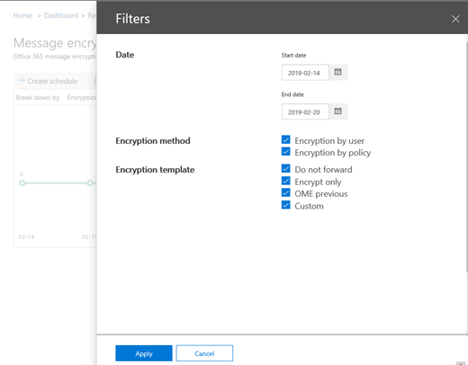

# E-mailbeveiligingsrapporten bekijken in het Beveiligings- en compliancecentrum

Er zijn verschillende rapporten beschikbaar in het [Security & Compliance Center](https://protection.office.com) om u te laten zien hoe e-mailbeveiligingsfuncties, zoals anti-spam, anti-malware en versleutelingsfuncties in Microsoft 365 uw organisatie beschermen. Als u over de [benodigde machtigingen](#what-permissions-are-needed-to-view-these-reports)beschikt, u deze rapporten bekijken in het Security & Compliance Center door naar **Dashboard Rapporten** te gaan \> **Dashboard**.

Uw e-mailbeveiligingsrapporten bevatten het volgende:

- [URL Threat Protection rapport](#url-threat-protection-report-new) **(NIEUW!**)
- [Gecompromitteerde gebruikers melden](#compromised-users-report)
- [Versleutelingsrapport](#encryption-report)
- [Statusrapport risicobeveiliging](#threat-protection-status-report)
- [Rapport Malwaredetecties](#malware-detections-report)
- [Top malware rapport](#top-malware-report)
- [Rapport Top afzenders en geadresseerden](#top-senders-and-recipients-report)
- [Rapport Spoofdetecties](#spoof-detections-report)
- [Rapport Spamdetecties](#spam-detections-report)
- [Verzonden en ontvangen e-mailrapport](#sent-and-received-email-report)
- [Rapport door door gebruikers gerapporteerde berichten](#user-reported-messages-report)

## URL Threat Protection rapport **(NIEUW!**)

Het URL Threat Protection-rapport is beschikbaar voor iedereen met:

- Een Exchange Online Protection *en* Advanced Threat Protection add-on (Plan 1 *of* Plan 2)
- Een Microsoft 365 E5-abonnement

Dit is een 'click-centric' rapport dat twee geaggregeerde weergaven heeft.

1. De eerste weergave is door URL klikbeveiliging actie , die is gericht op het weergeven van het aantal *URL-klikken*door gebruikers binnen de tenant, en het resultaat van de klik. Een klik hier geeft aan dat de gebruiker heeft geklikt via de blok pagina naar de kwaadaardige website (dit kan worden uitgeschakeld door de beheerder binnen een Safe Links beleid).

2. De tweede weergave is *URL-klik op toepassingen,* die het aantal URL's laat zien dat wordt geklikt in verschillende toepassingen die vandaag de dag veilige koppelingen ondersteunen, zoals in een e-mailclient of in Microsoft Word. Gegevens in beide geaggregeerde weergaven worden eenmaal per 4 uur vernieuwd.

De detailtabel van het URL Threat Protection-rapport biedt een bijna realtime weergave van alle klikken die binnen de tenant plaatsvinden, en bevat onderzoeksinformatie zoals *gebruikersnaam,* *URL,* de *netwerkbericht-ID* (als de URL vanuit een e-mail is geklikt) en andere waardevolle informatie die nuttig is voor onderzoeken en analyses.

Standaard worden in het rapport alleen gegevens weergegeven over klikken van URL's die zijn geblokkeerd door veilige koppelingen, maar het is ook mogelijk om informatie voor alle URL-klikken te zien door *het selectievakje Toegestane URL's* in de filters te selecteren.

In dit rapport worden geen gegevens van klikken van gebruikers weergegeven waarbij het toegepaste beleid Voor veilige koppelingen de optie *Klikken van gebruikers niet bijhouden* is geselecteerd.

## Gecompromitteerde gebruikers melden

Dit rapport, beschikbaar voor iedereen met Exchange Online Protection, toont het aantal gebruikersaccounts gemarkeerd als verdachte of beperkte gebruikers, gegevens die bijzonder nuttig zijn als accounts een van de staten invoeren die aangeven dat het gebruikersaccount problematisch kan zijn of zelfs gecompromitteerd. Bij veelvuldig gebruik kan het rapport gecompromitteerde gebruikers pieken en zelfs trends herkennen in accounts die zijn gemarkeerd in verdachte of beperkte toestanden, wat het bewijs geeft dat er een probleem kan zijn met de beveiliging en het welzijn van uw tenant.

## Versleutelingsrapport

In **het rapport Versleuteling** wordt informatie weergegeven over e-mailberichten die zijn versleuteld, hetzij via het beleid van uw organisatie, hetzij via besturingselementen van eindgebruikers. Het beveiligingsteam van uw organisatie kan informatie in dit rapport gebruiken om patronen te identificeren en proactief beleid voor gevoelige e-mailberichten toe te passen of aan te passen.

Als u dit rapport wilt weergeven, gaat u in het Security & Compliance Center naar **rapport Rapporten** \> **Dashboard** \> **Versleuteling**.

Wanneer het rapport voor het eerst wordt geopend, ziet u gegevens over versleutelingsmethoden die de afgelopen zeven (7) dagen in e-mailberichten zijn gebruikt. U het datumbereik en de details die in het rapport worden weergegeven, wijzigen door op **Filters** in de rechterbovenhoek van het scherm te klikken.

U ook het **menu Uitsplitsen per** menu gebruiken om gegevens weer te geven op basis van versleutelingssjabloon (of methode).

En u de **gegevens weergeven per** menu gebruiken om de weergave te wijzigen om het aantal versleutelde berichten naar de vijf bovenste domeinen van geadresseerden te zien.

Met de flexibiliteit van het nieuwe versleutelingsrapport u trends bekijken en passende acties ondernemen. Als u bijvoorbeeld een groot aantal e-mailberichten ziet die door gebruikers zijn versleuteld, u een versleutelingsbeleid toevoegen om versleuteling voor bepaalde use cases te automatiseren. (Zie [E-mailstroomregels definiëren om e-mailberichten te versleutelen in Microsoft 365 (Zie Regels voor e-mailstroom definiëren om e-mailberichten te versleutelen.)](../../compliance/define-mail-flow-rules-to-encrypt-email.md) Als u een aantal versleutelingssjablonen beschikbaar hebt, maar niemand ze gebruikt, u bijvoorbeeld onderzoeken of gebruikers training voor die functie nodig hebben.

Met dit rapport kan het beveiligings- en nalevingsteam van uw organisatie controleren hoe berichtversleuteling wordt gebruikt en of verdere acties nodig zijn. Zie [E-mailversleuteling in Microsoft 365](../../compliance/email-encryption.md)voor meer informatie over versleuteling.

## Statusrapport risicobeveiliging

Het rapport **Bedreigingsbeveiligingsstatus** is een slim rapport met schadelijke e-mail die is gedetecteerd en geblokkeerd door Exchange Online Protection. Dit rapport is handig voor het bekijken van e-mail die in de loop van de tijd is geïdentificeerd als malware of een phishingpoging (tot 90 dagen), en het stelt beveiligingsbeheerders in staat om trends te identificeren of te bepalen of het beleid moet worden aangepast.

> [!NOTE]
> Een rapport over de status van bedreigingsbescherming is beschikbaar voor klanten die [office 365 ATP](https://docs.microsoft.com/microsoft-365/security/office-365-security/office-365-atp) of [Exchange Online Protection](exchange-online-protection-overview.md) (EOP) hebben; De informatie die wordt weergegeven in het rapport Bedreigingsstatus voor ATP-klanten zal echter waarschijnlijk andere gegevens bevatten dan wat EOP-klanten kunnen zien. EOP-klanten kunnen bijvoorbeeld informatie bekijken over malware die in e-mail is gedetecteerd, maar geen informatie over [schadelijke bestanden die zijn gedetecteerd in SharePoint Online, OneDrive of Microsoft Teams](https://docs.microsoft.com/microsoft-365/security/office-365-security/atp-for-spo-odb-and-teams), een ATP-specifieke mogelijkheid. ([Meer informatie over ATP-rapporten](https://docs.microsoft.com/microsoft-365/security/office-365-security/view-reports-for-atp).)

Als u dit rapport wilt bekijken, gaat u in het [Security & Compliance Center](https://protection.office.com)naar De status van bedreigingsbeveiliging van **Reports** \> **rapportendashboard** \> **Threat Protection Status**.

Wanneer u het rapport Bedreigingsbeveiligingsstatus voor het eerst opent, worden in het rapport standaard gegevens van de afgelopen zeven dagen weergegeven. U echter op **Filters** klikken en het datumbereik wijzigen voor maximaal 90 dagen detail. (Als u een proefabonnement gebruikt, bent u mogelijk beperkt tot 30 dagen aan gegevens.)

Dit rapport is handig voor het bekijken van de effectiviteit en impact van de [Exchange Online Protection-functies](https://docs.microsoft.com/microsoft-365/security/office-365-security/eop-features)van uw organisatie en voor trending op langere termijn.

U ook kiezen of u gegevens wilt bekijken voor e-mail die is geïdentificeerd als kwaadaardig, e-mail die is geïdentificeerd als een phishingpoging of e-mail die is geïdentificeerd als malware.

## Rapport Malwaredetecties

Het rapport **Malwaredetecties** laat zien hoeveel binnenkomende en uitgaande berichten zijn gedetecteerd als malware voor uw organisatie.

Als u dit rapport wilt bekijken, gaat u in het [Security & Compliance Center](https://protection.office.com)naar **Meldingen** \> **Dashboard** \> **Malware Detections**.

Net als bij andere rapporten, zoals het [rapport Bedreigingsstatus,](#threat-protection-status-report)worden in het rapport standaard gegevens van de afgelopen zeven dagen weergegeven. U filters echter **kiezen** om het datumbereik te wijzigen.

## Top malware rapport

De **Top Malware** rapport toont de verschillende soorten malware die werd gedetecteerd door Exchange [Online](https://docs.microsoft.com/microsoft-365/security/office-365-security/eop-features).

Als u dit rapport wilt bekijken, gaat u in het [Security & Compliance Center](https://protection.office.com)naar **Rapporten** \> **Dashboard** \> **Top Malware**.

Wanneer u boven een wig in het cirkeldiagram hangt, u de naam van een soort malware zien en hoeveel berichten zijn gedetecteerd als het hebben van die malware.

Klik (of tik) op het rapport om het te openen in een nieuw browservenster, waar u een gedetailleerdere weergave van het rapport krijgen.

Onder de grafiek ziet u een lijst met gedetecteerde malware en hoeveel berichten zijn gedetecteerd als het hebben van die malware.

## Rapport Top afzenders en geadresseerden

Het rapport **Top senders and recipients** is een cirkeldiagram met uw beste e-mail afzenders.

Als u dit rapport wilt bekijken, gaat u in het [Security & Compliance Center](https://protection.office.com)naar **Rapporten** \> **Dashboard** \> **Top Senders and Recipients**.

Wanneer u over een wig in het cirkeldiagram beweegt, ziet u een aantal verzonden of ontvangen berichten.

Klik (of tik) op het rapport om het te openen in een nieuw browservenster, waar u een gedetailleerdere weergave van het rapport krijgen.

Gebruik de **lijst Gegevens weergeven voor** om te kiezen of gegevens moeten worden weergegeven voor top afzenders, ontvangers, spamontvangers en ontvangers van malware. U ook zien wie malware heeft ontvangen die is gedetecteerd door [Exchange Online Protection.](exchange-online-protection-overview.md)

Onder de grafiek ziet u wie de beste e-mail afzenders of ontvangers waren, samen met een aantal berichten verzonden of ontvangen voor de gegeven periode.

## Rapport Spoofdetecties

Het rapport **Spoofdetecties** laat zien hoeveel spoofmailberichten zijn gedetecteerd en welke als "goed" werden beschouwd (spoofmail gedaan om legitieme zakelijke redenen).

Als u dit rapport wilt weergeven, gaat u in het [Security & Compliance Center](https://protection.office.com)naar **Rapporten** \> **Dashboard** \> **Spoof Mail**.

Wanneer u meer dan een dag in de grafiek zweeft, u zien hoeveel spoofberichten zijn verzonden.

Klik (of tik) op het rapport om het te openen in een nieuw browservenster, waar u een gedetailleerdere weergave van het rapport krijgen. Zie [Anti-spoofing-beveiliging in Microsoft 365](anti-spoofing-protection.md)voor meer informatie over anti-spoofbeveiliging.

## Rapport Spamdetecties

Het rapport **Spamdetecties** toont alle spam-inhoud die door Exchange Online is geblokkeerd. Berichten worden geteld per bericht en niet per ontvanger. Als er bijvoorbeeld een e-mailbericht naar 100 geadresseerden in uw organisatie is verzonden, wordt dit als één bericht geteld.

Ga in het [Security & Compliance Center](https://protection.office.com)naar **Rapporten** \> **Dashboard** \> **Spam Detections**om dit rapport te bekijken.

Wanneer u gedurende een dag in de grafiek zweeft, u zien hoeveel items die dag zijn geblokkeerd en hoe deze items zijn gecategoriseerd. U bijvoorbeeld zien hoeveel spamberichten zijn gefilterd en hoeveel items afkomstig zijn van een geblokkeerd IP-adres (Internet Protocol).

Klik (of tik) op het rapport om het te openen in een nieuw browservenster, waar u een gedetailleerdere weergave van het rapport krijgen.

Onder de grafiek ziet u een lijst met spamitems die zijn gedetecteerd. Selecteer een item om aanvullende informatie weer te geven, zoals of het spamitem binnenkomend of uitgaand was, de bericht-ID en de ontvanger. Zie [Anti-spambeveiliging voor Office 365-e-mail voor meer informatie over antispambeveiliging.](https://docs.microsoft.com/microsoft-365/security/office-365-security/anti-spam-and-anti-malware-protection)

## Verzonden en ontvangen e-mailrapport

Het **verzonden en ontvangen e-mailrapport** is een slim rapport met informatie over inkomende en uitgaande e-mail, waaronder spamdetecties, malware en e-mail die als 'goed' zijn geïdentificeerd.

Als u dit rapport wilt bekijken, gaat u in het [Security & Compliance Center](https://protection.office.com)naar **Verzonden rapportendashboard** \> **Dashboard** \> **en ontvangen e-mail**.

Wanneer u gedurende een dag in de grafiek zweeft, u zien hoeveel berichten zijn binnengekomen en hoe deze berichten zijn gecategoriseerd. U bijvoorbeeld zien hoeveel berichten zijn gedetecteerd als malware en hoeveel er als spam zijn geïdentificeerd.

Klik (of tik) op het rapport om het te openen in een nieuw browservenster, waar u een gedetailleerdere weergave van het rapport krijgen.

U de **lijst Opsplitsen per** lijst gebruiken om informatie per type of per richting (inkomende en uitgaande) weer te geven.

Onder de grafiek ziet u een lijst met e-mailcategorieën, zoals **GoodMail**, **SpamContentFiltered,** enzovoort. Selecteer een categorie om aanvullende informatie weer te geven, zoals acties die zijn uitgevoerd voor malware en of e-mail binnenkomend of extravert was.

Zie [E-mailstroomintelligentie in Microsoft 365](https://docs.microsoft.com/microsoft-365/security/office-365-security/mail-flow-intelligence-in-office-365)voor meer informatie over e-mailinformatie.

## Rapport door door gebruikers gerapporteerde berichten

In het rapport **Door gebruikers gerapporteerde berichten** wordt informatie weergegeven over e-mailberichten die gebruikers hebben gerapporteerd als ongewenste e-mail, phishing-pogingen of goede e-mail met behulp van de [invoegtoepassing Rapportbericht](https://docs.microsoft.com/microsoft-365/security/office-365-security/enable-the-report-message-add-in).

Details zijn beschikbaar voor elk bericht, inclusief de reden van de levering, een dergelijke uitzondering van het spambeleid of de regel voor de e-mailstroom die is geconfigureerd voor uw organisatie. Als u details wilt weergeven, selecteert u een item in de lijst met gebruikersrapporten en bekijkt u de informatie op de tabbladen **Overzicht** en **Details.**

Als u dit rapport wilt bekijken, gaat u in het [Security & Compliance Center](https://protection.office.com)een van de volgende handelingen uit:

- Ga **Threat management** naar \> **Dashboard** \> **Waarschuwingsbeheer**Dashboard Door gebruikers gerapporteerde berichten .

- Ga naar **door gebruikers** \> gerapporteerde berichten voor **Review** \> **bedreigingsbeheercontrole.**

> [!IMPORTANT]
> Als u wilt dat het rapport Door de gebruiker gerapporteerde berichten correct werkt, **moet controleregistratie zijn ingeschakeld** voor uw Office 365-omgeving. Dit wordt meestal gedaan door iemand die de rol Controlelogboeken heeft toegewezen in Exchange Online. Zie [Microsoft 365-controlelogboek zoeken in- of uitschakelen](https://docs.microsoft.com/microsoft-365/compliance/turn-audit-log-search-on-or-off)voor meer informatie.

## Welke machtigingen zijn nodig om deze rapporten weer te geven?

Als u de in dit artikel beschreven rapporten wilt bekijken en gebruiken, **moet u een passende rol hebben toegewezen voor zowel het Security & Compliance Center als het Exchange-beheercentrum.**

- Voor het Security & Compliance Center moet een van de volgende rollen zijn toegewezen:

  -Organisatiebeheer -Beveiligingsbeheerder (dit kan worden toegewezen in het Azure Active Directory-beheercentrum ( [https://aad.portal.azure.com](https://aad.portal.azure.com) ) -Beveiligingslezer

- Voor Exchange Online moet u een van de volgende rollen hebben toegewezen in het Exchange-beheercentrum ( [https://outlook.office365.com/ecp](https://outlook.office365.com/ecp) ) of met PowerShell-cmdlets (Zie [Exchange Online PowerShell):](https://docs.microsoft.com/powershell/exchange/exchange-online-powershell)

  -Organisatiebeheer -Alleen-weergave organisatiebeheer -Functie alleen weergeven ontvangers -Compliance Management

Zie de volgende bronnen voor meer informatie:

- [Rapporten in het beveiligings- en compliancecentrum](https://docs.microsoft.com/microsoft-365/security/office-365-security/permissions-in-the-security-and-compliance-center)
 
- [Functiemachtigingen in Exchange Online](https://docs.microsoft.com/exchange/permissions-exo/feature-permissions)

## Wat als de rapporten geen gegevens weergeven?

Als u geen gegevens in uw rapporten ziet, controleert u dubbel of uw beleid correct is ingesteld. Zie [Beschermen tegen bedreigingen in Microsoft 365](https://docs.microsoft.com/microsoft-365/security/office-365-security/protect-against-threats)voor meer informatie.

## Verwante onderwerpen

[Microsoft 365 E-mail anti-spam bescherming](https://docs.microsoft.com/microsoft-365/security/office-365-security/anti-spam-and-anti-malware-protection)

[Rapporten en inzichten in het Security & Compliance Center](https://docs.microsoft.com/microsoft-365/security/office-365-security/reports-and-insights-in-security-and-compliance)
