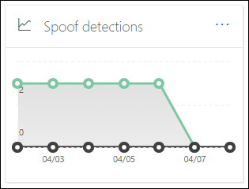

# E-mailbeveiligingsrapporten bekijken in het Beveiligings- en compliancecentrumView email security reports in the Security & Compliance Center

[!INCLUDE [Microsoft 365 Defender rebranding](../includes/microsoft-defender-for-office.md)]

Er zijn diverse rapporten beschikbaar in het [beveiligings & compliance Center](https://protection.office.com) , zodat u kunt zien hoe e-mail beveiligingsfuncties, zoals antispam, anti-malware en versleutelings functies in microsoft 365, uw organisatie beschermen.A variety of reports are available in the [Security & Compliance Center](https://protection.office.com) to help you see how email security features, such as anti-spam, anti-malware, and encryption features in Microsoft 365 are protecting your organization. Als u de [benodigde machtigingen](#what-permissions-are-needed-to-view-these-reports)hebt, kunt u deze rapporten weergeven in het compliance-beveiligings & door  naar het \> **Dashboard** rapporten te gaan.If you have the [necessary permissions](#what-permissions-are-needed-to-view-these-reports), you can view these reports in the Security & Compliance Center by going to **Reports** \> **Dashboard**. Open om rechtstreeks naar het Dashboard rapporten te gaan <https://protection.office.com/insightdashboard> .To go directly to the Reports dashboard, open <https://protection.office.com/insightdashboard>.

## Rapport met verkraakte gebruikersCompromised users report

> [!NOTE]
> Dit rapport is beschikbaar in Microsoft 365-organisaties met postvakken van Exchange Online.This report is available in Microsoft 365 organizations with Exchange Online mailboxes. Deze functie is niet beschikbaar in zelfstandige Exchange Online Protection (EOP)-organisaties.It's not available in standalone Exchange Online Protection (EOP) organizations.

Het rapport verdachte **gebruikers** toont het aantal gebruikersaccounts dat is gemarkeerd als **verdacht** of **beperkt** in de afgelopen 7 dagen.The **Compromised users** report shows shows the number of user accounts that were marked as **Suspicious** or **Restricted** within the last 7 days. Accounts in een van deze statussen zijn problematisch of zelfs aangetast.Accounts in either of these states are problematic or even compromised. Met vaak gebruikte rapporten kunt u de lijst gebruiken om pieken en zelfs trends te gebruiken in verdachte of beperkte accounts.With frequent use, you can use the report to spot spikes, and even trends, in suspicious or restricted accounts. Zie [reageren op een gemanipuleerd e-mailaccount](responding-to-a-compromised-email-account.md)voor meer informatie over gebruikers die een aanval hebben.For more information about compromised users, see [Responding to a compromised email account](responding-to-a-compromised-email-account.md).

De statistische weergave bevat gegevens voor de laatste 90 dagen en de detailweergave bevat gegevens voor de afgelopen 30 dagen.The aggregate view shows data for the last 90 days and the detail view shows data for the last 30 days.

Als u het rapport wilt weergeven, opent u het [beveiligings & compliance](https://protection.office.com), gaat u naar  \> **Dashboard** rapporten en selecteert u gebruikers die zijn **gemanipuleerd**.To view the report, open the [Security & Compliance Center](https://protection.office.com), go to **Reports** \> **Dashboard** and select **Compromised users**. Open om rechtstreeks naar het rapport te gaan <https://protection.office.com/reportv2?id=CompromisedUsers> .To go directly to the report, open <https://protection.office.com/reportv2?id=CompromisedUsers>.

U kunt zowel de grafiek als de tabel met details filteren door op **filters** te klikken en een of meer van de volgende waarden te selecteren:You can filter both the chart and the details table by clicking **Filters** and selecting one or more of the following values:

- **Begindatum** en **einddatum****Start date** and **End date**

- **Verdacht**: het gebruikersaccount heeft verdachte e-mail verzonden en loopt tegen een beperkte beperking van het verzenden van e-mail.**Suspicious**: The user account has sent suspicious email and is at risk of being restricted from sending email.

- **Beperkt**: het gebruikersaccount mag geen e-mail verzenden vanwege zeer verdachte patronen.**Restricted**: The user account has been restricted from sending email due to highly suspicious patterns.

Als u op **detail tabel weergeven** klikt, ziet u de volgende informatie:If you click **View details table**, you can see the following details:

- **Tijdstip van aanmaken****Creation time**
- **Gebruikers-ID****User ID**
- **Actie****Action**

Als u terug wilt gaan naar de rapportweergave, klikt u op **rapport weergeven**.To go back to the report view, click **View report**.

## Versleutelings rapportEncryption report

Het **versleutelings rapport** is beschikbaar in EOP (abonnementen met postvakken in Exchange Online of zelfstandige EOP zonder postvakken van Exchange Online).The **Encryption report** is available in EOP (subscriptions with mailboxes in Exchange Online or standalone EOP without Exchange Online mailboxes). Het beveiligingsteam van uw organisatie kan informatie in dit rapport gebruiken om patronen te identificeren en beleid proactief toe te passen of te wijzigen voor gevoelige e-mailberichten.Your organization's security team can use information in this report to identify patterns and proactively apply or adjust policies for sensitive email messages. Bijvoorbeeld:For example:

- Als u een groot aantal e-mailberichten met versleutelde gebruikers ziet, wilt u misschien een versleutelingsbeleid toevoegen om versleuteling te automatiseren voor bepaalde use cases.If you see a high number of email messages encrypted by users, you might want to add an encryption policy to automate encryption for certain use cases. Zie voor meer informatie [e-mail stroom regels definiëren voor het versleutelen van e-mailberichten in Microsoft 365](../../compliance/define-mail-flow-rules-to-encrypt-email.md).For more information, see [Define mail flow rules to encrypt email messages in Microsoft 365](../../compliance/define-mail-flow-rules-to-encrypt-email.md).

- Als u beschikt over een aantal beschikbare versleutelings sjablonen, maar niemand deze gebruikt, kunt u zien of gebruikersfunctie training nodig hebben.If you have a number of encryption templates available but no one is using them, you might explore whether users need feature training.

Met de cumulatieve weergave kunnen filters voor de laatste 90 dagen worden gefilterd, maar in de weergave Details kunt u filteren gedurende 10 dagen.The aggregate view allows filtering for the last 90 days, while the detail view allows filtering for 10 days.

Als u het rapport wilt weergeven, opent u het [beveiligings & compliance](https://protection.office.com), gaat u naar **rapporten** \> **Dashboard** en selecteert u **versleutelings rapport**.To view the report, open the [Security & Compliance Center](https://protection.office.com), go to **Reports** \> **Dashboard** and select **Encryption report**. Open om rechtstreeks naar het rapport te gaan <https://protection.office.com/reportv2?id=EncryptionReport> .To go directly to the report, open <https://protection.office.com/reportv2?id=EncryptionReport>.

Zie voor meer informatie over versleuteling [e-mail versleuteling in Microsoft 365](../../compliance/email-encryption.md).To learn more about encryption, see [Email encryption in Microsoft 365](../../compliance/email-encryption.md).

### Rapportweergave voor het versleutelings rapportReport view for the Encryption report

U kunt de volgende filters in de grafiek gebruiken:You can use the following filters on the chart:

- **Gegevens weergeven op: bericht versleutelings rapport** en **opsplitsen met: versleutelingsmethode**: de volgende versleutelingsmethoden zijn beschikbaar:**View data by: Message Encryption Report** and **Break down by: Encryption method**: The following encryption methods are available:

  - **Versleuteling per gebruiker****Encryption by user**
  - **Versleuteling op basis van beleid****Encryption by policy**

  Als u op **filters** klikt, kunt u de grafiek met de volgende filters wijzigen:If you click **Filters**, you can modify the chart with the following filters:

  - **Begindatum** en **einddatum****Start date** and **End date**
  - Versleutelingsmethode.Encryption method.
  - Versleutelings sjabloon.Encryption template.

- **Gegevens weergeven op: bericht versleutelings rapport** en **opsplitsen met:** versleutelingsmethode: de volgende versleutelingsmethoden zijn beschikbaar:**View data by: Message Encryption Report** and **Break down by: Encryption template**: The following encryption methods are available:

  - **Niet doorschakelen****Do not forward**
  - **Alleen versleutelen****Encrypt only**
  - **OME vorige****OME previous**
  - **Gemaakte****Custom**

  Als u op **filters** klikt, kunt u de grafiek met de volgende filters wijzigen:If you click **Filters**, you can modify the chart with the following filters:

  - **Begindatum** en **einddatum****Start date** and **End date**
  - VersleutelingsmethodeEncryption method
  - Versleutelings sjabloonEncryption template

- **Gegevens weergeven op: domeinen van 5 belangrijkste geadresseerden**: in deze weergave wordt een cirkeldiagram met verzonden berichten geteld voor de domeinen van de vijf belangrijkste geadresseerden.**View data by: Top 5 recipient domains**: This view shows a pie chart with sent message counts for the top 5 recipient domains.

  Als u op **filters** klikt, kunt u een **begin** -en **einddatum** selecteren.If you click **Filters**, you can select a **Start date** and **End date**.

### De tabel weergave Details voor het versleutelings rapportDetails table view for the Encryption report

Als u op **detail tabel weergeven** klikt, is de informatie die wordt weergegeven, afhankelijk van de grafiek die u bekijkt:If you click **View details table**, the information that's shown depends on the chart you were looking at:

- **Verbreken op: versleutelingsmethode** of **verbreken op: versleutelings sjabloon**: de volgende informatie wordt weergegeven:**Break down by: Encryption method** or **Break down by: Encryption template**: The following information is shown:

  - **Datum****Date**
  - **Adres afzender****Sender address**
  - **Versleutelings sjabloon****Encryption template**
  - **Versleutelingsmethode****Encryption method**
  - **Adres van ontvanger****Recipient address**
  - **Onderwerp****Subject**

- **Gegevens weergeven op: domeinen van 5 belangrijkste geadresseerden**:**View data by: Top 5 recipient domains**:

  - **Datum****Date**
  - **Domein van de ontvanger****Recipient domain**
  - **Aantal berichten****Message count**

Als u in een weergave met detail tabellen op **filters** klikt, kunt u de resultaten wijzigen met de volgende filters:If you click **Filters** in a details table view, you can modify the results with the following filters:

- **Begindatum** en **einddatum****Start date** and **End date**
- VersleutelingsmethodeEncryption method
- Versleutelings sjabloonEncryption template

Als u terug wilt gaan naar de rapportweergave, klikt u op **rapport weergeven**.To go back to the report view, click **View report**.

## Rapport over de status van de telestroomMailflow status report

Het rapport met de e-mail **stroom status** bevat informatie over de geblokkeerde berichten malware, spam, phishing en Edge.The **Mailflow status report** contains information about malware, spam, phishing and edge blocked messages. Zie voor meer informatie het rapport over de status van de [telestroom](view-mail-flow-reports.md#mailflow-status-report).For more details, see [Mailflow status report](view-mail-flow-reports.md#mailflow-status-report).

## Detectie van malware in een e-mail rapportMalware detections in email report

De **malware van malware in een e-mail** rapport bevat informatie over detectie van malware in inkomende en uitgaande e-mailberichten (malware gedetecteerd via Exchange Online Protection of EOP).The **Malware detections in email** report shows information about malware detections in incoming and outgoing email messages (malware detected by Exchange Online Protection or EOP). Zie [bescherming tegen malware in EOP](anti-malware-protection.md)voor meer informatie over beveiliging van malware in EOP.For more information about malware protection in EOP, see [Anti-malware protection in EOP](anti-malware-protection.md).

 Het filter voor de geaggregeerde weergave is gedurende 90 dagen toegestaan, terwijl het tabelfilter voor de details 10 dagen geldig is.The aggregate view filter allows for 90 days, while the details table filter only allows for 10 days.

Als u het rapport wilt weergeven, opent u het [& nalevings centrum](https://protection.office.com), gaat u naar **rapporten** \> **Dashboard** en selecteert u **detectie van malware per e-mail**.To view the report, open the [Security & Compliance Center](https://protection.office.com), go to **Reports** \> **Dashboard** and select **Malware detections in email**. Open om rechtstreeks naar het rapport te gaan <https://protection.office.com/reportv2?id=MalwareDetections> .To go directly to the report, open <https://protection.office.com/reportv2?id=MalwareDetections>.

U kunt zowel de grafiek als de tabel met details filteren door te klikken op **filters** en de volgende opties te selecteren:You can filter both the chart and the details table by clicking **Filters** and selecting:

- **Begindatum** en **einddatum****Start date** and **End date**
- **Bound****Inbound**
- **Transfer****Outbound**

Als u op **detail tabel weergeven** klikt, ziet u de volgende informatie:If you click **View details table**, you can see the following details:

- **Datum****Date**
- **Adres afzender****Sender address**
- **Adres van ontvanger****Recipient address**
- **Bericht-id**: beschikbaar in het veld **bericht-id-** header in de berichtkop en moet uniek zijn.**Message ID**: Available in the **Message-ID** header field in the message header and should be unique. Een Voorbeeldwaarde is `<08f1e0f6806a47b4ac103961109ae6ef@server.domain>` (Let op de punthaken).An example value is `<08f1e0f6806a47b4ac103961109ae6ef@server.domain>` (note the angle brackets).
- **Onderwerp****Subject**
- **Namen****Filename**
- **Naam van malware****Malware name**

Als u terug wilt gaan naar de rapportweergave, klikt u op **rapport weergeven**.To go back to the report view, click **View report**.

## Rapport over e-mail latentieMail latency report

Het **rapport e-mail latentie** bevat informatie over de bezorgings latentie en de detonatie latentie van de e-mail in uw organisatie.The **Mail latency report** contains information on the mail delivery and detonation latency experienced within your organization. Zie [e-mail latentie rapporten](view-reports-for-atp.md#mail-latency-report)voor meer informatie.For more information, see [Mail latency report](view-reports-for-atp.md#mail-latency-report).

## E-mail verzonden en ontvangenSent and received email report

De lijst **verzonden en ontvangen e-mail** bevat informatie over malware, spam, regels voor e-mail stroom (ook wel bekend als transportregels), en geavanceerde malware-detectie na voltooiing e-mail voert de service uit.The **Sent and received email** report contains information about malware, spam, mail flow rules (also known as transport rules), and advanced malware detections after email enters the service. Zie [e-mailbericht verzonden en ontvangen](view-mail-flow-reports.md#sent-and-received-email-report)voor meer informatie.For more information, see [Sent and received email report](view-mail-flow-reports.md#sent-and-received-email-report).

## Rapport detectie van spamSpam detections report

Het rapport **spam detectie** toont spam-e-mailberichten die zijn geblokkeerd door EOP.The **Spam detections** report shows spam email messages that were blocked by EOP. Berichten worden afzonderlijk geteld, niet per ontvanger.Messages are counted individually, not per recipient. Als het e-mailbericht bijvoorbeeld is verzonden naar 100-geadresseerden in uw organisatie, wordt het als één bericht geteld.For example, if the same spam message was sent to 100 recipients in your organization, it counts as one message.

De geaggregeerde weergave biedt de mogelijkheid 90 dagen te filteren, terwijl de tabel Details het filteren van tien dagen toestaat.The aggregate view allows for 90 days filtering, while the details table allows for 10 days filtering.

Als u het rapport wilt weergeven, opent u het [beveiligings & compliance](https://protection.office.com), gaat u naar **rapporten** \> **Dashboard** en selecteert u **spam detectie**.To view the report, open the [Security & Compliance Center](https://protection.office.com), go to **Reports** \> **Dashboard** and select **Spam detections**. Open om rechtstreeks naar het rapport te gaan <https://protection.office.com/reportv2?id=SpamDetections> .To go directly to the report, open <https://protection.office.com/reportv2?id=SpamDetections>.

Zie [bescherming tegen spam in EOP](anti-spam-protection.md)voor meer informatie over beveiliging tegen ongewenste e-mail.For more information about anti-spam protection, see [Anti-spam protection in EOP](anti-spam-protection.md).

### Rapportweergave voor het rapport detectie van spamReport view for the Spam detections report

De volgende grafieken zijn beschikbaar in de rapportweergave:The following charts are available in the report view:

- **Verbreken op: actie**: de volgende gebeurtenistypen worden weergegeven:**Break down by: Action**: The following event types are shown:

  - **Spam met gefilterde inhoud****Spam content filtered**
  - **Spam-IP-blok****Spam IP block**
  - **Spam blok voor spam****Spam envelope block**
  - **Spam DBEB filter**: op mappen gebaseerde rand blokkeren (DBEB)**Spam DBEB filter**: Directory based edge blocking (DBEB)

  Wanneer u de muisaanwijzer op een dag (gegevenspunt) van de grafiek plaatst, kunt u zien hoeveel items zijn geblokkeerd voor de dag, en hoe die items zijn gecategoriseerd.When you hover over a day (data point) in the chart, you can see how many items were blocked that day, as well as how those items are categorized.

  

- **Onderbrekingspunt met: richting**: de volgende richtingen worden weergegeven:**Break down by: Direction**: The following directions are shown:

  - **Bound****Inbound**
  - **Transfer****Outbound**

  

Als u op **filters** in een rapportweergave klikt, kunt u de resultaten wijzigen met de volgende filters:If you click **Filters** in a report view, you can modify the results with the following filters:

- **Begindatum** en **einddatum****Start date** and **End date**
- Richtings waardenDirection values
- Waarden voor gebeurtenistypeEvent type values

### De tabel weergave Details voor het rapport detectie van spamDetails table view for the Spam detections report

Als u in een rapportweergave op **Details tabel weergeven** klikt, wordt de volgende informatie weergegeven:If you click **View details table** in any report view, the following information is shown:

- **Datum****Date**
- **Adres afzender****Sender address**
- **Adres van ontvanger****Recipient address**
- **Evenementtype****Event type**
- **Actie****Action**
- **Onderwerp****Subject**

Als u op **filters** in een gegevenstabel klikt, kunt u de resultaten wijzigen met de volgende filters:If you click **Filters** in a details table, you can modify the results with the following filters:

- **Begindatum** en **einddatum****Start date** and **End date**
- Richtings waardenDirection values
- Waarden voor gebeurtenistypeEvent type values

Als u terug wilt gaan naar de rapportweergave, klikt u op **rapport weergeven**.To go back to the report view, click **View report**.

## Rapport over spoof detectieSpoof detections report

In het rapport met vergelijkings **detectie** wordt weergegeven hoeveel valse e-mailberichten zijn gedetecteerd, en welke hiervan als ' goed ' zijn beschouwd (vervalste e-mail die voor legitieme zakelijke redenen is uitgevoerd).The **Spoof detections** report shows how many spoof mail messages were detected, and of those, which ones were considered "good" (spoof mail done for legitimate business reasons). Zie voor meer informatie over spoofing [beveiliging tegen spoofing in EOP](anti-spoofing-protection.md).For more information about spoofing, see [Anti-spoofing protection in EOP](anti-spoofing-protection.md).

De geaggregeerde weergave van het rapport mag voor 90 dagen filteren, terwijl de detailweergave slechts tien dagen van filteren toestaat.The aggregate view of the report allows for 90 days of filtering, while the detail view only allows for ten days of filtering.

Als u het rapport wilt weergeven, opent u het [beveiligings & compliance](https://protection.office.com), gaat u naar **rapporten** \> **Dashboard** en selecteert u **detectie van spoofing**.To view the report, open the [Security & Compliance Center](https://protection.office.com), go to **Reports** \> **Dashboard** and select **Spoof detections**. Open om rechtstreeks naar het rapport te gaan <https://protection.office.com/reportv2?id=SpoofMailReport> .To go directly to the report, open <https://protection.office.com/reportv2?id=SpoofMailReport>.

Wanneer u de muisaanwijzer op een dag (gegevenspunt) van de grafiek plaatst, kunt u zien hoe vaak e-mailberichten worden verzonden.When you hover over a day (data point) in the chart, you can see how many spoof mail messages came through.

U kunt zowel de grafiek als de tabel met details filteren door op **filters** te klikken en een of meer van de volgende waarden te selecteren:You can filter both the chart and the details table by clicking **Filters** and selecting one or more of the following values:

- **Begindatum** en **einddatum****Start date** and **End date**

- **Goede e-mail****Good mail**

- **Afgevangen als spam****Caught as spam**

Als u op **detail tabel weergeven** klikt, ziet u de volgende informatie:If you click **View details table**, you can see the following details:

- **Datum****Date**
- **Vervalste afzender****Spoofed sender**
- **Ware afzender****True sender**
- **IP van afzender****Sender IP**
- **Actie****Action**
- **Aantal berichten****Message count**

Als u terug wilt gaan naar de rapportweergave, klikt u op **rapport weergeven**.To go back to the report view, click **View report**.

## Statusrapport bedreigingsbeveiligingThreat protection status report

Het rapport **status beveiliging** van de bedreiging is beschikbaar in zowel EOP als Microsoft Defender voor Office 365. de rapporten bevatten echter verschillende gegevens.The **Threat protection status** report is available in both EOP and Microsoft Defender for Office 365; however, the reports contain different data. EOP-klanten kunnen bijvoorbeeld informatie over malware bekijken die zijn gevonden in een e-mail, maar niet informatie over schadelijke bestanden die zijn gedetecteerd door [ATP voor SharePoint, OneDrive of Microsoft teams](atp-for-spo-odb-and-teams.md).For example, EOP customers can view information about malware detected in email, but not information about malicious files detected by [ATP for SharePoint, OneDrive, or Microsoft Teams](atp-for-spo-odb-and-teams.md).

Het rapport bevat het aantal e-mailberichten met schadelijke inhoud, zoals bestanden of websiteadressen (Url's), die zijn geblokkeerd door de anti-malware-engine, [automatisch wissen van Zero uur (ZAP)](zero-hour-auto-purge.md)en Defender voor Office 365-functies zoals [veilige koppelingen](atp-safe-links.md), [veilige bijlagen](atp-safe-attachments.md)en [anti-phishing](set-up-anti-phishing-policies.md).The report provides the count of email messages with malicious content, such as files or website addresses (URLs) that were blocked by the anti-malware engine, [zero-hour auto purge (ZAP)](zero-hour-auto-purge.md), and Defender for Office 365 features like [Safe Links](atp-safe-links.md), [Safe Attachments](atp-safe-attachments.md), and [Anti-phishing](set-up-anti-phishing-policies.md). U kunt deze gegevens gebruiken om trends te identificeren of te bepalen of een organisatiebeleid moet worden aangepast.You can use this information to identify trends or determine whether organization policies need adjustment.

**Opmerking**: het is van belang dat u begrijpt dat wanneer een bericht wordt verzonden naar vijf geadresseerden, de waarde wordt geteld als vijf verschillende berichten en niet één bericht.**Note**: It's important to understand that if a message is sent to five recipients we count it as five different messages and not one message.

Als u het rapport wilt weergeven, opent u het [beveiligings & compliance](https://protection.office.com), gaat u naar  \> **Dashboard** rapporten en selecteert u de **status bedreigingsbeveiliging**.To view the report, open the [Security & Compliance Center](https://protection.office.com), go to **Reports** \> **Dashboard** and select **Threat protection status**. Als u rechtstreeks naar het rapport wilt gaan, opent u een van de volgende Url's:To go directly to the report, open one of the following URLs:

- Microsoft Defender voor Office 365: <https://protection.office.com/reportv2?id=TPSAggregateReportATP>Microsoft Defender for Office 365: <https://protection.office.com/reportv2?id=TPSAggregateReportATP>
- EOP <https://protection.office.com/reportv2?id=TPSAggregateReport>EOP: <https://protection.office.com/reportv2?id=TPSAggregateReport>

In de grafiek worden standaardgegevens weergegeven voor de afgelopen 7 dagen.By default, the chart shows data for the past 7 days. Als u op **filters** klikt, kunt u een datumbereik voor 90 dag selecteren (de proefabonnementen kunnen worden beperkt tot 30 dagen).If you click **Filters**, you can select a 90 day date range (trial subscriptions might be limited to 30 days). In de tabel weergave Details kunt u filteren gedurende 30 dagen.The details table view allows filtering for 30 days.

### Rapportweergave voor het statusrapport van de BedreigingsbeveiligingReport view for the Threat protection status report

De volgende weergaven zijn beschikbaar:The following views are available:

- **Gegevens weergeven op: overzicht**: de volgende detectie-informatie wordt weergegeven:**View data by: Overview**: The following detection information is shown:

  - **Malware via e-mail verzenden****Email malware**
  - **E-mail phishing****Email phish**
  - **Inhoud van malware****Content malware**

  

- **Gegevens weergeven op: inhoud \> Malware**1: de volgende informatie wordt weergegeven in Microsoft Defender for Office 365-organisaties:**View data by: Content \> Malware**1: The following information is shown for Microsoft Defender for Office 365 organizations:

  - **Anti malware-engine**: kwaadwillende bestanden die zijn gevonden in SharePoint, OneDrive en Microsoft teams met [ingebouwde virusdetectie in Microsoft 365](virus-detection-in-spo.md).**Anti-malware engine**: Malicious files detected in Sharepoint, OneDrive, and Microsoft Teams by the [built-in virus detection in Microsoft 365](virus-detection-in-spo.md).
  - **Bestands detonatie**: kwaadwillende bestanden gedetecteerd door [ATP voor SharePoint, OneDrive en Microsoft teams](atp-for-spo-odb-and-teams.md).**File detonation**: Malicious files detected by [ATP for Sharepoint, OneDrive, and Microsoft Teams](atp-for-spo-odb-and-teams.md).

  

- **Gegevens weergeven op: bericht negeren**: de volgende informatie over de overschrijving wordt weergegeven:**View data by: Message Override**: The following override reason information is shown:

  - **On-premises overslaan****On-premises skip**
  - **IP toestaan****IP Allow**
  - **Regel voor e-mail stroom****Mail flow rule**
  - **Afzender toestaan****Sender allow**
  - **Domein toestaan****Domain allow**
  - **ZAP niet ingeschakeld****ZAP not enabled**
  - **Map Ongewenste E-mail niet ingeschakeld****Junk Mail folder not enabled**
  - **Gebruiker veilig verzenderd****User Safe Sender**
  - **Gebruikers veilig domein****User Safe Domain**

  

- **Onderbreek omlaag met: detectietechnologie** en **gegevens weergeven op \> : e-mailbericht**: de volgende informatie wordt weergegeven:**Break down by: Detection technology** and **View data by: Email \> Phish**: The following information is shown:

  - Met **ATP gegenereerde URL-reputatie**1: schadelijke URL-reputatie van de 365 voor Office 365-detonaties in andere Microsoft-klanten.**ATP-generated URL reputation**1: Malicious URL reputation generated from Defender for Office 365 detonations in other Microsoft 365 customers.
  - **Geavanceerd phishing-filter**: malafide signalen op basis van machine learning.**Advanced phish filter**: Phishing signals based on machine learning.
  - **Anti-spoof-DMARC fout**: DMARC-Authenticatiefout bij berichten.**Anti-spoof - DMARC failure**: DMARC authentication failure on messages.
  - **Anti-spoof-intra organisatie**: de afzender probeert het domein van de ontvanger te vervalsen.**Anti-spoof - intra-org**: Sender is trying to spoof the recipient domain.
  - **Anti-spoof-extern domein**: afzender probeert een ander domein te vervalsen.**Anti-spoof - external domain**: Sender is trying to spoof some other domain.
  - **Merken van merken**: imitatie van bekende merken op basis van afzenders.**Brand impersonation**: Impersonation of well-known brands based on senders.
  - **Domein** imitatie 1: imitatie van domeinen waarvan de klant eigenaar is of waarvan de naam is gedefinieerd.**Domain impersonation**1: Impersonation of domains that the customer owns or defines.
  - **EOP URL-reputatie**: schadelijke URL-reputatie.**EOP URL reputation**: Malicious URL reputation.
  - **Algemeen phishing-filter**: phishingberichten op basis van regels van analisten.**General phish filter**: Phishing signals based on analyst rules.
  - **Gezien****Others**
  - **PHISH ZAP**2: automatisch wissen van phishingberichten met een nulsaldo.**Phish ZAP**2: Zero hour auto purge of phishing messages.
  - **URL-detonatie**1**URL detonation**1
  - **Gebruikers** imitatie 1: imitatie van gebruikers die zijn gedefinieerd door de beheerder of door de Postvak intelligentie zijn geleerd.**User impersonation**1: Impersonation of users defined by admin or learned through mailbox intelligence.

  

- **Opsplitsen op: detectietechnologie** en **gegevens weergeven op: e-mail \> malware**: de volgende informatie wordt weergegeven:**Break down by: Detection technology** and **View data by: Email \> Malware**: The following information is shown:

  - **ATP-de reputatie 1 van het bestand gegenereerd**door een kwaadaardige reputatie van de kwaadwillende bestanden die wordt gegenereerd door Defender voor Office 365-detonatie.**ATP-generated file reputation**1: All malicious file reputation generated by Defender for Office 365 detonations.
  - **Anti malware engine**1: detectie van anti malware-engines.**Anti-malware engine**1: Detection from anti-malware engines.
  - **Anti malwarebeleid type blok**: Dit zijn e-mailberichten die zijn gefilterd door het type schadelijk bestand dat in het bericht wordt genoemd.**Anti-malware policy file type block**: These are email messages filtered out due to the type of malicious file identified in the message.
  - **Bestands detonatie**1: detectie door veilige bijlagen.**File detonation**1: Detection by Safe Attachments.
  - **Schadelijke bestands reputatie****Malicious file reputation**
  - **Malware ZAP**2**Malware ZAP**2
  - **Gezien****Others**

  

- **Onderbreek een regeltype in: beleid** en **gegevens weergeven \> op: e-mailen** en **gegevens weergeven op \>**: e-mail problemen weergeven:**Break down by: Policy type** and **View data by: Email \> Phish** or **View data by: Email \> Malware**: The following information is shown:

  - **Anti malware****Anti-malware**
  - **Veilige bijlagen**1**Safe Attachments**1
  - **Anti-phishing****Anti-phish**
  - **Anti spam****Anti-spam**
  - **E-mail stroom regel** (ook wel een transportregel genoemd)**Mail flow rule** (also known as a transport rule)
  - **Gezien****Others**

  

- **Onderverdelen op: bezorgingsstatus** en **gegevens weergeven \> op: e-mailen van een e-mailbericht verzenden** of **gegevens bekijken op: e-mail \> malware**: de volgende informatie wordt getoond:**Break down by: Delivery status** and **View data by: Email \> Phish** or **View data by: Email \> Malware**: The following information is shown:

  - **Bezorging mislukt****Delivery failed**
  - **Drop****Dropped**
  - **Ter****Forwarded**
  - **Gehoste postvak: aangepaste map****Hosted mailbox: Custom folder**
  - **Gehoste postvak: Verwijderde items****Hosted mailbox: Deleted items**
  - **Gehoste postvak: Postvak in****Hosted mailbox: Inbox**
  - **Gehoste postvak: ongewenste E-mail****Hosted mailbox: Junk**
  - **On-premises server: bezorgd****On-premises server: Delivered**
  - **Quarantaine****Quarantine**

  

alleen 1 Defender voor Office 3651 Defender for Office 365 only

2 Zero-Hour auto LEEGMAAK (ZAP) is niet beschikbaar in standalone EOP (deze functie werkt alleen in Exchange Online-postvakken).2 Zero-hour auto purge (ZAP) isn't available in standalone EOP (it only works in Exchange Online mailboxes).

Als u op **filters** klikt, zijn de beschikbare filters afhankelijk van de grafiek die u bekijkt:If you click **Filters**, the filters available depends on the chart you were looking at:

- Voor het **weergeven van gegevens op: \> malware van inhoud** kunt u het rapport wijzigen op basis van de **begindatum** en **einddatum**, en de **detectie** waarde.For **View data by: Content \> Malware**, you can modify the report by **Start date** and **End date**, and the **Detection** value.

- Voor het **weergeven van gegevens op: het negeren van berichten** kunt u het rapport wijzigen met de volgende filters:For **View data by: Message Override**, you can modify the report with the following filters:

  - **Begindatum** en **einddatum****Start date** and **End date**
  - **Reden negeren****Override Reason**
  - **Label**: filter de resultaten op gebruikers of groepen waarop de opgegeven gebruikerscode is toegepast (met inbegrip van prioriteits accounts).**Tag**: Filter the results by users or groups that have had the specified user tag applied (including priority accounts). Zie voor meer informatie over gebruikers tags [User Tags](user-tags.md).For more information about user tags, see [User tags](user-tags.md).
  - **Domein****Domain**

- Voor alle andere weergaven kunt u het rapport wijzigen met de volgende filters:For all other views, you can modify the report with the following filters:

  - **Begindatum** en **einddatum****Start date** and **End date**
  - **Bronuitputtingsdetectie****Detection**
  - **Beveiligd door**: **ATP** of **EOP****Protected by**: **ATP** or **EOP**
  - **Label**: filter de resultaten op gebruikers of groepen waarop de opgegeven gebruikerscode is toegepast (met inbegrip van prioriteits accounts).**Tag**: Filter the results by users or groups that have had the specified user tag applied (including priority accounts). Zie voor meer informatie over gebruikers tags [User Tags](user-tags.md).For more information about user tags, see [User tags](user-tags.md).
  - **Domein****Domain**

### De tabel weergave Details voor het statusrapport BedreigingsbeveiligingDetails table view for the Threat protection status report

Als u op **detail tabel weergeven** klikt, is de informatie die wordt weergegeven, afhankelijk van de grafiek die u bekijkt:If you click **View details table**, the information that's shown depends on the chart you were looking at:

- **Gegevens weergeven op: overzicht**: de knop **informatietabel weergeven** is beschikbaar.**View data by: Overview**: No **View details table** button is available.

- **Gegevens weergeven op: inhoud \> Malware**:**View data by: Content \> Malware**:

  - **Datum****Date**
  - **Locatie****Location**
  - **Omgeleid door****Directed by**
  - **Naam van malware****Malware name**

  Als u in deze weergave op **filters** klikt, kunt u het rapport wijzigen op basis van de **begindatum** en **einddatum**, en de **detectie** waarde.If you click **Filters** in this view, you can modify the report by **Start date** and **End date**, and the **Detection** value.

- **Gegevens weergeven op: bericht negeren**:**View data by: Message Override**:

  - **Datum****Date**
  - **Onderwerp****Subject**
  - **Afzender****Sender**
  - **Allen****Recipients**
  - **Gedetecteerd door****Detected by**
  - **Reden negeren****Override Reason**
  - **Bron van compromissen****Source of Compromise**
  - **Tags****Tags**

  Als u in deze weergave op **filters** klikt, kunt u het rapport wijzigen met de volgende filters:If you click **Filters** in this view, you can modify the report with the following filters:

  - **Begindatum** en **einddatum****Start date** and **End date**
  - **Reden negeren****Override Reason**
  - **Label**: filter de resultaten op gebruikers of groepen waarop de opgegeven gebruikerscode is toegepast (met inbegrip van prioriteits accounts).**Tag**: Filter the results by users or groups that have had the specified user tag applied (including priority accounts). Zie voor meer informatie over gebruikers tags [User Tags](user-tags.md).For more information about user tags, see [User tags](user-tags.md).
  - **Domein****Domain**
  - **Geadresseerden** (Houd er rekening mee dat deze eigenschap kan alleen worden gefilterd in de weergave Details**Recipients** (Note that this filterable property is only available in the details table view)

- Alle overige grafieken:All other charts:

  - **Datum****Date**
  - **Onderwerp****Subject**
  - **Afzender****Sender**
  - **Allen****Recipients**
  - **Gedetecteerd door****Detected by**
  - **Leverings status****Delivery Status**
  - **Bron van compromissen****Source of Compromise**
  - **Tags****Tags**

  Als u op **filters** klikt, kunt u het rapport met de volgende filters wijzigen:If you click **Filters**, you can modify the report with the following filters:

  - **Begindatum** en **einddatum****Start date** and **End date**
  - **Bronuitputtingsdetectie****Detection**
  - **Beveiligd door**: **Defender voor Office 365** of **EOP****Protected by**: **Defender for Office 365** or **EOP**
  - **Label**: filter de resultaten op gebruikers of groepen waarop de opgegeven gebruikerscode is toegepast (met inbegrip van prioriteits accounts).**Tag**: Filter the results by users or groups that have had the specified user tag applied (including priority accounts). Zie voor meer informatie over gebruikers tags [User Tags](user-tags.md).For more information about user tags, see [User tags](user-tags.md).
  - **Domein****Domain**
  - **Geadresseerden** (Houd er rekening mee dat deze eigenschap kan alleen worden gefilterd in de weergave Details**Recipients** (Note that this filterable property is only available in the details table view)

## Belangrijkste rapport van malwareTop malware report

In het **meest voorkomende schadelijke** rapport worden de verschillende soorten malware weergegeven die zijn gedetecteerd door [beveiliging tegen malware in EOP](anti-malware-protection.md).The **Top malware** report shows the various kinds of malware that was detected by [anti-malware protection in EOP](anti-malware-protection.md).

Als u het rapport wilt weergeven, opent u het [& nalevings centrum](https://protection.office.com), gaat u naar **rapporten** \> **Dashboard** en selecteert u **belangrijkste malware**.To view the report, open the [Security & Compliance Center](https://protection.office.com), go to **Reports** \> **Dashboard** and select **Top malware**. Open om rechtstreeks naar het rapport te gaan <https://protection.office.com/reportv2?id=TopMalware> .To go directly to the report, open <https://protection.office.com/reportv2?id=TopMalware>.

Wanneer u de muisaanwijzer boven een wig in het cirkeldiagram houdt, ziet u de naam van een type malware en de hoeveelheid berichten die zijn gevonden met malware.When you hover over a wedge in the pie chart, you can see the name of a kind of malware and how many messages were detected as having that malware.

Als u op **detail tabel weergeven** klikt, ziet u de volgende informatie:If you click **View details table**, you can see the following details:

- **Belangrijkste malware****Top malware**
- **Getal****Count**

Als u op **filters** klikt in de rapportweergave of de weergave Details, kunt u een datumbereik opgeven met de **begindatum** en **einddatum**.If you click **Filters** in the report view or details table view, you can specify a date range with **Start date** and **End date**.

## Rapport over URL Threat ProtectionURL threat protection report

Het **rapport URL Threat Protection** is beschikbaar in Microsoft Defender voor Office 365.The **URL threat protection report** is available in Microsoft Defender for Office 365. Zie voor meer informatie het [rapport URL Threat Protection](view-reports-for-atp.md#url-threat-protection-report).For more information, see [URL threat protection report](view-reports-for-atp.md#url-threat-protection-report).

## Rapport door gebruiker gerapporteerde berichtenUser-reported messages report

In het rapport door de gebruiker gerapporteerde **berichten** ziet u informatie over e-mailberichten die gebruikers als ongewenste e-mail, phishing of goede e-mail hebben gerapporteerd met behulp van de [invoegtoepassing berichten rapporteren](enable-the-report-message-add-in.md).The **User-reported messages** report shows information about email messages that users have reported as junk, phishing attempts, or good mail by using the [Report Message add-in](enable-the-report-message-add-in.md).

Details zijn beschikbaar voor elk bericht, waaronder de bezorgings reden, een uitzondering voor spam beleid of een e-mail stroom regel die is geconfigureerd voor uw organisatie.Details are available for each message, including the delivery reason, such a spam policy exception or mail flow rule configured for your organization. Als u de details wilt bekijken, selecteert u een item in de lijst gebruikers rapporten en bekijkt u de gegevens op de tabbladen **overzicht** en **Details** .To view details, select an item in the user-reports list, and then view the information on the **Summary** and **Details** tabs.

Voer een van de volgende handelingen uit in het [nalevings centrum van beveiligings &](https://protection.office.com)om dit rapport te bekijken:To view this report, in the [Security & Compliance Center](https://protection.office.com), do one of the following:

- Ga naar  \> het door  \> **gebruiker gerapporteerde berichten van het** dashboard voor risicobeheer.Go to **Threat management** \> **Dashboard** \> **User-reported messages**.

- Ga naar **bedreigings beheer** door door de \>  \> **gebruiker gerapporteerde berichten**.Go to **Threat management** \> **Review** \> **User-reported messages**.

> [!IMPORTANT]
> Als u wilt dat het rapport door de gebruiker gerapporteerde berichten correct functioneert, **moet auditlogboeken zijn ingeschakeld** voor uw Office 365-omgeving.In order for the User-reported messages report to work correctly, **audit logging must be turned on** for your Office 365 environment. Dit gebeurt meestal door iemand die de rol audit logboeken heeft toegewezen in Exchange Online.This is typically done by someone who has the Audit Logs role assigned in Exchange Online. Zie [Microsoft 365 audit log Search in-of uitschakelen](https://docs.microsoft.com/microsoft-365/compliance/turn-audit-log-search-on-or-off)voor meer informatie.For more information, see [Turn Microsoft 365 audit log search on or off](https://docs.microsoft.com/microsoft-365/compliance/turn-audit-log-search-on-or-off).

## Welke machtigingen zijn vereist voor het weergeven van deze rapporten?What permissions are needed to view these reports?

Voor het weergeven en gebruiken van de rapporten die in dit artikel worden beschreven, moet u lid zijn van een van de volgende rollen groepen in het compliance-& Beveiligingscentrum:In order to view and use the reports described in this article, you need to be a member of one of the following role groups in the Security & Compliance Center:

- **Organisatiebeheer****Organization Management**
- **Beveiligingsbeheerder****Security Administrator**
- **Beveiligings lezer****Security Reader**
- **Algemene lezer****Global Reader**

Zie [Machtigingen in het Beveiligings- & compliancecentrum](permissions-in-the-security-and-compliance-center.md) voor meer informatie.For more information, see [Permissions in the Security & Compliance Center](permissions-in-the-security-and-compliance-center.md).

**Opmerking**: door gebruikers toe te voegen aan de bijbehorende rol van Azure Active Directory in het microsoft 365-Beheercentrum geeft u gebruikers de vereiste machtigingen in de beveiligings & nalevings centrum _en_ machtigingen voor andere functies in Microsoft 365.**Note**: Adding users to the corresponding Azure Active Directory role in the Microsoft 365 admin center gives users the required permissions in the Security & Compliance Center _and_ permissions for other features in Microsoft 365. Zie[Over beheerdersrollen](https://docs.microsoft.com/microsoft-365/admin/add-users/about-admin-roles) voor meer informatie.For more information, see [About admin roles](https://docs.microsoft.com/microsoft-365/admin/add-users/about-admin-roles).

## Wat moet ik doen als de rapporten geen gegevens weergeven?What if the reports aren't showing data?

Als u geen gegevens ziet in uw rapporten, controleert u of uw beleidsregels correct zijn ingesteld.If you are not seeing data in your reports, double-check that your policies are set up correctly. Voor meer informatie raadpleegt u [bescherming tegen bedreigingen](protect-against-threats.md).To learn more, see [Protect against threats](protect-against-threats.md).

## Verwante onderwerpenRelated topics

[Antispam en bescherming tegen malware in EOPAnti-spam and anti-malware protection in EOP](anti-spam-and-anti-malware-protection.md)

[Slimme rapporten en inzichten in het nalevings centrum voor beveiligings &Smart reports and insights in the Security & Compliance Center](reports-and-insights-in-security-and-compliance.md)

[De e-mail stroom rapporten weergeven in het beveiligings & nalevings centrumView mail flow reports in the Security & Compliance Center](view-mail-flow-reports.md)

[Rapporten weergeven voor Defender voor Office 365View reports for Defender for Office 365](view-reports-for-atp.md)
