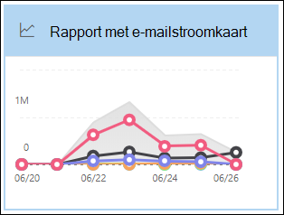

# E-mailbeveiligingsrapporten weergeven in de Microsoft 365 Defender-portalView email security reports in the Microsoft 365 Defender portal

[!INCLUDE [Microsoft 365 Defender rebranding](../includes/microsoft-defender-for-office.md)]

**Van toepassing op****Applies to**
- [Exchange Online ProtectionExchange Online Protection](exchange-online-protection-overview.md)
- [Abonnement 1 en abonnement 2 voor Microsoft Defender voor Office 365Microsoft Defender for Office 365 plan 1 and plan 2](defender-for-office-365.md)
- [Microsoft 365 DefenderMicrosoft 365 Defender](../defender/microsoft-365-defender.md)

Er zijn diverse rapporten beschikbaar in de Microsoft 365 Defender-portal om te zien hoe e-mailbeveiligingsfuncties, zoals antispam, anti-malware en versleutelingsfuncties in Microsoft 365 uw organisatie <https://security.microsoft.com> beschermen.A variety of reports are available in the Microsoft 365 Defender portal at <https://security.microsoft.com> to help you see how email security features, such as anti-spam, anti-malware, and encryption features in Microsoft 365 are protecting your organization. Als u de benodigde machtigingen [hebt,](#what-permissions-are-needed-to-view-these-reports)kunt u deze rapporten bekijken  in de Microsoft 365 Defender-portal door naar Rapporten E-mail & samenwerking e-mail \>  \> **& samenwerkingsrapporten.**If you have the [necessary permissions](#what-permissions-are-needed-to-view-these-reports), you can view these reports in the Microsoft 365 Defender portal by going to **Reports** \> **Email & collaboration** \> **Email & collaboration reports**. Als u rechtstreeks naar de pagina **E-mail & samenwerkingsrapporten** wilt gaan, opent u <https://security.microsoft.com/emailandcollabreport> .To go directly to the **Email & collaboration reports** page, open <https://security.microsoft.com/emailandcollabreport>.

> [!NOTE]
>
> Voor sommige rapporten op de pagina **E-& samenwerkingsrapporten** is Microsoft Defender voor Office 365 vereist.Some of the reports on the **Email & collaboration reports** page require Microsoft Defender for Office 365. Zie Defender voor [Office 365-rapporten weergeven in de Microsoft 365 Defender-portal](view-reports-for-mdo.md)voor meer informatie over deze rapporten.For information about these reports, see [View Defender for Office 365 reports in the Microsoft 365 Defender portal](view-reports-for-mdo.md).
>
> Rapporten die zijn gerelateerd aan e-mailstroom, zijn nu in het Exchange-beheercentrum (EAC).Reports that are related to mail flow are now in the Exchange admin center (EAC). Zie E-mailstroomrapporten in het [nieuwe Exchange-beheercentrum](/exchange/monitoring/mail-flow-reports/mail-flow-reports)voor meer informatie over deze rapporten.For more information about these reports, see [Mail flow reports in the new Exchange admin center](/exchange/monitoring/mail-flow-reports/mail-flow-reports).

## Rapport over gecompromitteerde gebruikersCompromised users report

> [!NOTE]
> Dit rapport is beschikbaar in Microsoft 365-organisaties met Exchange Online-postvakken.This report is available in Microsoft 365 organizations with Exchange Online mailboxes. Het is niet beschikbaar in zelfstandige EOP-organisaties (Exchange Online Protection).It's not available in standalone Exchange Online Protection (EOP) organizations.

In **het rapport Gecompromitteerde** gebruikers ziet  u  het aantal gebruikersaccounts dat in de afgelopen 7 dagen is gemarkeerd als Verdacht of Beperkt.The **Compromised users** report shows shows the number of user accounts that were marked as **Suspicious** or **Restricted** within the last 7 days. Accounts in een van deze staten zijn problematisch of zelfs gecompromitteerd.Accounts in either of these states are problematic or even compromised. Met regelmatig gebruik kunt u het rapport gebruiken om pieken en zelfs trends te herkennen in verdachte of beperkte accounts.With frequent use, you can use the report to spot spikes, and even trends, in suspicious or restricted accounts. Zie Reageren op een gekromd e-mailaccount voor meer informatie over gecompromitteerde [gebruikers.](responding-to-a-compromised-email-account.md)For more information about compromised users, see [Responding to a compromised email account](responding-to-a-compromised-email-account.md).

De statistische weergave bevat gegevens van de afgelopen 90 dagen en de detailweergave bevat gegevens van de afgelopen 30 dagen.The aggregate view shows data for the last 90 days and the detail view shows data for the last 30 days.

Als u het rapport wilt bekijken in de  Microsoft 365 Defender-portal, gaat u naar Rapporten e-mail & \> **samenwerking** \> **e-mail & samenwerkingsrapporten**.To view the report in the Microsoft 365 Defender portal, go to **Reports** \> **Email & collaboration** \> **Email & collaboration reports**. Zoek op **de pagina & samenwerkingsrapporten** naar Gecompromitteerde **gebruikers** en klik vervolgens op **Details weergeven.**On the **Email & collaboration reports** page, find **Compromised users** and then click **View details**. Als u rechtstreeks naar het rapport wilt gaan, opent u <https://security.microsoft.com/reports/CompromisedUsers> .To go directly to the report, open <https://security.microsoft.com/reports/CompromisedUsers>.

Op de pagina Gecompromitteerd gebruikers kunt u zowel de grafiek als de detailtabel filteren door op **Filter** te klikken en een of meer van de volgende waarden te selecteren in het flyout dat wordt weergegeven: On the **Compromised users** page, you can filter both the chart and the details table by clicking **Filter** and selecting one or more of the following values in the flyout that appears:

- **Datum (UTC)**: **Begindatum** en **einddatum**.**Date (UTC)**: **Start date** and **End date**.
- **Activiteit**:**Activity**:
  - **Verdacht:** Het gebruikersaccount heeft verdachte e-mailberichten verzonden en loopt het risico dat het niet meer kan worden verzonden.**Suspicious**: The user account has sent suspicious email and is at risk of being restricted from sending email.
  - **Beperkt:** Het gebruikersaccount is beperkt tot het verzenden van e-mail vanwege zeer verdachte patronen.**Restricted**: The user account has been restricted from sending email due to highly suspicious patterns.

Wanneer u klaar bent met het configureren van de filters, klikt u **op Toepassen,** **Annuleren** of **Filters wissen.**When you're finished configuring the filters, click **Apply**, **Cancel**, or **Clear filters**.

In de detailtabel onder de grafiek ziet u de volgende details:In the details table below the graph, you can see the following details:

- **Aanmaaktijd****Creation time**
- **Gebruikers-id****User ID**
- **Actie****Action**

## Rapport met exchange-transportregelExchange transport rule report

Het **rapport Exchange-transportregel** toont het effect van regels voor de e-mailstroom (ook wel transportregels genoemd) op binnenkomende en uitgaande berichten in uw organisatie.The **Exchange transport rule** report shows the effect of mail flow rules (also known as transport rules) on incoming and outgoing messages in your organization.

Als u het rapport wilt bekijken in de  Microsoft 365 Defender-portal, gaat u naar Rapporten e-mail & \> **samenwerking** \> **e-mail & samenwerkingsrapporten**.To view the report in the Microsoft 365 Defender portal, go to **Reports** \> **Email & collaboration** \> **Email & collaboration reports**. Zoek op **de pagina E-& samenwerkingsrapporten** **naar Exchange-transportregel** en klik vervolgens op **Details weergeven.**On the **Email & collaboration reports** page, find **Exchange transport rule** and then click **View details**. Als u rechtstreeks naar het rapport wilt gaan, opent u <https://security.microsoft.com/reports/ETRRuleReport> .To go directly to the report, open <https://security.microsoft.com/reports/ETRRuleReport>.

Op de rapportpagina van de **Exchange-transportregel** worden de beschikbare grafieken en gegevens in de volgende secties beschreven.On the **Exchange transport rule report** page, the available charts and data are described in the following sections.

### Grafiek uitsplitsing op richtingChart breakdown by Direction

Als u Grafiek **uitsplitsing op richting selecteert,** zijn de volgende grafieken beschikbaar:If you select **Chart breakdown by Direction**, the follow charts are available:

- **Gegevens weergeven op exchange-transportregels:** het  aantal **binnenkomende** en uitgaande berichten dat is beïnvloed door regels voor e-mailstroom.**View data by Exchange transport rules**: The number of **Inbound** and **Outbound** messages that were affected by mail flow rules.
- **Gegevens weergeven op DLP Exchange-transportregels:**  het aantal **binnenkomende** en uitgaande berichten dat is beïnvloed door DLP-regels (Data Loss Prevention).**View data by DLP Exchange transport rules**: The number of **Inbound** and **Outbound** messages that were affected by data loss prevention (DLP) mail flow rules.

De volgende informatie wordt weergegeven in de detailtabel onder de grafiek:The following information is shown in the details table below the graph:

- **Datum****Date**
- **DLP-beleid** (**Alleen gegevens weergeven op DLP Exchange-transportregels)****DLP policy** (**View data by DLP Exchange transport rules** only)
- **Transportregel****Transport rule**
- **Onderwerp****Subject**
- **Adres afzender****Sender address**
- **Adres van geadresseerde****Recipient address**
- **Ernst****Severity**
- **Richting****Direction**

U kunt zowel de grafiek als de detailtabel filteren door op **Filter** te klikken en een of meer van de volgende waarden te selecteren in het flyout dat wordt weergegeven:You can filter both the chart and the details table by clicking **Filter** and selecting one or more of the following values in the flyout that appears:

- **Datum (UTC)** **Begindatum** en **einddatum****Date (UTC)** **Start date** and **End date**
- **Richting:** **Uitgaande en Inkomende** **Direction**: **Outbound** and **Inbound**
- **Ernst:** **hoge ernst,** **gemiddelde ernst** en **lage ernst****Severity**: **High severity**, **Medium severity**, and **Low severity**

Wanneer u klaar bent met het configureren van de filters, klikt u **op Toepassen,** **Annuleren** of **Filters wissen.**When you're finished configuring the filters, click **Apply**, **Cancel**, or **Clear filters**.

### Uitsplitsing van grafieken op ernstChart breakdown by Severity

Als u Grafiek **uitsplitsing op ernst selecteert,** zijn de volgende grafieken beschikbaar:If you select **Chart breakdown by Severity**, the follow charts are available:

- **Gegevens weergeven op exchange-transportregels:** het aantal berichten met hoge **ernst,** gemiddelde **ernst** en **berichten met lage ernst.****View data by Exchange transport rules**: The number of **High severity**, **Medium severity**, and **Low severity** messages. U stelt het ernstniveau in als een actie in de regel ( Controleer deze regel met **ernstniveau** of _SetAuditSeverity_).You set the severity level as an action in the rule (**Audit this rule with severity level** or _SetAuditSeverity_). Zie Acties voor [e-mailstroomregelen in Exchange Online voor meer informatie.](/Exchange/security-and-compliance/mail-flow-rules/mail-flow-rule-actions)For more information, see [Mail flow rule actions in Exchange Online](/Exchange/security-and-compliance/mail-flow-rules/mail-flow-rule-actions).

- **Gegevens weergeven op DLP Exchange-transportregels:** het aantal berichten  met hoge **ernst,** gemiddelde ernst en lage ernst die zijn beïnvloed door DLP-regels voor e-mailstroom.**View data by DLP Exchange transport rules**: The number of **High severity**, **Medium severity**, and **Low severity** messages that were affected by DLP mail flow rules.

De volgende informatie wordt weergegeven in de detailtabel onder de grafiek:The following information is shown in the details table below the graph:

- **Datum****Date**
- **DLP-beleid** (**Alleen gegevens weergeven op DLP Exchange-transportregels)****DLP policy** (**View data by DLP Exchange transport rules** only)
- **Transportregel****Transport rule**
- **Onderwerp****Subject**
- **Adres afzender****Sender address**
- **Adres van geadresseerde****Recipient address**
- **Ernst****Severity**
- **Richting****Direction**

U kunt zowel de grafiek als de detailtabel filteren door op **Filter** te klikken en een of meer van de volgende waarden te selecteren in het flyout dat wordt weergegeven:You can filter both the chart and the details table by clicking **Filter** and selecting one or more of the following values in the flyout that appears:

- **Datum (UTC)** **Begindatum** en **einddatum****Date (UTC)** **Start date** and **End date**
- **Richting:** **Uitgaande en Inkomende** **Direction**: **Outbound** and **Inbound**
- **Ernst:** **hoge ernst,** **gemiddelde ernst** en **lage ernst****Severity**: **High severity**, **Medium severity**, and **Low severity**

Wanneer u klaar bent met het configureren van de filters, klikt u **op Toepassen,** **Annuleren** of **Filters wissen.**When you're finished configuring the filters, click **Apply**, **Cancel**, or **Clear filters**.

## Doorsturen van rapportForwarding report

> [!NOTE]
> Het **rapport Doorsturen** is nu beschikbaar in het EAC.The **Forwarding report** is now available in the EAC. Zie Rapport Automatisch doorgestuurde berichten in het nieuwe EAC voor [meer informatie.](/exchange/monitoring/mail-flow-reports/mfr-auto-forwarded-messages-report)For more information, see [Auto forwarded messages report in the new EAC](/exchange/monitoring/mail-flow-reports/mfr-auto-forwarded-messages-report).

## E-mailflowstatusrapportMailflow status report

Het **mailflowstatusrapport** is een slim rapport met informatie over inkomende en uitgaande e-mail, spamdetecties, malware, e-mail die als 'goed' is geïdentificeerd en informatie over e-mail die is toegestaan of geblokkeerd op de rand.The **Mailflow status report** is a smart report that shows information about incoming and outgoing email, spam detections, malware, email identified as "good", and information about email allowed or blocked on the edge. Dit is het enige rapport dat informatie over randbeveiliging bevat en laat zien hoeveel e-mail wordt geblokkeerd voordat e-mail wordt toegestaan in de service voor evaluatie door Exchange Online Protection (EOP).This is the only report that contains edge protection information, and shows just how much email is blocked before being allowed into the service for evaluation by Exchange Online Protection (EOP). Het is belangrijk om te begrijpen dat als een bericht naar vijf geadresseerden wordt verzonden, we het als vijf verschillende berichten tellen en niet één bericht.It's important to understand that if a message is sent to five recipients we count it as five different messages and not one message.

Als u het rapport wilt bekijken in de  Microsoft 365 Defender-portal, gaat u naar Rapporten e-mail & \> **samenwerking** \> **e-mail & samenwerkingsrapporten**.To view the report in the Microsoft 365 Defender portal, go to **Reports** \> **Email & collaboration** \> **Email & collaboration reports**. Zoek op **de & e-mail met samenwerkingsrapporten** de **statusoverzicht van Mailflow** en klik vervolgens op **Details weergeven.**On the **Email & collaboration reports** page, find **Mailflow status summary** and then click **View details**. Als u rechtstreeks naar het rapport wilt gaan, opent u <https://security.microsoft.com/reports/mailflowStatusReport> .To go directly to the report, open <https://security.microsoft.com/reports/mailflowStatusReport>.

### Typweergave voor het rapport Mailflow-statusType view for the Mailflow status report

Op de **pagina Mailflow-statusrapport** is het **tabblad Type** standaard geselecteerd.On the **Mailflow status report** page, the **Type** tab is selected by default. Deze weergave bevat standaard een grafiek en een detailtabel die is geconfigureerd met de volgende filters:By default, this view contains a chart and a details table that's configured with the following filters:

- **Datum (UTC)** De afgelopen 7 dagen.**Date (UTC)** The last 7 days.
- **E-mailrichting**:**Mail direction**:
  - **Binnenkomende****Inbound**
  - **Uitgaande****Outbound**
  - **Intra-org:** dit aantal is voor berichten binnen een tenant, dat wil zeggen**Intra-org**: this count is for messages within a tenant i.e afzender abc@domain.com verzendt naar geadresseerde xyz@domain.com (afzonderlijk geteld van **Binnenkomende** en **Uitgaande**)sender abc@domain.com sends to recipient xyz@domain.com  (counted separately from **Inbound** and **Outbound**)
- **Typ**:**Type**:
  - **Goede e-mail****Good mail**
  - **Malware****Malware**
  - **Spam****Spam**
  - **Randbeveiliging****Edge protection**
  - **Regelberichten****Rule messages**
  - **Phishing-e-mail****Phishing email**
- **Domein:** **Alles****Domain**: **All**

De grafiek wordt ingedeeld op basis van **de waarden Type.**The chart is organized by the **Type** values.

U kunt deze filters wijzigen door op Filter te **klikken.**You can change these filters by clicking **Filter**.

De volgende informatie wordt weergegeven in de detailtabel onder de grafiek:The following information is shown in the details table below the graph:

- **Richting****Direction**
- **Type****Type**
- **24 uur****24 hours**
- **3 dagen****3 days**
- **7 dagen****7 days**
- **15 dagen****15 days**
- **30 dagen****30 days**

Als u op **Een categorie kiezen klikt voor meer informatie,** kunt u kiezen uit de volgende waarden:If you click **Choose a category for more details**, you can select from the following values:

- **Phishing-e-mail:** met deze selectie gaat u naar het [statusrapport Bedreigingsbeveiliging.](view-email-security-reports.md#threat-protection-status-report)**Phishing email**: This selection takes you to the [Threat protection status report](view-email-security-reports.md#threat-protection-status-report).
- **Malware in e-mail:** met deze selectie gaat u naar het [statusrapport Bedreigingsbeveiliging.](view-email-security-reports.md#threat-protection-status-report)**Malware in email**: This selection takes you to the [Threat protection status report](view-email-security-reports.md#threat-protection-status-report).
- **Spamdetecties:** Met deze selectie gaat u naar het [rapport Spamdetecties.](view-email-security-reports.md#spam-detections-report)**Spam detections**: This selection takes you to the [Spam Detections report](view-email-security-reports.md#spam-detections-report).
- **Edge geblokkeerde spam:** Met deze selectie gaat u naar het [rapport Spamdetecties.](view-email-security-reports.md#spam-detections-report)**Edge blocked spam**: This selection takes you to the [Spam Detections report](view-email-security-reports.md#spam-detections-report).

#### Exporteren vanuit de weergave TypeExport from Type view

Voor de detailweergave kunt u slechts één dag gegevens exporteren.For the detail view, you can only export data for one day. Dus als u gegevens 7 dagen wilt exporteren, moet u 7 verschillende exportacties uitvoeren.So, if you want to export data for 7 days, you need to do 7 different export actions.

Elk geëxporteerd .csv bestand is beperkt tot 150.000 rijen.Each exported .csv file is limited to 150,000 rows. Als de gegevens voor die dag meer dan 150.000 rijen bevatten, worden meerdere .csv gemaakt.If the data for that day contains more than 150,000 rows, then multiple .csv files will be created.

### Richtingsweergave voor het rapport Mailflow-statusDirection view for the Mailflow status report

Als u op het tabblad **Richting** klikt, worden dezelfde standaardfilters uit de **weergave Type** gebruikt.If you click the **Direction** tab, the same default filters from the **Type** view are used.

De grafiek is ingedeeld op **richtingswaarden.**The chart is organized by **Direction** values.

U kunt deze filters wijzigen door op Filter te **klikken.**You can change these filters by clicking **Filter**. Dezelfde filters uit de **weergave Type** worden gebruikt.The same filters from the **Type** view are used.

De detailtabel bevat dezelfde informatie uit de **weergave Type.**The details table contains same information from the **Type** view.

De **categorie Kies een categorie voor meer informatie** beschikbare selecties en gedrag zijn hetzelfde als de **weergave** Type.The **Choose a category for more details** available selections and behavior are the same as the **Type** view.

#### Exporteren vanuit de richtingsweergaveExport from Direction view

Voor de detailweergave kunt u slechts één dag gegevens exporteren.For the detail view, you can only export data for one day. Dus als u gegevens 7 dagen wilt exporteren, moet u 7 verschillende exportacties uitvoeren.So, if you want to export data for 7 days, you need to do 7 different export actions.

Elk geëxporteerd .csv bestand is beperkt tot 150.000 rijen.Each exported .csv file is limited to 150,000 rows. Als de gegevens voor die dag meer dan 150.000 rijen bevatten, worden meerdere .csv gemaakt.If the data for that day contains more than 150,000 rows, then multiple .csv files will be created.

### Trechterweergave voor het rapport Mailflow-statusFunnel view for the Mailflow status report

In **de trechterweergave** ziet u hoe de beveiligingsfuncties voor e-mail van Microsoft inkomende en uitgaande e-mail in uw organisatie filteren.The **Funnel** view shows you how Microsoft's email threat protection features filter incoming and outgoing email in your organization. Het bevat informatie over het totale aantal e-mailberichten en hoe de geconfigureerde beveiligingsfuncties voor bedreigingen, zoals randbeveiliging, anti-malware, anti-phishing, antispam en anti-spoofing van invloed zijn op dit aantal.It provides details on the total email count, and how the configured threat protection features, including edge protection, anti-malware, anti-phishing, anti-spam, and anti-spoofing affect this count.

Als u op **het** tabblad Trechter klikt, bevat deze weergave standaard een grafiek en een detailtabel die is geconfigureerd met de volgende filters:If you click the **Funnel** tab, by default, this view contains a chart and a details table that's configured with the following filters:

- **Datum:** De laatste 7 dagen.**Date**: The last 7 days.

- **Richting**:**Direction**:
  - **Binnenkomende****Inbound**
  - **Uitgaande****Outbound**
  - **Intra-org:** Dit aantal is voor berichten die binnen een tenant worden verzonden; Dat wil zeggen dat afzenders abc@domain.com naar geadresseerden xyz@domain.com (afzonderlijk geteld van Binnenkomende en Uitgaande).**Intra-org**: This count is for messages sent within a tenant; i.e, sender abc@domain.com sends to recipient xyz@domain.com (counted separately from Inbound and Outbound).

De tabelweergave voor statistische weergave en details kan 90 dagen worden gefilterd.The aggregate view and details table view allow for 90 days of filtering.

U kunt deze filters wijzigen door op Filter te **klikken.**You can change these filters by clicking **Filter**. Dezelfde filters uit de **weergave Type** worden gebruikt.The same filters from the **Type** view are used.

In deze grafiek ziet u het aantal e-mailberichten dat is ingedeeld op:This chart shows the email count organized by:

- **Totaal aantal e-mail****Total email**
- **E-mail na randbeveiliging****Email after edge protection**
- **Regel E-mail na transport** (regel voor e-mailstroom)**Email after transport rule** (mail flow rule)
- **E-mail na anti-malware, bestandsreputatie, bestandstypeblok****Email after anti-malware, file reputation, file type block**
- **E-mail na anti-phish, URL-reputatie, merkremitatie, anti-spoofing****Email after anti-phish, URL reputation, brand impersonation, anti-spoof**
- **E-mail na antispam, bulkmailfilters****Email after anti-spam, bulk mail filtering**
- **E-mail na gebruikers- en domein-imitatie**\***Email after user and domain impersonation**\*
- **E-mail na bestand en URL-detonatie**\***Email after file and URL detonation**\*
- **E-mail die is gedetecteerd als goedaardig na de beveiliging na de bezorging (URL klik op tijdbeveiliging)****Email detected as benign after post-delivery protection (URL click time protection)**

\*Defender voor Office 365 alleen\* Defender for Office 365 only

Als u het e-mailbericht wilt weergeven dat is gefilterd op EOP of Defender Office 365 afzonderlijk, klikt u op de waarde in de grafieklegenda.To view the email filtered by EOP or Defender for Office 365 separately, click on the value in the chart legend.

De detailtabel bevat de volgende gegevens, weergegeven in aflopende datumvolgorde:The details table contains the following information, shown in descending date order:

- **Datum****Date**
- **Totaal aantal e-mail****Total email**
- **Randbeveiliging****Edge protection**
- **Anti-malware, bestandsreputatie, bestandstypeblok:****Anti-malware, file reputation, file type block**:
  - **Bestandsreputatie:** Berichten die zijn gefilterd vanwege de identificatie van een bijgevoegd bestand door andere Microsoft-klanten.**File reputation**: Messages filtered due to identification of an attached file by other Microsoft customers.
  - **Bestandstypeblok:** Berichten die zijn gefilterd vanwege het type schadelijk bestand dat in het bericht is geïdentificeerd.**File type block**: Messages filtered due to the type of malicious file identified in the message.
- **Anti-phish, URL-reputatie, merk imitatie, anti-spoof:****Anti-phish, URL reputation, Brand impersonation, anti-spoof**:
  - **URL-reputatie:** Berichten die zijn gefilterd vanwege de identificatie van de URL door andere Microsoft-klanten.**URL reputation**: Messages filtered due to the identification of the URL by other Microsoft customers.
  - **Merkremitatie:** berichten die zijn gefilterd vanwege het bericht dat afkomstig is van bekende merkremiterende afzenders.**Brand impersonation**: Messages filtered due to the message coming from well-known brand impersonating senders.
  - **Anti-spoof:** Berichten die zijn gefilterd vanwege het bericht waarin wordt geprobeerd een domein te vervalsen dat de geadresseerde behoort, of een domein dat de afzender van het bericht niet bezit.**Anti-spoof**: Messages filtered due to the message attempting to spoof a domain that the recipient belongs to, or a domain that the message sender doesn't own.
- **Antispam, bulkmailfilters:****Anti-spam, bulk mail filtering**:
  - **Bulkmailfilters:** Berichten gefilterd op basis van de drempel voor bulksgewijs klagen (BCL) in een antispambeleid.**Bulk mail filtering**: Messages filtered based on the bulk complain level (BCL) threshold in an anti-spam policy.
- **Gebruikers- en domein-imitatie (Defender voor Office 365)**:**User and domain impersonation (Defender for Office 365)**:
  - **Gebruikers-imitatie:** berichten die zijn gefilterd vanwege een poging om zich voor te doen als een gebruiker (afzender van een bericht) die is gedefinieerd in de instellingen voor imitatiebeveiliging van een anti-phishingbeleid.**User impersonation**: Messages filtered due to an attempt to impersonate a user (message sender) that's defined in the impersonation protection settings of an anti-phishing policy.
  - **Domein imitatie:** Berichten gefilterd vanwege een poging om een domein na te bootsen dat is gedefinieerd in de instellingen voor imitatiebeveiliging van een anti-phishingbeleid.**Domain impersonation**: Messages filtered due to an attempt to impersonate a domain that's defined in the impersonation protection settings of an anti-phishing policy.
- **Bestands- en URL-detonatie (Defender voor Office 365)**:**File and URL detonation (Defender for Office 365)**:
  - **Bestandsdetonatie:** Berichten gefilterd op een Safe bijlagenbeleid.**File detonation**: Messages filtered by a Safe Attachments policy.
  - **URL-detonatie:** bericht gefilterd door een Safe koppelingenbeleid.**URL detonation**: Message filtered by a Safe Links policy.
- **Bescherming na bezorging en ZAP (ATP) of ZAP (EOP)**: Automatische purge (ZAP) van nul uur voor malware, spam en phishing.**Post-delivery protection and ZAP (ATP), or ZAP (EOP)**: Zero-hour auto purge (ZAP) for malware, spam, and phishing.

Als u een rij in de detailtabel selecteert, wordt een verdere uitsplitsing van de e-mailtellingen weergegeven in de flyout.If you select a row in the details table, a further breakdown of the email counts are shown in the flyout.

#### Exporteren vanuit de trechterweergaveExport from Funnel view

Nadat u onder **Opties op Exporteren** hebt geklikt, kunt u een van de volgende waarden selecteren: After you click **Export** under **Options**, you can select one of the following values:

- **Overzicht (met gegevens van de afgelopen 90 dagen)****Summary (with data for last 90 days at most)**
- **Details (met gegevens van de afgelopen 30 dagen ten hoogst)****Details (with data for last 30 days at most)**

Kies **onder Datum** een bereik en klik vervolgens op **Toepassen.**Under **Date**, choose a range, and then click **Apply**. Gegevens voor de huidige filters worden geëxporteerd naar een .csv bestand.Data for the current filters will be exported to a .csv file.

Elk geëxporteerd .csv bestand is beperkt tot 150.000 rijen.Each exported .csv file is limited to 150,000 rows. Als de gegevens meer dan 150.000 rijen bevatten, worden meerdere .csv gemaakt.If the data contains more than 150,000 rows, then multiple .csv files will be created.

### Technische weergave voor het mailflowstatusrapportTech view for the Mailflow status report

De **techweergave** is vergelijkbaar met de **trechterweergave,** met meer gedetailleerde details voor de geconfigureerde functies voor bedreigingsbeveiliging.The **Tech view** is similar to the **Funnel** view, providing more granular details for the configured threat protections features. In de grafiek kunt u zien hoe berichten worden gecategoriseerd in de verschillende stadia van bedreigingsbeveiliging.From the chart, you can see how messages are categorized at the different stages of threat protection.

Als u op het **tabblad Technische** weergave klikt, bevat deze weergave standaard een grafiek en een detailtabel die is geconfigureerd met de volgende filters:If you click the **Tech view** tab, by default, this view contains a chart and a details table that's configured with the following filters:

- **Datum:** De laatste 7 dagen.**Date**: The last 7 days.

- **Richting**:**Direction**:
  - **Binnenkomende****Inbound**
  - **Uitgaande****Outbound**
  - **Intra-org:** dit aantal is voor berichten binnen een tenant, dat wil zeggen**Intra-org**: this count is for messages within a tenant i.e afzender abc@domain.com verzenden naar geadresseerde xyz@domain.com (afzonderlijk geteld van Binnenkomende en Uitgaande)sender abc@domain.com sends to recipient xyz@domain.com (counted separately from Inbound and Outbound)

De tabelweergave voor statistische weergave en details kan 90 dagen worden gefilterd.The aggregate view and details table view allow for 90 days of filtering.

U kunt deze filters wijzigen door op Filter te **klikken.**You can change these filters by clicking **Filter**. Dezelfde filters uit de **weergave Type** worden gebruikt.The same filters from the **Type** view are used.

In deze grafiek ziet u berichten die zijn ingedeeld in de volgende categorieën:This chart shows messages organized into the following categories:

- **Totaal aantal e-mail****Total email**
- **Rand toestaan** en **Edge gefilterd****Edge allow** and **Edge filtered**
- **Transportregel toestaan** en **Transportregel gefilterd** (regels voor e-mailstroom)**Transport rule allow** and **Transport rule filtered** (mail flow rules)
- **Geen malware,** **Safe detectie van** bijlagen en detectie van \* **anti-malware-engine****Not malware**, **Safe Attachments detection**\*, and **Anti-malware engine detection**
- **Geen phish,** **DMARC-fout,** **imitatiedetectie,** \* **spoofdetectie** en **Phish-detectie****Not phish**, **DMARC failure**, **Impersonation detection**\*, **Spoof detection**, and **Phish detection**
- **Geen detectie met URL-detonatie en** **URL-detonatiedetectie**\***No detection with URL detonation** and **URL detonation detection**\*
- **Geen spam en**  **spam****Not spam** and  **Spam**
- **Niet-schadelijke e-mail,** **Safe koppelingendetectie** \* en **ZAP****Non-malicious email**, **Safe Links detection**\*, and **ZAP**

\*Defender voor Office 365\* Defender for Office 365

Wanneer u de muisaanwijzer boven een categorie in de grafiek beweegt, kunt u het aantal berichten in die categorie zien.When you hover over a category in the chart, you can see the number of messages in that category.

De detailtabel bevat de volgende gegevens, weergegeven in aflopende datumvolgorde:The details table contains the following information, shown in descending date order:

- **Datum (UTC)****Date (UTC)**
- **Totaal aantal e-mail****Total email**
- **Gefilterde rand****Edge filtered**
- **Regelberichten:** Berichten die zijn gefilterd vanwege regels voor e-mailstroom (ook wel transportregels genoemd).**Rule messages**: Messages filtered due to  mail flow rules (also known as transport rules).
- **Anti-malware engine**, **Safe Bijlagen:** \***Anti-malware engine**, **Safe Attachments**\*:
- **DMARC, imitatie** \* , **spoof**, **phish gefilterd**:**DMARC, impersonation**\*, **spoof**, **phish filtered**:
  - **DMARC:** Berichten gefilterd vanwege het bericht dat de DMARC-verificatiecontrole mislukt.**DMARC**: Messages filtered due to the message failing its DMARC authentication check.
- **DETECTIE VAN URL-detonatie**\***URL detonation detection**\*
- **Gefilterde antispam****Anti-spam filtered**
- **ZAP verwijderd****ZAP removed**
- **Detectie door Safe koppelingen**\***Detection by Safe Links**\*

\*Defender voor Office 365\* Defender for Office 365

Als u een rij in de detailtabel selecteert, wordt een verdere uitsplitsing van de e-mailtellingen weergegeven in de flyout.If you select a row in the details table, a further breakdown of the email counts are shown in the flyout.

#### Exporteren vanuit de techweergaveExport from Tech view

Als u op **Exporteren** klikt, kunt u onder **Opties** een van de volgende waarden selecteren:On clicking **Export**, under **Options** you can select one of the following values:

- **Overzicht (met gegevens van de afgelopen 90 dagen)****Summary (with data for last 90 days at most)**
- **Details (met gegevens van de afgelopen 30 dagen ten hoogst)****Details (with data for last 30 days at most)**

Kies **onder Datum** een bereik en klik vervolgens op **Toepassen.**Under **Date**, choose a range, and then click **Apply**. Gegevens voor de huidige filters worden geëxporteerd naar een .csv bestand.Data for the current filters will be exported to a .csv file.

Elk geëxporteerd .csv bestand is beperkt tot 150.000 rijen.Each exported .csv file is limited to 150,000 rows. Als de gegevens meer dan 150.000 rijen bevatten, worden meerdere .csv gemaakt.If the data contains more than 150,000 rows, then multiple .csv files will be created.

## Rapport malwaredetectiesMalware detections report

Het **rapport Malwaredetecties bevat** informatie over malwaredetecties in inkomende en uitgaande e-mailberichten (malware gedetecteerd door Exchange Online Protection of EOP).The **Malware detections report** report shows information about malware detections in incoming and outgoing email messages (malware detected by Exchange Online Protection or EOP). Zie [Anti-malwarebeveiliging in EOP](anti-malware-protection.md)voor meer informatie over malwarebeveiliging in EOP.For more information about malware protection in EOP, see [Anti-malware protection in EOP](anti-malware-protection.md).

Het filter voor de statistische weergave kan 90 dagen duren, terwijl het detailtabelfilter slechts 10 dagen toestaat.The aggregate view filter allows for 90 days, while the details table filter only allows for 10 days.

Als u het rapport wilt weergeven in  de Microsoft 365 Defender portal, gaat u naar Rapporten e-mail & \> **samenwerking** \> **e-mail & samenwerkingsrapporten**.To view the report in the Microsoft 365 Defender portal, go to **Reports** \> **Email & collaboration** \> **Email & collaboration reports**. Zoek op **de pagina & samenwerkingsrapporten** malware die **is gedetecteerd in e-mail** en klik vervolgens op **Details weergeven.**On the **Email & collaboration reports** page, find **Malware detected in email** and then click **View details**. Als u rechtstreeks naar het rapport wilt gaan, opent u <https://security.microsoft.com/reports/MalwareDetections> .To go directly to the report, open <https://security.microsoft.com/reports/MalwareDetections>.

Op de **rapportpagina Malwaredetecties** kunt u zowel de grafiek als de detailtabel filteren door op **Filter** te klikken en een van de volgende waarden te selecteren:On the **Malware detections report** page, you can filter both the chart and the details table by clicking **Filter** and selecting one of the following values:

- **Datum (UTC)** **Begindatum** en **einddatum****Date (UTC)** **Start date** and **End date**
- **Richting:** **Binnenkomende** en **uitgaande****Direction**: **Inbound** and **Outbound**

In de detailtabel onder de grafiek ziet u de volgende details:In the details table below the graph, you can see the following details:

- **Datum****Date**
- **Adres afzender****Sender address**
- **Adres van geadresseerde****Recipient address**
- **Bericht-id:** Beschikbaar in het **veld Bericht-id** in de berichtkoptekst en moet uniek zijn.**Message ID**: Available in the **Message-ID** header field in the message header and should be unique. Een voorbeeldwaarde is `<08f1e0f6806a47b4ac103961109ae6ef@server.domain>` (let op de hoekhaken).An example value is `<08f1e0f6806a47b4ac103961109ae6ef@server.domain>` (note the angle brackets).
- **Onderwerp****Subject**
- **Bestandsnaam****Filename**
- **Malwarenaam****Malware name**

## E-maillatentierapportMail latency report

Het **rapport E-maillatentie** in Defender voor Office 365 bevat informatie over de latentie van e-mailbezorging en detonatie binnen uw organisatie.The **Mail latency report** in Defender for Office 365 contains information on the mail delivery and detonation latency experienced within your organization. Zie Mail [latentierapport](view-reports-for-mdo.md#mail-latency-report)voor meer informatie.For more information, see [Mail latency report](view-reports-for-mdo.md#mail-latency-report).

## Rapport over spamdetectieSpam detections report

> [!NOTE]
> Het **rapport Spamdetecties** gaat uiteindelijk weg.The **Spam detections report** will eventually go away. Dezelfde informatie is beschikbaar in het rapport [Bedreigingsbeveiligingsstatus.](#threat-protection-status-report)The same information is available in the [Threat protection status report](#threat-protection-status-report).

## Rapport spoofdetectiesSpoof detections report

> [!NOTE]
> Het verbeterde rapport Spoofdetecties, zoals beschreven in dit artikel, is in Preview, kan worden gewijzigd en is niet beschikbaar in alle organisaties.The improved Spoof detections report as described in this article is in Preview, is subject to change, and is not available in all organizations. In de oudere versie van het rapport ziet u alleen **Goede e-mail** en **Gevangen als spam.**The older version of the report shows only **Good mail** and **Caught as spam**.

Het **rapport Spoofdetecties** bevat informatie over berichten die zijn geblokkeerd of toegestaan vanwege spoofing.The **Spoof detections** report shows information about messages that were blocked or allowed due to spoofing. Zie Bescherming tegen spoofing in EOP voor meer [informatie over spoofing.](anti-spoofing-protection.md)For more information about spoofing, see [Anti-spoofing protection in EOP](anti-spoofing-protection.md).

Met de statistische weergave van het rapport kunt u 45 dagen filteren, terwijl de detailweergave slechts tien dagen \* filtert.The aggregate view of the report allows for 45 days of filtering\*, while the detail view only allows for ten days of filtering.

\* Uiteindelijk kunt u maximaal 90 dagen filteren gebruiken.\* Eventually, you'll be able to use up to 90 days of filtering.

Als u het rapport wilt weergeven in  de Microsoft 365 Defender portal, gaat u naar Rapporten e-mail & \> **samenwerking** \> **e-mail & samenwerkingsrapporten**.To view the report in the Microsoft 365 Defender portal, go to **Reports** \> **Email & collaboration** \> **Email & collaboration reports**. Zoek op **de pagina & samenwerkingsrapporten** naar **Spoofdetecties** en klik vervolgens op **Details weergeven.**On the **Email & collaboration reports** page, find **Spoof detections** and then click **View details**. Als u rechtstreeks naar het rapport wilt gaan, opent u <https://security.microsoft.com/reports/SpoofMailReportV2> .To go directly to the report, open <https://security.microsoft.com/reports/SpoofMailReportV2>.

In de grafiek ziet u de volgende informatie:The chart shows the following information:

- **Pass****Pass**
- **Mislukken****Fail**
- **SoftPass****SoftPass**
- **Geen****None**
- **Overige****Other**

Wanneer u de muisaanwijzer boven een dag (gegevenspunt) in de grafiek beweegt, kunt u zien hoeveel vervalste berichten zijn gedetecteerd en waarom.When you hover over a day (data point) in the chart, you can see how many spoofed messages were detected and why.

Op de **pagina Spoof-e-mailrapport** kunt u zowel de grafiek als de detailtabel filteren door op **Filter** te klikken en een of meer van de volgende waarden te selecteren:On the **Spoof mail report** page, you can filter both the chart and the details table by clicking **Filter** and selecting one or more of the following values:

- **Datum (UTC)** **Begindatum** en **einddatum****Date (UTC)** **Start date** and **End date**
- **Resultaat**:**Result**:
  - **Pass****Pass**
  - **Mislukken****Fail**
  - **SoftPass****SoftPass**
  - **Geen****None**
  - **Overige****Other**
- **Spooftype:** **Intern** en **Extern****Spoof type**: **Internal** and **External**

In de detailtabel onder de grafiek ziet u de volgende details:In the details table below the graph, you can see the following details:

- **Datum****Date**
- **Vervalste gebruiker****Spoofed user**
- **Verzendende infrastructuur****Sending infrastructure**
- **Spooftype****Spoof type**
- **Result****Result**
- **Resultaatcode****Result code**
- **SPF****SPF**
- **DKIM****DKIM**
- **DMARC****DMARC**
- **Aantal berichten****Message count**

Zie Kopteksten voor spamberichten in Microsoft 365 voor [meer informatie over resultaatcodes voor samengestelde verificatie.](anti-spam-message-headers.md)For more information about composite authentication result codes, see [Anti-spam message headers in Microsoft 365](anti-spam-message-headers.md).

## Rapport InzendingenSubmissions report

Het **rapport Inzendingen** bevat informatie over items die beheerders hebben gerapporteerd bij Microsoft voor analyse.The **Submissions** report shows information about items that admins have reported to Microsoft for analysis. Zie Beheerdersinzending gebruiken om [verdachte spam, phish, URL's en](admin-submission.md)bestanden in te dienen bij Microsoft voor meer informatie.For more information, see [Use Admin Submission to submit suspected spam, phish, URLs, and files to Microsoft](admin-submission.md).

Als u het rapport wilt weergeven in  de Microsoft 365 Defender portal, gaat u naar Rapporten e-mail & \> **samenwerking** \> **e-mail & samenwerkingsrapporten**.To view the report in the Microsoft 365 Defender portal, go to **Reports** \> **Email & collaboration** \> **Email & collaboration reports**. Zoek op **de pagina & samenwerkingsrapporten** naar **Inzendingen** en klik vervolgens op Details **weergeven.**On the **Email & collaboration reports** page, find **Submissions** and then click **View details**. Als u rechtstreeks naar het rapport wilt gaan, opent u <https://security.microsoft.com/adminSubmissionReport> .To go directly to the report, open <https://security.microsoft.com/adminSubmissionReport>. Als u wilt gaan [naar beheerdersinzendingen in de Microsoft 365 Defender portal,](admin-submission.md)klikt u **op Ga naar Inzendingen.**To go to [admin submissions in the Microsoft 365 Defender portal](admin-submission.md), click **Go to Submissions**.

In de grafiek ziet u de volgende informatie:The chart shows the following information:

- **In behandeling****Pending**
- **Voltooid****Completed**

Op de **pagina Inzendingen** kunt u zowel de grafiek als de detailtabel filteren door op **Filter** te klikken en een of meer van de volgende waarden te selecteren:On the **Submissions** page, you can filter both the chart and the details table by clicking **Filter** and selecting one or more of the following values:

- **Datum gerapporteerd:** **Begintijd** en **eindtijd****Date reported**: **Start time** and **End time**
- **Inzendingstype**:**Submission type**:
  - **E-mail****Email**
  - **URL****URL**
  - **Bestand****File**
- **Inzending-id****Submission ID**
- **Netwerkbericht-id****Network Message ID**
- **Afzender****Sender**
- **Naam****Name**
- **Ingediend door****Submitted by**
- **Reden voor het indienen** van :**Reason for submitting**:
  - **Geen ongewenste e-mail****Not junk**
  - **Phishing****Phish**
  - **Malware****Malware**
  - **Spam****Spam**
- **Status opnieuw scannen:****Rescan status**:
  - **In behandeling****Pending**
  - **Voltooid****Completed**

De detailtabel onder de grafiek bevat dezelfde  informatie en heeft  dezelfde opties voor groepen of kolommen aanpassen als op het tabblad Ingediend voor analyse op  **E-mail &** \> **samenwerkingsinzendingen.**The details table below the graph shows the same information and has the same **Group** or **Customize columns** options as on the **Submitted for analysis** tab at **Email & collaboration** \> **Submissions**. Zie Beheerdersinzendingen [weergeven bij Microsoft voor meer informatie.](admin-submission.md#view-admin-submissions-to-microsoft)For more information, see [View admin submissions to Microsoft](admin-submission.md#view-admin-submissions-to-microsoft).

## Statusrapport bedreigingsbeveiligingThreat protection status report

Het **rapport Bedreigingsbeveiligingsstatus** is beschikbaar in zowel EOP als Defender voor Office 365; De rapporten bevatten echter verschillende gegevens.The **Threat protection status** report is available in both EOP and Defender for Office 365; however, the reports contain different data. EOP-klanten kunnen bijvoorbeeld informatie bekijken over malware die is gedetecteerd in e-mail, maar geen informatie over schadelijke bestanden die zijn gedetecteerd door Safe Bijlagen voor [SharePoint, OneDrive](mdo-for-spo-odb-and-teams.md)en Microsoft Teams.For example, EOP customers can view information about malware detected in email, but not information about malicious files detected by [Safe Attachments for SharePoint, OneDrive, and Microsoft Teams](mdo-for-spo-odb-and-teams.md).

Het rapport bevat het aantal e-mailberichten met schadelijke inhoud, zoals bestanden of websiteadressen (URL's) die zijn geblokkeerd door de anti-malware-engine, automatische nul-uursre [purge (ZAP)](zero-hour-auto-purge.md)en Defender voor Office 365-functies, zoals [Safe Koppelingen,](safe-links.md) [Safe](safe-attachments.md)Bijlagen en functies voor imitatiebeveiliging [in anti-phishingbeleid.](set-up-anti-phishing-policies.md#exclusive-settings-in-anti-phishing-policies-in-microsoft-defender-for-office-365)The report provides the count of email messages with malicious content, such as files or website addresses (URLs) that were blocked by the anti-malware engine, [zero-hour auto purge (ZAP)](zero-hour-auto-purge.md), and Defender for Office 365 features like [Safe Links](safe-links.md), [Safe Attachments](safe-attachments.md), and [impersonation protection features in anti-phishing policies](set-up-anti-phishing-policies.md#exclusive-settings-in-anti-phishing-policies-in-microsoft-defender-for-office-365). U kunt deze informatie gebruiken om trends te identificeren of om te bepalen of organisatiebeleid moet worden aangepast.You can use this information to identify trends or determine whether organization policies need adjustment.

**Opmerking:** Het is belangrijk om te begrijpen dat als een bericht naar vijf geadresseerden wordt verzonden, we het als vijf verschillende berichten tellen en niet één bericht.**Note**: It's important to understand that if a message is sent to five recipients we count it as five different messages and not one message.

Als u het rapport wilt weergeven in  de Microsoft 365 Defender portal, gaat u naar Rapporten e-mail & \> **samenwerking** \> **e-mail & samenwerkingsrapporten**.To view the report in the Microsoft 365 Defender portal, go to **Reports** \> **Email & collaboration** \> **Email & collaboration reports**. Zoek op **de pagina & samenwerkingsrapporten** naar Status van **bedreigingsbeveiliging** en klik vervolgens op **Details weergeven.**On the **Email & collaboration reports** page, find **Threat protection status** and then click **View details**. Open een van de volgende URL's om rechtstreeks naar het rapport te gaan:To go directly to the report, open one of the following URLs:

- Defender voor Office 365:<https://security.microsoft.com/reports/TPSAggregateReportATP>Defender for Office 365: <https://security.microsoft.com/reports/TPSAggregateReportATP>
- EOP: <https://security.microsoft.com/reports/TPSAggregateReport>EOP: <https://security.microsoft.com/reports/TPSAggregateReport>

Standaard worden in de grafiek gegevens van de afgelopen 7 dagen weergegeven.By default, the chart shows data for the past 7 days. Als u op  **Filter klikt** op de rapportpagina bedreigingsstatus, kunt u een datumbereik van 90 dagen selecteren (proefabonnementen kunnen beperkt zijn tot 30 dagen).If you click **Filter** on the **Threat protection status report** page, you can select a 90 day date range (trial subscriptions might be limited to 30 days). Met de detailtabel kunt u 30 dagen filteren.The details table allows filtering for 30 days.

De beschikbare weergaven worden in de volgende secties beschreven.The available views are described in the following sections.

### Gegevens weergeven op overzichtView data by Overview

In de **weergave Gegevens weergeven op** overzicht worden de volgende detectiegegevens weergegeven in de grafiek:In the **View data by Overview** view, the following detection information is shown in the chart:

- **E-mailmalware****Email malware**
- **E-mail phish****Email phish**
- **Inhoudsmalware****Content malware**

Er is geen detailtabel beschikbaar onder de grafiek.No details table is available below the chart.

Als u op **Filter klikt,** zijn de volgende filters beschikbaar:If you click **Filter**, the following filters are available:

- **Datum (UTC)** **Begindatum** en **einddatum****Date (UTC)** **Start date** and **End date**
- **Detectie:** **E-mail malware,** **E-mail phish** of **Inhoudsmalware****Detection**: **Email malware**, **Email phish**, or **Content malware**
- **Beveiligd door**: **MDO** (Defender voor Office 365) of **EOP****Protected by**: **MDO** (Defender for Office 365) or **EOP**
- **Tag:** Filter de resultaten op gebruikers of groepen waarvan de opgegeven gebruikerstag is toegepast (inclusief prioriteitsaccounts).**Tag**: Filter the results by users or groups that have had the specified user tag applied (including priority accounts). Zie Gebruikerslabels voor meer [informatie over gebruikerslabels.](user-tags.md)For more information about user tags, see [User tags](user-tags.md).
- **Richting****Direction**
- **Domein****Domain**
- **Beleidstype****Policy type**

Wanneer u klaar bent met het configureren van de filters, klikt u **op Toepassen,** **Annuleren** of **Filters wissen.**When you're finished configuring the filters, click **Apply**, **Cancel**, or **Clear filters**.

### Gegevens weergeven op \> e-mail phish en grafiek met detectietechnologieView data by Email \> Phish and Chart breakdown by Detection Technology

In de **weergave Gegevens weergeven per \> e-mail phish** en grafiek op **detectietechnologie** worden de volgende gegevens weergegeven in de grafiek:In the **View data by Email \> Phish** and **Chart breakdown by Detection Technology** view, the following information is shown in the chart:

- **URL-schadelijke reputatie**: Kwaadaardige URL-reputatie die is gegenereerd door Defender voor Office 365 \* detonaties in andere Microsoft 365 klanten.**URL malicious reputation**\*: Malicious URL reputation generated from Defender for Office 365 detonations in other Microsoft 365 customers.
- **Geavanceerd filter:** Phishing-signalen op basis van machine learning.**Advanced filter**: Phishing signals based on machine learning.
- **Algemeen filter:** Phishing-signalen op basis van analistregels.**General filter**: Phishing signals based on analyst rules.
- **Spoof intra-org:** Afzender probeert het domein van de geadresseerde te vervalsen.**Spoof intra-org**: Sender is trying to spoof the recipient domain.
- **Extern domein vervalsen:** afzender probeert een ander domein te vervalsen.**Spoof external domain**: Sender is trying to spoof some other domain.
- **Spoof DMARC:** DMARC-verificatiefout op berichten.**Spoof DMARC**: DMARC authentication failure on messages.
- **Imitatiemerk:** Imitatie van bekende merken op basis van afzenders.**Impersonation brand**: Impersonation of well-known brands based on senders.
- **Detectie van gemengde analyse****Mixed analysis detection**
- **Bestandsreputatie****File reputation**
- **Vingerafdrukmatching****Fingerprint matching**
- **URL-detonatiereputatie**\***URL detonation reputation**\*
- **URL-detonatie**\***URL detonation**\*
- **Imitatiegebruiker**\***Impersonation user**\*
- **Imitatiedomein:** imitatie van domeinen die de klant bezit \* of definieert.**Impersonation domain**\*: Impersonation of domains that the customer owns or defines.
- **Postvakintelligentie** \* imiteren: Imitatie van gebruikers die zijn gedefinieerd door beheerder of die zijn geleerd via postvakinformatie.**Mailbox intelligence impersonation**\*: Impersonation of users defined by admin or learned through mailbox intelligence.
- **Bestandsdetonatie**\***File detonation**\*
- **Campagne**\***Campaign**\*

In de detailtabel onder de grafiek zijn de volgende gegevens beschikbaar:In the details table below the chart, the following information is available:

- **Datum****Date**
- **Onderwerp****Subject**
- **Afzender****Sender**
- **Geadresseerden****Recipients**
- **Gedetecteerd door****Detected by**
- **Bezorgingsstatus****Delivery Status**
- **Bron van compromis****Source of Compromise**
- **Tags****Tags**

Als u op **Filter klikt,** zijn de volgende filters beschikbaar:If you click **Filter**, the following filters are available:

- **Datum (UTC)** **Begindatum** en **einddatum****Date (UTC)** **Start date** and **End date**
- **Detectie****Detection**
- **Beveiligd door**: **MDO** (Defender voor Office 365) of **EOP****Protected by**: **MDO** (Defender for Office 365) or **EOP**
- **Richting****Direction**
- **Tag:** Filter de resultaten op gebruikers of groepen waarvan de opgegeven gebruikerstag is toegepast (inclusief prioriteitsaccounts).**Tag**: Filter the results by users or groups that have had the specified user tag applied (including priority accounts). Zie Gebruikerslabels voor meer [informatie over gebruikerslabels.](user-tags.md)For more information about user tags, see [User tags](user-tags.md).
- **Domein****Domain**
- **Beleidstype****Policy type**
- **Naam van beleid** (alleen detailstabel)**Policy name** (details table only)
- **Geadresseerden****Recipients**

Wanneer u klaar bent met het configureren van de filters, klikt u **op Toepassen,** **Annuleren** of **Filters wissen.**When you're finished configuring the filters, click **Apply**, **Cancel**, or **Clear filters**.

### Gegevens weergeven op \> e-mailmalware en grafiek met detectietechnologieView data by Email \> Malware and Chart breakdown by Detection Technology

In de **weergave Gegevens weergeven per e-mail \> malware** en grafiek op **detectietechnologie** worden de volgende gegevens weergegeven in de grafiek:In the **View data by Email \> Malware** and **Chart breakdown by Detection Technology** view, the following information is shown in the chart:

- **Bestandsdetonatie** \* : Detectie door Safe bijlagen.**File detonation**\*: Detection by Safe Attachments.
- **Reputatie van bestandsdetonatie:** alle schadelijke bestandsreputatie die door Defender wordt gegenereerd \* Office 365 detonaties.**File detonation reputation**\*: All malicious file reputation generated by Defender for Office 365 detonations.
- **Bestandsreputatie****File reputation**
- **Anti-malware-engine:** \* Detectie van anti-malwareprogramma's.**Anti-malware engine**\*: Detection from anti-malware engines.
- **Bestandstype anti-malwarebeleid:** dit zijn e-mailberichten die zijn uitgefilterd vanwege het type schadelijk bestand dat in het bericht is geïdentificeerd.**Anti-malware policy file type block**: These are email messages filtered out due to the type of malicious file identified in the message.
- **URL schadelijke reputatie****URL malicious reputation**
- **URL-detonatie****URL detonation**
- **URL-detonatiereputatie****URL detonation reputation**
- **Campagne****Campaign**

In de detailtabel onder de grafiek zijn de volgende gegevens beschikbaar:In the details table below the chart, the following information is available:

- **Datum****Date**
- **Onderwerp****Subject**
- **Afzender****Sender**
- **Geadresseerden****Recipients**
- **Gedetecteerd door****Detected by**
- **Bezorgingsstatus****Delivery Status**
- **Bron van compromis****Source of Compromise**
- **Tags****Tags**

Als u op **Filter klikt,** zijn de volgende filters beschikbaar:If you click **Filter**, the following filters are available:

- **Datum (UTC)** **Begindatum** en **einddatum****Date (UTC)** **Start date** and **End date**
- **Detectie****Detection**
- **Beveiligd door**: **MDO** (Defender voor Office 365) of **EOP****Protected by**: **MDO** (Defender for Office 365) or **EOP**
- **Richting****Direction**
- **Tag:** Filter de resultaten op gebruikers of groepen waarvan de opgegeven gebruikerstag is toegepast (inclusief prioriteitsaccounts).**Tag**: Filter the results by users or groups that have had the specified user tag applied (including priority accounts). Zie Gebruikerslabels voor meer [informatie over gebruikerslabels.](user-tags.md)For more information about user tags, see [User tags](user-tags.md).
- **Domein****Domain**
- **Beleidstype****Policy type**
- **Naam van beleid** (alleen detailstabel)**Policy name** (details table only)
- **Geadresseerden****Recipients**

Wanneer u klaar bent met het configureren van de filters, klikt u **op Toepassen,** **Annuleren** of **Filters wissen.**When you're finished configuring the filters, click **Apply**, **Cancel**, or **Clear filters**.

### Grafiekinsplitsing per type beleid en Gegevens weergeven per \> e-mail phish of Gegevens weergeven per e-mail \> malwareChart breakdown by Policy type and View data by Email \> Phish or View data by Email \> Malware

In de **uitsplitsing Grafiek op type beleid** en Gegevens weergeven per e-mail **\> Phish** of Weergave van gegevens per e-mail **\> malwareweergaven,** worden de volgende gegevens weergegeven in de grafieken:In the **Chart breakdown by Policy type** and **View data by Email \> Phish** or **View data by Email \> Malware** views, the following information is shown in the charts:

- **Anti-malware****Anti-malware**
- **Safe Bijlagen**\***Safe Attachments**\*
- **Anti-phish****Anti-phish**
- **Antispam****Anti-spam**
- **E-mailstroomregel** (ook wel transportregel genoemd)**Mail flow rule** (also known as a transport rule)
- **Anderen****Others**

In de detailtabel onder de grafiek zijn de volgende gegevens beschikbaar:In the details table below the chart, the following information is available:

- **Datum****Date**
- **Onderwerp****Subject**
- **Afzender****Sender**
- **Geadresseerden****Recipients**
- **Gedetecteerd door****Detected by**
- **Bezorgingsstatus****Delivery Status**
- **Bron van compromis****Source of Compromise**
- **Tags****Tags**

Als u op **Filter klikt,** zijn de volgende filters beschikbaar:If you click **Filter**, the following filters are available:

- **Datum (UTC)** **Begindatum** en **einddatum****Date (UTC)** **Start date** and **End date**
- **Detectie****Detection**
- **Beveiligd door**: **MDO** (Defender voor Office 365) of **EOP****Protected by**: **MDO** (Defender for Office 365) or **EOP**
- **Richting****Direction**
- **Tag:** Filter de resultaten op gebruikers of groepen waarvan de opgegeven gebruikerstag is toegepast (inclusief prioriteitsaccounts).**Tag**: Filter the results by users or groups that have had the specified user tag applied (including priority accounts). Zie Gebruikerslabels voor meer [informatie over gebruikerslabels.](user-tags.md)For more information about user tags, see [User tags](user-tags.md).
- **Domein****Domain**
- **Beleidstype****Policy type**
- **Naam van beleid** (alleen detailstabel)**Policy name** (details table only)
- **Geadresseerden****Recipients**

Wanneer u klaar bent met het configureren van de filters, klikt u **op Toepassen,** **Annuleren** of **Filters wissen.**When you're finished configuring the filters, click **Apply**, **Cancel**, or **Clear filters**.

### Grafiekinsplitsing op bezorgingsstatus en Gegevens weergeven per \> e-mail phish of Gegevens weergeven per \> e-mail malwareChart breakdown by Delivery status and View data by Email \> Phish or View data by Email \> Malware

In de **uitsplitsing Grafiek per bezorgingsstatus** en **Gegevens weergeven per e-mail \> phish** of Gegevens weergeven per e-mail **\> malwareweergaven,** worden de volgende gegevens weergegeven in de grafieken:In the **Chart breakdown by Delivery status** and **View data by Email \> Phish** or **View data by Email \> Malware** views, the following information is shown in the charts:

- **Gehost postvak: Postvak IN****Hosted mailbox: Inbox**
- **Gehost postvak: Ongewenste e-mail****Hosted mailbox: Junk**
- **Gehost postvak: aangepaste map****Hosted mailbox: Custom folder**
- **Gehost postvak: Verwijderde items****Hosted mailbox: Deleted items**
- **Doorgestuurd****Forwarded**
- **On-premises server: geleverd****On-premises server: Delivered**
- **Quarantaine****Quarantine**
- **Bezorging mislukt****Delivery failed**
- **Laten vallen****Dropped**

In de detailtabel onder de grafiek zijn de volgende gegevens beschikbaar:In the details table below the chart, the following information is available:

- **Datum****Date**
- **Onderwerp****Subject**
- **Afzender****Sender**
- **Geadresseerden****Recipients**
- **Gedetecteerd door****Detected by**
- **Bezorgingsstatus****Delivery Status**
- **Bron van compromis****Source of Compromise**
- **Tags****Tags**

Als u op **Filter klikt,** zijn de volgende filters beschikbaar:If you click **Filter**, the following filters are available:

- **Datum (UTC)** **Begindatum** en **einddatum****Date (UTC)** **Start date** and **End date**
- **Detectie****Detection**
- **Beveiligd door**: **MDO** (Defender voor Office 365) of **EOP****Protected by**: **MDO** (Defender for Office 365) or **EOP**
- **Richting****Direction**
- **Tag:** Filter de resultaten op gebruikers of groepen waarvan de opgegeven gebruikerstag is toegepast (inclusief prioriteitsaccounts).**Tag**: Filter the results by users or groups that have had the specified user tag applied (including priority accounts). Zie Gebruikerslabels voor meer [informatie over gebruikerslabels.](user-tags.md)For more information about user tags, see [User tags](user-tags.md).
- **Domein****Domain**
- **Beleidstype****Policy type**
- **Naam van beleid** (alleen detailstabel)**Policy name** (details table only)
- **Geadresseerden****Recipients**

Wanneer u klaar bent met het configureren van de filters, klikt u **op Toepassen,** **Annuleren** of **Filters wissen.**When you're finished configuring the filters, click **Apply**, **Cancel**, or **Clear filters**.

### Gegevens weergeven op \> inhoudsmalwareView data by Content \> Malware

In de **weergave Gegevens weergeven op \> inhoudsmalware** worden de volgende gegevens weergegeven in de grafiek voor Microsoft Defender voor Office 365 organisaties:In the **View data by Content \> Malware** view, the following information is shown in the chart for Microsoft Defender for Office 365 organizations:

- **Anti-malware-engine:** Schadelijke bestanden die zijn gedetecteerd in Sharepoint, OneDrive en Microsoft Teams door de [ingebouwde virusdetectie in Microsoft 365.](virus-detection-in-spo.md)**Anti-malware engine**: Malicious files detected in Sharepoint, OneDrive, and Microsoft Teams by the [built-in virus detection in Microsoft 365](virus-detection-in-spo.md).
- **Bestandsdetonatie:** schadelijke bestanden die zijn gedetecteerd door Safe Bijlagen voor [SharePoint, OneDrive en Microsoft Teams.](mdo-for-spo-odb-and-teams.md)**File detonation**: Malicious files detected by [Safe Attachments for SharePoint, OneDrive, and Microsoft Teams](mdo-for-spo-odb-and-teams.md).

In de detailtabel onder de grafiek zijn de volgende gegevens beschikbaar:In the details table below the chart, the following information is available:

- **Datum (UTC)** **Begindatum** en **einddatum****Date (UTC)** **Start date** and **End date**
- **Locatie****Location**
- **Gedetecteerd door****Detected by**
- **Malwarenaam****Malware name**

Als u op **Filter klikt,** zijn de volgende filters beschikbaar:If you click **Filter**, the following filters are available:

- **Datum (UTC)** **Begindatum** en **einddatum****Date (UTC)** **Start date** and **End date**
- **Detectie:** **Anti-malware-engine** of **Bestandsdetonatie****Detection**: **Anti-malware engine** or **File detonation**

Wanneer u klaar bent met het configureren van de filters, klikt u **op Toepassen,** **Annuleren** of **Filters wissen.**When you're finished configuring the filters, click **Apply**, **Cancel**, or **Clear filters**.

### Gegevens weergeven op systeem overschrijvenView data by System override

In de **weergave Gegevens weergeven op systeem overschrijven** worden de volgende redengegevens overschrijven weergegeven in de grafiek:In the **View data by System override** view, the following override reason information is shown in the chart:

- **On-premises overslaan****On-premises skip**
- **IP-toestaan****IP allow**
- **Exchange regel voor e-mailtransport** (regel e-mailstroom)**Exchange mail transport rule** (mail flow rule)
- **Organisatie toegestaan afzenders****Organization allowed senders**
- **Toegestane domeinen van de organisatie****Organization allowed domains**
- **ZAP niet ingeschakeld****ZAP not enabled**
- **Map Ongewenste e-mail niet ingeschakeld****Junk Mail folder not enabled**
- **Gebruiker Safe afzender****User Safe Sender**
- **User Safe Domain****User Safe Domain**

In de detailtabel onder de grafiek zijn de volgende gegevens beschikbaar:In the details table below the chart, the following information is available:

- **Datum****Date**
- **Onderwerp****Subject**
- **Afzender****Sender**
- **Geadresseerden****Recipients**
- **Gedetecteerd door****Detected by**
- **Bezorgingsstatus****Delivery Status**
- **Bron van compromis****Source of Compromise**
- **Tags****Tags**

Als u op **Filter klikt,** zijn de volgende filters beschikbaar:If you click **Filter**, the following filters are available:

- **Datum (UTC)** **Begindatum** en **einddatum****Date (UTC)** **Start date** and **End date**
- **Detectie****Detection**
- **Beveiligd door**: **MDO** (Defender voor Office 365) of **EOP****Protected by**: **MDO** (Defender for Office 365) or **EOP**
- **Richting****Direction**
- **Tag:** Filter de resultaten op gebruikers of groepen waarvan de opgegeven gebruikerstag is toegepast (inclusief prioriteitsaccounts).**Tag**: Filter the results by users or groups that have had the specified user tag applied (including priority accounts). Zie Gebruikerslabels voor meer [informatie over gebruikerslabels.](user-tags.md)For more information about user tags, see [User tags](user-tags.md).
- **Domein****Domain**
- **Beleidstype****Policy type**
- **Naam van beleid** (alleen detailstabel)**Policy name** (details table only)
- **Geadresseerden****Recipients**

Wanneer u klaar bent met het configureren van de filters, klikt u **op Toepassen,** **Annuleren** of **Filters wissen.**When you're finished configuring the filters, click **Apply**, **Cancel**, or **Clear filters**.

\*Defender voor Office 365 alleen\* Defender for Office 365 only

## Top malwarerapportTop malware report

Het **rapport Top malware** toont de verschillende soorten malware die zijn gedetecteerd door [anti-malwarebeveiliging in EOP.](anti-malware-protection.md)The **Top malware** report shows the various kinds of malware that was detected by [anti-malware protection in EOP](anti-malware-protection.md).

Als u het rapport wilt weergeven in  de Microsoft 365 Defender portal, gaat u naar Rapporten e-mail & \> **samenwerking** \> **e-mail & samenwerkingsrapporten**.To view the report in the Microsoft 365 Defender portal, go to **Reports** \> **Email & collaboration** \> **Email & collaboration reports**. Zoek op **de pagina & samenwerkingsrapporten** naar **Top malware** en klik vervolgens op **Details weergeven.**On the **Email & collaboration reports** page, find **Top malware** and then click **View details**. Als u rechtstreeks naar het rapport wilt gaan, opent u <https://security.microsoft.com/reports/TopMalware> .To go directly to the report, open <https://security.microsoft.com/reports/TopMalware>.

Wanneer u de muisaanwijzer over een wig in het cirkeldiagram beweegt, ziet u de naam van een soort malware en hoeveel berichten zijn gedetecteerd als malware.When you hover over a wedge in the pie chart, you can see the name of a kind of malware and how many messages were detected as having that malware.

Op de **pagina Top malwarerapport** wordt een grotere versie van het cirkeldiagram weergegeven op de rapportpagina. In de detailtabel onder de grafiek ziet u de volgende informatie:On the **Top malware report** page, a larger version of the pie chart is displayed on the report page.The details table below the chart shows the following information:

- **Top malware****Top malware**
- **Aantal****Count**

Als u op **Filter klikt,** kunt u een datumbereik opgeven met **Begindatum** en **Einddatum.**If you click **Filter**, you can specify a date range with **Start date** and **End date**.

## URL-bedreigingsbeveiligingsrapportURL threat protection report

Het **rapport URL-bedreigingsbeveiliging** is alleen beschikbaar in Microsoft Defender voor Office 365.The **URL threat protection report** is available only in Microsoft Defender for Office 365. Zie het rapport [URL-bedreigingsbeveiliging voor meer informatie.](view-reports-for-mdo.md#url-threat-protection-report)For more information, see [URL threat protection report](view-reports-for-mdo.md#url-threat-protection-report).

## Rapport met gerapporteerde berichten van gebruikerUser reported messages report

> [!IMPORTANT]
> Als het rapport **Gerapporteerde** berichten van de gebruiker correct werkt, moet **auditregistratie** zijn ingeschakeld voor uw Microsoft 365 omgeving.In order for the **User reported messages** report to work correctly, **audit logging must be turned on** for your Microsoft 365 environment. Dit wordt meestal gedaan door iemand die de rol Auditlogboeken heeft toegewezen in Exchange Online.This is typically done by someone who has the Audit Logs role assigned in Exchange Online. Zie Het zoeken in Microsoft 365 [auditlogboek in- of uitschakelen](../../compliance/turn-audit-log-search-on-or-off.md)voor meer informatie.For more information, see [Turn Microsoft 365 audit log search on or off](../../compliance/turn-audit-log-search-on-or-off.md).

Het **rapport Gerapporteerde** berichten van gebruiker bevat informatie over e-mailberichten die gebruikers hebben gerapporteerd als ongewenste e-mail, phishingpogingen of goede [e-mail](enable-the-report-message-add-in.md) met behulp van de invoeging Rapportbericht of de invoeging [Phishing melden.](enable-the-report-phish-add-in.md)The **User reported messages** report shows information about email messages that users have reported as junk, phishing attempts, or good mail by using the [Report Message add-in](enable-the-report-message-add-in.md) or the [Report Phishing add-in](enable-the-report-phish-add-in.md).

Als u het rapport wilt weergeven in  de Microsoft 365 Defender portal, gaat u naar Rapporten e-mail & \> **samenwerking** \> **e-mail & samenwerkingsrapporten**.To view the report in the Microsoft 365 Defender portal, go to **Reports** \> **Email & collaboration** \> **Email & collaboration reports**. Zoek op **de pagina E-& samenwerkingsrapporten** naar **Gerapporteerde** berichten van de gebruiker en klik vervolgens op **Details weergeven.**On the **Email & collaboration reports** page, find **User reported messages** and then click **View details**. Als u rechtstreeks naar het rapport wilt gaan, opent u <https://security.microsoft.com/reports/userSubmissionReport> .To go directly to the report, open <https://security.microsoft.com/reports/userSubmissionReport>. Als u wilt gaan [naar beheerdersinzendingen in de Microsoft 365 Defender portal,](admin-submission.md)klikt u **op Ga naar Inzendingen.**To go to [admin submissions in the Microsoft 365 Defender portal](admin-submission.md), click **Go to Submissions**.

Op de **pagina Gerapporteerde** berichten van gebruiker kunt u zowel de grafiek als de detailtabel filteren door op **Filter** te klikken en een of meer van de volgende waarden te selecteren in het flyout dat wordt weergegeven:On the **User reported messages** page, you can filter both the chart and the details table by clicking **Filter** and selecting one or more of the following values in the flyout that appears:

- **Datum gerapporteerd:** **Begintijd** en **eindtijd****Date reported**: **Start time** and **End time**
- **Gerapporteerd door****Reported by**
- **E-mail onderwerp****Email subject**
- **Bericht gerapporteerde id****Message reported ID**
- **Netwerkbericht-id****Network Message ID**
- **Afzender****Sender**
- **Gerapporteerde reden****Reported reason**
  - **Geen ongewenste e-mail****Not junk**
  - **Phishing****Phish**
  - **Spam****Spam**
- **Phish-simulatie:** **Ja** of **Nee****Phish simulation**: **Yes** or **No**

Wanneer u klaar bent met het configureren van de filters, klikt u **op Toepassen,** **Annuleren** of **Filters wissen.**When you're finished configuring the filters, click **Apply**, **Cancel**, or **Clear filters**.

Als u de items wilt groepeert, klikt u **op Groep** en selecteert u een van de volgende waarden in de vervolgkeuzelijst:To group the entries, click **Group** and select one of the following values from the drop down list:

- **Geen****None**
- **Reden****Reason**
- **Afzender****Sender**
- **Gerapporteerd door****Reported by**
- **Resultaat opnieuw scannen****Rescan result**
- **Phish-simulatie****Phish simulation**

In de detailtabel onder de grafiek ziet u de volgende details:In the details table below the graph, you can see the following details:

- **E-mail onderwerp****Email subject**
- **Gerapporteerd door****Reported by**
- **Datum gerapporteerd****Date reported**
- **Afzender****Sender**
- **Gerapporteerde reden****Reported reason**
- **Resultaat opnieuw scannen****Rescan result**
- **Tags****Tags**

Als u een bericht wilt verzenden naar Microsoft voor analyse, selecteert u de berichtinvoer in de tabel, klikt u op Verzenden bij **Microsoft** voor analyse en selecteert u een van de volgende waarden in de vervolgkeuzelijst:To submit a message to Microsoft for analysis, select the message entry from the table, click **Submit to Microsoft for analysis** and then select one of the following values from the drop down list:

- **Rapport opschoon****Report clean**
- **Phishing melden****Report phishing**
- **Malware rapporteren****Report malware**
- **Spam melden**'**Report spam**'
- **Onderzoek starten** (Defender voor Office 365)**Trigger investigation** (Defender for Office 365)

## Welke machtigingen zijn nodig om deze rapporten weer te geven?What permissions are needed to view these reports?

Als u de rapporten wilt bekijken en gebruiken die in dit artikel worden beschreven, moet u lid zijn van een van de volgende rollengroepen in de Microsoft 365 Defender portal:In order to view and use the reports described in this article, you need to be a member of one of the following role groups in the Microsoft 365 Defender portal:

- **Organisatiebeheer****Organization Management**
- **Beveiligingsbeheerder****Security Administrator**
- **Beveiligingslezer****Security Reader**
- **Globale lezer****Global Reader**

Zie Machtigingen in de Microsoft 365 Defender [portal voor meer informatie.](permissions-in-the-security-and-compliance-center.md)For more information, see [Permissions in the Microsoft 365 Defender portal](permissions-in-the-security-and-compliance-center.md).

**Opmerking:** Gebruikers toevoegen aan de bijbehorende Azure Active Directory rol in de Microsoft 365-beheercentrum geeft gebruikers de vereiste machtigingen in de _Microsoft 365 Defender-portal_ en machtigingen voor andere functies in Microsoft 365.**Note**: Adding users to the corresponding Azure Active Directory role in the Microsoft 365 admin center gives users the required permissions in the Microsoft 365 Defender portal _and_ permissions for other features in Microsoft 365. Zie[Over beheerdersrollen](../../admin/add-users/about-admin-roles.md) voor meer informatie.For more information, see [About admin roles](../../admin/add-users/about-admin-roles.md).

## Wat gebeurt er als er geen gegevens worden weergegeven in de rapporten?What if the reports aren't showing data?

Als u geen gegevens in uw rapporten ziet, controleert u of uw beleid correct is ingesteld.If you are not seeing data in your reports, double-check that your policies are set up correctly. Zie Beschermen tegen [bedreigingen voor meer informatie.](protect-against-threats.md)To learn more, see [Protect against threats](protect-against-threats.md).

## Verwante onderwerpenRelated topics

[Bescherming tegen spam en anti-malware in EOPAnti-spam and anti-malware protection in EOP](anti-spam-and-anti-malware-protection.md)

[Slimme rapporten en inzichten in de Microsoft 365 Defender portalSmart reports and insights in the Microsoft 365 Defender portal](reports-and-insights-in-security-and-compliance.md)

[E-mailstroomrapporten weergeven in de Microsoft 365 Defender portalView mail flow reports in the Microsoft 365 Defender portal](view-mail-flow-reports.md)

[Rapporten weergeven voor Defender voor Office 365View reports for Defender for Office 365](view-reports-for-mdo.md)
