# De e-mail stroom rapporten weergeven in het Dashboard rapporten in de beveiligings & nalevings centrum

[!INCLUDE [Microsoft 365 Defender rebranding](../includes/microsoft-defender-for-office.md)]

Naast de weergave van de e-mail stroom rapporten die beschikbaar zijn in het [Dashboard voor e-mail stroom](mail-flow-insights-v2.md) in het beveiligings & nalevings centrum, zijn diverse extra e-mail flow rapporten beschikbaar in het Dashboard rapporten, zodat u uw microsoft 365-organisatie kunt volgen.

Als u de [benodigde machtigingen](#what-permissions-are-needed-to-view-these-reports)hebt, kunt u deze rapporten weergeven in het [compliance-beveiligings &](https://office.protection.com) door naar het **Reports** \> **Dashboard**rapporten te gaan. Open om rechtstreeks naar het Dashboard rapporten te gaan <https://protection.office.com/insightdashboard> .

## Verbindingslijn rapport

In het **rapport connector** ziet u de activiteit van een e-mail stroom op de [binnenkomende en uitgaande connectors](https://docs.microsoft.com/Exchange/mail-flow-best-practices/use-connectors-to-configure-mail-flow/use-connectors-to-configure-mail-flow) die zijn geconfigureerd voor uw organisatie.

Als u het rapport wilt weergeven, opent u het [& nalevings centrum](https://protection.office.com), gaat u naar **rapporten** \> **Dashboard** en selecteert u **verbindingslijn rapport**. Open om rechtstreeks naar het rapport te gaan <https://protection.office.com/reportv2?id=ConnectorReport> .

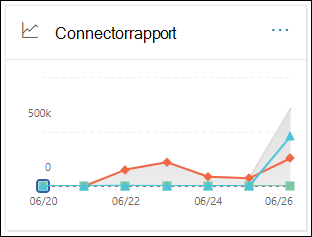

### Rapportweergave voor het verbindings rapport

De volgende grafieken zijn beschikbaar in de rapportweergave:

- **Gegevens weergeven op: e-mail stroom**: deze grafiek toont het aantal inkomende en uitgaande berichten, geordend op:

  - **Totaal**
  - **Vanaf internet zonder connector**
  - **Naar Internet zonder connector**
  - Een specifieke connector die u hebt geconfigureerd.

  Als u de gegevens in de grafiek wilt isoleren, gebruikt u de optie **gegevens weergeven voor** besturingselement om een van deze opties of **alle e-mail stromen**te selecteren.

  

- **Gegevens weergeven op: TLS**: dit diagram toont het percentage van de versie van de TLS (Transport Layer Security) voor de e-mail stroom.

  U kunt de gegevens in de grafiek isoleren door de volgende opties te selecteren in het dialoog element **gegevens weergeven voor** een van de volgende opties:

  - **Alle e-mail stroom**
  - **Vanaf internet zonder connector**
  - **Naar Internet zonder connector**
  - Een specifieke connector die u hebt geconfigureerd.

  

Als u op **filters** in een rapportweergave klikt, kunt u een datumbereik opgeven met de **begindatum** en **einddatum**.

### De tabel weergave Details voor het verbindings rapport

Als u in een rapportweergave op **Details tabel weergeven** klikt, wordt de volgende informatie weergegeven:

- **Einddatum**
- **De richting en de naam van de verbindingslijn**
- **Type verbindingslijn**
- **Afgedwongen TLS?**: de waarde **waar** of **Onwaar**.
- **Geen TLS** (percentage)
- **TLS 1,0** (percentage)
- **TLS 1,1** (percentage)
- **TLS 1,2** (percentage)
- **Volume**: het aantal berichten.

Als u in een weergave met detail tabellen op **filters** klikt, kunt u een datumbereik opgeven met de **begindatum** en **einddatum**.

Als u terug wilt gaan naar de rapportweergave, klikt u op **rapport weergeven**.

## Rapport over Exchange-transportregels

In het **rapport Exchange-transportregel** ziet u het effect van de regels voor de e-mail stroom (ook wel transport-regels genoemd) in inkomende en uitgaande berichten in uw organisatie.

Als u het rapport wilt weergeven, opent u het [beveiligings & compliance](https://protection.office.com), gaat u naar **rapporten** \> **Dashboard** en selecteert u de optie **Exchange-Transport regel**. Open om rechtstreeks naar het rapport te gaan <https://protection.office.com/reportv2?id=ETRRuleReport> .

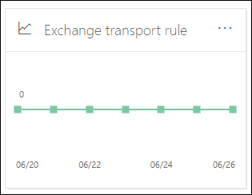

### Rapportweergave voor het rapport Exchange-transportregel

De volgende grafieken zijn beschikbaar in de rapportweergave:

- **Gegevens weergeven op: Exchange-transportregels** \> **Opsplitsen op: richting**: deze grafiek toont het aantal **inkomende** en **uitgaande** berichten dat is beïnvloed door de transportregels.

- **Gegevens weergeven op: Exchange-transportregels** \> **Verbreken op basis van: Ernst**: in dit diagram ziet u het aantal **hoge Ernst** en de ernst van de **Ernst**en van **lage Ernst** berichten. U stelt het prioriteitsniveau als een actie in de regel in (**Controleer deze regel met een niveau hoger** of _SetAuditSeverity_). Zie [acties voor e-mail stroom regels in Exchange Online](https://docs.microsoft.com//Exchange/security-and-compliance/mail-flow-rules/mail-flow-rule-actions)voor meer informatie.

- **Gegevens weergeven op: DLP Exchange-transportregels** \> **Opsplitsen op: richting**: dit diagram toont het aantal **inkomende** en **uitgaande** berichten dat werd beïnvloed door DLP-transportregels (preventie van gegevensverlies). U kunt de grafiek verder verfijnen door een van de volgende opties te selecteren:

  - **Gegevens weergeven voor: alle DLP-transportregels**
  - **Gegevens weergeven voor: gekraakte gebruikers**
  - **Gegevens weergeven voor: laag volume van de in de handel vastgestelde US Patriot Act**

- **Gegevens weergeven op: DLP Exchange-transportregels** \> **Onderbreek omlaag in: richting**: in deze weergave ziet u het aantal **hoge Ernst** en de **Ernst**en de **lage PRIORITEITs** berichten die zijn getroffen door DLP-transportregels. U kunt de grafiek verder verfijnen door een van de volgende opties te selecteren:

  - **Gegevens weergeven voor: alle DLP-transportregels**
  - **Gegevens weergeven voor: gekraakte gebruikers**
  - **Gegevens weergeven voor: laag volume van de in de handel vastgestelde US Patriot Act**

Als u op **filters** in een rapportweergave klikt, kunt u de resultaten wijzigen met de volgende filters::

- **Begindatum** en **einddatum**
- Richtings waarden
- Prioriteitswaarden

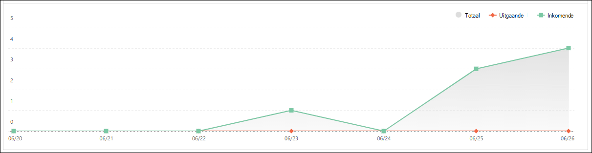

### Detail tabel weergave voor het rapport Exchange-transportregel

Als u op **detail tabel weergeven**klikt, is de informatie die wordt weergegeven, afhankelijk van de grafiek die u bekijkt:

- **Gegevens weergeven op: Exchange-Transport regels**:

  - **Einddatum**
  - **Transport regel**
  - **Onderwerp**
  - **Adres afzender**
  - **Adres van ontvanger**
  - **Ernst**
  - **Richting**

- **Gegevens weergeven op: DLP Exchange-transportregels**:

  - **Einddatum**
  - **DLP-beleid**
  - **Transport regel**
  - **Onderwerp**
  - **Adres afzender**
  - **Adres van ontvanger**
  - **Ernst**
  - **Richting**

Als u in een weergave met detail tabellen op **filters** klikt, kunt u de resultaten wijzigen met de volgende filters:

- **Begindatum** en **einddatum**
- Richtings waarden
- Prioriteitswaarden

Als u terug wilt gaan naar de rapportweergave, klikt u op **rapport weergeven**.

## Doorstuur rapport

In het **doorstuur rapport** worden de automatisch doorgestuurde berichten van uw organisatie weergegeven naar externe domeinen vanuit postvakken van Exchange Online. Doorgestuurde berichten kunnen zorgen voor beveiliging of compliance, en kunnen de inhoud van een gemanipuleerd account aangeven.

Als u het rapport wilt weergeven, opent u het [& nalevings centrum](https://protection.office.com), gaat u naar **rapporten** \> **Dashboard** en selecteert u **forwarding Report**. Open om rechtstreeks naar het rapport te gaan <https://protection.office.com/reportv2?id=MailFlowForwarding> .

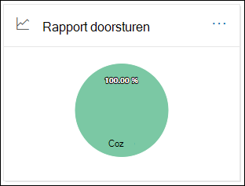

### Rapportweergave voor het doorstuur rapport

De volgende grafieken zijn beschikbaar in de rapportweergave:

- **Gegevens weergeven voor: doorstuur methoden**: de volgende methoden worden weergegeven:

  - **Transport regel**: ook wel wel [e-mail stroom regels](https://docs.microsoft.com/Exchange/security-and-compliance/mail-flow-rules/mail-flow-rules)genoemd.
  - **Postvak regel**: ook wel bekend als de regels voor het [Postvak in](https://support.microsoft.com/office/c24f5dea-9465-4df4-ad17-a50704d66c59).

  

- **Gegevens weergeven voor: forwarding domains**: in deze weergave ziet u de domeinen van de ontvanger die de bestemmingen zijn voor doorsturen.

  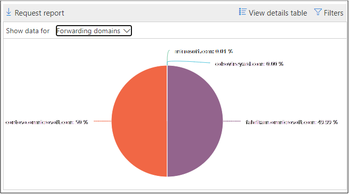

- **Gegevens weergeven voor: doorstuurservers**: de volgende doorstuurservers worden weergegeven:

  - **Transport regel**
  - Het postvak met de regel voor Postvak in met doorstuurregels.

  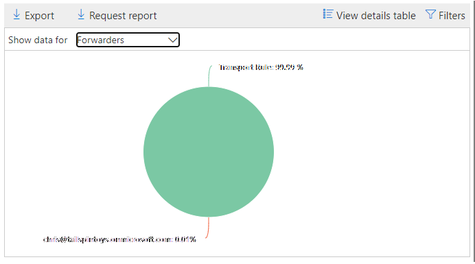

Als u op **filters** in een rapportweergave klikt, kunt u een datumbereik opgeven met de **begindatum** en **einddatum**.

### De tabel weergave Details voor het doorstuur rapport

Als u in een rapportweergave op **Details tabel weergeven** klikt, wordt de volgende informatie weergegeven:

- **Doorstuurservers**: de Value **transport-regel** of het postvak met de regel voor Postvak in met de doorstuurregels.
- **Forwarding type**: de **regel** voor het postvak of de **transport regel**.
- **Naam van ontvanger**
- **Domein van de ontvanger**
- **Details**: dit is de GUID-waarde van de e-mail stroom regel of de RuleIdentity waarde van de regel voor Postvak in.
- **Getal**
- **Eerste doorstuur datum**

Als u in een weergave met detail tabellen op **filters** klikt, kunt u een datumbereik opgeven met de **begindatum** en **einddatum**.

Als u terug wilt gaan naar de weergave rapporten, klikt u op **rapport weergeven**.

## Rapport over de status van de telestroom

Het rapport over de e-mail **stroom status** is vergelijkbaar met het [verzonden en ontvangen van e-mail](#sent-and-received-email-report), met aanvullende informatie over het toestaan of blokkeren van e-mailberichten op de rand. Dit is het enige rapport met informatie over Edge-bescherming en geeft aan hoeveel e-mailberichten worden geblokkeerd voordat deze worden toegelaten door de service Exchange Online Protection (EOP). Het is belangrijk om te weten dat wanneer een bericht wordt verzonden naar vijf geadresseerden, de waarde wordt geteld als vijf verschillende berichten en niet één bericht.
Als u het rapport wilt weergeven, opent u het [beveiligings & nalevings centrum](https://protection.office.com), gaat u naar **rapporten** \> **Dashboard** en selecteert u het rapport over de status van de **telestroom**. Als u rechtstreeks naar het **rapport met de e-mail stroom status**wilt gaan, opent u het <https://protection.office.com/mailflowStatusReport> .

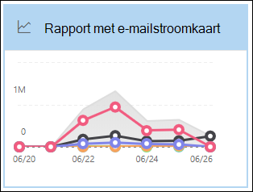

### Type weergave voor het rapport status van de mailflow

Wanneer u het rapport opent, is het tabblad **type** standaard geselecteerd. Deze weergave bevat standaard een grafiek en een gegevenstabel die is geconfigureerd met de volgende filters:

- **Datum**: de laatste 7 dagen.
- **Richting**:

  - **Bound**
  - **Transfer**
  - **Intra organisatie**: dit aantal is bedoeld voor berichten in een Tenant, d.w.z. Sender abc@domain.com verzendt naar de xyz@domain.com van de geadresseerde (geteld op een afzonderlijke waarde van **Inkomend** en **uitgaand**)

- **Type**:

  - **Goede e-mail**
  - **Malware**
  - **Spam**
  - **Edge-bescherming**
  - **Regel berichten**
  - **Phishing-e-mail**

De grafiek is ingedeeld op basis van de waarden in het **type** .

U kunt deze filters wijzigen door te klikken op **filter** of door te klikken op een waarde in de legenda van de grafiek.

De gegevenstabel bevat de volgende informatie:

- **Richting**
- **Type**
- **24 uur**
- **3 dagen**
- **7 dagen**
- **15 dagen**
- **30 dagen**

Als u op **een categorie kiezen**klikt, kunt u kiezen uit de volgende waarden:

- **Malafide e-mail**: met deze optie gaat u naar het rapport met de [bedreigings bescherming](view-email-security-reports.md#threat-protection-status-report).
- **Malware in e-mail**: met deze optie gaat u naar het rapport met de [bedreigings bescherming](view-email-security-reports.md#threat-protection-status-report).
- **Detectie van spam**: met deze optie gaat u naar het [rapport detectie van spam](view-email-security-reports.md#spam-detections-report).
- **Geblokkeerde rand**: met deze optie gaat u naar het [rapport detectie van spam](view-email-security-reports.md#spam-detections-report).

**Exporteren**:

Voor de weergave Details kunt u alleen de gegevens voor één dag exporteren. Als u gegevens voor zeven dagen wilt exporteren, moet u 7 verschillende export acties uitvoeren.

Elk geëxporteerde CSV-bestand mag maximaal 150.000 rijen hebben. Als de gegevens voor die dag meer dan 150.000 rijen bevatten, worden er meerdere. CSV-bestanden gemaakt.

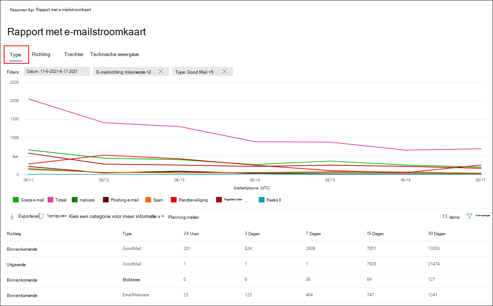

### Richtings weergave voor het rapport status van de mailflow

Als u op het tabblad **richting** klikt, worden de standaardfilters van de **type** weergave gebruikt.

De grafiek is ingedeeld op basis van **richtings** waarden.

U kunt deze filters wijzigen door te klikken op **filter** of door te klikken op een waarde in de legenda van de grafiek. De filters van de **type** -weergave worden gebruikt.

De gegevenstabel bevat dezelfde informatie in de weergave **type** .

Het selectievakje **Kies een categorie voor meer details** , en de werking is hetzelfde als in de **type** weergave.

**Exporteren**:

Voor de weergave Details kunt u alleen de gegevens voor één dag exporteren. Als u gegevens voor zeven dagen wilt exporteren, moet u 7 verschillende export acties uitvoeren.

Elk geëxporteerde CSV-bestand mag maximaal 150.000 rijen hebben. Als de gegevens voor die dag meer dan 150.000 rijen bevatten, worden er meerdere. CSV-bestanden gemaakt.

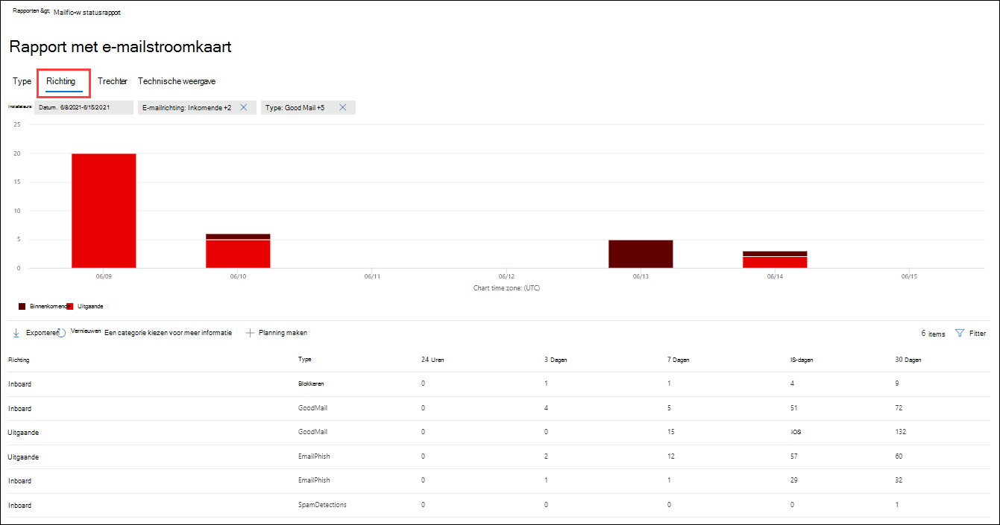

### Trechter weergave voor het rapport status van de mailflow

In de weergave **trechter** ziet u hoe de functies voor e-mail risico beveiliging van Microsoft inkomende en uitgaande e-mail in uw organisatie filteren. Dit bevat details over het totale aantal e-mails en hoe de geconfigureerde functies van bedreigingen voor beveiliging, waaronder Edge-beveiliging, anti-spam, anti-spam en anti-spoofing van invloed zijn op dit aantal.

Als u op het tabblad **trechter** klikt, bevat deze weergave standaard een grafiek en een gegevenstabel die is geconfigureerd met de volgende filters:

- **Datum**: de laatste 7 dagen.

- **Richting**:

  - **Bound**
  - **Transfer**
  - **Intra organisatie**: dit aantal is bestemd voor berichten die binnen een Tenant worden verzonden; verzender abc@domain.com verzendt naar de xyz@domain.com van de geadresseerde (geteld van de inkomende en uitgaande waarde).

De weergave geaggregeerde weergave en gegevenstabel bieden ondersteuning voor 90 dagen van filteren.

Als u op **filter**klikt, kunt u zowel de grafiek als de gegevenstabel filteren.

In dit diagram ziet u het aantal e-mailberichten ingedeeld op:

- **Totaal aantal e-mail**
- **E-mail na bescherming van de Edge**
- **E-mail na anti-malware, bestands reputatie, bestandstype blok**
- **E-mail na anti-spam, URL-reputatie, merkloze persoon, anti-spoof**
- **E-mail na anti-spam, filteren van bulk e-mail**
- **E-mail nadat gebruikers-en domein imitatie**1
- **E-mail na bestand en URL-detonatie**1
- **E-mail waarvan de bescherming na de bezorging is verdacht**

1 Office 365 alleen ATP

Als u het e-mailbericht dat u hebt gefilterd op EOP of ATP afzonderlijk wilt bekijken, klikt u op de waarde in de grafieklegenda.

De gegevenstabel bevat de volgende informatie, weergegeven in aflopende volgorde van datum:

- **Einddatum**
- **Totaal aantal e-mail**
- **Edge-bescherming**
- **Anti malware, bestands reputatie, bestandstype blok**
- **Anti-phishing, URL-reputatie, merk imitatie, anti-spoof**
- **Anti spam, filteren van bulk e-mail**
- **Dispersonatie van gebruikers en domeinen (ATP)**
- **Bestand en URL-detonatie (ATP)**
- **Beveiligingsupdate voor de na ontvangst en ZAP (ATP) of ZAP (EOP)**

Als u een rij in de gegevenstabel selecteert, worden in het vervolgmenu een extra uitsplitsing van het aantal e-mailberichten weergegeven.

**Exporteren**:

Nadat u op **exporteren** hebt **geklikt, kunt**u een van de volgende waarden selecteren:

- **Samenvatting (met de gegevens voor de laatste 90 dagen)**
- **Details (met gegevens voor de laatste 30 dagen op de meeste)**

Kies een bereik onder **datum**en klik vervolgens op **toepassen**. De gegevens voor de huidige filters worden geëxporteerd naar een. CSV-bestand.

Elk geëxporteerde CSV-bestand mag maximaal 150.000 rijen hebben. Als de gegevens meer dan 150.000 rijen bevatten, worden er meerdere CSV-bestanden gemaakt.

 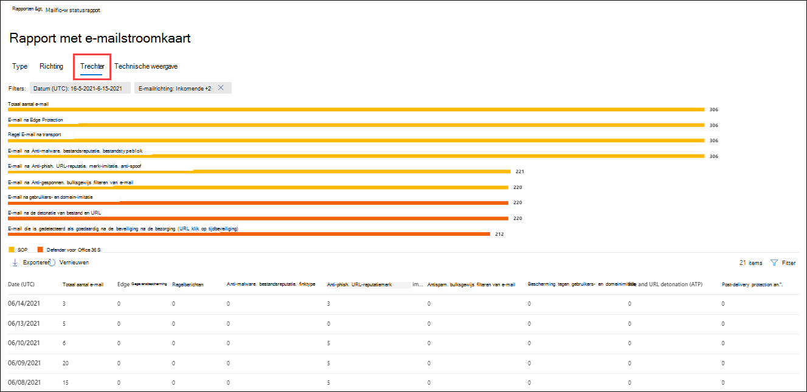

### Technische weergave voor het rapport status van de telestroom

De **technische weergave** is vergelijkbaar met de **trechter** weergave, met meer gedetailleerde informatie over de geconfigureerde functies voor bedreigingsbeveiliging. U kunt in de grafiek zien hoe berichten zijn gecategoriseerd in de verschillende stadia van bedreigings bescherming.

Als u op het tabblad **tech View** klikt, bevat deze weergave standaard een grafiek en een gegevenstabel die is geconfigureerd met de volgende filters:

- **Datum**: de laatste 7 dagen.

- **Richting**:

  - **Bound**
  - **Transfer**
  - **Intra organisatie**: dit aantal is bedoeld voor berichten in een Tenant, d.w.z. Sender abc@domain.com verzendt naar de xyz@domain.com van de geadresseerde (geteld op een afzonderlijke waarde van inkomend en uitgaand)

De weergave geaggregeerde weergave en gegevenstabel bieden ondersteuning voor 90 dagen van filteren.

Als u op **filter**klikt, kunt u zowel de grafiek als de gegevenstabel filteren.

In dit diagram ziet u berichten die zijn ingedeeld in de volgende categorieën:

- **Totaal aantal e-mail**
- **Rand toegestaan, gefilterd rand**
- **Geen malware, detectie van detectie van schadelijke bijlagen, detectie van malware van malware, regelblok**
- **Niet phishing, DMARC mislukking, imitatie detectie, phishing detectie, phishing detection**
- **Geen detectie met URL-detonatie, URL-detonatie detectie (ATP)**
- **Geen spam, spam**
- **Niet-kwaadaardige e-mail, detectie van veilige koppelingen (ATP), ZAP**

Wanneer u de muisaanwijzer op een categorie in de grafiek houdt, ziet u het aantal berichten in die categorie.

De gegevenstabel bevat de volgende informatie, weergegeven in aflopende volgorde van datum:

- **Einddatum**
- **Totaal aantal e-mail**
- **Gefilterde rand**
- **Anti malware-engine, veilige bijlagen, gefilterde regel**
- **DMARC, imitatie, spoofing, phishing gefilterd**
- **Detectie van URL-detonatie**
- **Anti spam gefilterd**
- **ZAP verwijderd**
- **Detectie via veilige koppelingen**

Als u een rij in de gegevenstabel selecteert, worden in het vervolgmenu een extra uitsplitsing van het aantal e-mailberichten weergegeven.

**Exporteren**:

Bij klikken op **exporteren**kunt u onder **Opties** een van de volgende waarden selecteren:

- **Samenvatting (met de gegevens voor de laatste 90 dagen)**
- **Details (met gegevens voor de laatste 30 dagen op de meeste)**

Kies een bereik onder **datum**en klik vervolgens op **toepassen**. De gegevens voor de huidige filters worden geëxporteerd naar een. CSV-bestand.

Elk geëxporteerde CSV-bestand mag maximaal 150.000 rijen hebben. Als de gegevens meer dan 150.000 rijen bevatten, worden er meerdere CSV-bestanden gemaakt.

 

## E-mail verzonden en ontvangen

Het rapport **verzonden en ontvangen e-mail** is een slim rapport met informatie over inkomende en uitgaande e-mail, waaronder spam detectie, malware en e-mailberichten die als ' goed ' worden geïdentificeerd. In dit rapport worden de volgende gegevens weergegeven: [dit rapport bevat](#mailflow-status-report) geen gegevens over berichten die worden geblokkeerd door de Edge-bescherming. Het is belangrijk om te weten dat wanneer een bericht naar vijf geadresseerden wordt verzonden, dit als één bericht wordt verzonden.

De weergave statistisch en de weergave Details van het rapport zijn van 90 dagen filteren toegestaan.

Als u het rapport wilt weergeven, opent u het [beveiligings & compliance](https://protection.office.com), gaat u naar **rapporten** \> **Dashboard** en selecteert u **e-mail verzonden en ontvangen**. Open om rechtstreeks naar het rapport te gaan <https://protection.office.com/reportv2?id=SentAndReceivedMailATP> .

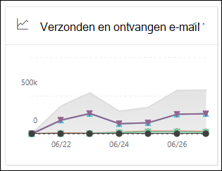

### Rapportweergave voor het verzonden en ontvangen e-mail rapport

De volgende grafieken zijn beschikbaar in de rapportweergave:

- **Opsplitst op: type**: de grafiek bevat alle beschikbare categorieën:

  - **Totaal**
  - **Goede e-mail**
  - **Malware (anti malware)** (EOP)
  - **Detectie van spam**
  - **Regel berichten**
  - **Geavanceerde malware** (Office 365 ATP)

  Wanneer u de muisaanwijzer op een dag (gegevenspunt) van de grafiek houdt, ziet u de gegevens voor die dag.

  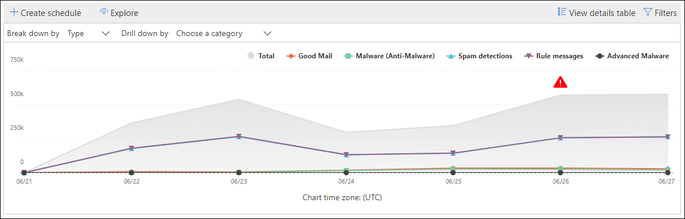

- **Opsplitsen op: richting**: in de grafiek worden **totale**, **binnenkomende**en **uitgaande** gegevens weergegeven. Wanneer u de muisaanwijzer op een dag (gegevenspunt) van de grafiek houdt, ziet u de gegevens voor die dag.

  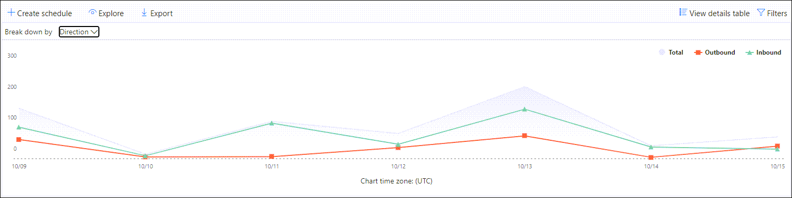

- **Inzoomen op** \> **Malware (anti malware)**: met deze optie gaat u naar de [detectie van malware in een e-mail rapport](view-email-security-reports.md#malware-detections-in-email-report).

- **Inzoomen op** \> **Spam detectie)**: met deze optie gaat u naar het [rapport detectie van spam](view-email-security-reports.md#spam-detections-report).

Als u op **filters** in een rapportweergave klikt, kunt u de resultaten wijzigen met de volgende filters:

- **Begindatum** en **einddatum**
- Richtings waarden
- Waarden typen

Als u terug wilt gaan naar de rapportweergave, klikt u op **rapport weergeven**.

### De tabel weergave Details voor het verzonden en ontvangen van een e-mailbericht

Als u klikt op **Details tabel weergeven** in de weergave van een oplopende **Volg** orde in: **richting** , wordt de volgende informatie weergegeven:

- **Datum (UTC)**
- **Type**
- **Richting**
- **Aantal berichten**

Als u in een weergave met detail tabellen op **filters** klikt, kunt u de resultaten wijzigen met de volgende filters:

- **Begindatum** en **einddatum**
- Richtings waarden
- Waarden typen

Als u terug wilt gaan naar de rapportweergave, klikt u op **rapport weergeven**.

## Rapport belangrijkste afzenders en geadresseerden

De **meest voorkomende afzenders en geadresseerden** zijn een cirkeldiagram met uw belangrijkste afzenders en geadresseerden voor e-mailberichten.

Als u het rapport wilt weergeven, opent u het [beveiligings & compliance](https://protection.office.com), gaat u naar **Reports** \> **Dashboard** rapporten en selecteert u **belangrijkste afzenders en geadresseerden**. Open om rechtstreeks naar het rapport te gaan <https://protection.office.com/reportv2?id=TopSenderRecipientsATP> .

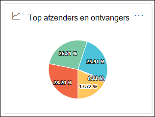

### Rapportweergave voor het rapport meest afzenders en geadresseerden

De volgende grafieken zijn beschikbaar in de rapportweergave:

- **Gegevens voor de \> belangrijkste afzenders weergeven**
- **Gegevens weergeven voor geadresseerden van de \> belangrijkste e-mail**
- **Gegevens voor de \> belangrijkste spam geadresseerden weergeven**
- **Gegevens weergeven voor \> Belangrijkste geadresseerden voor malware** (EOP)
- **Gegevens weergeven voor \> Belangrijkste geadresseerden voor malware (ATP)** (Office 365 ATP)

De compositie van het cirkeldiagram verandert op basis van deze selecties.

Wanneer u de muisaanwijzer boven een wig in het cirkeldiagram houdt, ziet u het aantal verzonden of ontvangen berichten.

Als u op **filters** in een rapportweergave klikt, kunt u een datumbereik opgeven met de **begindatum** en **einddatum**.

### Weergave Details voor het rapport belangrijkste afzenders en geadresseerden

Als u op **detail tabel weergeven**klikt, is de informatie die wordt weergegeven, afhankelijk van de grafiek die u bekijkt:

- **Gegevens voor de \> belangrijkste afzenders weergeven**

  - **Belangrijkste afzenders van e-mail**
  - **Getal**

- **Gegevens weergeven voor geadresseerden van de \> belangrijkste e-mail**

  - **Belangrijkste e-mail geadresseerden**
  - **Getal**

- **Gegevens voor de \> belangrijkste spam geadresseerden weergeven**

  - **Belangrijkste spam geadresseerden**
  - **Getal**

- **Gegevens weergeven voor \> Belangrijkste geadresseerden voor malware** (EOP)

  - **Belangrijkste geadresseerden voor malware**
  - **Getal**

- **Gegevens weergeven voor \> Belangrijkste geadresseerden voor malware (ATP)** (Office 365 ATP)

  - **Belangrijkste geadresseerden voor malware (ATP)**
  - **Getal**

Als u in een weergave met detail tabellen op **filters** klikt, kunt u een datumbereik opgeven met de **begindatum** en **einddatum**.

Als u terug wilt gaan naar de rapportweergave, klikt u op **rapport weergeven**.

## Welke machtigingen zijn vereist voor het weergeven van deze rapporten?

Als u de rapporten wilt weergeven en gebruiken, moet u lid zijn van de opgegeven rollen groep in het beveiligings & nalevings centrum **en** in Exchange Online.

- In het nalevings centrum beveiligings & moet u lid zijn van een van de volgende rollen groepen:

  -Organisatiebeheer-beveiligingsbeheerder (u kunt dit ook doen in het [Azure Active Directory-beheercentrum](https://aad.portal.azure.com) -beveiligings lezer

  Zie [Machtigingen in het Beveiligings- & compliancecentrum](https://docs.microsoft.com/microsoft-365/security/office-365-security/permissions-in-the-security-and-compliance-center) voor meer informatie.

- In Exchange Online moet u lid zijn van een van de volgende groepen rollen:

  -Organisatiebeheer-alleen-bekijken Organisatiebeheer-alleen voor weergeven geadresseerden

Zie [machtigingen in Exchange Online](https://docs.microsoft.com/Exchange/permissions-exo/permissions-exo) en [rollen groepen beheren in Exchange Online](https://docs.microsoft.com/Exchange/permissions-exo/role-groups)voor meer informatie.

## Verwante onderwerpen

[Slimme rapporten en inzichten in het nalevings centrum voor beveiligings &](reports-and-insights-in-security-and-compliance.md)

[E-mail stroom inzichten in het nalevings centrum voor beveiligings &](mail-flow-insights-v2.md)

[Beveiligingsrapporten voor e-mail weergeven in het beveiligings & nalevings centrum](view-email-security-reports.md)

[Rapporten weergeven voor Office 365 Advanced Threat Protection](view-reports-for-atp.md)
