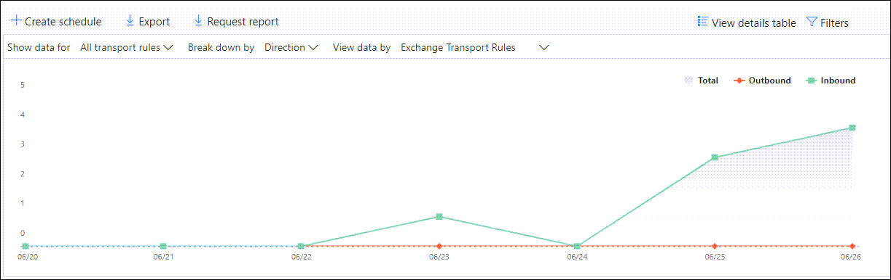

# De e-mail stroom rapporten weergeven in het Dashboard rapporten in de beveiligings & nalevings centrumView mail flow reports in the Reports dashboard in Security & Compliance Center

[!INCLUDE [Microsoft 365 Defender rebranding](../includes/microsoft-defender-for-office.md)]

Naast de weergave van de e-mail stroom rapporten die beschikbaar zijn in het [Dashboard voor e-mail stroom](mail-flow-insights-v2.md) in het beveiligings & nalevings centrum, zijn diverse extra e-mail flow rapporten beschikbaar in het Dashboard rapporten, zodat u uw microsoft 365-organisatie kunt volgen.In addition to the mail flow reports that are available in the [Mail flow dashboard](mail-flow-insights-v2.md) in the Security & Compliance Center, a variety of additional mail flow reports are available in the Reports dashboard to help you monitor your Microsoft 365 organization.

Als u de [benodigde machtigingen](#what-permissions-are-needed-to-view-these-reports)hebt, kunt u deze rapporten weergeven in het [compliance-beveiligings &](https://office.protection.com) door naar het **Reports** \> **Dashboard** rapporten te gaan.If you have the [necessary permissions](#what-permissions-are-needed-to-view-these-reports), you can view these reports in the [Security & Compliance Center](https://office.protection.com) by going to **Reports** \> **Dashboard**. Open om rechtstreeks naar het Dashboard rapporten te gaan <https://protection.office.com/insightdashboard> .To go directly to the Reports dashboard, open <https://protection.office.com/insightdashboard>.

## Verbindingslijn rapportConnector report

In het **rapport connector** ziet u de activiteit van een e-mail stroom op de [binnenkomende en uitgaande connectors](https://docs.microsoft.com/Exchange/mail-flow-best-practices/use-connectors-to-configure-mail-flow/use-connectors-to-configure-mail-flow) die zijn geconfigureerd voor uw organisatie.The **Connector report** shows mail flow activity on the [inbound and outbound connectors](https://docs.microsoft.com/Exchange/mail-flow-best-practices/use-connectors-to-configure-mail-flow/use-connectors-to-configure-mail-flow) that are configured for your organization.

Als u het rapport wilt weergeven, opent u het [& nalevings centrum](https://protection.office.com), gaat u naar **rapporten** \> **Dashboard** en selecteert u **verbindingslijn rapport**.To view the report, open the [Security & Compliance Center](https://protection.office.com), go to **Reports** \> **Dashboard** and select **Connector report**. Open om rechtstreeks naar het rapport te gaan <https://protection.office.com/reportv2?id=ConnectorReport> .To go directly to the report, open <https://protection.office.com/reportv2?id=ConnectorReport>.

### Rapportweergave voor het verbindings rapportReport view for the Connector report

De volgende grafieken zijn beschikbaar in de rapportweergave:The following charts are available in report view:

- **Gegevens weergeven op: e-mail stroom**: deze grafiek toont het aantal inkomende en uitgaande berichten, geordend op:**View data by: Mail flow**: This chart shows the number of inbound and outbound messages organized by:

  - **Totaal****Total**
  - **Vanaf internet zonder connector****From the internet without a connector**
  - **Naar Internet zonder connector****To the internet without a connector**
  - Een specifieke connector die u hebt geconfigureerd.A specific connector that you've configured.

  Als u de gegevens in de grafiek wilt isoleren, gebruikt u de optie **gegevens weergeven voor** besturingselement om een van deze opties of **alle e-mail stromen** te selecteren.To isolate the data in the chart, use the **Show data for** control to select one of these options or **All mail flow**.

  

- **Gegevens weergeven op: TLS**: dit diagram toont het percentage van de versie van de TLS (Transport Layer Security) voor de e-mail stroom.**View data by: TLS usage**: This chart shows the percentage of Transport Layer Security (TLS) version usage for mail flow.

  U kunt de gegevens in de grafiek isoleren door de volgende opties te selecteren in het dialoog element **gegevens weergeven voor** een van de volgende opties:To isolate the data in the chart, use the **Show data for** control to select one of the following options:

  - **Alle e-mail stroom****All mail flow**
  - **Vanaf internet zonder connector****From the internet without a connector**
  - **Naar Internet zonder connector****To the internet without a connector**
  - Een specifieke connector die u hebt geconfigureerd.A specific connector that you've configured.

  

Als u op **filters** in een rapportweergave klikt, kunt u een datumbereik opgeven met de **begindatum** en **einddatum**.If you click **Filters** in a report view, you can specify a date range with **Start date** and **End date**.

### De tabel weergave Details voor het verbindings rapportDetails table view for the Connector report

Als u in een rapportweergave op **Details tabel weergeven** klikt, wordt de volgende informatie weergegeven:If you click **View details table** in a report view, the following information is shown:

- **Datum****Date**
- **De richting en de naam van de verbindingslijn****Connector direction and name**
- **Type verbindingslijn****Connector type**
- **Afgedwongen TLS?**: de waarde **waar** of **Onwaar**.**Forced TLS?**: The value **True** or **False**.
- **Geen TLS** (percentage)**No TLS** (percentage)
- **TLS 1,0** (percentage)**TLS 1.0** (percentage)
- **TLS 1,1** (percentage)**TLS 1.1** (percentage)
- **TLS 1,2** (percentage)**TLS 1.2** (percentage)
- **Volume**: het aantal berichten.**Volume**: The number of messages.

Als u in een weergave met detail tabellen op **filters** klikt, kunt u een datumbereik opgeven met de **begindatum** en **einddatum**.If you click **Filters** in a details table view, you can specify a date range with **Start date** and **End date**.

Als u terug wilt gaan naar de rapportweergave, klikt u op **rapport weergeven**.To go back to the report view, click **View report**.

## Rapport over Exchange-transportregelsExchange transport rule report

In het **rapport Exchange-transportregel** ziet u het effect van de regels voor de e-mail stroom (ook wel transport-regels genoemd) in inkomende en uitgaande berichten in uw organisatie.The **Exchange transport rule report** shows the effect of mail flow rules (also known as transport rules) on incoming and outgoing messages in your organization.

Als u het rapport wilt weergeven, opent u het [beveiligings & compliance](https://protection.office.com), gaat u naar **rapporten** \> **Dashboard** en selecteert u de optie **Exchange-Transport regel**.To view the report, open the [Security & Compliance Center](https://protection.office.com), go to **Reports** \> **Dashboard** and select **Exchange Transport rule**. Open om rechtstreeks naar het rapport te gaan <https://protection.office.com/reportv2?id=ETRRuleReport> .To go directly to the report, open <https://protection.office.com/reportv2?id=ETRRuleReport>.

### Rapportweergave voor het rapport Exchange-transportregelReport view for the Exchange transport rule report

De volgende grafieken zijn beschikbaar in de rapportweergave:The following charts are available in report view:

- **Gegevens weergeven op: Exchange-transportregels** \> **Opsplitsen op: richting**: deze grafiek toont het aantal **inkomende** en **uitgaande** berichten dat is beïnvloed door de transportregels.**View data by: Exchange transport rules** \> **Break down by: Direction**: This chart shows the number of **Inbound** and **Outbound** messages that were affected by transport rules.

- **Gegevens weergeven op: Exchange-transportregels** \> **Verbreken op basis van: Ernst**: in dit diagram ziet u het aantal **hoge Ernst** en de ernst van de **Ernst** en van **lage Ernst** berichten.**View data by: Exchange transport rules** \> **Break down by: Severity**: This chart shows the number of **High severity** and **Medium severity**, and **Low severity** messages. U stelt het prioriteitsniveau als een actie in de regel in (**Controleer deze regel met een niveau hoger** of _SetAuditSeverity_).You set the severity level as an action in the rule (**Audit this rule with severity level** or _SetAuditSeverity_). Zie [acties voor e-mail stroom regels in Exchange Online](https://docs.microsoft.com//Exchange/security-and-compliance/mail-flow-rules/mail-flow-rule-actions)voor meer informatie.For more information, see [Mail flow rule actions in Exchange Online](https://docs.microsoft.com//Exchange/security-and-compliance/mail-flow-rules/mail-flow-rule-actions).

- **Gegevens weergeven op: DLP Exchange-transportregels** \> **Opsplitsen op: richting**: dit diagram toont het aantal **inkomende** en **uitgaande** berichten dat werd beïnvloed door DLP-transportregels (preventie van gegevensverlies).**View data by: DLP Exchange transport rules** \> **Break down by: Direction**: This chart shows the number of **Inbound** and **Outbound** messages that were affected by data loss prevention (DLP) transport rules. U kunt de grafiek verder verfijnen door een van de volgende opties te selecteren:You can further refine the chart by selecting on of the following options:

  - **Gegevens weergeven voor: alle DLP-transportregels****Show data for: All DLP transport rules**
  - **Gegevens weergeven voor: gekraakte gebruikers****Show data for: Compromised users**
  - **Gegevens weergeven voor: laag volume van de in de handel vastgestelde US Patriot Act****Show data for: Low volume of content detected U.S. Patriot Act**

- **Gegevens weergeven op: DLP Exchange-transportregels** \> **Onderbreek omlaag in: richting**: in deze weergave ziet u het aantal **hoge Ernst** en de **Ernst** en de **lage PRIORITEITs** berichten die zijn getroffen door DLP-transportregels.**View data by: DLP Exchange transport rules** \> **Break down by: Direction**: This view shows the number of **High severity** and **Medium severity**, and **Low severity** messages that were affected by DLP transport rules. U kunt de grafiek verder verfijnen door een van de volgende opties te selecteren:You can further refine the chart by selecting on of the following options:

  - **Gegevens weergeven voor: alle DLP-transportregels****Show data for: All DLP transport rules**
  - **Gegevens weergeven voor: gekraakte gebruikers****Show data for: Compromised users**
  - **Gegevens weergeven voor: laag volume van de in de handel vastgestelde US Patriot Act****Show data for: Low volume of content detected U.S. Patriot Act**

Als u op **filters** in een rapportweergave klikt, kunt u de resultaten wijzigen met de volgende filters::If you click **Filters** in a report view, you can modify the results with the following filters::

- **Begindatum** en **einddatum****Start date** and **End date**
- Richtings waardenDirection values
- PrioriteitswaardenSeverity values

### Detail tabel weergave voor het rapport Exchange-transportregelDetails table view for the Exchange transport rule report

Als u op **detail tabel weergeven** klikt, is de informatie die wordt weergegeven, afhankelijk van de grafiek die u bekijkt:If you click **View details table**, the information that's shown depends on the chart you were looking at:

- **Gegevens weergeven op: Exchange-Transport regels**:**View data by: Exchange Transport rules**:

  - **Datum****Date**
  - **Transport regel****Transport rule**
  - **Onderwerp****Subject**
  - **Adres afzender****Sender address**
  - **Adres van ontvanger****Recipient address**
  - **Ernst****Severity**
  - **Richting****Direction**

- **Gegevens weergeven op: DLP Exchange-transportregels**:**View data by: DLP Exchange transport rules**:

  - **Datum****Date**
  - **DLP-beleid****DLP policy**
  - **Transport regel****Transport rule**
  - **Onderwerp****Subject**
  - **Adres afzender****Sender address**
  - **Adres van ontvanger****Recipient address**
  - **Ernst****Severity**
  - **Richting****Direction**

Als u in een weergave met detail tabellen op **filters** klikt, kunt u de resultaten wijzigen met de volgende filters:If you click **Filters** in a details table view, you can modify the results with the following filters:

- **Begindatum** en **einddatum****Start date** and **End date**
- Richtings waardenDirection values
- PrioriteitswaardenSeverity values

Als u terug wilt gaan naar de rapportweergave, klikt u op **rapport weergeven**.To go back to the report view, click **View report**.

## Doorstuur rapportForwarding report

In het **doorstuur rapport** worden de automatisch doorgestuurde berichten van uw organisatie weergegeven naar externe domeinen vanuit postvakken van Exchange Online.The **Forwarding report** shows your organization's automatically forwarded messages to external domains from Exchange Online mailboxes. Doorgestuurde berichten kunnen zorgen voor beveiliging of compliance, en kunnen de inhoud van een gemanipuleerd account aangeven.Forwarded messages can pose a security or compliance risk, and might indicate a compromised account.

Als u het rapport wilt weergeven, opent u het [& nalevings centrum](https://protection.office.com), gaat u naar **rapporten** \> **Dashboard** en selecteert u **forwarding Report**.To view the report, open the [Security & Compliance Center](https://protection.office.com), go to **Reports** \> **Dashboard** and select **Forwarding report**. Open om rechtstreeks naar het rapport te gaan <https://protection.office.com/reportv2?id=MailFlowForwarding> .To go directly to the report, open <https://protection.office.com/reportv2?id=MailFlowForwarding>.

### Rapportweergave voor het doorstuur rapportReport view for the Forwarding report

De volgende grafieken zijn beschikbaar in de rapportweergave:The following charts are available in the report view:

- **Gegevens weergeven voor: doorstuur methoden**: de volgende methoden worden weergegeven:**Show data for: Forwarding methods**: The following methods are shown:

  - **Transport regel**: ook wel wel [e-mail stroom regels](https://docs.microsoft.com/Exchange/security-and-compliance/mail-flow-rules/mail-flow-rules)genoemd.**Transport rule**: Also known as [mail flow rules](https://docs.microsoft.com/Exchange/security-and-compliance/mail-flow-rules/mail-flow-rules).
  - **Postvak regel**: ook wel bekend als de regels voor het [Postvak in](https://support.microsoft.com/office/c24f5dea-9465-4df4-ad17-a50704d66c59).**Mailbox rule**: Also known as [Inbox rules](https://support.microsoft.com/office/c24f5dea-9465-4df4-ad17-a50704d66c59).

  

- **Gegevens weergeven voor: forwarding domains**: in deze weergave ziet u de domeinen van de ontvanger die de bestemmingen zijn voor doorsturen.**Show data for: Forwarding domains**: This view shows the recipient domains that are the destinations for forwarding.

  

- **Gegevens weergeven voor: doorstuurservers**: de volgende doorstuurservers worden weergegeven:**Show data for: Forwarders**: The following forwarders are shown:

  - **Transport regel****Transport rule**
  - Het postvak met de regel voor Postvak in met doorstuurregels.The mailbox that contains the forwarding Inbox rule.

  

Als u op **filters** in een rapportweergave klikt, kunt u een datumbereik opgeven met de **begindatum** en **einddatum**.If you click **Filters** in a report view, you can specify a date range with **Start date** and **End date**.

### De tabel weergave Details voor het doorstuur rapportDetails table view for the Forwarding report

Als u in een rapportweergave op **Details tabel weergeven** klikt, wordt de volgende informatie weergegeven:If you click **View details table** in a report view, the following information is shown:

- **Doorstuurservers**: de Value **transport-regel** of het postvak met de regel voor Postvak in met de doorstuurregels.**Forwarders**: The value **Transport rule** or the mailbox that contains the forwarding Inbox rule.
- **Forwarding type**: de **regel** voor het postvak of de **transport regel**.**Forwarding type**: The value **Mailbox rule** or **Transport rule**.
- **Naam van ontvanger****Recipient name**
- **Domein van de ontvanger****Recipient domain**
- **Details**: dit is de GUID-waarde van de e-mail stroom regel of de RuleIdentity waarde van de regel voor Postvak in.**Details**: This is the GUID value of the mail flow rule, or the RuleIdentity value of the Inbox rule.
- **Getal****Count**
- **Eerste doorstuur datum****First forward date**

Als u in een weergave met detail tabellen op **filters** klikt, kunt u een datumbereik opgeven met de **begindatum** en **einddatum**.If you click **Filters** in a details table view, you can specify a date range with **Start date** and **End date**.

Als u terug wilt gaan naar de weergave rapporten, klikt u op **rapport weergeven**.To go back to the reports view, click **View report**.

## Rapport over de status van de telestroomMailflow status report

Het rapport over de e-mail **stroom status** is vergelijkbaar met het [verzonden en ontvangen van e-mail](#sent-and-received-email-report), met aanvullende informatie over het toestaan of blokkeren van e-mailberichten op de rand.The **Mailflow status report** is similar to the [Sent and received email report](#sent-and-received-email-report), with additional information about email allowed or blocked on the edge. Dit is het enige rapport met informatie over Edge-bescherming en geeft aan hoeveel e-mailberichten worden geblokkeerd voordat deze worden toegelaten door de service Exchange Online Protection (EOP).This is the only report that contains edge protection information, and shows just how much email is blocked before being allowed into the service for evaluation by Exchange Online Protection (EOP). Het is belangrijk om te weten dat wanneer een bericht wordt verzonden naar vijf geadresseerden, de waarde wordt geteld als vijf verschillende berichten en niet één bericht.It's important to understand that if a message is sent to five recipients we count it as five different messages and not one message.
Als u het rapport wilt weergeven, opent u het [beveiligings & nalevings centrum](https://protection.office.com), gaat u naar **rapporten** \> **Dashboard** en selecteert u het rapport over de status van de **telestroom**.To view the report, open the [Security & Compliance Center](https://protection.office.com), go to **Reports** \> **Dashboard** and select **Mailflow status report**. Als u rechtstreeks naar het **rapport met de e-mail stroom status** wilt gaan, opent u het <https://protection.office.com/mailflowStatusReport> .To go directly to the **Mail flow status report**, open <https://protection.office.com/mailflowStatusReport>.

### Type weergave voor het rapport status van de mailflowType view for the Mailflow status report

Wanneer u het rapport opent, is het tabblad **type** standaard geselecteerd.When you open the report, the **Type** tab is selected by default. Deze weergave bevat standaard een grafiek en een gegevenstabel die is geconfigureerd met de volgende filters:By default, this view contains a chart and a data table that's configured with the following filters:

- **Datum**: de laatste 7 dagen.**Date**: The last 7 days.
- **Richting**:**Direction**:

  - **Bound****Inbound**
  - **Transfer****Outbound**
  - **Intra organisatie**: dit aantal is bedoeld voor berichten in een Tenant, d.w.z.**Intra-org**: this count is for messages within a tenant i.e Sender abc@domain.com verzendt naar de xyz@domain.com van de geadresseerde (geteld op een afzonderlijke waarde van **Inkomend** en **uitgaand**)sender abc@domain.com sends to recipient xyz@domain.com  (counted separately from **Inbound** and **Outbound**)

- **Type**:**Type**:

  - **Goede e-mail****Good mail**
  - **Malware****Malware**
  - **Spam****Spam**
  - **Edge-bescherming****Edge protection**
  - **Regel berichten****Rule messages**
  - **Phishing-e-mail****Phishing email**

De grafiek is ingedeeld op basis van de waarden in het **type** .The chart is organized by the **Type** values.

U kunt deze filters wijzigen door te klikken op **filter** of door te klikken op een waarde in de legenda van de grafiek.You can change these filters by clicking **Filter** or by clicking a value in the chart legend.

De gegevenstabel bevat de volgende informatie:The data table contains the following information:

- **Richting****Direction**
- **Type****Type**
- **24 uur****24 hours**
- **3 dagen****3 days**
- **7 dagen****7 days**
- **15 dagen****15 days**
- **30 dagen****30 days**

Als u op **een categorie kiezen** klikt, kunt u kiezen uit de volgende waarden:If you click **Choose a category for more details**, you can select from the following values:

- **Malafide e-mail**: met deze optie gaat u naar het rapport met de [bedreigings bescherming](view-email-security-reports.md#threat-protection-status-report).**Phishing email**: This selection takes you to the [Threat protection status report](view-email-security-reports.md#threat-protection-status-report).
- **Malware in e-mail**: met deze optie gaat u naar het rapport met de [bedreigings bescherming](view-email-security-reports.md#threat-protection-status-report).**Malware in email**: This selection takes you to the [Threat protection status report](view-email-security-reports.md#threat-protection-status-report).
- **Detectie van spam**: met deze optie gaat u naar het [rapport detectie van spam](view-email-security-reports.md#spam-detections-report).**Spam detections**: This selection takes you to the [Spam Detections report](view-email-security-reports.md#spam-detections-report).
- **Geblokkeerde rand**: met deze optie gaat u naar het [rapport detectie van spam](view-email-security-reports.md#spam-detections-report).**Edge blocked spam**: This selection takes you to the [Spam Detections report](view-email-security-reports.md#spam-detections-report).

**Exporteren**:**Export**:

Voor de weergave Details kunt u alleen de gegevens voor één dag exporteren.For the detail view, you can only export data for one day. Als u gegevens voor zeven dagen wilt exporteren, moet u 7 verschillende export acties uitvoeren.So, if you want to export data for 7 days, you need to do 7 different export actions.

Elk geëxporteerde CSV-bestand mag maximaal 150.000 rijen hebben.Each exported .csv file is limited to 150,000 rows. Als de gegevens voor die dag meer dan 150.000 rijen bevatten, worden er meerdere. CSV-bestanden gemaakt.If the data for that day contains more than 150,000 rows, then multiple .csv files will be created.

### Richtings weergave voor het rapport status van de mailflowDirection view for the Mailflow status report

Als u op het tabblad **richting** klikt, worden de standaardfilters van de **type** weergave gebruikt.If you click the **Direction** tab, the same default filters from the **Type** view are used.

De grafiek is ingedeeld op basis van **richtings** waarden.The chart is organized by **Direction** values.

U kunt deze filters wijzigen door te klikken op **filter** of door te klikken op een waarde in de legenda van de grafiek.You can change these filters by clicking **Filter** or by clicking a value in the chart legend. De filters van de **type** -weergave worden gebruikt.The same filters from the **Type** view are used.

De gegevenstabel bevat dezelfde informatie in de weergave **type** .The data table contains same information from the **Type** view.

Het selectievakje **Kies een categorie voor meer details** , en de werking is hetzelfde als in de **type** weergave.The **Choose a category for more details** available selections and behavior are the same as the **Type** view.

**Exporteren**:**Export**:

Voor de weergave Details kunt u alleen de gegevens voor één dag exporteren.For the detail view, you can only export data for one day. Als u gegevens voor zeven dagen wilt exporteren, moet u 7 verschillende export acties uitvoeren.So, if you want to export data for 7 days, you need to do 7 different export actions.

Elk geëxporteerde CSV-bestand mag maximaal 150.000 rijen hebben.Each exported .csv file is limited to 150,000 rows. Als de gegevens voor die dag meer dan 150.000 rijen bevatten, worden er meerdere. CSV-bestanden gemaakt.If the data for that day contains more than 150,000 rows, then multiple .csv files will be created.

### Trechter weergave voor het rapport status van de mailflowFunnel view for the Mailflow status report

In de weergave **trechter** ziet u hoe de functies voor e-mail risico beveiliging van Microsoft inkomende en uitgaande e-mail in uw organisatie filteren.The **Funnel** view shows you how Microsoft's email threat protection features filter incoming and outgoing email in your organization. Dit bevat details over het totale aantal e-mails en hoe de geconfigureerde functies van bedreigingen voor beveiliging, waaronder Edge-beveiliging, anti-spam, anti-spam en anti-spoofing van invloed zijn op dit aantal.It provides details on the total email count, and how the configured threat protection features, including edge protection, anti-malware, anti-phishing, anti-spam, and anti-spoofing affect this count.

Als u op het tabblad **trechter** klikt, bevat deze weergave standaard een grafiek en een gegevenstabel die is geconfigureerd met de volgende filters:If you click the **Funnel** tab, by default, this view contains a chart and a data table that's configured with the following filters:

- **Datum**: de laatste 7 dagen.**Date**: The last 7 days.

- **Richting**:**Direction**:

  - **Bound****Inbound**
  - **Transfer****Outbound**
  - **Intra organisatie**: dit aantal is bestemd voor berichten die binnen een Tenant worden verzonden; verzender abc@domain.com verzendt naar de xyz@domain.com van de geadresseerde (geteld van de inkomende en uitgaande waarde).**Intra-org**: This count is for messages sent within a tenant; i.e, sender abc@domain.com sends to recipient xyz@domain.com (counted separately from Inbound and Outbound).

De weergave geaggregeerde weergave en gegevenstabel bieden ondersteuning voor 90 dagen van filteren.The aggregate view and data table view allow for 90 days of filtering.

Als u op **filter** klikt, kunt u zowel de grafiek als de gegevenstabel filteren.If you click **Filter**, you can filter both the chart and the data table.

In dit diagram ziet u het aantal e-mailberichten ingedeeld op:This chart shows the email count organized by:

- **Totaal aantal e-mail****Total email**
- **E-mail na bescherming van de Edge****Email after edge protection**
- **E-mail na anti-malware, bestands reputatie, bestandstype blok****Email after anti-malware, file reputation, file type block**
- **E-mail na anti-spam, URL-reputatie, merkloze persoon, anti-spoof****Email after anti-phish, URL reputation, brand impersonation, anti-spoof**
- **E-mail na anti-spam, filteren van bulk e-mail****Email after anti-spam, bulk mail filtering**
- **E-mail nadat gebruikers-en domein imitatie**1**Email after user and domain impersonation**1
- **E-mail na bestand en URL-detonatie**1**Email after file and URL detonation**1
- **E-mail waarvan de bescherming na de bezorging is verdacht****Email detected as benign after post-delivery protection (URL click time protection)**

alleen 1 Defender voor Office 3651 Defender for Office 365 only

Als u het e-mailbericht dat u hebt gefilterd op EOP of Defender voor Office 365 apart wilt weergeven, klikt u op de waarde in de grafieklegenda.To view the email filtered by EOP or Defender for Office 365 separately, click on the value in the chart legend.

De gegevenstabel bevat de volgende informatie, weergegeven in aflopende volgorde van datum:The data table contains the following information, shown in descending date order:

- **Datum****Date**
- **Totaal aantal e-mail****Total email**
- **Edge-bescherming****Edge protection**
- **Anti malware, bestands reputatie, bestandstype blok**:**Anti-malware, file reputation, file type block**:
  - **Bestands reputatie**: berichten gefilterd door de identificatie van een bijgevoegd bestand door andere Microsoft-klanten.**File reputation**: Messages filtered due to identification of an attached file by other Microsoft customers.
  - **Bestandstype blok**: berichten gefilterd door het type schadelijke bestand dat in het bericht is geïdentificeerd.**File type block**: Messages filtered due to the type of malicious file identified in the message.
- **Anti-phishing, URL-reputatie, merk imitatie, anti-spoofing**:**Anti-phish, URL reputation, Brand impersonation, anti-spoof**:
  - **URL-reputatie**: berichten gefilterd als gevolg van de identificatie van de URL door andere Microsoft-klanten.**URL reputation**: Messages filtered due to the identification of the URL by other Microsoft customers.
  - **Merken van merken**: berichten gefilterd door het bericht, afkomstig van duidelijk merk dat afzenders imiteren.**Brand impersonation**: Messages filtered due to the message coming from well-known brand impersonating senders.
  - **Anti-spoof**: berichten gefilterd als gevolg van het bericht probeert een domein te vervalsen waarvan de ontvanger lid is of een domein dat de afzender van het bericht niet de eigenaar is.**Anti-spoof**: Messages filtered due to the message attempting to spoof a domain that the recipient belongs to, or a domain that the message sender doesn't own.
- **Anti spam, filteren van bulkmail**:**Anti-spam, bulk mail filtering**:
  - **Filteren van bulk mail**: berichten gefilterd door een poging om bulksgewijs e-mail te bezorgen bij de geadresseerden.**Bulk mail filtering**: Messages filtered due to an attempt to deliver bulk mail to its recipients.
- **Imitatie van gebruikers en domeinen (Defender voor Office 365)**:**User and domain impersonation (Defender for Office 365)**:
  - **Gebruikers imitatie**: berichten gefilterd als gevolg van een poging om een gebruiker (afzender van het bericht) te imiteren die is gedefinieerd in de instellingen van de imitatie bescherming van een anti phishingfilter.**User impersonation**: Messages filtered due to an attempt to impersonate a user (message sender) that's defined in the impersonation protection settings of an anti-phishing policy.
  - **Domein imitatie**: berichten gefilterd als gevolg van een poging tot het imiteren van een domein dat is gedefinieerd in de instellingen van de imitatie bescherming van een anti phishingfilter.**Domain impersonation**: Messages filtered due to an attempt to impersonate a domain that's defined in the impersonation protection settings of an anti-phishing policy.
- **Bestand en URL detonatie (Defender voor Office 365)**:**File and URL detonation (Defender for Office 365)**:
  - **Bestands detonatie**: berichten gefilterd door een veilig bijlage beleid.**File detonation**: Messages filtered by a Safe Attachments policy.
  - **URL-detonatie**: bericht gefilterd door een beleid voor veilige koppelingen.**URL detonation**: Message filtered by a Safe Links policy.
- **Beveiligings-en bezorgings bescherming en zap (ATP), of ZAP (EOP)**: zap geeft automatisch wissen van nul uur aan.**Post-delivery protection and ZAP (ATP), or ZAP (EOP)**: ZAP indicates zero hour auto-purge.

Als u een rij in de gegevenstabel selecteert, worden in het vervolgmenu een extra uitsplitsing van het aantal e-mailberichten weergegeven.If you select a row in the data table, a further breakdown of the email counts are shown in the flyout.

**Exporteren**:**Export**:

Nadat u op **exporteren** hebt **geklikt, kunt** u een van de volgende waarden selecteren:After you click **Export** under **Options**, you can select one of the following values:

- **Samenvatting (met de gegevens voor de laatste 90 dagen)****Summary (with data for last 90 days at most)**
- **Details (met gegevens voor de laatste 30 dagen op de meeste)****Details (with data for last 30 days at most)**

Kies een bereik onder **datum** en klik vervolgens op **toepassen**.Under **Date**, choose a range, and then click **Apply**. De gegevens voor de huidige filters worden geëxporteerd naar een. CSV-bestand.Data for the current filters will be exported to a .csv file.

Elk geëxporteerde CSV-bestand mag maximaal 150.000 rijen hebben.Each exported .csv file is limited to 150,000 rows. Als de gegevens meer dan 150.000 rijen bevatten, worden er meerdere CSV-bestanden gemaakt.If the data contains more than 150,000 rows, then multiple .csv files will be created.

 

### Technische weergave voor het rapport status van de telestroomTech view for the Mailflow status report

De **technische weergave** is vergelijkbaar met de **trechter** weergave, met meer gedetailleerde informatie over de geconfigureerde functies voor bedreigingsbeveiliging.The **Tech view** is similar to the **Funnel** view, providing more granular details for the configured threat protections features. U kunt in de grafiek zien hoe berichten zijn gecategoriseerd in de verschillende stadia van bedreigings bescherming.From the chart, you can see how messages are categorized at the different stages of threat protection.

Als u op het tabblad **tech View** klikt, bevat deze weergave standaard een grafiek en een gegevenstabel die is geconfigureerd met de volgende filters:If you click the **Tech view** tab, by default, this view contains a chart and a data table that's configured with the following filters:

- **Datum**: de laatste 7 dagen.**Date**: The last 7 days.

- **Richting**:**Direction**:

  - **Bound****Inbound**
  - **Transfer****Outbound**
  - **Intra organisatie**: dit aantal is bedoeld voor berichten in een Tenant, d.w.z.**Intra-org**: this count is for messages within a tenant i.e Sender abc@domain.com verzendt naar de xyz@domain.com van de geadresseerde (geteld op een afzonderlijke waarde van inkomend en uitgaand)sender abc@domain.com sends to recipient xyz@domain.com (counted separately from Inbound and Outbound)

De weergave geaggregeerde weergave en gegevenstabel bieden ondersteuning voor 90 dagen van filteren.The aggregate view and data table view allow for 90 days of filtering.

Als u op **filter** klikt, kunt u zowel de grafiek als de gegevenstabel filteren.If you click **Filter**, you can filter both the chart and the data table.

In dit diagram ziet u berichten die zijn ingedeeld in de volgende categorieën:This chart shows messages organized into the following categories:

- **Totaal aantal e-mail****Total email**
- **Rand toegestaan** en **rand gefilterd****Edge allow** and **Edge filtered**
- **Geen malware**, **detectie van veilige bijlagen** \* , **detectie van anti malware-engine** en **regel berichten****Not malware**, **Safe Attachments detection**\*, **Anti-malware engine detection**, and **Rule messages**
- **Niet phishing**, **DMARC mislukking**, **imitatie** detectie, **spoof detectie** en **phishing detection****Not phish**, **DMARC failure**, **Impersonation detection**, **Spoof detection**, and **Phish detection**
- **Geen detectie met URL-detonatie** en **URL-detonatie detectie**\***No detection with URL detonation** and **URL detonation detection**\*
- **Geen spam** en  **spam****Not spam** and  **Spam**
- **Niet-schadelijke e-mail**, **detectie van veilige koppelingen** \* en **ZAP****Non-malicious email**, **Safe Links detection**\*, and **ZAP**

\* Defender voor Office 365\* Defender for Office 365

Wanneer u de muisaanwijzer op een categorie in de grafiek houdt, ziet u het aantal berichten in die categorie.When you hover over a category in the chart, you can see the number of messages in that category.

De gegevenstabel bevat de volgende informatie, weergegeven in aflopende volgorde van datum:The data table contains the following information, shown in descending date order:

- **Datum****Date**
- **Totaal aantal e-mail****Total email**
- **Gefilterde rand****Edge filtered**
- **Anti malware-engine, veilige bijlagen, gefilterde regel**:**Anti-malware engine, Safe Attachments, rule filtered**:
  - **Gefilterde regel**: berichten gefilterd door de regels voor de e-mail stroom (ook wel transport-regels genoemd).**Rule filtered**: Messages filtered due to  mail flow rules (also known as transport rules).
- **DMARC, imitatie, spoofing, phishing gefilterd**:**DMARC, impersonation, spoof, phish filtered**:
  - **DMARC**: berichten gefilterd door het bericht de verificatiecontrole van de DMARC is mislukt.**DMARC**: Messages filtered due to the message failing its DMARC authentication check.
- **Detectie van URL-detonatie****URL detonation detection**
- **Anti spam gefilterd****Anti-spam filtered**
- **ZAP verwijderd****ZAP removed**
- **Detectie via veilige koppelingen****Detection by Safe Links**

Als u een rij in de gegevenstabel selecteert, worden in het vervolgmenu een extra uitsplitsing van het aantal e-mailberichten weergegeven.If you select a row in the data table, a further breakdown of the email counts are shown in the flyout.

**Exporteren**:**Export**:

Bij klikken op **exporteren** kunt u onder **Opties** een van de volgende waarden selecteren:On clicking **Export**, under **Options** you can select one of the following values:

- **Samenvatting (met de gegevens voor de laatste 90 dagen)****Summary (with data for last 90 days at most)**
- **Details (met gegevens voor de laatste 30 dagen op de meeste)****Details (with data for last 30 days at most)**

Kies een bereik onder **datum** en klik vervolgens op **toepassen**.Under **Date**, choose a range, and then click **Apply**. De gegevens voor de huidige filters worden geëxporteerd naar een. CSV-bestand.Data for the current filters will be exported to a .csv file.

Elk geëxporteerde CSV-bestand mag maximaal 150.000 rijen hebben.Each exported .csv file is limited to 150,000 rows. Als de gegevens meer dan 150.000 rijen bevatten, worden er meerdere CSV-bestanden gemaakt.If the data contains more than 150,000 rows, then multiple .csv files will be created.

 

## E-mail verzonden en ontvangenSent and received email report

Het rapport **verzonden en ontvangen e-mail** is een slim rapport met informatie over inkomende en uitgaande e-mail, waaronder spam detectie, malware en e-mailberichten die als ' goed ' worden geïdentificeerd.The **Sent and received email** report is a smart report that shows information about incoming and outgoing email, including spam detections, malware, and email identified as "good." In dit rapport worden de volgende gegevens weergegeven: [dit rapport bevat](#mailflow-status-report) geen gegevens over berichten die worden geblokkeerd door de Edge-bescherming. Het is belangrijk om te weten dat wanneer een bericht naar vijf geadresseerden wordt verzonden, dit als één bericht wordt verzonden.The difference between this report and the [Mailflow status report](#mailflow-status-report) is: this report doesn't include data about messages blocked by edge protection.It's important to understand that if a message is sent to five recipients we count it as one message.

De weergave statistisch en de weergave Details van het rapport zijn van 90 dagen filteren toegestaan.The aggregate view and the detail view of the report allow for 90 days of filtering.

Als u het rapport wilt weergeven, opent u het [beveiligings & compliance](https://protection.office.com), gaat u naar **rapporten** \> **Dashboard** en selecteert u **e-mail verzonden en ontvangen**.To view the report, open the [Security & Compliance Center](https://protection.office.com), go to **Reports** \> **Dashboard** and select **Sent and received email**. Open om rechtstreeks naar het rapport te gaan <https://protection.office.com/reportv2?id=SentAndReceivedMailATP> .To go directly to the report, open <https://protection.office.com/reportv2?id=SentAndReceivedMailATP>.

### Rapportweergave voor het verzonden en ontvangen e-mail rapportReport view for the Sent and received email report

De volgende grafieken zijn beschikbaar in de rapportweergave:The following charts are available in the report view:

- **Opsplitst op: type**: de grafiek bevat alle beschikbare categorieën:**Break down by: Type**: The chart shows all available categories:

  - **Totaal****Total**
  - **Goede e-mail****Good mail**
  - **Malware (anti malware)** (EOP)**Malware (anti-malware)** (EOP)
  - **Detectie van spam****Spam detections**
  - **Regel berichten****Rule messages**
  - **Geavanceerde malware** (Microsoft Defender voor Office 365)**Advanced malware** (Microsoft Defender for Office 365)

  Wanneer u de muisaanwijzer op een dag (gegevenspunt) van de grafiek houdt, ziet u de gegevens voor die dag.When you hover over a day (data point) in the chart, you can see details for that day.

  

- **Opsplitsen op: richting**: in de grafiek worden **totale**, **binnenkomende** en **uitgaande** gegevens weergegeven.**Break down by: Direction**: The chart shows **Total**, **Inbound**, and **Outbound** data. Wanneer u de muisaanwijzer op een dag (gegevenspunt) van de grafiek houdt, ziet u de gegevens voor die dag.When you hover over a day (data point) in the chart, you can see details for that day.

  

- **Inzoomen op** \> **Malware (anti malware)**: met deze optie gaat u naar de [detectie van malware in een e-mail rapport](view-email-security-reports.md#malware-detections-in-email-report).**Drill down by** \> **Malware (anti-malware)**: This selection takes you to the [Malware detections in email report](view-email-security-reports.md#malware-detections-in-email-report).

- **Inzoomen op** \> **Spam detectie)**: met deze optie gaat u naar het [rapport detectie van spam](view-email-security-reports.md#spam-detections-report).**Drill down by** \> **Spam detections)**: This selection takes you to the [Spam Detections report](view-email-security-reports.md#spam-detections-report).

Als u op **filters** in een rapportweergave klikt, kunt u de resultaten wijzigen met de volgende filters:If you click **Filters** in a report view, you can modify the results with the following filters:

- **Begindatum** en **einddatum****Start date** and **End date**
- Richtings waardenDirection values
- Waarden typenType values

Als u terug wilt gaan naar de rapportweergave, klikt u op **rapport weergeven**.To go back to the report view, click **View report**.

### De tabel weergave Details voor het verzonden en ontvangen van een e-mailberichtDetails table view for the Sent and received email report

Als u klikt op **Details tabel weergeven** in de weergave van een oplopende **Volg** orde in: **richting** , wordt de volgende informatie weergegeven:If you click **View details table** in the **Break down by: Direction** or **Break down by: Direction** view, the following information is shown:

- **Datum (UTC)****Date (UTC)**
- **Type****Type**
- **Richting****Direction**
- **Aantal berichten****Message count**

Als u in een weergave met detail tabellen op **filters** klikt, kunt u de resultaten wijzigen met de volgende filters:If you click **Filters** in a details table view, you can modify the results with the following filters:

- **Begindatum** en **einddatum****Start date** and **End date**
- Richtings waardenDirection values
- Waarden typenType values

Als u terug wilt gaan naar de rapportweergave, klikt u op **rapport weergeven**.To go back to the report view, click **View report**.

## Rapport belangrijkste afzenders en geadresseerdenTop senders and recipients report

De **meest voorkomende afzenders en geadresseerden** zijn een cirkeldiagram met uw belangrijkste afzenders en geadresseerden voor e-mailberichten.The **Top senders and recipients** report is a pie chart showing your top email senders and recipients.

Als u het rapport wilt weergeven, opent u het [beveiligings & compliance](https://protection.office.com), gaat u naar **Reports** \> **Dashboard** rapporten en selecteert u **belangrijkste afzenders en geadresseerden**.To view the report, open the [Security & Compliance Center](https://protection.office.com), go to **Reports** \> **Dashboard** and select **Top senders and recipients**. Open om rechtstreeks naar het rapport te gaan <https://protection.office.com/reportv2?id=TopSenderRecipientsATP> .To go directly to the report, open <https://protection.office.com/reportv2?id=TopSenderRecipientsATP>.

### Rapportweergave voor het rapport meest afzenders en geadresseerdenReport view for the Top senders and recipient report

De volgende grafieken zijn beschikbaar in de rapportweergave:The following charts are available in the report view:

- **Gegevens voor de \> belangrijkste afzenders weergeven****Show data for \> Top mail senders**
- **Gegevens weergeven voor geadresseerden van de \> belangrijkste e-mail****Show data for \> Top mail recipients**
- **Gegevens voor de \> belangrijkste spam geadresseerden weergeven****Show data for \> Top spam recipients**
- **Gegevens weergeven voor \> Belangrijkste geadresseerden voor malware** (EOP)**Show data for \> Top malware recipients** (EOP)
- **Gegevens weergeven voor de \> belangrijkste geadresseerden van malware (Defender voor Office 365)****Show data for \> Top malware recipients (Defender for Office 365)**

De compositie van het cirkeldiagram verandert op basis van deze selecties.The composition of the pie chart changes based on these selections.

Wanneer u de muisaanwijzer boven een wig in het cirkeldiagram houdt, ziet u het aantal verzonden of ontvangen berichten.When you hover over a wedge in the pie chart, you can see a count of messages sent or received.

Als u op **filters** in een rapportweergave klikt, kunt u een datumbereik opgeven met de **begindatum** en **einddatum**.If you click **Filters** in a report view, you can specify a date range with **Start date** and **End date**.

### Weergave Details voor het rapport belangrijkste afzenders en geadresseerdenDetails table view for the Top senders and recipient report

Als u op **detail tabel weergeven** klikt, is de informatie die wordt weergegeven, afhankelijk van de grafiek die u bekijkt:If you click **View details table**, the information that's shown depends on the chart you were looking at:

- **Gegevens voor de \> belangrijkste afzenders weergeven****Show data for \> Top mail senders**

  - **Belangrijkste afzenders van e-mail****Top mail senders**
  - **Getal****Count**

- **Gegevens weergeven voor geadresseerden van de \> belangrijkste e-mail****Show data for \> Top mail recipients**

  - **Belangrijkste e-mail geadresseerden****Top mail recipients**
  - **Getal****Count**

- **Gegevens voor de \> belangrijkste spam geadresseerden weergeven****Show data for \> Top spam recipients**

  - **Belangrijkste spam geadresseerden****Top spam recipients**
  - **Getal****Count**

- **Gegevens weergeven voor \> Belangrijkste geadresseerden voor malware** (EOP)**Show data for \> Top malware recipients** (EOP)

  - **Belangrijkste geadresseerden voor malware****Top malware recipients**
  - **Getal****Count**

- **Gegevens weergeven voor de \> belangrijkste geadresseerden van malware (Defender voor Office 365)****Show data for \> Top malware recipients (Defender for Office 365)**

  - **Belangrijkste geadresseerden voor malware (Defender voor Office 365)****Top malware recipients (Defender for Office 365)**
  - **Getal****Count**

Als u in een weergave met detail tabellen op **filters** klikt, kunt u een datumbereik opgeven met de **begindatum** en **einddatum**.If you click **Filters** in a details table view, you can specify a date range with **Start date** and **End date**.

Als u terug wilt gaan naar de rapportweergave, klikt u op **rapport weergeven**.To go back to the report view, click **View report**.

## Welke machtigingen zijn vereist voor het weergeven van deze rapporten?What permissions are needed to view these reports?

Als u de rapporten wilt weergeven en gebruiken, moet u lid zijn van de opgegeven rollen groep in het beveiligings & nalevings centrum **en** in Exchange Online.To view and use the reports, you need to be a member of the specified role group in the Security & Compliance Center **and** in Exchange Online.

- In het nalevings centrum beveiligings & moet u lid zijn van een van de volgende rollen groepen:In the Security & Compliance Center, you need to be a member of one of the following role groups:

  -Organisatiebeheer-beveiligingsbeheerder (u kunt dit ook doen in het [Azure Active Directory-beheercentrum](https://aad.portal.azure.com) -beveiligings lezer-Organization Management -Security Administrator (you can also do this in the [Azure Active Directory admin center](https://aad.portal.azure.com) -Security Reader

  Zie [Machtigingen in het Beveiligings- & compliancecentrum](permissions-in-the-security-and-compliance-center.md) voor meer informatie.For more information, see [Permissions in the Security & Compliance Center](permissions-in-the-security-and-compliance-center.md).

- In Exchange Online moet u lid zijn van een van de volgende groepen rollen:In Exchange Online, you need to be a member of one of the following role groups:

  -Organisatiebeheer-alleen-bekijken Organisatiebeheer-alleen voor weergeven geadresseerden-Organization Management -View-only Organization Management -View-Only Recipients -Compliance Management

Zie [machtigingen in Exchange Online](https://docs.microsoft.com/Exchange/permissions-exo/permissions-exo) en [rollen groepen beheren in Exchange Online](https://docs.microsoft.com/Exchange/permissions-exo/role-groups)voor meer informatie.For more information, see [Permissions in Exchange Online](https://docs.microsoft.com/Exchange/permissions-exo/permissions-exo) and [Manage role groups in Exchange Online](https://docs.microsoft.com/Exchange/permissions-exo/role-groups).

## Verwante onderwerpenRelated topics

[Slimme rapporten en inzichten in het nalevings centrum voor beveiligings &Smart reports and insights in the Security & Compliance Center](reports-and-insights-in-security-and-compliance.md)

[E-mail stroom inzichten in het nalevings centrum voor beveiligings &Mail flow insights in the Security & Compliance Center](mail-flow-insights-v2.md)

[Beveiligingsrapporten voor e-mail weergeven in het beveiligings & nalevings centrumView email security reports in the Security & Compliance Center](view-email-security-reports.md)

[Rapporten weergeven voor Microsoft Defender voor Office 365View reports for Microsoft Defender for Office 365](view-reports-for-atp.md)
