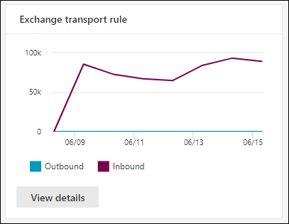

# E-mailstroomrapporten weergeven in het dashboard Rapporten in & Compliance center

[!INCLUDE [Microsoft 365 Defender rebranding](../includes/microsoft-defender-for-office.md)]

**Van toepassing op**
- [Exchange Online Protection](exchange-online-protection-overview.md)
- [Abonnement 1 en abonnement 2 voor Microsoft Defender voor Office 365](defender-for-office-365.md)
- [Microsoft 365 Defender](../defender/microsoft-365-defender.md)

Naast de e-mailstroomrapporten die  beschikbaar zijn in het e-mailstroomdashboard in het beveiligings- & compliancecentrum, zijn er diverse extra e-mailstroomrapporten beschikbaar in het dashboard Rapporten om u te helpen uw Microsoft 365-organisatie te controleren.

Als u de [benodigde machtigingen hebt,](#what-permissions-are-needed-to-view-these-reports)kunt u deze rapporten bekijken in het Beveiligings- & [compliancecentrum](https://protection.office.com) door naar **Rapportendashboard te** \> **gaan.** Als u rechtstreeks naar het dashboard Rapporten wilt gaan, opent u <https://protection.office.com/insightdashboard> .

## Connectorrapport

Het **rapport Connector toont** e-mailstroomactiviteit op de binnenkomende en uitgaande [verbindingslijnen](/Exchange/mail-flow-best-practices/use-connectors-to-configure-mail-flow/use-connectors-to-configure-mail-flow) die zijn geconfigureerd voor uw organisatie.

Als u het rapport wilt bekijken, opent u het [Beveiligings- & Compliancecentrum,](https://protection.office.com)gaat u naar  \> **Rapportendashboard** en selecteert u **Connector-rapport.** Als u rechtstreeks naar het rapport wilt gaan, opent u <https://protection.office.com/reportv2?id=ConnectorReport> .

### Rapportweergave voor het connectorrapport

De volgende grafieken zijn beschikbaar in de rapportweergave:

- **Gegevens weergeven op: E-mailstroom:** In deze grafiek ziet u het aantal binnenkomende en uitgaande berichten dat is ingedeeld op:

  - **Totaal**
  - **Van internet zonder verbindingslijn**
  - **Naar internet zonder verbindingslijn**
  - Een specifieke verbindingslijn die u hebt geconfigureerd.

  Als u de gegevens in de grafiek wilt isoleren, gebruikt u gegevens **voor** besturingselementen tonen om een van deze opties of **Alle e-mailstroom te selecteren.**

  

- **Gegevens weergeven op: TLS-gebruik:** In deze grafiek wordt het percentage TLS-versiegebruik (Transport Layer Security) voor e-mailstroom weergegeven.

  Als u de gegevens in de grafiek wilt isoleren, gebruikt u de optie Gegevens **voor besturingselementen** tonen om een van de volgende opties te selecteren:

  - **Alle e-mailstroom**
  - **Van internet zonder verbindingslijn**
  - **Naar internet zonder verbindingslijn**
  - Een specifieke verbindingslijn die u hebt geconfigureerd.

  

Als u in **een rapportweergave** op Filters klikt, kunt u een datumbereik opgeven met **Begindatum** en **Einddatum.**

### Detailtabelweergave voor het connectorrapport

Als u in **een rapportweergave op Detailstabel** weergeven klikt, worden de volgende gegevens weergegeven:

- **Datum**
- **Richting en naam van verbindingslijn**
- **Connectortype**
- **Gedwongen TLS?**: De waarde **Waar** of **Onwaar**.
- **Geen TLS** (percentage)
- **TLS 1,0** (percentage)
- **TLS 1,1** (percentage)
- **TLS 1,2** (percentage)
- **Volume:** Het aantal berichten.

Als u in een detailtabelweergave op **Filters** klikt, kunt u een datumbereik opgeven met **Begindatum** en **Einddatum.**

Als u terug wilt gaan naar de rapportweergave, klikt u op **Rapport weergeven.**

## Rapport met exchange-transportregel

Het **rapport Exchange-transportregel toont** het effect van regels voor de e-mailstroom (ook wel transportregels genoemd) op binnenkomende en uitgaande berichten in uw organisatie.

Als u het rapport wilt bekijken, opent u het [Beveiligings- & Compliancecentrum,](https://protection.office.com)gaat u naar  \> **Rapportendashboard** en **selecteert u Exchange Transport-regel**. Als u rechtstreeks naar het rapport wilt gaan, opent u <https://protection.office.com/reportv2?id=ETRRuleReport> .

### Rapportweergave voor het rapport Exchange-transportregel

De volgende grafieken zijn beschikbaar in de rapportweergave:

- **Gegevens weergeven op: Exchange-transportregels** \> **Afbreed door: Richting:** In deze grafiek  ziet u het aantal **binnenkomende** en uitgaande berichten dat is beïnvloed door transportregels.

- **Gegevens weergeven op: Exchange-transportregels** \> **Afbreed door: Ernst:** In deze  grafiek ziet u het aantal berichten met hoge ernst en gemiddelde ernst **en** berichten met een **lage ernst.** U stelt het ernstniveau in als een actie in de regel ( Controleer deze regel met **ernstniveau** of _SetAuditSeverity_). Zie Acties voor [e-mailstroomregelen in Exchange Online voor meer informatie.](//Exchange/security-and-compliance/mail-flow-rules/mail-flow-rule-actions)

- **Gegevens weergeven op: DLP Exchange-transportregels** \> **Afbreiding door: Richting:** In deze  grafiek ziet u het aantal **binnenkomende** en uitgaande berichten dat is beïnvloed door DLP-transportregels (Data Loss Prevention). U kunt de grafiek verder verfijnen door een van de volgende opties te selecteren:

  - **Gegevens voor: Alle DLP-transportregels**
  - **Gegevens voor: Gecompromitteerd gebruikers**
  - **Gegevens voor: Laag volume aan gedetecteerde Amerikaanse Patriot Act**

- **Gegevens weergeven op: DLP Exchange-transportregels** \> **Afbreiding door: Richting:** In  deze weergave ziet u  het aantal berichten met hoge ernst en gemiddelde ernst **en** berichten met een lage ernst die zijn beïnvloed door DLP-transportregels. U kunt de grafiek verder verfijnen door een van de volgende opties te selecteren:

  - **Gegevens voor: Alle DLP-transportregels**
  - **Gegevens voor: Gecompromitteerd gebruikers**
  - **Gegevens voor: Laag volume aan gedetecteerde Amerikaanse Patriot Act**

Als u in **een rapportweergave** op Filters klikt, kunt u de resultaten wijzigen met de volgende filters::

- **Begindatum** en **einddatum**
- Richtingswaarden
- Ernstwaarden

### Tabelweergave Details voor het rapport Exchange-transportregel

Als u op **Detailstabel weergeven klikt,** is de weergegeven informatie afhankelijk van de grafiek die u hebt bekeken:

- **Gegevens weergeven door: Exchange-transportregels:**

  - **Datum**
  - **Transportregel**
  - **Onderwerp**
  - **Adres afzender**
  - **Adres van geadresseerde**
  - **Ernst**
  - **Richting**

- **Gegevens weergeven op: DLP Exchange-transportregels**:

  - **Datum**
  - **DLP-beleid**
  - **Transportregel**
  - **Onderwerp**
  - **Adres afzender**
  - **Adres van geadresseerde**
  - **Ernst**
  - **Richting**

Als u in een detailtabelweergave op **Filters** klikt, kunt u de resultaten met de volgende filters wijzigen:

- **Begindatum** en **einddatum**
- Richtingswaarden
- Ernstwaarden

Als u terug wilt gaan naar de rapportweergave, klikt u op **Rapport weergeven.**

## Doorsturen van rapport

In **het rapport Doorsturen** ziet u de automatisch doorgestuurde berichten van uw organisatie naar externe domeinen vanuit Exchange Online-postvakken. Doorgestuurde berichten kunnen een beveiligings- of compliancerisico opleveren en kunnen een gekromd account aangeven.

Als u het rapport wilt bekijken, opent u  het [Beveiligings- & Compliancecentrum,](https://protection.office.com)gaat u naar \> **Rapportendashboard** en selecteert u **Rapport doorsturen.** Als u rechtstreeks naar het rapport wilt gaan, opent u <https://protection.office.com/reportv2?id=MailFlowForwarding> .

### Rapportweergave voor het rapport Doorsturen

De volgende grafieken zijn beschikbaar in de rapportweergave:

- **Gegevens voor: Doorsturen methoden**: De volgende methoden worden weergegeven:

  - **Transportregel:** ook wel [e-mailstroomregels genoemd.](/Exchange/security-and-compliance/mail-flow-rules/mail-flow-rules)
  - **Postvakregel:** Ook wel regels [voor Postvak IN genoemd.](https://support.microsoft.com/office/c24f5dea-9465-4df4-ad17-a50704d66c59)

  

- **Gegevens weergeven voor: Domeinen doorsturen:** in deze weergave ziet u de geadresseerdedomeinen die de bestemmingen zijn voor doorsturen.

  

- **Gegevens voor: Doorsturen:** De volgende doorsturen worden weergegeven:

  - **Transportregel**
  - Het postvak met de regel Postvak IN doorsturen.

  

Als u in **een rapportweergave** op Filters klikt, kunt u een datumbereik opgeven met **Begindatum** en **Einddatum.**

### Tabelweergave Details voor het rapport Doorsturen

Als u in **een rapportweergave op Detailstabel** weergeven klikt, worden de volgende gegevens weergegeven:

- **Doorst:De** waarde **Transportregel** of het postvak met de regel Postvak IN doorsturen.
- **Doorsturen:** De waarde **Regel Postvak** of **Transportregel**.
- **Naam van geadresseerde**
- **Domein geadresseerde**
- **Details:** dit is de GUID-waarde van de e-mailstroomregel of de waarde RuleIdentity van de regel Postvak IN.
- **Aantal**
- **Eerste doorgestuurde datum**

Als u in een detailtabelweergave op **Filters** klikt, kunt u een datumbereik opgeven met **Begindatum** en **Einddatum.**

Als u terug wilt gaan naar de rapportweergave, klikt u op **Rapport weergeven.**

## E-mailflowstatusrapport

Het **rapport Mailflow-status** is vergelijkbaar met het e-mailrapport Verzonden en [ontvangen,](#sent-and-received-email-report)met aanvullende informatie over e-mail die aan de rand is toegestaan of geblokkeerd. Dit is het enige rapport dat informatie over randbeveiliging bevat en laat zien hoeveel e-mail wordt geblokkeerd voordat deze wordt toegestaan in de service voor evaluatie door Exchange Online Protection (EOP). Het is belangrijk om te begrijpen dat als een bericht naar vijf geadresseerden wordt verzonden, we het als vijf verschillende berichten tellen en niet één bericht.
Als u het rapport wilt bekijken, opent u  het [beveiligingscentrum & compliancecentrum,](https://protection.office.com)gaat u naar Het dashboard Rapporten en selecteert u \>  **Mailflow-statusrapport.** Als u rechtstreeks naar het rapport **E-mailstroomstatus wilt gaan,** opent <https://protection.office.com/mailflowStatusReport> u .

### Typweergave voor het rapport Mailflow-status

Wanneer u het rapport opent, is **het tabblad Type** standaard geselecteerd. Standaard bevat deze weergave een grafiek en een gegevenstabel die is geconfigureerd met de volgende filters:

- **Datum:** De laatste 7 dagen.
- **Richting**:

  - **Binnenkomende**
  - **Uitgaande**
  - **Intra-org:** dit aantal is voor berichten binnen een tenant, dat wil zeggen afzender abc@domain.com verzendt naar geadresseerde xyz@domain.com (afzonderlijk geteld van **Binnenkomende** en **Uitgaande**)

- **Typ**:

  - **Goede e-mail**
  - **Malware**
  - **Spam**
  - **Randbeveiliging**
  - **Regelberichten**
  - **Phishing-e-mail**

De grafiek wordt ingedeeld op basis van **de waarden Type.**

U kunt deze filters wijzigen door op **Filter te klikken of** door te klikken op een waarde in de grafieklegenda.

De gegevenstabel bevat de volgende informatie:

- **Richting**
- **Type**
- **24 uur**
- **3 dagen**
- **7 dagen**
- **15 dagen**
- **30 dagen**

Als u op **Een categorie kiezen klikt voor meer informatie,** kunt u kiezen uit de volgende waarden:

- **Phishing-e-mail:** met deze selectie gaat u naar het [statusrapport Bedreigingsbeveiliging.](view-email-security-reports.md#threat-protection-status-report)
- **Malware in e-mail:** met deze selectie gaat u naar het [statusrapport Bedreigingsbeveiliging.](view-email-security-reports.md#threat-protection-status-report)
- **Spamdetecties:** Met deze selectie gaat u naar het [rapport Spamdetecties.](view-email-security-reports.md#spam-detections-report)
- **Edge geblokkeerde spam:** Met deze selectie gaat u naar het [rapport Spamdetecties.](view-email-security-reports.md#spam-detections-report)

**Exporteren**:

Voor de detailweergave kunt u slechts één dag gegevens exporteren. Dus als u gegevens 7 dagen wilt exporteren, moet u 7 verschillende exportacties uitvoeren.

Elk geëxporteerd .csv bestand is beperkt tot 150.000 rijen. Als de gegevens voor die dag meer dan 150.000 rijen bevatten, worden meerdere .csv gemaakt.

### Richtingsweergave voor het rapport Mailflow-status

Als u op het tabblad **Richting** klikt, worden dezelfde standaardfilters uit de **weergave Type** gebruikt.

De grafiek is ingedeeld op **richtingswaarden.**

U kunt deze filters wijzigen door op **Filter te klikken of** door te klikken op een waarde in de grafieklegenda. Dezelfde filters uit de **weergave Type** worden gebruikt.

De gegevenstabel bevat dezelfde informatie uit de **weergave Type.**

De **categorie Kies een categorie voor meer informatie** beschikbare selecties en gedrag zijn hetzelfde als de **weergave** Type.

**Exporteren**:

Voor de detailweergave kunt u slechts één dag gegevens exporteren. Dus als u gegevens 7 dagen wilt exporteren, moet u 7 verschillende exportacties uitvoeren.

Elk geëxporteerd .csv bestand is beperkt tot 150.000 rijen. Als de gegevens voor die dag meer dan 150.000 rijen bevatten, worden meerdere .csv gemaakt.

### Trechterweergave voor het rapport Mailflow-status

In **de trechterweergave** ziet u hoe de beveiligingsfuncties voor e-mail van Microsoft inkomende en uitgaande e-mail in uw organisatie filteren. Het bevat informatie over het totale aantal e-mailberichten en hoe de geconfigureerde beveiligingsfuncties voor bedreigingen, zoals randbeveiliging, anti-malware, anti-phishing, antispam en anti-spoofing van invloed zijn op dit aantal.

Als u op **het** tabblad Trechter klikt, bevat deze weergave standaard een grafiek en een gegevenstabel die is geconfigureerd met de volgende filters:

- **Datum:** De laatste 7 dagen.

- **Richting**:

  - **Binnenkomende**
  - **Uitgaande**
  - **Intra-org:** Dit aantal is voor berichten die binnen een tenant worden verzonden; Dat wil zeggen dat afzenders abc@domain.com naar geadresseerden xyz@domain.com (afzonderlijk geteld van Binnenkomende en Uitgaande).

De statistische weergave en gegevenstabelweergave kunnen 90 dagen worden gefilterd.

Als u op **Filteren klikt,** kunt u zowel de grafiek als de gegevenstabel filteren.

In deze grafiek ziet u het aantal e-mailberichten dat is ingedeeld op:

- **Totaal aantal e-mail**
- **E-mail na randbeveiliging**
- **E-mail na anti-malware, bestandsreputatie, bestandstypeblok**
- **E-mail na anti-phish, URL-reputatie, merkremitatie, anti-spoofing**
- **E-mail na antispam, bulkmailfilters**
- **E-mail na gebruikers- en domein-imitatie**1
- **E-mail na bestand en URL-detonatie**1
- **E-mail die is gedetecteerd als goedaardig na de beveiliging na de bezorging (URL klik op tijdbeveiliging)**

1 Defender voor Office 365 alleen

Als u het e-mailbericht wilt weergeven dat is gefilterd op EOP of Defender Office 365 afzonderlijk, klikt u op de waarde in de grafieklegenda.

De gegevenstabel bevat de volgende gegevens, weergegeven in aflopende datumvolgorde:

- **Datum**
- **Totaal aantal e-mail**
- **Randbeveiliging**
- **Anti-malware, bestandsreputatie, bestandstypeblok:**
  - **Bestandsreputatie:** Berichten die zijn gefilterd vanwege de identificatie van een bijgevoegd bestand door andere Microsoft-klanten.
  - **Bestandstypeblok:** Berichten die zijn gefilterd vanwege het type schadelijk bestand dat in het bericht is geïdentificeerd.
- **Anti-phish, URL-reputatie, merk imitatie, anti-spoof:**
  - **URL-reputatie:** Berichten die zijn gefilterd vanwege de identificatie van de URL door andere Microsoft-klanten.
  - **Merkremitatie:** berichten die zijn gefilterd vanwege het bericht dat afkomstig is van bekende merkremiterende afzenders.
  - **Anti-spoof:** Berichten die zijn gefilterd vanwege het bericht waarin wordt geprobeerd een domein te vervalsen dat de geadresseerde behoort, of een domein dat de afzender van het bericht niet bezit.
- **Antispam, bulkmailfilters:**
  - **Bulkmailfilters:** Berichten die zijn gefilterd als gevolg van een poging om bulkmail bij de geadresseerden te bezorgen.
- **Gebruikers- en domein-imitatie (Defender voor Office 365)**:
  - **Gebruikers-imitatie:** berichten die zijn gefilterd vanwege een poging om zich voor te doen als een gebruiker (afzender van een bericht) die is gedefinieerd in de instellingen voor imitatiebeveiliging van een anti-phishingbeleid.
  - **Domein imitatie:** Berichten gefilterd vanwege een poging om een domein na te bootsen dat is gedefinieerd in de instellingen voor imitatiebeveiliging van een anti-phishingbeleid.
- **Bestands- en URL-detonatie (Defender voor Office 365)**:
  - **Bestandsdetonatie:** Berichten gefilterd op een Safe bijlagenbeleid.
  - **URL-detonatie:** bericht gefilterd door een Safe koppelingenbeleid.
- **Beveiliging na aflevering en ZAP (ATP) of ZAP (EOP)**: ZAP geeft automatisch nul uur aan.

Als u een rij in de gegevenstabel selecteert, wordt een verdere uitsplitsing van de e-mailtellingen weergegeven in de flyout.

**Exporteren**:

Nadat u onder **Opties op Exporteren** hebt geklikt, kunt u een van de volgende waarden selecteren: 

- **Overzicht (met gegevens van de afgelopen 90 dagen)**
- **Details (met gegevens van de afgelopen 30 dagen ten hoogst)**

Kies **onder Datum** een bereik en klik vervolgens op **Toepassen.** Gegevens voor de huidige filters worden geëxporteerd naar een .csv bestand.

Elk geëxporteerd .csv bestand is beperkt tot 150.000 rijen. Als de gegevens meer dan 150.000 rijen bevatten, worden meerdere .csv gemaakt.

 

### Technische weergave voor het mailflowstatusrapport

De **techweergave** is vergelijkbaar met de **trechterweergave,** met meer gedetailleerde details voor de geconfigureerde functies voor bedreigingsbeveiliging. In de grafiek kunt u zien hoe berichten worden gecategoriseerd in de verschillende stadia van bedreigingsbeveiliging.

Als u op het **tabblad Technische** weergave klikt, bevat deze weergave standaard een grafiek en een gegevenstabel die is geconfigureerd met de volgende filters:

- **Datum:** De laatste 7 dagen.

- **Richting**:

  - **Binnenkomende**
  - **Uitgaande**
  - **Intra-org:** dit aantal is voor berichten binnen een tenant, dat wil zeggen afzender abc@domain.com verzenden naar geadresseerde xyz@domain.com (afzonderlijk geteld van Binnenkomende en Uitgaande)

De statistische weergave en gegevenstabelweergave kunnen 90 dagen worden gefilterd.

Als u op **Filteren klikt,** kunt u zowel de grafiek als de gegevenstabel filteren.

In deze grafiek ziet u berichten die zijn ingedeeld in de volgende categorieën:

- **Totaal aantal e-mail**
- **Rand toestaan** en **Edge gefilterd**
- **Geen malware,** **Safe detectie van bijlagen,** detectie van \* **anti-malwareprogramma's** en **regelberichten**
- **Geen phish,** **DMARC-fout,** **imitatiedetectie,** **spoofdetectie** en **Phish-detectie**
- **Geen detectie met URL-detonatie en** **URL-detonatiedetectie**\*
- **Geen spam en**  **spam**
- **Niet-schadelijke e-mail,** **Safe koppelingendetectie** \* en **ZAP**

\*Defender voor Office 365

Wanneer u de muisaanwijzer boven een categorie in de grafiek beweegt, kunt u het aantal berichten in die categorie zien.

De gegevenstabel bevat de volgende gegevens, weergegeven in aflopende datumvolgorde:

- **Datum**
- **Totaal aantal e-mail**
- **Gefilterde rand**
- **Anti-malware engine, Safe Bijlagen, regel gefilterd:**
  - **Regel gefilterd:** Berichten gefilterd vanwege regels voor e-mailstroom (ook wel transportregels genoemd).
- **DMARC, imitatie, spoof, phish gefilterd:**
  - **DMARC:** Berichten gefilterd vanwege het bericht dat de DMARC-verificatiecontrole mislukt.
- **DETECTIE VAN URL-detonatie**
- **Gefilterde antispam**
- **ZAP verwijderd**
- **Detectie door Safe koppelingen**

Als u een rij in de gegevenstabel selecteert, wordt een verdere uitsplitsing van de e-mailtellingen weergegeven in de flyout.

**Exporteren**:

Als u op **Exporteren** klikt, kunt u onder **Opties** een van de volgende waarden selecteren:

- **Overzicht (met gegevens van de afgelopen 90 dagen)**
- **Details (met gegevens van de afgelopen 30 dagen ten hoogst)**

Kies **onder Datum** een bereik en klik vervolgens op **Toepassen.** Gegevens voor de huidige filters worden geëxporteerd naar een .csv bestand.

Elk geëxporteerd .csv bestand is beperkt tot 150.000 rijen. Als de gegevens meer dan 150.000 rijen bevatten, worden meerdere .csv gemaakt.

 

## E-mailrapport verzonden en ontvangen

Het **rapport Verzonden** en ontvangen e-mail is een slim rapport met informatie over inkomende en uitgaande e-mail, waaronder spamdetecties, malware en e-mail die als 'goed' zijn geïdentificeerd. Het verschil tussen dit rapport en het [mailflowstatusrapport](#mailflow-status-report) is: dit rapport bevat geen gegevens over berichten die zijn geblokkeerd door randbeveiliging. Het is belangrijk om te begrijpen dat als een bericht naar vijf geadresseerden wordt verzonden, we het als één bericht tellen.

Met de statistische weergave en de detailweergave van het rapport kunt u 90 dagen filteren.

Als u het rapport wilt bekijken, opent u  het [Beveiligings- & Compliancecentrum,](https://protection.office.com)gaat u naar \> **Rapportendashboard** en **selecteert u Verzonden en ontvangen e-mail.** Als u rechtstreeks naar het rapport wilt gaan, opent u <https://protection.office.com/reportv2?id=SentAndReceivedMailATP> .

### Rapportweergave voor het e-mailrapport Verzonden en ontvangen

De volgende grafieken zijn beschikbaar in de rapportweergave:

- **Afbreken op: Type:** De grafiek bevat alle beschikbare categorieën:

  - **Totaal**
  - **Goede e-mail**
  - **Malware (anti-malware)** (EOP)
  - **Spamdetecties**
  - **Regelberichten**
  - **Geavanceerde malware** (Microsoft Defender voor Office 365)

  Wanneer u de muisaanwijzer boven een dag (gegevenspunt) in de grafiek beweegt, ziet u details voor die dag.

  

- **Af te breken op: Richting:** In de grafiek **worden totaal-,** **inkomende** en **uitgaande gegevens** weergegeven. Wanneer u de muisaanwijzer boven een dag (gegevenspunt) in de grafiek beweegt, ziet u details voor die dag.

  

- **Inzoomen op** \> **Malware (anti-malware)**: Met deze selectie gaat u naar het [rapport Malwaredetecties.](view-email-security-reports.md#malware-detections-report)

- **Inzoomen op** \> **Spamdetecties)**: Met deze selectie gaat u naar het [rapport Spamdetecties.](view-email-security-reports.md#spam-detections-report)

Als u in **een rapportweergave** op Filters klikt, kunt u de resultaten met de volgende filters wijzigen:

- **Begindatum** en **einddatum**
- Richtingswaarden
- Waarden typen

Als u terug wilt gaan naar de rapportweergave, klikt u op **Rapport weergeven.**

### Tabelweergave Details voor het e-mailrapport Verzonden en ontvangen

Als u in **de tabel Details weergeven** klikt **op:** Richting of Afbreken **door:** Richtingsweergave, worden de volgende gegevens weergegeven:

- **Datum (UTC)**
- **Type**
- **Richting**
- **Aantal berichten**

Als u in een detailtabelweergave op **Filters** klikt, kunt u de resultaten met de volgende filters wijzigen:

- **Begindatum** en **einddatum**
- Richtingswaarden
- Waarden typen

Als u terug wilt gaan naar de rapportweergave, klikt u op **Rapport weergeven.**

## Rapport top afzenders en geadresseerden

Het **rapport Top senders and recipients** is a pie chart showing your top email senders and recipients.

Als u het rapport wilt bekijken, opent u  het [Beveiligingscentrum & Compliancecentrum,](https://protection.office.com)gaat u naar \> **Rapportendashboard** en selecteert u **Top senders and recipients**. Als u rechtstreeks naar het rapport wilt gaan, opent u <https://protection.office.com/reportv2?id=TopSenderRecipientsATP> .

### Rapportweergave voor het rapport Top senders and recipient report

De volgende grafieken zijn beschikbaar in de rapportweergave:

- **Gegevens voor \> de belangrijkste afzenders van e-mail tonen**
- **Gegevens voor \> de belangrijkste geadresseerden van e-mail tonen**
- **Gegevens voor \> beste spamontvangers tonen**
- **Gegevens voor \> Belangrijkste ontvangers van malware** (EOP)
- **Gegevens voor \> de beste ontvangers van malware (Defender voor Office 365)**

De samenstelling van het cirkeldiagram wordt gewijzigd op basis van deze selecties.

Wanneer u de muisaanwijzer over een wig in het cirkeldiagram beweegt, ziet u een aantal verzonden of ontvangen berichten.

Als u in **een rapportweergave** op Filters klikt, kunt u een datumbereik opgeven met **Begindatum** en **Einddatum.**

### Tabelweergave Details voor het rapport Met de beste afzenders en geadresseerden

Als u op **Detailstabel weergeven klikt,** is de weergegeven informatie afhankelijk van de grafiek die u hebt bekeken:

- **Gegevens voor \> de belangrijkste afzenders van e-mail tonen**

  - **Belangrijkste afzenders van e-mail**
  - **Aantal**

- **Gegevens voor \> de belangrijkste geadresseerden van e-mail tonen**

  - **Belangrijkste geadresseerden van e-mail**
  - **Aantal**

- **Gegevens voor \> beste spamontvangers tonen**

  - **Belangrijkste geadresseerden van spam**
  - **Aantal**

- **Gegevens voor \> Belangrijkste ontvangers van malware** (EOP)

  - **Belangrijkste ontvangers van malware**
  - **Aantal**

- **Gegevens voor \> de beste ontvangers van malware (Defender voor Office 365)**

  - **Belangrijkste ontvangers van malware (Defender voor Office 365)**
  - **Aantal**

Als u in een detailtabelweergave op **Filters** klikt, kunt u een datumbereik opgeven met **Begindatum** en **Einddatum.**

Als u terug wilt gaan naar de rapportweergave, klikt u op **Rapport weergeven.**

## Welke machtigingen zijn nodig om deze rapporten weer te geven?

Als u de rapporten wilt bekijken en gebruiken die in dit artikel worden beschreven, moet u lid zijn van een van de volgende rollengroepen in het Compliancecentrum & Beveiliging:

- **Organisatiebeheer**
- **Beveiligingsbeheerder**
- **Beveiligingslezer**
- **Globale lezer**

Zie [Machtigingen in het Beveiligings- & compliancecentrum](permissions-in-the-security-and-compliance-center.md) voor meer informatie.

> [!NOTE]
> Gebruikers toevoegen aan de overeenkomstige Azure Active Directory-rol in het Microsoft 365-beheercentrum geeft gebruikers de benodigde machtigingen in het Beveiligings- en compliancecentrum _en_ machtigingen voor andere functies in Microsoft 365. Zie[Over beheerdersrollen](../../admin/add-users/about-admin-roles.md) voor meer informatie.

## Verwante onderwerpen

[Slimme rapporten en inzichten in het beveiligings- & compliancecentrum](reports-and-insights-in-security-and-compliance.md)

[Inzichten in e-mailstroom in het beveiligings- & compliancecentrum](mail-flow-insights-v2.md)

[E-mailbeveiligingsrapporten weergeven in het beveiligings- & compliancecentrum](view-email-security-reports.md)

[Rapporten weergeven voor Microsoft Defender voor Office 365](view-reports-for-mdo.md)
