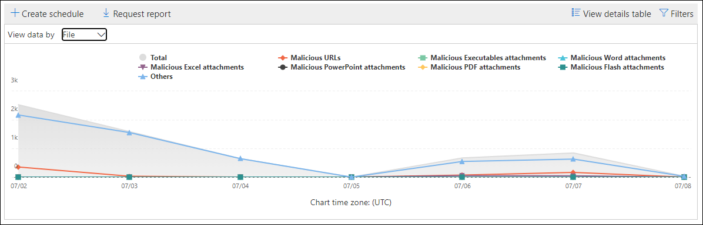
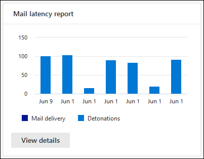
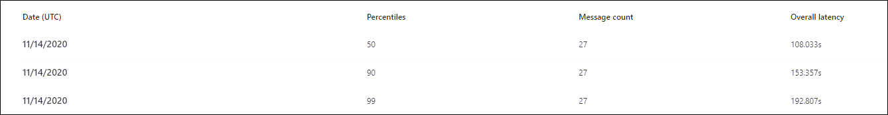
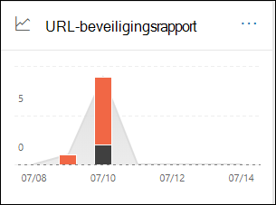

# Defender voor Office 365-rapporten weergeven in het dashboard Rapporten in & Beveiligingscentrum

[!INCLUDE [Microsoft 365 Defender rebranding](../includes/microsoft-defender-for-office.md)]

**Van toepassing op**
- [Abonnement 1 en abonnement 2 voor Microsoft Defender voor Office 365](office-365-atp.md)
- [Microsoft 365 Defender](../mtp/microsoft-threat-protection.md)

Microsoft Defender voor Office 365-organisaties (bijvoorbeeld Microsoft 365 E5-abonnementen of Microsoft Defender voor Office 365 Abonnement 1 of Microsoft Defender voor Office 365 Abonnement 2-invoegtoepassingen) bevatten diverse beveiligingsrapporten. Als u de [benodigde machtigingen hebt,](#what-permissions-are-needed-to-view-the-defender-for-office-365-reports)kunt u deze rapporten bekijken in het Beveiligings- & compliancecentrum door naar  \> **Rapportendashboard** te gaan. Als u rechtstreeks naar het dashboard Rapporten wilt gaan, opent u <https://protection.office.com/insightdashboard> .

## Rapport over bestandstypen voor Defender voor Office 365

In het rapport Bestandstypen van Defender voor **Office 365** ziet u het type bestanden dat door veilige bijlagen als schadelijk [is gedetecteerd.](atp-safe-attachments.md)

 Met de statistische weergave van het rapport kunt u 90 dagen filteren, terwijl de detailweergave slechts tien dagen filtert.

Als u het rapport wilt bekijken, opent u  het [Beveiligings- & Compliancecentrum,](https://protection.office.com)gaat u naar \> **Rapportendashboard** en selecteert u **Defender voor Office 365-bestandstypen.** Als u rechtstreeks naar het rapport wilt gaan, opent u <https://protection.office.com/reportv2?id=ATPFileReport> .

> [!NOTE]
> De informatie in dit rapport is ook beschikbaar in het [rapport Voor Office 365 van Defender voor Office 365.](#defender-for-office-365-message-disposition-report)

### Rapportweergave voor het rapport Bestandstypen van Defender voor Office 365

De volgende weergaven zijn beschikbaar:

- **Gegevens weergeven op: Bestand:** De grafiek bevat de volgende informatie:

  - **Schadelijke Excel-bijlagen**
  - **Schadelijke Flash-bijlagen**
  - **Schadelijke PDF-bijlagen**
  - **Schadelijke PowerPoint-bijlagen**
  - **Schadelijke URL's**
  - **Schadelijke Word-bijlagen**
  - **Schadelijke uitvoerbare bijlagen**
  - **Anderen**

  Wanneer u de muisaanwijzer op een bepaalde dag (gegevenspunt) beweegt,  ziet u de uitsplitsing van typen schadelijke bestanden die zijn gedetecteerd door veilige bijlagen en [anti-malwarebeveiliging in EOP.](anti-malware-protection.md)

  

  Als u op **Filters klikt,** kunt u het rapport met de volgende filters wijzigen:

  - **Begindatum** en **einddatum**
  - Dezelfde waarden van het bestandstype die zichtbaar zijn in de grafiek.

- **Gegevens weergeven op: Bericht**: De grafiek bevat de volgende informatie:

  - **Toegang blokkeren**
  - **Berichten vervangen**
  - **Berichten die worden gecontroleerd**
  - **Vervangen door Dynamische e-mailbezorging**: Zie Dynamische bezorging in beleid voor veilige bijlagen voor meer [informatie.](atp-safe-attachments.md#dynamic-delivery-in-safe-attachments-policies)

  

  Als u op **Filters klikt,** kunt u het rapport met de volgende filters wijzigen:

  - **Begindatum** en **einddatum**
  - Dezelfde waarden voor berichtafzetting die beschikbaar zijn in de grafiek en de extra **waarde berichten die zijn** doorgegeven.

### Tabelweergave details voor het rapport Bestandstypen van Defender voor Office 365

Als u op **Detailstabel weergeven klikt,** biedt het rapport een bijna-realtime weergave van alle klikken die de afgelopen tien dagen binnen de organisatie plaatsvinden. De gegevens die worden weergegeven, zijn afhankelijk van de grafiek die u hebt bekeken:

- **Gegevens weergeven op: Bestand**:

  - **Datum**
  - **Adres van geadresseerde**
  - **Adres afzender**
  - **Bericht-id:** Beschikbaar in het **veld Bericht-id** in de berichtkoptekst en moet uniek zijn. Een voorbeeldwaarde is `<08f1e0f6806a47b4ac103961109ae6ef@server.domain>` (let op de hoekhaken).
  - **Bestand**

  Als u op **Filters klikt,** kunt u het rapport met de volgende filters wijzigen:

  - **Begindatum** en **einddatum**
  - Dezelfde waarden van het bestandstype die zichtbaar zijn in de grafiek.

- **Gegevens weergeven op: Bericht**:

  - **Datum**
  - **Adres van geadresseerde**
  - **Adres afzender**
  - **Bericht-ID**
  - **Bestand**
  - **Onderwerp**

  Als u op **Filters klikt,** kunt u de resultaten wijzigen met de volgende filters:

  - **Begindatum** en **einddatum**
  - Dezelfde waarden voor berichtafzetting die beschikbaar zijn in de grafiek en de extra **waarde berichten die zijn** doorgegeven.

Als u terug wilt naar de rapportweergave, klikt u op **Rapport weergeven.**

## Rapport over berichtverwerking voor Defender voor Office 365

In **het ATP-rapport Berichtafzetting** ziet u de acties die zijn uitgevoerd voor e-mailberichten die zijn gedetecteerd als schadelijke inhoud.

Als u het rapport wilt bekijken, opent u  het [Beveiligings- & Compliancecentrum,](https://protection.office.com)gaat u naar \> **Rapportendashboard** en selecteert u **Defender voor Office 365-berichtweergave.** Als u rechtstreeks naar het rapport wilt gaan, opent u <https://protection.office.com/reportv2?id=ATPMessageReport> .

> [!NOTE]
> De informatie in dit rapport is ook beschikbaar in het rapport Bestandstypen van Defender voor [Office 365.](#defender-for-office-365-file-types-report)

### Rapportweergave voor het rapport Defender voor Office 365

De volgende weergaven zijn beschikbaar:

- **Gegevens weergeven op: Bericht**: De grafiek bevat de volgende informatie:

  - **Toegang blokkeren**
  - **Berichten vervangen**
  - **Berichten die worden gecontroleerd**
  - **Vervangen door Dynamische e-mailbezorging**: Zie Dynamische bezorging in beleid voor veilige bijlagen voor meer [informatie.](atp-safe-attachments.md#dynamic-delivery-in-safe-attachments-policies)

  

  Als u op **Filters klikt,** kunt u het rapport met de volgende filters wijzigen:

  - **Begindatum** en **einddatum**
  - Dezelfde waarden voor berichtafzetting die beschikbaar zijn in de grafiek en de extra **waarde berichten die zijn** doorgegeven.

- **Gegevens weergeven op: Bestand:** De grafiek bevat de volgende informatie:

  - **Schadelijke Excel-bijlagen**
  - **Schadelijke Flash-bijlagen**
  - **Schadelijke PDF-bijlagen**
  - **Schadelijke PowerPoint-bijlagen**
  - **Schadelijke URL's**
  - **Schadelijke Word-bijlagen**
  - **Schadelijke uitvoerbare bijlagen**
  - **Anderen**

  Wanneer u de muisaanwijzer op een bepaalde dag (gegevenspunt) beweegt,  ziet u de uitsplitsing van typen schadelijke bestanden die zijn gedetecteerd door veilige bijlagen en [anti-malwarebeveiliging in EOP.](anti-malware-protection.md)

  

  Als u op **Filters klikt,** kunt u het rapport met de volgende filters wijzigen:

  - **Begindatum** en **einddatum**
  - Dezelfde waarden van het bestandstype die zichtbaar zijn in de grafiek.

### Detailtabelweergave voor het rapport Berichtweergave defender voor Office 365

Als u op **Detailstabel weergeven klikt,** biedt het rapport een bijna-realtime weergave van alle klikken die de afgelopen tien dagen binnen de organisatie plaatsvinden. De gegevens die worden weergegeven, zijn afhankelijk van de grafiek die u hebt bekeken:

- **Gegevens weergeven op: Bericht**:

  - **Datum**
  - **Adres van geadresseerde**
  - **Adres afzender**
  - **Bericht-ID**
  - **Bestand**
  - **Onderwerp**

  Als u op **Filters klikt,** kunt u de resultaten wijzigen met de volgende filters:

  - **Begindatum** en **einddatum**
  - Dezelfde waarden voor berichtafzetting die beschikbaar zijn in de grafiek en de extra **waarde berichten die zijn** doorgegeven.

- **Gegevens weergeven op: Bestand**:

  - **Datum**
  - **Adres van geadresseerde**
  - **Adres afzender**
  - **Bericht-ID**
  - **Bestand**

  Als u op **Filters klikt,** kunt u het rapport met de volgende filters wijzigen:

  - **Begindatum** en **einddatum**
  - Dezelfde waarden van het bestandstype die zichtbaar zijn in de grafiek.

Als u terug wilt naar de rapportweergave, klikt u op **Rapport weergeven.**

## E-maillatentierapport

In **het rapport E-maillatentie** ziet u een statistische weergave van de latentie van e-mailbezorging en detonatie binnen uw organisatie. E-mailbezorgingstijden in de service worden beïnvloed door een aantal factoren en de absolute levertijd in seconden is vaak geen goede indicator voor succes of een probleem. Een trage levertijd op één dag kan worden beschouwd als een gemiddelde levertijd op een andere dag, of omgekeerd. In **het rapport E-maillatentie** wordt geprobeerd berichtbezorging te kwalificeren op basis van statistische gegevens over de waargenomen bezorgingstijden van andere berichten:

- **50e percentiel:** dit is het midden voor bezorgingstijden van berichten. U kunt deze waarde beschouwen als een gemiddelde levertijd.
- **90e percentiel:** dit geeft een hoge latentie voor berichtbezorging aan. Slechts 10% van de berichten duurde langer dan deze waarde.
- **99e percentiel:** dit geeft de hoogste latentie voor berichtbezorging aan.

Clientzijde en netwerklatentie zijn niet inbegrepen.

Als u het rapport wilt bekijken, opent u  het [beveiligingscentrum & compliancecentrum,](https://protection.office.com)gaat u naar Het dashboard Rapporten en selecteert u \>  **E-maillatentierapport.** Als u rechtstreeks naar het rapport wilt gaan, opent u <https://protection.office.com/mailLatencyReport?viewid=P50> .

### Rapportweergave voor het rapport E-maillatentie

Wanneer u het rapport opent, is het **tabblad 50e percentiel** standaard geselecteerd.

Standaard bevat deze weergave een grafiek die is geconfigureerd met de volgende filters:

- **Datum**: De laatste 7 dagen
- **Berichtweergave:**
  - Ontplofte berichten

In deze grafiek ziet u berichten die zijn ingedeeld in de volgende categorieën:

- **Latentie voor e-mailbezorging**
- **Detonatielatentie**

Wanneer u de muisaanwijzer boven een categorie in de grafiek beweegt, ziet u een uitsplitsing van de latentie in elke categorie.

Als u in de **rapportweergave** op Filter klikt, kunt u de resultaten met de volgende filters wijzigen:

- Alle berichten
- Berichten met bijlagen of URL's

Als u op het **tabblad 90e percentielen** of het **tabblad 99e percentielen** klikt, worden dezelfde standaardfilters uit de **weergave 50e percentielen** gebruikt.

### Tabelweergave Details voor het rapport E-maillatentie

De volgende informatie wordt weergegeven in de tabelweergave details:

- **Datum**
- **Percentielen**
- **Aantal berichten**
- **Algehele latentie**

In het bovenstaande ziet u dat op 14 november de gemiddelde latentie voor alle verzonden en gedetoneerde berichten **108,033 seconden** was.

De detailtabel bevat dezelfde informatie op elk tabblad.

## Statusrapport bedreigingsbeveiliging

Het rapport Status **van** bedreigingsbeveiliging is één weergave waarin informatie over schadelijke inhoud en schadelijke e-mail wordt gevonden en geblokkeerd door Exchange [Online Protection](exchange-online-protection-overview.md) (EOP) en Microsoft Defender voor Office 365. Zie Rapport [bedreigingsbeveiligingsstatus voor](view-email-security-reports.md#threat-protection-status-report)meer informatie.

## URL-bedreigingsbeveiligingsrapport

Het **rapport URL-bedreigingsbeveiliging** bevat overzichts- en trendweergaven voor gedetecteerde bedreigingen en acties die zijn ondernomen bij URL-klikken als onderdeel van [Veilige koppelingen.](atp-safe-links.md) In dit rapport worden geen klikgegevens van gebruikers geselecteerd waarbij de optie **Gebruikersklikken** niet bijhouden is geselecteerd voor het beleid voor veilige koppelingen.

Als u het rapport wilt bekijken, opent u het [Beveiligings- & Compliancecentrum,](https://protection.office.com)gaat u **naar** \> **Rapportendashboard** en selecteert u **URL-beveiligingsrapport**. Als u rechtstreeks naar het rapport wilt gaan, opent u <https://protection.office.com/reportv2?id=URLProtectionActionReport> .

> [!NOTE]
> Dit is een *beveiligingstrendrapport, wat* betekent dat gegevens trends vertegenwoordigen in een grotere gegevensset. Hierdoor zijn de gegevens in de statistische weergave hier niet in realtime beschikbaar, maar de gegevens in de detailtabelweergave zijn wel beschikbaar, zodat u mogelijk een kleine afwijking tussen de twee weergaven ziet.

### Rapportweergave voor het rapport URL-bedreigingsbeveiliging

Het **rapport URL-bedreigingsbeveiliging** heeft twee samengevoegde weergaven die eenmaal per vier uur worden vernieuwd, met gegevens voor de afgelopen 90 dagen:

- **ACTIE VOOR URL-klikbeveiliging:** geeft het aantal URL-klikken weer van gebruikers in de organisatie en de resultaten van de klik:

  - **Geblokkeerd** (de gebruiker is geblokkeerd om naar de URL te navigeren)
  - **Geblokkeerd en doorgeklikt**
  - **Doorgeklikt tijdens de scan**

  Een klik geeft aan dat de gebruiker via de blokpagina naar de schadelijke website heeft geklikt (beheerders kunnen klikken uitschakelen in beleidsregels voor veilige koppelingen).

  Als u op **Filters klikt,** kunt u het rapport met de volgende filters wijzigen:

  - **Begindatum** en **einddatum**
  - De beschikbare klikbeveiligingsacties, plus de waarde **Toegestaan** (de gebruiker mocht naar de URL navigeren).

  

- **URL klikken op toepassing:** geeft het aantal URL-klikken weer van toepassingen die veilige koppelingen ondersteunen:

  - **E-mailclient**
  - **PowerPoint**
  - **Word**
  - **Excel**
  - **OneNote**
  - **Visio**
  - **Teams**
  - **Overige**

  Als u op **Filters klikt,** kunt u het rapport met de volgende filters wijzigen:

  - **Begindatum** en **einddatum**
  - De beschikbare toepassingen.

### Gegevenstabelweergave voor het rapport URL-bedreigingsbeveiliging

Als u op **Detailstabel weergeven** klikt, biedt het rapport een bijna-realtime weergave van alle klikken die de afgelopen 7 dagen binnen de organisatie plaatsvinden met de volgende details:

- **Klik op tijd**
- **Gebruiker**
- **URL**
- **Actie**
- **App**

Als u in **de detailtabelweergave** op Filters klikt, kunt u filteren  op dezelfde  criteria als in de rapportweergave, en ook op Domeinen of Geadresseerden gescheiden door komma's.

> [!NOTE]
> Het **filter Domeinen** verwijst naar het URL-domein dat wordt vermeld in de rapportresultaten. 

Als u terug wilt naar de rapportweergave, klikt u op **Rapport weergeven.**

## Aanvullende rapporten die u wilt weergeven

Naast de rapporten die in dit artikel worden beschreven, zijn er verschillende andere rapporten beschikbaar, zoals beschreven in de volgende tabel:

****

|Rapport|Onderwerp|
|---|---|
|**Explorer** (Microsoft Defender voor Office 365-abonnement 2) of **realtime detecties** (Microsoft Defender voor Office 365-abonnement 1)|[Bedreigingsverkenner (en realtime detecties)](threat-explorer.md)|
|**E-mailbeveiligingsrapporten,** zoals het rapport Top senders and recipients, the Spoof mail report, and the Spam detections report.|[E-mailbeveiligingsrapporten weergeven in het beveiligings- & compliancecentrum](view-email-security-reports.md)|
|**E-mailstroomrapporten,** zoals het rapport Doorsturen, het rapport Mailflow-status en het rapport Top senders and recipients.|[E-mailstroomrapporten weergeven in het beveiligings- & compliancecentrum](view-mail-flow-reports.md)|
|**URL-trace voor veilige koppelingen** (alleen PowerShell). De uitvoer van deze cmdlet toont de resultaten van acties voor veilige koppelingen in de afgelopen zeven dagen.|[Get-UrlTrace](/powershell/module/exchange/get-urltrace)|
|**Resultaten van e-mailverkeer voor EOP en Microsoft Defender voor Office 365** (alleen PowerShell). De uitvoer van deze cmdlet bevat informatie over Domein, Datum, Gebeurtenistype, Richting, Actie en Aantal berichten.|[Get-MailTrafficATPReport](/powershell/module/exchange/get-mailtrafficatpreport)|
|**E-maildetailrapporten voor EOP- en Defender voor Office 365-detecties** (alleen PowerShell). De uitvoer van deze cmdlet bevat details over schadelijke bestanden of URL's, phishingpogingen, imitatie en andere potentiële bedreigingen in e-mail of bestanden.|[Get-MailDetailATPReport](/powershell/module/exchange/get-maildetailatpreport)|
|

## Welke machtigingen zijn nodig om de Defender voor Office 365-rapporten weer te geven?

Als u de rapporten wilt bekijken en gebruiken die in dit artikel worden beschreven, moet u lid zijn van een van de volgende rollengroepen in het Compliancecentrum & Beveiliging:

- **Organisatiebeheer**
- **Beveiligingsbeheerder**
- **Beveiligingslezer**
- **Algemene lezer**

Zie [Machtigingen in het Beveiligings- & compliancecentrum](permissions-in-the-security-and-compliance-center.md) voor meer informatie.

**Opmerking:** Gebruikers toevoegen aan de bijbehorende Azure Active Directory-rol in het Microsoft 365-beheercentrum biedt gebruikers de vereiste machtigingen in het Beveiligings- & _Compliancecentrum_ en machtigingen voor andere functies in Microsoft 365. Zie[Over beheerdersrollen](../../admin/add-users/about-admin-roles.md) voor meer informatie.

## Wat gebeurt er als er geen gegevens worden weergegeven in de rapporten?

Als u geen gegevens ziet in uw Defender voor Office 365-rapporten, controleert u of uw beleid correct is ingesteld. Uw organisatie moet beleidsregels  [voor veilige](set-up-atp-safe-links-policies.md) koppelingen en beleidsregels voor veilige bijlagen hebben gedefinieerd, zodat De beveiliging van Defender voor Office 365 kan worden gebruikt. Zie ook [Anti-spam en anti-malwarebeveiliging.](anti-spam-and-anti-malware-protection.md)

## Verwante onderwerpen

[Slimme rapporten en inzichten in het beveiligings- & compliancecentrum](reports-and-insights-in-security-and-compliance.md)

[Rolmachtigingen (Azure Active Directory](/azure/active-directory/users-groups-roles/directory-assign-admin-roles#role-permissions)