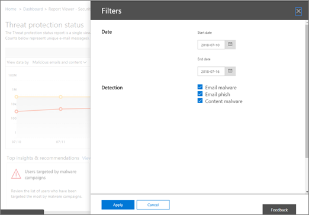

# Rapporten weergeven voor geavanceerde bedreigingsbeveiliging van Office 365

Als uw organisatie [Office 365 Advanced Threat Protection](office-365-atp.md) (ATP) heeft en u over de [benodigde machtigingen](#what-permissions-are-needed-to-view-the-atp-reports)beschikt, u verschillende ATP-rapporten gebruiken in het Security &amp; Compliance Center. (Ga naar **Dashboard** **Rapporten** \> .)
  

  
ATP-rapporten bevatten de volgende:
- [Rapport over de status van bedreigingsbescherming](#threat-protection-status-report)
- [ATP-bestandstypenrapport](#atp-file-types-report)
- [ATP Message Disposition rapport](#atp-message-disposition-report)
- [realtime detecties of Explorer](threat-explorer.md) (afhankelijk van of u Office 365 ATP-abonnement 1 of 2 hebt)
- ... [en meer](#additional-reports-to-view). 

Lees dit artikel om een overzicht te krijgen van ATP-rapporten en hoe je ze gebruiken.
  
## Rapport over de status van bedreigingsbescherming

Het rapport **Status van bedreigingsbeveiliging** is een enkele weergave die informatie over schadelijke inhoud en schadelijke e-mail samenbrengt die is gedetecteerd en geblokkeerd door [Exchange Online Protection](exchange-online-protection-overview.md) (EOP) en Office [365 ATP.](office-365-atp.md) Dit rapport is handig voor het bekijken van detecties in de loop van de tijd (tot 90 dagen) en stelt beveiligingsbeheerders in staat om trends te identificeren of te bepalen of het beleid aanpassingen nodig heeft. 

Het rapport biedt een geaggregeerd aantal unieke e-mailberichten met schadelijke inhoud, zoals bestanden of websiteadressen (URL's) die werden geblokkeerd door de anti-malware engine, [zero-hour auto purge (ZAP)](zero-hour-auto-purge.md), en ATP-functies zoals [ATP Safe Links,](atp-safe-links.md) [ATP Safe Attachments](atp-safe-attachments.md), en [ATP anti-phishing mogelijkheden](atp-anti-phishing.md). 

Filters en uitsplitsingen van de informatie zorgen voor meer gedetailleerde indelingen van de informatie in dit rapport. Specifiek, er is een 'break down by' menu opgenomen voor *E-mail > Phish* en *E-mail > Malware weergaven*. Het zal breken de gegevens in:

| |  |
|---------|---------|
|Op detectietype    | Welk beleid heeft bijgedragen aan het opvangen van deze bedreigingen?         |
|Door detectietechnologie     | Welke onderliggende Microsoft-technologie ving de dreiging?        |
|Op leveringsstatus     | Wat is er gebeurd met de e-mailberichten gedetecteerd als bedreigingen?         |
| | |

> [!TIP]
> Zowel de e-mail > Phish | Malwareweergaven hebben gedetailleerde uitsplitsingen voor de getoonde detectietechnologieën, met categorieën zoals *ATP-gegenereerde bestandsreputatie*, *Bestandsdetonatie*, *URL-ontploffing*, *Anti-spoof: DMARC-storing*, bijvoorbeeld nuttig bij het lokaliseren van precies welke functie uw organisatie ertoe bracht bedreigingen te vangen.

Deze weergaven geven u de mogelijkheid om te exporteren, via een klik op de knop (in E-> Phish, E-mail > malware en content > malwareweergaven). De geaggregeerde gegevens die naar uw computer worden geëxporteerd, kunnen worden geopend in Excel.

De overzichts- en e-mailsweergaven geven informatie weer binnen enkele uren na verwerking in plaats van binnen 24 uur (vraag opnieuw. hogere snelheden hier is een duidelijk signaal)!

> [!NOTE]
> Er is een rapport over de status van bedreigingsbeveiliging beschikbaar voor klanten die [Office 365 ATP](office-365-atp.md) of [Exchange Online Protection](exchange-online-protection-eop.md) (EOP) hebben; De informatie die wordt weergegeven in het rapport Threat Protection Status voor ATP-klanten bevat echter waarschijnlijk andere gegevens dan wat EOP-klanten kunnen zien. Het rapport Status van bedreigingsstatus voor ATP-klanten bevat bijvoorbeeld informatie over schadelijke bestanden die zijn [gedetecteerd in SharePoint Online, OneDrive of Microsoft Teams.](atp-for-spo-odb-and-teams.md) Dergelijke informatie is specifiek voor ATP, dus klanten die EOP hebben maar geen ATP, zien deze gegevens niet in hun rapport Threat Protection Status.
  
Als u het rapport Status voor bedreigingsbeveiliging wilt bekijken, gaat **Dashboard** \> u in het [Security &amp; Compliance Center](https://protection.office.com)naar De Status **bedreigingsbeveiliging** **van rapporten.** \>
  

  
Als u een gedetailleerde status voor een dag wilt krijgen, moet u de grafiek doornemen.
  

  
In het rapport Status bedreigingsbeveiliging worden standaard gegevens van de afgelopen zeven dagen weergegeven. U echter **filters** kiezen en het datumbereik wijzigen om gegevens tot 90 dagen weer te geven. (Als u een proefabonnement gebruikt, bent u mogelijk beperkt tot 30 dagen aan gegevens.)
  

  
U ook de **gegevens bekijken per** menu gebruiken om te wijzigen welke informatie in het rapport wordt weergegeven. 
  

## Statusrapport URL-beveiliging

Dit rapport is gebaseerd op verzamelde gegevens en gedetecteerde bedreigingen per klik (terwijl de meeste andere e-mailbedreigingsgerelateerde rapporten per berichtgegevens zijn). Dit rapport is ontworpen om bedreigingen weer te geven die afkomstig zijn van hyperlinks in e-mailberichten en documenten, per klik. Er zijn twee weergaven:

|  |  |
|---------|---------|
|URL klik op beveiligingsactie   | Bekijk het aantal URL's dat is geblokkeerd, geblokkeerd maar overschreven met een doorklik door een gebruiker, die is overschreven met een doorklik door een gebruiker en is toegestaan.        |
|URL klik op toepassing     | Zie de toepassing waarop op de URL is geklikt.        |
|  |  |

In de tabel met details u meer informatie zien over kliktijd en gebruikersinformatie. Houd er tot slot rekening mee dat in het rapport URL Protection Status de bescherming tegen de functie Veilige links van ATP wordt weergegeven, zodat alleen klanten die ATP Safe Links hebben ingeschakeld, gegevens in dit rapport zien.

> [!NOTE]
> Dit is een *trendrapport voor bescherming,* wat betekent dat gegevens trends in een grotere gegevensset weergeven. Rapportage is hier niet in realtime beschikbaar. Voor realtime URL-klikgegevens u URL Trace blijven gebruiken.

## ATP-bestandstypenrapport

Het **rapport ATP-bestandstypen** toont u het type bestanden dat door [ATP Safe Attachments](atp-safe-attachments.md)als kwaadaardig is gedetecteerd.
  
Ga naar **ATP-bestandstypen** **voor** \> **rapportendashboard** \> om dit rapport [ &amp; ](https://protection.office.com)weer te geven.
  

  
Wanneer u een bepaalde dag zweeft, u de uitsplitsing zien van typen schadelijke bestanden die zijn gedetecteerd door [ATP Safe Attachments](atp-safe-attachments.md) en [anti-spam &amp; anti-malware bescherming in Office 365.](anti-spam-and-anti-malware-protection.md)
  

  
## ATP Message Disposition rapport

Het **rapport ATP Message Disposition** toont u de acties die zijn uitgevoerd voor e-mailberichten die zijn gedetecteerd als met schadelijke inhoud. 
  
Ga naar Het **DASHBOARD** \> **ATP-berichtdispositie** **van rapporten** \> om dit rapport [ &amp; ](https://protection.office.com)weer te geven.
  

  
Wanneer u boven een balk in de grafiek zweeft, u zien welke acties zijn uitgevoerd voor gedetecteerde e-mail voor die dag.
  

  
## Aanvullende rapporten om te bekijken

Naast de ATP-rapporten die in dit artikel worden beschreven, zijn er nog verschillende andere rapporten beschikbaar, zoals beschreven in de volgende tabel:

|Rapport(en)  |Details  |
|---------|---------|
|**Explorer-** of **realtime detecties** (Office 365 ATP Plan 2-klanten hebben Explorer; Office 365 ATP Plan 1-klanten hebben realtime detecties.)| [Threat Explorer (en real-time detecties)](threat-explorer.md)       |
|**Beveiligingsrapporten e-mailen,** zoals een rapport met topafzenders en geadresseerden, een rapport spoofmail en een rapport voor spamdetecties. | [E-mailbeveiligingsrapporten weergeven in het Security &amp; Compliance Center](view-email-security-reports.md)        |
|**ATP Safe Links URL trace** (Dit is een rapport dat u genereert met behulp van PowerShell.) Dit rapport toont de resultaten van ATP Safe Links acties in de afgelopen zeven (7) dagen. |[Verwijzing naar get-UrlTrace-cmdlet](https://docs.microsoft.com/powershell/module/exchange/advanced-threat-protection/get-urltrace) |
|**EOP- en ATP-resultaten** (dit is een aangepast rapport dat u genereert met PowerShell). Dit rapport bevat informatie, zoals Domein, Datum, Gebeurtenistype, Richting, Actie en Aantal berichten.  | [Verwijzing naar de cmdlet van Get-MailTrafficATPReport](https://docs.microsoft.com/powershell/module/exchange/advanced-threat-protection/get-mailtrafficatpreport) |
|**EOP- en ATP-detecties** (Dit is een aangepast rapport dat u genereert met PowerShell). Dit rapport bevat details over schadelijke bestanden of URL's, phishingpogingen, imitatie en andere potentiële bedreigingen in e-mail of bestanden.   | [Verwijzing naar get-MailDetailATPReport cmdlet](https://docs.microsoft.com/powershell/module/exchange/advanced-threat-protection/get-maildetailatpreport)        |

  
## Welke machtigingen zijn nodig om de ATP-rapporten te bekijken?

Als u de in dit artikel beschreven rapporten wilt bekijken en gebruiken, moet u een geschikte rol hebben die is **toegewezen voor zowel het Security &amp; Compliance Center als het Exchange-beheercentrum.**

- Voor het &amp; Security Compliance Center moet u een van de volgende rollen hebben toegewezen:
    - Organisatiebeheer
    - Beveiligingsbeheerder (dit kan worden toegewezen in het[https://aad.portal.azure.com](https://aad.portal.azure.com)Azure Active Directory-beheercentrum ())
    - Beveiligingsoperator (dit kan worden toegewezen in het[https://aad.portal.azure.com](https://aad.portal.azure.com)Azure Active Directory-beheercentrum ())
    - Beveiligingslezer

- Voor Exchange Online moet u een van de volgende rollen[https://outlook.office365.com/ecp](https://outlook.office365.com/ecp)hebben toegewezen in het Exchange-beheercentrum ( ) of met PowerShell-cmdlets (Zie [Exchange Online PowerShell):](https://docs.microsoft.com/powershell/exchange/exchange-online/exchange-online-powershell)
    - Organisatiebeheer
    - Alleen-weergaveorganisatiebeheer
    - Alleen-weergaveontvangers rol
    - Compliance Management

Zie de volgende bronnen voor meer informatie:

- [Permissions in the Office 365 Security &amp; Compliance Center](permissions-in-the-security-and-compliance-center.md)

- [Functiemachtigingen in Exchange Online](https://docs.microsoft.com/exchange/permissions-exo/feature-permissions)
   
## Wat gebeurt er als de rapporten geen gegevens weergeven?

Als u geen gegevens ziet in uw ATP-rapporten, controleert u of uw beleid correct is ingesteld. Uw organisatie moet een [ATP Safe Links-beleid](set-up-atp-safe-links-policies.md) en [een ATP-beleid](set-up-atp-safe-attachments-policies.md) voor veilige bijlagen hebben dat is gedefinieerd om de ATP-beveiliging te kunnen invoeren. Zie ook [anti-spam- en anti-malwarebescherming in Office 365.](anti-spam-and-anti-malware-protection.md)
  
## Verwante onderwerpen

[Rapporten en inzichten in het &amp; Office 365 Security Compliance Center](reports-and-insights-in-security-and-compliance.md)
  
[Een planning maken voor een &amp; rapport in het Security Compliance Center](create-a-schedule-for-a-report.md)
  
[Een aangepast rapport instellen en &amp; downloaden in het Security Compliance Center](set-up-and-download-a-custom-report.md)

[Rolmachtigingen (Azure Active Directory](https://docs.microsoft.com/azure/active-directory/users-groups-roles/directory-assign-admin-roles#role-permissions)
  

