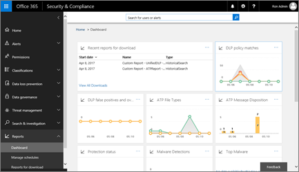
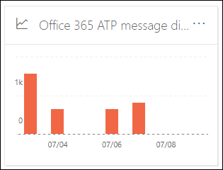

# Defender voor Office 365-rapporten weergeven in het dashboard Rapporten in het & compliancecentrumView Defender for Office 365 reports in the Reports dashboard in the Security & Compliance Center

[!INCLUDE [Microsoft 365 Defender rebranding](../includes/microsoft-defender-for-office.md)]

**Van toepassing op****Applies to**
- [Abonnement 1 en abonnement 2 voor Microsoft Defender voor Office 365Microsoft Defender for Office 365 plan 1 and plan 2](office-365-atp.md)
- [Microsoft 365 DefenderMicrosoft 365 Defender](../mtp/microsoft-threat-protection.md)

Microsoft Defender voor Office 365-organisaties (bijvoorbeeld Microsoft 365 E5-abonnementen of Microsoft Defender voor Office 365-abonnement 1 of invoegtoepassingen voor Microsoft Defender voor Office 365 Abonnement 2) bevatten diverse beveiligingsrapporten.Microsoft Defender for Office 365 organizations (for example, Microsoft 365 E5 subscriptions or Microsoft Defender for Office 365 Plan 1 or Microsoft Defender for Office 365 Plan 2 add-ons) contain a variety of security-related reports. Als u de [benodigde machtigingen hebt,](#what-permissions-are-needed-to-view-the-defender-for-office-365-reports)kunt u deze rapporten bekijken in het beveiligings- & Compliancecentrum door naar rapportendashboard **te** \> **gaan.**If you have the [necessary permissions](#what-permissions-are-needed-to-view-the-defender-for-office-365-reports), you can view these reports in the Security & Compliance Center by going to **Reports** \> **Dashboard**. Als u rechtstreeks naar het dashboard Rapporten wilt gaan, opent u <https://protection.office.com/insightdashboard> .To go directly to the Reports dashboard, open <https://protection.office.com/insightdashboard>.

## Rapport over bestandstypen voor Defender voor Office 365Defender for Office 365 file types report

In het rapport bestandstypenrapport Defender voor **Office 365** ziet u het type bestanden dat door veilige bijlagen als schadelijk [is gedetecteerd.](atp-safe-attachments.md)The **Defender for Office 365 file types report** report shows you the type of files detected as malicious by [Safe Attachments](atp-safe-attachments.md).

 In de samengevoegde weergave van het rapport kunt u 90 dagen filteren, terwijl in de detailweergave slechts tien dagen kan worden gefilterd.The aggregate view of the report allows for 90 days of filtering, while the detail view only allows for 10 days of filtering.

Als u het rapport wilt bekijken, opent u  het & [compliancecentrum,](https://protection.office.com)gaat u naar het dashboard Rapporten en selecteert u Defender voor \>  **Office 365-bestandstypen.**To view the report, open the [Security & Compliance Center](https://protection.office.com), go to **Reports** \> **Dashboard** and select **Defender for Office 365 file types**. Als u rechtstreeks naar het rapport wilt gaan, opent <https://protection.office.com/reportv2?id=ATPFileReport> u .To go directly to the report, open <https://protection.office.com/reportv2?id=ATPFileReport>.

> [!NOTE]
> De informatie in dit rapport is ook beschikbaar in het rapport voor berichtverplaatsing van Defender voor [Office 365.](#defender-for-office-365-message-disposition-report)The information in this report is also available in the [Defender for Office 365 message disposition report](#defender-for-office-365-message-disposition-report).

### Rapportweergave voor het rapport Bestandstypen van Defender voor Office 365Report view for the Defender for Office 365 file types report

De volgende weergaven zijn beschikbaar:The following views are available:

- **Gegevens weergeven met: Bestand:** de grafiek bevat de volgende informatie:**View data by: File**: The chart contains the following information:

  - **Schadelijke Excel-bijlagen****Malicious Excel attachments**
  - **Kwaadaardige Flash-bijlagen****Malicious Flash attachments**
  - **Schadelijke PDF-bijlagen****Malicious PDF attachments**
  - **Schadelijke PowerPoint-bijlagen****Malicious PowerPoint attachments**
  - **Schadelijke URL's****Malicious URLs**
  - **Schadelijke Word-bijlagen****Malicious Word attachments**
  - **Schadelijke uitvoerbare bijlagen****Malicious executable attachments**
  - **Overige****Others**

  Wanneer u de muisaanwijzer op een bepaalde dag (gegevenspunt) beweegt,  ziet u een uitsplitsing van de typen schadelijke bestanden die zijn gedetecteerd door veilige bijlagen en beveiliging tegen [malware in EOP.](anti-malware-protection.md)When you hover over a particular day (data point), you can see the breakdown of types of malicious files that were detected by [Safe Attachments](atp-safe-attachments.md) and [anti-malware protection in EOP](anti-malware-protection.md).

  

  Als u op **Filters klikt,** kunt u het rapport wijzigen met de volgende filters:If you click **Filters**, you can modify the report with the following filters:

  - **Begindatum** **en einddatum****Start date** and **End date**
  - Dezelfde bestandstypewaarden die zichtbaar zijn in de grafiek.The same file type values that are visible in the chart.

- **Gegevens weergeven met: Bericht:** de grafiek bevat de volgende informatie:**View data by: Message**: The chart contains the following information:

  - **Toegang blokkeren****Block access**
  - **Berichten vervangen****Messages replaced**
  - **Berichten bewaakt****Messages monitored**
  - **Vervangen door Dynamische bezorging van** e-mail: Zie Dynamische bezorging [in beleidsregels voor veilige bijlagen voor meer informatie.](atp-safe-attachments.md#dynamic-delivery-in-safe-attachments-policies)**Replaced by Dynamic Email Delivery**: For more information, see [Dynamic Delivery in Safe Attachments policies](atp-safe-attachments.md#dynamic-delivery-in-safe-attachments-policies).

  

  Als u op **Filters klikt,** kunt u het rapport wijzigen met de volgende filters:If you click **Filters**, you can modify the report with the following filters:

  - **Begindatum** **en einddatum****Start date** and **End date**
  - Dezelfde waarden voor berichtafzet die beschikbaar zijn in de grafiek en de extra waarde **voor de doorgegeven berichten.**The same message disposition values that are available in the chart, and the additional **Messages passed** value.

### Detailtabelweergave voor het rapport Bestandstypen van Defender voor Office 365Details table view for the Defender for Office 365 file types report

Als u op **de tabel Details weergeven** klikt, biedt het rapport een weergave in realtime van alle klikken die de afgelopen tien dagen binnen de organisatie plaatsvinden.If you click **View details table**, the report provides a near-real-time view of all clicks that happen within the organization for the last 10 days. Welke informatie wordt weergegeven, is afhankelijk van de grafiek die u hebt weergegeven:The information that's shown depends on the chart you were looking at:

- **Gegevens weergeven op: Bestand:****View data by: File**:

  - **Datum****Date**
  - **Adres van geadresseerde****Recipient address**
  - **Adres afzender****Sender address**
  - **Bericht-id:** deze is beschikbaar in het **koptekstveld Bericht-id** in de berichtkop en moet uniek zijn.**Message ID**: Available in the **Message-ID** header field in the message header and should be unique. Een voorbeeldwaarde is `<08f1e0f6806a47b4ac103961109ae6ef@server.domain>` (let op de hoekhaken).An example value is `<08f1e0f6806a47b4ac103961109ae6ef@server.domain>` (note the angle brackets).
  - **Bestand****File**

  Als u op **Filters klikt,** kunt u het rapport wijzigen met de volgende filters:If you click **Filters**, you can modify the report with the following filters:

  - **Begindatum** **en einddatum****Start date** and **End date**
  - Dezelfde bestandstypewaarden die zichtbaar zijn in de grafiek.The same file type values that are visible in the chart.

- **Gegevens weergeven op: Bericht:****View data by: Message**:

  - **Datum****Date**
  - **Adres van geadresseerde****Recipient address**
  - **Adres afzender****Sender address**
  - **Bericht-ID****Message ID**
  - **Bestand****File**
  - **Onderwerp****Subject**

  Als u op **Filters klikt,** kunt u de resultaten wijzigen met de volgende filters:If you click **Filters**, you can modify the results with the following filters:

  - **Begindatum** **en einddatum****Start date** and **End date**
  - Dezelfde waarden voor berichtafzet die beschikbaar zijn in de grafiek en de extra waarde **voor de doorgegeven berichten.**The same message disposition values that are available in the chart, and the additional **Messages passed** value.

Als u terug wilt gaan naar de rapportweergave, klikt u **op Rapport weergeven.**To get back to the reports view, click **View report**.

## Rapport over berichtverwerking voor Defender voor Office 365Defender for Office 365 message disposition report

In het rapport voor het **verwijderen van ATP-berichten** ziet u de acties die zijn uitgevoerd voor e-mailberichten die zijn vastgesteld als schadelijke inhoud.The **ATP Message Disposition** report shows you the actions that were taken for email messages that were detected as having malicious content.

Als u het rapport wilt bekijken, opent u  het beveiligings- [& compliancecentrum,](https://protection.office.com)gaat u naar het dashboard Rapporten en selecteert u Defender voor \>  Office **365-berichtverplaatsing.**To view the report, open the [Security & Compliance Center](https://protection.office.com), go to **Reports** \> **Dashboard** and select **Defender for Office 365 message disposition**. Als u rechtstreeks naar het rapport wilt gaan, opent <https://protection.office.com/reportv2?id=ATPMessageReport> u .To go directly to the report, open <https://protection.office.com/reportv2?id=ATPMessageReport>.

> [!NOTE]
> De informatie in dit rapport is ook beschikbaar in het rapport bestandstypen [Defender voor Office 365.](#defender-for-office-365-file-types-report)The information in this report is also available in the [Defender for Office 365 file types report](#defender-for-office-365-file-types-report).

### Rapportweergave voor het rapport voor berichtverplaatsing van Defender voor Office 365Report view for the Defender for Office 365 message disposition report

De volgende weergaven zijn beschikbaar:The following views are available:

- **Gegevens weergeven met: Bericht:** de grafiek bevat de volgende informatie:**View data by: Message**: The chart contains the following information:

  - **Toegang blokkeren****Block access**
  - **Berichten vervangen****Messages replaced**
  - **Berichten bewaakt****Messages monitored**
  - **Vervangen door Dynamische bezorging van** e-mail: Zie Dynamische bezorging [in beleidsregels voor veilige bijlagen voor meer informatie.](atp-safe-attachments.md#dynamic-delivery-in-safe-attachments-policies)**Replaced by Dynamic Email Delivery**: For more information, see [Dynamic Delivery in Safe Attachments policies](atp-safe-attachments.md#dynamic-delivery-in-safe-attachments-policies).

  

  Als u op **Filters klikt,** kunt u het rapport wijzigen met de volgende filters:If you click **Filters**, you can modify the report with the following filters:

  - **Begindatum** **en einddatum****Start date** and **End date**
  - Dezelfde waarden voor berichtafzet die beschikbaar zijn in de grafiek en de extra waarde **voor de doorgegeven berichten.**The same message disposition values that are available in the chart, and the additional **Messages passed** value.

- **Gegevens weergeven met: Bestand:** de grafiek bevat de volgende informatie:**View data by: File**: The chart contains the following information:

  - **Schadelijke Excel-bijlagen****Malicious Excel attachments**
  - **Kwaadaardige Flash-bijlagen****Malicious Flash attachments**
  - **Schadelijke PDF-bijlagen****Malicious PDF attachments**
  - **Schadelijke PowerPoint-bijlagen****Malicious PowerPoint attachments**
  - **Schadelijke URL's****Malicious URLs**
  - **Schadelijke Word-bijlagen****Malicious Word attachments**
  - **Schadelijke uitvoerbare bijlagen****Malicious executable attachments**
  - **Overige****Others**

  Wanneer u de muisaanwijzer op een bepaalde dag (gegevenspunt) beweegt,  ziet u een uitsplitsing van de typen schadelijke bestanden die zijn gedetecteerd door veilige bijlagen en beveiliging tegen [malware in EOP.](anti-malware-protection.md)When you hover over a particular day (data point), you can see the breakdown of types of malicious files that were detected by [Safe Attachments](atp-safe-attachments.md) and [anti-malware protection in EOP](anti-malware-protection.md).

  

  Als u op **Filters klikt,** kunt u het rapport wijzigen met de volgende filters:If you click **Filters**, you can modify the report with the following filters:

  - **Begindatum** **en einddatum****Start date** and **End date**
  - Dezelfde bestandstypewaarden die zichtbaar zijn in de grafiek.The same file type values that are visible in the chart.

### Detailtabelweergave voor het rapport voor berichtafzet van Defender voor Office 365Details table view for the Defender for Office 365 message disposition report

Als u op **de tabel Details weergeven** klikt, biedt het rapport een weergave in realtime van alle klikken die de afgelopen tien dagen binnen de organisatie plaatsvinden.If you click **View details table**, the report provides a near-real-time view of all clicks that happen within the organization for the last 10 days. Welke informatie wordt weergegeven, is afhankelijk van de grafiek die u hebt weergegeven:The information that's shown depends on the chart you were looking at:

- **Gegevens weergeven op: Bericht:****View data by: Message**:

  - **Datum****Date**
  - **Adres van geadresseerde****Recipient address**
  - **Adres afzender****Sender address**
  - **Bericht-ID****Message ID**
  - **Bestand****File**
  - **Onderwerp****Subject**

  Als u op **Filters klikt,** kunt u de resultaten wijzigen met de volgende filters:If you click **Filters**, you can modify the results with the following filters:

  - **Begindatum** **en einddatum****Start date** and **End date**
  - Dezelfde waarden voor berichtafzet die beschikbaar zijn in de grafiek en de extra waarde **voor de doorgegeven berichten.**The same message disposition values that are available in the chart, and the additional **Messages passed** value.

- **Gegevens weergeven op: Bestand:****View data by: File**:

  - **Datum****Date**
  - **Adres van geadresseerde****Recipient address**
  - **Adres afzender****Sender address**
  - **Bericht-ID****Message ID**
  - **Bestand****File**

  Als u op **Filters klikt,** kunt u het rapport wijzigen met de volgende filters:If you click **Filters**, you can modify the report with the following filters:

  - **Begindatum** **en einddatum****Start date** and **End date**
  - Dezelfde bestandstypewaarden die zichtbaar zijn in de grafiek.The same file type values that are visible in the chart.

Als u terug wilt gaan naar de rapportweergave, klikt u **op Rapport weergeven.**To get back to the reports view, click **View report**.

## E-maillatentierapportMail latency report

In **het rapport E-maillatentie** ziet u een algemene weergave van de ervaring met de bezorging en detonatie van e-mail binnen uw organisatie.The **Mail latency report** shows you an aggregate view of the mail delivery and detonation latency experienced within your organization. De bezorgingstijden van e-mail in de service worden door een aantal factoren beïnvloed en de absolute levertijd binnen enkele seconden is vaak geen goede indicator voor succes of een probleem.Mail delivery times in the service are affected by a number of factors, and the absolute delivery time in seconds is often not a good indicator of success or a problem. Een trage bezorging op een dag kan worden beschouwd als een gemiddelde levertijd op een andere dag, of omgekeerd.A slow delivery time on one day might be considered an average delivery time on another day, or vice-versa. Het **rapport E-maillatentie** probeert berichtbezorging in aanmerking te komen op basis van statistische gegevens over de waargenomen bezorgingstijden van andere berichten:The **Mail latency report** tries to qualify message delivery based on statistical data about the observed delivery times of other messages:

- **50e percentiel:** dit is het midden voor de bezorgingstijden van berichten.**50th percentile**: This is the middle for message delivery times. U kunt deze waarde beschouwen als een gemiddelde levertijd.You can consider this value as an average delivery time.
- **90e percentiel:** dit geeft een hoge latentie voor berichtbezorging aan.**90th percentile**: This indicates a high latency for message delivery. Slechts 10% van de berichten duurde langer dan deze waarde om te bezorgen.Only 10% of messages took longer than this value to deliver.
- **99e percentiel:** dit geeft de hoogste latentie voor berichtbezorging aan.**99th percentile**: This indicates the highest latency for message delivery.

Clientzijde en netwerklatentie zijn niet inbegrepen.Client side and network latency are not included.

Als u het rapport wilt bekijken, opent u het beveiligings- [& compliancecentrum,](https://protection.office.com)gaat u naar **het** dashboard Rapporten en selecteert u \>  **het E-maillatentierapport.**To view the report, open the [Security & Compliance Center](https://protection.office.com), go to **Reports** \> **Dashboard** and select **Mail latency report**. Als u rechtstreeks naar het rapport wilt gaan, opent <https://protection.office.com/mailLatencyReport?viewid=P50> u .To go directly to the report, open <https://protection.office.com/mailLatencyReport?viewid=P50>.

### Rapportweergave voor het e-maillatentierapportReport view for the Mail latency report

Wanneer u het rapport opent, wordt standaard het **tabblad 50e percentiel** geselecteerd.When you open the report, the **50th percentiles** tab is selected by default.

Deze weergave bevat standaard een grafiek die is geconfigureerd met de volgende filters:By default, this view contains a chart that's configured with the following filters:

- **Datum:** De laatste 7 dagen**Date**: The last 7 days
- **Berichtweergave:****Message View**:
  - Gedetoneerde berichtenDetonated messages

In dit diagram worden berichten weergegeven die zijn ingedeeld in de volgende categorieën:This chart shows messages organized into the following categories:

- **Latentie van e-mailbezorging****Mail delivery latency**
- **Detonatielatentie****Detonation latency**

Wanneer u de muisaanwijzer op een categorie in de grafiek beweegt, ziet u een uitsplitsing van de latentie in elke categorie.When you hover over a category in the chart, you can see a breakdown of the latency in each category.

Als u in **de rapportweergave** op Filteren klikt, kunt u de resultaten wijzigen met de volgende filters:If you click **Filter** in the report view, you can modify the results with the following filters:

- Alle berichtenAll messages
- Berichten met bijlagen of URL'sMessages that contain attachments or URLs

Als u op het tabblad **90e percentiel** of het **tabblad 99e percentiel** klikt, worden dezelfde standaardfilters uit de weergave **50e percentiel** gebruikt.If you click the **90th percentiles** tab or the **99th percentiles** tab, the same default filters from the **50th percentiles** view are used.

### Tabelweergave Details voor het rapport E-maillatentieDetails table view for the Mail latency report

De volgende informatie wordt weergegeven in de detailtabelweergave:The following information is shown in the details table view:

- **Datum****Date**
- **Percentielen****Percentiles**
- **Aantal berichten****Message count**
- **Algehele latentie****Overall latency**

Uit het bovenstaande blijkt dat op 14 november de gemiddelde latentie voor alle berichten die worden bezorgd en gedetoneerd, **108,033 seconden** was.The above shows that on November 14 the average latency experienced for all messages delivered and detonated was **108.033** seconds.

De detailtabel bevat dezelfde informatie op elk tabblad.The details table contains the same information on each tab.

## Statusrapport bedreigingsbeveiligingThreat protection status report

Het **statusrapport** Risicobeveiliging is een enkele weergave waarin informatie over schadelijke inhoud en schadelijke e-mail wordt gevonden en geblokkeerd door [Exchange Online Protection](exchange-online-protection-overview.md) (EOP) en Microsoft Defender voor Office 365.The **Threat protection status** report is a single view that brings together information about malicious content and malicious email detected and blocked by [Exchange Online Protection](exchange-online-protection-overview.md) (EOP) and Microsoft Defender for Office 365. Zie het statusrapport [Risicobeveiliging voor meer informatie.](view-email-security-reports.md#threat-protection-status-report)For more information, see [Threat protection status report](view-email-security-reports.md#threat-protection-status-report).

## Rapport URL-bedreigingsbeveiligingURL threat protection report

Het **rapport URL-bedreigingsbeveiliging** biedt overzichts- en trendweergaven voor gedetecteerde bedreigingen en acties die worden ondernomen bij klikken op URL's als onderdeel van [veilige koppelingen.](atp-safe-links.md)The **URL threat protection report** provides summary and trend views for threats detected and actions taken on URL clicks as part of [Safe Links](atp-safe-links.md). In dit rapport zijn geen klikgegevens beschikbaar van gebruikers waarop voor het beleid voor veilige koppelingen de optie **Gebruikersklikken** niet bijhouden is geselecteerd.This report will not have click data from users where the Safe Links policy applied has the **Do not track user clicks** option selected.

Als u het rapport wilt bekijken, opent u het [beveiligings- & compliancecentrum,](https://protection.office.com)gaat u naar **het** dashboard Rapporten \>  en selecteert u het **rapport URL-beveiliging.**To view the report, open the [Security & Compliance Center](https://protection.office.com), go to **Reports** \> **Dashboard** and select **URL protection report**. Als u rechtstreeks naar het rapport wilt gaan, opent <https://protection.office.com/reportv2?id=URLProtectionActionReport> u .To go directly to the report, open <https://protection.office.com/reportv2?id=URLProtectionActionReport>.

> [!NOTE]
> Dit is een *beveiligingstrendrapport,* wat betekent dat gegevens trends in een grotere gegevensset vertegenwoordigen.This is a *protection trend report*, meaning data represents trends in a larger dataset. Hierdoor zijn de gegevens in de samengevoegde weergave hier niet in realtime beschikbaar, maar de gegevens in de detailtabelweergave wel, zodat u een kleine afwijking tussen de twee weergaven kunt zien.As a result, the data in the aggregate view is not available in real time here, but the data in the details table view is, so you may see a slight discrepancy between the two views.

### Rapportweergave voor het rapport URL-bedreigingsbeveiligingReport view for the URL threat protection report

Het **rapport URL-bedreigingsbeveiliging** heeft twee samengevoegde weergaven die één keer per vier uur worden vernieuwd, met gegevens voor de afgelopen 90 dagen:The **URL threat protection** report has two aggregated views that are refreshed once every four hours that shows data for the last 90 days:

- **Actie voor het beschermen van URL's:** hier ziet u het aantal klikken op URL's door gebruikers in de organisatie en de resultaten van de klik:**URL click protection action**: Shows the number of URL clicks by users in the organization and the results of the click:

  - **Geblokkeerd** (de gebruiker is geblokkeerd voor het navigeren naar de URL)**Blocked** (the user was blocked from navigating to the URL)
  - **Geblokkeerd en geklikt door****Blocked and clicked through**
  - **Er is tijdens het scannen op geklikt****Clicked through during scan**

  Een klik geeft aan dat de gebruiker via de blokkeringspagina naar de schadelijke website heeft geklikt (beheerders kunnen klikken uitschakelen in beleidsregels voor veilige koppelingen).A click indicates that the user has clicked through the block page to the malicious website (admins can disable click through in Safe Links policies).

  Als u op **Filters klikt,** kunt u het rapport wijzigen met de volgende filters:If you click **Filters**, you can modify the report with the following filters:

  - **Begindatum** **en einddatum****Start date** and **End date**
  - De beschikbare acties voor klikbeveiliging, plus de waarde **Toegestaan** (de gebruiker mag naar de URL navigeren).The available click protection actions, plus the value **Allowed** (the user was allowed to navigate to the URL).

  

- **URL klikken per toepassing:** hier ziet u het aantal klikken op URL's van toepassingen die veilige koppelingen ondersteunen:**URL click by application**: Shows the number of URL clicks by applications that support Safe Links:

  - **E-mailclient****Email client**
  - **PowerPoint****PowerPoint**
  - **Word****Word**
  - **Excel****Excel**
  - **OneNote****OneNote**
  - **Visio****Visio**
  - **Teams****Teams**
  - **Overige****Other**

  Als u op **Filters klikt,** kunt u het rapport wijzigen met de volgende filters:If you click **Filters**, you can modify the report with the following filters:

  - **Begindatum** **en einddatum****Start date** and **End date**
  - De beschikbare toepassingen.The available applications.

### Detailtabelweergave voor het rapport URL-bedreigingsbeveiligingDetails table view for the URL threat protection report

Als u op de tabel **Details** weergeven klikt, biedt het rapport een bijna-realtime weergave van alle klikken die de afgelopen zeven dagen binnen de organisatie plaatsvinden, met de volgende details:If you click **View details table**, the report provides a near-real-time view of all clicks that happen within the organization for the last 7 days with the following details:

- **Klik op tijd****Click time**
- **Gebruiker****User**
- **URL****URL**
- **Actie****Action**
- **App****App**

Als u in **de detailtabelweergave** op Filters klikt, kunt u filteren  op dezelfde  criteria als in de rapportweergave, en ook op domeinen of geadresseerden, gescheiden door komma's.If you click **Filters** in the details table view, you can filter by the same criteria as in the report view, and also by **Domains** or **Recipients** separated by commas.

> [!NOTE]
> Het **filter Domeinen** verwijst naar het URL-domein dat wordt weergegeven in de rapportresultaten.The **Domains** filter refers to the URL domain listed in the report results. 

Als u terug wilt gaan naar de rapportweergave, klikt u **op Rapport weergeven.**To get back to the reports view, click **View report**.

## Extra rapporten om te bekijkenAdditional reports to view

Naast de rapporten die in dit artikel worden beschreven, zijn er nog verschillende andere rapporten beschikbaar, zoals wordt beschreven in de volgende tabel:In addition to the reports described in this article, several other reports are available, as described in the following table:

****

|RapportReport|OnderwerpTopic|
|---|---|
|**Verkenner** (Microsoft Defender voor Office 365-abonnement 2) of **realtime detecties** (Microsoft Defender voor Office 365-abonnement 1)**Explorer** (Microsoft Defender for Office 365 Plan 2) or **real-time detections** (Microsoft Defender for Office 365 Plan 1)|[Bedreigingsverkenner (en realtime detecties)Threat Explorer (and real-time detections)](threat-explorer.md)|
|**Beveiligingsrapporten voor** e-mail, zoals het rapport Belangrijkste afzenders en geadresseerden, het rapport Spoof-e-mail en het rapport Spamdetectie.**Email security reports**, such as the Top senders and recipients report, the Spoof mail report, and the Spam detections report.|[Beveiligingsrapporten voor e-mail weergeven in het & compliancecentrumView email security reports in the Security & Compliance Center](view-email-security-reports.md)|
|**E-mailstroomrapporten,** zoals het rapport Doorsturen, het statusrapport Mailflow en het rapport Belangrijkste afzenders en geadresseerden.**Mail flow reports**, such as the Forwarding report, the Mailflow status report, and the Top senders and recipients report.|[E-mailstroomrapporten weergeven in het & compliancecentrumView mail flow reports in the Security & Compliance Center](view-mail-flow-reports.md)|
|**URL-trace voor veilige koppelingen** (alleen PowerShell).**URL trace for Safe Links** (PowerShell only). In de uitvoer van deze cmdlet ziet u de resultaten van acties voor veilige koppelingen van de afgelopen zeven dagen.The output of this cmdlet shows you the results of Safe Links actions over the past seven days.|[Get-UrlTraceGet-UrlTrace](https://docs.microsoft.com/powershell/module/exchange/get-urltrace)|
|**Verkeersresultaten voor EOP en Microsoft Defender voor Office 365** (alleen PowerShell).**Mail traffic results for EOP and Microsoft Defender for Office 365** (PowerShell only). De uitvoer van deze cmdlet bevat informatie over domein, datum, evenementtype, richting, actie en aantal berichten.The output of this cmdlet contains information about Domain, Date, Event Type, Direction, Action, and Message Count.|[Get-MailTrafficATPReportGet-MailTrafficATPReport](https://docs.microsoft.com/powershell/module/exchange/get-mailtrafficatpreport)|
|**E-maildetailrapporten voor EOP- en Defender voor Office 365-detecties** (alleen PowerShell).**Mail detail reports for EOP and Defender for Office 365 detections** (PowerShell only). De uitvoer van deze cmdlet bevat details over schadelijke bestanden of URL's, phishingpogingen, imitatie en andere potentiële bedreigingen in e-mail of bestanden.The output of this cmdlet contains details about malicious files or URLs, phishing attempts, impersonation, and other potential threats in email or files.|[Get-MailDetailATPReportGet-MailDetailATPReport](https://docs.microsoft.com/powershell/module/exchange/get-maildetailatpreport)|
|

## Welke machtigingen zijn nodig om de Defender voor Office 365-rapporten weer te geven?What permissions are needed to view the Defender for Office 365 reports?

Als u de rapporten in dit artikel wilt bekijken en gebruiken, moet u lid zijn van een van de volgende rollengroepen in het & Compliancecentrum:In order to view and use the reports described in this article, you need to be a member of one of the following role groups in the Security & Compliance Center:

- **Organisatiebeheer****Organization Management**
- **Beveiligingsbeheerder****Security Administrator**
- **Beveiligingslezer****Security Reader**
- **Globale lezer****Global Reader**

Zie [Machtigingen in het Beveiligings- & compliancecentrum](permissions-in-the-security-and-compliance-center.md) voor meer informatie.For more information, see [Permissions in the Security & Compliance Center](permissions-in-the-security-and-compliance-center.md).

**Opmerking:** als u gebruikers toevoegt aan de bijbehorende Azure Active Directory-rol in het Microsoft 365-beheercentrum, krijgen gebruikers de vereiste machtigingen in het beveiligings- & compliancecentrum en machtigingen voor andere functies in Microsoft 365. **Note**: Adding users to the corresponding Azure Active Directory role in the Microsoft 365 admin center gives users the required permissions in the Security & Compliance Center _and_ permissions for other features in Microsoft 365. Raadpleeg [Over beheerdersrollen](../../admin/add-users/about-admin-roles.md) voor meer informatie.For more information, see [About admin roles](../../admin/add-users/about-admin-roles.md).

## Wat gebeurt er als er geen gegevens worden weergegeven in de rapporten?What if the reports aren't showing data?

Als u geen gegevens ziet in uw Defender voor Office 365-rapporten, controleert u of uw beleid correct is ingesteld.If you are not seeing data in your Defender for Office 365 reports, double-check that your policies are set up correctly. Er moeten beleidsregels voor  [veilige](set-up-atp-safe-links-policies.md) koppelingen en veilige bijlagen zijn gedefinieerd om Defender voor Office 365-beveiliging te kunnen gebruiken.Your organization must have [Safe Links policies](set-up-atp-safe-links-policies.md) and [Safe Attachments policies](set-up-atp-safe-attachments-policies.md) defined in order for Defender for Office 365 protection to be in place. Zie ook [Beveiliging tegen ongewenste e-mail en malware.](anti-spam-and-anti-malware-protection.md)Also see [Anti-spam and anti-malware protection](anti-spam-and-anti-malware-protection.md).

## Verwante onderwerpenRelated topics

[Slimme rapporten en inzichten in het beveiligings- & compliancecentrumSmart reports and insights in the Security & Compliance Center](reports-and-insights-in-security-and-compliance.md)

[Rolmachtigingen (Azure Active Directory)Role permissions (Azure Active Directory](https://docs.microsoft.com/azure/active-directory/users-groups-roles/directory-assign-admin-roles#role-permissions)
