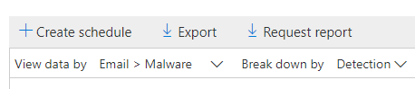

# Rapporten voor geavanceerde bedreigingsbeveiliging van Office 365 weergeven

Als uw organisatie [Office 365 Advanced Threat Protection](office-365-atp.md) (ATP) heeft en u over de [benodigde machtigingen](#what-permissions-are-needed-to-view-the-atp-reports)beschikt, u verschillende ATP-rapporten gebruiken in het Security &amp; Compliance Center. (Ga naar **Rapporten** \> **Dashboard**.)

ATP-rapporten bevatten het volgende:

- [Statusrapport risicobeveiliging](#threat-protection-status-report)
- [ATP-bestandstyperapport](#atp-file-types-report)
- [ATP-rapport over berichtverwerking](#atp-message-disposition-report)
- [real-time detecties of Explorer](threat-explorer.md) (afhankelijk van of u Office 365 ATP Plan 1 of 2 hebt)
- ... [en meer.](#additional-reports-to-view)

Lees dit artikel voor een overzicht van ATP-rapporten en hoe ze te gebruiken.

## Statusrapport risicobeveiliging

Het **rapport bedreigingsbeveiligingsstatus** is één weergave die informatie over schadelijke inhoud en schadelijke e-mail samenbrengt die is gedetecteerd en geblokkeerd door [Exchange Online Protection](exchange-online-protection-overview.md) (EOP) en Office [365 ATP](office-365-atp.md). Dit rapport is handig voor het bekijken van detecties in de loop van de tijd (tot 90 dagen) en stelt beveiligingsbeheerders in staat om trends te identificeren of te bepalen of beleid aanpassingen nodig heeft.

Het rapport biedt een geaggregeerd aantal unieke e-mailberichten met schadelijke inhoud, zoals bestanden of websiteadressen (URL's) die werden geblokkeerd door de anti-malware-engine, [zero-hour auto purge (ZAP)](zero-hour-auto-purge.md)en ATP-functies zoals [ATP Safe Links](atp-safe-links.md), [ATP Safe Attachments](atp-safe-attachments.md)en [ATP-anti-phishing](set-up-anti-phishing-policies.md).

Filters en uitsplitsingen van de informatie zorgen voor meer gedetailleerde categorisaties van de informatie in dit rapport. Specifiek, er is een 'break down by' menu opgenomen voor **E-mail** \> **Phish** en **E-mail** \> **Malware weergaven**. Het zal de gegevens opsplitsen in:

|||
|---|---|
|Op beleidstype|Welk beleid heeft geholpen deze bedreigingen op te vangen?|
|Door detectietechnologie|Welke onderliggende Microsoft-technologie ving de dreiging?|
|Door leveringsstatus|Wat was de uiteindelijke leveringsstatus van e-mailberichten die als bedreigingen werden gedetecteerd?|
|

> [!TIP]
> Zowel de e-mail > Phish | Malware weergaven hebben gedetailleerde storingen voor de detectietechnologieën getoond, met categorieën zoals *ATP-gegenereerde bestand reputatie*, *File detonation*, *URL detonation*, *Anti-spoof: DMARC mislukking*, bijvoorbeeld, nuttig bij het lokaliseren precies welke functie leidde uw organisatie om bedreigingen te vangen.

Deze weergaven geven u de mogelijkheid om te exporteren, via een knop klik (in **E-mail** \> **Phish**, **E-mail** \> **Malware**, en **Content** \> **Malware** weergaven). De geaggregeerde gegevens die naar uw computer worden geëxporteerd, kunnen worden geopend in Excel.

> [!NOTE]
> Het maximum aantal inzendingen dat kan worden geëxporteerd voor **Phish** en **Malware** is iets minder dan 10000. Als u een weergave exporteert, worden alleen de meest recente 10000 vermeldingen geëxporteerd. Op de geëxporteerde gegevens vertegenwoordigt de kolom _berichttelling_ het aantal berichten dat wordt gedetecteerd door de detectietechnologie en het beleidstype.    

De weergaven Overzicht en E-mails geven informatie weer binnen enkele uren na verwerking in plaats van in 24 uur (vraag opnieuw. hogere snelheden hier is een duidelijk signaal)!

> [!NOTE]
> Een rapport over de status van bedreigingsbescherming is beschikbaar voor klanten die [office 365 ATP](office-365-atp.md) of [Exchange Online Protection](exchange-online-protection-overview.md)(EOP) hebben; De informatie die wordt weergegeven in het rapport Bedreigingsstatus voor ATP-klanten zal echter waarschijnlijk andere gegevens bevatten dan wat EOP-klanten kunnen zien. Het rapport Bedreigingsbeveiligingsstatus voor ATP-klanten bevat bijvoorbeeld informatie over [schadelijke bestanden die zijn gedetecteerd in SharePoint Online, OneDrive of Microsoft Teams.](atp-for-spo-odb-and-teams.md) Dergelijke informatie is specifiek voor ATP, dus klanten die EOP hebben maar geen ATP zien deze gegevens niet in hun Threat Protection Status rapport.

Als u het rapport bedreigingsbeveiliging wilt bekijken, gaat u in het [Security &amp; Compliance Center](https://protection.office.com)naar De status van **Reports** \> **Dashboard** \> **bedreigingsbeveiliging**rapporten.

Als u een dag van een dag een gedetailleerde status wilt krijgen, houdt u de muisaanwijzer boven de grafiek.

Standaard worden in het rapport Bedreigingsbeveiligingsstatus gegevens van de afgelopen zeven dagen weergegeven. U filters **echter** kiezen en het datumbereik wijzigen om gegevens maximaal 90 dagen weer te geven voor de totale weergave en 30 dagen voor de detailweergave. (Als u een proefabonnement gebruikt, bent u mogelijk beperkt tot 30 dagen aan gegevens.)

U ook de **gegevens weergeven per** menu gebruiken om te wijzigen welke informatie in het rapport wordt weergegeven.

## Rapport URL-beveiligingsstatus

Dit rapport is gebaseerd op verzamelde gegevens en bedreigingen die per klik worden gedetecteerd (terwijl de meeste andere rapporten met e-mailbedreiging per bericht zijn). Dit rapport is ontworpen om bedreigingen weer te geven die afkomstig zijn van hyperlinks in e-mailberichten en documenten, per klik. Er zijn twee weergaven:

|||
|---|---|
|URL-klikbeveiligingsactie|Bekijk het aantal URL's dat door een gebruiker is geblokkeerd, geblokkeerd maar overschreven met een doorklik door een gebruiker, wordt overschreven met een doorklik door een gebruiker en is toegestaan.|
|URL klik op toepassing|Bekijk de toepassing van waaruit de URL is geklikt.|
|

In de tabel Details u meer informatie zien over kliktijd en gebruikersinformatie. Tot slot, houd er rekening mee dat het URL-beveiligingsstatusrapport de beveiligingsfunctie van ATP-apparaten weergeeft, zodat alleen klanten die ATP Safe Links hebben ingeschakeld, gegevens in dit rapport worden weergegeven.

> [!NOTE]
> Dit is een *beveiligingstrendrapport,* wat betekent dat gegevens trends in een grotere gegevensset vertegenwoordigen. Als gevolg hiervan zijn de gegevens in de geaggregeerde weergave hier niet in realtime beschikbaar, maar de gegevens in de tabelweergave details zijn, dus u een lichte discrepantie tussen de twee weergaven zien.

## ATP-bestandstyperapport

Het rapport **ATP-bestandstypen** toont u het type bestanden dat door [ATP Safe Attachments](atp-safe-attachments.md)als kwaadaardig is gedetecteerd.

Als u dit rapport wilt weergeven, gaat u in het [Security &amp; Compliance Center](https://protection.office.com)naar **ATP-bestandstypen** \> **rapportendashboard** \> **.**

  
Wanneer u gedurende een bepaalde dag zweeft, u de verdeling zien van soorten schadelijke bestanden die zijn gedetecteerd door [ATP Safe Attachments](atp-safe-attachments.md) en [anti-spam &amp; anti-malware bescherming.](anti-spam-and-anti-malware-protection.md) De totale weergave van het rapport maakt het mogelijk om 90 dagen te filteren, terwijl de detailweergave slechts tien dagen filtering mogelijk maakt. 
  

## ATP-rapport over berichtverwerking

Het **ATP-bericht dispositie** rapport toont u de acties die zijn genomen voor e-mailberichten die zijn gedetecteerd als met kwaadaardige inhoud.

Als u dit rapport wilt weergeven, gaat u in het [Security &amp; Compliance Center](https://protection.office.com)naar De **Reports** \> **Dashboard** \> **atp-berichtweergave**van rapportendashboard .

Wanneer u boven een balk in de grafiek zweeft, u zien welke acties zijn uitgevoerd voor gedetecteerde e-mail voor die dag.

## Aanvullende rapporten om weer te geven

Naast de ATP-rapporten die in dit artikel worden beschreven, zijn er nog verschillende rapporten beschikbaar, zoals beschreven in de volgende tabel:

|||
|---|---|
|**Rapport(en)**|**Details**|
|**Explorer-** of realtime detecties :(Office 365 ATP Plan **2-klanten**hebben Explorer; Office 365 ATP Plan 1-klanten hebben realtime detecties.)|[Bedreigingsverkenner (en realtime detecties)](threat-explorer.md)|
|**E-mailbeveiligingsrapporten,** zoals een rapport Over afzenders en geadresseerden, een spoofberichtrapport en een rapport over spamdetecties.|[E-mailbeveiligingsrapporten weergeven in het Security &amp; Compliance Center](view-email-security-reports.md)|
|**URL-tracering van ATP Safe**Links:(Dit is een rapport dat u genereert met PowerShell.) Dit rapport toont de resultaten van ATP Safe Links acties in de afgelopen zeven (7) dagen.|[Verwijzing naar Get-UrlTrace-cmdlet](https://docs.microsoft.com/powershell/module/exchange/get-urltrace)|
|**EOP- en ATP-resultaten**: (Dit is een aangepast rapport dat u genereert met PowerShell). Dit rapport bevat informatie, zoals Domein, Datum, Gebeurtenistype, Richting, Actie en Aantal berichten.|[Get-MailTrafficATPReport cmdlet referentie](https://docs.microsoft.com/powershell/module/exchange/get-mailtrafficatpreport)|
|**EOP- en ATP-detecties**: (Dit is een aangepast rapport dat u genereert met PowerShell). Dit rapport bevat details over schadelijke bestanden of URL's, phishing-pogingen, imitatie en andere potentiële bedreigingen in e-mail of bestanden.|[Get-MailDetailATPReport cmdlet referentie](https://docs.microsoft.com/powershell/module/exchange/get-maildetailatpreport)|
|

## Welke machtigingen zijn nodig om de ATP-rapporten weer te geven?

Als u de in dit artikel beschreven rapporten wilt weergeven en gebruiken, **moet u een passende rol hebben toegewezen voor zowel het Security Compliance Center als het &amp; Exchange-beheercentrum.**

- Voor het Security &amp; Compliance Center moet u een van de volgende rollen toegewezen hebben:

  - Organisatiebeheer
  - Beveiligingsbeheerder (dit kan worden toegewezen in het Azure Active Directory-beheercentrum ( [https://aad.portal.azure.com](https://aad.portal.azure.com) ))
  - Beveiligingsoperator (dit kan worden toegewezen in het Azure Active Directory-beheercentrum ( [https://aad.portal.azure.com](https://aad.portal.azure.com) ))
  - Beveiligingslezer

- Voor Exchange Online moet u een van de volgende rollen hebben toegewezen in het Exchange-beheercentrum ( [https://outlook.office365.com/ecp](https://outlook.office365.com/ecp) ) of met PowerShell-cmdlets (Zie [Exchange Online PowerShell):](https://docs.microsoft.com/powershell/exchange/exchange-online-powershell)

  - Organisatiebeheer
  - Alleen-weergeven organisatiebeheer
  - Rol alleen weergeven ontvangers
  - Compliance Management

Zie de volgende bronnen voor meer informatie:

- [Machtigingen in het Security &amp; Compliance Center](permissions-in-the-security-and-compliance-center.md)

- [Functiemachtigingen in Exchange Online](https://docs.microsoft.com/exchange/permissions-exo/feature-permissions)

## Wat als de rapporten geen gegevens weergeven?

Als u geen gegevens ziet in uw ATP-rapporten, controleert u dubbel of uw beleid correct is ingesteld. Uw organisatie moet [atp-beleid voor veilige koppelingen](set-up-atp-safe-links-policies.md) en [atp-veilige bijlagen hebben](set-up-atp-safe-attachments-policies.md) gedefinieerd om atp-beveiliging op zijn plaats te krijgen. Zie ook [anti-spam en anti-malware bescherming in Office 365](anti-spam-and-anti-malware-protection.md).

## Verwante onderwerpen

[Rapporten en inzichten in het Security &amp; Compliance Center](reports-and-insights-in-security-and-compliance.md)
  
[Rolmachtigingen (Azure Active Directory](https://docs.microsoft.com/azure/active-directory/users-groups-roles/directory-assign-admin-roles#role-permissions)
