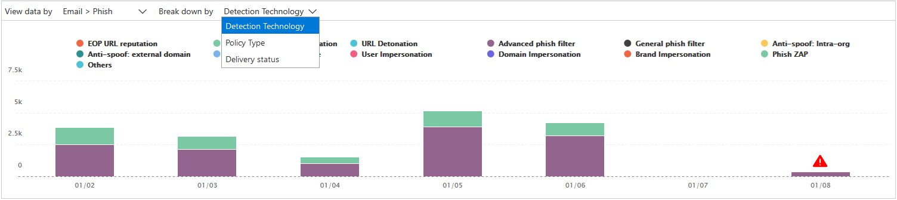

# Rapporten voor geavanceerde bedreigingsbeveiliging van Office 365 weergevenView reports for Office 365 Advanced Threat Protection

Als uw organisatie [Office 365 Advanced Threat Protection](office-365-atp.md) (ATP) heeft en u over de [benodigde machtigingen](#what-permissions-are-needed-to-view-the-atp-reports)beschikt, u verschillende ATP-rapporten gebruiken in het Security &amp; Compliance Center.If your organization has [Office 365 Advanced Threat Protection](office-365-atp.md) (ATP) and you have the [necessary permissions](#what-permissions-are-needed-to-view-the-atp-reports), you can use several ATP reports in the Security &amp; Compliance Center. (Ga naar **Rapporten** \> **Dashboard**.)(Go to **Reports** \> **Dashboard**.)

ATP-rapporten bevatten het volgende:ATP reports include the following:

- [Statusrapport risicobeveiligingThreat Protection Status report](#threat-protection-status-report)
- [ATP-bestandstyperapportATP File Types report](#atp-file-types-report)
- [ATP-rapport over berichtverwerkingATP Message Disposition report](#atp-message-disposition-report)
- [real-time detecties of Explorer](threat-explorer.md) (afhankelijk van of u Office 365 ATP Plan 1 of 2 hebt)either [real-time detections or Explorer](threat-explorer.md) (depending on whether you have Office 365 ATP Plan 1 or 2)
- ... [en meer.](#additional-reports-to-view)... [and more](#additional-reports-to-view).

Lees dit artikel voor een overzicht van ATP-rapporten en hoe ze te gebruiken.Read this article to get an overview of ATP reports and how to use them.

## Statusrapport risicobeveiligingThreat Protection Status report

Het **rapport bedreigingsbeveiligingsstatus** is één weergave die informatie over schadelijke inhoud en schadelijke e-mail samenbrengt die is gedetecteerd en geblokkeerd door [Exchange Online Protection](exchange-online-protection-overview.md) (EOP) en Office [365 ATP](office-365-atp.md).The **Threat Protection Status** report is a single view that brings together information about malicious content and malicious email detected and blocked by [Exchange Online Protection](exchange-online-protection-overview.md) (EOP) and [Office 365 ATP](office-365-atp.md). Dit rapport is handig voor het bekijken van detecties in de loop van de tijd (tot 90 dagen) en stelt beveiligingsbeheerders in staat om trends te identificeren of te bepalen of beleid aanpassingen nodig heeft.This report is useful for viewing detections over time (up to 90 days), and it enables security administrators to identify trends or determine whether policies need adjustments.

Het rapport biedt een geaggregeerd aantal unieke e-mailberichten met schadelijke inhoud, zoals bestanden of websiteadressen (URL's) die werden geblokkeerd door de anti-malware-engine, [zero-hour auto purge (ZAP)](zero-hour-auto-purge.md)en ATP-functies zoals [ATP Safe Links](atp-safe-links.md), [ATP Safe Attachments](atp-safe-attachments.md)en [ATP-anti-phishing](set-up-anti-phishing-policies.md).The report provides an aggregated count of unique email messages with malicious content, such as files or website addresses (URLs) that were blocked by the anti-malware engine, [zero-hour auto purge (ZAP)](zero-hour-auto-purge.md), and ATP features like [ATP Safe Links](atp-safe-links.md), [ATP Safe Attachments](atp-safe-attachments.md), and [ATP anti-phishing](set-up-anti-phishing-policies.md).

Filters en uitsplitsingen van de informatie zorgen voor meer gedetailleerde categorisaties van de informatie in dit rapport.Filters and breakdowns of the information allow for more granular categorizations of the information in this report. Specifiek, er is een 'break down by' menu opgenomen voor **E-mail** \> **Phish** en **E-mail** \> **Malware weergaven**.Specifically, there is a 'break down by' menu included for **Email** \> **Phish** and **Email** \> **Malware views**. Het zal de gegevens opsplitsen in:It will break down the data into:

|||
|---|---|
|Op beleidstypeBy policy type|Welk beleid heeft geholpen deze bedreigingen op te vangen?What policy helped catch these threats?|
|Door detectietechnologieBy detection technology|Welke onderliggende Microsoft-technologie ving de dreiging?What underlying Microsoft technology caught the threat?|
|Door leveringsstatusBy delivery status|Wat was de uiteindelijke leveringsstatus van e-mailberichten die als bedreigingen werden gedetecteerd?What was the final delivery status of email messages detected as threats?|
|

> [!TIP]
> Zowel de e-mail > Phish | Malware weergaven hebben gedetailleerde storingen voor de detectietechnologieën getoond, met categorieën zoals *ATP-gegenereerde bestand reputatie*, *File detonation*, *URL detonation*, *Anti-spoof: DMARC mislukking*, bijvoorbeeld, nuttig bij het lokaliseren precies welke functie leidde uw organisatie om bedreigingen te vangen.Both the Email > Phish | Malware views have granular breakdowns for the detection technologies shown, with categories like *ATP-generated file reputation*, *File detonation*, *URL detonation*, *Anti-spoof: DMARC failure*, for example, helpful in pinpointing exactly which feature led your organization to catch threats.

Deze weergaven geven u de mogelijkheid om te exporteren, via een knop klik (in **E-mail** \> **Phish**, **E-mail** \> **Malware**, en **Content** \> **Malware** weergaven).These views give you the option to export, via a button click (in **Email** \> **Phish**, **Email** \> **Malware**, and **Content** \> **Malware** views). De geaggregeerde gegevens die naar uw computer worden geëxporteerd, kunnen worden geopend in Excel.The aggregated data exported to your computer can be opened in Excel.

> [!NOTE]
> Het maximum aantal inzendingen dat kan worden geëxporteerd voor **Phish** en **Malware** is iets minder dan 10000.The maximum number of entries that can be exported for **Phish** and **Malware** is just under 10000. Als u een weergave exporteert, worden alleen de meest recente 10000 vermeldingen geëxporteerd.If you export a view, only the most recent 10000 entries are exported. Op de geëxporteerde gegevens vertegenwoordigt de kolom _berichttelling_ het aantal berichten dat wordt gedetecteerd door de detectietechnologie en het beleidstype.On the exported data, the _message count_ column represents the number of messages detected by the detection technology and policy type.    

De weergaven Overzicht en E-mails geven informatie weer binnen enkele uren na verwerking in plaats van in 24 uur (vraag opnieuw.The Overview and Emails views will display information within hours of processing rather than in 24 hours (demand re. hogere snelheden hier is een duidelijk signaal)!increased speeds here has been a clear signal)!

> [!NOTE]
> Een rapport over de status van bedreigingsbescherming is beschikbaar voor klanten die [office 365 ATP](office-365-atp.md) of [Exchange Online Protection](exchange-online-protection-overview.md)(EOP) hebben; De informatie die wordt weergegeven in het rapport Bedreigingsstatus voor ATP-klanten zal echter waarschijnlijk andere gegevens bevatten dan wat EOP-klanten kunnen zien.A Threat Protection Status report is available to customers who have either [Office 365 ATP](office-365-atp.md) or [Exchange Online Protection](exchange-online-protection-overview.md)) (EOP); however, the information that is displayed in the Threat Protection Status report for ATP customers will likely contain different data than what EOP customers might see. Het rapport Bedreigingsbeveiligingsstatus voor ATP-klanten bevat bijvoorbeeld informatie over [schadelijke bestanden die zijn gedetecteerd in SharePoint Online, OneDrive of Microsoft Teams.](atp-for-spo-odb-and-teams.md)For example, the Threat Protection Status report for ATP customers will contain information about [malicious files detected in SharePoint Online, OneDrive, or Microsoft Teams](atp-for-spo-odb-and-teams.md). Dergelijke informatie is specifiek voor ATP, dus klanten die EOP hebben maar geen ATP zien deze gegevens niet in hun Threat Protection Status rapport.Such information is specific to ATP, so customers who have EOP but not ATP will not see those details in their Threat Protection Status report.

Als u het rapport bedreigingsbeveiliging wilt bekijken, gaat u in het [Security &amp; Compliance Center](https://protection.office.com)naar De status van **Reports** \> **Dashboard** \> **bedreigingsbeveiliging**rapporten.To view the Threat Protection Status report, in the [Security &amp; Compliance Center](https://protection.office.com), go to **Reports** \> **Dashboard** \> **Threat Protection Status**.

Als u een dag van een dag een gedetailleerde status wilt krijgen, houdt u de muisaanwijzer boven de grafiek.To get detailed status for a day, hover over the graph.

Standaard worden in het rapport Bedreigingsbeveiligingsstatus gegevens van de afgelopen zeven dagen weergegeven.By default, the Threat Protection Status report shows data for the past seven days. U filters **echter** kiezen en het datumbereik wijzigen om gegevens maximaal 90 dagen weer te geven voor de totale weergave en 30 dagen voor de detailweergave.However, you can choose **Filters** and change the date range to view data for up to 90 days for the aggregate view and 30 days for the detail view. (Als u een proefabonnement gebruikt, bent u mogelijk beperkt tot 30 dagen aan gegevens.)(If you are using a trial subscription, you might be limited to 30 days' of data.)

U ook de **gegevens weergeven per** menu gebruiken om te wijzigen welke informatie in het rapport wordt weergegeven.You can also use the **View data by** menu to change what information is displayed in the report.

## Rapport URL-beveiligingsstatusURL Protection Status report

Dit rapport is gebaseerd op verzamelde gegevens en bedreigingen die per klik worden gedetecteerd (terwijl de meeste andere rapporten met e-mailbedreiging per bericht zijn).This report is based data collected, and threats detected, per click (whereas most other email threat related reports are per message data). Dit rapport is ontworpen om bedreigingen weer te geven die afkomstig zijn van hyperlinks in e-mailberichten en documenten, per klik.This report is designed to show threats that come from hyperlinks in email messages and documents, per click. Er zijn twee weergaven:There are two views:

|||
|---|---|
|URL-klikbeveiligingsactieURL click protection action|Bekijk het aantal URL's dat door een gebruiker is geblokkeerd, geblokkeerd maar overschreven met een doorklik door een gebruiker, wordt overschreven met een doorklik door een gebruiker en is toegestaan.See the number of URLs blocked, blocked but overridden with a click-through by a user, overridden with a click-through by a user, and allowed.|
|URL klik op toepassingURL click by application|Bekijk de toepassing van waaruit de URL is geklikt.See the application from which the URL was clicked.|
|

In de tabel Details u meer informatie zien over kliktijd en gebruikersinformatie.In the details table, you'll be able to see more information regarding click time and user information. Tot slot, houd er rekening mee dat het URL-beveiligingsstatusrapport de beveiligingsfunctie van ATP-apparaten weergeeft, zodat alleen klanten die ATP Safe Links hebben ingeschakeld, gegevens in dit rapport worden weergegeven.Finally, keep in mind the URL Protection Status report shows the protection from ATP Safe Links feature, so only customers who have enabled ATP Safe Links will see data reflected on this report.

> [!NOTE]
> Dit is een *beveiligingstrendrapport,* wat betekent dat gegevens trends in een grotere gegevensset vertegenwoordigen.This is a *protection trend report*, meaning data represents trends in a larger dataset. Als gevolg hiervan zijn de gegevens in de geaggregeerde weergave hier niet in realtime beschikbaar, maar de gegevens in de tabelweergave details zijn, dus u een lichte discrepantie tussen de twee weergaven zien.As a result, the data in the aggregate view is not available in real time here, but the data in the details table view is, so you may see a slight discrepancy between the two views.

## ATP-bestandstyperapportATP File Types report

Het rapport **ATP-bestandstypen** toont u het type bestanden dat door [ATP Safe Attachments](atp-safe-attachments.md)als kwaadaardig is gedetecteerd.The **ATP File Types** report shows you the type of files detected as malicious by [ATP Safe Attachments](atp-safe-attachments.md).

Als u dit rapport wilt weergeven, gaat u in het [Security &amp; Compliance Center](https://protection.office.com)naar **ATP-bestandstypen** \> **rapportendashboard** \> **.**To view this report, in the [Security &amp; Compliance Center](https://protection.office.com), go to **Reports** \> **Dashboard** \> **ATP File Types**.

  
Wanneer u gedurende een bepaalde dag zweeft, u de verdeling zien van soorten schadelijke bestanden die zijn gedetecteerd door [ATP Safe Attachments](atp-safe-attachments.md) en [anti-spam &amp; anti-malware bescherming.](anti-spam-and-anti-malware-protection.md)When you hover over a particular day, you can see the breakdown of types of malicious files that were detected by [ATP Safe Attachments](atp-safe-attachments.md) and [anti-spam &amp; anti-malware protection](anti-spam-and-anti-malware-protection.md). De totale weergave van het rapport maakt het mogelijk om 90 dagen te filteren, terwijl de detailweergave slechts tien dagen filtering mogelijk maakt.The aggregate view of the report allows for 90 days of filtering, while the detail view only allows for ten days of filtering. 
  

## ATP-rapport over berichtverwerkingATP Message Disposition report

Het **ATP-bericht dispositie** rapport toont u de acties die zijn genomen voor e-mailberichten die zijn gedetecteerd als met kwaadaardige inhoud.The **ATP Message Disposition** report shows you the actions that were taken for email messages that were detected as having malicious content.

Als u dit rapport wilt weergeven, gaat u in het [Security &amp; Compliance Center](https://protection.office.com)naar De **Reports** \> **Dashboard** \> **atp-berichtweergave**van rapportendashboard .To view this report, in the [Security &amp; Compliance Center](https://protection.office.com), go to **Reports** \> **Dashboard** \> **ATP Message Disposition**.

Wanneer u boven een balk in de grafiek zweeft, u zien welke acties zijn uitgevoerd voor gedetecteerde e-mail voor die dag.When you hover over a bar in the chart, you can see what actions were taken for detected email for that day.

## Aanvullende rapporten om weer te gevenAdditional reports to view

Naast de ATP-rapporten die in dit artikel worden beschreven, zijn er nog verschillende rapporten beschikbaar, zoals beschreven in de volgende tabel:In addition to the ATP reports described in this article, several other reports are available, as described in the following table:

|||
|---|---|
|**Rapport(en)****Report(s)**|**Details****Details**|
|**Explorer-** of realtime detecties :(Office 365 ATP Plan **2-klanten**hebben Explorer; Office 365 ATP Plan 1-klanten hebben realtime detecties.)**Explorer** or **real-time detections**: (Office 365 ATP Plan 2 customers have Explorer; Office 365 ATP Plan 1 customers have real-time detections.)|[Bedreigingsverkenner (en realtime detecties)Threat Explorer (and real-time detections)](threat-explorer.md)|
|**E-mailbeveiligingsrapporten,** zoals een rapport Over afzenders en geadresseerden, een spoofberichtrapport en een rapport over spamdetecties.**Email security reports**, such as a Top Senders and Recipients report, a Spoof Mail report, and a Spam Detections report.|[E-mailbeveiligingsrapporten weergeven in het Security &amp; Compliance CenterView email security reports in the Security &amp; Compliance Center](view-email-security-reports.md)|
|**URL-tracering van ATP Safe**Links:(Dit is een rapport dat u genereert met PowerShell.) Dit rapport toont de resultaten van ATP Safe Links acties in de afgelopen zeven (7) dagen.**ATP Safe Links URL trace**: (This is a report you generate by using PowerShell.) This report shows the results of ATP Safe Links actions over the past seven (7) days.|[Verwijzing naar Get-UrlTrace-cmdletGet-UrlTrace cmdlet reference](https://docs.microsoft.com/powershell/module/exchange/get-urltrace)|
|**EOP- en ATP-resultaten**: (Dit is een aangepast rapport dat u genereert met PowerShell).**EOP and ATP results**: (This is a custom report you generate by using PowerShell). Dit rapport bevat informatie, zoals Domein, Datum, Gebeurtenistype, Richting, Actie en Aantal berichten.This report contains information, such as Domain, Date, Event Type, Direction, Action, and Message Count.|[Get-MailTrafficATPReport cmdlet referentieGet-MailTrafficATPReport cmdlet reference](https://docs.microsoft.com/powershell/module/exchange/get-mailtrafficatpreport)|
|**EOP- en ATP-detecties**: (Dit is een aangepast rapport dat u genereert met PowerShell).**EOP and ATP detections**: (This is a custom report you generate by using PowerShell). Dit rapport bevat details over schadelijke bestanden of URL's, phishing-pogingen, imitatie en andere potentiële bedreigingen in e-mail of bestanden.This report contains details about malicious files or URLs, phishing attempts, impersonation, and other potential threats in email or files.|[Get-MailDetailATPReport cmdlet referentieGet-MailDetailATPReport cmdlet reference](https://docs.microsoft.com/powershell/module/exchange/get-maildetailatpreport)|
|

## Welke machtigingen zijn nodig om de ATP-rapporten weer te geven?What permissions are needed to view the ATP reports?

Als u de in dit artikel beschreven rapporten wilt weergeven en gebruiken, **moet u een passende rol hebben toegewezen voor zowel het Security Compliance Center als het &amp; Exchange-beheercentrum.**In order to view and use the reports described in this article, **you must have an appropriate role assigned for both the Security &amp; Compliance Center and the Exchange admin center**.

- Voor het Security &amp; Compliance Center moet u een van de volgende rollen toegewezen hebben:For the Security &amp; Compliance Center, you must have one of the following roles assigned:

  - OrganisatiebeheerOrganization Management
  - Beveiligingsbeheerder (dit kan worden toegewezen in het Azure Active Directory-beheercentrum ( [https://aad.portal.azure.com](https://aad.portal.azure.com) ))Security Administrator (this can be assigned in the Azure Active Directory admin center ([https://aad.portal.azure.com](https://aad.portal.azure.com)))
  - Beveiligingsoperator (dit kan worden toegewezen in het Azure Active Directory-beheercentrum ( [https://aad.portal.azure.com](https://aad.portal.azure.com) ))Security Operator (this can be assigned in the Azure Active Directory admin center ([https://aad.portal.azure.com](https://aad.portal.azure.com)))
  - BeveiligingslezerSecurity Reader

- Voor Exchange Online moet u een van de volgende rollen hebben toegewezen in het Exchange-beheercentrum ( [https://outlook.office365.com/ecp](https://outlook.office365.com/ecp) ) of met PowerShell-cmdlets (Zie [Exchange Online PowerShell):](https://docs.microsoft.com/powershell/exchange/exchange-online-powershell)For Exchange Online, you must have one of the following roles assigned in either the Exchange admin center ([https://outlook.office365.com/ecp](https://outlook.office365.com/ecp)) or with PowerShell cmdlets (See [Exchange Online PowerShell](https://docs.microsoft.com/powershell/exchange/exchange-online-powershell)):

  - OrganisatiebeheerOrganization Management
  - Alleen-weergeven organisatiebeheerView-only Organization Management
  - Rol alleen weergeven ontvangersView-Only Recipients role
  - Compliance ManagementCompliance Management

Zie de volgende bronnen voor meer informatie:To learn more, see the following resources:

- [Machtigingen in het Security &amp; Compliance CenterPermissions in the Security &amp; Compliance Center](permissions-in-the-security-and-compliance-center.md)

- [Functiemachtigingen in Exchange OnlineFeature permissions in Exchange Online](https://docs.microsoft.com/exchange/permissions-exo/feature-permissions)

## Wat als de rapporten geen gegevens weergeven?What if the reports aren't showing data?

Als u geen gegevens ziet in uw ATP-rapporten, controleert u dubbel of uw beleid correct is ingesteld.If you are not seeing data in your ATP reports, double-check that your policies are set up correctly. Uw organisatie moet [atp-beleid voor veilige koppelingen](set-up-atp-safe-links-policies.md) en [atp-veilige bijlagen hebben](set-up-atp-safe-attachments-policies.md) gedefinieerd om atp-beveiliging op zijn plaats te krijgen.Your organization must have [ATP Safe Links policies](set-up-atp-safe-links-policies.md) and [ATP Safe Attachments policies](set-up-atp-safe-attachments-policies.md) defined in order for ATP protection to be in place. Zie ook [anti-spam en anti-malware bescherming in Office 365](anti-spam-and-anti-malware-protection.md).Also see [Anti-spam and anti-malware protection in Office 365](anti-spam-and-anti-malware-protection.md).

## Verwante onderwerpenRelated topics

[Rapporten en inzichten in het Security &amp; Compliance CenterReports and insights in the Security &amp; Compliance Center](reports-and-insights-in-security-and-compliance.md)
  
[Rolmachtigingen (Azure Active DirectoryRole permissions (Azure Active Directory](https://docs.microsoft.com/azure/active-directory/users-groups-roles/directory-assign-admin-roles#role-permissions)
