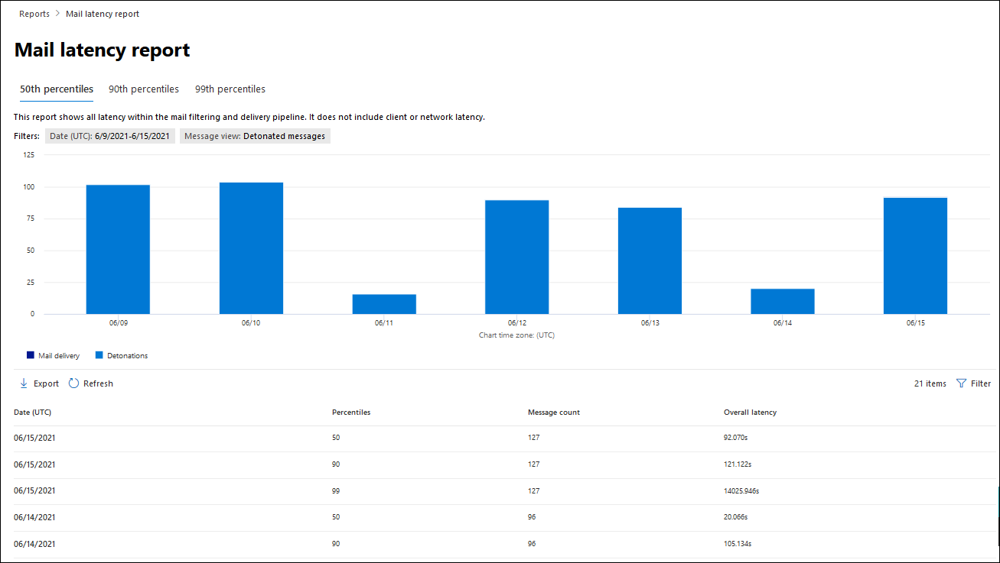

# Defender weergeven voor Office 365 rapporten in de Microsoft 365 Defender portalView Defender for Office 365 reports in the Microsoft 365 Defender portal

[!INCLUDE [Microsoft 365 Defender rebranding](../includes/microsoft-defender-for-office.md)]

**Van toepassing op****Applies to**
- [Abonnement 1 en abonnement 2 voor Microsoft Defender voor Office 365Microsoft Defender for Office 365 plan 1 and plan 2](defender-for-office-365.md)
- [Microsoft 365 DefenderMicrosoft 365 Defender](../defender/microsoft-365-defender.md)

Microsoft Defender voor Office 365-organisaties (bijvoorbeeld Microsoft 365 E5-abonnementen of Microsoft Defender voor Office 365 Plan 1 of Microsoft Defender voor Office 365 Abonnement 2-invoegtoepassingen) bevatten diverse beveiligingsgerelateerde rapporten.Microsoft Defender for Office 365 organizations (for example, Microsoft 365 E5 subscriptions or Microsoft Defender for Office 365 Plan 1 or Microsoft Defender for Office 365 Plan 2 add-ons) contain a variety of security-related reports. Als u de [benodigde](#what-permissions-are-needed-to-view-the-defender-for-office-365-reports)machtigingen hebt, kunt u deze rapporten  bekijken in de Microsoft 365 Defender-portal door naar Rapporten e-mail & samenwerking e-mail & \>  \> **samenwerkingsrapporten.**If you have the [necessary permissions](#what-permissions-are-needed-to-view-the-defender-for-office-365-reports), you can view these reports in the Microsoft 365 Defender portal by going to **Reports** \> **Email & collaboration** \> **Email & collaboration reports**. Als u rechtstreeks naar de pagina **E-mail & samenwerkingsrapporten** wilt gaan, opent u <https://security.microsoft.com/emailandcollabreport> .To go directly to the **Email & collaboration reports** page, open <https://security.microsoft.com/emailandcollabreport>.

> [!NOTE]
>
> E-mailbeveiligingsrapporten waarvoor Defender niet nodig is Office 365 worden beschreven in E-mailbeveiligingsrapporten [weergeven in de Microsoft 365 Defender portal.](view-email-security-reports.md)Email security reports that don't require Defender for Office 365 are described in [View email security reports in the Microsoft 365 Defender portal](view-email-security-reports.md).
>
> Rapporten die zijn gerelateerd aan de e-mailstroom, zijn nu in het Exchange beheercentrum (EAC).Reports that are related to mail flow are now in the Exchange admin center (EAC). Zie E-mailstroomrapporten in het nieuwe Exchange [beheercentrum voor meer informatie over deze rapporten.](/exchange/monitoring/mail-flow-reports/mail-flow-reports)For more information about these reports, see [Mail flow reports in the new Exchange admin center](/exchange/monitoring/mail-flow-reports/mail-flow-reports).

## Safe Rapport Bestandstypen bijlagenSafe Attachments file types report

> [!NOTE]
> Het **Safe bestandstypen van** bijlagen wordt uiteindelijk verwijderd.The **Safe Attachments file types report** will eventually go away. Dezelfde informatie is beschikbaar in het rapport [Bedreigingsbeveiligingsstatus.](#threat-protection-status-report)The same information is available in the [Threat protection status report](#threat-protection-status-report).

## Safe Berichtbezettingsrapport bijlagenSafe Attachments message disposition report

> [!NOTE]
> Het **Safe berichtbezettingsrapport** bijlagen wordt uiteindelijk verwijderd.The **Safe Attachments message disposition report** will eventually go away. Dezelfde informatie is beschikbaar in het rapport [Bedreigingsbeveiligingsstatus.](#threat-protection-status-report)The same information is available in the [Threat protection status report](#threat-protection-status-report).

## E-maillatentierapportMail latency report

In **het rapport E-maillatentie** ziet u een statistische weergave van de latentie van e-mailbezorging en detonatie binnen uw organisatie.The **Mail latency report** shows you an aggregate view of the mail delivery and detonation latency experienced within your organization. E-mailbezorgingstijden in de service worden beïnvloed door een aantal factoren en de absolute levertijd in seconden is vaak geen goede indicator voor succes of een probleem.Mail delivery times in the service are affected by a number of factors, and the absolute delivery time in seconds is often not a good indicator of success or a problem. Een trage levertijd op één dag kan worden beschouwd als een gemiddelde levertijd op een andere dag, of omgekeerd.A slow delivery time on one day might be considered an average delivery time on another day, or vice-versa. Hiermee wordt geprobeerd berichtbezorging te kwalificeren op basis van statistische gegevens over de waargenomen levertijden van andere berichten.This tries to qualify message delivery based on statistical data about the observed delivery times of other messages.

Clientzijde en netwerklatentie zijn niet inbegrepen.Client side and network latency are not included.

Als u het rapport wilt bekijken, opent  [u de Microsoft 365 Defender portal](https://security.microsoft.com), gaat u naar Rapporten e-mail & \> **samenwerking** \> **e-mail & samenwerkingsrapporten**.To view the report, open the [Microsoft 365 Defender portal](https://security.microsoft.com), go to **Reports** \> **Email & collaboration** \> **Email & collaboration reports**. Zoek op **de pagina & e-mailsamenwerkingsrapporten** naar **het rapport E-maillatentie** en klik vervolgens op **Details weergeven.**On the **Email & collaboration reports** page, find **Mail latency report** and then click **View details**. Als u rechtstreeks naar het rapport wilt gaan, opent u <https://security.microsoft.com/mailLatencyReport> .To go directly to the report, open <https://security.microsoft.com/mailLatencyReport>.

Op de **pagina E-maillatentierapport** zijn de volgende tabbladen beschikbaar op de pagina **E-maillatentierapport:**On the **Mail latency report** page, the following tabs are available on the **Mail latency report** page:

- **50e percentiel:** dit is het midden voor bezorgingstijden van berichten.**50th percentile**: This is the middle for message delivery times. U kunt deze waarde beschouwen als een gemiddelde levertijd.You can consider this value as an average delivery time. Dit tabblad is standaard geselecteerd.This tab is selected by default.
- **90e percentiel:** dit geeft een hoge latentie voor berichtbezorging aan.**90th percentile**: This indicates a high latency for message delivery. Slechts 10% van de berichten duurde langer dan deze waarde.Only 10% of messages took longer than this value to deliver.
- **99e percentiel:** dit geeft de hoogste latentie voor berichtbezorging aan.**99th percentile**: This indicates the highest latency for message delivery.

Ongeacht het tabblad dat u selecteert, worden in de grafiek berichten weergegeven die zijn ingedeeld in de volgende categorieën:Regardless of the tab you select, the chart shows messages organized into the following categories:

- **Latentie voor e-mailbezorging****Mail delivery latency**
- **Detonaties****Detonations**

Wanneer u de muisaanwijzer boven een categorie in de grafiek beweegt, ziet u een uitsplitsing van de latentie in elke categorie.When you hover over a category in the chart, you can see a breakdown of the latency in each category.

Als u op **Filter** klikt, kunt u zowel de grafiek als de detailtabel filteren op de volgende waarden:If you click **Filter**, you can filter both the chart and the details table by the following values:

- **Datum (UTC)**: **Begindatum** en **einddatum****Date (UTC)**: **Start date** and **End date**
- **Berichtweergave:** Een van de volgende waarden:**Message view**: One of the following values:
  - **Alle berichten****All messages**
  - **Berichten met bijlagen of URL's****Messages that contain attachments or URLs**
  - **Ontplofte berichten****Detonated messages**

Wanneer u klaar bent met het configureren van de filters, klikt u **op Toepassen,** **Annuleren** of **Filters wissen.**When you're finished configuring the filters, click **Apply**, **Cancel**, or **Clear filters**.

In de detailtabel onder de grafiek zijn de volgende gegevens beschikbaar:In the details table below the chart, the following information is available:

- **Datum (UTC)****Date (UTC)**
- **Percentielen:** **50,** **90** of **99****Percentiles**: **50**, **90**, or **99**
- **Aantal berichten****Message count**
- **Algehele latentie****Overall latency**

## Statusrapport bedreigingsbeveiligingThreat protection status report

Het rapport Status **van** bedreigingsbeveiliging is één weergave waarin informatie wordt bijeengehouden over schadelijke inhoud en schadelijke e-mail die is gedetecteerd en geblokkeerd door [Exchange Online Protection](exchange-online-protection-overview.md) (EOP) en Microsoft Defender voor Office 365.The **Threat protection status** report is a single view that brings together information about malicious content and malicious email detected and blocked by [Exchange Online Protection](exchange-online-protection-overview.md) (EOP) and Microsoft Defender for Office 365. Zie Rapport [bedreigingsbeveiligingsstatus voor](view-email-security-reports.md#threat-protection-status-report)meer informatie.For more information, see [Threat protection status report](view-email-security-reports.md#threat-protection-status-report).

## URL-bedreigingsbeveiligingsrapportURL threat protection report

Het **rapport URL-bedreigingsbeveiliging** bevat overzichts- en trendweergaven voor gedetecteerde bedreigingen en acties die zijn ondernomen op URL-klikken als onderdeel [van Safe Koppelingen.](safe-links.md)The **URL threat protection report** provides summary and trend views for threats detected and actions taken on URL clicks as part of [Safe Links](safe-links.md). In dit rapport zijn geen klikgegevens van gebruikers waar Safe beleid voor koppelingen is toegepast, is de optie **Gebruikersklikken** niet bijhouden geselecteerd.This report will not have click data from users where the Safe Links policy applied has the **Do not track user clicks** option selected.

Als u het rapport wilt bekijken, opent  [u de Microsoft 365 Defender portal](https://security.microsoft.com), gaat u naar Rapporten e-mail & \> **samenwerking** \> **e-mail & samenwerkingsrapporten**.To view the report, open the [Microsoft 365 Defender portal](https://security.microsoft.com), go to **Reports** \> **Email & collaboration** \> **Email & collaboration reports**. Zoek op **de pagina & samenwerkingsrapporten** naar **de pagina URL-beveiliging** en klik vervolgens op **Details weergeven.**On the **Email & collaboration reports** page, find **URL protection page** and then click **View details**. Als u rechtstreeks naar het rapport wilt gaan, opent u <https://security.microsoft.com/reports/URLProtectionActionReport> .To go directly to the report, open <https://security.microsoft.com/reports/URLProtectionActionReport>.

De beschikbare weergaven op de **rapportpagina VOOR URL-bedreigingsbeveiliging** worden in de volgende secties beschreven.The available views on the **URL threat protection** report page are described in the following sections.

> [!NOTE]
> Dit is een *beveiligingstrendrapport, wat* betekent dat gegevens trends vertegenwoordigen in een grotere gegevensset.This is a *protection trend report*, meaning data represents trends in a larger dataset. Hierdoor zijn de gegevens in de grafieken hier niet in realtime beschikbaar, maar de gegevens in de detailtabel wel, zodat er mogelijk een kleine afwijking tussen de twee wordt gezien.As a result, the data in the charts is not available in real time here, but the data in the details table is, so you may see a slight discrepancy between the two. De grafieken worden eenmaal per vier uur vernieuwd en bevatten gegevens voor de afgelopen 90 dagen.The charts are refreshed once every four hours and contain data for the last 90 days.

### Gegevens weergeven op URL klik op beveiligingsactieView data by URL click protection action

In **de weergave Gegevens per URL klikken op beveiligingsactieweergave** ziet u het aantal URL-klikken van gebruikers in de organisatie en de resultaten van de klik:The **View data by URL click protection action** view shows the number of URL clicks by users in the organization and the results of the click:

- **Toegestaan:** de gebruiker mocht naar de URL navigeren.**Allowed**: The user was allowed to navigate to the URL.
- **Geblokkeerd:** De gebruiker is geblokkeerd voor het navigeren naar de URL.**Blocked**: The user was blocked from navigating to the URL.
- **Geblokkeerd en doorgeklikt:** De gebruiker heeft ervoor gekozen om door te gaan met navigeren naar de URL.**Blocked and clicked through**: The user has chosen to continue navigating to the URL.
- **Doorgeklikt tijdens de scan:** De gebruiker heeft op de koppeling geklikt voordat de scan was voltooid.**Clicked through during scan**: The user has clicked on the link before the scan was complete.

Een klik geeft aan dat de gebruiker via de blokpagina naar de schadelijke website heeft geklikt (beheerders kunnen klikken uitschakelen in Safe Koppelingenbeleid).A click indicates that the user has clicked through the block page to the malicious website (admins can disable click through in Safe Links policies).

Als u op **Filters** klikt, kunt u het rapport en de detailtabel wijzigen door een of meer van de volgende waarden te selecteren in het flyout dat wordt weergegeven:If you click **Filters**, you can modify the report and the details table by selecting one or more of the following values in the flyout that appears:

- **Datum (UTC)**: **Begindatum** en **einddatum****Date (UTC)**: **Start date** and **End date**
- **Detectie**:**Detection**:
  - **Toegestaan****Allowed**
  - **Geblokkeerd****Blocked**
  - **Geblokkeerd en doorgeklikt****Blocked and clicked through**
  - **Doorgeklikt tijdens de scan****Clicked through during scan**
- **Domeinen:** de URL-domeinen die worden vermeld in de rapportresultaten.**Domains**: The URL domains listed in the report results.
- **Geadresseerden****Recipients**

Wanneer u klaar bent met het configureren van de filters, klikt u **op Toepassen,** **Annuleren** of **Filters wissen.**When you're finished configuring the filters, click **Apply**, **Cancel**, or **Clear filters**.

De detailtabel onder de grafiek bevat de volgende bijna-realtime weergave van alle klikken die de afgelopen 7 dagen binnen de organisatie hebben plaatsgevonden:The details table below the chart provides the following near-real-time view of all clicks that happened within the organization for the last 7 days:

- **Klik op tijd****Click time**
- **Gebruiker****User**
- **URL****URL**
- **Actie****Action**
- **App****App**

### Gegevens weergeven op URL klik op toepassingView data by URL click by application

In de weergave Gegevens **weergeven op URL op** toepassing wordt het aantal URL-klikken weergegeven door apps die ondersteuning bieden Safe Koppelingen:The **View data by URL click by application** view shows the number of URL clicks by apps that support Safe Links:

- **E-mailclient****Email client**
- **PowerPoint****PowerPoint**
- **Word****Word**
- **Excel****Excel**
- **OneNote****OneNote**
- **Visio****Visio**
- **Teams****Teams**
- **Anderen****Others**

Als u op **Filters** klikt, kunt u het rapport en de detailtabel wijzigen door een of meer van de volgende waarden te selecteren in het flyout dat wordt weergegeven:If you click **Filters**, you can modify the report and the details table by selecting one or more of the following values in the flyout that appears:

- **Datum (UTC)**: **Begindatum** en **einddatum****Date (UTC)**: **Start date** and **End date**
- **Detectie:** Beschikbare apps in de grafiek.**Detection**: Available apps from the chart.
- **Domeinen:** de URL-domeinen die worden vermeld in de rapportresultaten.**Domains**: The URL domains listed in the report results.
- **Geadresseerden****Recipients**

Wanneer u klaar bent met het configureren van de filters, klikt u **op Toepassen,** **Annuleren** of **Filters wissen.**When you're finished configuring the filters, click **Apply**, **Cancel**, or **Clear filters**.

De detailtabel onder de grafiek bevat de volgende bijna-realtime weergave van alle klikken die de afgelopen 7 dagen binnen de organisatie hebben plaatsgevonden:The details table below the chart provides the following near-real-time view of all clicks that happened within the organization for the last 7 days:

- **Klik op tijd****Click time**
- **Gebruiker****User**
- **URL****URL**
- **Actie****Action**
- **App****App**

## Aanvullende rapporten die u wilt weergevenAdditional reports to view

Naast de rapporten die in dit artikel worden beschreven, zijn er verschillende andere rapporten beschikbaar, zoals beschreven in de volgende tabel:In addition to the reports described in this article, several other reports are available, as described in the following table:

 

****

|RapportReport|OnderwerpTopic|
|---|---|
|**Explorer** (Microsoft Defender voor Office 365 plan 2) of **realtime detecties** (Microsoft Defender voor Office 365 abonnement 1)**Explorer** (Microsoft Defender for Office 365 Plan 2) or **real-time detections** (Microsoft Defender for Office 365 Plan 1)|[Bedreigingsverkenner (en realtime detecties)Threat Explorer (and real-time detections)](threat-explorer.md)|
|E-mailbeveiligingsrapporten waarvoor Defender niet nodig is voor Office 365Email security reports that don't require Defender for Office 365|[E-mailbeveiligingsrapporten weergeven in de Microsoft 365 Defender portalView email security reports in the Microsoft 365 Defender portal](view-email-security-reports.md)|
|E-mailstroomrapporten in het Exchange-beheercentrum (EAC)Mail flow reports in the Exchange admin center (EAC)|[E-mailstroomrapporten in het nieuwe Exchange beheercentrumMail flow reports in the new Exchange admin center](/exchange/monitoring/mail-flow-reports/mail-flow-reports)|
|

PowerShell-rapportage-cmdlets:PowerShell reporting cmdlets:

 

****

|RapportReport|OnderwerpTopic|
|---|---|
|Belangrijkste afzenders en geadresseerdenTop senders and recipients|[Get-MailTrafficTopReportGet-MailTrafficTopReport](/powershell/module/exchange/get-mailtraffictopreport) 
 [Get-MailTrafficSummaryReportGet-MailTrafficSummaryReport](/powershell/module/exchange/get-mailtrafficsummaryreport)|
|Top malwareTop malware|[Get-MailTrafficSummaryReportGet-MailTrafficSummaryReport](/powershell/module/exchange/get-mailtrafficsummaryreport)|
|E-mailverkeerMail traffic|[Get-MailTrafficATPReportGet-MailTrafficATPReport](/powershell/module/exchange/get-mailtrafficatpreport) 
 [Get-MailDetailATPReportGet-MailDetailATPReport](/powershell/module/exchange/get-maildetailatpreport)|
|Veilige koppelingenSafe Links|[Get-SafeLinksAggregateReportGet-SafeLinksAggregateReport](/powershell/module/exchange/get-safelinksaggregatereport) 
 [Get-SafeLinksDetailReportGet-SafeLinksDetailReport](/powershell/module/exchange/get-safelinksdetailreport)|
|Gecompromitteerde gebruikersCompromised users|[Get-CompromisedUserAggregateReportGet-CompromisedUserAggregateReport](/powershell/module/exchange/get-compromiseduseraggregatereport) 
 [Get-CompromisedUserDetailReportGet-CompromisedUserDetailReport](/powershell/module/exchange/get-compromiseduserdetailreport)|
|E-mailstroomstatusMail flow status|[Get-MailflowStatusReportGet-MailflowStatusReport](/powershell/module/exchange/get-mailflowstatusreport)|
|

## Welke machtigingen zijn nodig om de Defender voor Office 365 weergeven?What permissions are needed to view the Defender for Office 365 reports?

Als u de rapporten wilt bekijken en gebruiken die in dit artikel worden beschreven, moet u lid zijn van een van de volgende rollengroepen in de Microsoft 365 Defender portal:In order to view and use the reports described in this article, you need to be a member of one of the following role groups in the Microsoft 365 Defender portal:

- **Organisatiebeheer****Organization Management**
- **Beveiligingsbeheerder****Security Administrator**
- **Beveiligingslezer****Security Reader**
- **Globale lezer****Global Reader**

Zie [Machtigingen in de Microsoft 365 Defender-portal](permissions-microsoft-365-security-center.md) voor meer informatie.For more information, see [Permissions in the Microsoft 365 Defender portal](permissions-microsoft-365-security-center.md).

**Opmerking:** Gebruikers toevoegen aan de bijbehorende Azure Active Directory rol in de Microsoft 365-beheercentrum geeft gebruikers de vereiste machtigingen in de _Microsoft 365 Defender-portal_ en machtigingen voor andere functies in Microsoft 365.**Note**: Adding users to the corresponding Azure Active Directory role in the Microsoft 365 admin center gives users the required permissions in the Microsoft 365 Defender portal _and_ permissions for other features in Microsoft 365. Raadpleeg [Over beheerdersrollen](../../admin/add-users/about-admin-roles.md) voor meer informatie.For more information, see [About admin roles](../../admin/add-users/about-admin-roles.md).

## Wat gebeurt er als er geen gegevens worden weergegeven in de rapporten?What if the reports aren't showing data?

Als u geen gegevens ziet in uw Defender voor Office 365 rapporten, controleert u of uw beleid correct is ingesteld.If you are not seeing data in your Defender for Office 365 reports, double-check that your policies are set up correctly. Uw organisatie moet Safe [beleidsregels](set-up-safe-links-policies.md) voor koppelingen en Safe [bijlagen](set-up-safe-attachments-policies.md) hebben gedefinieerd, zodat Defender Office 365 beveiliging kan worden gebruikt.Your organization must have [Safe Links policies](set-up-safe-links-policies.md) and [Safe Attachments policies](set-up-safe-attachments-policies.md) defined in order for Defender for Office 365 protection to be in place. Zie ook [Anti-spam en anti-malwarebeveiliging.](anti-spam-and-anti-malware-protection.md)Also see [Anti-spam and anti-malware protection](anti-spam-and-anti-malware-protection.md).

## Gerelateerde onderwerpenRelated topics

[Slimme rapporten en inzichten in de Microsoft 365 Defender portalSmart reports and insights in the Microsoft 365 Defender portal](reports-and-insights-in-security-and-compliance.md)

[Rolmachtigingen (Azure Active DirectoryRole permissions (Azure Active Directory](/azure/active-directory/users-groups-roles/directory-assign-admin-roles#role-permissions)
