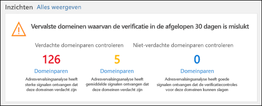
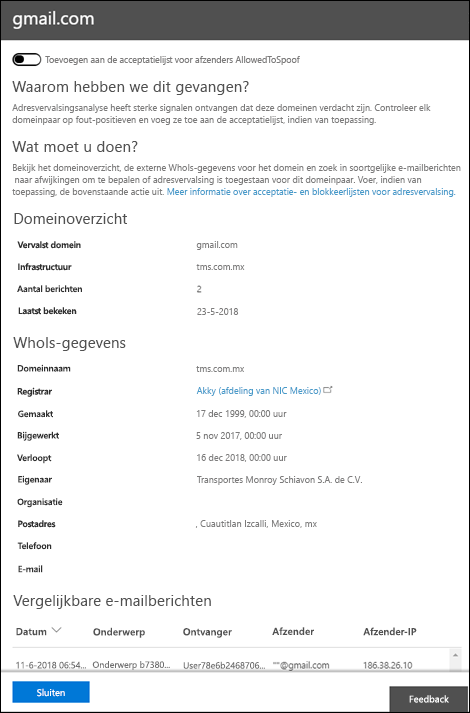

# Scenario-spoof informatie inzicht in Microsoft Defender voor Office 365

[!INCLUDE [Microsoft 365 Defender rebranding](../includes/microsoft-defender-for-office.md)]

In Microsoft 365-organisaties met Defender voor Office 365 kunt u de spoof Intelligence-inzichten gebruiken om snel te bepalen welke externe afzenders u niet-geverifieerde e-mailberichten (berichten uit domeinen die geen SPF-, DKIM-of DMARC-controles volgen).

Als u wilt dat bekende externe afzenders kunnen vervalste berichten van bekende locaties verzenden, kunt u foutberichten verminderen (goede e-mailberichten die als slecht zijn gemarkeerd). Door de toegestane vervalste afzenders te bewaken, geeft u een extra beveiligingslaag aan om te voorkomen dat onveilige berichten in uw organisatie arriveren.

Zie [rapporten en inzichten in het beveiligings & nalevings centrum](reports-and-insights-in-security-and-compliance.md)voor meer informatie over rapporten en inzichten.

Dit scenario is een van de verschillende voor het beveiligings & nalevings centrum. Zie de procedures in de sectie [Verwante onderwerpen](#related-topics) voor meer informatie over het navigeren in rapporten en inzichten.

## Wat moet u weten voordat u begint?

- U opent het Beveiligings- en compliancecentrum in <https://protection.office.com/>. Als u rechtstreeks naar de pagina **beveiligings dashboard** wilt gaan, gebruikt u <https://protection.office.com/searchandinvestigation/dashboard> .

  U kunt de spoof Intelligence-informatie van meer dan één dashboard bekijken in de beveiligings & compliance Center. Ongeacht het dashboard dat u zoekt, biedt het inzicht dezelfde Details, zodat u snel dezelfde taken kunt uitvoeren.

- Je moet beschikken over toegewezen machtigingen in het Beveiligings- en compliancecentrum voor het uitvoeren van de procedures in dit onderwerp:
  - **Organisatiebeheer**
  - **Beveiligingsbeheerder**
  - **Beveiligings lezer**
  - **Algemene lezer**

  Zie [Machtigingen in het Beveiligings- & compliancecentrum](permissions-in-the-security-and-compliance-center.md) voor meer informatie.

  **Opmerking**: door gebruikers toe te voegen aan de bijbehorende rol van Azure Active Directory in het microsoft 365-Beheercentrum geeft u gebruikers de vereiste machtigingen in de beveiligings & nalevings centrum _en_ machtigingen voor andere functies in Microsoft 365. Zie[Over beheerdersrollen](https://docs.microsoft.com/microsoft-365/admin/add-users/about-admin-roles) voor meer informatie.

- U schakelt spoof informatie in en uit in anti-phishing-beleid in Microsoft Defender voor Office 365. Spoof Intelligence is standaard ingeschakeld. Zie [anti phishingberichten configureren in Microsoft Defender voor Office 365](configure-atp-anti-phishing-policies.md)voor meer informatie.

- Zie [spoof informatie configureren in Microsoft 365](learn-about-spoof-intelligence.md)als u wilt weten hoe u via spoof Intelligence afzenders kunt volgen en beheren die u niet-geverifieerde berichten verzendt.

## Open de informatie over spoof informatie in het beveiligings & nalevings centrum

1. Ga in het beveiligings & nalevings centrum naar het dashboard **Threat Management** \> **.**

2. Ga naar de rij **inzichten** en zoek een van de volgende items:

   - **Waarschijnlijk gespoofde domeinen in de afgelopen zeven dagen: in** dit inzicht wordt aangegeven dat de spoof Intelligence is ingeschakeld (standaard ingeschakeld).
   - **Spoofing inschakelen**: dit inzicht geeft aan dat de spoof-informatie is uitgeschakeld en klik op het inzicht biedt u ondersteuning voor het inschakelen van spoof Intelligence.

3. Het inzicht in het Dashboard toont u informatie zoals hier:

   

   Dit inzicht heeft in twee modi:

   - Berekenings **modus**: als spoof Intelligence is ingeschakeld, ziet u in het voor inzicht hoe veel berichten werden beïnvloed door onze spoof Intelligence-mogelijkheden gedurende de afgelopen zeven dagen.
   - **Wat als-modus**: als spoof Intelligence is uitgeschakeld, kunt u in het inzicht zien hoeveel *berichten werden beïnvloed door* onze vervals Intelligence-mogelijkheden gedurende de afgelopen zeven dagen.

   In beide gevallen zijn de spoofende domeinen die worden weergegeven in het inzicht, onderverdeeld in twee categorieën: **verdachte domeinen** en **niet-verdachte domeinen**.

   - **Verdachte domeinen** zijn:

     - Spoofing van hoge betrouwbaarheid: op basis van de historische verplaatsings patronen en de reputatie Score van de domeinen, hebben we nadrukkelijk vertrouwen dat de domeinen wel spoofing zijn en dat berichten van deze domeinen waarschijnlijk schadelijk zijn.

     - Spoofing van matige betrouwbaarheid: op basis van de historische Verstuur patronen en de reputatie Score van de domeinen, zijn er zeker van te zijn dat de domeinen spoofing zijn en dat berichten die vanuit deze domeinen worden verzonden, legitiem zijn. In deze categorie zijn er onjuiste positieve en onjuiste vertrouw baarheid van een spoof.

   **Niet-verdachte domeinen**: het domein is vanwege expliciete verificatie van e-mail verificatie niet gecontroleerd, [SPF](how-office-365-uses-spf-to-prevent-spoofing.md), [dkim](use-dkim-to-validate-outbound-email.md)en [DMARC](use-dmarc-to-validate-email.md)). Het domein heeft echter wel verificatie gecontroleerd op impliciete e-mail verificatie ([samengestelde verificatie](email-validation-and-authentication.md#composite-authentication)). Daarom is er geen anti-spoofing-actie uitgevoerd voor het bericht.

### Gedetailleerde informatie over verdachte domeinen weergeven vanuit de spoof Intelligence-inzichten

1. Op de spoof Intelligence-informatie klikt u op **verdachte domeinen** of **niet-verdachte domeinen** om naar de pagina **spoof Intelligence Insight** te gaan. De pagina **spoof Intelligence Insight** bevat de volgende informatie:

   - **Spoofing Domain**: het domein van de vervalste gebruiker die wordt weergegeven in het vak **van** in e-mailclients. Dit adres wordt ook wel het `5322.From` adres genoemd.
   - **Infrastructuur**: ook wel bekend als de _verzendende infrastructuur_. Het domein gevonden in een omgekeerde DNS-zoekopdracht (PTR-record) van het IP-adres van de bron-e-mailserver. Als het bron-IP-adres geen PTR-record heeft, wordt de verzendende infrastructuur aangeduid als \<source IP\> /24 (bijvoorbeeld 192.168.100.100/24).
   - **Aantal** berichten: het aantal berichten van de verzendende infrastructuur naar uw organisatie met het opgegeven vervalste domein binnen de afgelopen 7 dagen.
   - **Laatst weergegeven**: de laatste datum waarop een bericht is ontvangen van de verzendende infrastructuur die het vervalste domein bevat.
   - **Type spoofing**: deze waarde is **extern**.
   - **Toegestaan spoofing?**: de waarden die u hier ziet:
     - **Ja**: berichten van de combinatie van domein met vervalste gebruikers en het verzenden van een infrastructuur zijn toegestaan en worden niet als vervalste e-mail verwerkt.
     - **Nee**: berichten van de combinatie van domein met vervalste gebruikers en het verzenden van een infrastructuur zijn gemarkeerd als vervalste. De actie wordt bepaald door het standaard anti-phishingfilter of een aangepast anti-phishingfilter (de standaardinstelling is **bericht verplaatsen naar map Ongewenste e-mail**).

     Zie [anti phishingberichten configureren in Microsoft Defender voor Office 365](configure-atp-anti-phishing-policies.md)voor meer informatie.

2. Selecteer een item in de lijst om details weer te geven van het domein/het infrastructuur-paar in een flyout. De informatie omvat:
   - Waarom we dit hebben ondervangen.
   - Wat u moet doen.
   - Een domein samenvatting.
   - WhoIs gegevens over de afzender.
   - Vergelijkbare berichten die we hebben weergegeven in uw Tenant van dezelfde afzender.

   Van hieruit kunt u ook kiezen voor het toevoegen of verwijderen van het domein/het verzenden van een infrastructuur koppeling uit de lijst **toegestane** verzenders toestaan. Zet de wisselknop dienovereenkomstig.

   

### Een domein toevoegen aan de lijst toegestaan voor spoofing

Als u een domein toevoegt aan de lijst toegestaan voor spoofing vanuit de spoof Intelligence Insight, wordt alleen de combinatie van het vervalste domein *en* de verstuurde infrastructuur toegestaan. De e-mail van het vervalste domein van een bron wordt niet toegestaan, noch mag e-mail van de verzendende infrastructuur voor geen domeinen.

U kunt bijvoorbeeld het volgende domein inschakelen voor de lijst met toegestane spoofing:

- **Domein**: Gmail.com
- **Infrastructuur**: TMS.MX.com

Alleen e-mailberichten van het domein/het versturen van een infrastructuur worden toegestaan voor spoofing. Andere afzenders proberen te vervalsen gmail.com zijn niet toegestaan. Berichten in andere domeinen van tms.mx.com zijn gecontroleerd via spoof Intelligence.

## Verwante onderwerpen

[Anti-spoofing beveiliging in Microsoft 365](anti-spoofing-protection.md)
