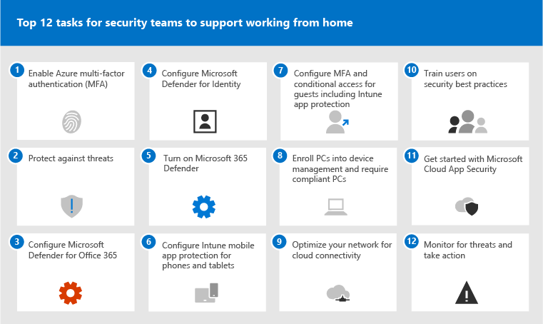

# De 12 belangrijkste taken voor beveiligingsteams ter ondersteuning van thuis werken

Als u net als [Microsoft](https://www.microsoft.com/microsoft-365/blog/2020/03/10/staying-productive-while-working-remotely-with-microsoft-teams/) bent en plotseling een voornamelijk thuiswerkers ondersteunt, willen we u helpen ervoor te zorgen dat uw organisatie zo veilig mogelijk werkt. In dit artikel worden taken prioriteit gegeven om beveiligingsteams te helpen de belangrijkste beveiligingsfuncties zo snel mogelijk te implementeren.

Als u een kleine of middelgrote organisatie bent die een van de zakelijke abonnementen van Microsoft gebruikt, bekijkt u in plaats daarvan deze bronnen:

- [Top 10 manieren om Office 365 en Microsoft 365 voor Bedrijven-abonnementen te beveiligen](../admin/security-and-compliance/secure-your-business-data.md)
- [Microsoft 365 voor campagnes](../campaigns/index.md) (bevat een aanbevolen beveiligingsconfiguratie voor Microsoft 365 Business)

Voor klanten die onze ondernemingsplannen gebruiken, raadt Microsoft u aan de taken uit te voeren die worden vermeld in de volgende tabel die van toepassing zijn op uw serviceplan. Als u abonnementen combineert in plaats van een Microsoft 365-ondernemingsplan te kopen, moet u het volgende doen:

- Microsoft 365 E3 bevat Enterprise Mobility + Security (EMS) E3 en Azure AD P1
- Microsoft 365 E5 bevat EMS E5 en Azure AD P2

****

|Stap|Taak|Alle Office 365 Enterprise-abonnementen|Microsoft 365 E3|Microsoft 365 E5|
|---|---|---|---|---|
|1|[Azure AD Multi-Factor Authentication (MFA) inschakelen](#1-enable-azure-ad-multi-factor-authentication-mfa)||||
|2|[Beveiligen tegen bedreigingen](#2-protect-against-threats)||||
|3|[Microsoft Defender configureren voor Office 365](#3-configure-microsoft-defender-for-office-365)||||
|4|[Microsoft Defender configureren voor identiteit](#4-configure-microsoft-defender-for-identity)||||
|5|[Microsoft 365 Defender in-](#5-turn-on-microsoft-365-defender)||||
|6|[Intune mobile app protection configureren voor telefoons en tablets](#6-configure-intune-mobile-app-protection-for-phones-and-tablets)||||
|7|[MFA en voorwaardelijke toegang configureren voor gasten, inclusief intune-appbeveiliging](#7-configure-mfa-and-conditional-access-for-guests-including-intune-mobile-app-protection)||||
|8|[Pc's registreren voor apparaatbeheer en compatibele pc's vereisen](#8-enroll-pcs-into-device-management-and-require-compliant-pcs)||||
|9|[Uw netwerk optimaliseren voor cloudconnectiviteit](#9-optimize-your-network-for-cloud-connectivity)||||
|10|[Gebruikers wegwijs maken](#10-train-users)||||
|11|[Aan de slag met Microsoft Cloud App Security](#11-get-started-with-microsoft-cloud-app-security)||||
|12|[Controleren op bedreigingen en actie ondernemen](#12-monitor-for-threats-and-take-action)||||
|

Controleer voordat u begint uw [Microsoft 365 Secure Score](./defender/microsoft-secure-score.md) in het Microsoft 365-beveiligingscentrum. Vanuit een centraal dashboard kunt u de beveiliging van uw Microsoft 365-identiteiten, gegevens, apps, apparaten en infrastructuur bewaken en verbeteren. U krijgt punten voor het configureren van aanbevolen beveiligingsfuncties, het uitvoeren van beveiligingsgerelateerde taken (zoals het weergeven van rapporten) of het oplossen van aanbevelingen met een toepassing of software van derden. De aanbevolen taken in dit artikel verhogen uw score.

## 1: Azure AD Multi-Factor Authentication (MFA) inschakelen

Het beste wat u kunt doen om de beveiliging te verbeteren voor werknemers die thuis werken, is MFA in te zetten. Als u nog geen processen hebt, kunt u dit behandelen als een pilot voor noodgevallen en ervoor zorgen dat ondersteuningsmedewerkers klaar staan om werknemers te helpen die vast komen te zitten. Aangezien u waarschijnlijk geen hardwarebeveiligingsapparaten kunt distribueren, gebruikt u Windows Hello-biometrische en smartphoneverificatie-apps zoals Microsoft Authenticator.

Normaal gesproken raadt Microsoft aan gebruikers 14 dagen de tijd te geven hun apparaat te registreren voor meervoudige verificatie voordat ze MFA nodig hebben. Als uw personeel echter plotseling thuis werkt, moet U MFA als beveiligingsprioriteit gebruiken en bereid zijn om gebruikers te helpen die dit nodig hebben.

Het toepassen van dit beleid duurt slechts enkele minuten, maar is bereid om uw gebruikers de komende dagen te ondersteunen.

****

|Abonnement|Aanbeveling|
|---|---|
|Microsoft 365-abonnementen (zonder Azure AD P1 of P2)|[Schakel standaardinstellingen voor beveiliging in Azure AD in](/azure/active-directory/fundamentals/concept-fundamentals-security-defaults). De standaardinstellingen voor beveiliging in Azure AD omvatten MFA voor gebruikers en beheerders.|
|Microsoft 365 E3 (met Azure AD P1)|Gebruik [algemeen beleid voor voorwaardelijke toegang](/azure/active-directory/conditional-access/concept-conditional-access-policy-common) om het volgende beleid te configureren:  - [MFA vereisen voor beheerders](/azure/active-directory/conditional-access/howto-conditional-access-policy-admin-mfa)  - [MFA vereisen voor alle gebruikers](/azure/active-directory/conditional-access/howto-conditional-access-policy-all-users-mfa)   - [Verouderde verificatie blokkeren](/azure/active-directory/conditional-access/howto-conditional-access-policy-block-legacy)|
|Microsoft 365 E5 (met Azure AD P2)|Als u gebruikmaakt van Azure AD Identity Protection, begint u het implementeren van de [aanbevolen set beleidsregels voor voorwaardelijke toegang en verwante beleidsregels](./office-365-security/identity-access-policies.md) van Microsoft door de volgende twee beleidsregels te maken:  - [MFA vereisen bij een normaal of hoog risico bij het aanmelden](./office-365-security/identity-access-policies.md#require-mfa-based-on-sign-in-risk)  - [Clients blokkeren die moderne verificatie niet ondersteunen](./office-365-security/identity-access-policies.md#block-clients-that-dont-support-multi-factor) - [Gebruikers met een hoog risico moeten het wachtwoord wijzigen](./office-365-security/identity-access-policies.md#high-risk-users-must-change-password)|
|

## 2: Beschermen tegen bedreigingen

Alle Microsoft 365-abonnementen bevatten diverse functies voor bedreigingsbeveiliging. Het kost slechts enkele minuten om de beveiliging voor deze functies op te stoten.

- Beveiliging tegen malware
- Bescherming tegen schadelijke URL's en bestanden
- Bescherming tegen phishing
- Beveiliging tegen ongewenste e-mail

Zie [Beschermen tegen bedreigingen in Office 365](office-365-security/protect-against-threats.md) voor richtlijnen die u als uitgangspunt kunt gebruiken.

## 3: Microsoft Defender configureren voor Office 365

Microsoft Defender voor Office 365, inclusief Microsoft 365 E5 en Office 365 E5, beschermt uw organisatie tegen schadelijke bedreigingen van e-mailberichten, koppelingen (URL's) en samenwerkingshulpmiddelen. Het configureren kan enkele uren duren.

Microsoft Defender voor Office 365:

- Beschermt uw organisatie tegen onbekende e-mailbedreigingen in realtime met behulp van intelligente systemen die bijlagen en koppelingen controleren op schadelijke inhoud. Deze geautomatiseerde systemen bevatten een robuust detonatieplatform, heuristische en machine learning-modellen.
- Beschermt uw organisatie wanneer gebruikers samenwerken en bestanden delen door schadelijke bestanden in teamsites en documentbibliotheken te identificeren en te blokkeren.
- Hiermee worden machine learning-modellen en geavanceerde algoritmen voor imitatiedetectie toegepast om phishingaanvallen te voorkomen.

Zie [Defender voor Office 365](./office-365-security/defender-for-office-365.md)voor een overzicht, inclusief een overzicht van abonnementen.

De globale beheerder kan deze beveiligingen configureren:

- [Beleidsregels voor veilige koppelingen instellen](office-365-security/set-up-safe-links-policies.md)
- [Algemene instellingen configureren voor veilige koppelingen](office-365-security/configure-global-settings-for-safe-links.md)
- [Beleid voor veilige bijlagen instellen](office-365-security/set-up-safe-attachments-policies.md)

U moet samenwerken met uw Exchange Online-beheerder en SharePoint Online-beheerder om Defender voor Office 365 te configureren voor deze werkbelastingen:

- [ATP voor SharePoint, OneDrive en Microsoft Teams](office-365-security/mdo-for-spo-odb-and-teams.md)

## 4: Microsoft Defender configureren voor identiteit

[Microsoft Defender for Identity](/azure-advanced-threat-protection/what-is-atp) is een cloudbeveiligingsoplossing die gebruikmaakt van uw on-premises Active Directory-signalen om geavanceerde bedreigingen, gecompromitteerde identiteiten en kwaadwillende acties van binnenuit die zijn gericht op uw organisatie, te identificeren, te detecteren en te onderzoeken. Focus op deze volgende, omdat het uw on-prem en uw cloudinfrastructuur beschermt, geen afhankelijkheden of vereisten heeft en direct voordeel kan bieden.

- Zie [Snelstarts voor Microsoft Defender voor](/azure-advanced-threat-protection/install-atp-step1) identiteit om snel te worden ingesteld
- Video [bekijken: Inleiding tot Microsoft Defender voor identiteit](https://www.youtube.com/watch?reload=9&v=EGY2m8yU_KE)
- De drie [fasen van microsoft Defender voor identiteitsimplementatie bekijken](/azure-advanced-threat-protection/what-is-atp#whats-next)

## 5: Microsoft 365 Defender in-

Nu Microsoft Defender voor Office 365 en Microsoft Defender voor identiteit zijn geconfigureerd, kunt u de gecombineerde signalen van deze mogelijkheden in één dashboard bekijken. [Microsoft 365 Defender](./defender/microsoft-365-defender.md) brengt waarschuwingen, incidenten, geautomatiseerd onderzoek en antwoord en geavanceerde zoekwerkbelastingen (Microsoft Defender voor identiteit, Defender voor Office 365, Microsoft Defender voor Eindpunt en Microsoft Cloud App-beveiliging) samen in één deelvenster op [security.microsoft.com.](https://security.microsoft.com)

Nadat u een of meer van uw Defender voor Office 365-services hebt geconfigureerd, schakelt u MTP in. Nieuwe functies worden voortdurend toegevoegd aan MTP. overwegen om in te kiezen om preview-functies te ontvangen.

- [Meer informatie over MTP](./defender/microsoft-365-defender.md)
- [MTP in-](./defender/m365d-enable.md)
- [Opt-in voor preview-functies](./defender/preview.md)

## 6: Intune mobile app protection configureren voor telefoons en tablets

Met Microsoft Intune Mobile Application Management (MAM) kunt u de gegevens van uw organisatie op telefoons en tablets beheren en beveiligen zonder deze apparaten te beheren. Dit werkt als volgende:

- U maakt een APP (App) (App) waarmee wordt bepaald welke apps op een apparaat worden beheerd en welk gedrag is toegestaan (zoals voorkomen dat gegevens uit een beheerde app worden gekopieerd naar een niet-beheerde app). U maakt één beleid voor elk platform (iOS, Android).
- Nadat u het beleid voor app-beveiliging hebt gemaakt, dwingt u deze af door een regel voor voorwaardelijke toegang te maken in Azure AD om goedgekeurde apps en APP-gegevensbescherming te vereisen.

App-beveiligingsbeleid bevat veel instellingen. Gelukkig hoeft u niet meer te weten te komen over elke instelling en de opties te wegen. Microsoft maakt het eenvoudig om een configuratie van instellingen toe te passen door uitgangspunten aan te bevelen. Het [gegevensbeveiligingskader met app-beveiligingsbeleid](/mem/intune/apps/app-protection-framework) bevat drie niveaus waar u uit kunt kiezen.

Nog beter: Microsoft coördineert dit beveiligingskader voor apps met een set voorwaardelijke toegang en verwante beleidsregels. We raden alle organisaties aan om dit als uitgangspunt te gebruiken. Als u MFA hebt geïmplementeerd met behulp van de richtlijnen in dit artikel, bent u halverwege!

Als u de beveiliging van mobiele apps wilt configureren, gebruikt u de richtlijnen in beleidsregels voor algemene [identiteits- en apparaattoegang:](./office-365-security/identity-access-policies.md)

 1. Gebruik de [richtlijnen voor app-gegevensbescherming toepassen](./office-365-security/identity-access-policies.md#apply-app-data-protection-policies) om beleidsregels voor iOS en Android te maken. Niveau 2 (verbeterde gegevensbescherming) wordt aanbevolen voor basislijnbeveiliging.
 2. Maak een regel voor voorwaardelijke toegang tot [Goedgekeurde apps en APP-beveiliging vereisen.](./office-365-security/identity-access-policies.md#require-approved-apps-and-app-protection)

## 7: MFA en voorwaardelijke toegang configureren voor gasten, inclusief intune mobile app protection

Laten we er vervolgens voor zorgen dat u kunt blijven samenwerken en met gasten kunt werken. Als u het Microsoft 365 E3-abonnement gebruikt en U MFA voor alle gebruikers hebt geïmplementeerd, bent u ingesteld.

Als u het Microsoft 365 E5-abonnement gebruikt en gebruik maakt van Azure Identity Protection voor MFA op basis van risico's, moet u een paar aanpassingen uitvoeren (omdat de beveiliging van Azure AD Identity niet geldt voor gasten):

- Maak een nieuwe regel voor voorwaardelijke toegang om MFA altijd te vereisen voor gasten en externe gebruikers.
- Werk de risicogebaseerde MFA-regel voor voorwaardelijke toegang bij om gasten en externe gebruikers uit te sluiten.

Gebruik de richtlijnen in [Het algemene](./office-365-security/identity-access-policies-guest-access.md) beleid bijwerken om gast- en externe toegang toe te staan en te beveiligen om te begrijpen hoe gasttoegang werkt met Azure AD en om het betreffende beleid bij te werken.

Het beveiligingsbeleid voor mobiele apps in Intune dat u hebt gemaakt, samen met de regel voor voorwaardelijke toegang om goedgekeurde apps en APP-beveiliging te vereisen, is van toepassing op gastenaccounts en helpt uw organisatiegegevens te beschermen.

> [!NOTE]
> Als u al pc's hebt geregistreerd voor apparaatbeheer om compatibele pc's te vereisen, moet u ook gastaccounts uitsluiten van de regel voor voorwaardelijke toegang die apparaat compliance afdwingt.

## 8: Pc's registreren voor apparaatbeheer en compatibele pc's vereisen

Er zijn verschillende methoden om de apparaten van uw werknemers in te schrijven. Elke methode is afhankelijk van de eigendom van het apparaat (persoonlijk of zakelijk), apparaattype (iOS, Windows, Android) en beheervereisten (resets, affiniteit, vergrendeling). Dit kan even duren. Zie: [Apparaten registreren in Microsoft Intune](/mem/intune/enrollment/).

De snelste manier om aan de hand te gaan is automatische inschrijving instellen [voor Windows 10-apparaten.](/mem/intune/enrollment/quickstart-setup-auto-enrollment)

U kunt ook profiteren van deze zelfstudies:

- [Autopilot gebruiken om Windows-apparaten in te schrijven in Intune](/mem/intune/enrollment/tutorial-use-autopilot-enroll-devices)
- [De functies voor het registreren van apple-apparaten voor bedrijven gebruiken in Apple Business Manager (ABM) om iOS-/iPadOS-apparaten in te schrijven in Intune](/mem/intune/enrollment/tutorial-use-device-enrollment-program-enroll-ios)

Nadat u apparaten hebt ingeschreven, gebruikt u de richtlijnen in beleidsregels voor algemene [identiteits-](./office-365-security/identity-access-policies.md) en apparaattoegang om deze beleidsregels te maken:

- [Beleidsregels voor apparaat compliance definiëren:](./office-365-security/identity-access-policies.md#define-device-compliance-policies) de aanbevolen instellingen voor Windows 10 omvatten het vereisen van antivirusbeveiliging. Als u Microsoft 365 E5 hebt, gebruikt u Microsoft Defender voor Eindpunt om de status van werknemersapparaten te controleren. Zorg ervoor dat compliancebeleid voor andere besturingssystemen antivirusbeveiliging en end-pointbeveiligingssoftware bevat.
- [Compatibele pc's vereisen:](./office-365-security/identity-access-policies.md#require-compliant-pcs-but-not-compliant-phones-and-tablets) dit is de regel voor voorwaardelijke toegang in Azure AD die het nalevingsbeleid voor apparaten afdwingt.

Slechts één organisatie kan een apparaat beheren, dus sluit gastaccounts uit van de regel voor voorwaardelijke toegang in Azure AD. Als u gast- en externe gebruikers niet uitsluit van beleidsregels waarvoor apparaat compliance vereist is, worden deze gebruikers geblokkeerd door dit beleid. Zie Het algemene beleid bijwerken om gast- en externe toegang toe te staan en [te beveiligen voor meer informatie.](./office-365-security/identity-access-policies-guest-access.md)

## 9: Uw netwerk optimaliseren voor cloudconnectiviteit

Als u snel het grootste deel van uw werknemers inschakelt om vanuit huis te werken, kan deze plotse overstap van verbindingspatronen een aanzienlijke invloed hebben op de bedrijfsnetwerkinfrastructuur. Veel netwerken zijn geschaald en ontworpen voordat cloudservices werden overgenomen. In veel gevallen zijn netwerken tolerant ten opzichte van externe werknemers, maar ze zijn niet ontworpen om op afstand door alle gebruikers tegelijk te worden gebruikt.

Netwerkelementen zoals VPN-concentrators, centrale netwerkapparatuur (zoals proxies en preventieapparaten voor gegevensverlies), centrale internetbandbreedte, backhaul MPLS-circuits, NAT-mogelijkheden, en dergelijke, worden plotseling onder enorme druk gezet vanwege de belasting van het hele bedrijf dat ze gebruikt. Het eindresultaat is slechte prestaties en productiviteit in combinatie met een slechte gebruikerservaring voor gebruikers die zich aanpassen aan thuis werken.

Sommige van de beveiligingen die traditioneel zijn geboden door het routeren van verkeer via een bedrijfsnetwerk, worden geleverd door de cloud-apps die uw gebruikers openen. Als u deze stap in dit artikel hebt bereikt, hebt u een set geavanceerde cloudbeveiligingsbesturingselementen geïmplementeerd voor Microsoft 365-services en -gegevens. Met deze besturingselementen kunt u mogelijk het verkeer van externe gebruikers rechtstreeks naar Office 365 leiden. Als u nog steeds een VPN-koppeling nodig hebt voor toegang tot andere toepassingen, kunt u uw prestaties en gebruikerservaring sterk verbeteren door splits tunneling te implementeren. Nadat u overeenstemming hebt bereikt in uw organisatie, kan dit binnen een dag worden bereikt door een goed gecoördineerd netwerkteam.

Zie deze bronnen in Documenten voor meer informatie:

- [Overzicht: Connectiviteit optimaliseren voor externe gebruikers met vpn-splits tunneling](/Office365/Enterprise/office-365-vpn-split-tunnel)
- [Vpn-splits tunneling implementeren voor Office 365](/Office365/Enterprise/office-365-vpn-implement-split-tunnel)

Recente blogartikelen over dit onderwerp:

- [Snel verkeer optimaliseren voor extern personeel & de belasting van uw infrastructuur verminderen](https://techcommunity.microsoft.com/t5/office-365-blog/how-to-quickly-optimize-office-365-traffic-for-remote-staff-amp/ba-p/1214571#)
- [Alternatieve manieren voor beveiligingsprofessionals en IT om moderne beveiligingsbesturingselementen te bereiken in de unieke scenario's voor extern werk van vandaag](https://www.microsoft.com/security/blog/2020/03/26/alternative-security-professionals-it-achieve-modern-security-controls-todays-unique-remote-work-scenarios/)

## 10: Gebruikers trainen

Trainingsgebruikers kunnen uw gebruikers en beveiligingsbewerkingsteam veel tijd en frustratie besparen. Slimme gebruikers openen minder snel bijlagen of klikken op koppelingen in twijfelachtige e-mailberichten en voorkomen eerder verdachte websites.

Het Handboek [cyberbeveiligingscampagne](https://go.microsoft.com/fwlink/?linkid=2015598&amp;clcid=0x409) van de Harvard Kennedy School biedt uitstekende richtlijnen voor het tot stand brengen van een sterke cultuur van beveiligingsbewustzijn binnen uw organisatie, inclusief het trainen van gebruikers om phishingaanvallen te identificeren.

Microsoft 365 bevat de volgende bronnen om gebruikers in uw organisatie te informeren:

****

|Concept|Resources|
|---|---|
|Microsoft 365|[Aanpasbare leerpaden](/office365/customlearning/) 
Deze bronnen kunnen u helpen bij het maken van trainingen voor eindgebruikers in uw organisatie|
|Microsoft 365-beveiliging|[Leermodule: Uw organisatie beveiligen met ingebouwde, intelligente beveiliging van Microsoft 365](/learn/modules/security-with-microsoft-365) 
Met deze module kunt u beschrijven hoe beveiligingsfuncties van Microsoft 365 samenwerken en de voordelen van deze beveiligingsfuncties duidelijk maken.|
|Meervoudige verificatie|[Verificatie in twee stappen: Wat is de extra verificatiepagina?](/azure/active-directory/user-help/multi-factor-authentication-end-user-first-time) 
In dit artikel kunnen eindgebruikers begrijpen wat meervoudige verificatie is en waarom het wordt gebruikt in uw organisatie.|
|

Naast deze richtlijnen raadt Microsoft aan dat uw gebruikers de acties uitvoeren die in dit artikel worden beschreven: Bescherm uw account en [apparaten tegen hackers en malware.](https://support.office.com/article/066d6216-a56b-4f90-9af3-b3a1e9a327d6.aspx) Deze acties omvatten:

- Sterke wachtwoorden gebruiken
- Apparaten beveiligen
- Beveiligingsfuncties inschakelen op Windows 10- en Mac-pc's (voor niet-verantwoordelijke apparaten)

Microsoft raadt gebruikers ook aan hun persoonlijke e-mailaccounts te beschermen door de acties uit te voeren die in de volgende artikelen worden aanbevolen:

- [Uw e-mailaccount Outlook.com beschermen](https://support.microsoft.com/office/a4f20fc5-4307-4ece-8231-6d4d4bd8a9ba)

- [Uw Gmail-account beveiligen met verificatie in twee stappen](https://go.microsoft.com/fwlink/p/?linkid=2015688)

## 11: Aan de slag met Microsoft Cloud App Security

[Microsoft Cloud App Security biedt](/cloud-app-security) uitgebreide zichtbaarheid, controle over het reizen van gegevens en geavanceerde analyses om cyberaanvallen in al uw cloudservices te identificeren en te bestrijden. Zodra u aan de slag gaat met Cloud App Security, worden anomaly detection policies automatisch ingeschakeld, maar Cloud App Security heeft een eerste leerperiode van zeven dagen waarin niet alle waarschuwingen voor afwijkingsdetectie worden opgeheven.

Ga nu aan de slag met Cloud App Security. Later kunt u geavanceerdere controle en besturingselementen instellen.

- [Snelstart: Aan de slag met Cloud App-beveiliging](/cloud-app-security/getting-started-with-cloud-app-security)
- [Direct gedragsanalyse en detectie van anomaly's](/cloud-app-security/anomaly-detection-policy)
- [Meer informatie over Microsoft Cloud App Security](/cloud-app-security/what-is-cloud-app-security)
- [Nieuwe functies en mogelijkheden bekijken](/cloud-app-security/release-notes)
- [Basisinstructies voor instellen bekijken](/cloud-app-security/general-setup)

## 12: Controleren op bedreigingen en actie ondernemen

Microsoft 365 bevat verschillende manieren om de status te controleren en passende acties uit te voeren. Het beste uitgangspunt is het Microsoft 365-beveiligingscentrum (), waar u de Microsoft Secure Score van uw organisatie kunt bekijken en eventuele waarschuwingen of entiteiten die uw aandacht [https://security.microsoft.com](https://security.microsoft.com) vereisen. 

- [Aan de slag met het Microsoft 365-beveiligingscentrum](./defender/overview-security-center.md)
- [Rapporten controleren en bekijken](./defender/overview-security-center.md)
- [Bekijk de beveiligingsportals in Microsoft 365](./defender/portals.md)

## Volgende stappen

Gefeliciteerd! U hebt snel enkele van de belangrijkste beveiligingsbeveiligingen geïmplementeerd en uw organisatie is veel veiliger. U kunt nu nog verder gaan met mogelijkheden voor bedreigingsbeveiliging (waaronder Microsoft Defender voor eindpunt), mogelijkheden voor gegevensclassificatie en beveiliging en het beveiligen van beheeraccounts. Zie [Microsoft 365 Security for Business Decision Makers (BDMs) voor](Microsoft-365-security-for-bdm.md)een diepere, methodische reeks beveiligingsaanbevelingen voor Microsoft 365.

Ga ook naar het nieuwe beveiligingscentrum van Microsoft op [docs.microsoft.com/security.](/security)