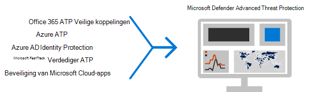

# De belangrijkste 12 taken voor beveiligings teams voor de ondersteuning van thuisgebruik

Als u tevreden bent met [Microsoft](https://www.microsoft.com/microsoft-365/blog/2020/03/10/staying-productive-while-working-remotely-with-microsoft-teams/) en plotseling uw eigen personeel op basis van het thuisgebruik ondersteunt, willen we u helpen te voorkomen dat uw organisatie zo veilig mogelijk werkt. In dit artikel worden de prioriteit van taken, zodat beveiligings teams de belangrijkste beveiligingsmogelijkheden zo snel mogelijk kunnen implementeren.

Als u een kleine of middelgrote organisatie hebt met een van de Business-abonnementen van Microsoft, raadpleegt u de volgende informatiebronnen:

- [De tien belangrijkste manieren om Office 365-en Microsoft 365 voor bedrijven-abonnementen te beveiligen](../admin/security-and-compliance/secure-your-business-data.md)
- [Microsoft 365 voor campagnes](https://docs.microsoft.com/microsoft-365/campaigns/) (bevat een aanbevolen beveiligingsconfiguratie voor microsoft 365 Business)

Voor klanten die onze Enterprise-abonnementen gebruiken, adviseert Microsoft de taken uit de volgende tabel die van toepassing zijn op uw serviceplan uit te voeren. Als u in plaats van een Enterprise-abonnement van Microsoft 365 te kopen, kunt u het volgende doen:

- Microsoft 365 E3 bevat Enterprise Mobility + Security (EMS) E3 en Azure AD P1
- Microsoft 365 E5 bevat EMS E5 en Azure AD P2

****

|Stap|Taak|Alle Office 365 Enterprise-abonnementen|Microsoft 365 E3|Microsoft 365 E5|
|---|---|---|---|---|
|1|[Azure multi-factor Authentication (MFA) inschakelen](#1-enable-azure-multi-factor-authentication-mfa)||||
|3|[Beveiligen tegen bedreigingen](#2-protect-against-threats)||||
|driefasig|[Microsoft Defender voor Office 365 configureren](#3-configure-microsoft-defender-for-office-365)||||
|3|[Microsoft Defender configureren voor identiteit](#4-configure-microsoft-defender-for-identity)||||
|vijf|[Microsoft 365 Defender inschakelen](#5-turn-on-microsoft-365-defender)||||
|zes|[De bescherming van intune mobiele apps configureren voor telefoons en tablets](#6-configure-intune-mobile-app-protection-for-phones-and-tablets)||||
|7,5|[MFA en voorwaardelijke toegang configureren voor gasten, waaronder de intune-app-beveiliging](#7-configure-mfa-and-conditional-access-for-guests-including-intune-mobile-app-protection)||||
|8:00|[Pc's registreren in Apparaatbeheer en compatibele Pc's vereisen](#8-enroll-pcs-into-device-management-and-require-compliant-pcs)||||
|aanhaling|[Uw netwerk optimaliseren voor Cloud connectiviteit](#9-optimize-your-network-for-cloud-connectivity)||||
|10|[Gebruikers wegwijs maken](#10-train-users)||||
|23:00|[Aan de slag met Microsoft Cloud App Security](#11-get-started-with-microsoft-cloud-app-security)||||
|12|[Monitoren voor bedreigingen en actie ondernemen](#12-monitor-for-threats-and-take-action)||||
|

Voordat u begint, controleert u de [Secure Score van Microsoft 365](https://docs.microsoft.com/microsoft-365/security/mtp/microsoft-secure-score) in het microsoft 365 Beveiligingscentrum. Vanuit een gecentraliseerd dashboard kunt u de beveiliging van uw Microsoft 365-identiteiten, gegevens, apps, apparaten en infrastructuur controleren en verbeteren. U krijgt punten voor het configureren van aanbevolen beveiligingsfuncties, het uitvoeren van beveiligingstaken (zoals het weergeven van rapporten) of het adresseren van aanbevelingen met een toepassing of software van derden. In de aanbevolen taken in dit artikel wordt de Score verhoogd.

## 1: Azure multi-factor Authentication (MFA) inschakelen

De beste manier om de beveiliging te verbeteren voor werknemers die in huis werken, is MFA inschakelen. Als u nog geen processen hebt, beschouwt u dit als een proefproduct voor noodgevallen en zorgt u ervoor dat u voor de ondersteuning van medewerkers die aan de slag gaan. Aangezien u waarschijnlijk geen hardware-beveiligingsapparaten kunt distribueren, kunt u gebruikmaken van Windows hello biometrie en smartphone Authentication-apps, zoals Microsoft Authenticator.

Normaalgesproken wordt Microsoft aangeraden gebruikers 14 dagen te machtigen voor meervoudige verificatie voordat MFA wordt vereist. Als uw medewerkers plotseling thuis werken, moet u er wel voor zorgen dat MFA als beveiligings prioriteit wordt gebruikt en kan worden ingesteld dat gebruikers deze nodig hebben.

Het toepassen van deze beleidsregels duurt slechts een paar minuten, maar het is voorbereid dat uw gebruikers de volgende enkele dagen ondersteunen.

****

|Abonnement|Aanbeveling|
|---|---|
|Microsoft 365-abonnementen (zonder Azure AD P1 of P2)|[Schakel standaardinstellingen voor beveiliging in Azure AD in](https://docs.microsoft.com/azure/active-directory/fundamentals/concept-fundamentals-security-defaults). De standaardinstellingen voor beveiliging in Azure AD omvatten MFA voor gebruikers en beheerders.|
|Microsoft 365 E3 (met Azure AD P1)|Gebruik [algemeen beleid voor voorwaardelijke toegang](https://docs.microsoft.com/azure/active-directory/conditional-access/concept-conditional-access-policy-common) om het volgende beleid te configureren:  - [MFA vereisen voor beheerders](https://docs.microsoft.com/azure/active-directory/conditional-access/howto-conditional-access-policy-admin-mfa)  - [MFA vereisen voor alle gebruikers](https://docs.microsoft.com/azure/active-directory/conditional-access/howto-conditional-access-policy-all-users-mfa)   - [Verouderde verificatie blokkeren](https://docs.microsoft.com/azure/active-directory/conditional-access/howto-conditional-access-policy-block-legacy)|
|Microsoft 365 E5 (met Azure AD P2)|Als u gebruikmaakt van Azure AD Identity Protection, begint u het implementeren van de [aanbevolen set beleidsregels voor voorwaardelijke toegang en verwante beleidsregels](./office-365-security/identity-access-policies.md) van Microsoft door de volgende twee beleidsregels te maken:  - [MFA vereisen bij een normaal of hoog risico bij het aanmelden](./office-365-security/identity-access-policies.md#require-mfa-based-on-sign-in-risk)  - [Clients blokkeren die moderne verificatie niet ondersteunen](./office-365-security/identity-access-policies.md#block-clients-that-dont-support-modern-authentication) - [Gebruikers met een hoog risico moeten het wachtwoord wijzigen](./office-365-security/identity-access-policies.md#high-risk-users-must-change-password)|
|

## 2: beveiliging tegen bedreigingen

Voor alle Microsoft 365-abonnementen zijn diverse bedreigingen beveiligingsfuncties beschikbaar. Het minder bescherming van deze functies duurt slechts een paar minuten.

- Beveiliging tegen malware
- Beveiliging van schadelijke Url's en bestanden
- Bescherming tegen phishing
- Beveiliging tegen ongewenste e-mail

Zie [beschermen tegen bedreigingen in Office 365](office-365-security/protect-against-threats.md) voor hulp bij het begin van de richtlijnen die u kunt gebruiken als uitgangspunt.

## 3: Microsoft Defender voor Office 365 configureren

Microsoft Defender voor Office 365, inbegrepen in Microsoft 365 E5 en Office 365 E5, beschermt uw organisatie tegen kwaadaardige bedreigingen via e-mailberichten, koppelingen (Url's) en samenwerkingsprogramma's. Het kan enkele uren duren voordat het is geconfigureerd.

Microsoft Defender voor Office 365:

- Beschermt uw organisatie tegen onbekende e-mail bedreigingen in realtime met behulp van intelligente systemen die bijlagen en koppelingen voor schadelijke inhoud controleren. Deze geautomatiseerde systemen bestaan uit een robuust platform, heuristiek en machine learning-modellen.
- Beschermt uw organisatie wanneer gebruikers bestanden samenwerken en delen door kwaadaardige bestanden in team sites en documentbibliotheken op te sporen en te blokkeren.
- Hiermee past u machine learning modellen en geavanceerde imitatie algoritmen voor fraude detectie toe.

Zie voor een overzicht van een abonnement, waaronder een overzicht van de abonnementen, de [Defender voor Office 365](office-365-security/office-365-atp.md).

Uw globale beheerder kan deze beveiligingsinstellingen configureren:

- [Beleidsregels voor veilige koppelingen instellen](office-365-security/set-up-atp-safe-links-policies.md)
- [Algemene instellingen configureren voor veilige koppelingen](office-365-security/configure-global-settings-for-safe-links.md)
- [Beleidsregels voor veilige bijlagen instellen](office-365-security/set-up-atp-safe-attachments-policies.md)

U moet samenwerken met uw Exchange Online-beheerder en de SharePoint Online-beheerder om Defender voor Office 365 te configureren voor de volgende werkbelasting:

- [ATP voor SharePoint, OneDrive en Microsoft Teams](office-365-security/atp-for-spo-odb-and-teams.md)

## 4: Microsoft Defender voor identiteit configureren

[Microsoft Defender for Identity](https://docs.microsoft.com/azure-advanced-threat-protection/what-is-atp) is een op de cloud gebaseerde beveiligingsoplossing waarmee u uw on-premises Active Directory-signaleren identificeert, opspoort en onderzoekt naar geavanceerde bedreigingen, compromisloze identiteiten en schadelijke Insider-acties die u in uw organisatie worden doorgestuurd. Richt u op de volgende oorzaak omdat uw on-premises beheerder en de Cloud infrastructuur geen afhankelijkheden of vereisten hebben en er direct voordelen kunnen bestaan.

- Zie [Microsoft Defender voor de identiteits introductie](https://docs.microsoft.com/azure-advanced-threat-protection/install-atp-step1) om snel te kunnen instellen
- Bekijk de [video: Inleiding tot Microsoft Defender voor identiteit](https://www.youtube.com/watch?reload=9&v=EGY2m8yU_KE)
- De [drie fasen van Microsoft Defender voor identiteits implementatie](https://docs.microsoft.com/azure-advanced-threat-protection/what-is-atp#whats-next) bekijken

## 5: Microsoft 365 Defender inschakelen

Nu u Microsoft Defender voor Office 365 en Microsoft Defender voor de identiteit hebt geconfigureerd, kunt u de gecombineerde signalen van deze mogelijkheden in één dashboard weergeven. In [Microsoft 365 Defender](https://docs.microsoft.com/microsoft-365/security/mtp/microsoft-threat-protection) worden waarschuwingen, incidenten, geautomatiseerd onderzoek en antwoord, en de geavanceerde jacht voor de werkbelasting (Microsoft Defender for identiteit, Defender for Office 365, Microsoft Defender voor eindpunten en beveiliging van de Cloud app) in één deelvenster op [Security.Microsoft.com](https://security.microsoft.com).

Wanneer u een of meer van de services van de versie van de Defender voor Office 365-Services hebt geconfigureerd, schakelt u MTP in. Nieuwe functies worden continu toegevoegd aan MTP. u kunt ook kiezen voor het ontvangen van Voorbeeldfuncties.

- [Meer informatie over MTP](https://docs.microsoft.com/microsoft-365/security/mtp/microsoft-threat-protection)
- [MTP inschakelen](https://docs.microsoft.com/microsoft-365/security/mtp/mtp-enable)
- [Opt-in voor Voorbeeldfuncties](https://docs.microsoft.com/microsoft-365/security/mtp/preview)

## 6: de bescherming van de mobiele app configureren voor telefoons en tablets

Met Microsoft intune Mobile Application Management (MAM) kunt u de gegevens van uw organisatie beheren en beschermen op telefoons en tablets zonder deze apparaten te beheren. Dit werkt als volgt:

- U maakt een app-beveiligingsbeleid (APP) om te bepalen welke apps op een apparaat worden beheerd en welke gedrag wel of niet worden toegestaan (omdat het niet mogelijk is om te voorkomen dat er gegevens worden gekopieerd naar een niet-beheerde app). U maakt één beleid voor elk platform (iOS, Android).
- Nadat u het app-beveiligingsbeleid hebt gemaakt, moet u deze afdwingen door een regel voor voorwaardelijke toegang in azure AD te maken om goedgekeurde apps en APP-gegevensbeveiliging te vereisen.

Het beleid voor APP-beveiliging omvat tal van instellingen. Gelukkig hoeft u niet elke instelling te leren kennen en de opties te wegen. Microsoft maakt het eenvoudig een configuratie van instellingen toe te passen door beginpunten aan te bevelen. De [Data Protection Framework met behulp van app-beveiligingsbeleid](https://docs.microsoft.com/mem/intune/apps/app-protection-framework) omvat drie niveaus waaruit u kunt kiezen.

Nog beter, Microsoft coördineert dit app-beveiligings raamwerk met een set voorwaardelijke toegang en gerelateerde beleidsregels die alle organisaties gebruiken als uitgangspunt. Als u MFA met behulp van de richtlijnen in dit artikel hebt geïmplementeerd, bent u op de helft.

Als u de bescherming voor mobiele apps wilt configureren, volgt u de richtlijnen in [veelgebruikte beleidsregels voor identiteit en toegang tot apparaten](./office-365-security/identity-access-policies.md):

 1. Gebruik de richtlijnen voor het [toepassen van app Data Protection-beleid](./office-365-security/identity-access-policies.md#apply-app-data-protection-policies) voor het maken van beleid voor IOS en Android. Niveau 2 (Enhanced Data Protection) wordt aanbevolen voor basisbescherming.
 2. Maak een regel voor voorwaardelijke toegang voor het [vereisen van goedgekeurde apps en app-beveiliging](./office-365-security/identity-access-policies.md#require-approved-apps-and-app-protection).

## 7: MFA en voorwaardelijke toegang configureren voor gasten, waaronder de bescherming van de mobiele app

Vervolgens moet u ervoor zorgen dat u kunt blijven samenwerken aan en werken met gasten. Als u het Microsoft 365 E3-abonnement gebruikt en MFA voor alle gebruikers hebt geïmplementeerd, bent u ingesteld.

Als u het Microsoft 365 E5-abonnement gebruikt en u zich profiteert van Azure Identity Protection voor MFA-MFA, moet u een paar wijzigingen aanbrengen (omdat Azure AD Identity Protection niet wordt uitgebreid naar gasten):

- Maak een nieuwe regel voor voorwaardelijke toegang zodat MFA altijd is vereist voor gasten en externe gebruikers.
- Update de regel voor voorwaardelijke toegang op basis van risico op basis van risico voor het uitsluiten van gasten en externe gebruikers.

Gebruik de instructies in [Update the common policies om gast en externe toegang toe te staan en te beschermen](./office-365-security/identity-access-policies-guest-access.md) om te begrijpen hoe gasttoegang werkt met Azure AD en om het betreffende beleid bij te werken.

Het beleid dat u hebt gemaakt met de functie voor het intune-beleid voor de mobiele app die u hebt gemaakt, samen met de regel voor voorwaardelijke toegang voor het vereisen van goedgekeurde apps en APP-beveiliging, van toepassing op gasten accounts

> [!NOTE]
> Als u al Pc's in Apparaatbeheer hebt geregistreerd om compatibele Pc's te vereisen, moet u ook gastaccounts uitsluiten van de regel voor voorwaardelijke toegang waarmee de apparaatcompatibiliteit wordt afgedwongen.

## 8: Pc's registreren in Apparaatbeheer en compatibele Pc's vereisen

U kunt op verschillende manieren de apparaten van uw personeel registreren. Elke methode is afhankelijk van het eigendom (persoonlijk of zakelijk) van het apparaat, het type apparaat (iOS, Windows, Android) en de beheervereisten (opnieuw instellen, affiniteit, vergrendelen). Dit kan wat tijd in beslag nemen. Zie: [Schrijf apparaten in Microsoft intune](https://docs.microsoft.com/mem/intune/enrollment/).

De snelste manier om aan de slag te gaan met het [instellen van automatische inschrijving voor Windows 10-apparaten](https://docs.microsoft.com/mem/intune/enrollment/quickstart-setup-auto-enrollment).

U kunt ook profiteren van de volgende zelfstudies:

- [Auto Pilot gebruiken om Windows-apparaten in intune te registreren](https://docs.microsoft.com/mem/intune/enrollment/tutorial-use-autopilot-enroll-devices)
- [De inschrijvings functies van Apple Business-apparaten gebruiken in Apple Business Manager (ABM) voor het registreren van iOS-iPadOS-apparaten in intune](https://docs.microsoft.com/mem/intune/enrollment/tutorial-use-device-enrollment-program-enroll-ios)

Wanneer u de apparaten registreert, volgt u de richtlijnen in [common Identity-en Apparaattoegang voor beleids](./office-365-security/identity-access-policies.md) regels om deze beleidsregels te maken:

- [Beleid voor naleving van apparaat definiëren](./office-365-security/identity-access-policies.md#define-device-compliance-policies) : de aanbevolen instellingen voor Windows 10 bevatten antivirusbeveiliging. Als u Microsoft 365 E5 hebt, kunt u Microsoft Defender voor eindpunt gebruiken om de status van werknemers apparaten te bewaken. Zorg ervoor dat nalevingsbeleid voor andere besturingssystemen antivirussoftware en bescherming tegen eindpunten omvat.
- [Compatibele Pc's vereisen](./office-365-security/identity-access-policies.md#require-compliant-pcs-but-not-compliant-phones-and-tablets) : dit is de regel voor voorwaardelijke toegang in azure AD die het beleid voor naleving van apparaatcompatibiliteit afdwingt.

Er kan slechts één organisatie een apparaat beheren, dus zorg ervoor dat u Gastaccounts uitsluiten van de regel voor voorwaardelijke toegang in azure AD. Als u gast en externe gebruikers niet uitsluiten van beleidsregels waarvoor de naleving van een apparaat is vereist, blok keert dit beleid deze gebruikers. Zie voor meer informatie [het artikel common policies bijwerken om gast en externe toegang toe te staan en te beveiligen](./office-365-security/identity-access-policies-guest-access.md).

## 9: uw netwerk optimaliseren voor Cloud connectiviteit

Als u snel aan de slag wilt met uw werknemers vanuit het buitenland, kan deze plotselinge overstap van verbindings patronen een significante invloed hebben op de infrastructuur van het bedrijfsnetwerk. Veel netwerken zijn zodanig aangepast dat de cloudservices werden goedgekeurd. In veel gevallen zijn netwerken tolerant voor externe medewerkers, maar konden ze niet door alle gebruikers tegelijk worden gebruikt.

Netwerkelementen zoals VPN-concentrator, Central Network outapparatuur (zoals proxy's en preventie van preventie van gegevensverlies), Central Internet bandbreedte, backhaul MPLS circuits, NAT-ondersteuning, zodat ze op een zeer zware stam worden geladen door ze te gebruiken. Het eindresultaat is een slechte prestaties en productiviteit, met een slechtere gebruikerservaring voor gebruikers die aan de slag gaan met thuis.

Sommige van de beschermings punten die u traditioneel hebt verstrekt door het routeren van verkeer via een bedrijfsnetwerk, worden geleverd door de Cloud-apps waartoe uw gebruikers toegang hebben. Als u deze stap in dit artikel hebt bereikt, hebt u een set geavanceerde Cloud beveiligingscontroles voor Microsoft 365-Services en-gegevens geïmplementeerd. Wanneer deze besturingselementen op hun plaats staan, kunt u het verkeer van externe gebruikers rechtstreeks naar Office 365 sturen. Als u nog steeds een VPN-koppeling voor andere toepassingen nodig hebt, kunt u uw prestaties en de gebruikerservaring enorm verbeteren door gesplitste tunneling te implementeren. Wanneer u akkoord bent gekomen binnen de organisatie, kunt u dit binnen één dag doen met een goed gecoördineerd netwerkteam.

Zie de volgende bronnen op documenten voor meer informatie:

- [Overzicht: connectiviteit optimaliseren voor externe gebruikers die gebruikmaken van gesplitste tunneling via VPN](https://docs.microsoft.com/Office365/Enterprise/office-365-vpn-split-tunnel)
- [Gesplitste VPN-tunneling implementeren voor Office 365](https://docs.microsoft.com/Office365/Enterprise/office-365-vpn-implement-split-tunnel)

Recente blog artikelen over dit onderwerp:

- [Hoe u snel verkeer voor externe medewerkers kunt optimaliseren & de belasting van uw infrastructuur te verminderen](https://techcommunity.microsoft.com/t5/office-365-blog/how-to-quickly-optimize-office-365-traffic-for-remote-staff-amp/ba-p/1214571#)
- [Andere manieren om beveiligings professionals te laten profiteren van moderne beveiligingsfuncties in de unieke methoden voor extern werken van vandaag](https://www.microsoft.com/security/blog/2020/03/26/alternative-security-professionals-it-achieve-modern-security-controls-todays-unique-remote-work-scenarios/)

## 10: gebruikers trainen

Gebruikers kunnen gebruikers en uw beveiligingsactiviteiten team veel tijd en frustraties opslaan. Gebruikers met een betrouwbare gebruikers hebben minder waarschijnlijk bijlagen te openen, of klik op koppelingen in dubieuze e-mailberichten, en het is waarschijnlijk dat ze verdachte websites vermijden.

The Harvard Kennedy School [Cyber Security Campaign Handbook](https://go.microsoft.com/fwlink/?linkid=2015598&amp;clcid=0x409) biedt uitstekende richtlijnen voor het vaststellen van een sterke cultuur voor beveiliging binnen uw organisatie, waaronder gebruikers van de opleiding waarmee u phishing-aanvallen kunt identificeren.

Microsoft 365 biedt de volgende bronnen om gebruikers in uw organisatie op de hoogte te stellen:

****

|Definitie|Resources|
|---|---|
|Microsoft 365|[Aanpasbare leer paden](https://docs.microsoft.com/office365/customlearning/) 
Deze informatiebronnen kunnen u helpen bij het samenvoegen van trainingen voor eindgebruikers in uw organisatie.|
|Microsoft 365-beveiliging|[Leermodule: Beveilig uw organisatie met ingebouwde, intelligente beveiliging van Microsoft 365](https://docs.microsoft.com/learn/modules/security-with-microsoft-365) 
In deze module kunt u beschrijven hoe Microsoft 365 beveiligingsfuncties samenwerken en de voordelen van deze beveiligingsfuncties gelen.|
|Meervoudige verificatie|[Verificatie in twee stappen: wat is de pagina extra verificatie?](https://docs.microsoft.com/azure/active-directory/user-help/multi-factor-authentication-end-user-first-time) 
Dit artikel helpt eindgebruikers inzicht te krijgen in een meervoudige verificatie en hoe deze worden gebruikt in uw organisatie.|
|

Naast deze richtlijnen wordt door Microsoft aanbevolen dat uw gebruikers de in dit artikel beschreven acties uitvoeren: [uw account en apparaten beschermen tegen hackers en malware](https://support.office.com/article/066d6216-a56b-4f90-9af3-b3a1e9a327d6.aspx). Dit zijn de volgende acties:

- Sterke wachtwoorden gebruiken
- Apparaten beschermen
- Beveiligingsfuncties inschakelen op computers met Windows 10 en Mac (voor niet-beheerde apparaten)

Microsoft adviseert gebruikers hun persoonlijke e-mailaccounts ook te beschermen door de acties uit te voeren die worden aanbevolen in de volgende artikelen:

- [Uw e-mailaccount van Outlook.com helpen beschermen](https://support.microsoft.com/office/a4f20fc5-4307-4ece-8231-6d4d4bd8a9ba)

- [Uw Gmail-account beschermen met verificatie in twee stappen](https://go.microsoft.com/fwlink/p/?linkid=2015688)

## 11: aan de slag met de beveiliging van de Cloud-app van Microsoft

De beveiliging van de [Microsoft Cloud-app](https://docs.microsoft.com/cloud-app-security) biedt uitgebreide zichtbaarheid, controle over gegevens reizen en geavanceerde analyses voor het identificeren en bestrijden van cyberthreats in alle Cloud Services. Wanneer u aan de slag wilt met de beveiliging van de Cloud app, worden de beleidsregels voor detectie van anomaliedetectie automatisch ingeschakeld, maar is de beveiliging van de Cloud app een initiële leer periode van zeven dagen waarover niet alle anomaliedetectie waarschuwingen worden verhoogd.

Aan de slag met de Cloud-app-beveiliging nu. Later kunt u meer geavanceerde controle en besturingselementen instellen.

- [Snelstartgids: aan de slag met Cloud-app-beveiliging](https://docs.microsoft.com/cloud-app-security/getting-started-with-cloud-app-security)
- [Detectie van directe gedrags analyses en anomaliedetectie](https://docs.microsoft.com/cloud-app-security/anomaly-detection-policy)
- [Meer informatie over beveiliging van de Cloud-app van Microsoft](https://docs.microsoft.com/cloud-app-security/what-is-cloud-app-security)
- [Bekijk de nieuwe functies en mogelijkheden](https://docs.microsoft.com/cloud-app-security/release-notes)
- [Zie eenvoudige installatie-instructies](https://docs.microsoft.com/cloud-app-security/general-setup)

## 12: monitoren voor bedreigingen en actie ondernemen

Microsoft 365 omvat verschillende manieren om de status te controleren en de juiste acties uit te voeren. Uw beste startpunt is het Microsoft 365-Beveiligingscentrum ( [https://security.microsoft.com](https://security.microsoft.com) ), waar u de [Microsoft Secure Score](https://docs.microsoft.com/microsoft-365/security/mtp/microsoft-secure-score)van uw organisatie kunt bekijken, en eventuele waarschuwingen of entiteiten waarvoor u aandacht moet besteden.

- [Aan de slag met Microsoft 365 Beveiligingscentrum](https://docs.microsoft.com/microsoft-365/security/mtp/overview-security-center)
- [Rapporten controleren en bekijken](https://docs.microsoft.com/microsoft-365/security/mtp/monitoring-and-reporting)
- [Zie de portals voor beveiliging in Microsoft 365](https://docs.microsoft.com/microsoft-365/security/mtp/portals)

## Volgende stappen

Gefeliciteerd! U hebt snel enkele van de belangrijkste beveiligings bescherming geïmplementeerd en uw organisatie is veel veiliger. U kunt nu nog verder gaan met de mogelijkheden van bedreigingsbeveiliging (waaronder Microsoft Defender voor eindpunt), functies voor gegevensclassificatie en beveiliging, en om administratieve accounts te beveiligen. Voor een lager, zeer uitgebreidere beveiligingsaanbevelingen voor Microsoft 365, raadpleegt [u Microsoft 365 Security for Business decisioners (BDMs)](Microsoft-365-security-for-bdm.md).

Bezoek ook het nieuwe Beveiligingscentrum van Microsoft op [docs.Microsoft.com/security](https://docs.microsoft.com/security).
