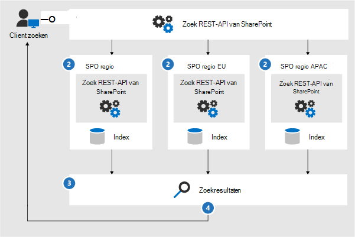

# Microsoft 365 Architecture-pictogrammen en-sjablonen

U helpen onze partners en klanten ontwerpen en architect nieuwe oplossingen zijn belangrijk. Architectuur diagrammen zoals deze in onze richtlijnen kunnen helpen bij het communiceren van ontwerpbeslissingen en de relaties tussen onderdelen in een omgeving. We gebruiken een reeks symbolen en pictogrammen samen met Visio-sjablonen om de architectuur diagrammen te maken en deze hulpmiddelen te bieden om u te helpen bij het maken van een aangepast Architecture diagram voor uw volgende oplossing.

U kunt deze pictogrammen, symbolen en sjablonen weergeven in de downloadbare bestanden op de volgende pagina's:

- [Productiviteits illustraties](productivity-illustrations.md)
- [Modellen voor Microsoft-cloudarchitectuur](cloud-architecture-models.md)

## Voorwaarden en download

Microsoft staat het gebruik van deze pictogrammen toe in architecturale diagrammen, trainingsmateriaal of documentatie. U mag alleen de pictogrammen kopiëren, distribueren en weergeven voor het toegestane gebruik, tenzij u expliciete toestemming van Microsoft hebt toegekend. Microsoft reserves all other rights.

 > [!div class="button"]
 > [SVG-en PNG-pictogrammen downloaden](https://go.microsoft.com/fwlink/?linkid=869455)

 > [!div class="button"]
 > [Visio-sjablonen en-stencils downloaden](https://go.microsoft.com/fwlink/?linkid=2056186)

## Voorbeelden van architectuur diagrammen

U kunt deze pictogrammen en sjablonen gebruiken om diagrammen te maken zoals de volgende voorbeelden:

1. Voorbeeld van een zoek architectuurdiagram voor SharePoint:

    

2. Architectuurdiagram levenscyclus van teams:

    
