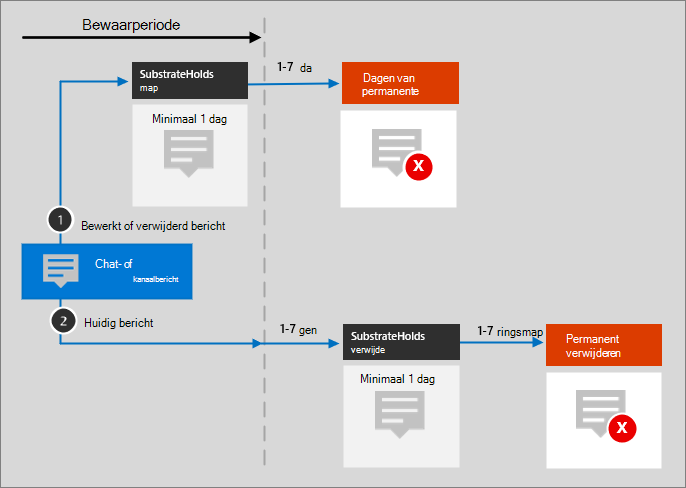

# Microsoft 365 architectuurpictogrammen en -sjablonenMicrosoft 365 architecture icons and templates

Het is belangrijk om onze partners en klanten te helpen bij het ontwerpen en ontwerpen van nieuwe oplossingen.Helping our partners and customers design and architect new solutions is important. Architectuurdiagrammen zoals die in onze richtlijnen worden opgenomen, kunnen helpen bij het communiceren van ontwerpbeslissingen en de relaties tussen onderdelen in een omgeving.Architecture diagrams like those included in our guidance can help communicate design decisions and the relationships between components in an environment. We gebruiken een set symbolen en pictogrammen samen met Visio-sjablonen om de architectuurdiagrammen te maken die we producteren en bieden deze hulpmiddelen hier om u te helpen een aangepast architectuurdiagram te maken voor uw volgende oplossing.We use a set of symbols and icons along with Visio templates to create the architecture diagrams we product and are providing these tools here to help you build a custom architecture diagram for your next solution.

U kunt deze pictogrammen, symbolen en sjablonen in actie zien in downloadbare bestanden die beschikbaar zijn op de volgende pagina's:You can see these icons, symbols, and templates in action in downloadable files available on the following pages:

- [ProductiviteitsillustratiesProductivity illustrations](productivity-illustrations.md)
- [Modellen voor Microsoft-cloudarchitectuurMicrosoft cloud architecture models](cloud-architecture-models.md)

## Voorwaarden en downloadenTerms and download

Microsoft staat het gebruik van deze pictogrammen toe in architectuurdiagrammen, trainingsmateriaal of documentatie.Microsoft permits the use of these icons in architectural diagrams, training materials, or documentation. U mag de pictogrammen alleen kopiëren, distribueren en weergeven voor het toegestane gebruik, tenzij microsoft expliciete toestemming heeft verleend.You may copy, distribute, and display the icons only for the permitted use unless granted explicit permission by Microsoft. Microsoft reserves all other rights.Microsoft reserves all other rights.

 > [!div class="button"]
 > [SVG- en PNG-pictogrammen downloadenDownload SVG and PNG icons](https://go.microsoft.com/fwlink/?linkid=869455)

 > [!div class="button"]
 > [Sjablonen Visio stencils downloadenDownload Visio templates and stencils](https://go.microsoft.com/fwlink/?linkid=2056186)

## VoorbeeldarchitectuurdiagrammenExample architecture diagrams

U kunt deze pictogrammen en sjablonen gebruiken om diagrammen te maken, zoals de volgende voorbeelden:You can use these icons and templates to create diagrams like the following examples:

1. Voorbeeld van zoekarchitectuurdiagram voor SharePoint:Example search architecture diagram for SharePoint:

    

2. Teams architectuurdiagram voor de bewaarcyclus:Teams retention lifecycle architecture diagram:

    
